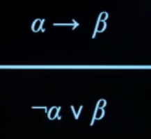
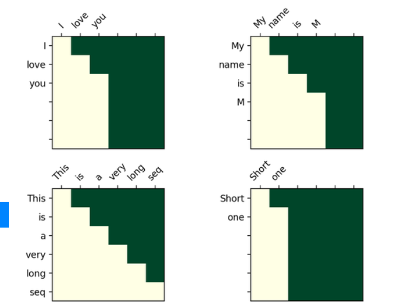
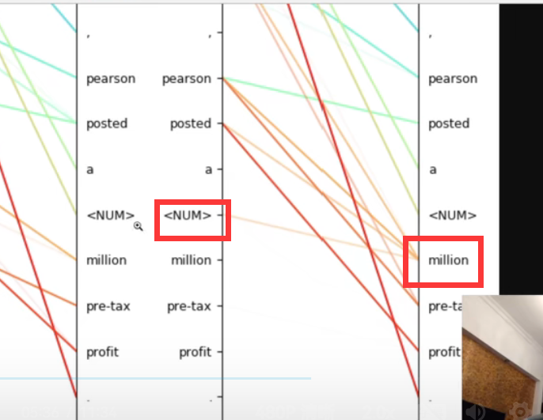
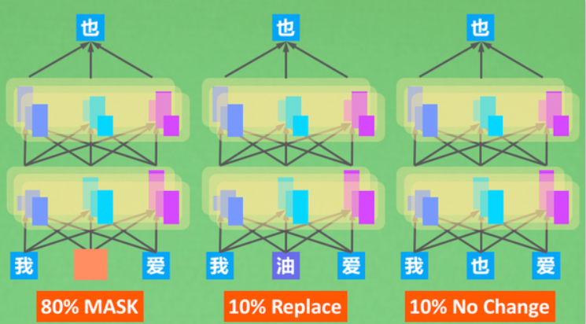

# 人工智能

## 知识

这节课讨论的是 如何让人工智能有逻辑，能够推理事情

（这节课实际上是在复习离散数学）

### 句子sentence

### 命题逻辑 Propositional Logic


implication(->)  


biconditional(<->)  

#### model

P: lt is raining.

Q: lt is a Tuesday.

{P=true,Q=false}

#### knowledge base知识库
a set of sentences known by a knowledge-based agent
由一组基于命题逻辑的AI知道是真的句子组成


##### Entailment
需要/蕴含/包含于?
α |=β
ln every model in which sentence o is true,sentence β is also true.
在每一个α 句为真的模型中，句子β也是真的。


#### inference推理

the process of deriving new sentences from old ones
从旧句子中派生新句子的过程


P:  lt is a Tuesday.

Q:  lt is raining.

R: Harry will go for a run.
KB(知识库简写): (P^非Q)→R


##### Model Checking
模型检验

To determine if KB|=α:
若要确定KB|=α：

Enumerate all possible models.
枚举所有可能的模型。

lf in every model where KB is true, α is true, then KB entails α.
如果在每个模型中KB是真的，α是真的，那么KB包含α。

eg


Enumerate all the possible models,and look in those possible models

列举所有可能的模型，并查看这些可能的模型

to see whether or not if our knowledge base is true,

看看我们的知识库是否正确


 the query in question true as well.

该查询也是正确的。


##### Knowledge Engineering 知识工程

that is representable by a computer.

即如何抽象成计算机可以理解的语言。


**CLUE**

(mustard v plum v scarlet)

(ballroom v kitchen v library)

(knife v revolver v wrench)


这有一些编程 但是我们应该不考 而且是他自定义的类 所以没全放上来 虽然很精彩

```python
knowledge = And(
Or(mustard, plum,scarlet),
Or(ballroom, kitchen,library),
Or(knife,revolver, wrench)
)

knowledge.add(Not(mustard))
knowledge.add(Not(kitchen))
knowledge.add(Not(revolver))

```


##### Puzzles
谜题

Gilderoy,Minerva,Pomona and Horace each belong to a different one of the four houses: Gryffindor,Hufflepuff, Ravenclaw, and Slytherin House.. 

四个人.....分别属于四个不同的学院....

Gilderoy belongs to Gryffindor or Ravenclaw.

Gilderoy 属于格兰芬多或拉文克劳尔，

Pomona does not belong in Slytherin.

Pomona 不属于斯莱特林。

Minerva belongs to Gryffindor.
Minerva属于格兰芬多.


**Propositional Symbols**命题符号

真或假

4*4=16

GilderoyGryffindor GilderoyHufflepuff GilderoyRavenclaw  GilderoySlytherin

MinervaGryffindor MinervaHufflepuff  MinervaRavenclaw  MinervaSlytherin

PomonaGryffindor PomonaHufflepuff PomonaRavenclaw  PomonaSlytherin

HoraceGryffindor   HoraceHufflepuff   HoraceRavenclaw     HoraceSlytherin


##### Inference Rules 推理规则

**Modus Ponens** 惯性法

前提

——

结论


α ->β

α

——

β


**And Elimination** 和消除

.


  Harry is friends with Ron and Hermione.

————————————————————

  		Harry is friends with Hermione.


**Biconditional Elimination**

。


**De Morgan's Law  迪摩根定律**

。


**Distributive Property 分配定理**


**conjunctive normal form**
**合取范式**

logical sentence that is a conjunction of clauses
连接从句的逻辑句子

e.g. (A v B v C)^ (D v 非E)^(F v G)
例如(A v B v C)^(D v E)^(F v G)

（子句之内是或v 相连  子句之间是与^相连）


转换为合取范式CNF的步骤


**Inference by Resolution**

 To determine if KB|=  a:
 若要确定KB|=  a：

* Convert (KB A ^非a) to Conjunctive Normal Form.转换(KB|=  a)到连接CNF
* Keep checking to see if we can use resolution toproduce a new clause.继续检查，看看我们是否可以使用分辨率来产生一个新子句。
  * lf ever we produce the empty clause (equivalent to False), we have a contradiction, and KB|=α..
  * Otherwise, if we can't add new clauses, no entailment.
    ·如果我们产生空子句(等价于false)，我们就会有一个矛盾.否则，如果我们不能添加新的子句，则添加新的补充。


### **一阶逻辑 First-Order Logic **


比那个直接罗列出所有情况精简了很多（之前是4*4=16种情况）


通用量化


存在量化


## 遗传算法

https://www.bilibili.com/video/BV18W411B7og?p=13&vd_source=f2def4aba42c7ed69fc648e1a2029c7b

https://blog.csdn.net/wuwei178/article/details/104027741

https://my.oschina.net/u/4261825/blog/3874992

在机器学习中，我们可以对其进行仿生模仿，如果我们能得到**适应性函数**，那么我们可以由适应性来决定子代的存活概率，所有子代的概率之和为 1。举个简单的例子：假设在一个空间中，适应性是 x 和 y 的函数 f (x,y)，有两个个体（0.3, 0.7）（0.6, 0.2），突变算子会让这些值发生一些变化（如 0.3 变为 0.2），交叉互换法则则会交换不同值对的 x 和 y（如产生（0.3，0.2）），那么这些子代经过自然选择和不断繁衍，函数值高的存留下来，低的被淘汰，最终接近函数值最高点（也有可能只是在局部最高点中）。

另一种思路是我们不关心适应性具体的值，我们只关心所有候选者的排序，其适应性数值本身不作为决定的标准，这称为**排序空间法**（Rank Space Method）。排名第 1 的子代被选中的概率为 Pc，排名第 2 的子代概率为 (1-Pc)Pc，依次类推（也有可能困在局部最高点中）。


fi 是适应度函数  所有的pi加起来应为1


注意到为了避免困在局部极大值中，我们可以一开始选用长的步长，然后慢慢缩小步长，这称为**模拟退火**（Simulated Annealing），来源于对金属加热，会让原子震荡剧烈，慢慢退火冷却后，原子震荡也降低。

若是到达不了右上角，困在了局部最大值，可能是步长太小了，加大步长即可

鸿沟：


这叫做模拟退火：就想让金属冷却下来一样，因为一开始温度很高，步长（step size）很大，后面再减小步长


另外，如果困在局部最大值中，失去了多样性，那除了适应性，为什么我们不顺便测量**多样性**呢？考察同已选个体之间的差异。例如，我们在选择中，第一个选适应性最强的子代，第二个选择与第一个差异最大的个体，也就是多样性最强的，依次排序选择，当你达到最高区域时，可以不必再考虑多样性，你只需留下适应性最强的子代。

这样的话 既可以解决鸿沟，也可以达到最优解


其实，生物进化很直观，如果这个物种是地球最强者，环境变化也不明显，那么可能几亿年来，都没什么太大进化，局限于一个物种中。而对于更底层的物种，想要存活，就必须有一定的多样性，通过适应性不断进化。这是朴素的自然进化。

回过头来再看一下**遗传算法**（Genetic Algorithm），其中许多地方还是可以调控的。突变其实还是在爬山，生成一些扩散后用适应性指标来爬山，处理方式可以有很多选择；交叉互换就是企图将多个个体的优点综合到一个个体身上（这也是为什么很多人相亲时总会考虑后代的优良），也可以有许多选择；而从基因型向表型的转变，可以由设计者去决定；剩下的也都可以去设计调整。

来看一些实践应用吧。一个是在计划的编排上（需要一系列步骤），S1, S2, S3, ...，如果你有两个计划，那么你可以对两者进行重组，生成新计划。另一个是在赛马的预测上，如果你有一套完美的基于规则的专家系统，那么也许你可以预测出不同子代的存活概率，决定你的胜负。还有一个是如果你来设计一个类机器人，由不同的多面体构成，每个多面体具有不同的运动方式，其目标是让其运动最快 / 跳的最高 / 战斗力最强，那么在这过程中，你会看到衍生出了各种奇形怪状和奇怪姿势的机器人，但如果你的算法足够好，时间足够长，那么你能得到较完美的形态。

最后思考，具体应用中的遗传算法令人惊叹之处应该归功于编程者的心灵手巧，还是算法价值本身？其实真正的贡献在于**空间的丰富性和编程者的聪明才智，而不在于遗传算法本身有多好**。


### ------Lec 13. 学习：遗传算法 ------2018.09.01------

*这一讲继续讲机器学习方面的内容，主要内容是遗传算法，这是一种对生物和进化的模仿，教授首先介绍了相关的生物学知识 [0:00:00]。*

*第二部分，教授介绍了朴素的进化算法 [0:07:20]。*

*第三部分考虑了对算法的一些改进（包括模拟退火算法）[0:20:50]。*

*最后，教授介绍了一些遗传算法的例子，包括用方块模拟的生物进化 [0:35:10]。*

 

在繁衍生殖中，染色体会纠缠在一起进行**重组**，并进行细胞分裂（其中可能有**突变**或**交叉互换**），最后**基因型过渡成表型**，形成个体。这些不同的个体（携带不同的染色体组合）具有不同的**适应性**，影响存活到下一代的**概率**，经过**自然选择**，又从**表型转化为基因型**，从新开始下一轮的繁衍。

在机器学习中，我们可以对其进行仿生模仿，如果我们能得到**适应性函数**，那么我们可以由适应性来决定子代的存活概率，所有子代的概率之和为 1。举个简单的例子：假设在一个空间中，适应性是 x 和 y 的函数 f (x,y)，有两个个体（0.3, 0.7）（0.6, 0.2），突变算子会让这些值发生一些变化（如 0.3 变为 0.2），交叉互换法则则会交换不同值对的 x 和 y（如产生（0.3，0.2）），那么这些子代经过自然选择和不断繁衍，函数值高的存留下来，低的被淘汰，最终接近函数值最高点（也有可能只是在局部最高点中）。另一种思路是我们不关心适应性具体的值，我们只关心所有候选者的排序，其适应性数值本身不作为决定的标准，这称为**排序空间法**（Rank Space Method）。排名第 1 的子代被选中的概率为 Pc，排名第 2 的子代概率为 (1-Pc)Pc，依次类推（也有可能困在局部最高点中）。

注意到为了避免困在局部极大值中，我们可以一开始选用长的步长，然后慢慢缩小步长，这称为**模拟退火**（Simulated Annealing），来源于对金属加热，会让原子震荡剧烈，慢慢退火冷却后，原子震荡也降低。另外，如果困在局部最大值中，失去了多样性，那除了适应性，为什么我们不顺便测量**多样性**呢？考察同已选个体之间的差异。例如，我们在选择中，第一个选适应性最强的子代，第二个选择与第一个差异最大的个体，也就是多样性最强的，依次排序选择，当你达到最高区域时，可以不必再考虑多样性，你只需留下适应性最强的子代。

其实，生物进化很直观，如果这个物种是地球最强者，环境变化也不明显，那么可能几亿年来，都没什么太大进化，局限于一个物种中。而对于更底层的物种，想要存活，就必须有一定的多样性，通过适应性不断进化。这是朴素的自然进化。

回过头来再看一下**遗传算法**（Genetic Algorithm），其中许多地方还是可以调控的。突变其实还是在爬山，生成一些扩散后用适应性指标来爬山，处理方式可以有很多选择；交叉互换就是企图将多个个体的优点综合到一个个体身上（这也是为什么很多人相亲时总会考虑后代的优良），也可以有许多选择；而从基因型向表型的转变，可以由设计者去决定；剩下的也都可以去设计调整。

来看一些实践应用吧。一个是在计划的编排上（需要一系列步骤），S1, S2, S3, ...，如果你有两个计划，那么你可以对两者进行重组，生成新计划。另一个是在赛马的预测上，如果你有一套完美的基于规则的专家系统，那么也许你可以预测出不同子代的存活概率，决定你的胜负。还有一个是如果你来设计一个类机器人，由不同的多面体构成，每个多面体具有不同的运动方式，其目标是让其运动最快 / 跳的最高 / 战斗力最强，那么在这过程中，你会看到衍生出了各种奇形怪状和奇怪姿势的机器人，但如果你的算法足够好，时间足够长，那么你能得到较完美的形态。

最后思考，具体应用中的遗传算法令人惊叹之处应该归功于编程者的心灵手巧，还是算法价值本身？其实真正的贡献在于**空间的丰富性和编程者的聪明才智，而不在于遗传算法本身有多好**。


## NLP

文字与声音

**语音互转**

**笔记看这个：**

==**https://mofanpy.com/tutorials/machine-learning/nlp/**==

https://www.bilibili.com/video/BV1LA411n73X?p=4&vd_source=f2def4aba42c7ed69fc648e1a2029c7b


核心：

将句子转化为向量（向量包含词频等，例如你，我，毫无意义，就不会被搜索到）


看看向量夹角是不是最接近的


# 正排/倒排索引

[](https://static.mofanpy.com/static/results/ML-intro/nlp-search8.png)

我们总说自然语言处理（NLP）会让计算机懂得文字的内涵，但是有时候，有更加投机取巧的方法可以让计算机在不理解文字内涵的时候，还能给我们快速带来准确的结果。特别是在搜索中不得不提到的倒排索引技术。倒排索引是一种批量召回技术，它能快速在海量数据中初步召回基本符合要求的文章。

假设你开了家咨询公司，手上有100篇材料。这时有人来找你咨询NLP的问题，你会怎么在这100篇材料中找到合适的内容呢？

方法1：我们一篇一篇地阅读，找到所有包含NLP内容的材料，然后返回给提问者。这种方法需要我们在每次搜索的时候，都对所有材料进行一次阅读，然后在材料中找到关键词，并筛选出材料，效率其实非常差。

[](https://static.mofanpy.com/static/results/ML-intro/nlp-search9.png)

方法2：我们在第一次拿到所有材料时，把它们通读一遍，然后构建关键词和文章的对应关系。当用户在搜索特定词的时候，比如“红”，就会直接返回“红”这个【关键词索引】下的文章列表。先构造索引的好处就是能够将这种索引，放在后续的搜索中复用，搜索也就变成了一种词语匹配加返回索引材料的过程。

这里的 方式1是我们所谓的正排索引，方式2是更加快速的倒排索引。但当处理的是海量数据的时候，通过倒排索引找到的文章可能依然是海量。如果能有种方法对这些文章进行排序操作，再选取排名靠前的文章列表也能帮我们节省大量的时间。处理匹配排序，最有名的算法之一叫做TF-IDF。

# TF-IDF

[](https://static.mofanpy.com/static/results/ML-intro/nlp-search10.png)

先来看看TF-IDF所处的位置是哪里吧，有了批量性地召回相对合适的内容后，比如我已经从1亿个网页中召回了100万个，但100万对于我来说，已经够让我看上好几年了。怎么能再继续提升一下精确度，找到我更在乎的内容呢？

那么对筛选出来的内容做一个【问题与内容】的相似度排序，只返回那些头部内容就好啦。这个工作显然还是有一定的计算量的，所以如果前面不做召回，在1亿个网页中直接用打分排序的逻辑，往往还是挺久的。所以最好是将召回作为初步筛选，然后再相似度打分找到我在乎的内容，从而减轻计算负担。

[](https://static.mofanpy.com/static/results/ML-intro/nlp-search11.png)

直接看TF-IDF的名词解释，可能比较晦涩难懂。一个是词频，一个是逆文本频率指数，Oh Nooo, 反正我当初是没有一遍看懂。我来说人话。如果是你，在将搜索问题当中的词与文章中的词比对时，我们可能要找到文章中的关键词才能比较好对比，那么你怎么确定文章中哪些词是重要的。或者一篇文章，它可以用哪些词表达出来？

有人会说，在一篇文章中，越重要的内容，强调的次数也越多，所以频率（TF）会大，我们可以用词频高的词代表这篇文章。所以TF可以用一张词和文章标号的表来展示。不过问题来了，像语气词或“你我他”这种词，同样也会出现很多次，光用TF，我们没办法除去这些词的影响。而TF-IDF中的IDF，就可以在这个时候帮上忙，它是所有词在这个系统中的区分力的大小，如果每篇文章里都有“我”这个字，那么它的在任意一篇文章当中的区分力都不强，而如果你关键词搜索的是“莫烦”，那么全网都没有几个叫“莫烦”的，“莫烦”IDF就会很大，意味着“莫烦”的区分力也够强。

如果说TF是以文章为中心的局部词信息，那么IDF则是全局的词信息。TF无法得知哪些词在全局中算垃圾词，但IDF可以呀。要不把它们俩结合一下？当然行，如果把TF和IDF变成相亲相爱的一家人，结合他们俩不同的优势，就能用TF-IDF信息来表达一篇文章啦。

[](https://static.mofanpy.com/static/results/ML-intro/nlp-search12.png)

TF-IDF 两者结合其实就是两者相乘的意思，这样的结果意味着所有的文章，都能用一串集合所有词的分数来表示。通过分数的高低，我们也能大概看出这篇文章的关键内容是什么。比如第一篇，虽然TF告诉我们文章中“爱”这个字最多，但是IDF却告诉我们“莫烦”在文章中更具有代表性，所以根据TF-IDF的结合，这篇文章更具有“莫烦”属性。我们在搜索时又都经历了什么呢？

[](https://static.mofanpy.com/static/results/ML-intro/nlp-search13.png)

假设我们搜索关键词“莫烦Python”,机器会利用词表的模式计算“莫烦Python”这个问题的TF-IDF值。然后会计算问句和每篇文章的cosine距离，这个例子中的计算过程，简单来说，就是将文章按照词的维度放到一个四维空间中，（这里我画不了四维，我就用个三维空间说明一下）然后把问句同样也放到这个空间里，最后看空间中这个问题离哪一个文章的距离最近，越近则相似度越高。通过这样的方式呢，我们就能找到搜索问题的最佳匹配文章了。

说到这里，我不得不提到一个在NLP问题中非常重要的东西，那就是向量。我们刚刚把问句或者是文章，用数字的模式，投射到空间中，都是将问句或文章转变成向量，然后按照向量的模式指向空间中的某个位置。

[](https://static.mofanpy.com/static/results/ML-intro/nlp-search14.png)

举个例子，第一串数字就是文章1的向量表达，第二串是文章2的向量表达，第三串是问题的向量表达。他们都是空间中的点。（以后当我们接触到NLP模型的时候，你会不断听到词向量，句向量，文章向量等等不同的向量表达形式。）而今天我们虽然没有用深度学习，但是TF-IDF何尝不也是一种向量表达形式呢？在后续的教学中，我们再继续探索NLP当中有趣的向量表达和应用吧。

我们今天认识了搜索引擎的基本原理，但是现实中的搜索引擎可不仅仅只有倒排索引和TF-IDF,它还汇集了更多人类智慧的精华，值得我们进一步探索。


# 什么是CBOW

CBOW 是 Continuous Bag-of-Word 的简称，同篇[论文](https://arxiv.org/pdf/1301.3781.pdf)中， 还有另外一个一起提出的，十分相似的模型，Skip-Gram, 我们会在[下一节内容](https://mofanpy.com/tutorials/machine-learning/nlp/skip-gram/)中继续阐述Skip-Gram. 那么这个CBOW是什么个东西呢？用一句话概述：**挑一个要预测的词，来学习这个词前后文中词语和预测词的关系**。

举个例子吧，有这样一句话。

```
我爱莫烦Python，莫烦Python通俗易懂。
```

模型在做的事情如图中所示，将这句话拆成输入和输出，用前后文的词向量来预测句中的某个词。


分类之后有间谍(故意写错的，将9放进数字和字母中)，这样他就会处在中间


# 什么是Skip-Gram

 [CBOW](https://mofanpy.com/tutorials/machine-learning/nlp/cbow/) 有着这样的结构，使用上下文来预测上下文之间的结果。

 Skip-Gram 则是把这个过程反过来,使用文中的某个词，然后预测这个词周边的词。


Skip-Gram 相比 CBOW 最大的不同，就是剔除掉了中间的那个 SUM 求和的过程，我在[这里](https://mofanpy.com/tutorials/machine-learning/nlp/cbow#思考括展)提到过, 我觉得将词向量求和的这个过程不太符合直观的逻辑，因为我也不知道这加出来的到底代表着是一个句向量还是一个另词向量，求和是一种粗暴的类型转换。 而Skip-Gram没有这个过程，最终我们加工的始终都是输入端单个词向量，这样的设计我比较能够接受

# 能不能更好

我们已经能训练出词向量了，不过在生活中，我们肯定会遇到一词多义这种情况。用Skip-Gram或者CBOW训练出来的词向量能否解决这个问题？ 答案是不行的，因为它们会针对每一个词生成唯一的词向量，也就是这个词有且只有一种解释（向量表达）。举个例子，在w2v看来，下面这两句话的 `2`是一个意思。

- 我住在2号房。
- 高铁还有2站到。

想想你在口语表达中，是怎么用不同的口语形式说明这两句中的 `2` 的不同之处？你会不会这样说？

- 我住在二号房。
- 高铁还有两站到。

同样是 `2`，但是说房间号的时候我理解它只是一个编号，因为比较房号的大小没有实际的意义，但是当数字有距离感的时候，比如两站，这个 `2` 的意义就不一样了。 还有很多例子，比如我是`阳光`男孩和今天`阳光`明媚。如果用单纯的词向量是没有办法表达`阳光`的不同含义的。

有什么办法让模型表达出词语的不同含义呢？当然我们还是站在向量的角度，只是这个词向量的表示如果能考虑到句子上下文的信息， 那么这个词向量就能表达词语在不同句子中不同的含义了。在后面的[ELMo](https://mofanpy.com/tutorials/machine-learning/nlp/elmo/)模型中，我们会探讨这一种做法。


词向量=》句向量


阅读完整句后，模型拥有了对这句话整体的理解，也就有能力产生出一个基于整句理解的向量，encoding句向量的过程也顺理成章地完成了。那么有了这个句子的理解，我们又能干嘛呢？这时就是开脑洞的时刻了。因为只要我们能够向量化的事物，都可以在这个过程中应用起来。与encoding对应的，我们还有一个叫decoding的过程。如果说encoding是编码，是压缩，那么decoding就是解码，是解压。与传统的压缩解压不同，我们不仅能解压出原始的文件，我们还能基于这种计算机压缩过的理解，转化成更多数字化形式。


简而言之，**Encoder负责理解上文，Decoder负责将思考怎么样在理解的句子的基础上做任务。这一套方法就是在自然语言处理中风靡一时的Seq2Seq框架。**


将之前的整个句子作为输入，去推测各个输出字符

## Encoder-Decoder


**[深度学习中的注意力模型（2017版） - 知乎 (zhihu.com)**](https://zhuanlan.zhihu.com/p/37601161)

https://zhuanlan.zhihu.com/p/37601161


这里还有一个问题：生成目标句子某个单词，比如“汤姆”的时候，如何知道Attention模型所需要的输入句子单词注意力分配概率分布值呢？就是说“汤姆”对应的输入句子Source中各个单词的概率分布：(Tom,0.6)(Chase,0.2)
(Jerry,0.2) 是如何得到的呢？

为了便于说明，我们假设对图2的非Attention模型的Encoder-Decoder框架进行细化，Encoder采用RNN模型，Decoder也采用RNN模型，这是比较常见的一种模型配置，则图2的框架转换为图5。


图5 RNN作为具体模型的Encoder-Decoder框架

那么用图6可以较为便捷地说明注意力分配概率分布值的通用计算过程。


图6 注意力分配概率计算

对于采用RNN的Decoder来说，在时刻i，如果要生成yi单词，我们是可以知道Target在生成Yi之前的时刻i-1时，隐层节点i-1时刻的输出值Hi-1的，而我们的目的是要计算生成Yi时输入句子中的单词“Tom”、“Chase”、“Jerry”对Yi来说的注意力分配概率分布，那么可以用Target输出句子i-1时刻的隐层节点状态Hi-1去一一和输入句子Source中每个单词对应的RNN隐层节点状态hj进行对比，即通过函数F(hj,Hi-1)来获得目标单词yi和每个输入单词对应的对齐可能性，这个F函数在不同论文里可能会采取不同的方法，然后函数F的输出经过Softmax进行归一化就得到了符合概率分布取值区间的注意力分配概率分布数值。

绝大多数Attention模型都是采取上述的计算框架来计算注意力分配概率分布信息，区别只是在F的定义上可能有所不同。图7可视化地展示了在英语-德语翻译系统中加入Attention机制后，Source和Target两个句子每个单词对应的注意力分配概率分布。


图7 英语-德语翻译的注意力概率分布

上述内容就是经典的Soft Attention模型的基本思想，那么怎么理解Attention模型的物理含义呢？一般**在自然语言处理应用里会把Attention模型看作是输出Target句子中某个单词和输入Source句子每个单词的对齐模型**，这是非常有道理的。

目标句子生成的每个单词对应输入句子单词的概率分布可以理解为输入句子单词和这个目标生成单词的对齐概率，这在机器翻译语境下是非常直观的：传统的统计机器翻译一般在做的过程中会专门有一个短语对齐的步骤，而注意力模型其实起的是相同的作用。


**Attention机制的本质思想**

如果把Attention机制从上文讲述例子中的Encoder-Decoder框架中剥离，并进一步做抽象，可以更容易看懂Attention机制的本质思想。


图9 Attention机制的本质思想

我们可以这样来看待Attention机制（参考图9）：将**Source中的构成元素想象成是由一系列的<Key,Value>数据对构成**，此时给定Target中的某个元素Query，通过计算Query和各个Key的相似性或者相关性，得到每个Key对应Value的权重系数，然后对Value进行加权求和，即得到了最终的Attention数值。所以本质上Attention机制是对Source中元素的Value值进行加权求和，而Query和Key用来计算对应Value的权重系数。即可以将其本质思想改写为如下公式：


其中，Lx=||Source||代表Source的长度，公式含义即如上所述。上文所举的机器翻译的例子里，因为在计算Attention的过程中，Source中的Key和Value合二为一，指向的是同一个东西，也即输入句子中每个单词对应的语义编码，所以可能不容易看出这种能够体现本质思想的结构。

当然，从概念上理解，把Attention仍然理解为从大量信息中有选择地筛选出少量重要信息并聚焦到这些重要信息上，忽略大多不重要的信息，这种思路仍然成立。聚焦的过程体现在权重系数的计算上，权重越大越聚焦于其对应的Value值上，即**权重代表了信息的重要性，而Value是其对应的信息。**

从图9可以引出另外一种理解，也可以将Attention机制看作一种软寻址（Soft  Addressing）:Source可以看作存储器内存储的内容，元素由地址Key和值Value组成，当前有个Key=Query的查询，目的是取出存储器中对应的**Value值，即Attention数值**。通过Query和存储器内元素Key的地址进行相似性比较来寻址，之所以说是软寻址，指的不像一般寻址只从存储内容里面找出一条内容，而是**可能从每个Key地址都会取出内容**，取出内容的重要性根据Query和Key的相似性来决定，之后对Value进行加权求和，这样就可以取出最终的Value值，也即Attention值。所以不少研究人员将Attention机制看作软寻址的一种特例，这也是非常有道理的。

至于Attention机制的具体计算过程，如果对目前大多数方法进行抽象的话，可以将其归纳为两个过程：第一个过程是根据Query和Key计算权重系数，第二个过程根据权重系数对Value进行加权求和。而第一个过程又可以细分为两个阶段：第一个阶段根据Query和Key计算两者的相似性或者相关性；第二个阶段对第一阶段的原始分值进行归一化处理；这样，可以将Attention的计算过程抽象为如图10展示的三个阶段。


在第一个阶段，可以引入不同的函数和计算机制，根据Query和某个Key_i，计算两者的相似性或者相关性，最常见的方法包括：求两者的向量点积、求两者的向量Cosine相似性或者通过再引入额外的神经网络来求值，即如下方式：


第一阶段产生的分值根据具体产生的方法不同其数值取值范围也不一样，第二阶段引入类似SoftMax的计算方式对第一阶段的得分进行数值转换，一方面可以进行归一化，将原始计算分值整理成所有元素**权重之和为1的概率分布**；另一方面也可以通过SoftMax的内在机制更加突出重要元素的权重。即一般采用如下公式计算：


第二阶段的计算结**果a_i即为value_i对应的权重系数**，然后进行加权求和即可得到Attention数值：


通过如上三个阶段的计算，即可求出针对Query的Attention数值，目前绝大多数具体的注意力机制计算方法都符合上述的三阶段抽象计算过程。

(简易理解的话：


想象这是一个相亲画面，我有我心中有个喜欢女孩的样子，我会按照这个心目中的形象浏览各女孩的照片，如果一个女生样貌很像我心中的样子，我就注意这个人， 并安排一段稍微长一点的时间阅读她的详细材料，反之我就安排少一点时间看她的材料。这样我就能将注意力放在我认为满足条件的候选人身上了。 **我心中女神的样子就是Query，我拿着它（Query）去和所有的候选人（Key）做对比，得到一个要注意的程度（attention）， 根据这个程度判断我要花多久时间仔细阅读候选人的材料（Value）。** 这就是Transformer的注意力方式。

)

**Self Attention模型**

通过上述对Attention本质思想的梳理，我们可以更容易理解本节介绍的Self
Attention模型。Self Attention也经常被称为intra Attention（内部Attention），最近一年也获得了比较广泛的使用，比如Google最新的机器翻译模型内部大量采用了Self Attention模型。

在一般任务的Encoder-Decoder框架中，输入Source和输出Target内容是不一样的，比如对于英-中机器翻译来说，Source是英文句子，Target是对应的翻译出的中文句子，Attention机制发生在Target的元素Query和Source中的所有元素之间。而Self Attention顾名思义，指的不是Target和Source之间的Attention机制，而是**Source内部元素之间或者Target内部元素之间发生的Attention机制**，也可以理解为**Target=Source**这种特殊情况下的注意力计算机制。其具体计算过程是一样的，只是计算对象发生了变化而已，所以此处不再赘述其计算过程细节。

如果是常规的Target不等于Source情形下的注意力计算，其物理含义正如上文所讲，比如对于机器翻译来说，本质上是目标语单词和源语单词之间的一种单词对齐机制。那么如果是Self
Attention机制，一个很自然的问题是：通过Self Attention到底学到了哪些规律或者抽取出了哪些特征呢？或者说引入Self Attention有什么增益或者好处呢？我们仍然以机器翻译中的Self Attention来说明，图11和图12是可视化地表示Self Attention在同一个英语句子内单词间产生的联系。


图11 可视化Self Attention实例


图12 可视化Self Attention实例

从两张图（图11、图12）可以看出，Self Attention可以捕获同一个句子中单词之间的一些句法特征（比如图11展示的有一定距离的短语结构）或者**语义特征（比如图12展示的its的指代对象Law）**。

很明显，引入Self Attention后会更容易捕获**句子中长距离的相互依赖的特征**，因为如果是RNN或者LSTM，需要依次序序列计算，对于远距离的相互依赖的特征，要经过若干时间步步骤的信息累积才能将两者联系起来，而距离越远，有效捕获的可能性越小。

但是Self Attention在计算过程中会直接将句子中任意两个单词的联系通过一个计算步骤直接联系起来，所以远距离依赖特征之间的距离被极大缩短，有利于有效地利用这些特征。除此外，Self Attention对于增加计算的并行性也有直接帮助作用。这是为何Self Attention逐渐被广泛使用的主要原因。

**Attention机制的应用**

前文有述，Attention机制在深度学习的各种应用领域都有广泛的使用场景。上文在介绍过程中我们主要以自然语言处理中的机器翻译任务作为例子，下面分别再从图像处理领域和语音识别选择典型应用实例来对其应用做简单说明。


图13 图片-描述任务的Encoder-Decoder框架

图片描述（Image-Caption）是一种典型的图文结合的深度学习应用，输入一张图片，人工智能系统输出一句描述句子，语义等价地描述图片所示内容。很明显这种应用场景也可以使用Encoder-Decoder框架来解决任务目标，此时Encoder输入部分是一张图片，一般会用CNN来对图片进行特征抽取，Decoder部分使用RNN或者LSTM来输出自然语言句子（参考图13）。

此时如果加入Attention机制能够明显改善系统输出效果，Attention模型在这里起到了类似人类视觉选择性注意的机制，在输出某个实体单词的时候会将注意力焦点聚焦在图片中相应的区域上。图14给出了根据给定图片生成句子“A
person is standing on a beach with a surfboard.”过程时每个单词对应图片中的注意力聚焦区域。


图14 图片生成句子中每个单词时的注意力聚焦区域

图15给出了另外四个例子形象地展示了这种过程，每个例子上方左侧是输入的原图，下方句子是人工智能系统自动产生的描述语句，上方右侧图展示了当AI系统产生语句中划横线单词的时候，对应图片中聚焦的位置区域。比如当输出单词dog的时候，AI系统会将注意力更多地分配给图片中小狗对应的位置。


图16 语音识别中音频序列和输出字符之间的Attention

语音识别的任务目标是将语音流信号转换成文字，所以也是Encoder-Decoder的典型应用场景。Encoder部分的Source输入是语音流信号，Decoder部分输出语音对应的字符串流。

图16可视化地展示了在Encoder-Decoder框架中加入Attention机制后，当用户用语音说句子
how much would a woodchuck chuck
时，输入部分的声音特征信号和输出字符之间的注意力分配概率分布情况，颜色越深代表分配到的注意力概率越高。从图中可以看出，在这个场景下，**Attention机制起到了将输出字符和输入语音信号进行对齐的功能**。

上述内容仅仅选取了不同AI领域的几个典型Attention机制应用实例，Encoder-Decoder加Attention架构由于其卓越的实际效果，目前在深度学习领域里得到了广泛的使用，了解并熟练使用这一架构对于解决实际问题会有极大帮助。


## **Transformer**

为了增强注意力的能力，Transformer还做了一件事：**从注意力修改成了注意力注意力注意力注意力...**。哈哈哈，这叫做多头注意力（Multi-Head Attention）。 


**同时找了多个人帮我注意一下**

每一层注意力拿着之前的注意力（之前可能只注意到局部信息），下一层能注意到更多


上面两个功能是Encoder和Decoder都会用到的功能，所以我们统一写一下。下面是encoder和decoder layer怎么组装这些功能。


mh1 注意encoder来的信息

mh2 注意encoder和decoder混合来的信息


上面这些步骤是用来组成Encoder和Decoder的**每一层layer**的。 里面包含了multi-head attention的计算、残差计算、encoder+decoder混合attention、非线性处理等计算。 接下来我们将要把layer加到 encoder和decoder当中去。


Encoder只管好自己就行，Decoder需要拿着Encoder给出来的`xz`，一起计算。最后我们把它们整进Transformer。


这就是整个Transformer的框架啦。说简单也简单（我帮你简化了）， 说难也难（[真实代码](https://github.com/MorvanZhou/NLP-Tutorials/blob/master/transformer.py)还是有300+行）。 按照这个框架写一些训练代码，你的程序就能跑起来了。


### 一词多义ELMo

ELMo的全称是 Embeddings from Language Models

他的主要目标是：**找出词语放在句子中的意思**。

具体展开，ELMo还是想用一个向量来表达词语，不过这个词语的向量会**包含上下文的信息**。


想要让模型给出的词向量拥有上下文信息。我们就在词向量中加上从前后文来的信息就好了，这就是ELMo最核心的思想。 那么ELMo是怎样训练，为什么这样训练又可以拿到前后文信息呢？

如果学习过RNN的同学，其实你很容易理解下面的内容，ELMo对你来说，只是另一种双向RNN架构。ELMo里有两个RNN（LSTM）， 一个从前往后看句子，一个从后往前看句子，每一个词的向量表达，就是下面这几个信息的累积：

1. 从前往后的前文信息；
2. 从后往前的后文信息；（从《--后《--往《--前的后文信息；）
3. 当前词语的词向量信息。

在预训练模型中，EMLo应该是最简单的种类之一了。有了这些加入了前后文信息的词向量，模型就能提供这个词在句子中的意思了。


# 如何训练

一般来说，我们希望预训练模型都是在无监督的条件下被训练的。所谓NLP的无监督学习，实际上就是拿着网上一大堆论坛，wiki等文本， 用它们的前文预测后文，或者后文预测前文，或者两个一起混合预测。不管是 [BERT](https://mofanpy.com/tutorials/machine-learning/nlp/bert/)还是[GPT](https://mofanpy.com/tutorials/machine-learning/nlp/gpt/)， 都是这样的方式，因为我们网上的无标签文本还是特别多的。 如果模型能理解人类在网上说话的方式，那么这个模型就学习到了人类语言的内涵。


ELMo的训练，就是上面这种模式。它的前向LSTM预测后文的信息，后向LSTM预测前文的信息。**训练一个顺序阅读者+一个逆序阅读者，在下游任务的时候， 分别让顺序阅读者和逆序阅读者，提供他们从不同角度看到的信息**。这就是ELMo的训练和使用方法。

### **GPT 单向语言模型**

transformer的一种变种


future mask



把未来的信息遮住，只能看到现在的信息

如果不用Future Mask, 又要做大量语料的非监督学习，很可能会让模型在预测A时看到A的信息，从而有一种信息穿越的问题。 具体解释一下，

**因为Transformer这种MultiHead Attention模式，每一个Head都会看到所有的文字内容，如果用前文的信息预测后文内容，又不用Future Mask时， 模型是可以看到要预测的信息的，这种训练是无效的。** Future Mask的应用，就是不让模型看到被穿越的信息，用一双无形的手，蒙蔽了它的透视眼。


差别

transformer


GPT


训练结果：




### **BERT 双向语言模型**

其实最大的不同之处是，BERT 认为如果看一个句子只从单向观看，是不是还会缺少另一个方向的信息？所以 BERT 像 ELMo 一样，算是一种双向的语言模型。 而这种双向性，其实正是原封不动的 Transformer 的 [Encoder](https://mofanpy.com/tutorials/machine-learning/nlp/transformer/) 部分。


# 怎么训练

在看到后续内容之前，我强烈建议你先看一下我的 [Transformer](https://mofanpy.com/tutorials/machine-learning/nlp/transformer/) 教学，因为BERT就是一个Transformer的Encoder，只是在训练步骤上有些不同。 在这个教程中我就不会详细说明Encoder的结构了。

为了让BERT理解语义内容，它的训练会比[GPT](https://mofanpy.com/tutorials/machine-learning/nlp/gpt/) tricky得多。 GPT之所以训练方案上比较简单，是因为我们把它当成一个RNN一样训练，比如用前文预测后文（用mask挡住了后文的信息）。前后没有信息的穿越，这也是单向语言模型好训练的一个原因。 但是如果又要利用前后文的信息（不mask掉后文信息），又要好训练，这就比较头疼了。**因为我在预测词X的时候，实际上是看着X来预测X，这样并没有什么意义。**

好在BERT的研发人员想到了一个还可以的办法，就是我在句子里面遮住X，不让模型看到X，然后来用前后文的信息预测X。这就是BERT训练时最核心的概念了。



但是这样做又会导致一个问题。我们人类理解完形填空的意思，知道那个空（mask）是无或者没有的意思。 但是模型不知道呀，它的空（mask）会被当成一个词去理解。因为我们给的是一个叫mask的词向量输入到模型里的。 模型还以为你要用mask这个词向量来预测个啥。为了避免这种情况发生，研究人员有做了一个取巧的方案： 除了用mask来表示要预测的词，我还有些时候，把mask随机替换成其他词，或者原封不动。具体下来就是下面三种方式：

随机选取15%的词做如下改变

1. 80% 的时间，将它替换成 `[MASK]`
2. 10% 的时间，将它替换成其他任意词
3. 10% 的时间，不变


预测 `[MASK]` 是BERT的一项最主要的任务。在非监督学习中，我们还能怎么玩？让模型有更多的可以被训练的任务？ 其实呀，我们还能借助上下文信息做件事，就是让模型判断，相邻这这两句话是不是上下文关系。


举个例子，我在一个两句话的段落中将这两句话拆开，然后将两句话同时输入模型，让模型输出`True/False`判断是否是上下文。 同时我还可以随机拼凑不是上下文的句子，让它学习这两句不是上下文。

有了这两项任务，一个`[MASK]`,一个上下文预测，我们应该就能创造出非常多的训练数据来给模型训练进行监督训练啦。 其实也就是把非监督的数据做成了两个监督学习的任务，模型还是被监督学习的。


## Lecture 7: Making Deductive Inferences 进行演绎推理

Tautologies(同义 )

真值表 Truth Tables

Commutativity(交换性):

Associativity(结合性)


## Lecture 2: AI Agents


智能代理（英语：intelligent agent），或译为智能主体。在人工智能领域，智能代理指一个可以**观察周遭环境**并作出行动以达致目标的自主实体。它通常是指（但不一定是）一个软件程序。“智能代理”是目前人工智能研究的一个核心概念，统御和联系着各个子领域的研究。
智能代理的分类[编辑]
简单代理
基于模型的反射代理
基于目标的代理
基于效用的代理
学习型代理

代理可能是吸尘器，是打扑克的程序


代理就像黑匣子，

sensors感知外界

actuators 执行器 


perception 认为

如果A脏，suck 

A干净，去右边的B房间

可能会收到一个序列的信息


performance measure性能测量/指标：衡量这个代理的动作有多少是desirable 可取的 

rationality 合理性

最后一条 例如下棋


PEAS

**P** performance measure性能测量/指标

**E** environment 

**A** actuators 代理将影响哪些事物的变化

**S** sensors 代理如何感知世界


 

代理可以是静止或者运动的

如果环境没改 就是静态的static，改了就是动态的dynamic


Discrete 离散的 （红色，绿色）

Continuous 连续的 （黑白中的任何颜色）


Sequential 有顺序的 我下的每一步棋子都会对后面的有影响


扑克Discrete 离散的 因为就那么多个牌


机器人向前走 动态的dynamic 往前走的过程中周围环境会改变


Simple Reflex 简单的反射代理

 


# 	其他

## 基础知识

### 训练与测试

训练：训练的是神经网络的参数，需通过损失函数更新优化参数

测试：测试网络性能
