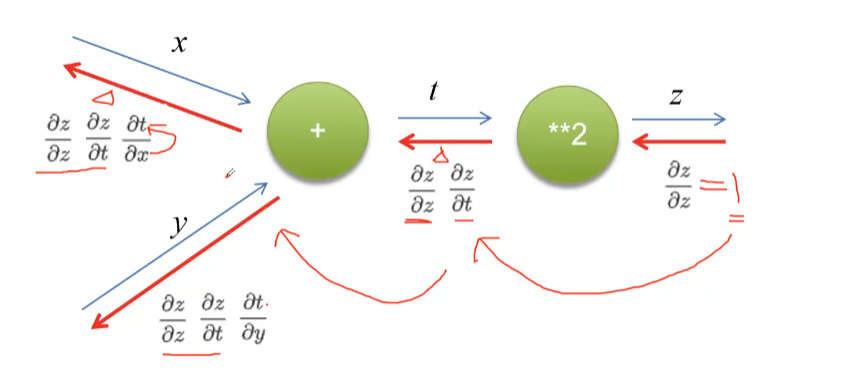
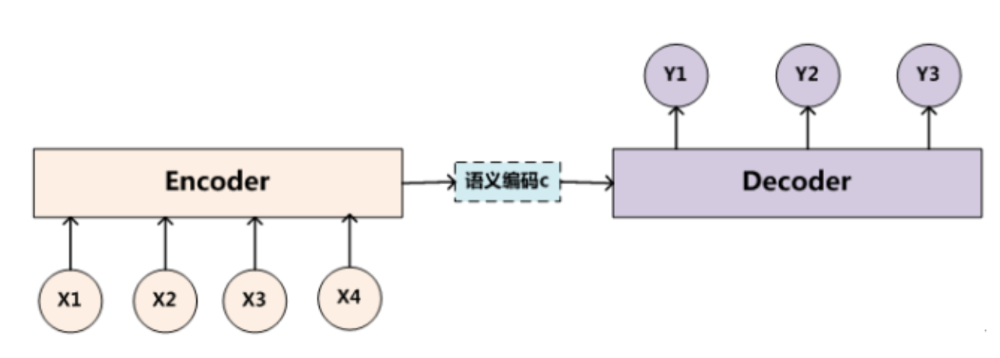

# 人工智能AI  Tensorflow手写体识别

https://www.bilibili.com/video/BV1fL411P74g


## 2 感知机与神经网络

### 2.1 感知机

。

#### 1)实现逻辑和（就是与&&运算）

。

#### 2)实现逻辑或（就是或||运算）

只需要调整θ

。


#### 缺点

。

解决方法：多重感知机

。


```python
# 感知机
# 逻辑和
def AND(x1, x2):  # 函数名与if后面都有冒号
    w1, w2 = 0.5, 0.5
    theta = 0.5
    if w1 * x1 + w2 * x2 > theta:
        return 1
    else:
        return 0


print(AND(1, 1))  # 1
print(AND(1, 0))  # 0
print(AND(0, 1))  # 0


# 逻辑或
def OR(x1, x2):  # 函数名与if后面都有冒号
    w1, w2 = 0.5, 0.5
    theta = 0.2
    if w1 * x1 + w2 * x2 > theta:
        return 1
    else:
        return 0


print(OR(1, 1))  # 1
print(OR(1, 0))  # 1
print(OR(0, 1))  # 1
print(OR(0, 0))  # 0


# 实现异或
def XOR(x1, x2):
    s1 = not AND(x1, x2)
    s2 = OR(x1, x2)
    return AND(s1, s2)


print("XOR")
print(XOR(1, 1))
print(XOR(1, 0))
print(XOR(0, 1))
print(XOR(0, 0))

```


## 2.2 神经网络


只要这层包含足够多神经元，然后使用恰当激活函数，理论上可以解决任何问题


### 激活函数


#### 阶跃函数


#### sigmoid

将 -∞ ~ +∞ 的压缩到 -1~1


#### tanh


#### ReLu


#### Softmax

常用于分类最后一层决定哪一类，输出层


## 3 损失函数与梯度下降

### 3.1 损失函数

y真实 y‘预测值


作为模型性能参考

我们学习过程中，不断迭代，降低损失值


#### 3.1.1 常用损失函数

##### 1）均方误差

常用于连续函数


##### 2) 交叉熵

常用于离散函数

yk=1 E=0 

横坐标预测值 纵坐标真实值


$$
\LARGE E=-\sum_{k=1}^{N}t_k\log{y_k}
$$


### 3.2 梯度下降

梯度：下降最快的方向


##### 学习率

=步伐比率


##### 梯度递减训练法则

$\eta$ 是学习率


##### 梯度下降法


批量梯度下降 计算量大 但是收敛稳定


随机梯度下降 计算量小 但是收敛不稳定

## 4 反向传播算法

反向传播


如果苹果变成11，最终金额是24.2

24.2-22 = 2.2

2.2/1=2.2

税收

1.1+1=2.1

2.2*20=42

22/1=20


这条边的导数 = 上游传递过来的值 * 另一条边的值


### 反向传播计算

#### 加法


#### 乘法

x*y 求偏导 

对x求偏导 = 1*y

对y求偏导 = 1*x





题目


倒着往回推


## 5 卷积神经网络


（就差不多图像处理那个滤波 跟那个卷积一个意思）


步幅 一次移动两格


对图像进行锐化 去噪，那么也可以对数据这样做


把干扰信息去掉，适合机器看 


写代码前:

首先我们需要倒入两个包 numpy和scipy


#### 安装numpy

http://www.py.cn/tools/pycharm/19249.html


#### 解决'pip' 不是内部或外部命令，也不是可运行的程序

跟着下面这个办法做

https://www.bilibili.com/video/BV1cq4y1L7ox/?spm_id_from=333.788.recommend_more_video.15


#### 导入scipy

参考：

按照下面这个步骤做：

[安装gensim库可能出现的问题及解决/安装scipy库可能出现的问题及解决/numpy库资源分享/word2vec_哔哩哔哩_bilibili](https://www.bilibili.com/video/BV1Ra4y1t7qZ?spm_id_from=333.788.header_right.history_list.click)

查看版本：

[(24条消息) Python 语法问题-module ‘pip‘ has no attribute ‘pep425tags‘，告诉你如何正确查看pip支持，32位、64位查看pip支持万能方法_挣扎的蓝藻的博客-CSDN博客_pip.pep425tags](https://blog.csdn.net/qq_38161040/article/details/88062405)

命令行界面输入

pip debug --verbose

可以查看版本

然后打开以下的网址

https://www.lfd.uci.edu/~gohlke/pythonlibs/#scipy


然后看一半上面的视频我就用了下面这个方法了：

[1.安装numpy、scipy、matplotlib_哔哩哔哩_bilibili](https://www.bilibili.com/video/BV12y4y1y7fs/?spm_id_from=333.788.recommend_more_video.-1)


pip list 可以查看安装了哪些包


回到代码中


结果：


## 6 卷积神经网络结构

### 网络结构


#### 卷积层


每一个卷积核都提取出了不同的特征


#### 池化层


卷积池化相当于提纯


#### 全连接层


一般放最后


###  经典网络

#### LeNet


##### LeNet 5

下面有具体的


#### AlexNet


用了ReLu作为激活函数

#### VGG


## 7  2.01 Tensorflow概述


将包导入这时候并不报错

为了解决


参考以下文章进行下载

https://www.csdn.net/tags/NtzaUg4sMDI0MTQtYmxvZwO0O0OO0O0O.html


去清理C盘

下载


总的


```PYTHON
import tensorflow as tf
x=[[1.]]
m=tf.matmul(x,x)
print(m)

```


好像有个结果 但是报错了 不知道用的是哪个tensorflow。。。


tensor矩阵

进行gpu加速运算的


... 


下载写dll  啊好大啊这些dll

如果不行 后面要删掉


各种dll下载：

https://www.dll-files.com/


方法二

https://blog.csdn.net/xp178171640/article/details/115916940

https://www.cnblogs.com/live41/p/14394601.html


用这个指令


里面安装包名换成tensorflow就可以


各种dll放在


放进C盘


## END

https://www.bilibili.com/video/BV1Z54y187WW?spm_id_from=333.337.search-card.all.click


卷积后尺寸=(输入-卷积核+加边像素数)/步长


```python
import tensorflow.compat.v1 as tf #使用1.0版本的方法
tf.disable_v2_behavior() #禁用2.0版本的方法
```


##### 建立模型


#### 模型训练

开始训练：

训练结果


可以看到 十轮训练后  在训练集和验证集上的准确度达到了98%


##### 建立有环境的文件夹


## 注意力模型


图1形象化展示了人类在看到一副图像时是如何高效分配有限的注意力资源的，其中红色区域表明视觉系统更关注的目标，很明显对于图1所示的场景，人们会把注意力更多投入到人的脸部，文本的标题以及文章首句等位置。

深度学习中的注意力机制从本质上讲和人类的选择性视觉注意力机制类似，核心目标也是从众多信息中选择出对当前任务目标更关键的信息。


**Encoder-Decoder框架**

要了解深度学习中的注意力模型，就不得不先谈Encoder-Decoder框架，因为目前大多数注意力模型附着在Encoder-Decoder框架下，当然，其实注意力模型可以看作一种通用的思想，本身并不依赖于特定框架，这点需要注意。

Encoder-Decoder框架可以看作是一种深度学习领域的研究模式，应用场景异常广泛。图2是文本处理领域里常用的Encoder-Decoder框架最抽象的一种表示。



图2 抽象的文本处理领域的Encoder-Decoder框架


https://zhuanlan.zhihu.com/p/37601161


https://www.bilibili.com/video/BV1L4411q785?spm_id_from=333.337.search-card.all.click

https://www.statist.cn/2020/06/26/Attention/


### 图像中的注意力机制

视频：https://www.bilibili.com/video/BV1rL4y1n7p3?p=2

博客：**https://blog.csdn.net/weixin_44791964/article/details/121371986**

有人的笔记：https://www.bilibili.com/read/cv14886011?from=note

#### 什么是注意力机制
注意力机制是深度学习常用的一个小技巧，它有多种多样的实现形式，尽管实现方式多样，但是每一种注意力机制的实现的核心都是类似的，就是注意力。

注意力机制的核心重点就是让网络关注到它更需要关注的地方。

当我们使用卷积神经网络去处理图片的时候，我们会更希望卷积神经网络去注意应该注意的地方，而不是什么都关注，我们不可能手动去调节需要注意的地方，这个时候，如何让卷积神经网络去自适应的注意重要的物体变得极为重要。

注意力机制就是实现网络自适应注意的一个方式。

一般而言，注意力机制可以分为通道注意力机制，空间注意力机制，以及二者的结合。


##### 空间注意力机制


假设要检测一只鸟 肯定会更关注图像中这只鸟的位置


##### 通道注意力机制


假设这个点和线对于我们分割物体更重要 那么他们的注意力就应该放更多

### SEnet


1、SENet的实现
SENet是通道注意力机制的典型实现。
2017年提出的SENet是最后一届ImageNet竞赛的冠军，其实现示意图如下所示，对于输入进来的特征层，我们关注其每一个通道的权重，对于SENet而言，其重点是获得输入进来的特征层，每一个通道的权值。利用SENet，我们可以让网络关注它最需要关注的通道。

其具体实现方式就是：
1、对输入进来的特征层进行全局平均池化。
2、然后进行两次全连接，第一次全连接神经元个数较少，第二次全连接神经元个数和输入特征层相同。
3、在完成两次全连接后，我们再取一次Sigmoid将值固定到0-1之间，此时我们获得了输入特征层每一个通道的权值（0-1之间）。
4、在获得这个权值后，我们将这个权值乘上原输入特征层即可。


每一个书数字就是每个通道的权值


### CBAMnet

CBAM将通道注意力机制和空间注意力机制进行一个结合，相比于SENet只关注通道的注意力机制可以取得更好的效果。其实现示意图如下所示，CBAM会对输入进来的特征层，分别进行通道注意力机制的处理和空间注意力机制的处理。


下图是通道注意力机制和空间注意力机制的具体实现方式：
图像的上半部分为通道注意力机制，通道注意力机制的实现可以分为两个部分，我们会对输入进来的单个特征层，分别进行全局平均池化和全局最大池化。之后对平均池化和最大池化的结果，利用共享的全连接层进行处理，我们会对处理后的两个结果进行相加，然后取一个sigmoid，此时我们获得了输入特征层每一个通道的权值（0-1之间）。在获得这个权值后，我们将这个权值乘上原输入特征层即可。

图像的下半部分为空间注意力机制，我们会对输入进来的特征层，在每一个特征点的通道上取最大值和平均值。之后将这两个结果进行一个堆叠，利用一次通道数为1的卷积调整通道数，然后取一个sigmoid，此时我们获得了输入特征层每一个特征点的权值（0-1之间）。在获得这个权值后，我们将这个权值乘上原输入特征层即可。


上面输出每个通道的权值

下面输出每个像素点的权值

### ECAnet

3、ECA的实现
ECANet是也是通道注意力机制的一种实现形式。ECANet可以看作是SENet的改进版。
ECANet的作者认为SENet对通道注意力机制的预测带来了副作用，捕获所有通道的依赖关系是低效并且是不必要的。
在ECANet的论文中，作者认为卷积具有良好的跨通道信息获取能力。

ECA模块的思想是非常简单的，它去除了原来SE模块中的全连接层，直接在全局平均池化之后的特征上通过一个1D卷积进行学习。

既然使用到了1D卷积，那么1D卷积的卷积核大小的选择就变得非常重要了，了解过卷积原理的同学很快就可以明白，1D卷积的卷积核大小会影响注意力机制每个权重的计算要考虑的通道数量。用更专业的名词就是跨通道交互的覆盖率。

如下图所示，左图是常规的SE模块，右图是ECA模块。ECA模块用1D卷积替换两次全连接。


https://www.jianshu.com/p/7e66bec3123b


## Encoder-Decoder


[深度学习中的注意力模型（2017版） - 知乎 (zhihu.com)](https://zhuanlan.zhihu.com/p/37601161)

https://zhuanlan.zhihu.com/p/37601161

**Attention机制的应用**

前文有述，Attention机制在深度学习的各种应用领域都有广泛的使用场景。上文在介绍过程中我们主要以自然语言处理中的机器翻译任务作为例子，下面分别再从图像处理领域和语音识别选择典型应用实例来对其应用做简单说明。


图13 图片-描述任务的Encoder-Decoder框架

图片描述（Image-Caption）是一种典型的图文结合的深度学习应用，输入一张图片，人工智能系统输出一句描述句子，语义等价地描述图片所示内容。很明显这种应用场景也可以使用Encoder-Decoder框架来解决任务目标，此时Encoder输入部分是一张图片，一般会用CNN来对图片进行特征抽取，Decoder部分使用RNN或者LSTM来输出自然语言句子（参考图13）。

此时如果加入Attention机制能够明显改善系统输出效果，Attention模型在这里起到了类似人类视觉选择性注意的机制，在输出某个实体单词的时候会将注意力焦点聚焦在图片中相应的区域上。图14给出了根据给定图片生成句子“A
person is standing on a beach with a surfboard.”过程时每个单词对应图片中的注意力聚焦区域。


图14 图片生成句子中每个单词时的注意力聚焦区域

图15给出了另外四个例子形象地展示了这种过程，每个例子上方左侧是输入的原图，下方句子是人工智能系统自动产生的描述语句，上方右侧图展示了当AI系统产生语句中划横线单词的时候，对应图片中聚焦的位置区域。比如当输出单词dog的时候，AI系统会将注意力更多地分配给图片中小狗对应的位置。


引入Self Attention后会更容易捕获句子中长距离的相互依赖的特征，因为如果是RNN或者LSTM，需要依次序序列计算，对于远距离的相互依赖的特征，要经过若干时间步步骤的信息累积才能将两者联系起来，而距离越远，有效捕获的可能性越小。


## PPT

https://blog.csdn.net/moxibingdao/article/details/106667184

本文简要介绍2018年5月被TMM录用论文“Track,Attend and Parse (TAP): An End-to-end Framework for Online Handwritten Mathematical Expression Recognition”的主要工作。该论文是2017年发表在ICDAR上的文章[1]的升级版，主要解决了在线手写数学公式的识别问题。该论文中介绍的方法获得了国际最大在线手写数学公式比赛CROHME2019的冠军，且是在未使用额外数据的情况下超过了有大量额外数据的国际企业参赛队伍，如MyScript，Wiris，MathType等，突出了该算法较传统数学公式识别算法的优势。

论文TAP是首个基于深度学习的端到端在线手写数学公式识别模型，且针对数学公式识别的任务特性提出了多种优化。


TAP的基本框架为基于注意力机制的编解码模型，也称Encoder-Decoder模型[4]，其将输入的轨迹点序列通过Encoder编码得到高维特征表达，依靠Attention机制找出高维特征中的关键部分以用于解码出当前时刻的LaTeX字符，直至解码结束。TAP延续了会议文章[1]中的Encoder框架，在Attention机制上针对在线手写公式识别提出了Spatial Attention, Temporal Attention, Attention Guider用于改善Attention的对齐以及Decoder的解码能力。文章中还利用了在线与离线两个模态之间的互补性进一步提升了手写识别性能。


除了常用的Spatial Attention（空间注意力）外，还采用了Temporal Attention（时间注意力）机制。其中，Spatial Attention利用了Attention的历史信息以解决数学公式中多个同样数学字符出现时的对齐混淆问题。而Temporal Attention用于处理LaTeX中的结构字符的特殊对齐。因为在LaTeX的语法规则中，为了重现数学公式语言里的二维空间结构，需要额外有一些特殊的结构字符来形成语法，而这些特殊的结构字符在输入的数学公式中不存在，因而Spatial Attention无法完成对齐，此时则需要Temporal Attention来补足这个不存在的对齐空缺，既能不干扰Spatial Attention的学习，又能提高Decoder的解码能力，进一步提升性能。 


此外，TAP还采用了Attention Guider来强化Spatial Attention的学习，从Fig 3中可以看出，在使用了Attention Guider来引导Spatial Attention的学习后，Spatial Attention的对齐效果显著提升，十分精确，并且效果也反映到了最终的识别性能上


Fig 4是对于Temporal Attention的可视化，可见Temporal Attention能够很正确的帮助Spatial Attention区分结构字符和实体字符。


Fig 5是对Hybrid Attention整体在一个手写数学公式实例上的可视化。


Fig 6列出了一个手写数学公式在线和离线模态互补性的实例，由于存在倒笔现象，单纯的在线模型无法正确识别该例子，而通过离线模型的融合辅助最终使得这个公式例子被正确识别（由于符号定义过多，更详细的内容请参考原文，链接附后）。 


