# 计算机视觉

## 1 介绍

。。。pad笔记上

#### 课程话题：

低层：滤波，边缘检测

中层：图像分割，

高层：场景识别，图像识别，行为识别

图像分类

image parsing  图像中层次化描述，这些地方分别是什么

image-net 图像数据库 深度学习模型

应用：3D扫描

动作捕捉

三维重建

生物识别 （指纹锁，人脸识别

### 模式识别

#### 模式识别和模式的概念

人类时时在模式识别：认出这个是薯条还是鸡腿

##### 模式是什么

存在于时间或者空间所能观察的物体，我们识别它是否存在。。

##### 模式识别是什么

把具体事物归入一类的过程

##### 模式举例

不同纹理，不同指纹

#### 模式识别系统

##### 基本构成

数据获取→预处理→特征提取和选择→分类器设计（算法，设计模型）&&（→）分类决策

##### 举例

鱼类自动分类

长度 交叉太多

一般会用两个特征 eg 亮度+宽度 二维图像

过拟合不好，欠拟合也不好

所以最好达到更高的泛化能力（没见过这个样本 但是还是能做得很好）

有监督学习

给一些有答案的样本 让他学习

无监督学习

自己挖掘规律

http://depts.washington.edu/acelab/proj/dollar/index.html

# 计算机视觉与深度学习 北京邮电大学 鲁鹏

https://www.bilibili.com/video/BV1V54y1B7K3?p=2

## 02-1 图像分类任务介绍

### 图像分类任务有哪些难点

语义鸿沟

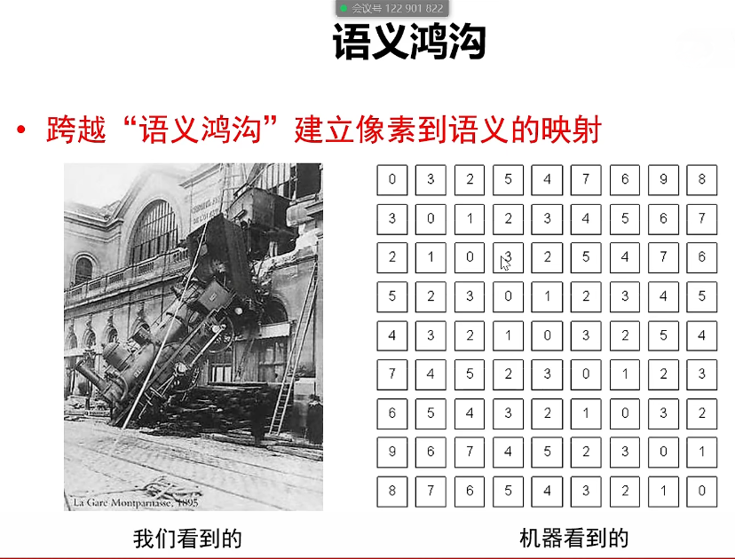

不同视角 可以看出是一个人/东西

光照 影响超大

尺度

遮挡

形变

背景杂波

类内形变（不同样子的艺术品的椅子）

运动模糊

### 基于规则的方法是否可行

通过**硬编码** ，难（角点检测），对于猫这种形变很多的动物来说

### 什么是数据驱动的图像分类范式

机器学习的方法

#### 数据驱动的图像分类方法

1、数据集构建

* 有监督

  每个数据都有标签

* 无监督

​		很多数据但是没标签，在数据中找规律

2、分类器设计与学习

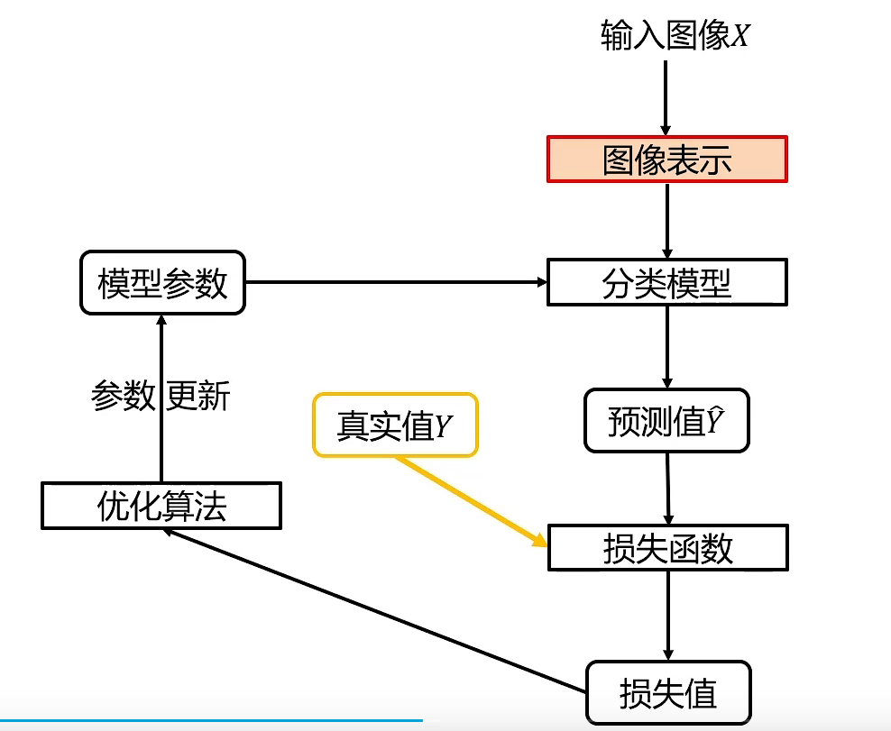

分类模型：

损失函数：度量预测得怎么样

3、分类器决策

## 02-2 线性分类器

### 图像类型

二值（只有0/1），灰度，彩色

### 图像表示

大部分分类算法 都要求输入**向量**

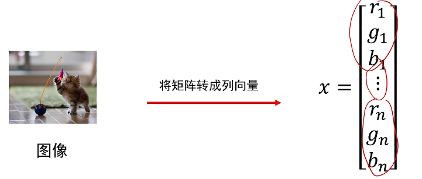

### 为什么从线性分类器开始

简单

因为线性分类器是神经网络的基础，是支持向量机的基础（支持向量机就是一个线性分类器）

### 什么是线性分类器

是线性映射，将输入图像特征映射为类别分数

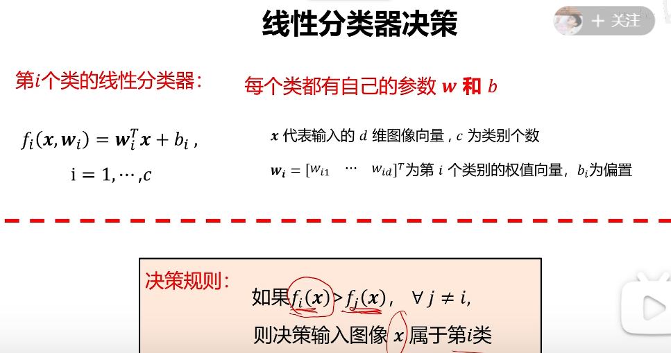

如果狗这个类的分数高于别的，就判定属于狗

例子：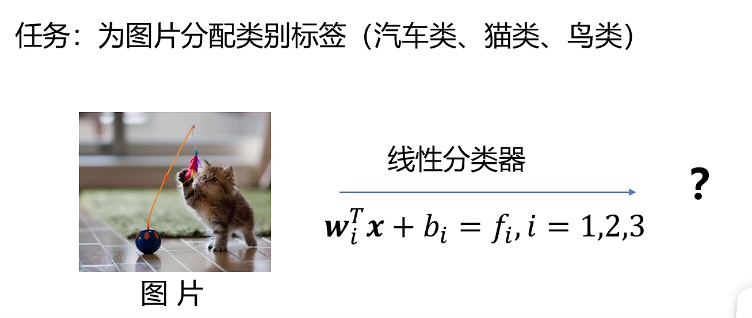

有三个类，三个wi bi，问最终属于哪个类

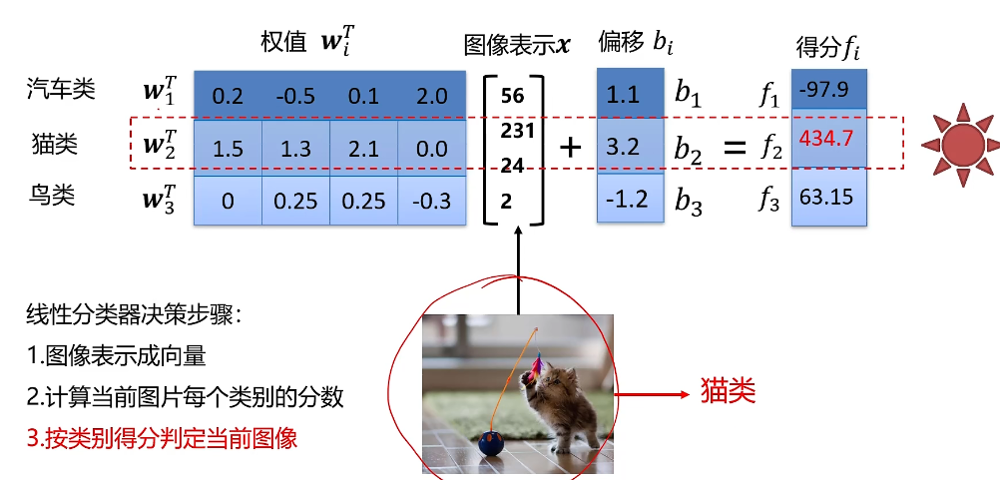

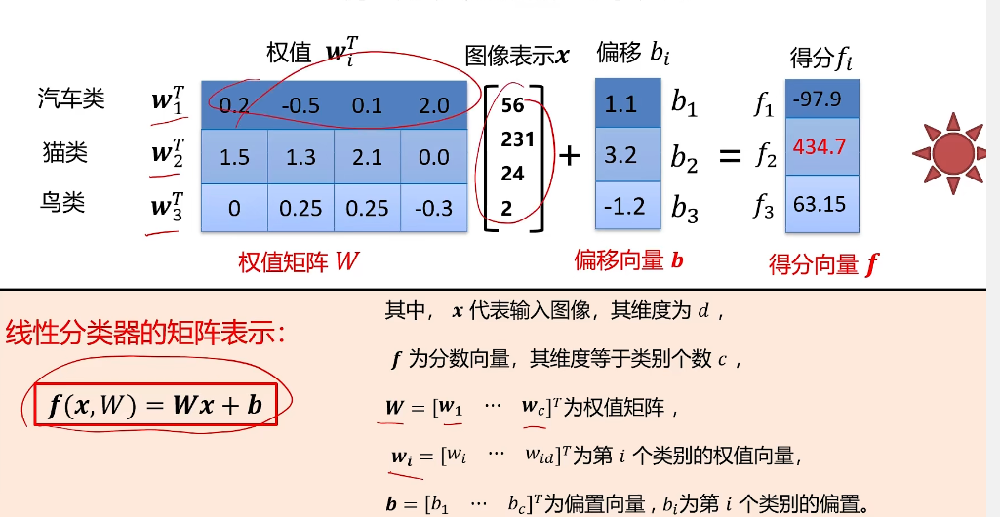

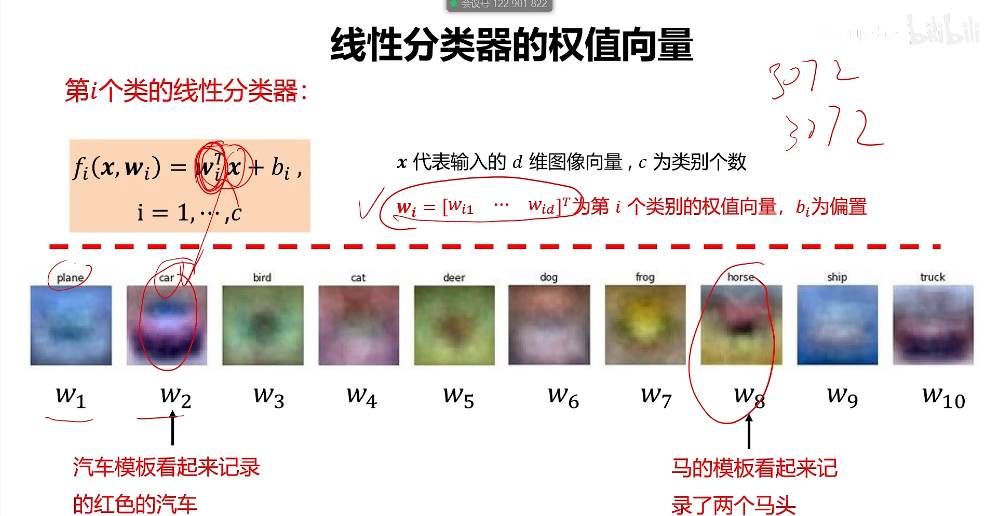

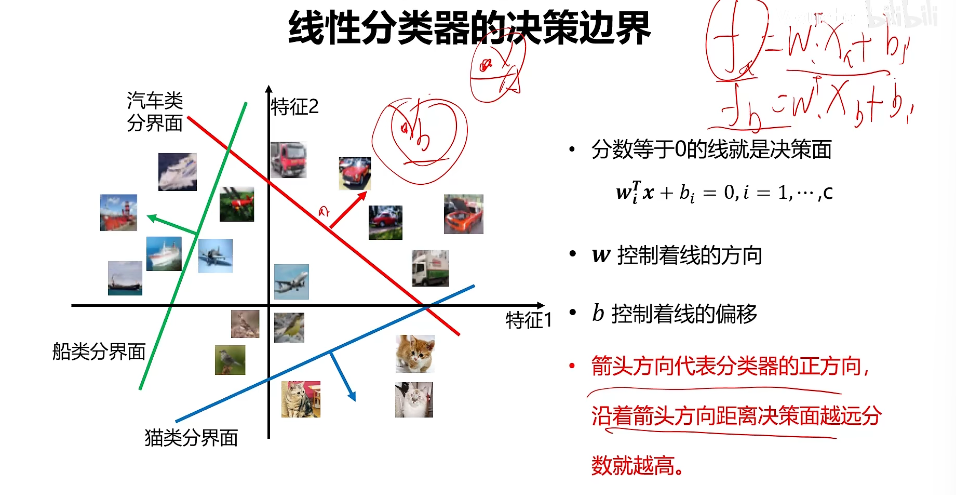

### 损失函数

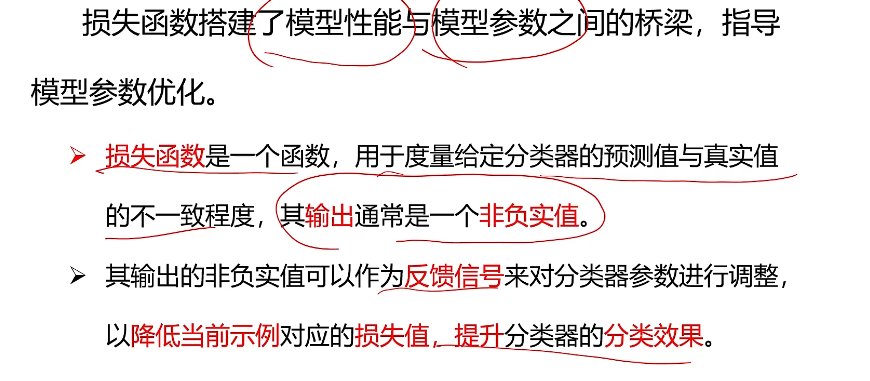

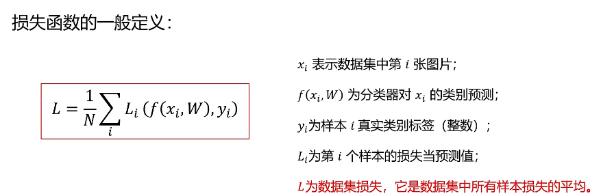上面的W包含b 不特点写了

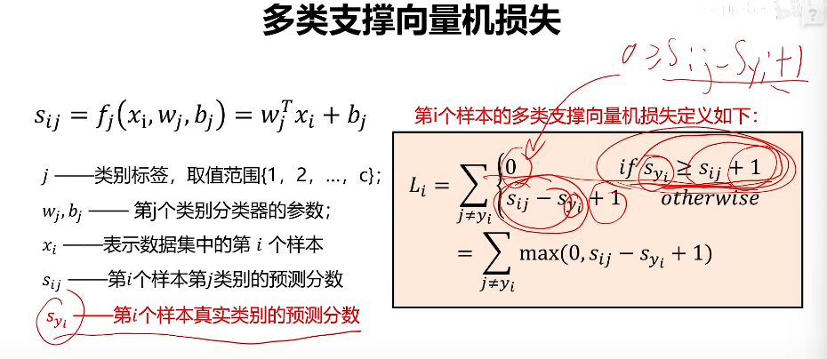

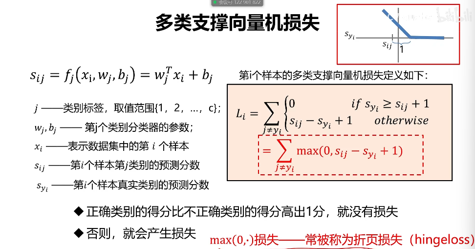

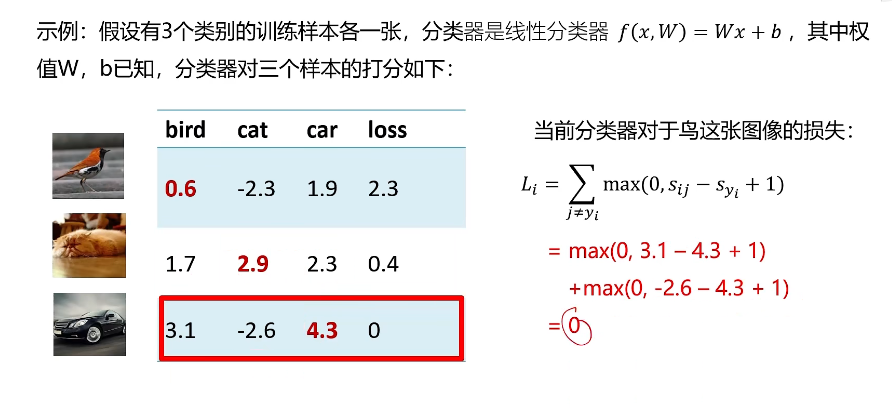

# 计算机视觉（本科） 北京邮电大学 鲁鹏 

看完第一个认真

可以照一个

