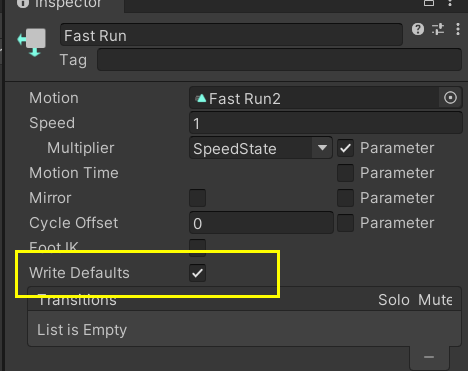
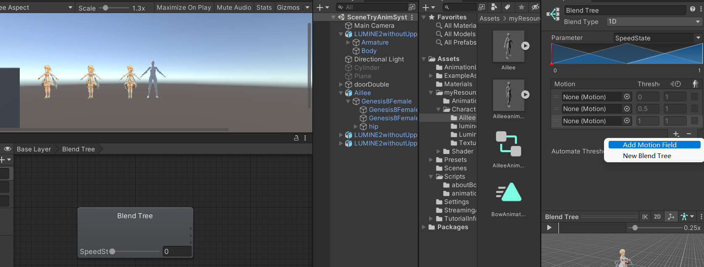
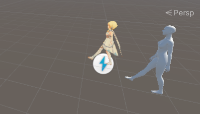

# unity动画系统

教程：

https://www.bilibili.com/video/BV1y44y147e7/?spm_id_from=333.788&vd_source=f2def4aba42c7ed69fc648e1a2029c7b

untiy项目:

genshinBoneTest

场景：

SceneTryAnimSystem


### 1


观察曲线


### 3 动画复用原理

拖进来可以看不同模型的预览


当要变的动画文件要处理多个物体时，文件中会写上对象的名称


Generic 飞鸟猛兽可用


进入configure


P0OSE-可以强制T-pose


肌肉：

可以做一些限制 防止穿模


### 4 动画复用

##### 实践 动画复用

本身aillee有一个适配其的动画，我们给她设置一个avater

荧妹为自己设置一个avater

动画文件：从对aillee骨骼的描述改为对unity肌肉的描述

二人都放上各自的avater

结果：


### 5 Animator的全部属性

##### avatar


如果avater格子里没有放avater

avatar会严格按照动画片中记录的path，去寻找相应的游戏对象并播放动画，层级必须是对的和对应的，他不会去子节点中自己寻找

如果avater格子里放avater

无论隔了多少级，animator都可以通过avatar准确找到角色模型


##### apply root motion


如果勾选了，动画里的位移可以直接应用到角色上。


##### Update


Normal-与update（）同步 【FPS 30帧就一秒计算30次】

Animate Physics-与FixedUpdate（）同步【与物理引擎同步，unity每做一次物理检测而，比如碰撞检测，就重新计算一下数值】

Normal-与update（）同步【忽略时间标尺TImeScale，派蒙？】


##### Culling Mode


Alaways Animate

总是动画整个角色。对象即使在离屏时也是动画的。


Cull Update Transforms

当渲染器不可见时，将禁用重定向、IK和写入。


Cull Completely

当渲染器不可见时，动画完全禁用。


最左边那个是Cull Completely 只有相机看到才会重新播动画，所以别另外两个慢（Scene相机也算）


总结：

| ***属性：\***         | ***功能：\***                                                |                                                              |
| :-------------------- | :----------------------------------------------------------- | ------------------------------------------------------------ |
| **Controller**        | 附加到此角色的 Animator Controller。                         |                                                              |
| **Avatar**            | 此角色的[Avatar](https://docs.unity3d.com/cn/current/Manual/class-Avatar.html)。（如果 Animator 用于对人形角色进行动画化） |                                                              |
| **Apply Root Motion** | 选择从动画本身还是从脚本控制角色的位置和旋转。               |                                                              |
| **Update Mode**       | 此选项允许您选择 Animator 何时更新以及应使用哪个时间标度。   |                                                              |
|                       | **Normal**                                                   | Animator 与 Update 调用同步更新，Animator 的速度与当前时间标度匹配。如果时间标度变慢，动画将通过减速来匹配。 |
|                       | **Animate Physics**                                          | Animator 与 FixedUpdate 调用同步更新（即，与物理系统步调一致）。如果要对具有物理交互的对象（例如可四处推动刚体对象的角色）的运动进行动画化，应使用此模式。 |
|                       | **Unscaled Time**                                            | Animator 与 Update 调用同步更新，但是 Animator 的速度忽略当前时间标度而不顾一切以 100% 速度进行动画化。此选项可用于以正常速度对 GUI 系统进行动画化，同时将修改的时间标度用于特效或暂停游戏。 |
| **Culling Mode**      | 您可以为动画选择的剔除模式。                                 |                                                              |
|                       | **Always Animate**                                           | 始终进行动画化，即使在屏幕外也不要剔除。                     |
|                       | **Cull Update Transforms**                                   | 未显示渲染器时，禁用变换组件的重定向、IK（反向动力学）和写入。 |
|                       | **Cull Completely**                                          | 未显示渲染器时，完全禁用动画。                               |


### 6 mixamo 修正动画


腿有问题 该为0直接设置为0 


正常一些了	

但还是有问题


进一步优化 就是对二者的骨骼Tpose的时候的姿势做旋转角修改，让他们尽量一致

比如荧妹foot转角度的设置


改我们动画的avatar


改完：


### 7 动画状态基本属性及相关API


新的inputSystem


##### Tags


```C#
using System.Collections;
using System.Collections.Generic;
using UnityEngine;
using UnityEngine.InputSystem;

public class AnimatorStateTest : MonoBehaviour
{
    public Animator mAnimator;
    // Start is called before the first frame update
    void Start()
    {
        mAnimator = GetComponent<Animator>();
    }

    // Update is called once per frame
    void Update()
    {
        if (Keyboard.current.wKey.isPressed)
        {
            AnimatorStateInfo stateInfo = mAnimator.GetCurrentAnimatorStateInfo(0);
            if (stateInfo.IsTag("不能动"))
            {
                Debug.Log("不能动");
                return;;
            }
            Debug.Log("可以动");
        }
    }
}

```


##### motion

更改的动画


##### speed

更改动画播放的速度


```C#
using System.Collections;
using System.Collections.Generic;
using UnityEngine;
using UnityEngine.InputSystem;

public class AnimatorStateTest : MonoBehaviour
{
    public Animator mAnimator;
    private int speedHash;
    private float animationSpeed = 0f;
    // Start is called before the first frame update
    void Start()
    {
        mAnimator = GetComponent<Animator>();
        speedHash = Animator.StringToHash("SpeedState");//string转为整型数据 比较起来比string更快
        //mAnimator.SetFloat("SpeedState",animationSpeed);//原来可以设置参数(⇀‸↼‶)
        mAnimator.SetFloat(speedHash,animationSpeed);//原来可以设置参数(⇀‸↼‶)
    }

    // Update is called once per frame
    void Update()
    {
        if (Keyboard.current.wKey.isPressed)
        {
            animationSpeed += 0.1f;
            //mAnimator.SetFloat("SpeedState",animationSpeed);
            mAnimator.SetFloat(speedHash,animationSpeed);
        }

        if (Keyboard.current.sKey.isPressed)
        {
            animationSpeed -= 0.1f;
            //mAnimator.SetFloat("SpeedState",animationSpeed);
            mAnimator.SetFloat(speedHash,animationSpeed);
        }
    }
}

```


##### Motion Time

、

控制播放哪一帧（0-1）


##### Mirror

是否镜像

、


##### Cycle Offset

偏移 从哪一帧开始播放（0-1）


### 8 IK 矫正角色动画


勾上前勾上 Foot IK后

（网小红球 IK GOAL靠拢）


为了使用IK  层级这里需要勾上IK Pass


```C#
 private void OnAnimatorIK(int layerindex)
    {
       mAnimator.SetIKPosition(AvatarIKGoal.RightFoot,new Vector3(0,0,0));
    }
```

偏移了


应用上，可以看到 确实偏移严重


改完真的不穿模了嗷


### 9 Write Defaults 

如果动画文件中没有描述某些属性的变化，是否需要为这些属性写入默认值

会带来神奇bug的东西



电梯关门开门bug


### 10 动画状态转换

##### has Exit TIme


执行转换的一个条件，当前动画状态播放到某个时间点的时候就执行这个转换。角色放置一段时间 ，会进入待机动画


蓝色的是会播放的


##### ExitTime
ExitTime表示从当前状态的百分之多少位置开始执行


##### FixedDuration
FixedDuration表示是按照s还是百分比来计算

勾选:s


##### Transition Duration

Transition Duration


##### Transition Offset

动画状态开始转换的时候，下一个动画状态是从什么位置开始播放


##### Interruption Source

有什么可以打断这个转换


### 11 动画状态转换条件conditions


有可能会就播放一次


如果转换条件多个 他们之间关系是逻辑与&&

如果想要逻辑或|| 可以多设置几个转换条


动画满足条件时 ，也会先执行完has exit time再执行条件下一个，所以如果勾选has exit time，不会立即转换


### 12 动画状态过渡中断/转换打断 State Machine Transition Interruptions

看这个或者视频就行

https://www.bilibili.com/read/cv15480465?spm_id_from=333.999.0.0


### 13 混合树-单变量混合树

1D


双击进入

右侧增加动画栏位




### 14 Root Motion

下载一堆locomotion

只需要将idle create from this avater

其他动画copy avatar即可

我觉得这样是为了以后该avatar只用改一个

当然如果不同动画需要改不同的部位 那还是分开avatar比较好


如果需要有位移而不是原地踏步


可以前进后退且不原地 但是不走直线，解决见17


###  15 Root Motion 原理

如果绑定的脚本写了这么一个函数


那么root motion不会启用，会通过脚本控制

如果这样写


位移方面和开启root motion一样的


动画文件会直接修改每一帧里游戏对象的坐标值和角度值，root motion则相对通过位移和转角来移动游戏对象


### 16 Root Motion（Generic）机制

Root Motion在Generic 动画中指的是将角色**根骨骼**（hips）的运动应用到游戏对象上

Generic 动画中，应用Root Motion到游戏对象上就是把动画中根骨骼的角色坐标和绝对角度，转换为游戏对象的相对位移和相对转角。


### 17  Root Motion（Generic）基础设置

勾选角度的Bake Into Pose 则不转角色旋转 转hip

即表示不要将根骨骼节点的旋转当做root motion的一部分来处理


要不要勾选这个 取决于我们需不需要动画来驱动我们的角色移动

能不能勾选 可以参考红色绿色提示


比如转身动画 不能勾选

直走动画 我们不要他因为动画瑕疵而转 勾选


总结

based upon 对其方向吧


解决走着走着歪了：

Bake Into Pose让他不受动画旋转影响

based upon 让他不会一开始的转向就是错的


### 18 Root Motion（Humanoid）机制和相关配置


original 美工做的 但是不同模型可能会不同

Feet 对准脚

Body 四元数 那个是unity计算出来的 不一定准


也可以再用offset微调


### 19 Root Motion遇上Blend Tree

Z方向自动计算阈值


前进和后退速度不一样：解决 选homo那个 （当然reset就是按照动画本身的速度 不去调整他，我们选reset！）


不同角色移动速度不同，比如小短腿更慢

### Input System

1、添加组件


2、创建Actions

3、Invoke Unity Events 指的是输入驱动他动

4、绑定事件


### 20 不同角色同RootMotion 速度不同解决

短腿走得慢 解决



改混合树的速度


### 21 自定义速度

不apply root motion


物理引擎计算之前


### 22 Rigid Body与Root Motion冲突：重力不起作用

原因是下落速度被改回去了

解决：


### 23 自制角色控制器
