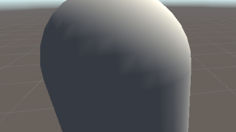
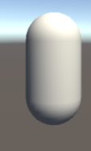
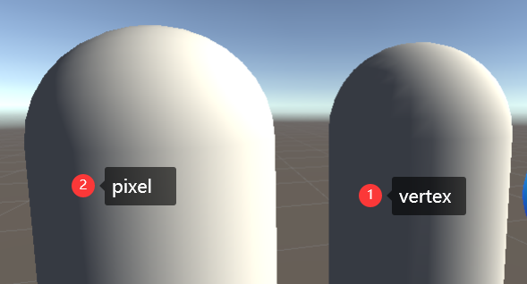
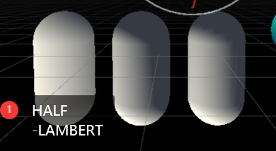
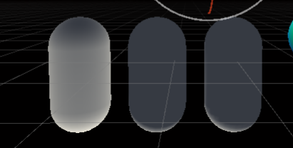
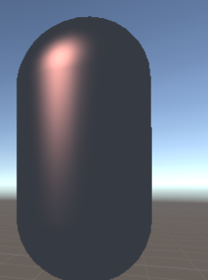
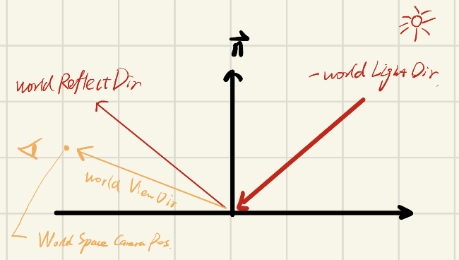

# shader学习 

参考：

冯乐乐《unity shader 入门精要》

https://github.com/hhlovesyy/UnityShaderBase

## 基础光照模型

#### 漫反射-兰伯特模型

##### 逐顶点光照

```GLSL
Shader "ShaderBook/Chapter6/Diffuse Vertex-Level"
{
    Properties
    {
        _Diffuse("Diffuse",Color) = (1,1,1,1)
    }
    SubShader
    {
        Pass
        {
            Tags{"LightMode"="ForwardBase"}
            CGPROGRAM
            #pragma vertex vert
            #pragma fragment frag

            #include "UnityCG.cginc"
            #include "Lighting.cginc"

            fixed4 _Diffuse;

            struct a2v
            {
                float4 vertex : POSITION;
                float3 normal : NORMAL;
            };

            struct v2f
            {
                float4 pos: SV_POSITION;
                fixed3 color : COLOR0;
            };
            
            v2f vert (a2v v)
            {
                v2f o;
                o.pos = UnityObjectToClipPos(v.vertex);
                
                //Lambert model,world space
                fixed3 ambient = UNITY_LIGHTMODEL_AMBIENT.xyz;
                //fixed3 worldNormal = UnityObjectToWorldNormal(v.normal);  //已经归一化完了
                //上面代码不用API的话是：
                fixed3 worldNormal = normalize(mul(v.normal,(float3x3)unity_WorldToObject));
                fixed3 worldLightDir = normalize(_WorldSpaceLightPos0.xyz); //获取光源的方向,但不具有通用性(多光源不适用)
                //在正确的LightMode标签下，_LightColor0可以访问该Pass处理的光源的颜色和强度信息
                fixed3 diffuse = _LightColor0.rgb * _Diffuse.rgb * max(0, dot(worldNormal, worldLightDir));
                o.color = ambient + diffuse;
                
                return o;
            }

            fixed4 frag (v2f i) : SV_Target
            {
                return fixed4(i.color, 1.0);
            }
            ENDCG
        }
    }
    Fallback "Diffuse"
}
```

效果:




##### 逐像素光照

```GLSL
Shader "ShaderBook/Chapter6/Diffuse Pixel-Level"
{
    Properties
    {
        _Diffuse("Diffuse",Color) = (1,1,1,1)
    }
    SubShader
    {
        Pass
        {
            Tags{"LightMode"="ForwardBase"}
            CGPROGRAM
            #pragma vertex vert
            #pragma fragment frag
            
            #include "UnityCG.cginc"
            #include "Lighting.cginc"

            fixed4 _Diffuse;

            struct a2v
            {
                float4 vertex : POSITION;
                float3 normal : NORMAL;
            };

            struct v2f
            {
                float4 pos : SV_POSITION;
                fixed3 worldNormal: TEXCOORD0;  //存储的类型以后尽量统一,就用TEXCOORD系列吧
            };
            
            v2f vert (a2v v)
            {
                v2f o;
                o.pos = UnityObjectToClipPos(v.vertex);
                o.worldNormal = UnityObjectToWorldNormal(v.normal);
                return o;
            }

            fixed4 frag (v2f i) : SV_Target
            {
                //Lambert model:world space
                fixed3 ambient = UNITY_LIGHTMODEL_AMBIENT.xyz;
                fixed3 worldLightDir = normalize(_WorldSpaceLightPos0.xyz);
                fixed3 diffuse = _Diffuse.rgb * _LightColor0.rgb * saturate(dot(worldLightDir, i.worldNormal));

                fixed3 color = ambient+diffuse;
                return fixed4(color,1.0);
            }
            ENDCG
        }
    }
}
```




##### 半兰伯特

```GLSL
Shader "ShaderBook/Chapter6/Half Lambert Pixel-Level"
{
    //半兰伯特模型的优势:传统的兰伯特模型在背光区域是完全黑暗的(因为在max(0,l·n)的时候被截断为0了),而半兰伯特模型可以在背光的地方也会亮一些
    Properties
    {
        _Diffuse("Diffuse",Color) = (1,1,1,1)
    }
    SubShader
    {
        Pass
        {
            Tags{"LightMode"="ForwardBase"}
            CGPROGRAM
            #pragma vertex vert
            #pragma fragment frag
            
            #include "UnityCG.cginc"
            #include "Lighting.cginc"

            fixed4 _Diffuse;

            struct a2v
            {
                float4 vertex : POSITION;
                float3 normal : NORMAL;
            };

            struct v2f
            {
                float4 pos : SV_POSITION;
                fixed3 worldNormal: TEXCOORD0;  //存储的类型以后尽量统一,就用TEXCOORD系列吧
            };
            
            v2f vert (a2v v)
            {
                v2f o;
                o.pos = UnityObjectToClipPos(v.vertex);
                o.worldNormal = UnityObjectToWorldNormal(v.normal);
                return o;
            }

            fixed4 frag (v2f i) : SV_Target
            {
                //Lambert model:world space
                fixed3 ambient = UNITY_LIGHTMODEL_AMBIENT.xyz;
                fixed3 worldLightDir = normalize(_WorldSpaceLightPos0.xyz);

                //half-lambert,[-1,1]->[0,1]
                fixed3 halfLambertDotRes = dot(worldLightDir, i.worldNormal) * 0.5 + 0.5;
                fixed3 diffuse = _Diffuse.rgb * _LightColor0.rgb * saturate(halfLambertDotRes);
                
                fixed3 color = ambient+diffuse;
                return fixed4(color,1.0);
            }
            ENDCG
        }
    }
}
```




#### 高光-phong模型


##### PHONG


```GLSL
Shader "Unlit/phongShader"
{
    Properties
    {
        _Diffuse("Diffuse", Color)=(1,1,1,1)
        _Specular("Specular",Color)=(1,1,1,1)
        _Gloss("Gloss", Float) = 8.0
    }
    SubShader
    {
        Pass
        {
            Tags{"LightMode"="ForwardBase"}
            CGPROGRAM
            #pragma vertex vert
            #pragma fragment frag
            
            #include "UnityCG.cginc"
            #include "Lighting.cginc"

            fixed3 _Diffuse;
            fixed3 _Specular;
            float _Gloss;
            
            struct a2v
            {
                float4 vertex : POSITION;
                fixed3 normal : NORMAL;
            };

            struct v2f
            {
                float4 pos: SV_POSITION;
                fixed3 worldNormal : TEXCOORD0;
                float3 worldPos: TEXCOORD1;
            };
            

            v2f vert (a2v v)
            {
                v2f o;
                o.pos = UnityObjectToClipPos(v.vertex);
                o.worldNormal = UnityObjectToWorldNormal(v.normal);
                o.worldPos = mul(unity_ObjectToWorld, v.vertex).xyz;//位置标量，不能归一化
                return o;
            }

            fixed4 frag (v2f i) : SV_Target
            {
                //Lambert part: world space
                fixed3 ambient = UNITY_LIGHTMODEL_AMBIENT.xyz;
                fixed3 worldLightDir = normalize(_WorldSpaceLightPos0.xyz);
                fixed3 diffuse = _Diffuse.rgb * _LightColor0.rgb * saturate(dot(i.worldNormal, worldLightDir));
                
                //Phong part
                fixed3 worldReflectDir = normalize(reflect(-worldLightDir, i.worldNormal));
                fixed3 worldViewDir = normalize(_WorldSpaceCameraPos.xyz - i.worldPos.xyz);
                fixed3 specular = _Specular.rgb * _LightColor0.rgb * pow(max(0, dot(worldViewDir, worldReflectDir)), _Gloss);

                fixed3 color = ambient + specular;  //打开这行可以只查看高光的区域
                //fixed3 color = ambient + diffuse + specular;
                return fixed4(color, 1.0);
                
            }
            ENDCG
        }
    }
    Fallback "Specular"
}
```






##### BLINN-PHONG