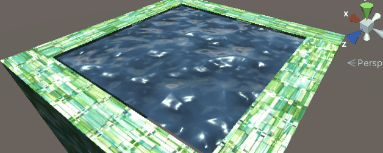

## TA系列（1）——水体渲染相关技术


# 一、CatLikeCoding系列

首先，我们会整理来自catlikecoding的四篇跟水体渲染有关的文章，并在Unity 2021版本中进行实践。

相关链接：[Unity Flow Tutorials (catlikecoding.com)](https://catlikecoding.com/unity/tutorials/flow/)


## 1.Texture Distortion（基于FlowMap）

实际上，水体渲染的一些技术也可以泛化到流体渲染中，在本节我们会先介绍flowmap的原理及其在流体渲染中的应用。目前来说我们制作的水体均不具有交互性，因此不需要有物理模拟的部分。接下来会从创建一个基础的surface shader开始（本项目采用的是built-in管线），逐渐落实flowmap的技术并给出渲染的结果。

### 1.1 Animating UV

#### （1）创建一个基本的Surface Shader

代码如下（其实就是Surface Shader的模板去掉了一些注释，并简化内容）：

```glsl
Shader "Custom/Water/FlowMapFluid_1"
{
    Properties
    {
        _Color ("Color", Color) = (1,1,1,1)
        _MainTex ("Albedo (RGB)", 2D) = "white" {}
        _Glossiness ("Smoothness", Range(0,1)) = 0.5
        _Metallic ("Metallic", Range(0,1)) = 0.0
    }
    SubShader
    {
        Tags { "RenderType"="Opaque" }
        LOD 200

        CGPROGRAM
        #pragma surface surf Standard fullforwardshadows
        #pragma target 3.0

        sampler2D _MainTex;

        struct Input
        {
            float2 uv_MainTex;
        };

        half _Glossiness;
        half _Metallic;
        fixed4 _Color;
        
        void surf (Input IN, inout SurfaceOutputStandard o)
        {
            fixed4 c = tex2D (_MainTex, IN.uv_MainTex) * _Color;
            o.Albedo = c.rgb;
            o.Metallic = _Metallic;
            o.Smoothness = _Glossiness;
            o.Alpha = c.a;
        }
        ENDCG
    }
    FallBack "Diffuse"
}
```

利用网站提供的贴图，将纹理的tiling设置为4，得到如下图的结果：


------


#### （2）Flowing UV

这一步，我们依据_Time对uv进行一个基本的偏移，新建一个`Flow.cginc`，代码如下：

```glsl
#if !defined(FLOW_INCLUDED)
#define FLOW_INCLUDED

float2 FlowUV(float2 uv, float time)
{
    return uv + time;
}

#endif
```

此时刚才的Surface Shader就可以修改如下：
```glsl
#include "Flow.cginc"
...
void surf (Input IN, inout SurfaceOutputStandard o)
{
    float2 flowUV = FlowUV(IN.uv_MainTex, _Time.y);  //使得uv随着时间发生偏移
    fixed4 c = tex2D (_MainTex, flowUV) * _Color;
	...
}
```

此时渲染得到结果如下：

<iframe src="https://catlikecoding.com/unity/tutorials/flow/texture-distortion/animating-uv/diagonally-sliding.mp4" scrolling="no" border="0" height="200" frameborder="no" framespacing="0"> </iframe>


------


#### （3）Flowing Direction

为了制作效果更好的流体，我们往往会使用flowmap技术。一张flowmap的示例图如下：


制作flowmap有很多方法，比如可以直接用噪声生成，或者使用flowmap绘制软件[FlowMap Painter – teckArtist](https://teckartist.com/?page_id=107)，或者是直接用houdini制作。对于这张图而言，R通道用来控制纹理的u方向，G通道则用来控制v方向。这张图不需要太大，因为我们并不需要流动发生突变，可以使用双线性插值的方法平滑效果。

**注意：**将flowmap导入Unity的时候，**要取消勾选纹理的sRGB选项**，即关闭伽马矫正的过程，因为我们要用最初始的RG通道颜色作偏移。

我们先可视化flowmap对每个顶点的偏移值（其实就是直接对flowmap进行纹理采样），可以写出下面的代码：

```glsl
Properties
{
    ...
    [NoScaleOffset]_FlowMap("Flow map(RG)", 2D) = "black" {}
}
...
void surf (Input IN, inout SurfaceOutputStandard o)
{
    float2 flowVector = tex2D(_FlowMap, IN.uv_MainTex).rg;
    o.Albedo = float3(flowVector, 0);
    ...
}
```

得到的结果如下：


为了后续方便，这里我们把主纹理的tiling重新调整为1。

------


#### （4）Directed Sliding

我们希望顶点的uv可以依据flowmap提供的向量进行偏移，修改`Flow.cginc`的FlowUV函数如下：

```glsl
float2 FlowUV(float2 uv, float2 flowVector, float time)
{
    return uv - time * flowVector;
}
```

在片元着色器传入flowVector的时候需要注意，flowmap采样出来的通道值范围为[0，1]，而实际的偏移方向分量可以是[-1，1]，因此需要做一步`*2-1`的操作，代码如下：

```glsl
void surf (Input IN, inout SurfaceOutputStandard o)
{
    float2 flowVector = tex2D(_FlowMap, IN.uv_MainTex).rg * 2 - 1; //rg:[0,1] -> vector:[-1,1]
    float2 uv = FlowUV(IN.uv_MainTex, flowVector, _Time.y);
    fixed4 c = tex2D (_MainTex, uv) * _Color;
    o.Albedo = c.rgb;
   ...
}
```

得到的结果如下：


可以看到，distortion的效果太过于剧烈了，这是因为整张纹理采样的坐标在多个方向进行移动，随着时间的推移，这种拉伸和挤压效果就会越明显。**一种能想到的方案是每次在扭曲到一定时间之后重置状态，此时可以对时间取frac操作，只保留小数部分，这样就会在0-1之间不断重复。**修改代码如下：

```glsl
//Flow.cginc
float2 FlowUV(float2 uv, float2 flowVector, float time)
{
    float progress = frac(time);
    return uv - progress * flowVector;
}
```

这时每次扭曲一定时间就会复原，如下：

<iframe src="https://catlikecoding.com/unity/tutorials/flow/texture-distortion/animating-uv/resetting-progression-compressed.mp4" scrolling="no" border="0" height="200" frameborder="no" framespacing="0"> </iframe>

额外能注意到的一件事是，随着变形会产生一些类似块状的不干净的地方（就是上个视频里的那些白色块）。作者对产生的原因进行了分析：

> 这时由于flowmap的压缩导致的。默认的压缩格式采用DXT1，就会产生这种现象。这里贴一个DXT1压缩的原理：[Unity纹理压缩与相关优化知识汇总 - 知乎 (zhihu.com)](https://zhuanlan.zhihu.com/p/260761440)，这里还有一些其他的压缩方案的介绍。

如果想要得到最好的结果，可以不对纹理进行压缩，修改纹理的属性如下：


此时的结果就显得丝滑很多了：

<iframe src="https://catlikecoding.com/unity/tutorials/flow/texture-distortion/animating-uv/resetting-progression-uncompressed.mp4" scrolling="no" border="0" height="200" frameborder="no" framespacing="0"> </iframe>

> Q：为什么不直接使用更大分辨率的flowmap呢？
>
> A：理论上当然是可以的，但一张flowmap通常要覆盖很大的区域，因此导致最终的有效分辨率很低。在项目中只要你不使用极端的变形效果，就没有问题。本教程中演示的变形非常强，在视觉上很明显，因此还是采用了不压缩的方案。

------


### 1.2 Seamless Looping

现在我们有一个循环的flow效果，但穿帮太明显了，我们希望的是这种循环的模式化不被玩家发现，或者尽量增大一个循环的时间。由于_Time时间是一直增大的，因此不能做简单的0->1再1->0这种循环，即使做了效果也是错的（因为水流不可能流过去再流回来）。需要用其他方案。

#### （1）Blend Weight

虽然我们不能省去“循环”这个过程，但是可以试图隐藏这件事。可以在扭曲达到最大化的时候将纹理重置为默认的黑色，因为一开始默认纹理也是黑色的，所以就能接上下一次循环，**但是肯定很怪**。（注：为了循序渐进地介绍还是写进来了，只是一种方法，最终效果并不好，算提供思路吧）

修改`Flow.cginc`文件如下：

```glsl
float3 FlowUV(float2 uv, float2 flowVector, float time)
{
    float progress = frac(time);
    float3 uvw;
    uvw.xy = uv - progress * flowVector; //存储偏移后的纹理
    uvw.z = 1;  //todo: 最后会把采样到的颜色*uvw.z,以实现把结果变黑色效果
    return uvw;
}
```

此时片元着色器修改为：

```glsl
void surf (Input IN, inout SurfaceOutputStandard o)
{
    float2 flowVector = tex2D(_FlowMap, IN.uv_MainTex).rg * 2 - 1; //rg:[0,1] -> vector:[-1,1]
    float3 uvw = FlowUV(IN.uv_MainTex, flowVector, _Time.y);
    fixed4 c = tex2D (_MainTex, uvw.xy) * uvw.z * _Color; //可以想到，接下来就要修改uvw.z，使其随时间变化
    ...
}
```

假设`uvw.z`随着时间t的变化函数为`w(t)`，那么要构建的函数`w(t)`应该满足`w(0)=w(1)=0, w(1/2)=1` 。可以选择的函数为：
$$
w(t) = 1 - |1-2t|
$$
利用desmos绘图，得到的函数图像符合要求：


可以对FlowUV函数修改如下：

```glsl
uvw.z = 1 - abs(1- 2 * progress);
```

当然，拟合的函数还可以选择类似sin的三角函数，不过为了方便就不写了。实现效果如下：

<iframe src="https://catlikecoding.com/unity/tutorials/flow/texture-distortion/seamless-looping/triangle-wave-modulation.mp4" scrolling="no" border="0" height="200" frameborder="no" framespacing="0"> </iframe>

------


#### （2）Time Offset——Noise

如果整张纹理都在最后变成了黑色，那肯定穿帮太明显了，如果我们给每个位置的_Time添加一个扰动的噪声，就可以使得每个顶点进入下次循环的时间点不一样，此时穿帮就不会那么明显。**可以利用flowmap的a通道表示每个位置的噪声强度**。提取出这张图[flowmap.png (256×256) (catlikecoding.com)](https://catlikecoding.com/unity/tutorials/flow/texture-distortion/seamless-looping/flowmap.png)的a通道，可以看见如下：


> 注：Photoshop怎么提取一张图片的a通道没太搞懂，但是可以用opencv来处理，代码如下：
>
> ```python
> import cv2
> 
> def extract_alpha(image_path):
>     im = cv2.imread(image_path, cv2.IMREAD_UNCHANGED)  # 读取结果为图片本身维度,比如含透明通道的就是RGBA
>     if im.shape[2] != 4:   # (256,256,4)
>         raise ValueError("此图片不包含 alpha 通道")
>     alpha = im[:, :, 3]  # 提取出alpha通道
>     return alpha
> 
> def alpha_to_image(alpha, image_path):
>     cv2.imwrite(image_path, alpha)
> 
> alpha = extract_alpha("flowmapWithAlpha.png")
> alpha_to_image(alpha, "flowmapWithAlphaRes.png")
> ```

此时我们从flowmap的a通道中提取出噪声值，将其与_Time相加后传入FlowUV函数当中：

```glsl
void surf (Input IN, inout SurfaceOutputStandard o)
{
    float2 flowVector = tex2D(_FlowMap, IN.uv_MainTex).rg * 2 - 1; //rg:[0,1] -> vector:[-1,1]
    float noise = tex2D(_FlowMap, IN.uv_MainTex).a;
    float3 uvw = FlowUV(IN.uv_MainTex, flowVector, _Time.y + noise);
    ...
}
```

最终呈现的效果为：

<iframe src="https://catlikecoding.com/unity/tutorials/flow/texture-distortion/seamless-looping/time-with-offset.mp4" scrolling="no" border="0" height="200" frameborder="no" framespacing="0"> </iframe>

------


#### （3）Combining Two Distortions

不妨再进一步思考，既然可以通过一个distortion变黑再变亮来实现，那是否也可以直接用两个distortion效果进行叠加呢？可以产生两个不同“相位”的distortion，然后把他们混合起来，此时拟合的函数如下图：


注：`x-floor（x）`模拟的是shaderLab当中的frac函数，即只保留小数部分。可以看到这两个函数在[0,1]的范围内的权重之和一直为1，所以可以这样修改FlowUV函数：

```glsl
float3 FlowUV(float2 uv, float2 flowVector, float time, bool flowB)
{
    float offset = flowB ? 0.5 : 0;
    float progress = frac(time + offset);
    float3 uvw;
    uvw.xy = uv - progress * flowVector; //存储偏移后的纹理
    uvw.z = 1 - abs(1- 2 * progress); //此时两个distortion的uvw.z，即权重和一定为1
    return uvw;
}
```

片元着色器修改为：

```glsl
void surf (Input IN, inout SurfaceOutputStandard o)
{
    float2 flowVector = tex2D(_FlowMap, IN.uv_MainTex).rg * 2 - 1; //rg:[0,1] -> vector:[-1,1]
    float noise = tex2D(_FlowMap, IN.uv_MainTex).a;
    float3 uvwA = FlowUV(IN.uv_MainTex, flowVector, _Time.y + noise,false);
    float3 uvwB = FlowUV(IN.uv_MainTex, flowVector, _Time.y + noise, true);
    fixed4 texA = tex2D (_MainTex, uvwA.xy) * uvwA.z;
    fixed4 texB = tex2D (_MainTex, uvwB.xy) * uvwB.z;
    fixed4 c = (texA + texB) * _Color;  //两个distortion的结果求和

    ...
}
```

此时得到的效果就看不到那么明显的黑色区域了（不过运行程序会发现还是能看清楚画面在一直循环的）。这里有个小问题，就是针对于某个顶点，由于我们的两个distortion仅仅是相位不同，本质里面对uv的偏移是一样的（都是`uv - progress * flowVector`），这就导致整体循环的周期其实缩短了一半。为了解决这个问题我们可以让不同相位对uv的偏移量有所不同，修改FlowUV函数如下：

```glsl
float3 FlowUV(float2 uv, float2 flowVector, float time, bool flowB)
{
    float phaseOffset = flowB ? 0.5 : 0;
    float progress = frac(time + phaseOffset);
    float3 uvw;
    uvw.xy = uv - progress * flowVector + phaseOffset; //修改变量名：phaseOffset，并且不同相位对uv的偏移值不同
    uvw.z = 1 - abs(1- 2 * progress);
    return uvw;
}
```

<iframe src="https://catlikecoding.com/unity/tutorials/flow/texture-distortion/seamless-looping/different-uv.mp4" scrolling="no" border="0" height="200" frameborder="no" framespacing="0"> </iframe>

注：此时的动画依然会每秒钟循环一次。

------


#### （4）Jumping UV

相比刚才我们创建两个distortion，并且设定两个distortion修改uv采样的坐标相差0.5（`uvw.xy = uv - progress * flowVector + phaseOffset`这句），我们还可以让这个0.5随时间变化，比如第一个周期开始相差0，然后相差0.25，0.5，依次类推。直接看代码会更好理解：

```glsl
float3 FlowUV(float2 uv, float2 flowVector, float2 jump, float time, bool flowB)
{
    float phaseOffset = flowB ? 0.5 : 0;
    float progress = frac(time + phaseOffset);
    float3 uvw;
    uvw.xy = uv - progress * flowVector + phaseOffset; //存储偏移后的纹理
    uvw.xy += (time - progress) * jump;  //再引入一个jump，可以更慢
    uvw.z = 1 - abs(1- 2 * progress);
    return uvw;
}
```

对片元着色器进行如下更改：

```glsl
Properties
{
   ...
    _UJump("U Jump Per Phase", Range(-0.25, 0.25)) = 0.25
    _VJump("V Jump Per Phase", Range(-0.25, 0.25)) = 0.25
 }
float _UJump;
float _VJump;
void surf (Input IN, inout SurfaceOutputStandard o)
{
    float2 flowVector = tex2D(_FlowMap, IN.uv_MainTex).rg * 2 - 1; //rg:[0,1] -> vector:[-1,1]
    float noise = tex2D(_FlowMap, IN.uv_MainTex).a;
    float2 jump = float2(_UJump, _VJump);

    float3 uvwA = FlowUV(IN.uv_MainTex, flowVector, jump, _Time.y + noise,false);
    float3 uvwB = FlowUV(IN.uv_MainTex, flowVector, jump, _Time.y + noise, true);
    fixed4 texA = tex2D (_MainTex, uvwA.xy) * uvwA.z;
    fixed4 texB = tex2D (_MainTex, uvwB.xy) * uvwB.z;
    fixed4 c = (texA + texB) * _Color;
	...
}
```

这种Jumping UV的方法本质上也是为了去模式化，防止渲染表现出现循环被玩家发现穿帮。如果对于Jump的可视化以及数学方面的一些说明感兴趣的话，可以参考[Texture Distortion (catlikecoding.com)](https://catlikecoding.com/unity/tutorials/flow/texture-distortion/)的2.5节和2.6节。

最终效果如下：

<iframe src="https://catlikecoding.com/unity/tutorials/flow/texture-distortion/seamless-looping/maximum-jump.mp4" scrolling="no" border="0" height="200" frameborder="no" framespacing="0"> </iframe>

在实战中，可以把UJump和VJump的值设置为需要重复更多的周期才能出现循环，比如说UJump=6/25=0.24， VJump=5/24 = 0.28333，再保证jump的值都在0.25附近的前提下，这两个distortion叠加的效果需要600个周期才能重复一次（24和25的最小公倍数是600），这样就很难再被玩家发现穿帮了。

**为了观察后面的特性对UV的影响，在接下来的教程部分先把Jump都设置为0，这样就可以查看循环的效果。**

------


### 1.3 Animation Tweaks

在这里，我们引入更多的参数，让美术可以有更多调节的选择。

#### （1）Tiling + Speed

如果我们对Main Texture进行Tiling，由于Flowmap采样用的是Main Texture的uv坐标，因此MainTex和Flowmap两个会一起调整。解决方案是单独给flowmap的uv进行tiling操作，具体看下面代码。

另外，我们可以引入一个Speed参数，对_Time.y进行缩放，以对“流动的速度”和一个循环周期的时间进行调整。代码修改如下：

首先是FlowUV函数：

```glsl
float3 FlowUV(float2 uv, float2 flowVector, float2 jump, float tiling, float time, bool flowB)
{
    float phaseOffset = flowB ? 0.5 : 0;
    float progress = frac(time + phaseOffset);
    float3 uvw;
    uvw.xy = uv - progress * flowVector;
    uvw.xy *= tiling;
    uvw.xy += phaseOffset;  //修改为先做一步tiling操作再offset
    
    uvw.xy += (time - progress) * jump;
    uvw.z = 1 - abs(1- 2 * progress);
    return uvw;
}
```

然后是Shader的主体部分（省略掉变量的声明）：

```glsl
void surf (Input IN, inout SurfaceOutputStandard o)
{
    float2 flowVector = tex2D(_FlowMap, IN.uv_MainTex).rg * 2 - 1; //rg:[0,1] -> vector:[-1,1]
    float noise = tex2D(_FlowMap, IN.uv_MainTex).a;
    float2 jump = float2(_UJump, _VJump);

    float time = _Time.y * _Speed + noise;
    float3 uvwA = FlowUV(IN.uv_MainTex, flowVector, jump, _Tiling, time, false); //引入tiling操作，并且加了一个速度
    float3 uvwB = FlowUV(IN.uv_MainTex, flowVector, jump, _Tiling, time, true);
    fixed4 texA = tex2D (_MainTex, uvwA.xy) * uvwA.z;
    fixed4 texB = tex2D (_MainTex, uvwB.xy) * uvwB.z;
    fixed4 c = (texA + texB) * _Color;
    ...
}
```

根据代码：

- 如果我们只修改了_Tiling属性（比如放大），循环的周期不会改变，但是看上去流动会变快，这是因为uv的偏移量变大了；
- 如果只修改了_Speed属性，那么循环的周期会发生变化，并且流动的速度（即uv的偏移值）也会因此而发生变化。

取Tiling=2，Speed=0.5，得到下面的效果：

<iframe src="https://catlikecoding.com/unity/tutorials/flow/texture-distortion/animation-tweaks/animation-speed.mp4" scrolling="no" border="0" height="200" frameborder="no" framespacing="0"> </iframe>

------


#### （2）Flow Strength + Flow Offset

上面的_Speed属性会同时修改循环周期和流动速度，添加一个新的变量`_FlowStrength`，以实现只对于流动速度（强度）的改变：

```glsl
void surf (Input IN, inout SurfaceOutputStandard o)
{
    float2 flowVector = tex2D(_FlowMap, IN.uv_MainTex).rg * 2 - 1; //rg:[0,1] -> vector:[-1,1]
    flowVector *= _FlowStrength;
    ...
}
```

除此以外，还可以添加一个对uv采样整体的偏移值，

```glsl
float3 FlowUV(float2 uv, float2 flowVector, float2 jump, float flowOffset, float tiling, float time, bool flowB)
{
    float phaseOffset = flowB ? 0.5 : 0;
    float progress = frac(time + phaseOffset);
    float3 uvw;
    uvw.xy = uv - (progress + flowOffset) * flowVector; //再添加一个flowOffset，可以改变整体的采样位置
    uvw.xy *= tiling;
    uvw.xy += phaseOffset; 
    
    uvw.xy += (time - progress) * jump;
    uvw.z = 1 - abs(1- 2 * progress);
    return uvw;
}
```

同时也要改片元着色器，把自定义变量flowOffset传进去，代码就不复制上来了。

将`_FlowStrength`设定为0.25， `flowOffset`设置为-0.5，得到效果如下：

<iframe src="https://catlikecoding.com/unity/tutorials/flow/texture-distortion/animation-tweaks/flow-offset.mp4" scrolling="no" border="0" height="200" frameborder="no" framespacing="0"> </iframe>

之所以看到扭动的幅度没有那么大了，是因为`uvw.xy = uv - (progress + flowOffset) * flowVector;`这一句，当flowOffset被设置为-0.5的时候，progress=0.5左右的地方uvw.xy的偏移量会被直接衰减为0，这就起到了一个整体衰减distortion强度的作用。

------


### 1.4 Texturing

在前面三个章节我们搭建好了基本的Shader，接下来就要将这个Shader用于流体的渲染了。以下均以水体为例。

#### （1）Abstract Water

可以想到，我们使用上文的flowmap生成的水一定是不够真实的，因为水流没有方向可言，都是杂乱无章在“流动”。不过或许这种流体也会有应用的场合，所以也学一下。最简单的水可以用noise来表示，如下图：


上图是使用Perlin Noise + Voronoi Noise生成的，偏白色的部分可以模拟波浪上端，偏黑色的则是浪的下端。（当height map来看就可以）。把这张图作为shader的albedo纹理图，采用`no jump, a tiling of 3, speed of 0.5, flow strength of 0.1, and no flow offset`方案，可以得到如下结果：

<iframe src="https://catlikecoding.com/unity/tutorials/flow/texture-distortion/texturing/flowing-water.mp4" scrolling="no" border="0" height="200" frameborder="no" framespacing="0"> </iframe>

这个结果还是比较抽象和阴间的，会逐步改进。（如果把Flow Strength属性调为0至少能看。）

------


#### （2）Normal Map

接下来，为水添加法线贴图。以下这张法线贴图是用albedo texture作为height map来生成的，不过把高度缩放到了0.1倍不然效果太强烈了。


修改Shader，引入法线贴图：

```glsl
Properties
{
   ...
    [NoScaleOffset]_NormalMap("Normal Map", 2D) = "bump"{}
}
void surf (Input IN, inout SurfaceOutputStandard o)
{
    ...
    float3 normalA = UnpackNormal(tex2D(_NormalMap, uvwA.xy)) * uvwA.z;
    float3 normalB = UnpackNormal(tex2D(_NormalMap, uvwB.xy)) * uvwB.z;
    o.Normal = normalize(normalA + normalB); //注意这里的uvwA.z和uvwB.z都是权重,并且加和=1,所以可以这么加
    //o.Normal就是Tangent Space下的Normal，所以这里并不需要空间变换
    ...
}
```

可以把Shader的Color属性调成纯黑色（这样基本只能看到法线的变化），把Standard Surface Shader提供的Smooth属性调整为0.7，Speed=0.5，Flow Strength=0，Jump=（0.24，0.28333），观察结果：


看起来有那么点意思了。

------


#### （3）Derivative Map

实际上，在shader当中`o.Normal = normalize(normalA + normalB)`这一句并没有什么道理可言。更合理的做法是比如把两个normal都转为高度，相加之后再转回法线。

**这里衍生出了一个比较大的话题：如何混合两张法线贴图得到混合后的法线？**

> 注：有很多方法解决这个问题，不过这个话题有点大，我也没有很好地进行研究，先贴一些有用的链接，有时间再看。
>
> 【1】[Normal Blend方法总结 - 知乎 (zhihu.com)](https://zhuanlan.zhihu.com/p/364821684)（简单过了一遍）
>
> 【2】[法线贴图的混合_法线混合_白梦刃的博客-CSDN博客](https://blog.csdn.net/paserity/article/details/129835886)（还没看，不确定推的对不对）

通常来说，法线贴图会使用DXT5nm压缩方式，所以例如上述的一些Normal Blend的方法首先要求解出法线的z方向。CatlikeCoding里介绍的Derivative Map我的理解是提前在这张map里存好了derivative的信息（**我觉得可以参考上面参考链接【1】里的Partial Derivative Blending（偏导混合）方法**），以方便后面使用。这里给出catlikecoding对此的描述：

> A derivative map works just like a normal map, except it contains the height derivatives in the X and Y dimensions. However, without extra scaling the derivative map can only support surface angles up to 45°, because the derivative of that is 1. As you typically won't use such steep waves, that limitation is acceptable.
>
> [Here](https://catlikecoding.com/unity/tutorials/flow/texture-distortion/texturing/water-derivative-height.png) is a derivative map describing the same surface as the earlier normal map, with the X derivative stored in the A channel and the Y derivative stored in the G channel, just like a normal map. As a bonus, it also contains the original height map in its B channel. But again the derivatives are calculated by scaling the height by 0.1.

这张贴图如下：


------


##### （a）原教程中的做法

将上述贴图导入Unity，Texture type直接选择Default即可，取消勾选sRGB。

在Shader中引入这张贴图：

```glsl
//Properties
[NoScaleOffset]_DerivHeightMap("Deriv (AG) Height (B)", 2D) = "black" {}

sampler2D _DerivHeightMap;
float3 UnpackDerivativeHeight (float4 textureData)
{
    float3 dh = textureData.agb;
    dh.xy = dh.xy * 2 - 1;
    return dh;
}

//surf
//use derivative map
float3 dhA =
    UnpackDerivativeHeight(tex2D(_DerivHeightMap, uvwA.xy)) * uvwA.z;
float3 dhB =
    UnpackDerivativeHeight(tex2D(_DerivHeightMap, uvwB.xy)) * uvwB.z;
o.Normal = normalize(float3(-(dhA.xy + dhB.xy), 1));  //具体也没研究出来是什么原理，但是肯定目的是为了计算混合后的法线
```

注意，高度图被存进了Derivative Map当中，所以我们可以利用其B通道作为albedo属性，从而进行Debug（即凹下去的部分理应发暗）：

```glsl
o.Albedo = dhA.z + dhB.z;
```

此时会发现将高度图作为Albedo属性输出后，整体颜色变得更明亮了。**这是因为Derivative Map使用的线性颜色空间，并没有gamma矫正，而Albedo通道会被解释为sRGB的数据**，因此可以在片元着色器输出的时候手动让gamma矫正后的图再回到线性空间，只需要修改代码为：

```glsl
o.Albedo = pow(dhA.z + dhB.z, 2);  //直观理解相当于整体变暗
```

得到效果为：


------


##### （b）直接做法线混合（暂时没成功）

自己尝试一下，或许可以不用那张Derivative map，继续用原来的法线贴图，然后使用[Normal Blend方法总结 - 知乎 (zhihu.com)](https://zhuanlan.zhihu.com/p/364821684)文章中给出的WhiteOut方法直接进行法线混合，但是**没有成功**（效果不正确）。所以放弃了，还是先用教程的方法吧，后面会了再来看。

------


#### （4）Height Scale

另外一个使用Derivative Map的好处是可以很轻松地进行强度的缩放。可以添加一个基本的HeightScale属性，同时可以再加一个HeightScaleModulated属性，使得最终的缩放与flowVector本身的大小也有一定关系。直接看代码：

```glsl
_HeightScale ("Height Scale, Constant", Float) = 0.25
_HeightScaleModulated ("Height Scale, Modulated", Float) = 0.75
    
float _HeightScale, _HeightScaleModulated;

//surface shader
float finalHeightScale = length(flowVector) * _HeightScaleModulated + _HeightScale;
float3 dhA =
    UnpackDerivativeHeight(tex2D(_DerivHeightMap, uvwA.xy)) * uvwA.z * finalHeightScale; //相当于乘上一个finalHeightScale以对于强度进行缩放
float3 dhB =
    UnpackDerivativeHeight(tex2D(_DerivHeightMap, uvwB.xy)) * uvwB.z * finalHeightScale;
```

------


#### （5）Flow Plus Speed

思考一下我们的FlowMap，R通道用来控制纹理的u方向，G通道则用来控制v方向，A通道用来为_Time添加噪声，B通道目前并没有被我们加以利用。此时就可以利用B通道来给每个顶点一个对应的速度，具体修改的代码为：`float finalHeightScale = length(flowVector) * _HeightScaleModulated + _HeightScale;`，这里的`length(flowVector)`可以修改为对于B通道的采样值，进而可以控制每个顶点的Flow速度。将FlowMap更换为下图：


修改着色器代码：
```glsl
float3 flow = tex2D(_FlowMap, IN.uv_MainTex).rgb;
flow.xy = flow.xy * 2 - 1;
flow *= _FlowStrength;
float finalHeightScale = flow.z * _HeightScaleModulated + _HeightScale;  //将Length(flowVector)替换为flow.z
...
float3 uvwA = FlowUV(IN.uv_MainTex, flow.xy, jump, _FlowOffset, _Tiling, time,false);
float3 uvwB = FlowUV(IN.uv_MainTex, flow.xy, jump, _FlowOffset, _Tiling, time, true);
//记得把原来的o.Albedo = pow(dhA.z + dhB.z, 2)给删掉，改成
fixed4 c = (texA + texB) * _Color;
o.Albedo = c.rgb;
```

最终的效果为：

<iframe src="https://catlikecoding.com/unity/tutorials/flow/texture-distortion/texturing/final-water.mp4" scrolling="no" border="0" height="200" frameborder="no" framespacing="0"> </iframe>


------

#### 炼丹

利用上述的所有特性，可以凹出如下的画面：



画面不好看的几个重要的因素：

- （1）贴图完全没有凹，全都是noise贴图；
- （2）水本身没有水的特性，只是一张贴图的效果。
- （3）很多内容还没有表现出来，比如大的波浪，ripples，白沫等等。

------

### 1.5 百人计划补充内容（待补充）

#### （1）关于法线混合和颜色混合


#### （2）如何制作一张FlowMap？

看CatlikeCoding的教程，我们有学习到Flowmap如何在游戏里使用，不过得到的视觉效果依然是一言难尽。


### 1.6 自己做的一些效果


## 2.Looking Through Water

这一部分我们要做的最基础的任务就在于，让水体渲染的更像水，而不是只是一张贴图。

注：在教程的相关部分里我们依然会使用上一章节的shader以及noise texture作为基本的贴图，至于换贴图凹效果放在结尾部分再说。

### 2.1 透明水

目前最大的问题在于，此时的水是不透明的，完全看不到任何水下的内容。在这部分中，我们会添加透明效果。
