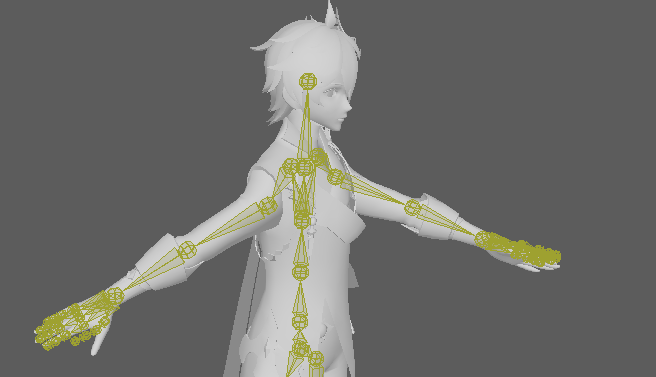
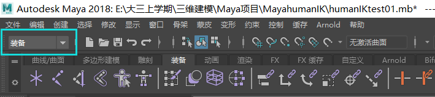

### Maya骨骼绑定

参考教程:

[Maya-humanIK-骨骼绑定蒙皮教学_哔哩哔哩_bilibili](https://www.bilibili.com/video/BV1k54y1X7Bi?from=search&seid=14110232134110071920&spm_id_from=333.337.0.0)

一些人的模型的网站下载:

[Daz 3D - 3D Models and 3D Software | Daz 3D](https://www.daz3d.com/)

#### 所使用的插件:Maya_humanIK

优点:对于两足生物来说骨骼绑定非常迅速

缺点:对非两足效果不明显,且不支持表情刻画.

#### 1.插件准备

这里有快速装备和Human IK两个组件.

##### 如何让Human IK出现在属性编辑器的下面?

点击完之后可以看到,已经新增完成了:

### 通过快速装备功能

#### 2.快速装备功能

功能所在位置:

点击**自动装备**之后,可以看到骨骼已经绑定完了(当然有些地方会出现错误),计算机已经自动帮我们完成了**骨骼的绑定**和蒙皮.

经过简单的尝试可以看到人物骨骼的移动:

##### FK和IK介绍

红色的圈+蓝色的圈:IK控制器:反向动力学控制器

黄色:FK控制器(正向动力学),其实不是骨骼,但是可以控制骨骼,K帧

[【人物动画必看】【如何理解IK和FK】【中文字幕】【正/反向运动学】【二维三维通用原理】【不限软件】_哔哩哔哩_bilibili](https://www.bilibili.com/video/BV18E411v7F9?from=search&seid=12302264586077942076&spm_id_from=333.337.0.0)

###### FK与IK之间的区别:

###### 快速装备的时候会有关节不在正确位置的问题

这个问题在快速装备中不是很好解决,但是可以在分布式当中去解决.

###### 如何解除模型的锁定?

在这里,选择**解除锁定选定项**,就可以解除模型的锁定了.

### 通过分布方法创建骨骼

#### 3.利用分布方法创建骨骼

在创建之前首先要把原来的骨骼删掉(如果这个骨骼已经废弃不用的话).

接下来选择**分布式**:

新建一个角色(点击那个加号)

**相对来说,分布式创建会更精准一些**,可以手动地安排关节的位置

##### (1)新建一个角色(选择网络,刚才已完成)

##### (2)将当前网络加入到几何体当中

##### (3)关于导向部分,推荐采用默认设置即可

##### (4)关于导向设置部分,

要求角色的y轴一定向上,也就是说角色头顶要朝向y轴,面要朝向z轴

框中所示的部分可以进行调整,当调整完毕之后点击下方的**创建/更新**即可查看.

这个时候我们会法线角色多了一些**球状的关节标点**:

###### 什么是球状关节?

我们可以创建一个骨骼进行实验.

注意到,球关节部分是可以移动的(而且可能会连带着其他骨骼进行移动),而非球关节处是不能够移动的.

##### (5)对刚才系统添加的球状关节进行调整

因为现在创建的球状关节并没有连接起来,因此我们可以手动的进行球状关节位置的调整,使其更加贴近原来的模型.

**尽可能用平移进行修改,而不要使用旋转**

###### 如何确保修改的骨骼两边是对称的?

图中所示的部分是可以控制对称的.

经过简单对称操作时候的模型如下:

###### 注意:不要删除球状关节,否则后续会出现问题

**需要确保骨骼的关节点是对称的**,不然后续的绑定不符合人体工程学.

##### (6)进行骨架和装备生成

在这里不需要做过多的操作,直接点击创建/更新即可.

##### 一点建议

在初学的时候,模型的精度不需要过高,这样在后续蒙皮和刷权重的时候会更容易一点,这样也方便去对动作进行调整.(**模型精度太高蒙皮的时候会出现问题**).

##### 尝试时出现的问题

可以看到,FK发生了移动,但是模型**本身并没有发生移动**.原因是蒙皮和权重还有问题.

###### 解决方案:

记得在这里更新蒙皮就可以了.

​		首先想让模型跟着骨骼运动,必须用骨骼对模型蒙皮,这样才能动,蒙皮后一般默认蒙皮都是乱的.这让虽然模型能跟着骨骼动,但是由于莫默认蒙皮是乱的,所以模型是不能跟着骨骼均匀的运动的.

​		所以要刷**权重**把模型给刷均匀才行,只有这样才能叫真正的绑定,在真正的绑定中蒙皮比绑骨骼这些更加重要.

关于蒙皮和刷权重的问题后续会进行介绍.

### 通过创建骨架的方法

#### 4.创建骨架功能

直接点击右边栏的Human IK并创建骨架.

##### (1)对右侧的基本参数进行调整

**需要注意的是角色比例,每次调整的时候(比如改成0.8)骨骼会有大小变化,但是这个数值依然会重新回到1.0,也就是说每次都是在上一次调节完之后的基础上做的.**

##### (2)对骨骼进行位置的基本调整

###### D键的使用诀窍

通过点击D键,可以单独对某一个关节进行调整而不会影响其他的关节的位置(**按D键操作十分实用**).

调整之后的结果如下图所示:

###### 如何在调整之后进行左右镜像?

请注意,中间的骨骼暂时不要动,等**两边确定好了并进行镜像之后**再去调整中间的骨骼,

#### 5.创建控制装备

选择所有的骨骼,然后**创建控制装备**:

(注:将骨骼设定解锁可以删除原来的控制装备并创建新的)

###### 请注意

创建控制装备必须是在**骨骼**的基础上去做的(是那个Hips而不是Reference),参考下图:

创建完之后就如之前的自动绑定一样,会为我们创建好IK和FK对应的区域.

**再次注意,黄色部分并不是骨骼,而是FK,而红色部分(还有蓝色的圈)则是IK控制器**.

###### 如何重命名一个角色?

###### 如何调整装备的外观?

###### 如果一个IK控制器太小了,想放大一些怎么做?

选中那个环,像别的缩放一样直接用缩放工具拉大即可.

###### 真正的骨骼在哪?

这三个按钮分别对应IK,FK与骨骼的显示与隐藏,我们可以隐藏刚才的IK与FK并打开骨骼,可以看到:

#### 6.进行蒙皮操作

##### (1)选中模型+骨骼中心点:

##### (2)在菜单中选择绑定蒙皮

首先将这里调整为**装备**,否则上方菜单栏不会出现蒙皮.

选择绑定蒙皮:

###### 如何重置相关的设置?

进行相关设置的修改:

点击应用,此时回到模型就可以看到已经成功地进行蒙皮了.

##### (3)蒙皮测试

###### 相关工具介绍

左:移动FK和IK时模型会全身移动

中:移动FK和IK时只有相关骨骼会移动

右:可以框选骨骼但是不能直接移动,安全选择.

左:固定平移

中:固定旋转

右:释放所有固定

最右:回到初始姿势

固定之后就不能够完成相关的操作了,直到释放操作

**这里的按钮组合还不太熟练,后面还需要练习**.

#### 一个大问题的解决方案:如果关节移动方向反了怎么办?

首先必须要**检查模型的朝向是否正确**,必须是头朝上(y轴正向),面向**+Z方向**,这样的话就不会发生关节反向旋转的问题.

#### 问题:大腿的关节不能够移动是怎么回事?尚未解决.

#### 7.刷权重操作

进行蒙皮之后的模型可能在移动骨骼的时候会出现**穿帮现象**,如下图所示:

可以看到,鞋子上的装饰品也随骨骼发生了一定的变形,

##### 解决方法:刷权重

##### 为角色添加简单的骨骼动画

选择一个IK控制器,在第一帧的时候按下S键,创建一个关键帧,然后移动到第15帧并**调整IK控制器的位置**,此时再按下S键就可以生成中间部分的动画了.

##### 绘制蒙皮权重方法

首先,选择模型并选择**蒙皮->绘制蒙皮权重**,打开如下图所示:

此时点击具体的身体部位就可以看到如下画面:

**白色表示控制越强,越黑表示控制越弱**.

选择好笔刷之后,**点击B键可以调整笔刷的大小**.

###### 已知权重大了,如何减少权重?

很明显可以看到,左侧腿会受到右侧腿的影响,因此左侧腿应该涂黑.

(下图的参数不确定是不是这个意思)

**注意:太高精度的模型在刷权重的时候会非常麻烦,因为要精细去调整面片的权重**.推荐刚开始的时候采用低精度.

重新刷完腿的权重之后,可以看到动作已经变得好多了,穿帮效果也得到了极大的缓解.(**但对于精度高的模型而言确实是工程量巨大**)

在一边完成蒙皮操作之后,就可以使用**镜像蒙皮权重**的方式修改好另一边的蒙皮权重:

至此,本次关于入门骨骼绑定,蒙皮以及刷权重的总结就到这里,

