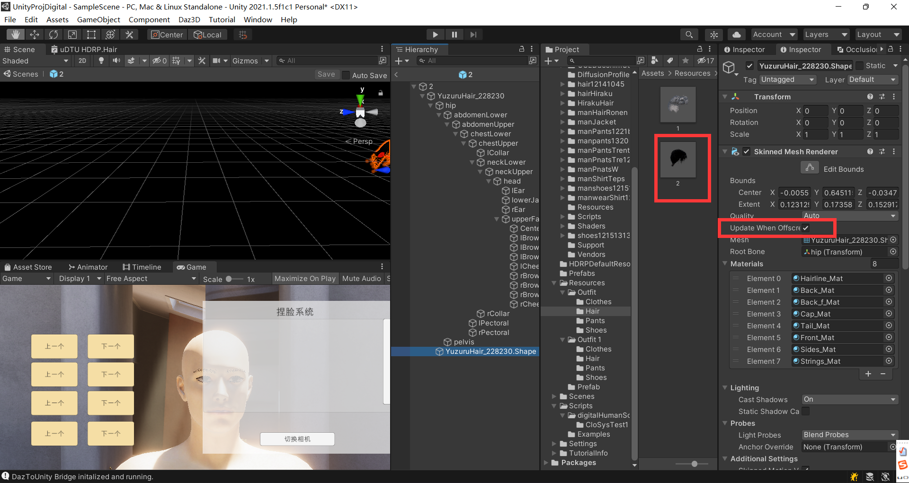
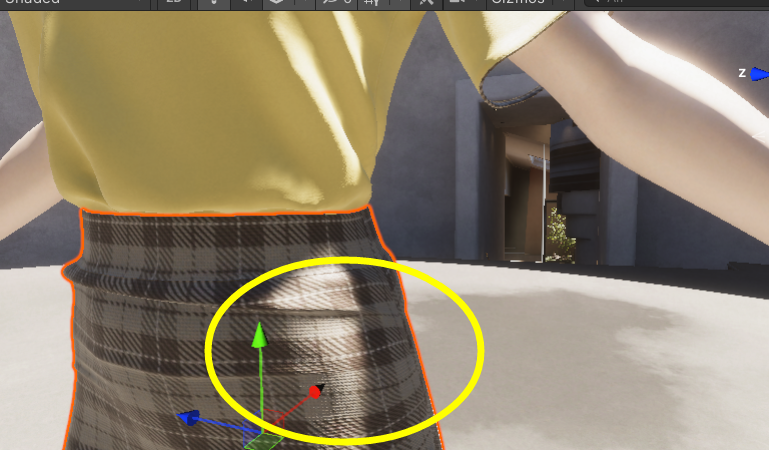

# 使用unity实现数字人

#### 设置HDRP

[Daz Bridges Tutorial - Daz to Unity - YouTube](https://www.youtube.com/watch?v=we8hPrz_KQU)

看这个的评论 有适用于我这个版本的

若使用HDRP


[【Unity3d基础】Unity换装系统(1)_coffeecato的博客-CSDN博客](https://blog.csdn.net/coffeecato/article/details/53828479?spm=1001.2101.3001.6650.1&utm_medium=distribute.pc_relevant.none-task-blog-2~default~CTRLIST~Rate-1-53828479-blog-81413961.pc_relevant_3mothn_strategy_recovery&depth_1-utm_source=distribute.pc_relevant.none-task-blog-2~default~CTRLIST~Rate-1-53828479-blog-81413961.pc_relevant_3mothn_strategy_recovery&utm_relevant_index=2)

https://blog.uwa4d.com/archives/avartar.html


#### 动画

完成功能切换动画

动画


效果


状态机

使用状态机


代码

```C#
using System.Collections;
using System.Collections.Generic;
using UnityEngine;

public class changeAnim : MonoBehaviour
{
    private Animator player;
    private void Start()
    {
        player = gameObject.GetComponent<Animator>();
    }
    void OnGUI()
    {
        if (GUI.Button(new Rect(10, 140, 100, 30), "ChangeAnim"))
        {
            ChangeAnim(1);
        }

        if (GUI.Button(new Rect(10, 180, 100, 30), "ChangeAnim2"))
        {
            ChangeAnim(2);
        }

        if (GUI.Button(new Rect(10, 220, 100, 30), "default"))
        {
            ChangeAnim(0);
        }
    }
    void ChangeAnim(int num)
    {
        player.SetInteger("animNum", num);
    }
}

```


#### 换装

##### 方法1：（现已弃用）


```C#
using UnityEngine;
using System.Collections;
using System.Collections.Generic;

 
public class changeSk : MonoBehaviour
{

    private SkinnedMeshRenderer oldSmr = null;
    private SkinnedMeshRenderer newSmr = null;

    private Object oldObj = null;
    private Object newObj = null;

    private GameObject oldInstance = null;
    private GameObject newInstance = null;


    void OnGUI()
    {
        if (GUI.Button(new Rect(10, 10, 100, 30), "ChangeHair"))
        {
            ChangeHairWithSke(1);
        }

        if (GUI.Button(new Rect(10, 50, 100, 30), "ChangeHair2"))
        {
            ChangeHairWithSke(2);
        }

        if (GUI.Button(new Rect(10, 90, 100, 30), "default")) 
        {
            ChangeHairWithSke(0);
        }

        if (GUI.Button(new Rect(110, 10, 100, 30), "ChangePants"))
        {
            ChangePantsWithSke(1);
        }
    }


    void ChangeHairWithSke(int hairNum)
    {
        //加载替换对象的资源文件
        if(hairNum==1)
            newObj = Resources.Load("Prefab/hairHiraku_Pre1");

        if (hairNum == 2)
            newObj = Resources.Load("Prefab/hairPre2");

        if(hairNum==0)
        {
            newObj = Resources.Load("Prefab/nullPre1");
        }    

        newInstance = Instantiate(newObj) as GameObject;

        oldSmr = gameObject.GetComponentInChildren<SkinnedMeshRenderer>();
        newSmr = newInstance.GetComponentInChildren<SkinnedMeshRenderer>();

        Transform[] oldBones = gameObject.GetComponentsInChildren<Transform>();
        //Transform[] oldBones = oldSmr.bones;              //模型会出现错乱
        Debug.Log("oldBones.Length: " + oldBones.Length);
        Transform[] newBones = newSmr.bones;
        Debug.Log("newBones.Length: " + newBones.Length);

        //对骨骼进行重新排序
        List<Transform> bones = new List<Transform>();
        foreach (Transform bone in newBones)
        {
            foreach (Transform oldBone in oldBones)
            {
                if (bone != null && oldBone != null)
                {
                    if (bone.name != oldBone.name)
                    {
                        continue;
                    }
                    bones.Add(oldBone);
                }
            }
        }
        //替换Mesh数据
        oldSmr.bones = bones.ToArray();
        oldSmr.sharedMesh = newSmr.sharedMesh;
        oldSmr.sharedMaterial = newSmr.sharedMaterial;


        //删除无用的对象
        GameObject.DestroyImmediate(newInstance);
        GameObject.DestroyImmediate(newSmr);

        //oldSmr.bones = bones.ToArray();
        //oldSmr.sharedMesh = newSmr.sharedMesh;
        //oldSmr.sharedMaterial = newSmr.sharedMaterial;
    }

    void ChangePantsWithSke(int hairNum)
    {
        //加载替换对象的资源文件
        //if (hairNum == 1)
            //newObj = Resources.Load("Prefab/manPnatsPre1");
            newObj = Resources.Load("Prefab/manPnatsW2");
        if (newObj) Debug.Log("PANTSpRE");

        //if (hairNum == 2)
        //    newObj = Resources.Load("Prefab/hairPre2");

        //if (hairNum == 0)
        //{
        //    newObj = Resources.Load("Prefab/nullPre1");
        //}

        newInstance = Instantiate(newObj) as GameObject;

        GameObject goID = GameObject.Find("WindwalkerPants_9503.Shape");//lllLLL
        //GameObject goID = GameObject.Find("lllLLL");//lllLLL

        //if (goID) Debug.Log("PANTS");
        //GameObject goold = gameObject.transform.GetChild("WindwalkerPants_9503.Shape");
        //oldSmr = gameObject.GetComponentInChildren<SkinnedMeshRenderer>();
        oldSmr = goID.GetComponentInChildren<SkinnedMeshRenderer>();

        newSmr = newInstance.GetComponentInChildren<SkinnedMeshRenderer>();

        Transform[] oldBones = gameObject.GetComponentsInChildren<Transform>();
        //Transform[] oldBones = oldSmr.bones;              //模型会出现错乱
        Debug.Log("oldBones.Length: " + oldBones.Length);
        Transform[] newBones = newSmr.bones;
        Debug.Log("newBones.Length: " + newBones.Length);

        //对骨骼进行重新排序
        List<Transform> bones = new List<Transform>();
        foreach (Transform bone in newBones)
        {
            foreach (Transform oldBone in oldBones)
            {
                if (bone != null && oldBone != null)
                {
                    if (bone.name != oldBone.name)
                    {
                        continue;
                    }
                    bones.Add(oldBone);
                }
            }
        }
        //替换Mesh数据
        oldSmr.bones = bones.ToArray();
        oldSmr.sharedMesh = newSmr.sharedMesh;
        oldSmr.sharedMaterial = newSmr.sharedMaterial;


        //删除无用的对象
        GameObject.DestroyImmediate(newInstance);
        GameObject.DestroyImmediate(newSmr);

        //oldSmr.bones = bones.ToArray();
        //oldSmr.sharedMesh = newSmr.sharedMesh;
        //oldSmr.sharedMaterial = newSmr.sharedMaterial;
    }
}
```


##### 方法2：

**https://moecia.github.io/2021/05/05/UnityChangeOutfit-copy/**

https://docs.unity3d.com/cn/2020.2/Manual/class-SkinnedMeshRenderer.html

基于骨骼点替换的换装系统。

为了让播放动画的时候，人物服装跟着人物一起在动，即有蒙皮，此处使用4个C#脚本实现让服装的模型的骨骼点 替换成身体模型的骨骼点，这样unity在播放它的身体动画的时候，服装也会一起做动画。

###### SkinnedMeshHelper.cs

这个class主要就是按照我在引言中提到的思路进行骨骼点查找，然后返回一个新的骨骼点array供替换。

```C#
using System.Linq;
using UnityEngine;

/// <summary>
/// 进行骨骼点查找，然后返回一个新的骨骼点array供替换。
/// </summary>
public static class SkinnedMeshHelper
{
    public static Transform[] GetNewBones(SkinnedMeshRenderer root, SkinnedMeshRenderer source)
    {
        //复习lambda表达式 s => s.name   传入s传出s.name
        return root.bones
            .Where(x => source.bones.Select(s => s.name).Contains(x.name)).ToArray();
    }
}
```

###### Outfit.cs

这个class放在服装的prefab上，设定好OutfitType（Hair,Cloth,Pant,Shoes）后放在Resources/Outfit/{OutfitType}/下。文件名和**Id**保持一致。

```C#
using UnityEngine;
/// <summary>
/// 位置：
/// 这个class放在服装的prefab上，
/// 设定好OutfitType（Hair,Cloth,Pant,Shoes）后放在Resources/Outfit/{OutfitType}/下。
/// 文件名和**Id**保持一致。（1234...）
/// 
/// 代码：
/// 获得这个预制体上的SkinnedMeshRenderer
/// </summary>
public class Outfit : MonoBehaviour
{
    [SerializeField] private OutfitType outfitType;
    private SkinnedMeshRenderer skinnedMeshRenderer;

    public OutfitType OutfitType { get => outfitType; set => outfitType = value; }
    public int Id { get => int.Parse(this.name); } //获取预制体名字 1234...
    public SkinnedMeshRenderer SkinnedMeshRenderer
    {
        get
        {
            if (skinnedMeshRenderer == null)
            {
                //获得这个预制体上的SkinnedMeshRenderer
                skinnedMeshRenderer = this.GetComponentInChildren<SkinnedMeshRenderer>();
            }
            return skinnedMeshRenderer;
        }
    }
}

public enum OutfitType
{
    Hair,
    Cloth,
    Pant,
    Shoes
}
```

###### EquipmentManager.cs

这个类用于换装前端逻辑，使用前先在人物身上放4个Slot，分别对应头，身，腿和脚。

```c#
using UnityEngine;
/// <summary>
/// 这个类用于换装前端逻辑，使用前先在人物身上放4个Slot，分别对应头，身，腿和脚。
/// 
/// 代码：加载资源，从文件夹中读取相应资源，
/// </summary>
public class EquipmentManager : MonoBehaviour
{
    [SerializeField] private Transform hairSlot;
    [SerializeField] private Transform clothSlot;
    [SerializeField] private Transform pantSlot;
    [SerializeField] private Transform shoesSlot;
    [SerializeField] private SkinnedMeshRenderer avatarSkinnedMesh;

    public Transform HairSlot { get => hairSlot; }
    public Transform ClothSlot { get => clothSlot; }
    public Transform PantSlot { get => pantSlot; }
    public Transform ShoesSlot { get => shoesSlot; }

    public int HairId { get; set; }
    public int ClothId { get; set; }
    public int PantId { get; set; }
    public int ShoesId { get; set; }

    public void LoadEquipment()
    {
        ChangeOutfit(OutfitType.Hair, 1);//hair 暂时作为装饰
        ChangeOutfit(OutfitType.Cloth, 1);
        ChangeOutfit(OutfitType.Pant, 1);
        ChangeOutfit(OutfitType.Shoes, 1);
    }

    public void ChangeOutfit(OutfitType outfitType, int outfitId)
    {
        GameObject outfit = null;
        Transform target = null;
        //outfitId = outfitId % 2+1;
        switch (outfitType)
        {
            case OutfitType.Hair:
                outfit = Resources.Load<GameObject>($"Outfit/Hair/{outfitId}");
                target = hairSlot;
                if (hairSlot.childCount > 0)
                {
                    Destroy(hairSlot.GetChild(0).gameObject);
                }
                HairId = outfitId;
                break;
            case OutfitType.Cloth:
                outfit = Resources.Load<GameObject>($"Outfit/Clothes/{outfitId}");
                target = clothSlot;
                if (clothSlot.childCount > 0)
                {
                    Destroy(clothSlot.GetChild(0).gameObject);
                }
                ClothId = outfitId;
                break;
            case OutfitType.Pant:
                outfit = Resources.Load<GameObject>($"Outfit/Pants/{outfitId}");
                target = pantSlot;
                if (pantSlot.childCount > 0)
                {
                    Destroy(pantSlot.GetChild(0).gameObject);
                }
                PantId = outfitId;
                break;
            case OutfitType.Shoes:
                outfit = Resources.Load<GameObject>($"Outfit/Shoes/{outfitId}");
                target = shoesSlot;
                if (shoesSlot.childCount > 0)
                {
                    Destroy(shoesSlot.GetChild(0).gameObject);
                }
                ShoesId = outfitId;
                break;
        }
        
        var outfitObj = Instantiate(outfit, target);
        //得到服装的SkinnedMeshRenderer
        var smr = outfitObj.GetComponent<Outfit>().SkinnedMeshRenderer;
        //去获取服装骨骼和人物骨骼相匹配的地方
        var bones = SkinnedMeshHelper.GetNewBones(avatarSkinnedMesh, smr);
        //将服装骨骼替换为人物骨骼
        smr.bones = bones;
    }
}
```

###### ChangeOutfitController.cs

换装演示场景的UI控制逻辑。

```c#
using System.Collections;
using System.Collections.Generic;
using UnityEngine;
using UnityEngine.UI;
/// <summary>
/// 换装演示场景的UI控制逻辑。
/// </summary>
public class ChangeOutfitController : MonoBehaviour
{
    [SerializeField] private Button prevHair;
    [SerializeField] private Button nextHair;
    [SerializeField] private Button prevCloth;
    [SerializeField] private Button nextCloth;
    [SerializeField] private Button prevPant;
    [SerializeField] private Button nextPant;
    [SerializeField] private Button prevShoes;
    [SerializeField] private Button nextShoes;

    [SerializeField] private EquipmentManager equipmentMgr;

    private int currClothIndex = 1;
    private int currHairIndex = 1;
    private int currPantIndex = 1;
    private int currShoesIndex = 1;

    private int hairSize = 0;
    private int clothesSize = 0;
    private int pantsSize = 0;
    private int shoesSize = 0;
    // Start is called before the first frame update
    void Start()
    {
        equipmentMgr.LoadEquipment();

        prevHair.onClick.AddListener(() => { ChangeOutfit(OutfitType.Hair, false); });
        nextHair.onClick.AddListener(() => { ChangeOutfit(OutfitType.Hair, true); });
        prevCloth.onClick.AddListener(() => { ChangeOutfit(OutfitType.Cloth, false); });
        nextCloth.onClick.AddListener(() => { ChangeOutfit(OutfitType.Cloth, true); });
        prevPant.onClick.AddListener(() => { ChangeOutfit(OutfitType.Pant, false); });
        nextPant.onClick.AddListener(() => { ChangeOutfit(OutfitType.Pant, true); });
        prevShoes.onClick.AddListener(() => { ChangeOutfit(OutfitType.Shoes, false); });
        nextShoes.onClick.AddListener(() => { ChangeOutfit(OutfitType.Shoes, true); });
        
        string[] dirsHair = System.IO.Directory.GetFileSystemEntries("Assets/Resources/Outfit/Hair");
        hairSize = dirsHair.Length/2;///2应该是因为有mate文件
        string[] dirsPants = System.IO.Directory.GetFileSystemEntries("Assets/Resources/Outfit/Pants");
        pantsSize = dirsPants.Length / 2;
        string[] dirsClothes = System.IO.Directory.GetFileSystemEntries("Assets/Resources/Outfit/Clothes");
        clothesSize = dirsClothes.Length / 2;
        string[] dirsShoes = System.IO.Directory.GetFileSystemEntries("Assets/Resources/Outfit/Shoes");
        shoesSize = dirsShoes.Length / 2;
        //Debug.Log($"hairSize++{hairSize}");
    }

    private void ChangeOutfit(OutfitType outfitType, bool isNext)
    {
        switch (outfitType)
        {
            case OutfitType.Hair:
                if (isNext)
                {
                    currHairIndex = currHairIndex < hairSize ? ++currHairIndex : 1;
                }
                else
                {
                    currHairIndex = currHairIndex > 1 ? --currHairIndex : hairSize;
                }
                equipmentMgr.ChangeOutfit(outfitType, currHairIndex);
                break;
            case OutfitType.Cloth:
                if (isNext)
                {
                    currClothIndex = currClothIndex < clothesSize ? ++currClothIndex : 1;
                }
                else
                {
                    currClothIndex = currClothIndex > 1 ? --currClothIndex : clothesSize;
                }
                equipmentMgr.ChangeOutfit(outfitType, currClothIndex);
                break;
            case OutfitType.Pant:
                if (isNext)
                {
                    currPantIndex = currPantIndex < pantsSize ? ++currPantIndex : 1;
                }
                else
                {
                    currPantIndex = currPantIndex > 1 ? --currPantIndex : pantsSize;
                }
                equipmentMgr.ChangeOutfit(outfitType, currPantIndex);
                break;
            case OutfitType.Shoes:
                if (isNext)
                {
                    currShoesIndex = currShoesIndex < clothesSize ? ++currShoesIndex : 1;
                }
                else
                {
                    currShoesIndex = currShoesIndex > 1 ? --currShoesIndex : clothesSize;
                }
                equipmentMgr.ChangeOutfit(outfitType, currShoesIndex);
                break;
        }
    }
}
```


**遇到的问题：**

离近了看物体会消失，离远了看物体才出现

https://answers.unity.com/questions/1070418/scene-view-objects-disappear-when-i-scoll-to-near.html


**原因：**

你应该选择你的游戏对象并按下“F”键——这将使你的SceneView摄像机聚焦在对象上。

(我认为你看不到这个物体，因为**有剪切平面**)

希望这能有所帮助!

You should probably select your GameObject and press the "F"-key -- this focuses your SceneView camera on the object.

(I think you can't see the object because of the clipping planes)

Hope this helps !


我们可以发现 他（裤子）的中心出了屏幕之后 就不能出现


**解决方法：**


将他们的xyz都改为0


**遇到的问题与解决：**

问题：

离近了看物体会消失，离远了看物体才出现

原因：

看不到这个物体，因为有剪切平面

将物体初始位置设为0即可


**本次效果：**


#### 尝试解决穿模问题

[unity - How do you have the clothing mesh hide the body mesh underneath? - Game Development Stack Exchange](https://gamedev.stackexchange.com/questions/188675/how-do-you-have-the-clothing-mesh-hide-the-body-mesh-underneath)

如果你的角色需要能够不断地更换衣服(如MMO中的装备盔甲)，我所做的就是为你的主角创建一个着色器，除了你通常的纹理之外，还需要一个**特殊的服装蒙版纹理**，根据他们的穿着来控制你的角色的alpha通道。例如，如果你想为你的角色装备一件t恤，你的遮罩纹理将显示除躯干和肩膀外的所有身体紫外线为白色，其余为黑色。如果你想穿三件套的西装，除了手、脖子和脸，其他部位都是黑色的。你可能需要分配多个纹理槽的衣服可以混合和匹配，但这基本上应该设置所有应该被掩盖的可见，所以你不必担心剪裁除了身体应该可见的区域(颈部和手腕)。 


方法1：

微调所有的衣服模型的锚点位置


方法2：

it has something to do with a wrong pivot of the mesh your trying to render, so if the "wrong pivot" of this object falls behind the camera`s renderview, then the object simply gets treated as no longer importent to be rendered.
either you fix the objects pivot in blender or maya or "if its not a problem to render this object when the camera doesnt look at it"
--->select the obejct select the mesh renderer and thick the box where it says "update when offscreen"

https://forum.unity.com/threads/objects-disappear-when-i-move-camera-no-clipping-issue.916937/

让他不在屏幕上的时候也去渲染




头发

方法1：

下载资源


方法2：


https://docs.unity3d.com/Packages/com.unity.render-pipelines.high-definition@12.1/manual/master-stack-hair.html


别的视频的daz to unity头发


很一般


放弃daz 

用别的hair

教程：

https://www.youtube.com/watch?v=iv980le7S_c

github链接：

https://github.com/Unity-Technologies/com.unity.demoteam.hair.git


打开场景


### 数字人语音驱动嘴型

wav传入unity

用数据流那种，调用python

python返回给unity那种数据流的结果


python读出wav

python返回给unity那种数据流的结果


1

材质错误

调整材质


2

材质丢失


创建材质并赋值


这些粗糙度都不错





背景


后面可以把树叶弄进来


头发


##### 头发问题

1、


下载的包unity不能打开 是不是只能游戏中打开


2、

之前学长在群里发的一个资源
把那个资源里女性的头发从blender里面分下来
然后发到unity


材质直接改为透明

问题：

会出现错误的半透明效果，后面的头发会出现


问题来源：

（参考unity shader入门精要）


加一个shader弄一下


在unity中：


改后：


头发面片数量


#### 动画


#### 牙齿问题


改在这0209


#### 智能模块

https://blog.csdn.net/qq_41452267/article/details/109350666


###### UNITY C# 调用dll

自己写一个dll测试

https://www.cnblogs.com/0kk470/p/10607544.html

C++

.cpp

```C++
#include "DllInterface.h"
#include <math.h>
float GetDistance(float x1, float y1, float x2, float y2)
{
    return sqrt((x1 - x2) * (x1 - x2) + (y1 - y2) * (y1 - y2));
}
```


.h

```C++
#pragma once
#include<math.h>
#include<string.h>
#include<iostream>
#define _DllExport _declspec(dllexport) //使用宏定义缩写下


extern "C"
{
	float _DllExport GetDistance(float x1, float y1, float x2, float y2);
}

```


配置方法


untiy c#

```C#
using System.Collections;
using System.Collections.Generic;
using UnityEngine;
using System.Runtime.InteropServices;

public class trytigitalDLL : MonoBehaviour
{
    //[DllImport("speak")]
    //private static extern string inference(string a); 
    [DllImport("CppInterface")]
    private static extern float GetDistance(float x1, float y1, float x2, float y2); 

    void Start()
    {
        Debug.Log("into speak");
        //string a = "test_sentence.wav";
        //Debug.Log(inference(a));

        Debug.Log(GetDistance(1f,2f,3f,4f));
    }
}

```


测试结果


运行后，成功调用了dll并输出2.828...


问题：

调用我们的dll会显示


找不到这个dll


原因是：

由于c#无法调用python的dll 但可以调用c/c++的dll

我们的这个dll有一些语法问题，python改为cpython的过程中有非常多需要改的，容易错误


解决方案：

1、沿用现在在用的调用exe

2、尝试http通信，网络传输json报文 ，但是这样的话可能要买服务器（感觉是好的解决方法）

3、继续尝试dll，继续改为cpython 把所有函数返回值指定一下设置一下 ，但是我们在想改的过程中是否那些众多的库也需要改

4、通过本地socket，开两个端口


TODO：

打光问题

给一个视频，可以动捕

改bug，可以换多个衣服 √
