# 全身驱动任务


### 人体驱动的任务

#### 相关知识学习

smpl学习：

https://zhuanlan.zhihu.com/p/256358005

#### json格式适配unity + 读取并解析json


###### json格式

https://blog.csdn.net/yanqing_happy/article/details/98871448


提供的json：

每一帧的动作

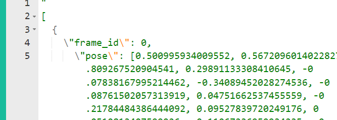

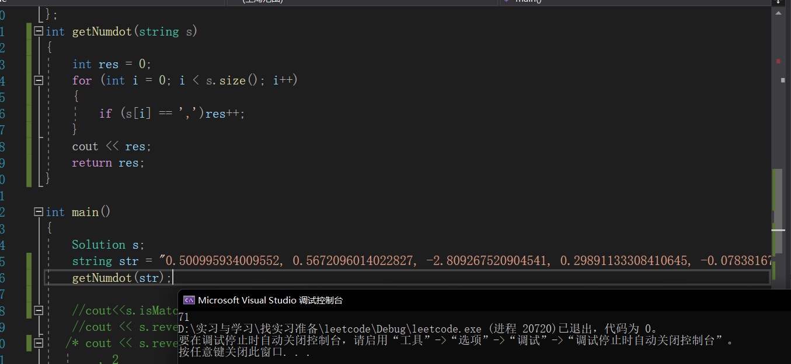

因此pose位置一共有72个数字，每个

计算得出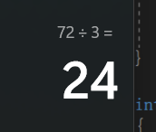

同时根据查找的资料确定

一组姿态参数有着24×3维度的数字，去描述某个时刻人体的动作姿态，其中的24表示的是24个定义好的人体关节点，其中的3并不是如同识别问题里面定义的(x,y,z)空间位置坐标（location），而是指的是该节点针对于其父节点的旋转角度的轴角式表达(axis-angle representation)（对于这24个节点，作者定义了一组关节点树）

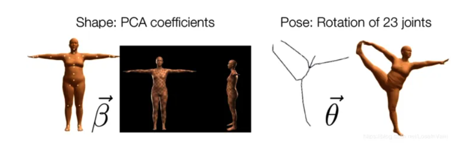


遇到问题与解决：

​                ● 问题（1）unity报错 “JSON must represent an object type.” 是因为json格式不符合unity解析规范，使其规范即可

https://blog.csdn.net/chasinghope/article/details/103710073

​                ● 问题（2）：转义符导致unity无法识别。通过网站去除转义

通过网站去除转义：https://www.sojson.com/yasuo.html

然后在网站https://www.json.cn/json/jsononline.html看到这个json结构

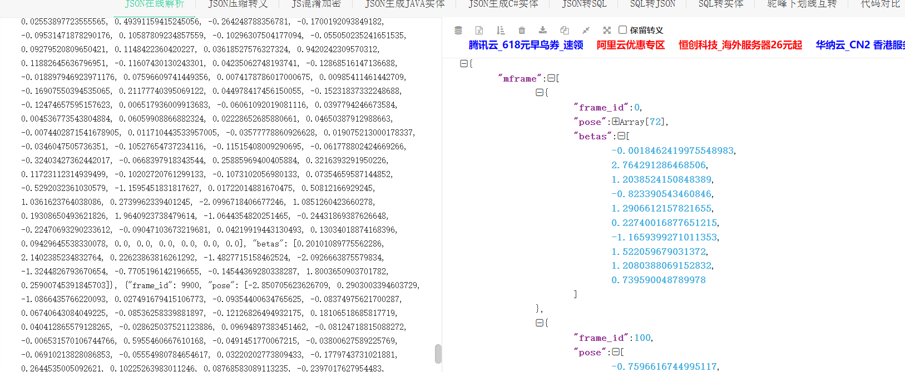


​                ● 问题（3）：transform是作为引用传入的，Unity中的transform、gameobject是类类型，所以它们是引用。直接弄一个四元数数组存放初始的旋转角也不可以。后面发现不用使用Rotate也无需记录初始位置


```C#
string str=ReadData();
        Debug.Log("smpl"+str);
        
        string jsonData = ReadData();
        //Data m_PersonData = JsonUtility.FromJson<Data>("{\"mframe\":" + jsonData + "}");
        Data m_PersonData = JsonUtility.FromJson<Data>(jsonData);
           //
        foreach (mFrame item in m_PersonData.mframe)
        {
            Debug.Log("frame_id"+item.frame_id);
            Debug.Log("pose0"+item.pose[0]);
        }
```


对照一下我的代码是否获取到了：

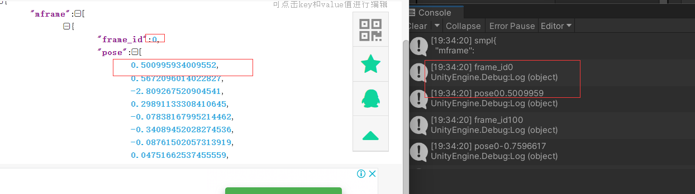

可以看到，已经获取到了这个pose的值

```C#
Debug.Log("frameSize"+m_PersonData.mframe.Length);
Debug.Log("poseSize"+m_PersonData.mframe[0].pose.Length);
Debug.Log("betasSize"+m_PersonData.mframe[0].betas.Length);
```

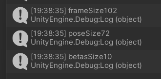


#### 驱动人体运动

学长让导入一个网上的模型，我暂时使用这个网上开源免费模型进行试验

使用的网上模型在unity中：手动对比可以得到对应其index

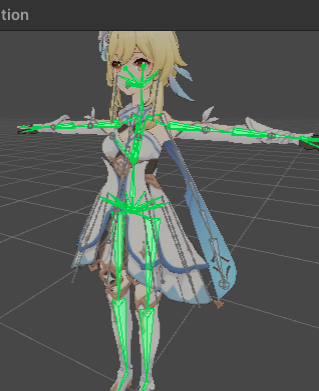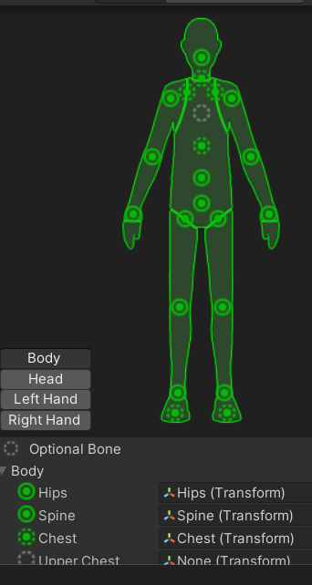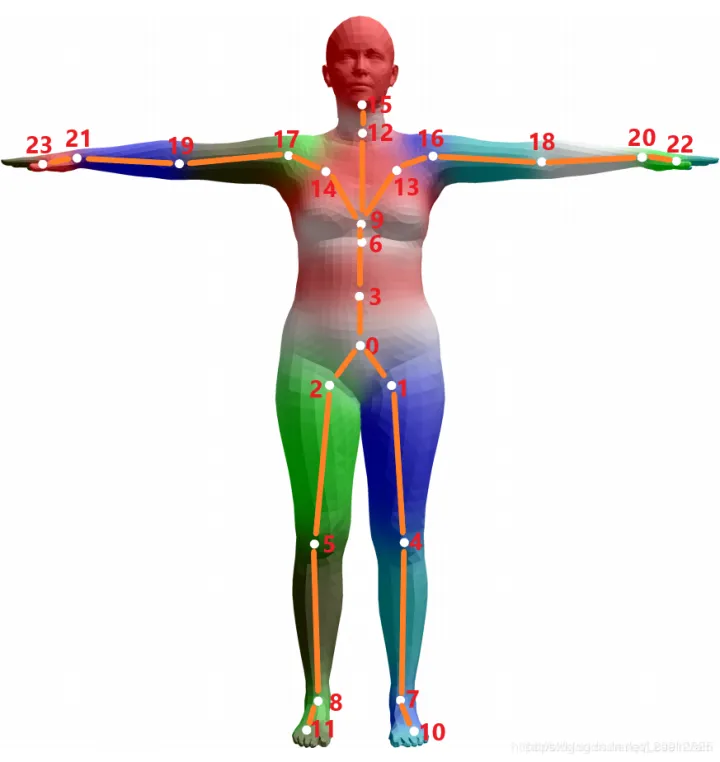

以下是一些对应：

hips-0

spine-3

leftleg 1 leftknee4

rightleg 2 rightknee5


0-chest

13-leftshoulder （listid12）

14-rightshoulder（listid13）

6-chest （listid14）

9-chest（listid14）

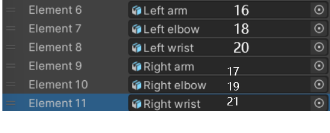

 ● 问题（4）关节旋转错误

接下来的驱动会出现有的关节是正确的，有的关节是错误的，所以我们具体观测一些关节的具体旋转角


如果做出最后坐下的造型

应该是

左腿应该是大概 60 0 0

实际上

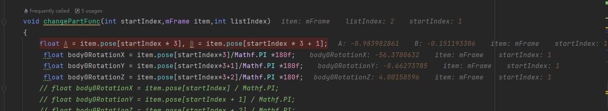

实际表现错误 比较合理的应当是 56 ，。。 ，。。。相当于x取负值


膝盖： 90 0 0

实际表现没错

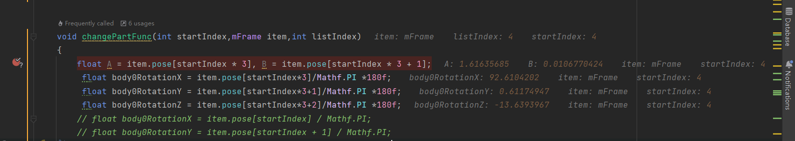


解决方法：

通过获取数据后的再次旋转，尝试每一个关节需要做的数据加强，即对错位的关节做一些镜像或者加减角度的操作


##### 驱动腿部


debug一下看看一些动作是否有

4500帧

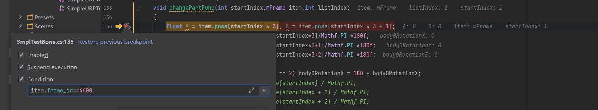

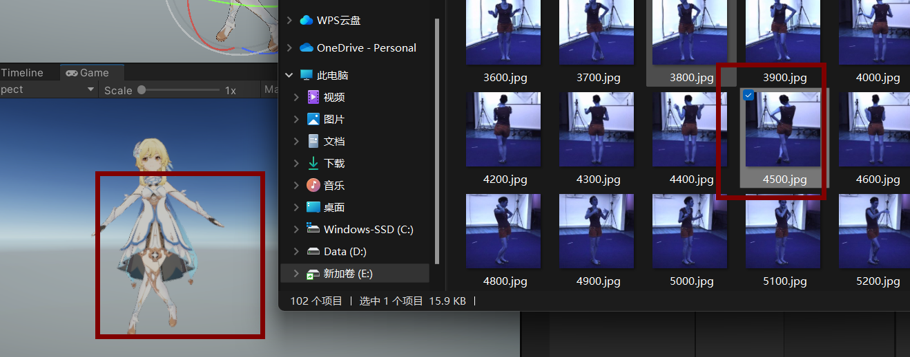

可以看到 确实做了一样的动作


最后的帧

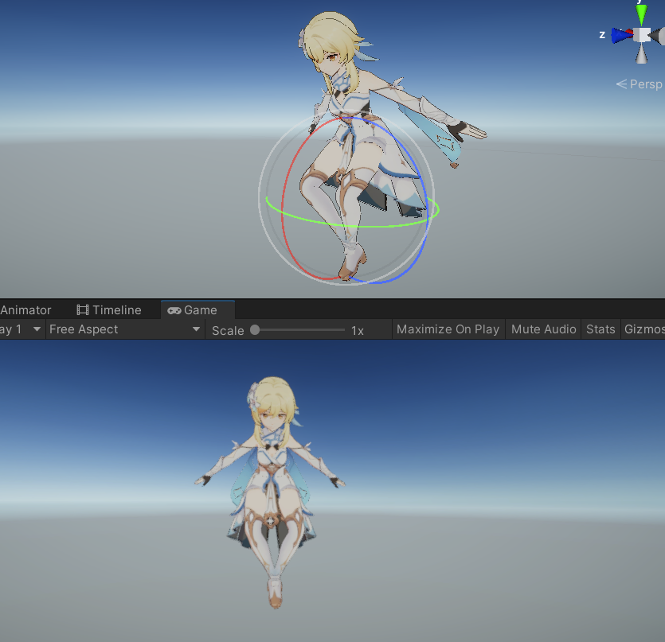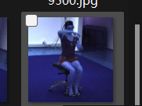

也有坐下的动作

以上的是动了这几个关节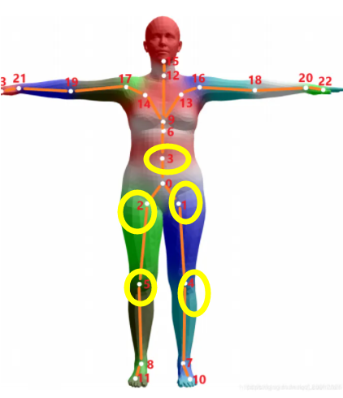

根结点的动会一直进行很怪的旋转，我就暂时没动，但动腿的这四个骨头跟原视频比较匹配


gif目前是0.1f播放每100帧的那个动作


##### 驱动手

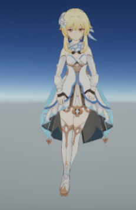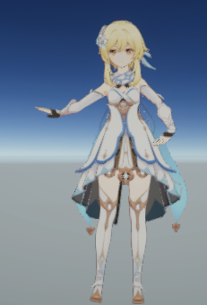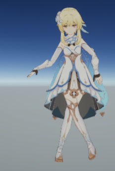


#### 还存在的问题

与原视频的一些帧还是不能完全匹配,特别是手的部分，有可能是模型本身的问题，更可能是我数据加强的时候并不是贴近正确的角度。


#### 代码

```C#
using System;
using System.Collections;
using System.Collections.Generic;
using UnityEngine;
using System.IO;
using Unity.Mathematics;

[System.Serializable]
class mFrame
{
    public int frame_id;
    public float[] pose;
    public float[] betas;
}
[System.Serializable]
class Data
{
    public mFrame[] mframe;
}


public class SmplTestBone : MonoBehaviour
{
    public GameObject SmplModel;//引用模型？不知道类型是什么
    public GameObject guanjie;
    //public Animator animator;
    public int flagIndex = 0;
    int frameid = 0;
    
    public float rotatey;
    //骨骼关节名称
    private string rightArmBoneName = "Right arm";
    // Start is called before the first frame update
    Data m_PersonData;
    public GameObject[] bodyPart;
    public Quaternion[] bodyPartTrans = new Quaternion[10];
    void Start()
    {
        string str=ReadData();
        //Debug.Log("smpl"+str);
        
        string jsonData = ReadData();
        //Data m_PersonData = JsonUtility.FromJson<Data>("{\"mframe\":" + jsonData + "}");
        m_PersonData = JsonUtility.FromJson<Data>(jsonData);
           //
        // foreach (mFrame item in m_PersonData.mframe)
        // {
        //     //Debug.Log("frame_id"+item.frame_id);
        //     // Debug.Log("pose0"+item.pose[0]);
        // }

        // Debug.Log("frameSize"+m_PersonData.mframe.Length);
        // Debug.Log("poseSize"+m_PersonData.mframe[0].pose.Length);
        // Debug.Log("betasSize"+m_PersonData.mframe[0].betas.Length);
        keepOriginBodyTrans();
    }

    // Update is called once per frame
    void Update()
    {
        // float rightArmRotation = 120; //SmplModel.getJointRotation(rightArmBoneName).y;从json获得
        // //将旋转角度转换为动画控制器所需要的角度
        // float animationAngle = Mathf.Lerp(-30f, 30f, (rightArmRotation + 180f) / 360f);
        //
        // guanjie.transform.localEulerAngles = new Vector3(0,0,rotatey);
        
        //将动画控制器中的参数设置为计算出的角度
        //animator.SetFloat("RightArmRotation",animationAngle);
        ChangeBody();
    }

    void keepOriginBodyTrans()
    {
        for (int i = 0; i < bodyPart.Length; i++)
        {
            bodyPartTrans[i] = bodyPart[i].transform.rotation;
        }
    }
    void ChangeBody()
    {
        if (Input.GetKeyDown("f")) 
        {
            StartCoroutine(ChangeBodyI());
            //bodyPart[0].transform.Rotate(new Vector3(90f,0f,0f),Space.World);
            
        }
        if (Input.GetKeyDown("p"))
        {
            mFrame item = m_PersonData.mframe[frameid];
            int temp = frameid + 1;
            Debug.Log(temp+"!!!!@@@");
            
            //腿部分
            changePartFunc(1,item,2);
            changePartFunc(4,item,4);
            
            changePartFunc(2,item,3);
            changePartFunc(5,item,5);
            
            //上半身
            changePartFunc(3,item,1);//spine

            if (flagIndex == 1)
            {
                //changePartFunc(6,item,14);
                changePartFunc(9,item,15);
                changePartFunc(13,item,12);
                changePartFunc(14,item,13);
            }
            
            //手
            changePartFunc(16,item,6);
            changePartFunc(18,item,7);
            changePartFunc(20,item,8);
             
            changePartFunc(17,item,9);
            changePartFunc(19,item,10);
            changePartFunc(21,item,11);

            frameid++;
            //StartCoroutine(ChangeBodyI());
            //bodyPart[2].transform.Rotate(new Vector3(-30f,0f,0f));
            //bodyPart[2].transform.Rotate(new Vector3(0,1f,0));
        }

        if (Input.GetKeyDown("b")) 
        {
            //StartCoroutine(ChangeBodyI());
            
            //bodyPart[4].transform.localRotation = Quaternion.Euler(90, 0, 0);
            bodyPart[4].transform.Rotate(new Vector3(90f,0f,0f));
        }

    }

    IEnumerator ChangeBodyI()
    {
        foreach (mFrame item in m_PersonData.mframe)
        {
             //changePartFunc(0,item,0);
             
             changePartFunc(1,item,2);
             changePartFunc(4,item,4);
            
             changePartFunc(2,item,3);
             changePartFunc(5,item,5);
            
             changePartFunc(3,item,1);
             
             changePartFunc(16,item,6);
             changePartFunc(18,item,7);
             changePartFunc(20,item,8);
             
             changePartFunc(17,item,9);
             changePartFunc(19,item,10);
             changePartFunc(21,item,11);

             yield return new WaitForSeconds(.1f);
        }
    }

    void changePartFunc(int startIndex,mFrame item,int listIndex)
    {
        float A = item.pose[startIndex * 3], B = item.pose[startIndex * 3 + 1];
         float body0RotationX = item.pose[startIndex*3]/Mathf.PI *180f; 
         float body0RotationY = item.pose[startIndex*3+1]/Mathf.PI *180f; 
         float body0RotationZ = item.pose[startIndex*3+2]/Mathf.PI *180f;

         if (flagIndex == 0)
         {
             if (startIndex == 1 || startIndex == 2) body0RotationX = 180 + body0RotationX;
             //left arm
             if (listIndex == 6)
             {
                 body0RotationY = 90 + body0RotationY;
                 body0RotationX = -body0RotationX;
             }
             //LEFT ELBOW
             if (listIndex == 7)
             {
                 body0RotationZ = body0RotationZ*1.3f;
                 //body0RotationZ =  body0RotationZ;
                 body0RotationX = -body0RotationX;
             }
             //RIGHT arm
             if (listIndex == 9)
             {
                 body0RotationY = -90 + body0RotationY;
                 body0RotationX = -body0RotationX;
             }
             //RIGHT ELBOW
             if (listIndex == 10)
             {
                 body0RotationZ =  body0RotationZ*1.3f;
                 //body0RotationZ = -75 + body0RotationZ;
                 body0RotationX = -body0RotationX;
             }
         
             if (startIndex == 13)
             {
                 body0RotationX = -108f + body0RotationX+20f;
                 body0RotationY = 77f+body0RotationY+45f;
             }
             if (startIndex == 14)
             {
                 body0RotationX = -108f + body0RotationX+20f;
                 body0RotationY = -77f+body0RotationY-45f;
             }
         }
         else
         {
             
             if (startIndex == 1 || startIndex == 2) body0RotationX = 180 + body0RotationX;
             //left arm
             if (listIndex == 6)
             {
                 body0RotationY = 90 + body0RotationY;
                 body0RotationX = -body0RotationX;
             }
             //LEFT ELBOW
             if (listIndex == 7)
             {
                 body0RotationZ = body0RotationZ*2f;
                 //body0RotationZ =  body0RotationZ;
                 body0RotationX = -body0RotationX;
             }
             //RIGHT arm
             if (listIndex == 9)
             {
                 body0RotationY = -90 + body0RotationY;
                 body0RotationX = -body0RotationX;
             }
             //RIGHT ELBOW
             if (listIndex == 10)
             {
                 body0RotationZ =  body0RotationZ*2f;
                 //body0RotationZ = -75 + body0RotationZ;
                 body0RotationX = -body0RotationX;
             }
         
             if (startIndex == 13)
             {
                 body0RotationX = -90 + body0RotationX;
                 body0RotationY = 90f+body0RotationY;
             }
             if (startIndex == 14)
             {
                 body0RotationX = -90f+ body0RotationX;
                 body0RotationY = -90f+body0RotationY;
             }
         }
        //Debug.Log("x y z  "+bodyPart[0].transform.rotation);
        // float body0RotationX = -90f; 
        // float body0RotationY = 90f; 
        // float body0RotationZ = 0f;
        
        //将旋转角度转换为动画控制器所需要的角度
        //float animationAngle = Mathf.Lerp(-30f, 30f, (body0Rotation + 180f) / 360f);
        //bodyPart[listIndex].transform.position = bodyPartTrans[listIndex].transform.position;
        
        //**
        //bodyPart[listIndex].transform.rotation = bodyPartTrans[listIndex];
        
        //Debug.Log("bodyPartTrans[listIndex].transform.position"+bodyPartTrans[0]);
        //Debug.Log("bodyPart[listIndex].transform.position"+bodyPart[0].transform.rotation);

        //bodyPart[listIndex].transform.localEulerAngles += new Vector3(body0RotationX,body0RotationZ,body0RotationY);
        //bodyPart[listIndex].transform.Rotate(new Vector3(body0RotationX,body0RotationY,body0RotationZ),Space.Self);
        
        //bodyPart[listIndex].transform.Rotate(body0RotationX,body0RotationY,body0RotationZ,Space.Self);//**

        bodyPart[listIndex].transform.localRotation = Quaternion.Euler(body0RotationX,body0RotationY,body0RotationZ);
        
        // bodyPart[listIndex].transform.Rotate(new Vector3(body0RotationX,0f,0f));
        // bodyPart[listIndex].transform.Rotate(new Vector3(0f,body0RotationY,0f));
        // bodyPart[listIndex].transform.Rotate(new Vector3(0f,0f,body0RotationZ));
    }
    //读取文件 https://blog.51cto.com/itMonon/3396794
    public string ReadData()
    {
        //string类型的数据常量
        string readData;
        //获取到路径
        string fileUrl = Application.streamingAssetsPath + "\\smpl3.json";
        //读取文件
        using (StreamReader sr =File.OpenText(fileUrl))
        {
            //数据保存
            readData = sr.ReadToEnd();
            sr.Close();
        }
        //返回数据
        return readData;
    }
}
```


