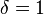
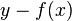
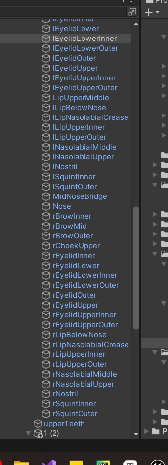

## 毕设 捏人 bs+动作

公式解决了

论文图片刚看到第三章


### chatgpt

这个网页里面的网站介绍了目前很多的chatgpt镜像网站

https://github.com/LiLittleCat/awesome-free-chatgpt

gpt3.5

[【博弈Ai】ChatGPT非官方国产镜像(GPT-3.5-Turbo)|注册|登录|账户 (bo-e.com)](https://ai.bo-e.com/)  这个好像寄了

https://bettergpt.chat/ 寄了?（API:https://free.churchless.tech/v1/chat/completions）

https://www.aitianhu.com/#/chat/1002


我是用的翻墙的  不过我刚才测了这几个不用翻墙也行hh你可以试试 不过他们有可能过几天就被查杀了 到时只要去https://github.com/LiLittleCat/awesome-free-chatgpt这个网站上找别的可以用的就行了~~

刚才测的这几个不用翻墙能用的：

https://mirrorchat.extkj.cn/

https://chat.6.bnu120.space/

他可能会呼吁你捐款什么的  都不用管也不用捐hhh


Beat

### UNITY当前SCENE

**0209**  表情  现在是驱动 如果是测试4 alliee-1.53

其他测试

1


**0414**

驱动加体型 裙子有点穿模


**0423**

驱动+体型（bs）+

（改了牙齿）

（改了near视角 后面可以改回来）


**0415**

（0415有 体型+人脸，但是衣服比较宽看不太出来，不过衣服和前面是统一的？衣服是贴身那个）

0415 体型+人脸 （以及表情的骨骼） 人暂时不动

根据不同panle打开bs/骨骼

**0417** 表情bs  场景中很多个人  有的是有综合的表情，有的是有单个表情


**0518** 骨骼

还可以写的  衣服的适配


**0520** 骨骼表情


**YT0613bone** 更新UI后的骨骼

**YTestScene0613faceBS** 更新UI后的bs


**0701** 更新UI后的语音驱动+BS（其实还有手势）


**YTest0705Body**文件夹中有三个是body的

body驱动+bs  动作

//

以下两个复制并更改UI后可以是body的软著

**YT0613bone** 更新UI后的骨骼

**YTestScene0613faceBS** 更新UI后的bs


然后再把换装的搞出来


动画系统

那是手势？吗

更改场景  **0701** 更新UI后的语音驱动+BS（其实还有手势）


YTestSceneLook0215、YTestSceneLook0209可以换装


### 1.捏脸系统

#### a、表情

daz位置


恶心：


以下这个没作用


微笑


和上面一样的：


根据其他的可以还原出这个表情


#### （1）基于bs


所谓的捏脸系统，就是可以通过UI对导入的人物的BS进行调整，同时要在执行动画的时候保留人物脸部的BS参数（**这点倒是不需要太过在意，因为骨骼动画并不会改变脸型的相关BS值**）。因此大概的思路就是通过slider来控制BS的值（注意，Unity的BS范围是0-100），并通过代码逻辑来控制。这里可以写一个简易的脚本如下：

```c++
using System.Collections;
using System.Collections.Generic;
using UnityEngine;
using UnityEngine.UI;

public class yFaceBSTest : MonoBehaviour
{
    public Slider[] bsSliders; //绑定Canvas下面的控制BS的Slider
    public GameObject digitalHumanShape;  //绑定导入角色的Shape结点，因为这个结点下有BS可以控制
    SkinnedMeshRenderer skinnedMeshRenderer;
    void Awake()
    {
        skinnedMeshRenderer = digitalHumanShape.gameObject.GetComponent<SkinnedMeshRenderer>();
    }
    // Start is called before the first frame update
    void Start()
    {
        for (int i = 0; i < bsSliders.Length; i++)
        {
            int index = i; //需要声明一个新的变量=i,否则可能会有调用顺序问题,这里不表
            bsSliders[index].value = 0.5f;
            bsSliders[index].onValueChanged.AddListener(delegate { OnBSSliderValueChanged(index); } );
        }
    }

    private void OnBSSliderValueChanged(int index)
    {
        //-100->100
        //0->1
        //回调函数:根据Slider控制的值调整BS的大小
        skinnedMeshRenderer.SetBlendShapeWeight(index, bsSliders[index].value *200f-100f); //因为Unity里BS的范围是0-100
    }
    // Update is called once per frame
    void Update()
    {
        
    }
}

```


Unity里BS的范围是-100->100
slider 0-1

新建结点并绑定对应的脚本，并为其赋值如下:


此时就可以通过Slider来调整人物脸上的BS，在后面的AI模块驱动中也有调试BS相关的功能，到时也会进行总结。


捏脸系统不仅可以适用于用户自定义，我们也利用这个系统去进行AI的语音驱动模块，实现了输入语音，输出对应嘴型。


smpl 也可以实现捏人+动作


还有捏身体


捏脸 还需要是如果闭眼，眉毛要一起闭


##### bs

[Blendshape学习笔记 (mianzi-lizi.com)](https://www.mianzi-lizi.com/post/blendshape学习笔记)


#### （2）基于骨骼驱动

1. 骨骼变换（Bone Transformation）：每个骨骼都可以通过矩阵变换（如旋转、平移、缩放）来控制模型的姿态。骨骼变换可以使用以下公式表示： $$[ T_{\text{total}} = T_{\text{translate}} \times T_{\text{rotate}} \times T_{\text{scale}} ] $$其中，$$( T_{\text{translate}} ) $$是平移矩阵，$$( T_{\text{rotate}} ) 是旋转矩阵，( T_{\text{scale}} )$$ 是缩放矩阵，$$( T_{\text{total}} ) $$是骨骼的总变换矩阵。


思路：动态获取所有hip下的骨骼

将其名字放进栏中，每个栏是一个带名字的按钮，然后按了之后后边的

可以去调整

UI上有9个滚动条？去调整 或者先实现3个吧  先来Scale 


### 2.动画系统

#### （1）骨骼系统

DAZ的骨骼系统和传统的软件和引擎中的骨骼系统有所不同，因此并不能让DAZ的骨骼无缝衔接Unity的骨骼系统。

DAZ的骨骼和Unity的骨骼系统分别如下：


可以看到，DAZ的骨骼结构比Unity的骨骼结构要复杂很多，在骨骼重定向的时候会出现一定问题，这个问题具体地我们会在[存在的问题和接下来可以提升的点](#（5）可以提升的点和接下来的问题)当中进行介绍，并给出可行的解决方案（具体的方案暂时还没有落实）。

正因为DAZ和Unity二者的骨骼系统之间的差异，因此对于动画系统来说有两种可行的解决方案：

- （1）全部使用DAZ的动画，此时动画资产和角色模型资产的Rig全部设置为Generic，并且动画和人物的骨骼需要保持一致。（从DAZ直接导出的动画是符合这一要求的）；
- （2）使用其他常见动画素材库中的骨骼动画资源（如上文提到的Mixamo），此时Mixamo下载的动画资产和DAZ导入的人物和动画资产全部都要适配于Unity的骨骼系统（也就是把Rig调整为Humanoid），也就是需要进行重定向的操作。

**在接下来的篇幅中，我们会对两种方式进行逐一说明，但在此之前需要对动画资产进行预处理，同时设定对应的状态机。**


#### （2）动画预处理&状态机说明

##### （a）修改序列帧动画

在导入动画的章节中我们提到了一种可能的问题，即DAZ的动画在第一帧人物会变为T字型，此时动画就会有一个突变效果，十分影响观感。同时，有些动画资产会出现穿模的问题，**此时都可以通过对动画资产进行精修的方式来适当地解决该问题**，具体介绍如下：

首先，通过Ctrl+D快捷键将动画资产中的序列帧动画复制出来，并双击打开：


比如说如果原来的动画第一帧会让角色出现T字型，则可以把动画序列帧的第一帧删掉，就可以让动画恢复正常了。

**关于关键帧的位置和数值修改，更好的方式是在Blender或Maya当中进行，但基本原理是一样的（这里只是方便起见在Unity里面进行微调）**。


##### （b）修改Rig

在前文有提及过：

- 如果要全部使用DAZ的系统，则Rig需要修改为Generic，并采用状态机来更改动画；
- 如果要用Unity的骨骼系统并重定向，则Rig需要修改为Humanoid，最好也用状态机来实现修改动画。

下面我们以Humanoid类型为例，来说明Rig的修改是如何进行的：（Generic情况下不需要重定向骨骼，比较简单，就不整理了）

（i）首先，修改人物，动画等资产的Rig为Humanoid：


此时正常来说是不会报错的，如果报错的话可能原因有骨骼命名重复，根节点不符合规范等原因。


（ii）点击Configure，就可以对角色的骨骼进行重定向了：


如上图，需要把DAZ人物（图是原神迪卢克的图，但是原理是一样的）的骨骼重定向到Unity的骨骼，也就是箭头指向的右侧区域。一般来说这一个步骤是可以自动匹配的，但是有的时候需要进行手动调整（比如说Unity默认绑定的骨骼不正确的情况）。同时，动画资产和Mixamo上下载的动画资产也都需要重定向到Unity的Humanoid标准骨骼上。此时不难想到，**由于重定向的存在，人物和动画都适配了同一套骨骼**，因此骨骼动画也是可以正常完成的。


##### （c）状态机说明

这一部分如果对Unity引擎比较熟悉的话不需要过多介绍了，大概就是通过Unity自带的状态机来转换动画（**其实也可以用比较复杂一些的有限状态机来做，但这里不过多展开**）。状态机和代码如下：


```c#
using System.Collections;
using System.Collections.Generic;
using UnityEngine;

public class changeAnim : MonoBehaviour
{
    private Animator player;
    private void Start()
    {
        player = gameObject.GetComponent<Animator>();
    }
    void OnGUI()
    {
        if (GUI.Button(new Rect(1500, 100, 100, 30), "Apos"))
        {
            ChangeAnim(2);
        }

        if (GUI.Button(new Rect(1500, 140, 100, 30), "defaultIdle"))
        {
            ChangeAnim(0);
        }
    }
    void ChangeAnim(int num)  //核心是这个，非常常规
    {
        player.SetInteger("animNum", num);
    }
}


```


#### （3）DAZ动画适配（推荐）

**这里比较推荐这种DAZ动画直接使用的方法，原因在（5）部分会进行详细描述**。直接把DAZ的动画资产的Rig修改为Generic，然后Ctrl+D复制出来并在状态机中赋值即可，**该状态机可以复用给任何满足DAZ Genesis 8骨骼结构的数字人。**

**可能存在的问题**

- 面部表情出现错乱，比如眼球不动或者是位置不对，解决方案有：
  - 删除序列帧动画中不相关的骨骼（不推荐，容易出问题）；
  - 在DAZ动画导出的时候记得勾选“Transfer Face Bones“；


#### （4）Mixamo动画适配

将角色和所有的动画资产的Rig全部更换为Humanoid之后，同样绑定在状态机上即可（**原理在[修改Rig](#（b）修改Rig)的部分已经说过了**）。


#### （5）存在的问题和接下来可以提升的点

**关于DAZ和Unity的骨骼究竟哪里不适配**

> 如果我们仔细观察重定向之后的结果（如下图），就会发现如果重定向造成的问题：
>
> 
>
> 可以看到，DAZ的骨骼的四肢（上图是腿，胳膊也是一样）都比Unity自带的骨骼要多上一节，这个通过②和③所框起来的区域也可以很好地看出来。**因此在重定向的时候，无论怎么重定向都会有一根骨骼没有用上**。这样的话自然适配于Unity的骨骼系统的动画应用在DAZ的骨骼上就会显得很奇怪。**应当可行的解决方案有如下几种：**
>
> - （1）直接使用DAZ系统自己的动画资产（**目前是这么做的，效果还不错**）
>   - 优点：难度较低，同时动画的适配性也不错；
>   - 缺点：比较依赖于DAZ的动画资产，如果要自己做动画的话也基本离不开DAZ这个软件；
> - （2）重新为角色制作一套更合适的骨骼，并且适配于Unity的骨骼系统：
>   - 优点：一劳永逸，并且并不依赖DAZ,因为支持Unity标准Avatar格式的动画资产相对会更多一些；
>   - 缺点：**重新制作骨骼需要技术栈的学习，有一定学习和制作成本**；
> - （3）直接凹某个动画资产的关键帧数值。这种方法基本上只能饮鸩止渴，因此并不推荐。


记录现能用的动画：

采用daz系统：

idle


Apos？


dance


状态机


使用角色


要写一下bs的原理 以及 你动作的原理 lbs


Linear Blending Skinning (LBS) 指的是通过操纵骨骼来使得 mesh 发生形变，LBS 定义骨骼点（joint）和 mesh 的 vertices 之间的关系是线性关系，一个 vertice 的位置会受到其他 joint 共同的加权影响，具体操作是会先计算 joint 的位置，然后根据 joint 的位置，求其他 vertices 的位置，所以可以通过操纵骨骼来改变整个 mesh。


人体bs


变形有两种方式

一种是bs

一种是动骨骼

人脸的大都采用bs

身体部位既可以是bs，也可以是骨骼。


若想获取所有并放到屏幕上


### + 语音驱动口型

我们是先提取音频特征，然后通过网络估的bs系数，有一个仓库可以看看，他这个是用的FLAME人脸模型，我们换成了daz那个，这个仓库输出的是所有的顶点位置，就是他用tensorflow1.0写的代码

https://github.com/TimoBolkart/voca

对应的音频、视频结果和bs系数，txt文件每行是一帧的38个bs系数，npy文件用numpy读出来应该是数组，最后我这边给的结果应该也是数组


介绍

https://www.jiqizhixin.com/articles/2019-06-18-11

VOCA（Voice Operated Character Animation），这是一种简单且通用的语音驱动面部动画框架，可适用于不同个体。VOCA 可以将任何语音信号和静态三维头部网格作为输入，并输出逼真的面部动画


### 3. 语音驱动动作

论文《BEAT: A Large-Scale Semantic and Emotional Multi-Modal Dataset for Conversational Gestures Synthesis》、


尝试解决：


没权限


介绍文章：

https://mp.weixin.qq.com/s?__biz=MzA3MzI4MjgzMw==&mid=2650863535&idx=5&sn=b2f760af137dc922a7669d4a1598686f&chksm=84e533d1b392bac72c93605b1577401b5a4a4e9b690351a5b10800dc75a9137088c3de97e168


BEAT 采用了 ViCon，16 个摄像头的动作捕捉系统来记录演讲和对话数据，最终所有数据以 120FPS**, 记载关节点旋转角的表示形式的 bvh 文件发布**。对于面部数据，BEAT 采用 Iphone12Pro 录制谈话人的 52 维面部 blendsshape 权重，并不包括每个人的头部模型，推荐使用 Iphone 的中性脸做可视化。BEAT 采用 16KHZ 音频数据，并通过语音识别算法生成文本伪标签，并依此生成具有时间标注的 TextGrid 数据。

GITHUB:https://pantomatrix.github.io/BEAT/

Paper (ECCV 2022): [https://www.ecva.net/papers/eccv_2022...](https://www.youtube.com/redirect?event=video_description&redir_token=QUFFLUhqbHRMNXo3SHB5X3ptRE10cEpFZWRZYmVjSjBFd3xBQ3Jtc0trNzBUMVh5bFppM0c5X0M3Q1VhUnc1dnE4bElFazhCTi1QRFlhQnNtUHUtczFPaTZKUFlpeGtrbXlsQmhxS1BENF9VVk1lbFpLbUVXTWdsdFdpNEdXclo4OFZ5WUV0LTBORVJhcjFRa091bTlOdEVOcw&q=https%3A%2F%2Fwww.ecva.net%2Fpapers%2Feccv_2022%2Fpapers_ECCV%2Fpapers%2F136670605.pdf&v=F6nXVTUY0KQ) Project Page: [https://pantomatrix.github.io/BEAT/](https://www.youtube.com/redirect?event=video_description&redir_token=QUFFLUhqbnZ4cm4yTGppZUZEWGVWNHB3RFdLaGNJVzZXd3xBQ3Jtc0tuR1N5SFI5TEpkT2VWQ011TGc0elRoSUlTbDVpbkdSR1FnTHhUQnZDZ2h4UVotWl9kWXR1RDQzQnp6WjZKZXIzYzNNdEhmSERPMEZGUmh0a0RQWTFRVVYxVjVERVl3VkxLbzFfZ0tJb3VhZi1fbmJnZw&q=https%3A%2F%2Fpantomatrix.github.io%2FBEAT%2F&v=F6nXVTUY0KQ)


http://lo-th.github.io/olympe/BVH_player.html


##### 连接实验室电脑

软件：xftp xshell

创建环境BEAT


github：

https://github.com/PantoMatrix/BEAT

根据说明建立文件夹


##### 具体步骤

参考步骤：

1. colab的 https://colab.research.google.com/drive/1bB3LqAzceNTW2urXeMpOTPoJYTRoKlzB?usp=sharing#scrollTo=hReOJTyJy2sb
2. 官方github的


----


1. download the scripts to `codes/audio2pose/`

2. run `pip install -r requirements.txt` in the path `./codes/audio2pose/`

   https://colab.research.google.com/drive/1bB3LqAzceNTW2urXeMpOTPoJYTRoKlzB?usp=sharing#scrollTo=ONixJiMgwyTH

3. 

改为清华镜像


pip config set global.index-url https://pypi.tuna.tsinghua.edu.cn/simple

再下依赖包

pip install -r requirements.txt

pip install configargparse

4. 接下来下载dataset（我们这里是参考colab代码只下了部分 下载完之后拖进服务器文件中，解压：
    cd datasets/beat_cache/ && unzip beat_4english_15_141.zip

5. 执行test.py

   此处我们遇到了问题，

   1）pip install protobuf==3.20.*

   pip install IPython

   2）文件没找到 

   所以我们把datasets放在了别的他应该在的地方

   再次执行

   

   python test.py -c ./configs/camn_beat_4english_15_141.yaml --new_cache False

6. 结果：成功跑出代码结果

   


。。。。。。。


##### 效果

代码：跑成功


结果：


###### windows 上跑

https://blog.csdn.net/weixin_42770591/article/details/97247225


把所有的cuda 改为cpu

https://www.cnblogs.com/hyh123/p/16296161.html


------


下面的是错误的 改回来了

根据他的报错加了一个文件


这样绝对不行，数组会多一个，所以我们把它原来对应的这个名改了试试:


----------------

真正需要改的：

###### windows跑的结果

ok的：


存在论文图片那里了 有各个网络架构可以研究


结果：这个文件会从没有到有


txt里会有log也就是结果输出信息


以下这些就是生成了的


###### 调试

[pycharm在需要输入命令行参数时如何调试 | Juntao Tan的个人博客 (tanjuntao.github.io)](https://tanjuntao.github.io/2019/04/30/pycharm在需要输入命令行参数时如何调试/)

如果有输入参数请加上以下步骤：


然后直接点即可


###### 得到结果后的操作

linux跑完后

然后我们放进一些在线bvh解释器中

http://lo-th.github.io/olympe/BVH_player.html


左边用windows跑的

每次生成的动作不同


bvh效果很不错


使用在线的bvh转maya


但是解析的不是很好，会颤抖，但是大致动作都是有的

unity要求角色都有跟骨骼hip，所以导入unity前 需要将maya中预处理

因此需要在maya中去做  我是将左右腿放到spine中，这样不太好其实，最好加一个hip骨骼

（ctrl+ctrl+p）变为父子关系


unity中也是 有点点问题


E:\本科\vcg实验室\毕设相关\bvh\9999

E:\本科\vcg实验室\毕设相关\bvh\9999\res_2_scott_0_1_1.bvh


E:\本科\vcg实验室\毕设相关\bvh\res_2_scott_0_1_1.bvh


Assets\BVHParser\Resources\Bonemaps2.txt

Assets\BVHParser\Resources\bvh\res_2_scott_0_1_1.bvh


转换器

手可能会颤抖


https://miconv.com/convert-bvh-to-fbx/

也会颤抖 感觉跟上面是一个算法


问题1:

自动张嘴


是因为lowerjaw张开了


问题2：手指有问题

对从BEAT转译的骨骼动画，进行重定向


可以看到这里的很多地方一看就是有问题的


问题3：会颤抖


参考：

https://blog.csdn.net/zb1165048017/article/details/112394097


bvh左边


使用blender3.3.1  导入bvh

然后导出fbx

导入unity即可

！！！！！震惊了


https://zh.wikipedia.org/wiki/%E6%97%8B%E8%BD%AC%E7%9F%A9%E9%98%B5


暂时

下巴会一直开着

原因是下巴的骨骼绑错了

正确的是belowjaw，而不是lowerjaw


BEAT官方数据集

https://drive.google.com/drive/folders/1CVyJOp3G_A9l1N_CsKdHgXQfB4pXhG8c

bvh时间：两者相乘


然后我们放进一些在线bvh解释器中

http://lo-th.github.io/olympe/BVH_player.html


记录一下原本的对应


那个语音的 不能太长 不然无法解析

https://vocalremover.org/zh/cutter

可以用上面这个剪辑


#### 一些操作

###### 尝试linux下载这个包

wget --load-cookies /tmp/cookies.txt "https://docs.google.com/uc?export=download&confirm=$(wget --quiet --save-cookies /tmp/cookies.txt --keep-session-cookies --no-check-certificate 'https://docs.google.com/uc?export=download&id=FILEID' -O- | sed -rn 's/.*confirm=([0-9A-Za-z_]+).*/\1\n/p')&id=FILEID" -O FILENAME && rm -rf /tmp/cookies.txt


```
wget --load-cookies /tmp/cookies.txt "https://docs.google.com/uc?export=download&confirm=$(wget --quiet --save-cookies /tmp/cookies.txt --keep-session-cookies --no-check-certificate 'https://docs.google.com/uc?export=download&id=1Akf0WgAwuH2fvlWbvNpif4XRqXlpznh9' -O- | sed -rn 's/.*confirm=([0-9A-Za-z_]+).*/\1\n/p')&id=1Akf0WgAwuH2fvlWbvNpif4XRqXlpznh9" -O BEAT_FILENAME && rm -rf /tmp/cookies.txt

```

https://drive.google.com/file/d/1Akf0WgAwuH2fvlWbvNpif4XRqXlpznh9/view?usp=share_link


1Akf0WgAwuH2fvlWbvNpif4XRqXlpznh9


wget --load-cookies /tmp/cookies.txt "https://docs.google.com/uc?export=download&confirm=$(wget --quiet --save-cookies /tmp/cookies.txt --keep-session-cookies --no-check-certificate 'https://docs.google.com/uc?export=download&id=1EKuWH8q178QOtFUYaNohdkZbBHQYAmhL' -O- | sed -rn 's/.*confirm=([0-9A-Za-z_]+).*/\1\n/p')&id=1EKuWH8q178QOtFUYaNohdkZbBHQYAmhL" -O FILENAME1 && rm -rf /tmp/cookies.txt

1EKuWH8q178QOtFUYaNohdkZbBHQYAmhL


https://drive.google.com/drive/folders/1EKuWH8q178QOtFUYaNohdkZbBHQYAmhL


###### 语音


  Xiamen University (XMU),located in the southeastern of Fujiang province,was officially founded in 1921 with the only economic support from Mr.Tan Kah Kee.Andit's the first university set up by overseas Chinese in the history of Chineseeducation.During Mr.Wenqing Lin ( the first head master of XMU)’ s leading, XMU setup 5 institutes and 21 departments. With holding the school motto "Pursue Excellence,Strive for Perfection ,many excellent professors and teachers were attracted to the XMU,including Lu xun.Nowadays XMU, which is in the list of “211 Project”&" 985 Project”,is thought to be one of the most influential universities in Chinese educationsystem.And XMU has been the cradle for many famous people such as YuGuangzhong,Lu Jiaxi,ChenJingrun,Lin Feng,Yi Zhongtian, etc.They make great differencefor the society in many aspects.

chatgpt改一些语法：

Xiamen University (XMU), located in the southeast of Fujian province, was officially founded in 1921 with the sole financial support of Mr. Tan Kah Kee. It is the first university set up by overseas Chinese in the history of Chinese education. Under the leadership of Mr. Wenqing Lin (the first headmaster of XMU), the university set up 5 institutes and 21 departments. By upholding the school motto "Pursue Excellence, Strive for Perfection," many excellent professors and teachers were attracted to XMU, including Lu Xun. Nowadays, XMU is considered to be one of the most influential universities in the Chinese education system and is listed under the "211 Project" and "985 Project." XMU has been the cradle for many famous people, such as Yu Guangzhong, Lu Jiaxi, Chen Jingrun, Lin Feng, and Yi Zhongtian, who have made significant contributions to society in various aspects.


chatgpt写：

Xiamen University (XMU) is a prestigious public research university located in Xiamen, a coastal city in the southeast of China's Fujian province. Founded in 1921 by Mr. Tan Kah Kee, a renowned overseas Chinese philanthropist, XMU is one of the oldest and most respected universities in China.

Over the years, XMU has developed a reputation for excellence in teaching and research, and it is widely regarded as one of China's top universities. The university has a strong emphasis on interdisciplinary research and has established partnerships with many leading universities around the world.

XMU offers a wide range of undergraduate, graduate, and doctoral programs in fields such as economics, management, law, engineering, medicine, and the arts. The university has a diverse student body, with students from all over China and more than 100 countries around the world.

In recent years, XMU has been ranked among the top universities in China and has been recognized as a "Project 211" and "Project 985" university, which are initiatives aimed at promoting the development of China's higher education system.

With its beautiful campus, world-class facilities, and talented faculty and students, Xiamen University is a vibrant and dynamic academic community that is committed to excellence in education and research.

厦门大学是一所位于中国福建省东南沿海城市厦门的著名公立研究型大学。该校成立于1921年，由知名的华侨慈善家陈嘉庚先生创建，是中国历史最悠久、最受尊重的大学之一。

多年来，厦门大学在教学和研究方面赢得了卓越声誉，被广泛认为是中国顶尖的大学之一。该校强调跨学科研究，并与许多世���领先的大学建立了合作关系。

厦门大学提供广泛的本科、研究生和博士课程，涵盖经济学、管理学、法学、工程学、医学和艺术等领域。学生群体多样化，来自全国各地以及100多个国家和地


###### 其他

目前动作系统需要使用generic

通过rig改


语音驱动动作需要使用humannoid

通过rig改

改完要重定向下巴


现在测试用例是245可用


https://mp.weixin.qq.com/s?__biz=MzA3MzI4MjgzMw==&mid=2650863535&idx=5&sn=b2f760af137dc922a7669d4a1598686f&chksm=84e533d1b392bac72c93605b1577401b5a4a4e9b690351a5b10800dc75a9137088c3de97e168

BEAT论文导读


最好要做的：

自己输入语音，输出结果

看完论文

看他的代码

做优化

[什么是多模态机器学习？_单模态和多模态什么意思_计算机视觉life的博客-CSDN博客](https://blog.csdn.net/electech6/article/details/85142769)


#### 问题 和解决

##### 腿会有问题

原先勾上FootIK

勾上FootIK 会并拢一些（但并不是每个都这样）

test5就有点问题


IK 矫正角色动画


改前 穿模

改后 不会穿模

但是可能会导致有时候手会伸太直 有点僵硬


#### 问题：手部动作奇怪

因为我们的数字人的人物骨骼，与他生成的bvh文件骨骼不同

论文生成的


**Details of baseline training**

目前，我们没有根据说话人划分数据集，即一些说话人只存在于验证/测试数据中，因为说话人ID是输入之一。对于每个说话者，我们使用10:1:1的比例进行训练/有效/测试数据分割。对于基线训练，我们根据所有基线模型在训练期间的最低验证FGD分数选择最佳模型。表10列出了最终选择的epoch

```MARKDOWN
Currently, we do not split the dataset based on speaker, i.e., some speakers only exist in the validation/test data, since the speaker ID is one of the inputs. For each speaker, we use the ratio 10:1:1 for the train/valid/test data splits. For baseline training, we select the best model based on the lowest validation FGD score during training for all baseline models. The final selected epoch is listed in Table 10
```


#### beat bvh重定向到fbx

https://github.com/PantoMatrix/BEAT


#### chatgpt

https://github.com/LiLittleCat/awesome-free-chatgpt

gpt3.5

[【博弈Ai】ChatGPT非官方国产镜像(GPT-3.5-Turbo)|注册|登录|账户 (bo-e.com)](https://ai.bo-e.com/)

可以解释一下“the word sets are fine-tuned(有调整的) by customized encoder E(which is a 8-layer temporal convolution network(TCN) with skip connections)”这句话的内在含义吗


一些预处理的结果 语义的：

可能是下面这个


#### 网络图


#### 1、Text Encoder 文本编码器

这段代码实现了一个文本编码器（TextEncoderTCN），其中采用了基于时间卷积网络（Temporal Convolutional Network, TCN）的结构。下面是对这段代码的注释：

- args：参数类，包含了一些模型参数，如隐藏层大小、层数等等。
- n_words：词汇表大小。
- embed_size：词向量维度大小，默认为300。
- pre_trained_embedding：预训练词向量，可以是一个numpy数组或torch张量，大小为(n_words, embed_size)。如果为None，则使用随机初始化的词向量。
- kernel_size：卷积核大小，默认为2。
- dropout：丢弃率，默认为0.3。
- emb_dropout：词向量丢弃率，默认为0.1。

```python
class TemporalConvNet(nn.Module):
    def __init__(self, num_inputs, num_channels, kernel_size=2, dropout=0.2):
        super(TemporalConvNet, self).__init__()
        layers = [] # 用于存储多层的TemporalBlock模块
        num_levels = len(num_channels) # TemporalBlock模块的层数
        for i in range(num_levels):
            dilation_size = 2 ** i # 每层TemporalBlock的扩张率，通过2的幂次方来实现不同尺度的感受野
            in_channels = num_inputs if i == 0 else num_channels[i-1] # 输入通道数
            out_channels = num_channels[i] # 输出通道数
            # 创建TemporalBlock模块并添加到layers列表中
            layers += [TemporalBlock(in_channels, out_channels, kernel_size, stride=1, dilation=dilation_size,
                                     padding=(kernel_size-1) * dilation_size, dropout=dropout)]
        self.network = nn.Sequential(*layers) # 创建网络结构

    def forward(self, x):
        return self.network(x)

```

`TemporalConvNet` 类定义了一个基于时间卷积网络的模块，其中包含了多层的 `TemporalBlock` 模块。每一层的 `TemporalBlock` 模块具有不同的扩张率（dilation rate）来实现不同尺度的感受野，以捕捉文本中的长程依赖关系。

```python
class TextEncoderTCN(nn.Module):
    def __init__(self, args, n_words, embed_size=300, pre_trained_embedding=None,
                 kernel_size=2, dropout=0.3, emb_dropout=0.1):
        super(TextEncoderTCN, self).__init__()

        if pre_trained_embedding is not None:  
            assert pre_trained_embedding.shape[0] == n_words # 检查预训练词向量的大小是否与词汇表大小匹配
            assert pre_trained_embedding.shape[1] == embed_size # 检查预训练词向量的维度是否与指定的词向量维度匹配
            # 创建嵌入层并使用预训练词向量来初始化词向量权重，可以选择是否冻结权重
            self.embedding = nn.Embedding.from_pretrained(torch.FloatTensor(pre_trained_embedding),
                                                          freeze=args.freeze_wordembed)
        else:
            # 创建嵌入层并使用随机初始化的权重
            self.embedding = nn.Embedding(n_words, embed_size)

        num_channels = [args.hidden_size] * args.n_layer # 每层的输出通道数均为隐藏层大小
        # 创建时间卷积网络模块
        self.tcn = TemporalConvNet(embed_size, num_channels, kernel_size, dropout=dropout)

        # 创建线性层，用于将时间卷积网络的输出转换为预测值
        self.decoder = nn.Linear(num_channels[-1], args.word_f)
        self.drop = nn.Dropout(emb_dropout) # 创建丢弃层，用于在训练过程中进行随机丢弃
        self.emb_dropout = emb_dropout # 记录词向量丢弃率
        self.init_weights() # 参数初始化操作

    def init_weights(self):
        self.decoder.bias.data.fill_(

```

`TextEncoderTCN` 类定义了一个基于 TCN 的文本编码器，其中使用了 `TemporalConvNet` 模块作为主要的编码器。它接收一个输入文本序列，并将其嵌入为向量表示。然后通过 TCN 模块进行时间维度的卷积操作，之后再经过线性层进行预测输出。此外，还包含了一些初始化和 dropout 操作。

这段代码还使用了 `args` 参数来配置模型的超参数，例如隐藏层的大小、卷积


**跳过连接**

在这个实现中，没有显式地使用跳过连接（skip connection），但是通过 TemporalBlock 模块的设计，隐式地实现了跳过连接的效果。TemporalBlock 模块包含了两个卷积层和一个门控线性单元（Gated Linear Unit, GLU）模块，（错误 并没有使用GLU）其中 GLU 模块的输入同时也是卷积层的输入，因此可以认为是一种跳过连接的实现方式。这种设计能够在增加模型深度的同时，缓解梯度消失问题，并提高模型的表现。

根据给出的代码，`TemporalBlock` 模块内部并没有显式地定义跳过连接，因此这个代码片段中没有使用跳过连接。不过，`TemporalConvNet` 模块通过堆叠多个 `TemporalBlock` 模块，可以形成深度卷积神经网络，并且不同的 `TemporalBlock` 模块的输入和输出之间具有短路连接（也就是残差连接），因此整个网络结构具有类似于跳过连接的功能。


在 `TemporalConvNet` 的构造函数中，创建了多个 `TemporalBlock` 模块，并将它们堆叠起来，形成了一个深度卷积神经网络。在堆叠过程中，不同的 `TemporalBlock` 模块的输入和输出之间具有短路连接（也就是残差连接）。具体来说，当 `i>0` 时，`in_channels` 的值为上一层 `TemporalBlock` 模块的输出通道数，即 `num_channels[i-1]`，此时会将上一层的输出和当前层的输出相加，实现了短路连接的效果。以下是代码中实现短路连接的部分：

```python
lessCopy codefor i in range(num_levels):
    dilation_size = 2 ** i
    in_channels = num_inputs if i == 0 else num_channels[i-1]
    out_channels = num_channels[i]
    layers += [TemporalBlock(in_channels, out_channels, kernel_size, stride=1, dilation=dilation_size,                             padding=(kernel_size-1) * dilation_size, dropout=dropout)]
```

因此，虽然 `TemporalBlock` 模块内部并没有显式地定义跳过连接，但是 `TemporalConvNet` 模块整体具有短路连接的功能


这段代码中的 `TemporalConvNet` 类在构造函数中创建了多个 `TemporalBlock` 模块，并将它们堆叠起来形成一个深度卷积神经网络。在这个堆叠的过程中，不同的 `TemporalBlock` 模块的输入和输出之间具有短路连接（残差连接），用于将上一层的输出和当前层的输出相加。这种短路连接的作用是将信息从较浅的层直接传递到较深的层，有助于缓解梯度消失的问题，促进梯度在网络中的流动，并有助于提高网络的训练效果和模型的准确性。

名词解释：**感受野**

感受野（receptive field）是指在深度学习中，一个神经元（或卷积核）对应输入的区域大小。在卷积神经网络中，一个神经元对应的感受野大小可以通过其所在的层数和卷积核大小计算得到。对于文本数据，感受野也可以被解释为模型中每个位置对输入文本的不同程度关注或“看到”的范围大小，或者理解为模型学习到的一种特征提取方式。在这个实现中，通过使用不同扩张率的卷积核，TCN模型可以实现不同感受野大小的特征提取，以更好地捕捉文本中的长程依赖关系。


具体来说，在TCN模型中，每一层的卷积核都是固定大小的，但是在进行卷积计算时，通过对卷积核进行不同程度的扩张（也就是设置不同的 dilation rate），可以使得卷积核对应的感受野在时间维度上变得更宽，从而捕捉更长程的依赖关系。这种做法与传统的增加卷积层深度或增加卷积核大小的做法相比，可以通过更少的参数实现更好的效果。另外，由于TCN模型采用了类似于残差网络的结构，可以有效缓解梯度消失问题，使得模型训练更加稳定和高效。


**梯度**

在这个网络和代码中，梯度是指损失函数对网络参数的偏导数，即反向传播算法计算的值。在训练过程中，我们希望通过不断调整网络参数，最小化损失函数，使得网络的输出和真实值之间的误差尽可能小。为了实现这个目标，我们需要计算损失函数对每一个参数的梯度，并根据梯度的大小更新参数，使得损失函数不断减小，直到收敛。因此，在神经网络中，梯度是非常重要的概念，它是训练过程中的关键之一。


##### 文本编码器-TCN

以下是一个简单的 TCN 模型的代码示例，可以帮助初学者了解如何实现一个基���的 TCN 模型：

```python
import torch
import torch.nn as nn

# TemporalBlock表示 TCN 中的一个时间块，用于捕捉输入序列中的局部模式和长期依赖关系；TCN 则是整个网络结构，由多个时间块堆叠而成。
class TemporalBlock(nn.Module):
    def __init__(self, in_channels, out_channels, kernel_size, dilation):
        super(TemporalBlock, self).__init__()
        padding = (kernel_size - 1) * dilation
        self.conv1 = nn.Conv1d(in_channels, out_channels, kernel_size, padding=padding, dilation=dilation)
        self.conv2 = nn.Conv1d(out_channels, out_channels, kernel_size, padding=padding, dilation=dilation)
        self.relu = nn.ReLU()
        self.dropout = nn.Dropout(0.2)

    def forward(self, x):
        y = self.conv1(x)
        y = self.relu(y)
        y = self.dropout(y)
        y = self.conv2(y)
        y = self.relu(y)
        y = self.dropout(y)
        if x.size(-1) != y.size(-1):
            x = x[:, :, -y.size(-1):]
        return self.relu(x + y)

class TCN(nn.Module):
    def __init__(self, input_size, output_size, num_channels, kernel_size, dropout):
        super(TCN, self).__init__()
        layers = []
        in_channels = input_size
        for i, c in enumerate(num_channels):
            dilation = 2 ** i
            out_channels = c
            layers += [TemporalBlock(in_channels, out_channels, kernel_size, dilation)]
            in_channels = out_channels
        self.network = nn.Sequential(*layers)
         # 在最后加上一个全连接层（nn.Linear）输出预测结果。
        self.fc = nn.Linear(out_channels, output_size)
        self.dropout = nn.Dropout(dropout)

    def forward(self, x): 
        x = x.transpose(1, 2) # 对输入数据进行转置
        y = self.network(x) # 通过 `network` 序列化对象对输入进行特征提取
        y = y[:, :, -1]
        y = self.fc(y)
        y = self.dropout(y)
        return y
```

在这个示例中，我们定义了两个类：`TemporalBlock` 和 `TCN`。其中 `TemporalBlock` 表示 TCN 中的一个时间块，用于捕捉输入序列中的局部模式和长期依赖关系；`TCN` 则是整个网络结构，由多个时间块堆叠而成。

在 `TemporalBlock` 类中，我们使用了一维卷积层（`nn.Conv1d`）来进行特征提取，并通过 ReLU 激活函数和 dropout 操作来增强模型的非线性能力和泛化能力。而在 `TCN` 类中，我们按照输入参数 `num_channels` 中指定的通道数和卷积核大小，将多个时间块堆叠在一起，并在最后加上一个全连接层（`nn.Linear`）输出预测结果。

在 `forward` 函数中，我们首先对输入数据进行转置，从而将序列长度的维度放到中间，方便进行卷积操作。然后通过 `network` 序列化对象对输入进行特征提取，最后将输出的最后一帧作为预测结果，再经过全连接层和 dropout 操作得到最终的输出。

使用上述代码实现 TCN 实例化对象并进行训练的步骤如下：

```python
# 定义数据集和参数
input_size = 10
output_size = 2
num_channels = [32, 64, 128]
kernel_size = 3
dropout = 0.2

x = torch.randn(16, 100, input_size)
y = torch.randint(0, output_size, (16,))

# 实例化 TCN 对象并定义优化器和损失函数
model = TCN(input_size, output_size, num_channels, kernel_size, dropout)
optimizer = torch.optim.Adam(model.parameters(), lr=1
```


##### 文本编码器-第二句话

**可以解释一下“the word sets are fine-tuned(有调整的) by customized encoder E(which is a 8-layer temporal convolution network(TCN) with skip connections)”这句话的内在含义吗**

这句话的内在含义是：“单词集被通过自定义编码器E进行微调，该编码器是一个8层的时间卷积网络（TCN），具有跳跃连接(skip connections)。”

简言之，这句话所说的是一种算法或模型，它使用了一个特定的人工神经网络，称为TCN，来对单词集进行处理和分类。通过使用自定义的编码器E并进行微调，可以提高该模型的性能和准确性。跳跃连接指的是网络层之间的非线性连接方式，可以帮助信息更好地传递和处理。


**可以具体解释一下它是怎么实现的吗**

具体来说，这个算法使用了一个8层的TCN网络对单词集进行处理和分类。该TCN网络是由一系列卷积层和跳跃连接(skip connections)组成的，并且可以在多个时间步骤上进行处理。

在对单词集进行处理之前，该模型会先将每个单词表示为一个向量形式。然后，这些向量将输入到TCN网络中，以便进行分类或预测。在此过程中，TCN网络通过卷积操作和跳跃连接来提取特征和学习语言规则。

在这个过程中，编码器E则扮演了一个微调器(Tuner)的角色，它可以帮助调整网络权重和超参数(hyperparameters)，从而优化模型的性能和准确性。这样，经过反复的训练和微调，模型就可以逐渐地提高其对单词集的分类或预测能力。


**你说的这个超参数是什么**

==超参数(hyperparameters)是指模型训练过程中需要手动设置的参数==，它们不是通过模型学习得到的，而是由人为设定。这些超参数可以影响模型的性能和准确性，并且通常需要反复调整和微调才能找到最佳的值。

在这个算法中，可能需要设置的超参数包括：TCN网络层数、每个卷积层的滤波器(filter)数量、卷积核(kernel)大小等。编码器E也可能有其自身的超参数需要设置。这些超参数的选择将直接影响算法的性能和效果，因此需要谨慎地进行调整和优化。


**你之前说的这个TCN网络具体是怎么实现的呢，能否说得很具体很细节**

TCN（Temporal Convolutional Network）是一种基于卷积神经网络（CNN）的模型，主要用于时间序列数据建模和预测。下面是TCN的具体实现细节：

1. 输入数据格式：TCN的输入数据应该是一个形状为(batch_size, sequence_length, input_dim)的3D张量，其中batch_size代表批次大小，sequence_length代表时间序列的长度，input_dim代表每个时间步的特征数。
2. 卷积层：TCN使用一系列的卷积层来处理时间序列数据。每个卷积层包含多个卷积核，每个卷积核的大小相同，但是不同卷积层的卷积核大小可以不同。卷积操作采用有效卷积方式，并使用零填充保持输出维度不变。
3. 残差连接：为了防止梯度消失和过拟合，TCN引入了残差连接。每个卷积层的输出与其输入相加，然后再通过激活函数进行非线性转换。
4. 空洞卷积：在卷积层中，TCN使用了空洞卷积（dilated convolution），这种卷积操作能够扩大感受野，增强网络的特征提取能力。
5. 平均池化层：每个卷积层之后，TCN使用一个平均池化层来减少时间序列的长度，从而降低计算量。
6. 展开操作：在经过多个卷积层和池化层之后，最终输出的形状为(batch_size, output_dim)，其中output_dim代表模型的输出维度。为了连接全局信息，TCN使用了一个展开操作，将所有时间步的输出连接成一个长向量，并通过全连接层进行预测。
7. 损失函数：对于回归问题，TCN通常使用均方误差（MSE）作为损失函数；用于分类问题，TCN可以使用交叉熵损失函数。


**按照你说的这些， 它的实现步骤是什么**

这是TCN的大致实现步骤：

1. 准备输入数据，将时间序列转换为形状为(batch_size, sequence_length, input_dim)的3D张量。
2. 定义TCN模型结构，包括多个卷积层、残差连接、空洞卷积、平均池化层、展开操作和全连接层等组件。
3. 编译模型，指定损失函数、优化器和评价指标等参数。
4. 训练模型，使用训练集进行训练，并在验证集上进行验证。可以使用批量梯度下降（batch gradient descent）或者随机梯度下降（stochastic gradient descent）等训练方法。
5. 对测试集进行预测，计算模型的准确率或均方误差等指标。
6. 保存模型或部署到生产环境中使用。

需要注意的是，具体实现步骤会受到不同框架和库的影响，比如TensorFlow、PyTorch等。同时，在实现过程中要根据具体问题对模型进行调参和优化，以达到更好的性能。


##### 文本编码器-总结和最后

**结合“Words are converted to word embedding set by pre-trained model in FastText[10] to reduce dimensions. Then, the word sets are fine-tuned by customized encoder E_T(which is a 8-layer temporal convolution network(TCN) with skip connections) ”，能说说这里面具体做了什么吗，包括具体步骤和细节**

这段描述中大致包括两个步骤：

第一步是将文本数据中的词转换为词向量，具体实现是使用预训练的FastText模型，将每个单词映射为一个低维度的词向量表示。这一步的目的是减少特征维度，简化模型复杂度，提高训练效率。

第二步是对文本序列进行编码，具体实现是使用一个自定义的编码器E_T，它由一个8层的TCN网络和跳过连接（skip connection）组成。在编码器中，每一层都包含多个卷积核，并使用零填充和空洞卷积来处理时间序列数据，从而提取其特征信息。通过跳过连接，编码器可以更好地保留输入序列的信息，并避免梯度消失的问题。最后，==编码器输出一个编码后的序列表示，即一个低维度的向量，作为模型的输入或者传递给下游任务==。

具体细节包括：

1. 预训练模型的选择：该模型选择的是FastText模型，但并没有说明具体的预训练数据集和参数设置等信息。
2. 词向量的维度：FastText模型会将每个单词映射为一个固定长度的词向量，具体维度大小可能会影响模型的效果。
3. 编码器的结构和参数：该编码器是一个8层的TCN网络，并且包含跳过连接。具体的卷积核大小、激活函数、损失函数和优化器等超参数需要根据具体问题进行调整和优化。
4. 参数的初始化方式：对于神经网络模型，参数的初始化方式很重要，可以对模型的性能产生较大的影响。但该段描述中没有提及参数初始化方式的具体方法。

总之，这段描述中涉及到了词向量、TCN网络和跳过连接等技术，它们在文本序列建模和处理中具有很广泛的应用。


$$z_{i}^{\mathrm{T}}=E_{\mathrm{T}}\left(v_{i-f}^{\mathrm{T}}, \ldots, v_{i+f}^{\mathrm{T}}\right)$$

$$p_{i}^{\mathrm{text}}=E_{\mathrm{text}}\left(e_{i-17}^{\mathrm{text}},e_{i-16}^{\mathrm{text}},e_{i-15}^{\mathrm{text}},e_{i-14}^{\mathrm{text}}, \ldots,e_{i}^{\mathrm{text}},\ldots,e_{i+16}^{\mathrm{text}}, e_{i+17}^{\mathrm{text}}\right)$$


**基于上面的问题，后文海提到了“For each frame i, the TCN fusions the information from 2f = 34 frames to generate final latent feature of text” 结合上文，这句话是什么意思呢**

根据上文，该句话意思是，在每个帧i中，TCN将来自2f = 34个帧的信息融合起来，生成文本的最终潜在特征。

换句话说，TCN使用**前34帧？**的信息来生成当前帧的特征表示。

我认为不一定是前34帧，可能指的是前17帧和后17帧


**为什么2f = 34 frames 意思是前34帧呢（其实可能指的是前17帧和后17帧）**

因为在此上下文中，f代表一个frame（帧），2f表示两个连续的frame。因此，2f = 34 frames 意味着它包括17个连续对的frames，其中最后一个frame是当前帧i，前面的16个连续对的frames加上当前帧i总共有17个frames，而17个frames中的前34个就是前面所有的frames。因此，2f = 34 frames 在这里意味着前34个frames，也就是前面的所有帧。


**基于你回答中的连续对frames，连续对frames有什么意义呢，为什么要两个帧为一对**

在这个语境中，“连续对”是指由两个相邻的帧组成的一对。将两个相邻的帧作为一对来处理是因为它可以捕捉到视频序列中的时间关系和空间相关性，这对于视频数据的建模非常重要。采用连续对的方式，可以将当前帧与其前面和后面的若干帧联系起来，以便更好地理解视频背景和行为。在这个特定的TCN架构中，每一个输入都是从17个连续的帧中提取的，其中16个帧被组合成8个连续对，以便进行信息融合和特征提取。


#### 2、Speaker ID and Emotion encoder


**Speaker ID and Emotion Encoders.** The initial representation of speaker ID and emotion are both one-hot vectors. 

 we use embedding-layer as speaker ID encoder,  As the speaker ID does not change instantly, we only use the current frame speaker ID to calculate its latent features. 

On the other hand, we use a combination of embedding-layer and 4-layer TCN as the emotion encoder, *E*E, to extract the temporal emotion variations.


$$p_{i}^{\mathrm{speakerID}}=E_{\mathrm{speakerID}}\left(e_{i}^{\mathrm{speakerID}}\right)$$


$$p_{i}^{\mathrm{emotion}}=E_{\mathrm{emotion}}\left(e_{i-f}^{\mathrm{emotion}},\ldots,e_{i+f}^{\mathrm{emotion}}\right)$$


**one-hot vectors是什么**

one-hot向量是一种二进制向量，其中只有一个元素为1，其他元素为0。这个被设置为1的元素通常称为“标记”，它用于表示某些分类或词汇表中的单个项或状态。one-hot向量通常用于机器学习和自然语言处理等领域中对数据进行编码和表示。以自然语言处理为例，在文本分类任务中，可以将每个单词表示成一个one-hot向量，其中**只有一个元素为1**，代表该单词在整个词汇表中的位置，这样可以将输入数据转化为神经网络可接受的数字形式。


**解释**“The initial representation of speaker ID and emotion are both one-hot vectors.  we use embedding-layer as speaker ID encoder,  As the speaker ID does not change instantly, we only use the current frame speaker ID to calculate its latent features. 

On the other hand, we use a combination of embedding-layer and 4-layer TCN as the emotion encoder, *E*E, to extract the temporal emotion variations.”

当处理音频数据并提取说话者的身份和情感状态时，使用one-hot向量来表示说话者身份和情感。一个one-hot向量是一种将分类变量编码为二进制向量的方法，其中只有一个元素设置为1，所有其他元素设置为0。

使用嵌入层作为说话者身份编码器，将one-hot向量转换为连续值向量，捕捉说话者身份的潜在特征。由于说话者身份通常不会快速或突然改变，因此仅使用当前帧的说话者ID计算其潜在特征。

用嵌入层和四层TCN结合作为情感编码器EE，从音频数据中提取情感的时间变化。TCN层是一种常用于处理时间序列数据的神经网络层。


**基于上述问题与回答，如何用TCN层去提取情感的时间变化呢**

TCN层可以看作是一个卷积神经网络，它通过卷积操作来捕捉时间序列数据中的模式和特征。在情感编码器EE中，TCN层被用来提取情感随时间变化的模式和特征。

具体来说，EE中的TCN层会对音频信号进行卷积操作，生成一系列的滤波器响应值。这些响应值描述了音频信号在不同时间尺度上的变化情况，从而可以用于识别和提取情感动态特征。

通过将多个卷积层堆叠在一起，EE可以实现对复杂情感动态的建模。最终，通过在TCN层后添加池化层和全连接层，EE可以将情感时间变化信息转换为概率分布，以便进行情感分类等任务。


**具体网络**

TCN层是由多个卷积层和非线性激活函数构成的神经网络层，它能够捕捉时间序列数据中的长期依赖关系。在情感编码器EE中，==TCN层被用来提取时间上随着音频信号变化而发生的情感动态特征==。

具体地说，在EE中，每个音频帧都首先被表示为一个连续的向量。然后，这些向量被送入由若干个卷积层组成的TCN层中进行处理。每个卷积层都会对输入的向量进行一次卷积操作，并使用一个非线性激活函数（例如ReLU）来增加模型的表达能力。

通过将多个卷积层堆叠在一起，EE可以捕捉不同时间尺度上的情感动态特征。例如，较浅层的卷积层可能更加关注短时的情感变化，而较深层的卷积层则更加关注长时的情感变化。

最终，在经过TCN层之后，EE会使用池化层来对每个时间步的输出进行汇总，并将其传递到全连接层中进行分类或回归等任务。由于TCN层能够有效地提取时间序列数据中的信息，因此EE可以获得比基于手工特征的情感分析方法更好的性能。


**那这个encoder的输出是什么呢**

情感编码器EE的输出是一个时间序列上的特征表示，它捕捉了==音频信号中随时间变化的情感动态特征==。具体地说，EE会将每个音频帧转换为一个向量表示，并使用TCN层来提取这些向量的时序信息。

在经过TCN层之后，EE的输出通常是一个==二维矩阵==，其中第一维代表时间步（即输入音频的时间序列），第二维代表特征维度。这些特征可以用于进一步的情感分类、情感识别或其他相关任务中。

需要注意的是，EE的输出可能会根据具体应用而不同。例如，在某些情况下，EE的输出可能只需要包含关键的情感动态特征，而不需要包含完整的特征序列。因此，EE的设计应该根据具体应用场景和任务需求进行调整。


##### Speaker ID encoder

```python
    self.speaker_embedding = None
        if self.speaker_f is not 0:
            self.in_size += self.speaker_f
            self.speaker_embedding =   nn.Sequential(
                nn.Embedding(self.speaker_dims, self.speaker_f),
                nn.Linear(self.speaker_f, self.speaker_f), 
                nn.LeakyReLU(True)
            )
```

- `self.speaker_embedding`: 这是一个 `nn.Sequential`，其中包含了一个嵌入层（`nn.Embedding`）和一个线性层（`nn.Linear`），用于将讲话者 ID 编码为向量表示。如果 `speaker_f` 为 0，那么这个组件将不会被创建。

  

这个模型可以看作是一个使用自定义的 Speaker ID 和 Emotion 编码器的 End-to-End 模型。


，说话人身份编码器被包含在一个 Sequential() 中，采用了 Embedding 层、线性层和 LeakyReLU 激活函数。


这段代码的作用是定义了一个嵌入层 `self.speaker_embedding`，用于将每个说话人ID映射为一个固定长度的向量，即所谓的说话人ID编码（Speaker ID Encoders）。

首先，该代码段会通过判断是否需要加入说话人ID编码特征，从而决定是否定义 `self.speaker_embedding`。当 `self.speaker_f` 不等于0时，即需要加入说话人ID编码特征时，代码会将输入数据 `in_size` 的维度增加 `self.speaker_f`。接着，定义了 `self.speaker_embedding` 作为一个包含三个层的神经网络模型，包括一个嵌入层，一个线性层和一个LeakyReLU激活函数层。其中，嵌入层将每个说话人ID映射为一个向量，向量长度为 `self.speaker_f`，然后经过线性层和激活函数层进行处理。

这段代码的主要作用是定义了一个能够将说话人ID编码转换为固定长度向量表示的神经网络模型，为后续对话手势合成任务提供了说话人身份的上下文信息，从而可以更好地反映对话中不同对话者之间的情感和语境。同时，由于神经网络的参数可以通过反向传播算法进行训练，因此该模型也可以通过数据自适应地学习到更好的说话人ID编码映射规律，提高对话手势合成的性能。


**nn.Embedding**

`nn.Embedding` 是 PyTorch 中的一个层，用于将一个整数序列映射成一个浮点数向量序列。在上面的代码中，`nn.Embedding` 被用来将说话人的ID编码映射为一个固定长度的向量表示。

在使用 `nn.Embedding` 时，需要提供两个参数，分别是词表大小（即词汇表中的单词个数）和单词向量维度。具体而言，`nn.Embedding` 的输入是一个整数张量，每个整数代表一个单词的索引，输出是一个浮点数张量，每个浮点数向量都表示对应索引的单词的词向量。

在上述代码中，`nn.Embedding` 的第一个参数 `self.speaker_dims` 表示说话人ID的个数，第二个参数 `self.speaker_f` 表示输出的词向量的维度。因此，`nn.Embedding` 的输出张量的形状为 `(batch_size, seq_len, speaker_f)`，其中 `batch_size` 表示输入张量中的序列数，`seq_len` 表示序列中单词的个数，`speaker_f` 表示词向量的维度。

总之，`nn.Embedding` 层是一种将整数序列映射为浮点数向量序列的常用神经网络层，在自然语言处理领域中被广泛应用，例如将单词序列映射为词向量序列，将标签序列映射为标签向量序列等。


**nn.Sequential**

`nn.Sequential` 是 PyTorch 中的一个容器，它可以按照顺序将多个神经网络层（如卷积层、线性层、激活函数层等）组合成一个神经网络模型。在上面的代码中，`nn.Sequential` 被用来组合多个神经网络层，作为构建 `self.speaker_embedding` 的一部分。

使用 `nn.Sequential` 可以方便地定义一个包含多个神经网络层的模型，并且能够按照顺序执行这些层的前向传播过程。在本例中，`nn.Sequential` 包含了一个嵌入层、一个线性层和一个激活函数层，这些层将依次被执行以完成 `self.speaker_embedding` 的定义。每一层的输出都将作为下一层的输入，直到模型输出一个固定长度的向量表示。

使用 `nn.Sequential` 可以简化模型的构建过程，并且能够通过添加、删除或修改��中的神经网络层来方便地修改模型结构。同时，PyTorch还提供了其他容器类（如`nn.ModuleList`、`nn.ModuleDict`等），也可以用于组织和管理神经网络层。


**nn.Linear**

`nn.Linear` 是 PyTorch 中的一个线性层，其作用是对输入进行线性变换，也称作全连接层。在这段代码中，`nn.Linear(self.s)`

这里的 `nn.Linear` 是在对嵌入后的说话人特征进行线性变换。具体来说，它将输入的向量进行以下的计算：

$$
y = xW^T + b
$$

其中，$x$ 是输入的向量，$W$ 是权重矩阵，$b$ 是偏置向量，$y$ 是输出的向量。在这里，输入的向量是嵌入后的说话人特征，其维度大小为 `self.speaker_f`，权重矩阵的大小为 `(self.speaker_f, self.speaker_f)`，偏置向量的大小为 `(self.speaker_f,)`，输出的向量的大小也为 `self.speaker_f`。

在实现中，`nn.Linear` 层的前向计算采用了矩阵乘法和广播机制来实现，即将输入向量和权重矩阵相乘，再加上偏置向量。这个过程可以使用 PyTorch 中的 `torch.matmul` 函数和 `broadcasting` 机制来实现，其具体实现如下：

```python
class Linear(Module):
    def __init__(self, in_features: int, out_features: int, bias: bool = True) -> None:
        super(Linear, self).__init__()
        self.in_features = in_features
        self.out_features = out_features
        self.weight = Parameter(torch.Tensor(out_features, in_features))
        if bias:
            self.bias = Parameter(torch.Tensor(out_features))
        else:
            self.register_parameter('bias', None)
        self.reset_parameters()

    def reset_parameters(self) -> None:
        kaiming_uniform_(self.weight, a=math.sqrt(5))
        if self.bias is not None:
            fan_in, _ = init._calculate_fan_in_and_fan_out(self.weight)
            bound = 1 / math.sqrt(fan_in)
            init.uniform_(self.bias, -bound, bound)

    def forward(self, input: Tensor) -> Tensor:
        return F.linear(input, self.weight, self.bias)
```

其中，`self.weight` 是权重矩阵，大小为 `(out_features, in_features)`，`self.bias` 是偏置向量，大小为 `(out_features,)`。`reset_parameters` 函数用于初始化权重矩阵和偏置向量。`forward` 函数中，`F.linear` 函数实现了线性变换的前向计算。

总之，`nn.Linear` 层是神经网络中最基本的层之一，其作用是对输入进行线性变换。在这段代码中，通过对嵌入后的说话人特征进行线性变换，可以增强模型对不同说话人的区分能力，从而提高生成手势动画的多样性和真实感。


**激活函数**


**输入**

从以上代码和论文的描述中可以看出说话人ID编码器的输入。具体而言，代码中的 `in_id` 参数被用作说话人ID的输入，其表示一个整数张量，每个整数代表一个说话人的ID。同时，在论文中也描述了模型的输入数据包含两部分，分别是语音信号和说话人ID。在模型的前向传播过程中，这两部分信息会被同时输入到模型中进行处理，其中说话人ID会经过说话人ID编码器进行编码，并将编码后的向量表示拼接到输入数据的最后一个维度上，以提供说话人的身份信息给模型进行处理。因此，从代码和论文的描述中可以看出，说话人ID编码器的输入是一个整数张量，每个整数代表一个说话人的ID。


**废弃**（因为可能错了）

演讲者ID编码器的输入是一个一维整数张量，每个整数代表一个演讲者的ID。


##### Emotion encoder

`self.emotion_embedding`: 这也是一个 `nn.Sequential`，其中包含了一个嵌入层和一个线性层，用于将情感标签编码为向量表示。此外，它还包含了一个卷积层（`nn.Conv1d`），用于对情感向量进行后处理。如果 `emotion_f` 为 0，那么这个组件将不会被创建。


这段代码主要实现了对说话人信息和情感信息进行嵌入，并将其与输入数据进行拼接。

对于说话人信息（`self.speaker_embedding`），如果 `self.speaker_f` 不为0，则将其嵌入到模型中。具体来说，使用 `nn.Embedding` 将输入的说话人 ID 映射到一个固定维度的向量中，然后使用 `nn.Linear` 将该向量映射到另一个固定维度的向量，最后使用 `nn.LeakyReLU` 激活函数进行非线性变换。这个过程可以学习到每个说话人的特征表示，并且在后续的模型训练中可以用于区分不同说话人的语音信号。

对于情感信息（`self.emotion_embedding`），同样的方式进行嵌入，不同的是将嵌入后的特征向量输入到一个包含多个卷积层的神经网络中，通过卷积操作提取情感信息的特征。具体来说，使用 `nn.Conv1d` 进行卷积，通过 `nn.BatchNorm1d` 进行归一化，使用 `nn.LeakyReLU` 激活函数进行非线性变换。这个过程可以提取出输入情感的高级特征，以便于后续模型学习到与情感相关的语音信号特征。

在另一个类的代码中，如果模型中包含了情感信息的嵌入器，则将输入的情感 ID 映射为情感特征向量，并通过卷积网络提取情感的高级特征。然后将该情感特征向量与输入数据进行拼接。最终，将拼接后的数据输入到模型中进行训练。这个过程可以让模型学习到在不同情感和说话人下的语音信号特征，从而提高模型的表现能力。


```python
self.emotion_embedding = None
if self.emotion_f is not 0:
    self.in_size += self.emotion_f
    # 如果self.emotion_f不为0，则将输入维度self.in_size加上self.emotion_f
    # 以便于后续将情感特征向量与输入数据拼接
    self.emotion_embedding = nn.Sequential(
        nn.Embedding(self.emotion_dims, self.emotion_f),
        # 使用nn.Embedding将情感ID映射为固定维度的向量
        nn.Linear(self.emotion_f, self.emotion_f)
        # 使用nn.Linear将嵌入后的向量映射为另一个固定维度的向量
    )
```


```python
self.speaker_embedding = None
if self.speaker_f is not 0:
    self.in_size += self.speaker_f
    # 如果self.speaker_f不为0，则将输入维度self.in_size加上self.speaker_f
    # 以便于后续将说话人特征向量与输入数据拼接
    self.speaker_embedding = nn.Sequential(
        nn.Embedding(self.speaker_dims, self.speaker_f),
        # 使用nn.Embedding将说话人ID映射为固定维度的向量
        nn.Linear(self.speaker_f, self.speaker_f),
        # 使用nn.Linear将嵌入后的向量映射为另一个固定维度的向量
        nn.LeakyReLU(True)
        # 使用nn.LeakyReLU作为激活函数进行非线性变换
    )

self.emotion_embedding = None
if self.emotion_f is not 0:
    self.in_size += self.emotion_f
    # 如果self.emotion_f不为0，则将输入维度self.in_size加上self.emotion_f
    # 以便于后续将情感特征向量与输入数据拼接
    self.emotion_embedding = nn.Sequential(
        nn.Embedding(self.emotion_dims, self.emotion_f),
        # 使用nn.Embedding将情感ID映射为固定维度的向量
        nn.Linear(self.emotion_f, self.emotion_f)
        # 使用nn.Linear将嵌入后的向量映射为另一个固定维度的向量
    )

    self.emotion_embedding_tail = nn.Sequential(
        nn.Conv1d(self.emotion_f, 8, 9, 1, 4),
        # 使用nn.Conv1d进行卷积操作，输出通道数为8，卷积核大小为9，步长为1，填充为4
        nn.BatchNorm1d(8),
        # 使用nn.BatchNorm1d进行归一化操作
        nn.LeakyReLU(0.3, inplace=True),
        # 使用nn.LeakyReLU作为激活函数进行非线性变换
        nn.Conv1d(8, 16, 9, 1, 4),
        nn.BatchNorm1d(16),
        nn.LeakyReLU(0.3, inplace=True),
        nn.Conv1d(16, 16, 9, 1, 4),
        nn.BatchNorm1d(16),
        nn.LeakyReLU(0.3, inplace=True),
        nn.Conv1d(16, self.emotion_f, 9, 1, 4),
        # 最后一层使用nn.Conv1d输出情感特征向量，通道数为self.emotion_f，卷积核大小为9，步长为1，填充为4
        nn.BatchNorm1d(self.emotion_f),
        nn.LeakyReLU(0.3, inplace=True),
        # 使用nn.LeakyReLU作为激活函数进行非线性变换
    )

```

具体4层：

```python
self.emotion_embedding_tail = nn.Sequential( 
    nn.Conv1d(self.emotion_f, 8, 9, 1, 4), # 第一层卷积
    nn.BatchNorm1d(8), # 第一层批量归一化
    nn.LeakyReLU(0.3, inplace=True), # 第一层激活函数
    nn.Conv1d(8, 16, 9, 1, 4), # 第二层卷积
    nn.BatchNorm1d(16), # 第二层批量归一化
    nn.LeakyReLU(0.3, inplace=True), # 第二层激活函数
    nn.Conv1d(16, 16, 9, 1, 4), # 第三层卷积
    nn.BatchNorm1d(16), # 第三层批量归一化
    nn.LeakyReLU(0.3, inplace=True), # 第三层激活函数
    nn.Conv1d(16, self.emotion_f, 9, 1, 4), # 第四层卷积
    nn.BatchNorm1d(self.emotion_f), # 第四层批量归一化
    nn.LeakyReLU(0.3, inplace=True), # 第四层激活函数
)
```

这里包含了四层卷积神经网络 (Convolutional Neural Network, CNN)。CNN 的基本结构是由卷积层、激活函数、批量归一化层 (Batch Normalization, BN) 组成。这里的 `nn.Conv1d` 表示一维卷积层，第一个参数表示输入的通道数，即 `self.emotion_f`；第二个参数表示输出通道数，即 `8`、`16` 和 `self.emotion_f`；第三个参数表示卷积核的大小，即 `9`；第四个参数表示步长，即 `1`；第五个参数表示填充数，即 `4`。这里的 `nn.BatchNorm1d` 表示一维批量归


**输入**

情感编码器的输入是一个情感标签的one-hot编码向量，即`in_emo`。情感标签的维度为`emotion_dims`，也就是Embedding层的输入维度，因此Embedding层将one-hot向量映射为`emotion_f`维的实数向量表示。这个实数向量表示再通过一个1D卷积神经网络（Conv1d）进行进一步的特征提取和编码。


#### 3、Audio Encoder 音频编码器

**Audio Encoder.** We adopt the raw wave representation of audio and downsample it to 16KHZ, considering audio as 15FPS, for each frame, we have vA belong to R1067.

We feed the audio joint with the text, speakerID and emotion features into audio encoder *E*A to learn better audio features. 

当涉及到处理音频数据的系统时，音频编码器是其中的一个组成部分。在这种情况下，原始的音频波形被采用并且下采样为16KHZ。将音频视为视频，帧速率为15FPS。对于每一帧，提取一个特征向量vA，它属于一个1067维的向量空间R1067。

==音频编码器不仅接收音频特征，还接收其他特征，例如文本、说话者ID和情感等。它将所有这些特征一起处理，以学习更好的音频特征==，用于进一步的分析或任务，如语音识别、情感检测或说话人识别


The *E*A consists of 12-layer TCN with skip connection and 2-layer MLP, features in other modififies are concatenated with the 12th layer audio features thus the final MLP layers are for audio feature refinement, and the final latent audio feature is zA belong to  R128.

EA包括12层具有跳过连接的TCN（Temporal Convolutional Network）和2层MLP（Multi-Layer Perceptron）。其他修改后的特征与第12层音频特征串联在一起，然后通过最终的MLP层进行精化。最终的潜在音频特征称为zA，属于R128，这意味着它在实值空间中具有128个维度。


**复习MLP**

MLP是神经网络中的一种基本结构，全称为多层感知机（Multi-Layer Perceptron）。它由输入层、若干个隐藏层和输出层组成，其中每个隐藏层都包含多个神经元，每个神经元通过一些权重和偏置对输入进行加权求和，并通过一个非线性激活函数（如sigmoid、ReLU等）进行转换得到输出。MLP通常用于解决分类、回归等问题。


**MLP在上面那个编码器EA中的具体作用**

在编码器EA中，MLP主要用于对音频和其他修改后的特征进行精化和融合。具体来说，经过12层带有跳过连接的TCN之后，网络将音频特征和其他修改后的特征进行了拼接。为了进一步提取音频特征的潜在表示，拼接后的特征需要通过2层MLP进行精化和转换，最终得到一个128维的潜在音频特征zA。所以可以说，MLP在EA编码器中的作用是对输入特征进行高级特征提取和变换。


代码

```python

class WavEncoder(nn.Module):
    def __init__(self, out_dim):
        super().__init__() 
        self.out_dim = out_dim
        self.feat_extractor = nn.Sequential( 
                BasicBlock(1, 32, 15, 5, first_dilation=1600, downsample=True),
                BasicBlock(32, 32, 15, 6, first_dilation=0, downsample=True),
                BasicBlock(32, 32, 15, 1, first_dilation=7, ),
                BasicBlock(32, 64, 15, 6, first_dilation=0, downsample=True),
                BasicBlock(64, 64, 15, 1, first_dilation=7),
                BasicBlock(64, 128, 15, 6,  first_dilation=0,downsample=True),     
            )
        
    def forward(self, wav_data):
        wav_data = wav_data.unsqueeze(1) 
        out = self.feat_extractor(wav_data)
        return out.transpose(1, 2) 


class PoseGenerator(nn.Module):
    """
    End2End model
    audio, text and speaker ID encoder are customized based on Yoon et al. SIGGRAPH ASIA 2020
    """
    def __init__(self, args):
        super().__init__()
        self.pre_length = args.pre_frames 
        self.gen_length = args.pose_length - args.pre_frames
        self.pose_dims = args.pose_dims
        self.facial_f = args.facial_f
        self.speaker_f = args.speaker_f
        self.audio_f = args.audio_f
        self.word_f = args.word_f
        self.emotion_f = args.emotion_f
        self.facial_dims = args.facial_dims
        self.speaker_dims = args.speaker_dims
        self.emotion_dims = args.emotion_dims
        
        self.in_size = self.audio_f + self.pose_dims + self.facial_f + self.word_f + 1
        self.audio_encoder = WavEncoder(self.audio_f)
        self.hidden_size = args.hidden_size
        self.n_layer = args.n_layer

        if self.facial_f is not 0:  
            self.facial_encoder = nn.Sequential( 
                BasicBlock(self.facial_dims, self.facial_f//2, 7, 1, first_dilation=3,  downsample=True),
                BasicBlock(self.facial_f//2, self.facial_f//2, 3, 1, first_dilation=1,  downsample=True),
                BasicBlock(self.facial_f//2, self.facial_f//2, 3, 1, first_dilation=1, ),
                BasicBlock(self.facial_f//2, self.facial_f, 3, 1, first_dilation=1,  downsample=True),   
            )
        else:
            self.facial_encoder = None
 
........
    def forward(self, pre_seq, in_audio=None, in_facial=None, in_text=None, in_id=None, in_emo=None, is_test=False):
        if self.do_flatten_parameters:
            self.LSTM.flatten_parameters()

        text_feat_seq = audio_feat_seq = None
        if in_audio is not None:
            audio_feat_seq = self.audio_encoder(in_audio) 
        if in_text is not None:
            text_feat_seq, _ = self.text_encoder(in_text)
            assert(audio_feat_seq.shape[1] == text_feat_seq.shape[1])
            .......
        if  audio_feat_seq.shape[1] != pre_seq.shape[1]:
            diff_length = pre_seq.shape[1] - audio_feat_seq.shape[1]
            audio_feat_seq = torch.cat((audio_feat_seq, audio_feat_seq[:,-diff_length:, :].reshape(1,diff_length,-1)),1)
       
        if self.audio_f is not 0 and self.facial_f is 0:
            in_data = torch.cat((pre_seq, audio_feat_seq), dim=2)
        elif self.audio_f is not 0 and self.facial_f is not 0:
            in_data = torch.cat((pre_seq, audio_feat_seq, face_feat_seq), dim=2)
        else: pass
........
        output, _ = self.LSTM(in_data)
        output = output[:, :, :self.hidden_size] + output[:, :, self.hidden_size:] 
        output = self.out(output.reshape(-1, output.shape[2]))
        decoder_outputs = output.reshape(in_data.shape[0], in_data.shape[1], -1)
        return decoder_outputs
```

这段代码实现了一个包含音频、文本、面部表情等多种模态的多模态姿态生成模型，其原理是将不同的输入信息编码到一个中间特征表示中，再将该特征表示输入到循环神经网络（RNN）中，生成与输入相应的姿态。

具体来说，代码中定义了两个模块，即`WavEncoder`和`PoseGenerator`，其中`WavEncoder`是音频编码器，将输入音频数据通过一系列卷积层提取出特征表示；而`PoseGenerator`则是多模态姿态生成器，接收音频、文本、面部表情等多种信息作为输入，并通过各自的编码器将它们转换为特征表示，将这些特征表示与预测序列的历史姿态序列拼接起来，然后通过循环神经网络（LSTM）生成未来的姿态序列。

具体来看，代码中`WavEncoder`模块包含了一系列卷积层（`BasicBlock`），这些层的输入是音频数据，输出是音频的特征表示。其中，第一个卷积层使用了较大的卷积核和大的膨胀率（即卷积核中像素之间的距离）来捕捉长期的时间依赖关系，以提取较宽的频带信息。接下来的卷积层逐渐缩小卷积核和膨胀率，以提取更局部的特征。最终，经过一系列的卷积操作，将音频数据转换为时域上的特征表示。

对于`PoseGenerator`模块，代码首先定义了几个输入的特征维度，包括音频、面部表情、文本、说话人ID、情感等，以及一些超参数，例如隐藏状态的维度、LSTM层数、输入的历史姿态序列长度等。随后，代码中定义了一个`audio_encoder`，用于将音频数据编码成特征表示。如果输入中包含面部表情信息，则定义一个面部表情编码器`facial_encoder`，将面部表情数据编码为特征表示。最后，代码将输入的不同信息拼接成一个张量，作为LSTM的输入，并通过LSTM生成未来的姿态序列。

在`PoseGenerator`模块的`forward`函数中，代码首先将输入的音频数据送入`audio_encoder`中，获得音频的特征表示，然后将其与文本特征表示（如果有的话）拼接起来。接着，代码根据音频和预测姿态序列的长度，将音频的特征表示扩展到与姿态序列的长度相同。最后


-------接下来解释PoseGenerator类中forward()函数的实现：

首先，检查输入的in_audio、in_facial、in_text是否为None，如果不是，则分别将其通过预定义的网络模型（如WavEncoder、TextEncoder、FacialEncoder）进行编码，得到相应的音频特征序列（audio_feat_seq）、文本特征序列（text_feat_seq）、面部表情特征序列（face_feat_seq）。

如果音频特征序列与pre_seq的长度不一致，则通过拼接音频特征序列末尾的若干帧来扩展其长度，使得两个序列长度相等。这是因为在序列到序列的任务中，需要预测一个固定长度的输出序列，因此需要保证输入序列的长度与输出序列的长度一致。

根据输入特征是否包含音频特征和面部表情特征，将预处理过的pre_seq、audio_feat_seq、face_feat_seq进行拼接，得到输入数据in_data。

最后，将in_data输入到预定义的LSTM模型中，得到LSTM输出的decoder_outputs。将decoder_outputs的形状从(batch_size, seq_length, output_size)变为(batch_size*seq_length, output_size)，再通过一个线性层进行映射，将其转化为(batch_size*seq_length, pose_dims)的输出，最后将其形状再变为(batch_size, seq_length, pose_dims)。这里的pose_dims即为输出的姿势维度。

总的来说，这段代码实现了一个PoseGenerator类，用于将音频、文本、面部表情等多种输入特征转化为对应的姿势序列。其中，音频特征序列通过WavEncoder进行编码，面部表情特征序列通过FacialEncoder进行编码，而文本特征序列则通过TextEncoder进行编码。最后，将编码后的特征序列与预处理的姿势序列进行拼接，再通过LSTM模型进行处理，得到最终的输出姿势序列。


$$p_{i}^{\mathrm{audio}}=E_{\mathrm{audio}}\left(e_{i-f}^{\mathrm{audio}},\ldots,e_{i+f}^{\mathrm{audio}};p_{i}^{\mathrm{text}};p_{i}^{\mathrm{emotion}};p_{i}^{\mathrm{speakerID}}\right)$$


#### 4、面部表情编码器

BEAT 采用 Iphone12Pro 录制谈话人的 52 维面部 blendsshape 权重


$$p_{i}^{\mathrm{facial}}=E_{\mathrm{facial}}\left(e_{i-f}^{\mathrm{facial}},\ldots,e_{i+f}^{\mathrm{facial}};p_{i}^{\mathrm{text}};p_{i}^{\mathrm{emotion}};p_{i}^{\mathrm{speakerID}};p_{i}^{\mathrm{audio}}\right)$$


$$p_{i}^{\mathrm{body}}=D_{\mathrm{body}}\left(p_{0}^{\mathrm{facial}}\otimes p_{0}^{\mathrm{text}}\otimes p_{0}^{\mathrm{emotion}}\otimes p_{0}^{\mathrm{speakerID}}\otimes p_{0}^{\mathrm{audio}}\otimes p_{0}^{\mathrm{facial}}\otimes e_{0}^{\mathrm{body}}\otimes e_{0}^{\mathrm{hand}},\ldots,p_{1}^{\mathrm{facial}}\otimes p_{1}^{\mathrm{text}}\otimes p_{1}^{\mathrm{emotion}}\otimes p_{1}^{\mathrm{speakerID}}\otimes p_{1}^{\mathrm{audio}}\otimes p_{1}^{\mathrm{facial}}\otimes e_{1}^{\mathrm{body}}\otimes e_{1}^{\mathrm{hand}}\right)$$


$$p_{i}^{\mathrm{hand}}=D_{\mathrm{hand}}\left(p_{0}^{\mathrm{facial}}\otimes p_{0}^{\mathrm{text}}\otimes p_{0}^{\mathrm{emotion}}\otimes p_{0}^{\mathrm{speakerID}}\otimes p_{0}^{\mathrm{audio}}\otimes p_{0}^{\mathrm{facial}}\otimes e_{0}^{\mathrm{body}}\otimes e_{0}^{\mathrm{hand}},\ldots,p_{1}^{\mathrm{facial}}\otimes p_{1}^{\mathrm{text}}\otimes p_{1}^{\mathrm{emotion}}\otimes p_{1}^{\mathrm{speakerID}}\otimes p_{1}^{\mathrm{audio}}\otimes p_{1}^{\mathrm{facial}}\otimes e_{1}^{\mathrm{body}}\otimes e_{1}^{\mathrm{hand}};p_{i}^{\mathrm{body}}\right)$$

请结合以下代码和其对应的论文<BEAT: A Large-Scale Semantic and Emotional Multi-Modal Dataset for Conversational Gestures Synthesis>结合论文告诉我哪里面部表情编码器实现了什么，从哪里的代码看出来的：

```python

class PoseGenerator(nn.Module):
    """
    End2End model
    audio, text and speaker ID encoder are customized based on Yoon et al. SIGGRAPH ASIA 2020
    """
    def __init__(self, args):
        super().__init__()
        self.pre_length = args.pre_frames 
        self.gen_length = args.pose_length - args.pre_frames
        self.pose_dims = args.pose_dims
        self.facial_f = args.facial_f
        self.speaker_f = args.speaker_f
        self.audio_f = args.audio_f
        self.word_f = args.word_f
        self.emotion_f = args.emotion_f
        self.facial_dims = args.facial_dims
        self.speaker_dims = args.speaker_dims
        self.emotion_dims = args.emotion_dims
        
        self.in_size = self.audio_f + self.pose_dims + self.facial_f + self.word_f + 1
        self.audio_encoder = WavEncoder(self.audio_f)
        self.hidden_size = args.hidden_size
        self.n_layer = args.n_layer

        if self.facial_f is not 0:  
            self.facial_encoder = nn.Sequential( 
                BasicBlock(self.facial_dims, self.facial_f//2, 7, 1, first_dilation=3,  downsample=True),
                BasicBlock(self.facial_f//2, self.facial_f//2, 3, 1, first_dilation=1,  downsample=True),
                BasicBlock(self.facial_f//2, self.facial_f//2, 3, 1, first_dilation=1, ),
                BasicBlock(self.facial_f//2, self.facial_f, 3, 1, first_dilation=1,  downsample=True),   
            )
        else:
            self.facial_encoder = None
        self.LSTM = nn.LSTM(self.in_size, hidden_size=self.hidden_size, num_layers=args.n_layer, batch_first=True,
                          bidirectional=True, dropout=args.dropout_prob)
        self.out = nn.Sequential(
            nn.Linear(self.hidden_size, self.hidden_size//2),
            nn.LeakyReLU(True),
            nn.Linear(self.hidden_size//2, 27)
        )
        
        self.LSTM_hands = nn.LSTM(self.in_size+27, hidden_size=self.hidden_size, num_layers=args.n_layer, batch_first=True,
                          bidirectional=True, dropout=args.dropout_prob)
        self.out_hands = nn.Sequential(
            nn.Linear(self.hidden_size, self.hidden_size//2),
            nn.LeakyReLU(True),
            nn.Linear(self.hidden_size//2, 141-27)
        )

        self.do_flatten_parameters = False
        if torch.cuda.device_count() > 1:
            self.do_flatten_parameters = True
            

    def forward(self, pre_seq, in_audio=None, in_facial=None, in_text=None, in_id=None, in_emo=None, is_test=False):
        if self.do_flatten_parameters:
            self.LSTM.flatten_parameters()

        if self.facial_f is not 0:
            face_feat_seq = self.facial_encoder(in_facial.permute([0, 2, 1]))
            face_feat_seq = face_feat_seq.permute([0, 2, 1])
        speaker_feat_seq = None

        output, _ = self.LSTM(in_data)
        output = output[:, :, :self.hidden_size] + output[:, :, self.hidden_size:] 
        output = self.out(output.reshape(-1, output.shape[2]))
        decoder_outputs = output.reshape(in_data.shape[0], in_data.shape[1], -1)
        return decoder_outputs
    

    

class CaMN(PoseGenerator):
    def __init__(self, args):
        super().__init__(args) 
        self.audio_fusion_dim = self.audio_f+self.speaker_f+self.emotion_f+self.word_f
        self.facial_fusion_dim = self.audio_fusion_dim + self.facial_f
        self.audio_fusion = nn.Sequential(
            nn.Linear(self.audio_fusion_dim, self.hidden_size//2),
            nn.LeakyReLU(True),
            nn.Linear(self.hidden_size//2, self.audio_f),
            nn.LeakyReLU(True),
        )
        
        self.facial_fusion = nn.Sequential(
            nn.Linear(self.facial_fusion_dim, self.hidden_size//2),
            nn.LeakyReLU(True),
            nn.Linear(self.hidden_size//2, self.facial_f),
            nn.LeakyReLU(True),
        )
        
    def forward(self, pre_seq, in_audio=None, in_facial=None, in_text=None, in_id=None, in_emo=None):
        if self.do_flatten_parameters:
            self.LSTM.flatten_parameters()
            
        decoder_hidden = decoder_hidden_hands = None
        text_feat_seq = audio_feat_seq = speaker_feat_seq = emo_feat_seq = face_feat_seq =  None
        in_data = None
        if self.facial_f is not 0:
            face_feat_seq = self.facial_encoder(in_facial.permute([0, 2, 1]))
            face_feat_seq = face_feat_seq.permute([0, 2, 1])
            if (audio_feat_seq.shape[1] != face_feat_seq.shape[1]):
                min_gap_2 = face_feat_seq.shape[1] - audio_feat_seq.shape[1]
                if min_gap_2 > 0:
                    face_feat_seq = face_feat_seq[:,:audio_feat_seq.shape[1], :]
                else:
                    face_feat_seq = torch.cat((face_feat_seq, face_feat_seq[:,-min_gap_2:, :]),1)
                
            face_fusion_seq = self.facial_fusion(torch.cat((face_feat_seq, audio_feat_seq, emo_feat_seq, speaker_feat_seq, text_feat_seq), dim=2).reshape(-1, self.facial_fusion_dim))
            face_feat_seq = face_fusion_seq.reshape(*face_feat_seq.shape)
            in_data = torch.cat((in_data, face_feat_seq), 2) if in_data is not None else face_feat_seq
            
            
        in_data = torch.cat((pre_seq, in_data), dim=2)
        output, _ = self.LSTM(in_data)
        output = output[:, :, :self.hidden_size] + output[:, :, self.hidden_size:] 
        output = self.out(output.reshape(-1, output.shape[2]))
        decoder_outputs = output.reshape(in_data.shape[0], in_data.shape[1], -1)
        
        in_data = torch.cat((in_data, decoder_outputs), dim=2)
        output_hands, _ = self.LSTM_hands(in_data)
        output_hands = output_hands[:, :, :self.hidden_size] + output_hands[:, :, self.hidden_size:]
        output_hands = self.out_hands(output_hands.reshape(-1, output_hands.shape[2]))
        decoder_outputs_hands = output_hands.reshape(in_data.shape[0], in_data.shape[1], -1)
        
        decoder_outputs_final = torch.zeros((in_data.shape[0], in_data.shape[1], 141)).cuda()
        decoder_outputs_final[:, :, 0:18] = decoder_outputs[:, :, 0:18]
        decoder_outputs_final[:, :, 18:75] = decoder_outputs_hands[:, :, 0:57]
        decoder_outputs_final[:, :, 75:84] = decoder_outputs[:, :, 18:27]
        decoder_outputs_final[:, :, 84:141] = decoder_outputs_hands[:, :, 57:114]
        return decoder_outputs_final

```

根据这段代码，我们可以看到面部表情编码器是一个包含四个基本块（BasicBlock）的序列模型。这些基本块具有不同的输入维度、输出维度、卷积核大小、步幅、扩张率等参数。在实现中，第一个基本块具有更大的扩张率和下采样，而其他三个基本块具有较小的扩张率和下采样。这些基本块可以看作是卷积、批归一化和ReLU激活函数的组合，并且使用了残差连接来帮助网络更好地学习特征。在CaMN模型中，面部表情编码器将与其他编码器一起被融合，以获取多模态输入并生成姿势输出。


该代码实现了一个基本的ResNet块，用于卷积神经网络的构建。这个块包含两个卷积层和一个可选的下采样层，这些层通过残差连接连接在一起，以使网络能够更好地训练。该块还支持批标准化、激活函数、残差连接、下采样等操作，以提高模型的性能。

该代码的论文是 "BEAT: A Large-Scale Semantic and Emotional Multi-Modal Dataset for Conversational Gestures Synthesis"。这个论文描述了一个用于生成对话手势的多模态数据集，旨在提高人机交互的自然度和效率。该数据集中的手势被标注为情感和语义信息，可以帮助研究人员更好地理解和建模人类的非语言交流行为。这个基本的ResNet块可能是在处理这个数据集时使用的一个组件，以帮助学习手势生成模型中的语义和情感信息。


#### 4、身体与手势解码器

**Body and Hands Decoders.** We implement the body and hands decoders in a separated, cascaded structure, which is based on [39] conclusion that the body gestures can be used to estimate hand gestures. These two decoders, *D*B and *D*F are based on the LSTM structure for latent feature extraction and 2-layer MLP for gesture reconstruction.

这句话的意思是：“==身体和手部解码器是分开的==，采用级联结构。这个结构基于研究 [39] 得出的结论，即可以通过身体动作来估计手势。这两个解码器 *D*B 和 *D*F 使用LSTM结构进行潜在特征提取，并使用2层MLP进行手势重建。”

换句话说，研究发现==可以使用身体动作来推断手势==。因此，作者使用了两个解码器，一个是用来处理身体动作的（*D*B），另一个是用来处理手势的（*D*F）。这两个解码器使用了不同的神经网络模型来提取特征和重建手势。整个系统的设计是基于级联结构的。


$$\hat{\mathbf{e}}^{\mathrm{Body}}=M L P_{\mathrm{Body}}\left(\mathbf{p}^{\mathrm{body}}\right), \hat{\mathbf{e}}^{\mathrm{Hand}}=M L P_{\mathrm{Hand}}\left(\mathbf{p}^{\mathrm{hand}}\right)$$

They would combine the features of five modalities with previous gestures, *i.e.*, seed pose, to synthesis latent gesture

featuress **z**B ∈R256 and **z**H  ∈	R256 

他们会将五种模态的特征和之前的手势（即种子姿势）结合起来，来合成潜在手势。这些特征用向量 **z**B （256维度） 和 **z**H （256维度） 表示。


该代码段为身体与手势解码器的代码，属于论文<BEAT: A Large-Scale Semantic and Emotional Multi-Modal Dataset for Conversational Gestures Synthesis>的代码部分。其中使用的是 CaMN（Conversational audio-visual Modelling Network）模型。该模型将音频、面部、身体等多模态信息集成在一起进行建模，以生成连贯的对话手势。在该代码段中，CaMN模型的身体与手势解码器被定义为名为"CaMN"的类。解码器的构成部分包括"audio_fusion"和"facial_fusion"，分别是将音频特征和面部特征融合到中间隐藏层的两个全连接层。解码器还包括一个LSTM层（self.LSTM）和一个用于手势生成的另一个LSTM层（self.LSTM_hands），以及两个全连接层，即"out"和"out_hands"。在模型的前向传播（forward）函数中，模型使用音频、面部、身体等多模态信息来生成连贯的对话手势。


其中音频、说话者、情感和单词特征会进行融合，融合后的特征会输入到音频和面部表情编码器中进行特征提取，提取出的特征会再次进行融合，最后融合后的特征和前一时刻的姿势特征一起输入到LSTM中进行训练，得到手势的预测结果。


在这段代码中，我们可以看到在`forward()`函数中使用了`self.LSTM()`和`self.LSTM_hands()`，这是使用LSTM结构的明显指示。 

在这两个LSTM中，输入的数据包括先前的序列`pre_seq`和不同类型的特征，例如语音特征`in_audio`，面部特征`in_facial`，文本特征`in_text`等。这些特征首先被处理成符合模型的形状和尺寸，然后通过`torch.cat()`函数连接到一起。在拼接完成之后，它们被送入LSTM中。这个过程会重复进行，以便LSTM可以逐个时间步骤处理数据序列。 

因此，这段代码中的两个`self.LSTM()`和`self.LSTM_hands()`是使用LSTM结构的明显指示。

#### 5、损失函数

**Loss Functions.** The final supervision of our network is based on gesture reconstruction and the adversarial loss


where the discriminator input to the adversarial training is only the gesture itself. We also adopt a weight to balance the body and hands penalties. After that, during training, we adjust the weights of L1 loss, and adversarial loss using the semantic-relevancy label *λ* The fifinal loss function is

`l = λ*β0*lGestureRec. + β1*lAdv`

where β0 and β1 are predefifined weight for L1 and adversarial loss. When semantic relevancy is high, we encourage the network to generate gestures spatially similar to ground truth as much as possible, thus strengthening the L1 penalty and decreasing the adversarial penalty


我们网络的最终监督是基于手势重构和对抗损失函数。


$$\ell_{\mathrm{Gesture~Rec.}}=\mathbb{E}\left[\left\|\mathbf{v}^B-\hat{\mathbf{v}}^B\right\|_1\right]+\alpha\mathbb{E}\left\lbrack\left\lVert\mathbf{v}^H-\hat{{\mathbf{v}}}^H\right\rVert_1\right],\quad$$

$$\mathcal{L}_{L_{1}}=\mathbb{E}\left[\left\|\mathbf{v}^B-\hat{\mathbf{v}}^B\right\|_1\right]+\alpha\mathbb{E}\left\lbrack\left\lVert\mathbf{v}^H-\hat{{\mathbf{v}}}^H\right\rVert_1\right],\quad$$


$$\mathcal{L}_{L_{1}}(Body)=\mathbb{E}\left[\left\|\mathbf{e}^{Body}-\hat{\mathbf{e}}^{Body}\right\|_1\right]$$

$$\mathcal{L}_{L_{1}}(Hand)=\mathbb{E}\left[\left\|\mathbf{e}^{Hand}-\hat{\mathbf{e}}^{Hand}\right\|_1\right]$$

$$\mathcal{L}_{L_{1}}=\mathcal{L}_{L_{1}}(Body)+\mathcal{L}_{L_{1}}(Hand)$$


$$\mathcal{L}_{L_{1}}=-\mathbb E[\log(Dis(\hat{\mathbf v}^B;\hat{\mathbf v}^H))],$$

$$\mathcal{L}^{GAN}_{D}=-\mathbb E[\log(D(\hat{\mathbf e}^{Body};\hat{\mathbf e}^{Hand}))],$$


$$\mathcal{L}=\alpha_1\mathcal{L}^{GAN}_{D}+\beta\alpha_0\mathcal{L}_{L_{1}}$$


$$\mathcal{L}_{L_{1}}(G)=\mathbb{E}_{x, s \sim p_{\text {data }}(x, s), z \sim p_{z}(z)}\left[\|y-G(x, s, z)\|_{1}\right]$$

在对抗训练的鉴别器输入中，只有手势本身。我们还采用了一个权重来平衡身体和手部的惩罚。在训练过程中，我们使用语义相关性标签*λ*调整 L1 损失和对抗损失的权重。最终的损失函数为：

```
l = λ*β0*lGestureRec. + β1*lAdv
```

其中，β0 和 β1 是预定义的 L1 和对抗损失的权重。当语义相关性很高时，我们鼓励网络尽可能生成空间上与真实情况相似的手势，从而加强 L1 惩罚并减少对抗惩罚


**复习L1损失**

L1损失（也称为L1范数损失或平均绝对误差）是一种用于衡量预测值和目标值之间的差异程度的损失函数。它计算预测值和目标值之间每个元素差的绝对值的平均值，并用该平均值作为损失。在机器学习和深度学习中，L1损失通常用于回归问题。


**那在上面的场景中，LI损失和对抗损失的作用与区别是什么**

==L1损失==：L1损失用于衡量生成的手势与目标手势之间的空间差异程度，以此来==鼓励网络生成与目标手势尽可能相似的手势==。

==对抗损失==：而对抗损失则是通过训练一个鉴别器模型来鼓励生成的手势==越来越难以被鉴别器区分出来==，从而提高生成器模型的生成能力和真实感。这两种损失函数的作用相互协作，共同用于优化网络的训练过程，提高生成手势的质量和逼真度。


##### 代码与介绍

损失函数代码模块

c

###### MAE（L1）

1、什么是MAE
MAE(mean absolute error)，即平均绝对值误差，也可以看做L1损失，是一种用于回归模型的常用损失函数。MAE是目标值和预测值之差的绝对值之和。其只衡量了预测值误差的平均模长，而不考虑方向，取值范围也是从0到正无穷（如果考虑方向，则是残差/误差的总和——平均偏差（MBE））。MAE计算公式如下：

​                                                 

下图是MAE函数的图像，其中目标值是100，预测值的范围从-10000到10000，Y轴代表的MAE取值范围是从0到正无穷，并且在预测值为100处达到最小。通过数值模拟，平均绝对值误差的形状如下：


绝对值损失（L1）

https://blog.csdn.net/qq_42189083/article/details/105811405

###### MSE（L2）

MSE(mean squared error)，即均方误差，可以看做是一种L2损失，也是一种最常用的回归损失函数。MSE是求预测值与真实值之间距离的平方和。MSE的计算公式如下：

​                                                       

下图是MSE函数的图像，其中目标值是100，预测值的范围从-10000到10000，Y轴代表的MSE取值范围是从0到正无穷，并且在预测值为100处达到最小。通过数值模拟，平均绝对值误差的形状如下：


平方损失（L2），，

```python
lass L2Loss(nn.Module):
    def __init__(self):
        super(L2Loss, self).__init__()
    
    def forward(self, outputs, targets):
        final_loss = F.l2_loss(outputs, targets)
        return final_loss    
```


###### BCE

https://blog.csdn.net/Just_do_myself/article/details/123393900

```python
class BCE_Loss(nn.Module):
    def __init__(self, args=None):
        super(BCE_Loss, self).__init__()
       
    def forward(self, fake_outputs, real_target):
        final_loss = F.cross_entropy(fake_outputs, real_target, reduce="mean")
        return final_loss
```

图像[二分类问题](https://so.csdn.net/so/search?q=二分类问题&spm=1001.2101.3001.7020)—>多标签分类

**图像二分类问题**

二分类是每个AI初学者接触的问题，例如猫狗分类、垃圾邮件分类…在二分类中，我们只有两种样本（正样本和负样本），一般正样本的标签y=1，负样本的标签y=0。比如下边这张图片，判断里边有没有人。

图1有人

那么这张图片的标签为y=1，这时我们就根据标签y=1来设计模型的输出就行了。因为二分类只有正样本和负样本，并且两者的概率之和为1，所以不需要预测一个向量，只需要输出一个概率值就好了。损失函数一般是输出经过sigmoid激活函数之后，采用交叉熵损失函数计算LOSS，即


其中p(x)是模型输出，y是真实标签。

**多标签分类**

多标签分类任务的损失函数BCE
现在我换一个问题，这张图片中有没有人，有没有手机（多标签分类），那这时的标签就有四种情况了：

标签	含义
(0, 0)	图中既没人，也没手机
(0, 1)	图中没人，但是有手机
(1, 0)	图中有人，但是没手机
(1, 1)	图中既有人，也有手机
以此类推

很明显，问题已经由普通的二分类变成了多标签分类。多标签分类问题的输出和损失函数应该怎么定义呢？
因为多标签分类中有多个类别，不能单纯的输出一个值，而是应该输出一个向量，并且也不能继续将输出简单的用Softmax归一化到[0, 1]的概率值，且各类别的概率相加为1。**因为各类别之间不是互斥的，允许同时出现。**我们可以用sigmoid激活函数分别将输出向量的每个元素转换为概率值。


###### HuberLoss

```python
class HuberLoss(nn.Module):
    def __init__(self, beta=0.1, reduction="mean"):
        super(HuberLoss, self).__init__()
        self.beta = beta
        self.reduction = reduction
    
    def forward(self, outputs, targets):
        final_loss = F.smooth_l1_loss(outputs / self.beta, targets / self.beta, reduction=self.reduction) * self.beta
        return final_loss
    
```

 https://www.cnblogs.com/ettie999/p/8326233.html

这个函数对于小的a值误差函数是二次的，而对大的值误差函数是线性的。变量a表述residuals，用以描述观察值与预测值之差：，因此我们可以将上面的表达式写成下面的形式：


 


Huber loss (green, ) and squared error loss (blue) as a function of 

m我感觉有点像阈值内L2、阈值外L1


###### KLD / KLDiv

应该也是KLDivLoss吧


```python
class KLDLoss(nn.Module):
    def __init__(self, beta=0.1):
        super(KLDLoss, self).__init__()
        self.beta = beta
    
    def forward(self, outputs, targets):
        final_loss = F.smooth_l1_loss((outputs / self.beta, targets / self.beta) * self.beta)
        return final_loss
```


###### RGE/ regression 回归损失 

```python
class REGLoss(nn.Module):
    def __init__(self, beta=0.1):
        super(REGLoss, self).__init__()
        self.beta = beta
    
    def forward(self, outputs, targets):
        final_loss = F.smooth_l1_loss((outputs / self.beta, targets / self.beta) * self.beta)
        return final_loss    
```

上面L1 huber什么的都是回归损失?不知道这个是啥。。。


###### torch函数----smooth_l1_loss

```
smooth_l1_loss
```


#### 6、实验

**6 Experiments**

在本节中，我们⾸先评估 SRGR 指标的有效性，然后根据主观实验展示数据集的数据质量。接下来，我们使⽤主观和客观经验来证明基线模型的有效性，最后，我们基于消融实验 ablation experiments讨论每种模式的贡献


**这文章中提到的ablation experiments是什么**

在机器学习和深度学习中，ablation experiments（消融实验）是一种常见的实验方法，旨在==评估模型的不同组件或特征对其性能贡献的影响==。这种实验通常通过逐步移除或修改模型的某些元素来进行，然后比较修改后的模型性能与原始模型的性能，以确定每个元素对模型性能的贡献程度。消融实验可以帮助研究人员更好地理解模型的工作方式、定位改进的方向，并提供有关模型设计的指导和建议。在BEAT数据集的文章中也使用了消融实验来探究不同模态和特征对手势合成性能的影响。


##### 评估极限模型

6.3 **Training Setting.** We use the Adam optimizer [30] to train at a learning rate of 2e-4, and the 4-speaker data is trained in an NVIDIA V100 environment. For evaluation metrics, L1 has been demonstrated unsuitable for evaluating the gesture performance [33,53] thus, we adopt FGD [53] to evaluate the generated


**你能否告诉我这篇文章中6.3 Evaluation of the baseline model讲的是什么呢**

在BEAT数据集的论文中，6.3节讨论了基线模型的评估结果。该研究使用两种评估指标来评估基线模型的性能：语义相关性分数和平均欧几里得误差（Euclidean Error）。语义相关性分数是指生成手势与目标手势之间的语义相关性得分，用于衡量生成的手势是否与目标手势在语义上相似。平均欧几里得误差是指生成手势和目标手势之间的欧氏距离的平均值，用于衡量生成的手势与目标手势之间的空间差异程度。通过这些评估指标，作者发现基线模型在语义相关性方面有一定的性能提升，但在空间重构方面还需要进一步改进。因此，作者对模型进行了改进，并提出了更高效和准确的模型用于生成多模态情感手势。


**那6.3节里的FGD是什么 ，跟你刚才说的有关系么**

抱歉，我的回答有误。6.3节中FGD是指基线模型的一种评估指标，表示手势生成的距离得分（Gesture Distance Score），用于衡量生成手势与目标手势在空间上的差异程度。FGD是通过计算生成手势与目标手势之间的欧氏距离和角度距离来计算得出。该指标与我之前提到的语义相关性分数和平均欧几里得误差的概念不同，但它们都涉及到了手势合成时生成的手势与目标手势之间的空间差异。


#### 7、应用阶段

**Fig. 11. Joint names for body and hands.中人是手指关节有4根，但实际上我们手指只有三个关节，要设置4根呢呢**

在图 11 中，人物的手指有四个关节是因为该图是在3D建模软件中生成的虚拟人物，目的是==为了在动作捕捉时更准确地捕捉手部姿势==。实际上，人类手指只有三个关节，而不是四个。


**那么为什么这个文章要使用4个关节进行动捕呢**

在动作捕捉时，通常使用的手部传感器是基于惯性测量单元（IMU）的，这些传感器可以测量手部的加速度和角速度。由于手指关节的自由度较高，通过在每个手指上使用两个IMU，可以获得足够的数据来捕捉每个手指的细微运动，并且可以更准确地重建手部姿势。因此，在图 11 中展示的手指有四个关节，是为了更好地捕捉手部动作，并在后期的处理中对其进行修正，以使其更符合人类手部结构的实际情况。


#### 尝试使用自己找的语音

/BEAT/audio2pose/codes/audio2pose/BEAT/dataloaders

转textgrid：

https://blog.csdn.net/zhulinniao/article/details/108754112


### 4、阅读代码

争取看懂并实现自己定义的语音，可以输出驱动动作


你好，参考文献论文《BEAT: A Large-Scale Semantic and Emotional Multi-Modal Dataset for Conversational Gestures Synthesis》，我看了这个论文提供的的github代码，但是在数据处理这个代码这里看不太懂，你能给我解释以下这个代码具体在干嘛吗，越详细越好，并且能否帮我加一些注释且把它原来的注释改为中文呢，谢谢


Camn

助手

这段代码实现了一个名为CaMN的类，继承了PoseGenerator类。主要功能是通过融合不同的输入信息生成姿态动作的序列。下面逐行注释：

```python
pythonCopy codeclass CaMN(PoseGenerator):
    def __init__(self, args):
        super().__init__(args) 
        # 继承父类构造函数

        # 定义音频融合的输入维度，包括音频、说话人特征、情感特征、文本特征
        self.audio_fusion_dim = self.audio_f+self.speaker_f+self.emotion_f+self.word_f

        # 定义面部融合的输入维度，包括音频融合后的特征、面部特征
        self.facial_fusion_dim = self.audio_fusion_dim + self.facial_f

        # 定义音频融合和面部融合的模块
        self.audio_fusion = nn.Sequential(
            nn.Linear(self.audio_fusion_dim, self.hidden_size//2),
            nn.LeakyReLU(True),
            nn.Linear(self.hidden_size//2, self.audio_f),
            nn.LeakyReLU(True),
        )
        self.facial_fusion = nn.Sequential(
            nn.Linear(self.facial_fusion_dim, self.hidden_size//2),
            nn.LeakyReLU(True),
            nn.Linear(self.hidden_size//2, self.facial_f),
            nn.LeakyReLU(True),
        )

    # 定义前向传递过程，输入包括上一时刻的姿态序列、音频、面部、文本、说话人、情感特征
    def forward(self, pre_seq, in_audio=None, in_facial=None, in_text=None, in_id=None, in_emo=None):

        # 拉直参数，防止内存溢出
        if self.do_flatten_parameters:
            self.LSTM.flatten_parameters()

        # 初始化解码器隐层状态
        decoder_hidden = decoder_hidden_hands = None

        # 初始化特征序列
        text_feat_seq = audio_feat_seq = speaker_feat_seq = emo_feat_seq = face_feat_seq =  None
        in_data = None

        # 添加说话人特征
        if self.speaker_embedding: 
            speaker_feat_seq = self.speaker_embedding(in_id)
            if len(speaker_feat_seq.shape) == 2:
                speaker_feat_seq = speaker_feat_seq.reshape(1, speaker_feat_seq.shape[1], speaker_feat_seq.shape[0])
            speaker_feat_seq = speaker_feat_seq.repeat(1, pre_seq.shape[1], 1)
            in_data = torch.cat((in_data, speaker_feat_seq), 2) if in_data is not None else speaker_feat_seq

        # 添加情感特征
        if self.emotion_embedding:
            emo_feat_seq = self.emotion_embedding(in_emo)
            emo_feat_seq = emo_feat_seq.permute([0,2,1])
            emo_feat_seq = self.emotion_embedding_tail(emo_feat_seq) 
            emo_feat_seq = emo_feat_seq.permute([0,2,1])
            in_data = torch.cat((in_data, emo_feat_seq), 2) if in_data is not None else emo_feat_seq
            
        # 添加文本特征
        if in_text is not None:
            text_feat_seq,
```


#### preprocessing.py


##### MocapParameterizer类

这段代码是一个数据处理类，名为MocapParameterizer。主要功能是将输入的运动轨迹数据（X）转换成不同的参数化表示方法。

其中，param_type表示输出的参数化方式，可选值有'euler'、'quat'、'expmap'和'position'。分别表示欧拉角、四元数、指数映射和关节位置等四种不同的表示方法。

transform函数就是将输入数据X转换为对应的参数化表示方法，

如果param_type是'euler'或'quat'，则直接返回X本身；

如果是'expmap'，则通过Expmap算法将欧拉角转换为指数映射；

如果是'position'，则将欧拉角表示的旋转矩阵转换为关节位置。

inverse_transform函数则是将参数化后的数据转换回原始的数据形式，这里只支持'euler'和'expmap'两种形式的逆变换。

除此之外，还包括了一些工具函数用于将欧拉角转换为关节位置，或将欧拉角转换为指数映射等操作。


首先，这个类需要调用其他库，所以在开头导入了一些必要的库文件：

```python
import copy
import pandas as pd
import numpy as np
from sklearn.base import BaseEstimator, TransformerMixin
from .Quaternions import Quaternions
from .rotation_tools import Rotation
```

其中，`pandas` 用于数据处理， `numpy` 用于科学计算， `sklearn` 中的 `BaseEstimator` 和 `TransformerMixin` 用于定制化转换器。 `.Quaternions` 和 `.rotation_tools` 分别是同一目录下的两个自定义模块。

接下来是类的定义：

```python
class MocapParameterizer(BaseEstimator, TransformerMixin):
    def __init__(self, param_type = 'euler'):
        '''
        param_type = {'euler', 'quat', 'expmap', 'position'}
        '''
        self.param_type = param_type
```

这里定义了一个名为 `MocapParameterizer` 的类，它继承了 `BaseEstimator` 和 `TransformerMixin`，分别用于创建转换器的基类和转换器混合类。然后定义构造函数 `__init__` ，在实例化该类时会被执行，主要包含一个参数 `param_type`，指示输出的参数类型，其默认值为 `'euler'`。

接着是转换函数 `transform`：

```python
def transform(self, X, y=None):
    if self.param_type == 'euler':
        return X
    elif self.param_type == 'expmap':
        return self._to_expmap(X)
    elif self.param_type == 'quat':
        return X
    elif self.param_type == 'position':
        return self._to_pos(X)
    else:
        raise UnsupportedParamError('Unsupported param: %s. Valid param types are: euler, quat, expmap, position' % self.param_type)
```

这个函数的作用是将输入数据 `X` 转换为指定的参数化形式。首先根据 `param_type` 的值判断需要进行哪种类型的转换，如果是 `'euler'` 或 `'quat'`，则直接返回 `X`；如果是 `'expmap'`，则调用 `_to_expmap` 函数进行转换；如果是 `'position'`，则调用 `_to_pos` 函数进行转换；最后，若传入的参数不在支持的列表中，则抛出异常。

接下来是逆变换函数 `inverse_transform`：

```python
def inverse_transform(self, X, copy=None): 
    if self.param_type == 'euler':
        return X
    elif self.param_type == 'expmap':
        return self._expmap_to_euler(X)
    elif self.param_type == 'quat':
        raise UnsupportedParamError('quat2euler is not supported')
    elif self.param_type == 'position':
        print('positions 2 eulers is not supported')
        return X
    else:
        raise UnsupportedParamError('Unsupported param: %s. Valid param types are: euler, quat, expmap, position' % self.param_type)
```

这个函数的作用是将已经转换为指定参数化形式的数据 `X` 转换回原始数据形式。与 `transform` 函数相似，根据传入的参数类型 `param_type` 的值判断需要进行哪种类型的逆变换，并调用对应函数。

接下来是 `_to_pos` 函数：

```python
def _to_pos(self, X):
    '''Converts joints rotations in Euler angles to joint positions'''

    Q = []
    for track in X:
        channels = []
        titles = []
        euler_df = track.values

        # Create a new DataFrame to store the exponential map rep
        pos_df = pd.DataFrame(index=euler_df.index)

        # Copy the root rotations into the new DataFrame
        # rxp = '%s_Xrotation'%track.root_name
        # ryp = '%s_Yrotation'%track.root_name
        # rzp = '%s_Zrotation'%track.root_name
        # pos_df[rxp] = pd.Series(data=euler_df[rxp], index=pos_df.index)
        # pos_df[ryp] = pd.Series(data
```

_to_pos() 方法将关节旋转角度从欧拉角格式转换为关节位置。_to_expmap() 方法将关节旋转角度从欧拉角格式转换为指数映射格式。_expmap_to_euler() 方法将指数映射格式的旋转角度转换为欧拉角格式。


```PYTHON
    def _to_expmap(self, X):
        '''Converts Euler angles to Exponential Maps'''

        Q = []
        for track in X:
            channels = []
            titles = []
            euler_df = track.values

            # Create a new DataFrame to store the exponential map rep
            exp_df = pd.DataFrame(index=euler_df.index)

            # Copy the root positions into the new DataFrame
            rxp = '%s_Xposition'%track.root_name
            ryp = '%s_Yposition'%track.root_name
            rzp = '%s_Zposition'%track.root_name
            exp_df[rxp] = pd.Series(data=euler_df[rxp], index=exp_df.index)
            exp_df[ryp] = pd.Series(data=euler_df[ryp], index=exp_df.index)
            exp_df[rzp] = pd.Series(data=euler_df[rzp], index=exp_df.index)
            
            # List the columns that contain rotation channels
            rots = [c for c in euler_df.columns if ('rotation' in c and 'Nub' not in c)]

            # List the joints that are not end sites, i.e., have channels
            joints = (joint for joint in track.skeleton if 'Nub' not in joint)

            for joint in joints:
                r = euler_df[[c for c in rots if joint in c]] # Get the columns that belong to this joint
                euler = [[f[1]['%s_Xrotation'%joint], f[1]['%s_Yrotation'%joint], f[1]['%s_Zrotation'%joint]] for f in r.iterrows()] # Make sure the columsn are organized in xyz order
                exps = [Rotation(f, 'euler', from_deg=True).to_expmap() for f in euler] # Convert the eulers to exp maps
                
                # Create the corresponding columns in the new DataFrame
    
                exp_df['%s_alpha'%joint] = pd.Series(data=[e[0] for e in exps], index=exp_df.index)
                exp_df['%s_beta'%joint] = pd.Series(data=[e[1] for e in exps], index=exp_df.index)
                exp_df['%s_gamma'%joint] = pd.Series(data=[e[2] for e in exps], index=exp_df.index)

            new_track = track.clone()
            new_track.values = exp_df
            Q.append(new_track)

        return Q
```

_to_expmap() 方法将关节旋转角度从欧拉角格式转换为指数映射格式。具体地，它遍历输入数据 X 中每个运动轨迹 track，对于每个轨迹，首先创建一个新的 DataFrame exp_df 用于存储指数映射表示形式的关节旋转（包括根部位置信息）。然后，它将根节点的位置信息直接复制到新的 DataFrame 中，并列出所有旋转通道的列名。

之后，它遍历每个不是末端结点的关节，针对每个关节获取其旋转角度的欧拉角值，通过 Rotation 类将欧拉角值转换为指数映射，再将其放入新的 DataFrame 中。

最后，它将新的 DataFrame 赋值给新的运动轨迹对象 new_track，并将该对象添加到 Q 列表中返回。


_expmap_to_euler() 方法将指数映射格式的旋转角度转换为欧拉角格式

```python
def _expmap_to_euler(self, X):
    Q = []
    
    # 遍历每个轨迹
    for track in X:
        # 创建用于存储欧拉角运动数据的 DataFrame
        euler_df = pd.DataFrame(columns=self.channels)
        
        # 将原始轨迹的根位置信息添加到新轨迹中
        root_pos = track['root_pos'].iloc[0]
        euler_df.loc[0] = root_pos
        
        # 遍历每个不是末端结点的关节
        for j_index in range(1, len(self.parents)):
            parent_idx = self.parents[j_index]
            
            # 获取当前关节的指数映射格式旋转向量
            expmap_cols = self._get_expmap_cols(j_index)
            expmap = track[expmap_cols].iloc[0].values
            
            # 使用 Rotation 类将指数映射格式的旋转向量转换为欧拉角
            r = Rotation.from_rotvec(expmap)
            euler_angles = r.as_euler(self.euler_order, degrees=True)
            
            # 将欧拉角数据添加到新轨迹的 DataFrame 中
            euler_df.loc[0, expmap_cols] = euler_angles
        
        # 将新轨迹添加到结果列表中
        new_track = pd.concat([euler_df], axis=1)
        Q.append(new_track)
    
    return Q
```

该方法接受一个参数 X，它是一个包含多个运动轨迹的列表。_expmap_to_euler() 方法首先创建一个空的列表 Q，用于存储欧拉角格式下的运动轨迹。

然后，它遍历输入数据 X 中每个运动轨迹 track，对于每个轨迹，它首先创建一个新的 DataFrame euler_df 用于存储欧拉角表示形式的关节旋转（包括根部位置信息）。之后，它将原始轨迹的根位置信息直接复制到新的 DataFrame 中，并列出所有旋转通道的列名。

接着，它遍历每个不是末端结点的关节，针对每个关节，它获取该关节的指数映射格式的旋转向量 expmap，并使用 Rotation 类将指数映射格式的旋转向量转换为欧拉角格式的旋转角度。最后，它将欧拉角格式的旋转角度添加到新的 DataFrame euler_df 中。

最后，它将新的 DataFrame 赋值给新的运动轨迹对象 new_track，并将该对象添加到 Q 列表中返回。


###### 总结

MocapParameterizer 类是一个用于运动捕捉数据预处理的类。它将不同格式的关节旋转角度数据（包括欧拉角、四元数、指数映射和关节位置）转换为指定格式的数据，以便于后续的分析和建模。

该类实现了 BaseEstimator 和 TransformerMixin 类，提供了 fit()、transform() 和 inverse_transform() 方法，其中 transform() 方法将输入数据转换为指定格式，inverse_transform() 方法将指定格式的数据转换回原始格式。

MocapParameterizer 类还包含了一些辅助方法，如 _to_pos()、_to_expmap() 和 _expmap_to_euler() 等，用于具体的数据转换操作。

总之，MocapParameterizer 类是一个通用的运动捕捉数据预处理工具，可用于支持各种运动捕捉应用场景下的数据预处理需求。


##### JointSelector类

==JointSelector 类是一个用于选择特定关节的类==，在运动捕捉数据预处理中非常有用。该类继承了 BaseEstimator 和 TransformerMixin 类，以便于使用 scikit-learn 的转换器接口。

JointSelector 类有两个参数：joints 表示要选择的关节名称列表，include_root 表示是否包括根节点（默认为 False）。

fit() 方法仅返回自身，而 transform() 方法将输入数据 X 转换为只包含所选关节和通道的新数据，并返回结果列表 Q。

具体地，transform() 方法首先确定所选关节和通道名称，然后针对每个轨迹，创建一个新的 MocapData 对象 t2，该对象只包含所选关节的骨架信息和所选通道的数据。最后，添加新的 MocapData 对象到结果列表 Q 中并返回。

与 BEAT 项目相关的文章可能会使用 JointSelector 类来选择需要用于给定任务的关键关节，例如在识别跳跃动作时可能只需选择脚部和腰部关节，从而减少模型的计算负荷并提高分类精度。


```python
class JointSelector(BaseEstimator, TransformerMixin):
    '''
    允许筛选运动捕捉数据以仅包含所选关节
    '''
    def __init__(self, joints, include_root=False):
        self.joints = joints  # 所选的关节名称列表
        self.include_root = include_root  # 是否包括根节点，默认为 False

    def fit(self, X, y=None):
        return self

    def transform(self, X, y=None):
        selected_joints = []  # 所选的关节名称
        selected_channels = []  # 所选的通道名称

        if self.include_root:
            selected_joints.append(X[0].root_name)  # 如果包括根节点，则将其添加到所选关节中
        
        selected_joints.extend(self.joints)  # 将用户指定的其他关节名称添加到所选关节中

        for joint_name in selected_joints:
            selected_channels.extend([o for o in X[0].values.columns if joint_name in o])  # 根据所选关节名称确定所选通道名称
            
        Q = []  # 结果列表

        for track in X:
            t2 = track.clone()  # 创建新的 MocapData 对象，用于存储只包含所选关节和通道的数据

            for key in track.skeleton.keys():
                if key not in selected_joints:
                    t2.skeleton.pop(key)  # 删除未选中的关节信息
            
            t2.values = track.values[selected_channels]  # 仅保留所选通道的数据

            Q.append(t2)  # 添加新的 MocapData 对象到结果列表中
      
        return Q
```

==JointSelector 类用于选择特定关节，以便在运动捕捉数据预处理期间仅保留重要的部分==。该类有两个参数：joints 表示要选择的关节名称列表，include_root 表示是否包括根节点（默认为 False）。

fit() 方法是 scikit-learn 转换器接口所需的方法之一，不做任何操作，只需返回自身即可。

transform() 方法将输入数据 X 转换为只包含所选关节和通道的新数据，并返回结果列表 Q。具体地，该方法首先确定所选关节和通道名称，然后针对每个轨迹，创建一个新的 MocapData 对象 t2，该对象只包含所选关节的骨架信息和所选通道的数据。最后，添加新的 MocapData 对象到结果列表 Q 中并返回。

与 BEAT 相关的文章可能会使用 JointSelector 类来选择需要用于给定任务的关键关节，例如在识别跳跃动作时可能只需选择脚部和腰部关节，从而减少模型的计算负荷并提高分类精度


因为BEAT使用了运动捕捉数据来合成手势。在预处理阶段，该类用于选择BEAT数据集中所需的关节和通道。


##### Numpyfier类

`Numpyfier`类是一个转换器，它将输入的MocapData对象转换为NumPy数组。它的作用是在训练前的管道最后一步进行数据格式转换。该类没有参数，其构造函数为空。

`fit`方法对于该类来说不需要做任何操作，因此只需返回自身对象即可。

`transform`方法是将传入的运动捕捉数据集转换为NumPy数组，并将它们存储在一个列表中，最终返回一个NumPy数组。

`inverse_transform`方法是将NumPy数组转换回原始的MocapData对象。它接受一个NumPy数组，返回一个包含MocapData对象的列表。在这个方法中，构造一个新的MocapData对象，并将NumPy数组转换为DataFrame格式，然后将DataFrame设置为新MocapData对象的值。最后，将新的MocapData对象添加到一个列表中，最终返回该列表。

在BEAT论文中，==`Numpyfier`类用于将运动捕捉数据转换为适合神经网络的NumPy数组格式==，以便进行机器学习任务。


```python
class Numpyfier(BaseEstimator, TransformerMixin):
    '''
    将MocapData对象转换为NumPy数组的转换器
    用于在最后一步训练前对数据进行格式转换的管道
    '''
    def __init__(self):
        pass

    def fit(self, X, y=None):
        # 记录原始的MocapData对象
        self.org_mocap_ = X[0].clone()
        # 清空原始MocapData对象的值
        self.org_mocap_.values.drop(self.org_mocap_.values.index, inplace=True)

        return self

    def transform(self, X, y=None):
        # 存储转换后的NumPy数组的列表
        Q = []
        
        for track in X:
            # 把每个MocapData对象的值转换为NumPy数组，并存储到Q列表
            Q.append(track.values.values)

        # 将Q列表转换为NumPy数组并返回
        return np.array(Q)

    def inverse_transform(self, X, copy=None):
        # 存储转换回来的MocapData对象的列表
        Q = []

        for track in X:
            # 复制原始的MocapData对象
            new_mocap = self.org_mocap_.clone()
            # 构造时间索引
            time_index = pd.to_timedelta([f for f in range(track.shape[0])], unit='s')
            
            # 将NumPy数组转换为DataFrame格式
            new_df =  pd.DataFrame(data=track, index=time_index, columns=self.org_mocap_.values.columns)
            
            # 将DataFrame设置为新MocapData对象的值
            new_mocap.values = new_df
            
            # 将新的MocapData对象添加到Q列表
            Q.append(new_mocap)

        # 返回转换回来的MocapData对象的列表
        return Q
```

`Numpyfier`类是一个转换器，它将输入的`MocapData`对象转换为NumPy数组。它的作用是在训练前的管道最后一步进行数据格式转换。该类没有参数，其构造函数为空。

`fit`方法对于该类来说不需要做任何操作，因此只需返回自身对象即可。

`transform`方法是将传入的运动捕捉数据集转换为NumPy数组，并将它们存储在一个列表中，最终返回一个NumPy数组。

`inverse_transform`方法是将NumPy数组转换回原始的`MocapData`对象。它接受一个NumPy数组，返回一个包含`MocapData`对象的列表。在这个方法中，构造一个新的`MocapData`对象，并将NumPy数组转换为DataFrame格式，然后将DataFrame设置为新`MocapData`对象的值。最后，将新的`MocapData`对象添加到一个列表中，最终返回该列表。

在BEAT论文中，`Numpyfier`类用于将运动捕捉数据转换为适合神经网络的NumPy数组格式，以便进行机器学习任务。


##### RootTransformer类

该代码实现了一个名为RootTransformer的类，用于将骨骼动作数据进行预处理。具体而言，它支持两种不同的转换方法：1）abdolute_translation_deltas和2）pos_rot_deltas。

在第一种情况下，该类计算了每个帧之间==根节点位置==的绝对平移量，并将其存储在新的列中。在第二种情况下，该类计算了每个帧之间根节点的位置和旋转角度之间的差值，并将其存储在新的列中。这些变量也是被删除的。

该类还实现了逆变换版本，可以将经过上述变换的数据恢复为原始格式。逆变换方法与正变换方法相反，通过将差异累积到先前的点来重新生成平移和旋转变量。

在BEAT论文中，该类用于将MoCap数据集中的骨骼动作数据转换处理后的特征，以供后续分类和生成任务使用。

```PYTHON
import pandas as pd
from sklearn.base import BaseEstimator, TransformerMixin

class RootTransformer(BaseEstimator, TransformerMixin):
    def __init__(self, method):
        """
        参数：
            method: str
                转换方法
                可接受的值有：
                abdolute_translation_deltas: 计算每个帧之间根节点位置的绝对平移量
                pos_rot_deltas: 计算每个帧之间根节点的位置和旋转角度之间的差值
        """
        self.method = method
    
    def fit(self, X, y=None):
        return self
    
    def transform(self, X, y=None):
        """
        按指定的转换方法处理传入的骨骼动作记录，并返回处理后的结果。

        参数：
            X: list of Skeleton objects
                待处理的骨骼动作数据
        返回值：
            Q: list of Skeleton objects
                处理后的骨骼动作数据
        """
        Q = []

        for track in X:
            if self.method == 'abdolute_translation_deltas':
                # 计算每个帧之间根节点位置的绝对平移量
                new_df = track.values.copy()
                
                # 获取各列名称
                xpcol = '%s_Xposition'%track.root_name
                ypcol = '%s_Yposition'%track.root_name
                zpcol = '%s_Zposition'%track.root_name
                dxpcol = '%s_dXposition'%track.root_name
                dzpcol = '%s_dZposition'%track.root_name
                
                # 计算绝对平移量，并将其存储在新的列中
                dx = track.values[xpcol].diff()
                dz = track.values[zpcol].diff()    
                dx[0] = 0
                dz[0] = 0
                new_df.drop([xpcol, zpcol], axis=1, inplace=True)
                new_df[dxpcol] = dx
                new_df[dzpcol] = dz
                
                # 构造新的 Skeleton 对象，存储处理后的数据
                new_track = track.clone()
                new_track.values = new_df
            
            elif self.method == 'pos_rot_deltas':
                # 计算每个帧之间根节点的位置和旋转角度之间的差值
                new_track = track.clone()

                # Absolute columns
                xp_col = '%s_Xposition'%track.root_name
                yp_col = '%s_Yposition'%track.root_name
                zp_col = '%s_Zposition'%track.root_name

                xr_col = '%s_Xrotation'%track.root_name
                yr_col = '%s_Yrotation'%track.root_name
                zr_col = '%s_Zrotation'%track.root_name

                # Delta columns
                dxp_col = '%s_dXposition'%track.root_name
                dzp_col = '%s_dZposition'%track.root_name

                dxr_col = '%s_dXrotation'%track.root_name
                dyr_col = '%s_dYrotation'%track.root_name
                dzr_col = '%s_dZrotation'%track.root_name


                new_df = track.values.copy()

                #计算各种差值，并将其存储在新的列中
                root_pos_x_diff = pd.Series(data=track.values[xp_col].diff(), index=new_df.index)
                root_pos_z_diff = pd.Series(data=track.values[zp_col].diff(), index=new_df.index)

                root_rot_y_diff = pd.Series(data=track.values[yr_col].diff(), index=new_df.index)
                root_rot_x_diff = pd.Series(data=track.values[xr_col].diff(), index=new_df.index)
                root_rot_z_diff = pd.Series(data=track.values[zr_col].diff(), index=new_df.index)


                root_pos_x_diff[0] = 0
                root_pos_z_diff[0] = 0

                root_rot_y_diff[0] = 0
                root_rot_x_diff[0] = 0
                root_rot_z_diff[0] = 0

                new_df.drop([xr_col, yr_col, zr_col, xp_col, zp_col], axis=1, inplace=True)

                new_df[dxp_col] = root_pos_x_diff
                new_df[dzp_col] = root_pos_z

```


###### RootCentricPositionNormalizer

`RootCentricPositionNormalizer` 类用于将骨骼动作序列的根节点（root）位置调整为原点，以便进行后续处理。具体来说，该类的 `transform` 方法将传入的骨骼动作序列中每个关节的位置都减去根节点在三维空间中的位置，从而使得根节点的位置为原点(0, 0, 0)。该类的 `inverse_transform` 方法则实现了相反的操作，即将处理过的骨骼动作序列恢复为原始格式。

代码中的注释解释了每个步骤的具体含义：

- `fit`: 模型拟合方法，不做任何操作，直接返回 `self`。
- `transform`: 对输入的骨骼动作序列进行变换，并返回变换后的结果。
  - 遍历输入的骨骼动作序列，处理每个轨迹。
  - 获取各个关键帧序列的信息，计算它们相对于根节点在三个方向上的偏移。
  - 创建新的 DataFrame 存储调整后的关键帧序列。
  - 遍历所有的关键帧，计算它们相对于根节点的偏移量，并将这些值存储到新的 DataFrame 中。
  - 保持根节点位置不变。
  - 构造新的 Skeleton 对象，将处理后的数据存储其中。
  - 将所有 Skeleton 对象存储到 Q 中并返回。
- `inverse_transform`: 将处理过的骨骼动作序列恢复为原始格式。
  - 遍历输入的骨骼动作序列，处理每个轨迹。
  - 获取各个关键帧序列的信息，计算它们相对于根节点在三个方向上的偏移。
  - 创建新的 DataFrame 存储调整后的关键帧序列。
  - 遍历所有的关键帧，计算它们相对于根节点的绝对位置，并将这些值存储到新的 DataFrame 中。
  - 构造新的 Skeleton 对象，将处理后的数据存储其中。
  - 将所有 Skeleton 对象存储到 Q 中并返回。

在 BEAT 论文中，`RootCentricPositionNormalizer` 类主要用于在步态识别任务中将骨骼动作序列的根节点位置标准化。具体来说，该类可用于在多种不同的设备和环境下收集到的骨骼动作序列中，消除由于人物身高、摄像机角度等因素导致的差异，从而使得模型能更好地捕捉人类行走时的特征。


##### Flattener

`Flattener` 类用于将多个骨骼动作序列拼接成一个单一的序列。具体来说，该类的 `transform` 方法将传入的骨骼动作序列组成的列表按轨迹拼接成一个单一的序列，并返回拼接后的结果。

代码中的注释解释了每个步骤的具体含义：

- `fit`: 模型拟合方法，不做任何操作，直接返回 `self`。
- `transform`: 对输入的骨骼动作序列进行变换，并返回变换后的结果。
  - 将输入的骨骼动作序列组成的列表按轨迹拼接成一个单一的序列。
  - 返回拼接后的序列。

在 BEAT 论文中，`Flattener` 类主要用于将多个骨骼动作序列组成的数据集转换为单个序列，以便对其进行分析和处理。例如，在步态识别任务中，可以使用该类将多个患者的骨骼动作数据拼接成一个单一的序列，从而构建更大规模的训练集，并提高模型的泛化能力。

```python
class Flattener(BaseEstimator, TransformerMixin):
    def __init__(self):
        pass

    def fit(self, X, y=None):
        return self

    def transform(self, X, y=None):
        return np.concatenate(X, axis=0)

```


##### ConstantsRemover

这个类是用于从MoCap数据中移除常量维度的预处理步骤。具体来说，它会找到标准差小于一定阈值的维度，并将这些维度视为常量维度。它会记录常量维度及其对应的常量值，并在后续的转换步骤中删除这些维度。

该类的主要方法是`fit`、`transform`和`inverse_transform`。`fit`方法用于计算常量维度及其对应的常量值。`transform`方法用于删除常量维度。`inverse_transform`方法则是用于恢复被删除的常量维度。

在BEAT论文中，ConstantsRemover类被用于预处理MoCap数据，以便可靠地生成语音合成时的手势。

```python
class ConstantsRemover(BaseEstimator, TransformerMixin):
    '''
    For now it just looks at the first track
    '''

    def __init__(self, eps = 10e-10):
        self.eps = eps
        

    def fit(self, X, y=None):
        # 计算第一个轨迹（MoCap数据）中的标准差
        stds = X[0].values.std()
        # 获取所有维度的名称
        cols = X[0].values.columns.values
        # 找到标准差小于阈值(eps)的维度，并记录它们的名称
        self.const_dims_ = [c for c in cols if (stds[c] < self.eps).any()]
        # 记录常量维度及其对应的常量值
        self.const_values_ = {c:X[0].values[c].values[0] for c in cols if (stds[c] < self.eps).any()}
        return self

    def transform(self, X, y=None):
        Q = []
        # 对于每个轨迹（MoCap数据），删除常量维度并将结果添加到新列表Q中
        for track in X:
            t2 = track.clone()
            t2.values = track.values[track.values.columns.difference(self.const_dims_)]
            Q.append(t2)
        
        return Q
    
    def inverse_transform(self, X, copy=None):
        Q = []
        # 对于每个轨迹（MoCap数据），恢复被删除的常量维度并将结果添加到新列表Q中
        for track in X:
            t2 = track.clone()
            for d in self.const_dims_:
                t2.values[d] = self.const_values_[d]
            Q.append(t2)

        return Q
```

ConstantsRemover类的作用是从数据中移除常量特征，即在整个特征集上取相同值的特征。这些特征对于机器学习算法没有任何信息价值，因为它们的值始终不变，无法帮助模型做出有意义的预测。

移除常量特征还有其他好处，包括：

1. 减少了内存占用和计算成本；
2. 引入噪音会导致模型过拟合，而移除常量特征可以降低过拟合的风险；
3. 在特征选择过程中可以减少冗余的信息，提高模型的可解释性。

因此，在进行数据预处理时，移除常量特征是一个很常见的步骤。


##### ListStandardScaler

ListStandardScaler是一个自定义的数据预处理类，用于将输入的列表或DataFrame对象中的数据进行标准化（Standardization）处理。下面是对每个方法的解释：

1. `__init__(self, is_DataFrame=False)`：构造函数，创建一个ListStandardScaler对象，并设置其是否需要将输入数据转换为DataFrame格式。
2. `fit(self, X, y=None)`：计算输入数据的平均值和标准差，并返回一个拟合好的ListStandardScaler对象。
3. `transform(self, X, y=None)`：对输入的数据进行标准化处理，并返回已经标准化后的数据。
4. `inverse_transform(self, X, copy=None)`：将标准化后的数据还原为未标准化的数据。

在BEAT论文中，ListStandardScaler被用于对动作序列数据进行预处理。作者首先使用MocapParameterizer类将原始的动作序列转换为根相对位置和角度信息，再使用RootCentricPositionNormalizer类和JointSelector类对其进行进一步处理，以便选取感兴趣的关节信息并将其转化为沿根轴向的旋转信息。然后，作者使用ListStandardScaler对这些旋转信息进行标准化处理，以便提高模型的训练效果。最后，作者使用RootTransformer类将标准化后的数据转换为机器学习模型所需的输入格式。

总之，ListStandardScaler是BEAT论文中用于对动作序列数据进行标准化处理的一个预处理类。它的作用是将输入的数据进行标准化处理，以便提高机器学习模型的训练效果。


##### DownSampler

DownSampler是一个自定义的数据预处理类，用于对输入的动作序列数据进行下采样操作。下面是对每个方法的解释：

1. `__init__(self, rate)`：构造函数，创建一个DownSampler对象，并设置其下采样的速率（即保留原始观测值的百分比）。
2. `fit(self, X, y=None)`：不执行任何操作，只返回已经拟合好的DownSampler对象。
3. `transform(self, X, y=None)`：对输入的动作序列数据进行下采样操作，并返回下采样后的数据。
4. `inverse_transform(self, X, copy=None)`：不执行任何操作，直接将输入数据返回。

在BEAT论文中，DownSampler被用于对动作序列数据进行降采样（Downsampling）。作者通过对原始数据进行下采样操作以减少数据集大小并提高模型训练效率。具体来说，作者将输入的动作序列按照设定的速率进行下采样，并返回下采样后的数据。最终，下采样后的数据将作为机器学习模型的输入进行训练和测试。

因此，DownSampler是BEAT论文中用于对动作序列数据进行下采样处理的一个预处理类，它的作用是将输入的数据进行下采样操作，以便提高模型的训练效率。

```PYTHON
class DownSampler(BaseEstimator, TransformerMixin):
    def __init__(self, rate):
        """
        构造函数，用于创建一个DownSampler对象并设置其下采样速率。
        
        参数：
        rate：int，下采样速率，即保留原始观测值的百分比。
        """
        self.rate = rate
        
    
    def fit(self, X, y=None):  
        """
        不执行任何操作，只返回已经拟合好的DownSampler对象。
        
        参数：
        X：array-like，输入的动作序列数据。
        y：None，不需要传入参数y。
        
        返回：
        self：返回已经拟合好的DownSampler对象本身。
        """
        return self
    
    def transform(self, X, y=None):
        """
        对输入的动作序列数据进行下采样，并返回下采样后的数据。
        
        参数：
        X：array-like，输入的动作序列数据。
        y：None，不需要传入参数y。
        
        返回：
        Q：list，下采样后的数据列表。
        """

        Q = []
        
        for track in X:
            # 下面这行代码将原始数据按照设定的速率进行下采样
            new_track = track[0:-1:self.rate]
            Q.append(new_track)
        
        return Q
        
    def inverse_transform(self, X, copy=None):
        """
        不执行任何操作，直接将输入数据返回。
        
        参数：
        X：array-like，输入的动作序列数据。
        copy：None，不需要传入copy参数。
        
        返回：
        X：array-like，输入的动作序列数据。
        """
        return X

```

` new_track = track[0:-1:self.rate]`这句话原理:

这句代码的作用是对`track`数组进行下采样，生成一个新的、下采样后的数组`new_track`。具体来说，它使用了Python的切片（Slicing）操作，其中`[0:-1:self.rate]`表示从第一个元素开始，按照步长为`self.rate`取出一部分元素，直到倒数第二个元素结束。

例如，如果`track`数组长度为10，`self.rate`为2，则`new_track`数组将包含原始数据中的1、3、5、7四个元素。如果`track`数组长度不能被`self.rate`整除，那么最后一个元素不会被包含在`new_track`数组中。因此，这行代码的实际效果就是对输入的动作序列数据进行下采样，并返回下采样后的数据。


#### preprocessing.ipynb


##### 1

这段代码是用于BEAT数据集的预处理，包括将原始数据转换为numpy格式并进行缩放、计算均值和标准差，并将所有数据保存到缓存中以便后续使用。下面是每个注释的解释：

```python
# calculate mean and build cache for data.计算数据的均值并构建缓存。
target_fps = 15
ori_list = joint_list["beat_joints"]  # 原始骨骼点的列表
target_list = joint_list["beat_141"]  # 目标骨骼点的列表
ori_data_path = "/home/ma-user/work/datasets/beat_rawdata_english/"  # 原始数据的路径
ori_data_path_npy = "/home/ma-user/work/datasets/beat_english_npy/"  # 原始数据转换为numpy格式后的路径
ori_data_path_ann = "/home/ma-user/work/datasets/beat_annotations_english/"  # 原始注释数据的路径
cache_path = f"/home/ma-user/work/datasets/beat_cache/beat_4english_{target_fps}_141/"  # 缓存数据的路径
reduce_factor_json = int(60/target_fps)  # json格式文件数据缩放因子
reduce_factor_bvh = int(120/target_fps)  # bvh格式文件数据缩放因子
print(f"target_fps: {target_fps}, reduce json {reduce_factor_json}, reduce bvh {reduce_factor_bvh}")
speakers = sorted(os.listdir(ori_data_path),key=str,)  # 所有说话者的列表

npy_s_v = []  # 用于存储均值和标准差的空列表
npy_s_k = []
json_s_v = []
bvh_s_v = []

load_type = "train"  # 数据集类型为“训练集”

if not os.path.exists(f"{cache_path}"): 
    os.mkdir(cache_path)  # 如果缓存路径不存在，则创建相应的目录
if not os.path.exists(f"{cache_path}{load_type}/"): 
    os.mkdir(f"{cache_path}{load_type}/")
    os.mkdir(f"{cache_path}{load_type}/wave16k/")
    os.mkdir(f"{cache_path}{load_type}/bvh_rot/")
    os.mkdir(f"{cache_path}{load_type}/bvh_full/")
    os.mkdir(f"{cache_path}{load_type}/bvh_rot_vis/")
    os.mkdir(f"{cache_path}{load_type}/facial52/")
    os.mkdir(f"{cache_path}{load_type}/text/")
    os.mkdir(f"{cache_path}{load_type}/emo/")
    os.mkdir(f"{cache_path}{load_type}/sem/")     

for speaker in [2,4,6,8]:  # 对于四个说话者，其中[2,4,6,8]代表它们的编号。如果想要处理所有说话者，将这行代码替换为for speaker in range(1,32)
    all_data = os.listdir(ori_data_path_npy+str(speaker))  # 获取当前说话者的所有数据列表
    npy_all = []
    json_all = []
    bvh_all = []   
    for ii, file in tqdm(enumerate(all_data)):  # 对每个文件进行循环操作
        file = file[:-4]
        shutil.copy(f"{ori_data_path_npy}/{file.split('_')[0]}/{file}.npy", f"{cache_path}{load_type}/wave16k/{file}.npy")
        try:shutil.copy(f"{ori_data_path}/{file.split('_')[0]}/{file}.TextGrid", f"{cache_path}{load_type}/text/{file}.TextGrid")
        except: print(f"{file}.TextGrid")
        try: shutil.copy(f"{ori_data_path_ann}/{file.split('_')[0]}/{file}.txt", f"{cache_path}{load_type}/sem/{file}.txt")
        except: print(f"{file}.txt")
        try: shutil.copy(f"{ori_data_path_ann}/{file.split('_')[0]}/{file}.csv", f"{cache_path}{load_type}/emo/{file}.csv")
        except: print(f"{file}.csv")
        npy_all.extend(list(np.load(f"{ori_data_path_npy}/{file.split('_')[0]}/{file}.npy")))

        # 加载json格式的文件
        with open(f"{ori_data_path}/{file.split('_')[0]}/{file}.json", "r", encoding='utf-8') as json_file_raw:
            json_file = json.load(json_file_raw)
            with open(f"{cache_path}{load_type}/facial52

```


##### 2

这段代码的功能是为BEAT数据集计算全局音频、面部表情和身体姿态的平均值和标准差，并保存为.npy文件。它遍历了列表中的每个说话者，加载预先生成的.npy文件（在上面的代码中创建），并计算出所有说话者的平均值和标准差，最后将其保存。下面是这段代码中每个注释的解释：

```python
# calculate global mean and std for average all speakers 计算所有说话者的平均值和STD

# 用于存储来自三种模态的所有说话者的平均值和标准差。
npy_s_v = []
json_s_v = []
bvh_s_v = []

# 存储数据的路径。
npy_path = f"{cache_path}{load_type}/wave16k/"
bvh_path = f"{cache_path}{load_type}/bvh_rot/"
json_path = f"{cache_path}{load_type}/facial52/" 
        
# 循环遍历四个说话者。
for i in [2,4,6,8]:
    # 加载.npy文件，其中包含第i个说话者的平均值和标准差，并将其添加到对应列表中。
    npy_s_v.append([np.load(f"{npy_path}npy_mean_{i}.npy"), np.load(f"{npy_path}npy_std_{i}.npy")])
    json_s_v.append([np.load(f"{json_path}json_mean_{i}.npy"), np.load(f"{json_path}json_std_{i}.npy")])
    bvh_s_v.append([np.load(f"{bvh_path}bvh_mean_{i}.npy"), np.load(f"{bvh_path}bvh_std_{i}.npy")])

# 设置总长度变量为 0。
all_length = 0

# 新的均值和标准差。
new_m = np.zeros_like(npy_s_v[0][0])
new_s = np.zeros_like(npy_s_v[0][0])

# 遍历所有说话者。
for i, (m, s) in enumerate(npy_s_v):
    # 计算总长度。
    all_length += npy_s_k[i][0]
    # 加权和，用于计算加权平均值和标准差。
    new_m += npy_s_k[i][0] * m
    new_s += (m**2+s**2) * npy_s_k[i][0]

# 计算加权平均值。
new_m /= all_length

# 根据方差的定义，减掉平方均值。
new_s -= (new_m**2)

# 对方差进行开根操作，即得到标准差。
new_s = math.sqrt(new_s)

# 打印新的均值和标准差。
print(f" audio mean: {new_m}, std: {new_s}") 

# 保存音频模态的平均值和标准差。
np.save(f"{npy_path}npy_mean.npy", new_m)
np.save(f"{npy_path}/npy_std.npy", new_s)  

# 新的均值和标准差。
new_m = np.zeros_like(json_s_v[0][0])
new_s = np.zeros_like(json_s_v[0][0])

# 设置总长度变量为 0。
all_length = 0

# 遍历所有说话者。
for i, (m, s) in enumerate(json_s_v):
    # 计算总长度。
    all_length += npy_s_k[i][0]
    # 加权和，用于计算加权平均值和标准差。
    new_m += npy_s_k[i][0] * m
    new_s += (m**2+s**2) * npy_s_k[i][0]

# 计算加权平均值。
new_m /= all_length

# 根据方差的定义，减掉平方均值。
new_s -= (new_m**2)

# 对方差进行开根操作，即得到标准差。
new_s = np.sqrt(new_s)

# 打印新的均值和标准差。
print(f" json mean: {new_m}, std: {new_s}") 

# 保存面部表情模态的平均值和标准差。
np.save(f"{json_path}json_mean.npy", new_m)
np.save(f"{json_path}/json_std.npy", new_s)

# 新的均值和标准差。
new_m = np.zeros_like(bvh_s_v[0][0])
new_s = np.zeros_like(bvh_s_v[0][0])

# 设置总长度变量

```


##### 3

这段代码定义了一个名为`split_rule_english`的字典，其中包含BEAT数据集中两组演讲者的训练、验证和测试集。字典的键指定哪些演讲者属于哪个组。

对于每个组，“train”，“val”和“test”键包含字符串列表，表示要在每个拆分中使用的视频序列。每个字符串由三个用下划线隔开的数字组成：第一个数字指定演讲者，第二个数字指定会话，第三个数字指定会话中的视频序列。

该代码似乎是BEAT数据集的数据预处理步骤的一部分，在此步骤中，根据指定的拆分将数据集分成训练、验证和测试集。该代码看起来不涉及到定义任何类。

需要注意的是，该代码只是整个BEAT数据集创建过程的一小部分，可能无法提供足够的上下文来了解它如何适应更大的框架。

```python
# 定义一个字典 split_rule_english，包含 BEAT 数据集中两组演讲者的训练、验证和测试集
split_rule_english = {
    # 第一组：4小时的演讲者 x 10个演讲者
    "1, 2, 3, 4, 6, 7, 8, 9, 11, 21":{
        # 训练集: 188 分钟每个序列 (48+40+100=188)
        "train": [
            "0_9_9", "0_10_10", "0_11_11", "0_12_12", "0_13_13", "0_14_14", "0_15_15", "0_16_16",
            "0_17_17", "0_18_18", "0_19_19", "0_20_20", "0_21_21", "0_22_22", "0_23_23", "0_24_24",
            "0_25_25", "0_26_26", "0_27_27", "0_28_28", "0_29_29", "0_30_30", "0_31_31", "0_32_32",
            "0_33_33", "0_34_34", "0_35_35", "0_36_36", "0_37_37", "0_38_38", "0_39_39", "0_40_40",
            "0_41_41", "0_42_42", "0_43_43", "0_44_44", "0_45_45", "0_46_46", "0_47_47", "0_48_48",
            "0_49_49", "0_50_50", "0_51_51", "0_52_52", "0_53_53", "0_54_54", "0_55_55", "0_56_56",
            
            "0_66_66", "0_67_67", "0_68_68", "0_69_69", "0_70_70", "0_71_71",
            "0_74_74", "0_75_75", "0_76_76", "0_77_77", "0_78_78", "0_79_79",
            "0_82_82", "0_83_83", "0_84_84", "0_85_85",
            "0_88_88", "0_89_89", "0_90_90", "0_91_91", "0_92_92", "0_93_93",
            "0_96_96", "0_97_97", "0_98_98", "0_99_99", "0_100_100", "0_101_101",
            "0_104_104", "0_105_105", "0_106_106", "0_107_107", "0_108_108", "0_109_109",
            "0_112_112", "0_113_113", "0_114_114", "0_115_115", "0_116_116", "0_117_117",
            
            "1_2_2", "1_3_3", "1_4_4", "1_5_5", "1_6_6", "1_7_7", "1_8_8", "1_9_9", "1_10_10", "1_11_11",
        ],
        # 验证集: 25 分钟每个序列 (8+7+10=25)
        "val": [
            "0_57_57", "0_58_58", "0_59_59", "0_60_60", "0_61_61", "0_62_62", "0_63_63", "0_64_64",
            "0_72_72", "0_80_80", "0_86_86", "0_94_94", "0_102_102", "0_110_110", "0_118_118",
            "1_12_12",
        ],
        # 测试
 "test": [
           "0_1_1", "0_2_2", "0_3_3", "0_4_4", "0_5_5", "0_6_6", "0_7_7", "0_8_8", \
           "0_65_65", "0_73_73", "0_81_81", "0_87_87", "0_95_95", "0_103_103", "0_111_111", \
           "1_1_1",
        ],
    },
    
    # 1h speakers x 20
    "5, 10, 12, 13, 14, 15, 16, 17, 18, 19, 20, 22, 23, 24, 25, 26, 27, 28, 29, 30":{
        # 8+7+20=35mins each
        "train": [
            "0_9_9", "0_10_10", "0_11_11", "0_12_12", "0_13_13", "0_14_14", "0_15_15", "0_16_16", \
            "0_66_66", "0_74_74", "0_82_82", "0_88_88", "0_96_96", "0_104_104", "0_112_112", "0_118_118", \
            "1_2_2", "1_3_3", 
            "1_0_0", "1_4_4", # for speaker 29 only
        ],
        # 4+3.5+5 = 12.5mins each
        # 0_65_a and 0_65_b denote the frist and second half of sequence 0_65_65
        "val": [
            "0_5_5", "0_6_6", "0_7_7", "0_8_8",  \
            "0_65_b", "0_73_b", "0_81_b", "0_87_b", "0_95_b", "0_103_b", "0_111_b", \
            "1_1_b",
        ],
        # 4+3.5+5 = 12.5mins each
        "test": [
           "0_1_1", "0_2_2", "0_3_3", "0_4_4", \
           "0_65_a", "0_73_a", "0_81_a", "0_87_a", "0_95_a", "0_103_a", "0_111_a", \
           "1_1_a",
        ],
    },
}


```


##### 4

这个代码定义了一个`cut_sequence`函数，这个函数用于将视频序列按照时间分割成两部分并保存到不同的文件中。具体来说：

- `source_path`参数为要切割的视频序列的路径；
- `save_path_a`和`save_path_b`参数是两个目标文件的路径，分别代表第一部分和第二部分的文件；
- `file_id`参数指定了当前视频序列的编号；
- `fps`参数表示视频的帧率；
- `sr`参数表示音频的采样率；
- `tmp`参数是一个临时目录的路径，用于存储原始文件。

该函数支持不同类型的输入文件，包括`.npy`（numpy数组）、`.bvh`（3D运动捕捉数据）和`.json`（带有关键点注释的JSON文件），对于每种输入格式都有相应的处理流程。如果输入文件与这些格式不匹配，则会将其复制到目标文件中而不进行任何处理。

该函数在论文《BEAT: A Large-Scale Semantic and Emotional Multi-Modal Dataset for Conversational Gestures Synthesis》的应用是将BEAT数据集的视频序列划分成两个时间段，以便进行连续的情感手势合成。

```python
def cut_sequence(source_path, save_path_a, save_path_b, file_id, fps = 15, sr = 16000, tmp="/home/ma-user/work/datasets/beat_tmp/"):
    if not os.path.exists(tmp): os.mkdir(tmp)
    cut_point = 30 if file_id.split("_")[0] == "0" else 300 #in seconds
    if source_path.endswith(".npy"):
        data = np.load(source_path)
        data_a = data[:sr*cut_point]
        data_b = data[sr*cut_point:]
        np.save(save_path_a, data_a)
        np.save(save_path_b, data_b)
        
    elif source_path.endswith(".bvh"):
        copy_lines = 431 if "full" in source_path or "vis" in source_path else 0
        with open(source_path, "r") as data:
            with open(save_path_a, "w") as data_a:
                with open(save_path_b, "w") as data_b:
                    for i, line_data in enumerate(data.readlines()):
                        if i < copy_lines:
                            data_a.write(line_data)
                            data_b.write(line_data)
                        elif i < cut_point * fps:
                            data_a.write(line_data)
                        else:
                            data_b.write(line_data)
    
    elif source_path.endswith(".json"):
        with open(source_path, "r", encoding='utf-8') as data:
            json_file = json.load(data)
            with open(save_path_a, "w") as data_a:
                with open(save_path_b, "w") as data_b:
                    new_frames_a = []
                    new_frames_b = []
                    for json_data in json_file["frames"]:
                        if json_data["time"] < cut_point:
                            new_frames_a.append(json_data)
                        else:
                            new_frame = json_data.copy()
                            new_frame["time"]-=cut_point
                            new_frames_b.append(new_frame)
                    json_new_a = {"names":json_file["names"], "frames": new_frames_a}
                    json_new_b = {"names":json_file["names"], "frames": new_frames_b}
                    json.dump(json_new_a, data_a)
                    json.dump(json_new_b, data_b) 
        
    else:
        # processing in the dataloader
        shutil.copy(source_path, save_path_a)
        shutil.copy(source_path, save_path_b)
    try:
        shutil.move(source_path, tmp)
    except:
        print(source_path)
```


##### 5

这段代码的作用是将BEAT数据集中的视频序列按照指定比例（在`split_rule_english`字典中定义）进行划分，并将其保存到训练、验证和测试集文件夹中。具体来说：

- `speaker_names`列表包含BEAT数据集中所有演讲者的姓名；
- `default_path`变量存储了BEAT数据集的默认路径；
- `four_hour_speakers`和`one_hour_speakers`分别是四小时和一小时语音样本的演讲者编号列表；
- `folders`变量包含默认路径下所有的文件夹；
- `endwith`列表包含每个文件夹里第500个文件的扩展名，用于确定文件类型；
- 在循环中，根据指定的演讲者ID和`split_rule_english`字典，在验证集或测试集中选择要使用的文件。对于每个选定的文件，如果其名称以`_b`结尾，则使用`cut_sequence`函数将其拆分为两个不同的部分并保存到不同的文件中；否则，将它们移动到目标文件夹中。

在BEAT论文中，这段代码用于将数据集中的视频序列按照指定比例随机分成训练、验证和测试三个集合，以便进行情感手势合成的实验。

```python
#spilt data
#存储BEAT数据集中所有演讲者的姓名
speaker_names = [
    "wayne", "scott", "solomon", "lawrence", "stewart", "carla", "sophie", "catherine", "miranda", "kieks", \
    "nidal", "zhao", "lu", "zhang", "carlos", "jorge", "itoi", "daiki", "jaime", "li", \
    "ayana", "luqi", "hailing", "kexin", "goto", "reamey", "yingqing", "tiffnay", "hanieh", "katya",
]

#BEAT数据集默认路径
default_path = "/home/ma-user/work/datasets/beat_cache/beat_4english_15_141/train"

#四小时语音样本的演讲者编号列表
four_hour_speakers = "1, 2, 3, 4, 6, 7, 8, 9, 11, 21".split(", ")
#一小时语音样本的演讲者编号列表
one_hour_speakers = "5, 10, 12, 13, 14, 15, 16, 17, 18, 19, 20, 22, 23, 24, 25, 26, 27, 28, 29, 30".split(", ")

# 获取默认路径下的所有文件夹
folders = os.listdir(default_path)

# 创建验证集和测试集文件夹
if not os.path.exists(default_path.replace("train", "val")): os.mkdir(default_path.replace("train", "val"))
if not os.path.exists(default_path.replace("train", "test")): os.mkdir(default_path.replace("train", "test"))

# 获取每个文件夹中第500个文件的扩展名，用于确定文件类型
endwith = []
for folder in folders:
    if not os.path.exists(default_path.replace("train", "val")+"/"+folder): os.mkdir(default_path.replace("train", "val")+"/"+folder)
    if not os.path.exists(default_path.replace("train", "test")+"/"+folder): os.mkdir(default_path.replace("train", "test")+"/"+folder)
    endwith.append(os.listdir(default_path+"/"+folder)[500].split(".")[-1])
    
# 针对特定演讲者ID，将数据分成验证集和测试集
for speaker_id in tqdm([2,4,6,8]):
    # 选择要在验证集中使用的文件列表
    val = split_rule_english["5, 10, 12, 13, 14, 15, 16, 17, 18, 19, 20, 22, 23, 24, 25, 26, 27, 28, 29, 30"]["val"] if str(speaker_id) in one_hour_speakers else split_rule_english["1, 2, 3, 4, 6, 7, 8, 9, 11, 21"]["val"]
    # 选择要在测试集中使用的文件列表
    test = split_rule_english["5, 10, 12, 13, 14, 15, 16, 17, 18, 19, 20, 22, 23, 24, 25, 26, 27, 28, 29, 30"]["test"] if str(speaker_id) in one_hour_speakers else split_rule_english["1, 2, 3, 4, 6, 7, 8, 9, 11, 21"]["test"]
    
    # 针对选定的每个文件，在目标文件夹中创建两个新文件并将其拆分为两个部分
    for file_id in val:
        for ide, folder in enumerate(folders):
            if "b" in file_id:
                cut_sequence(
                    source_path=f"{default_path}/{folder}/{speaker_id}_{speaker_names[speaker_id-1]}_{file_id.split('_')[0]}_{file_id.split('_')[1]}_{file_id.split('_')[1]}.{endwith[ide]}",
                    save_path_a=f"{default_path.replace('train', 'test')}/{folder}/{speaker_id}_{speaker_names[speaker_id-1]}_{file_id.split('_')[0]}

```


下面提到的DownSampler与上面那个RootCentricPositionNormalizer,MocapParameterizer类和JointSelector类，Numpyfier类,RootTransformer在同一个预处理文件中，能否结合上面这些类具体告诉我其作用与意思，包括具体每一句注释等，且由于这个代码是论文《BEAT: A Large-Scale Semantic and Emotional Multi-Modal Dataset for Conversational Gestures Synthesis》所提出的对应代码，可以说说这个类在BEAT论文的应用

```python

```

谢谢


下面提到的代码是接在上面那个代码后面的，也是在一个预处理文件中的一部分，能否结告诉我其作用与意思，并且在代码中给他每一句加注释等，且由于这个代码是论文《BEAT: A Large-Scale Semantic and Emotional Multi-Modal Dataset for Conversational Gestures Synthesis》所提出的对应代码，可以说说这个类在BEAT论文的应用吗

```python
# spilt data
speaker_names = [
    "wayne", "scott", "solomon", "lawrence", "stewart", "carla", "sophie", "catherine", "miranda", "kieks", \
    "nidal", "zhao", "lu", "zhang", "carlos", "jorge", "itoi", "daiki", "jaime", "li", \
    "ayana", "luqi", "hailing", "kexin", "goto", "reamey", "yingqing", "tiffnay", "hanieh", "katya",
]
default_path = "/home/ma-user/work/datasets/beat_cache/beat_4english_15_141/train"
four_hour_speakers = "1, 2, 3, 4, 6, 7, 8, 9, 11, 21".split(", ")
one_hour_speakers = "5, 10, 12, 13, 14, 15, 16, 17, 18, 19, 20, 22, 23, 24, 25, 26, 27, 28, 29, 30".split(", ")
folders = os.listdir(default_path)
if not os.path.exists(default_path.replace("train", "val")): os.mkdir(default_path.replace("train", "val"))
if not os.path.exists(default_path.replace("train", "test")): os.mkdir(default_path.replace("train", "test"))
endwith = []
for folder in folders:
    if not os.path.exists(default_path.replace("train", "val")+"/"+folder): os.mkdir(default_path.replace("train", "val")+"/"+folder)
    if not os.path.exists(default_path.replace("train", "test")+"/"+folder): os.mkdir(default_path.replace("train", "test")+"/"+folder)
    endwith.append(os.listdir(default_path+"/"+folder)[500].split(".")[-1])
    
for speaker_id in tqdm([2,4,6,8]):
    val = split_rule_english["5, 10, 12, 13, 14, 15, 16, 17, 18, 19, 20, 22, 23, 24, 25, 26, 27, 28, 29, 30"]["val"] if str(speaker_id) in one_hour_speakers else split_rule_english["1, 2, 3, 4, 6, 7, 8, 9, 11, 21"]["val"]
    test = split_rule_english["5, 10, 12, 13, 14, 15, 16, 17, 18, 19, 20, 22, 23, 24, 25, 26, 27, 28, 29, 30"]["test"] if str(speaker_id) in one_hour_speakers else split_rule_english["1, 2, 3, 4, 6, 7, 8, 9, 11, 21"]["test"]
    for file_id in val:
        for ide, folder in enumerate(folders):
            if "b" in file_id:
                cut_sequence(
                    source_path=f"{default_path}/{folder}/{speaker_id}_{speaker_names[speaker_id-1]}_{file_id.split('_')[0]}_{file_id.split('_')[1]}_{file_id.split('_')[1]}.{endwith[ide]}",
                    save_path_a=f"{default_path.replace('train', 'test')}/{folder}/{speaker_id}_{speaker_names[speaker_id-1]}_{file_id.split('_')[0]}_{file_id.split('_')[1]}_a.{endwith[ide]}",
                    save_path_b=f"{default_path.replace('train', 'val')}/{folder}/{speaker_id}_{speaker_names[speaker_id-1]}_{file_id.split('_')[0]}_{file_id.split('_')[1]}_b.{endwith[ide]}",
                    file_id = file_id,
                        )
            else:
                #pass
                try:
                    shutil.move(f"{default_path}/{folder}/{speaker_id}_{speaker_names[speaker_id-1]}_{file_id}.{endwith[ide]}", f"{default_path.replace('train', 'val')}/{folder}/")
                except:
                    print(f"{default_path}/{folder}/{speaker_id}_{speaker_names[speaker_id-1]}_{file_id}.{endwith[ide]}")
    for file_id in test:
        for ide, folder in enumerate(folders):
            if "a" in file_id:
                pass
            else:
                #pass
                try:
                    shutil.move(f"{default_path}/{folder}/{speaker_id}_{speaker_names[speaker_id-1]}_{file_id}.{endwith[ide]}", f"{default_path.replace('train', 'test')}/{folder}/")
                except:
                    print(f"{default_path}/{folder}/{speaker_id}_{speaker_names[speaker_id-1]}_{file_id}.{endwith[ide]}")

```


#### test.py

这是一段Python代码，主要功能是将一系列bvh文件中的姿势数据转换为目标姿势，并将结果保存到指定路径。以下是对这段代码的逐行注释和说明：

```Python
def result2target_vis(pose_version, res_bvhlist, save_path, demo_name, verbose=True):
```
- 这是一个Python函数定义，名为result2target_vis，包含四个参数：pose_version、res_bvhlist、save_path和demo_name。verbose参数默认为True。

```Python
    if "trinity" in pose_version:
        ori_list = joints_list[pose_version[6:-4]] 
        target_list = joints_list[pose_version[6:]] 
        file_content_length = 336 
    elif "beat" in pose_version or "spine_neck_141" in pose_version:
        ori_list = joints_list["beat_joints"]
        target_list = joints_list["spine_neck_141"]
        file_content_length = 431
    else:
        pass
```
- 这是一个if-elif-else语句块，根据pose_version参数的不同取值分别设置ori_list、target_list和file_content_length参数的值。
- 若pose_version中包含"trinity"字符串，则ori_list和target_list分别为joints_list中下标为[6:-4]和[6:]的值，file_content_length为336。
- 若pose_version中包含"beat"字符串或"spine_neck_141"字符串，则ori_list和target_list分别为joints_list中"beat_joints"和"spine_neck_141"的值，file_content_length为431。

```Python
    bvh_files_dirs = sorted(glob.glob(f'{res_bvhlist}*.bvh'), key=str)
    print("res_bvhlist--" + bvh_files_dirs)
    print("bvh_files_dirs--"+bvh_files_dirs)
    counter = 0
    if not os.path.exists(save_path):
        os.makedirs(save_path)
    for i, bvh_file_dir in enumerate(bvh_files_dirs):
        short_name = bvh_file_dir.split("/")[-1][11:]
        print("short_name--" + short_name)
        print(" wirte_file--" +  wirte_file)

        #print(short_name)
        wirte_file =  open(os.path.join(save_path, f'res_{short_name}'),'w+')
```
- 这里使用glob.glob函数获取所有以.bvh结尾的文件，并按照字符串排序。
- 如果指定的save_path目录不存在，则创建该目录。
- 然后遍历所有文件，对每个文件执行如下操作：
    - 从bvh_file_dir中提取文件名的后缀，即short_name。
    - 打开save_path目录下以"res_"和short_name为文件名的文件，模式为写入模式（'w+'）。
    
```Python
        with open(f"{demo_name}{short_name}",'r') as pose_data_pre:
            pose_data_pre_file = pose_data_pre.readlines()
            for j, line in enumerate(pose_data_pre_file[0:file_content_length]):
                    wirte_file.write(line)
            #if file_content_length < len(pose_data_pre_file):# 新加 因为报错
            offset_data = pose_data_pre_file[file_content_length]
            offset_data
```


语法1

../../outputs/audio2pose/custom/0419_123537_camn_beat_4english_15_141//9999\\result_raw_2_scott_0_111_111.bvh


`short_name = bvh_file_dir.split("/")[-1][11:]`

用 "/" 将字符串 `bvh_file_dir` 分割成多个子字符串，得到一个列表。

2. 从列表中取出最后一个元素。
3. 对该元素进行切片，取出从第11个字符开始到字符串末尾的子字符串。

这样做的目的是从一个文件路径中提取出文件名（去除路径和文件扩展名），作为一个短字符串的标识符。

举个例子，如果 `bvh_file_dir` 是 "/path/to/folder/example_file.bvh"，那么这行代码就会返回 "example_file"。


语法2

`self.test_data = __import__(f"dataloaders.{args.dataset}", fromlist=["something"]).CustomDataset(args, "test")是什么意思`


这行代码是Python中的动态导入方式，可以根据 `args.dataset` 变量的值，动态地导入 `dataloaders` 模块下的对应模块，并调用其中的 `CustomDataset` 类来创建一个测试数据集。

具体来说，这行代码的执行流程如下：

1. `args.dataset` 是一个字符串类型的变量，表示要使用的数据集名称。
2. `__import__` 是Python内置的函数，用于在运行时动态导入模块。`__import__(module, fromlist)` 中的 `module` 参数是要导入的模块名称，`fromlist` 参数是一个可选的列表，用于指定要导入的模块成员。在这里，`fromlist` 参数指定为 `["something"]`，意味着我们希望导入的模块中包含名为 `something` 的成员。
3. 根据 `args.dataset` 的值，动态导入对应的模块，并将其赋值给 `self.test_data` 变量。这个模块中应该包含一个名为 `CustomDataset` 的类。
4. 调用 `CustomDataset(args, "test")`，创建一个测试数据集对象。`args` 是一个命名空间对象，包含一些与数据集相关的参数，"test" 参数表示这是一个测试数据集对象。

#### 时序图

图0424/1659


图0424/1656


```
sequenceDiagram
	FaceBSTest->>FaceBSTest:Awake()
	FaceBSTest->>FaceBSTest:Start()
	FaceBSTest->>FaceBSTest:get_BS_to_Instance_Sliders()
	FaceBSTest->>FaceBSTest:AddListener_to_Sliders()
	
```


```
sequenceDiagram
	participant USER
	# BSManager->>FaceBSTest:Start()
	FaceBSTest->>FaceBSTest:Awake()
	FaceBSTest->>FaceBSTest:Start()
    loop:skinnedMeshRenderer.sharedMesh.blendShapeCount
        FaceBSTest->>Slider:Instantiate(sliderPrefab, sliderParent)
        FaceBSTest->>Slider:AddListener(OnBSSliderValueChanged(index))
        FaceBSTest->>SkinnedMeshRenderer:GetBlendShapeName(index)
	end
	FaceBSTest->>TestEyeOrClothesBS:DrivenOtherBS() #其实是addlis 改个正式点的名
	loop:sliderParent.childCount
		TestEyeOrClothesBS->>Slider:AddListener(OnBSSliderValueChanged(index))
	end
	
	# MotionManager->>MotionManager:Start() # changeAnim
	# OnAnimatorIK(int layerindex)
	CanvasEventHandler->>CanvasEventHandler:Start()
	# CameraManager->>CameraManager:Start()# CameraSwitch
	
	USER->>Slider:通过UI更改Slider值
	Slider->>FaceBSTest:OnBSSliderValueChanged(index)
	FaceBSTest->>SkinnedMeshRenderer:SetBlendShapeWeight(index, bsSliders[index].value *400f-200f)
	
	Slider->>TestEyeOrClothesBS:OnBSSliderValueChanged(index)
	TestEyeOrClothesBS->>SkinnedMeshRenderer:SetBlendShapeWeight(index, bsSliders[index].value *400f-200f)
```


unity时序图

这个是使用bs进行人脸建模，人体建模和表情建模的部分逻辑


语音驱动口型的面部bs

```
sequenceDiagram
	participant USER
	USER->>CanvasEventHandler:用户通过UI选择测试用例
	CanvasEventHandler->>BSChangeByAudio:初始化
	
	BSChangeByAudio->>BSChangeByAudio:ResetAllBS()
    loop:skinnedMeshRenderer.sharedMesh.blendShapeCount
        BSChangeByAudio->>SkinnedMeshRenderer:SetBlendShapeWeight(i, 0);
	end
	USER->>CanvasEventHandler:OnStartBtnClick()用户点击开始
	CanvasEventHandler->>DrivenManager:启动一次测试
	# CanvasEventHandler->>MotionManager:ChangeAnimPose(AudioIndex); # changeAnim  
	DrivenManager->>RunMouthDrivenExe:RunExeFile(Audio) # RunDrivenExe、DrivenManager还没抽出来 现在放在CanvasEventHandler中
	RunMouthDrivenExe-->>DrivenManager:返回语音驱动嘴型的BS数据
	DrivenManager->>RunBodyDrivenExe:输入多模态数据
	RunBodyDrivenExe-->>DrivenManager:返回多模态驱动手势动作的数据
	
	DrivenManager->>MotionManager:MotionDriven(TestIndex);
	MotionManager->>MotionManager:mAnimator.SetInteger("animInd",TestIndex)
	DrivenManager->>DrivenManager:mAudioSource.play()
	
	loop:digitalPeopleShape.Length
		DrivenManager->>BSChangeByAudio:ChangeBSgroups(BSValuegroups)
		loop:BSLength
			BSChangeByAudio->>SkinnedMeshRenderer:SetBlendShapeWeight
		end
	end
```


### 5、毕业论文

#### 时间安排

4/6 列提纲

4/7  √列提纲 给老师看   TODO:写初步目录

4/7  √列提纲 给老师看   TODO:写初步目录


#### 参考文章

别人的论文

**已下载**

**基于语音驱动的表情动画设计与实现_郭梦婷** 

艺术学位硕士论文，但是是工程类论文，可以参考其中一些文案

**基于多模态智能交互的虚拟数字人_李晓明**

公司做的完善的数字人系统

**面向数字人应用的人脸表示与动画驱动_陈柯宇**

很牛的硕士论文 一堆神经网络

**虚拟数字人手势交互设计_王晓慧**

理论研究

#### 提纲


题目：

“基于数字人的多模态单向交互技术——多模态驱动动作和捏人技术研究与应用”

**面向数字人应用的人体建模与多模态驱动手势动作生成**


I. 绪论

- 研究背景和意义
- 国内外研究现状及不足之处
- 研究目的和意义
- 论文结构

II.  人体建模系统的设计与实现

- 引言
- 基于blendshape与骨骼的人体建模
  - 基于BS与LBS人体建模的方法
  - 基于骨骼人体建模的方法
- 实验结果与分析
	- 人脸建模功能实现
	- 表情建模功能实现
	- 体型建模功能实现

III. 多模态驱动手势动作生成模块的设计与实现

- 引言
- 基于CaMN网络与BEAT数据集的多模态驱动手势动作生成
  - 网络结构（编码器与解码器）
  - 损失函数

- 实验结果与分析

IV. 动作模块的应用

- 引言

- 应用于unity的数字人动作模块

  - 多模态驱动生成的手势动作应用

  - 动作模块单向交互

- 实验结果与分析

V. 总结与展望

- 研究工作总结
- 不足之处与改进方向
- 发展前景与应用价值

参考文献


#### 初步目录

**面向数字人应用的人体建模与多模态驱动手势动作生成**

I. 绪论

- 研究背景和意义
- 国内外研究现状及不足之处
- 研究目的和意义
- 论文结构

II.  人体建模系统的设计与实现

- 引言
- 基于blendshape与骨骼的人体建模
  - 基于BS与LBS人体建模的方法
  - 基于骨骼人体建模的方法
- 实验结果与分析
  - 人脸建模功能实现
  - 表情建模功能实现
  - 体型建模功能实现

III. 多模态驱动手势动作生成模块的设计与实现

- 引言
- 基于CaMN网络与BEAT数据集的多模态驱动手势动作生成
  - 网络结构（编码器与解码器）
  - 损失函数

- 实验结果与分析

IV. 动作模块的应用

- 引言

- 应用于unity的数字人动作模块

  - 多模态驱动生成的手势动作应用

  - 动作模块单向交互

- 实验结果与分析

V. 总结与展望

- 研究工作总结
- 不足之处与改进方向
- 发展前景与应用价值

参考文献

##### 英文目录

写在文档英文目录中，后面更新页码后再把英文粘贴过去


#### 参考文献

**自动更新：**

**https://www.sohu.com/a/400860085_120462441**


感觉是这个：


#### 系统图


#### 一些bs


eye


nose


mouth


ear


#### 还要补充的


还要补充/做的把这个系统集合起来

 **√**已经将捏人和动作系统/多模态驱动动作 除了UI

**√** 如自定义体型/人脸后，去做那个说话的，但这个意味着你人嘴的bs必须也有。。可能遇到的问题：获取的顺序不同，需要重新排序（已排序）

√动作系统上说话

√基于骨骼动脸

√ 加动画插值原理

√ 绪论争取写到三页!引用一些论文去写背景等等 √ 三页了 未引用


**0518-PPT里面的展示视频最好切换语音的时候脚不会浮动**

UI好看点 

**输入自己定义的语音来驱动**

blendshape如果用很多 会有mesh的错误 解决

加bs插值原理 

自己做bs

bs的论文那边可以自己列表显示多少个bs

bs处放UI

bs后面弄一个有 表情有体型有人脸建模的人

slider右边可以放数字 让你输入，或者简单点 显示一个当前数字

可以加scale的初始值是1  而的position初始值是0

网络模块的输出？不知道需要么

我们使用L1损失来衡量生成的手势动作与源手势动作之间的空间差异程度?是啥

E？

可加上bvh转为unity可识别的fbx原理

可以加代码结构 uml图 或者时序图之类的 now CAMN加了一个 可以在综合系统里面加unity的


手势上还有很多问题，看起来手还是怪怪的

论文文字斟酌，画图、加公式什么的



##### 一些代码时序等

,camn.py


#### 换数字人人步骤

从daz中


语音驱动手势要做的：


该技术将面部的语义模型定义为一个简单的线性形式，可 用公式（２．１）对其进行表述［３８］：
式中，ｊＥ；表示任意面部表情，五。表示自然表情（ｎｅｕｔｒａｌｅｘｐｒｅｓｓｉｏｎ），五，？表示表情 基（Ｂｌｅｎｄｓｈａｐｅｓ），ｘ，＋是表情基的权重，表示表情基的数目，表示给定人脸模型的顶点数

Blendshapes是一种用于数字人物建模和面部动画的技术，它基于一系列预定义的面部表情，每个表情由一组顶点的位移量来表示。通过对这些表情进行线性组合，可以生成几乎无限数量的面部表情，使得面部动画更加真实、自然。

Blendshape的计算公式可以表示为：

 $$ jE = \sum_{i=1}^{n} w_i \cdot F_i + F_{neutral} $$

其中，$jE$ 表示任意面部表情，$F_i$ 表示第 $i$ 个表情基（Blendshape），$F_{neutral}$ 表示自然表情（neutral expression），$w_i$ 表示第 $i$ 个表情基的权重，$n$ 表示表情基的数量。该公式将每个表情基与其相应的权重相乘，然后将结果相加，得到最终的面部表情。


### 论文参考：

捏脸 https://zhuanlan.zhihu.com/p/466851975

IK https://www.bearchild.top/2021/11/27/%E6%B8%B8%E6%88%8F%E5%BC%80%E5%8F%91/%E5%8A%A8%E7%94%BB/%E9%AA%A8%E9%AA%BC%E5%8A%A8%E7%94%BB%E5%8E%9F%E7%90%86/


白皮书 https://wk.askci.com/details/cc64d7ee01794e95a9782079daa99259/

（写了）骨骼和bs：https://zhuanlan.zhihu.com/p/78377681  这篇参考论文是：http://graphics.cs.uh.edu/ble/papers/2012sa-ssdr/


动画插值：https://zhuanlan.zhihu.com/p/338858689

https://blog.csdn.net/seizeF/article/details/96368503


An Empirical Evaluation of Generic Convolutional and Recurrent Networks for Sequence Modeling

对于大多数深度学习从业者来说，序列建模等同于循环网络。然而，最近的结果表明，卷积架构在音频合成和机器翻译等任务上的表现可以超过循环网络。给定一个新的序列建模任务或数据集，应该使用哪种架构?对用于序列建模的通用卷积和循环架构进行了系统评估。在广泛的标准任务中对模型进行评估，这些任务通常用于对递归网络进行基准测试。结果表明，一个简单的卷积架构在各种任务和数据集上的表现优于典型的递归网络(如lstm)，同时显示出更长的有效记忆。结论是，序列建模和循环网络之间的共同关联应该重新考虑，卷积网络应该被视为序列建模任务的一个自然起点。为了协助相关工作，我们已在此http URL提供了代码。


跳过连接

Deep residual learning for image recognition.

更深的神经网络更难训练。本文提出一种残差学习框架，以简化网络的训练，这些网络比以前使用的网络要深得多。我们明确地根据层的输入将层重新表述为学习残差函数，而不是学习未引用的函数。提供了全面的经验证据，表明这些残差网络更容易优化，并可以从大幅增加的深度中获得精度。在ImageNet数据集上，我们评估了深度高达152层的残差网络——比VGG网络[40]深8倍，但仍然具有更低的复杂度。这些残差网络的集成在ImageNet测试集上取得了3.57%的误差。该结果在ILSVRC 2015分类任务中获得第一名。本文还对具有100层和1000层的CIFAR-10进行了分析。表示的深度对许多视觉识别任务至关重要。仅仅由于极其深度的表示，在COCO目标检测数据集上获得了28%的相对改进


我们在⼀个单独的级联结构中实现身体和⼿部解

码器，这是基于[39]的结论，即身体姿态可⽤于估计⼿势姿态

[Body2Hands: Learning to Infer 3D Hands from Conversational Gesture Body Dynamics](http://www.xueshufan.com/publication/3184385152)


使用工具：

E:\mysoftware2\jietuSnipaste

截图 F1+R就是上一次截图的位置啦

拼图：

https://www.photojoiner.com/editor/collage-editor

生成latex

[公式识别 (simpletex.cn)](https://www.simpletex.cn/ai/latex_ocr)

转word[在线LaTeX公式编辑器-编辑器 (latexlive.com)](https://www.latexlive.com/)


降重：

线性蒙皮即LBS，它是由一系列骨骼驱动，特定骨骼对特定附近顶点分配一个权重。而顶点和骨骼的关系，在三维建模软件中，我们会通过对骨骼刷权重来获取，即对应这个原理反过来操作：我们选中一根骨骼，对这根骨骼运动会带动运动的顶点刷上不同的权重，代表骨骼运动对这个顶点的影响轻重。将最终生成的顶点权重图，将其与骨骼一起计算出最终顶点位置。具体来说，我们可以利用骨头当前位置相对于基准位置的变换矩阵和顶点相对于骨骼的权值来计算受骨骼影响下顶点的位置。

具体公式如下：

 

 

其中，

假设Wij说第一个j a骨为第I个顶点的权值，Pi说第I个顶点在静止位置的坐标，| | B为骨的个数，Rjt和Tjt分别是第j a骨在第一个ta位置下的旋转矩阵和位移矩阵，那么在第一个t个姿态下，顶点的位置Vit我说可以用下面的公式:


假设Wij说第一个j a骨为第I个顶点的权值，Pi说第I个顶点在静止位置的坐标，| | B为骨的个数，Rjt和Tjt分别是第j a骨在第一个ta位置下的旋转矩阵和位移矩阵，那么在第一个t个姿态下，顶点的位置Vit我说可以用下面的公式:


其中，顶点i的最终位置为$$L_{i}$$ , w_{i j}是第j个骨骼对于第i个顶点的权重，bonesN是骨骼个数，L0i是i这个顶点初始位置的坐标，

$$L_{i}=\sum_{j=1}^{|bonesN|} w_{i j}\left(R_{j} L0_{i}+T_{j}\right)$$


$$L_{i}^{t}=\sum_{j=1}^{|B|} w_{i j}\left(R_{j}^{t} p_{i}+T_{j}^{t}\right)$$


$$\mathcal{L}_{L_{1}}(G)=\mathbb{E}_{x, s \sim p_{\text {data }}(x, s), z \sim p_{z}(z)}\left[\|y-G(x, s, z)\|_{1}\right]$$


$$\ell_{\mathrm{Gesture~Rec.}}=\mathbb{E}\left[\left|\mathbf{v}^{B}-\mathbf{\hat{v}}^{B}\right|\right|_{1}\right]+\alpha\mathbb{E}\left[\left|\mathbf{v}^{H}-\mathbf{\hat{v}}^{H}\right|\right|_{1}\right]$$


$$\ell_{\mathrm{Adv.}}=-\mathbb E[\log(Dis(\hat{\mathbf v}^B;\hat{\mathbf v}^H))],$$


$$y=f(t)=a t^{3}+b t^{2}+c t+d$$


$$

$$

$$
\left[\begin{array}{l}
a \\
b \\
c \\
d
\end{array}\right]=\left[\begin{array}{cccc}
t_{0}^{3} & t_{0}^{2} & t_{0} & 1 \\
t_{1}^{3} & t_{1}^{2} & t_{1} & 1 \\
3 t_{0}^{2} & 2 t_{0} & 1 & 0 \\
3 t_{1}^{2} & 2 t_{1} & 1 & 0
\end{array}\right]^{-1}\left[\begin{array}{c}
y_{0} \\
y_{1} \\
out T_{0} \\
int T_{1}
\end{array}\right]
$$


## 修改阶段

#### 导师评语

全文表述要精炼、专业（eg赋予）

如果不提及，就不用写。（egSSDR）

有空问：是要把我们全删了吗


帮我改一下这句话，要放在论文中，想说的更专业，没有语病

#### 查重

##### paperfree

17.17%

 一部分：


##### papertime

5.02%

[PaperFree_全文检测报告](file:///E:/本科/vcg实验室/毕设相关/查重/paperfree/《三维人体建模与多模态信号驱动手势动作生成》PaperFree文档检测报告/论文检测报告.html)

/

http://www.paperfree.cn/report/full/2023050316/16845938252453167/index.htm


http://www.papertime.cn/report/2023050316/5720222561655/index.htm


##### paperpass

https://www.paperpass.com/panel/report?page=1


https://view.paperpass.com/report/6453a9eb2dd4ckdbw/


##### paperyy

[查重报告_PaperYY论文查重](https://www.paperyy.com/member_new/thesis/list.aspx)


##### 字词修订

https://xiezuocat.com/pro/8342677385849511936


#### chatgpt语录

帮我改一下这句话的说法，要通顺，没有语病：

帮我改一下下面这段话的说法，要通顺，没有语病，词语可以都改改，改的看不出一样：

[Blendshape也称为形状融合，](http://www.paperfree.cn/report/full/2023050316/16845938252453167/htmls/sentence_detail/19.htm)


#### 要改的

* 更新奇数页章节 /

* 更新域更新目录 /

* 更新英文目录（字体改一下 有时会变的+**页码手动改**）/
* 目录字体 特别是中文三级目录的英文字体 /
* 图的配字要和图在一块 且上下空一行 /
* **厦门大学本科学位论文诚信承诺书** 那个签名和日期可能要写 /
* 


##### PPT要改的

最后答辩前 还是要看懂自己写的 想想答辩会问啥

背下来

最好把那个视频改为也可以自定义表情/人脸的

##### 提交材料要改的

厦门大学本科学位论文诚信承诺书的签名，**电子签可以删了？**但是记得后面**手签**上去

**答辩记录**！！！可能得打印**文件里面的**


## END


按照原则： 1.题目的第一个单词要大写； 2.冠词都不需要大写； 3.字母多于三个(不含三个)的介词、连词首字母要大写； 4.名词、动词、形容词、副词、代词、感叹词首字母大写； 5.大写所有英语中要求大写的单词。如月份、人名、地名等等。 这几条原则的优先性是递减的，也就是说，如果几条原则之间出现了矛盾的情况，应优先适用前面的原则。帮我改一下以下目录：4.3 Implementation and optimization of digital human action module 	31 4.3.1 Implementation of digital human action module	31 4.3.1 Optimization of digital human action module 	31 4.3 Experimental Results and Analysis 	33 4.2.2 Application of multimodal driven gesture action generation module in Unity 	33 4.2.3 Optimization effect of digital human action module	33 Chapter 5 Digital Human System Synthesis and Testing	35 5.1 Introduction 	35 5.2 Design and implementation of digital Human Integrated system	35 5.2.1 Human body modeling combined with multimodal driven gesture generation	35 5.2.2 Other parts 	35 5.2 Experimental Results and Analysis 	36 Chapter 6 Conclusions and Future works	39 6.1 Conclusions	39 6.2 Future works	39 References	41 Acknowledgements	45


三维人体建模与多模态信号驱动手势动作生成

普通-横向-导师指定


0508 2218 看到第六页

