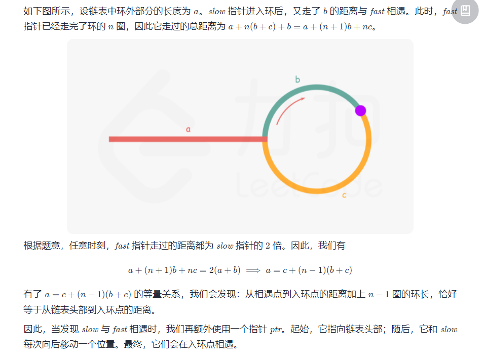
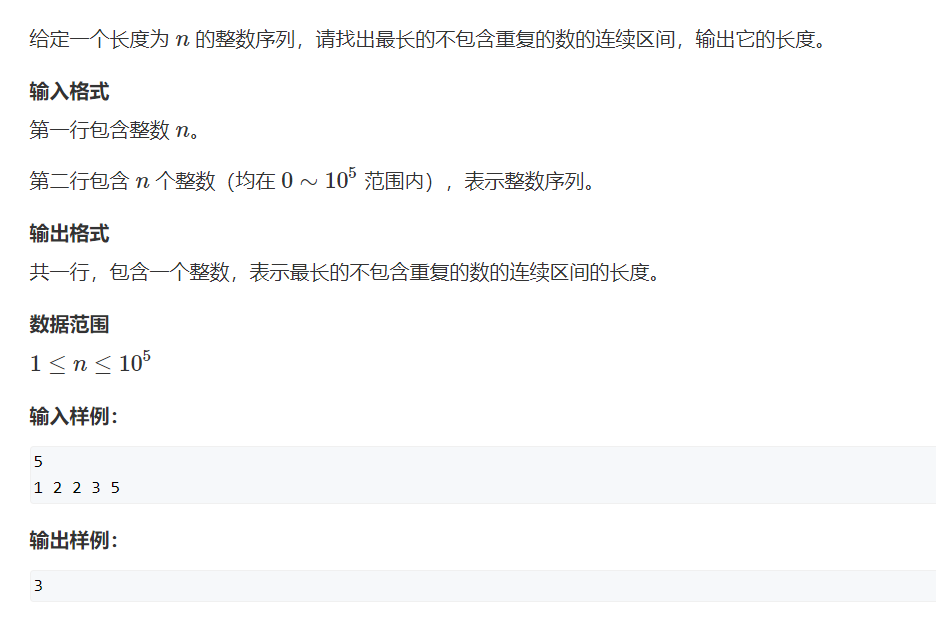
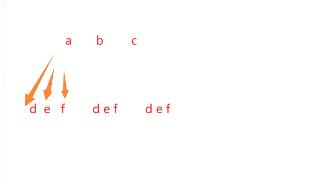
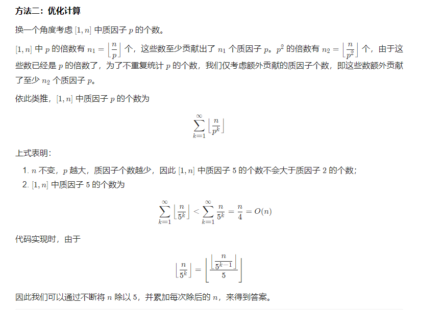

#  Leetcode  刷题总结 

# 语法：


一些注意点

表示整数最大值

```C++
INT_MAX;	
```

反转vector

`reverse(v.begin(),v.end());`


#### string

##### string删除字符

关于erase ，，string删除字符

```C++
#include<iostream>
#include<string>
using namespace std;

int main(){
 string str = "hello c++! +++";
 // 从位置pos=10处开始删除，直到结尾
 // 即： " +++"
 str.erase(10);
 cout << '-' << str << '-' << endl;
 // 从位置pos=6处开始，删除4个字符
 // 即: "c++!"
 str.erase(6, 4);//！！！！！！！！！！注意这个4也是“长度”(＾－＾)V
 cout << '-' << str << '-' << endl;
 return 0;
}
```


##### string添加字符串/字符

对于char

`path.push_back('.');//不可以是string 可以是char`

`path.push_back(mychar);//不可以是string 可以是char`

对于string

`string str=....;path+=str;`

##### 求子串

`s.substr(start,i-start+1)`


##### 删掉最后一个字符

https://blog.51cto.com/xiaohaiwa/5379685


# 数组 :no_mouth:

## [59. 螺旋矩阵 II](https://leetcode-cn.com/problems/spiral-matrix-ii/)

:green_heart:

//自己做出来的 怕以后忘了思路 偶尔可以看看

//%100击败!!   

给你一个正整数 n ，生成一个包含 1 到 n2 所有元素，且元素按顺时针顺序螺旋排列的 n x n 正方形矩阵 matrix 。

 

示例 1：

输入：n = 3
输出：[[1,2,3],[8,9,4],[7,6,5]]
示例 2：

输入：n = 1
输出：[[1]]

```c++
class Solution {
public:
    vector<vector<int>> generateMatrix(int n) {
        int a[30][30]={0};
        int i,j;
        int left=0,right=n-1,down=n-1,up=0;
        for(i=0;i<n*n;)
        {
            for(j=left;j<=right;j++)
            {
                a[up][j]=++i;
            }
            up++;
            if(i>=n*n)break;

            for(j=up;j<=down;j++)
            {
                a[j][right]=++i;
            }
            right--;
            if(i>=n*n)break;

            for(j=right;j>=left;j--)
            {
                a[down][j]=++i;
            }
            down--;
            if(i>=n*n)break;

            for(j=down;j>=up;j--)
            {
                a[j][left]=++i;
            }
            left++;
            if(i>=n*n)break;
        }
        vector<vector<int>> v;
        for(int i=0;i<n;i++)
        {
            vector<int> hang;
            for(int j=0;j<n;j++)
            {
                hang.push_back(a[i][j]);
            }
            v.push_back(hang);
        }
        return v;
    }
};
```


## 209.长度最小的子数组 :no_mouth:

:heart:

题目链接： https://leetcode-cn.com/problems/minimum-size-subarray-sum/

给定一个含有 n 个正整数的数组和一个正整数 s ，找出该数组中满足其和 ≥ s 的长度最小的 连续 子数组，并返回其长度。如果不存在符合条件的子数组，返回 0。

示例：

输入：s = 7, nums = [2,3,1,2,4,3] 输出：2 解释：子数组 [4,3] 是该条件下的长度最小的子数组。

### 暴力解法

这道题目暴力解法当然是 两个for循环，然后不断的寻找符合条件的子序列，时间复杂度很明显是O(n^2) 。

//我刚开始用的方法 me:

```c++
class Solution {
public:
    int minSubArrayLen(int target, vector<int>& nums) {
        int sum=0;
        int min_count=0;
        int count=0;
        int flag=0;
        for(int i=0;i<nums.size();i++)
        {
            sum=0;
            for(int j=i;j<nums.size();j++)
            {
                sum+=nums[j];
                if(sum>=target)
                {
               //     cout<<"i:"<<i<<"  j:"<<j<<endl;
                    count=j-i+1;
                    if(flag==0)
                    {
                        min_count=count;
                        flag=1;
                    }
                 //   cout<<"count: "<<count<<endl;
                    if(count<min_count) min_count=count;
                    break;
                }
                
            }
        }
        return min_count;
    }
};
```

### 滑动窗口

接下来就开始介绍数组操作中另一个重要的方法：**滑动窗口**。

所谓滑动窗口，**就是不断的调节子序列的起始位置和终止位置，从而得出我们要想的结果**。

这里还是以题目中的示例来举例，s=7， 数组是 2，3，1，2，4，3，来看一下查找的过程：

[](https://camo.githubusercontent.com/dd84aee84237ebb78cf7ffde58803dc03350a4071d0981b8add65d9c59199ac4/68747470733a2f2f636f64652d7468696e6b696e672e63646e2e626365626f732e636f6d2f676966732f3230392e2545392539352542462545352542412541362545362539432538302545352542302538462545372539412538342545352541442539302545362539352542302545372542422538342e676966)

最后找到 4，3 是最短距离。

其实从动画中可以发现滑动窗口也可以理解为双指针法的一种！只不过这种解法更像是一个窗口的移动，所以叫做滑动窗口更适合一些。

在本题中实现滑动窗口，主要确定如下三点：

- 窗口内是什么？
- 如何移动窗口的起始位置？
- 如何移动窗口的结束位置？

窗口就是 满足其和 ≥ s 的长度最小的 连续 子数组。

窗口的起始位置如何移动：如果当前窗口的值大于s了，窗口就要向前移动了（也就是该缩小了）。

窗口的结束位置如何移动：窗口的结束位置就是遍历数组的指针，窗口的起始位置设置为数组的起始位置就可以了。

解题的关键在于 窗口的起始位置如何移动，如图所示：

[](https://camo.githubusercontent.com/65f993572b894dfcfbeac11430be5d559ad2f6193fe3e7d439718569b2485fe3/68747470733a2f2f696d672d626c6f672e6373646e696d672e636e2f32303231303331323136303434313934322e706e67)

可以发现**滑动窗口的精妙之处在于根据当前子序列和大小的情况，不断调节子序列的起始位置。从而将O(n^2)的暴力解法降为O(n)。**

C++代码如下： me

```c++
class Solution {
public:
    int minSubArrayLen(int target, vector<int>& nums) {
        //以下尝试滑动窗口法
        int left=0,sum=0;
        int right=0;
        int min_ans=0;
        int flag=0;
        int temp_ans=0;
        for(right=0;right<nums.size();right++)
        {
            sum+=nums[right];
            while(sum>=target)
            {
                temp_ans=right-left+1;
                if(flag==0)
                {
                    min_ans=temp_ans;
                    flag=1;
                }
                if(temp_ans<min_ans) min_ans=temp_ans;
                sum-=nums[left];
                 left++;
            }
        }
        return min_ans;
    }
};
```

注:别人的答案里出现了 INT32_MAX; 指的是int32最大值


复习做的:还是不会ε=(´ο｀*)))唉 看的答案

//**想要的那个区间肯定会包含在更大的区间里面 所以这样缩小范围来找一定是找的到的**

```c++
class Solution {
public:
    int minSubArrayLen(int target, vector<int>& nums) {
        //复习做   又不会啦啦啦
        //滑动窗口法 一个指向前面 一个指向下一个 每次记录长度 如果到了target那么记录一下长度 
        //大了缩小 即左边的右移动 
        //小了变大 即右边的右移动
        int left=0;
        int right=0;//right从0而不是1 不然如果只有一个怎么办
        int sum=0;
        int res=0;
        int temp=0;
        int flag=0;
        //for(left=0;left<nums.size();) //对right下手与判断
        //如果最后right到了末尾 那么如果大于target left不断-- 直到子串最小 这时候如果小了right右边走超过了 那么其实也结束了 
        for(right=0;right<nums.size();right++)
        {
            //for(right=left;sum<target;right++)
                sum+=nums[right];
            //if(sum>=target)
            while(sum>=target)//所以这里得是while
            {
                temp=right-left+1;
                if(flag==0) 
                {
                    flag=1;
                    res=temp;
                }
                else if(temp<res)
                {
                    res=temp;                   
                        
                }
                sum-=nums[left];
                left++;
                
            }
            //if(right+1<nums.size())
            //    right++;
        }
        return res;
    }
};


```

## [剑指 Offer 03. 数组中重复的数字](https://leetcode-cn.com/problems/shu-zu-zhong-zhong-fu-de-shu-zi-lcof/)

找出数组中重复的数字。


在一个长度为 n 的数组 nums 里的所有数字都在 0～n-1 的范围内。数组中某些数字是重复的，但不知道有几个数字重复了，也不知道每个数字重复了几次。请找出数组中任意一个重复的数字。

示例 1：

输入：
[2, 3, 1, 0, 2, 5, 3]
输出：2 或 3 


限制：

2 <= n <= 100000

ME:

```C++
class Solution {
public:
    int findRepeatNumber(vector<int>& nums) {
        unordered_map<int,int> nmap;
        vector<int>::iterator it=nums.begin();
        for(;it!=nums.end();it++)
        {
            if(nmap.find(*it)!=nmap.end())
            {
                return *it;
            }
            else
            {
                nmap[*it]++;
            }
        }
        return 0;
    }
};
```

哈希改进：

```C++
class Solution {
public:
    int findRepeatNumber(vector<int>& nums) {
        unordered_map<int, bool> map;
        for(int num : nums) {
            if(map[num]) return num;
            map[num] = true;
        }
        return -1;
    }
};

作者：jyd
链接：https://leetcode-cn.com/problems/shu-zu-zhong-zhong-fu-de-shu-zi-lcof/solution/mian-shi-ti-03-shu-zu-zhong-zhong-fu-de-shu-zi-yua/
来源：力扣（LeetCode）
著作权归作者所有。商业转载请联系作者获得授权，非商业转载请注明出处。
```

方法二：原地交换

链接：https://leetcode-cn.com/problems/shu-zu-zhong-zhong-fu-de-shu-zi-lcof/solution/mian-shi-ti-03-shu-zu-zhong-zhong-fu-de-shu-zi-yua/

这里面有个视频 忘了可以看这里

题目说明尚未被充分使用，即 在一个长度为 n 的数组 nums 里的所有数字都在 0 ~ n-1 的范围内 。 此说明含义：数组元素的 索引 和 值 是 一对多 的关系。
因此，可遍历数组并通过交换操作，使元素的 索引 与 值 一一对应（即 nums[i] = inums[i]=i ）。因而，就能通过索引映射对应的值，起到与字典等价的作用。


遍历中，第一次遇到数字 xx 时，将其交换至索引 xx 处；而当第二次遇到数字 xx 时，一定有 nums[x] = xnums[x]=x ，此时即可得到一组重复数字。

算法流程：
遍历数组 numsnums ，设索引初始值为 i = 0i=0 :

若 nums[i] = inums[i]=i ： 说明此数字已在对应索引位置，无需交换，因此跳过；
若 nums[nums[i]] = nums[i]nums[nums[i]]=nums[i] ： 代表索引 nums[i]nums[i] 处和索引 ii 处的元素值都为 nums[i]nums[i] ，即找到一组重复值，返回此值 nums[i]nums[i] ；
否则： 交换索引为 ii 和 nums[i]nums[i] 的元素值，将此数字交换至对应索引位置。
若遍历完毕尚未返回，则返回 -1−1 。

复杂度分析：
时间复杂度 O(N)O(N) ： 遍历数组使用 O(N)O(N) ，每轮遍历的判断和交换操作使用 O(1)O(1) 。
空间复杂度 O(1)O(1) ： 使用常数复杂度的额外空间。

me

```C++
class Solution {
public:
    int findRepeatNumber(vector<int>& nums) {
        for(int i=0;i<nums.size();)
        {
            if(nums[i]==i)
            {
                i++;//i在这里++
                continue;
            }
            if(nums[i]==nums[nums[i]]) return nums[i];
            //自己不一定换好了 但是num[i]一定换好了 赶回他应该在的位置
            swap(nums[i],nums[nums[i]]);
        }
         return -1;
    }
   
};
```

## [剑指 Offer 04. 二维数组中的查找](https://leetcode-cn.com/problems/er-wei-shu-zu-zhong-de-cha-zhao-lcof/)

在一个 n * m 的二维数组中，每一行都按照从左到右递增的顺序排序，每一列都按照从上到下递增的顺序排序。请完成一个高效的函数，输入这样的一个二维数组和一个整数，判断数组中是否含有该整数。

 

示例:

现有矩阵 matrix 如下：

[
  [1,   4,  7, 11, 15],
  [2,   5,  8, 12, 19],
  [3,   6,  9, 16, 22],
  [10, 13, 14, 17, 24],
  [18, 21, 23, 26, 30]
]
给定 target = 5，返回 true。

给定 target = 20，返回 false。

 

限制：

0 <= n <= 1000

0 <= m <= 1000


在一个 n * m 的二维数组中，每一行都按照从左到右递增的顺序排序，每一列都按照从上到下递增的顺序排序。请完成一个高效的函数，输入这样的一个二维数组和一个整数，判断数组中是否含有该整数。

暴力法 me  面试官：今天的面试就到这里吧  :monkey:

```C++
class Solution {
public:
    bool findNumberIn2DArray(vector<vector<int>>& matrix, int target) {
        for(int i=0;i<matrix.size();i++)
        {
            for(int j=0;j<matrix[0].size();j++)
            {
                if(matrix[i][j]==target)return true;
            }
        }
        return false;
    }
};
```

方法二：线性查找
由于给定的二维数组具备每行从左到右递增以及每列从上到下递增的特点，当访问到一个元素时，可以排除数组中的部分元素。

从二维数组的右上角开始查找。如果当前元素等于目标值，则返回 true。如果当前元素大于目标值，则移到左边一列。如果当前元素小于目标值，则移到下边一行。

可以证明这种方法不会错过目标值。如果当前元素大于目标值，说明当前元素的下边的所有元素都一定大于目标值，因此往下查找不可能找到目标值，往左查找可能找到目标值。

如果当前元素小于目标值，说明当前元素的左边的所有元素都一定小于目标值，因此往左查找不可能找到目标值，往下查找可能找到目标值。

若数组为空，返回 false
初始化行下标为 0，列下标为二维数组的列数减 1
重复下列步骤，直到行下标或列下标超出边界
获得当前下标位置的元素 num
如果 num 和 target 相等，返回 true
如果 num 大于 target，列下标减 1
如果 num 小于 target，行下标加 1
循环体执行完毕仍未找到元素等于 target ，说明不存在这样的元素，返回 false`

```C++
class Solution {
public:
    bool findNumberIn2DArray(vector<vector<int>>& matrix, int target) {
        for(int i=0,j=matrix[0].size()-1;i<matrix.size()&&j>=0;)
        {
            if(matrix[i][j]==target)return true;
            if(target>matrix[i][j])i++;
            if(target<matrix[i][j])j--;//省略掉if  if(target<matrix[i][j])
        }
        return false;
    }
};
```


[面试题04. 二维数组中的查找（标志数，清晰图解） - 二维数组中的查找 - 力扣（LeetCode） (leetcode-cn.com)](https://leetcode-cn.com/problems/er-wei-shu-zu-zhong-de-cha-zhao-lcof/solution/mian-shi-ti-04-er-wei-shu-zu-zhong-de-cha-zhao-zuo/)


### [66. 加一](https://leetcode-cn.com/problems/plus-one/)

给定一个由 整数 组成的 非空 数组所表示的非负整数，在该数的基础上加一。

最高位数字存放在数组的首位， 数组中每个元素只存储单个数字。

你可以假设除了整数 0 之外，这个整数不会以零开头。

 

示例 1：

输入：digits = [1,2,3]
输出：[1,2,4]
解释：输入数组表示数字 123。
示例 2：

输入：digits = [4,3,2,1]
输出：[4,3,2,2]
解释：输入数组表示数字 4321。
示例 3：

输入：digits = [0]
输出：[1]


提示：

1 <= digits.length <= 100
0 <= digits[i] <= 9

```C++
class Solution {
public:
    vector<int> plusOne(vector<int>& digits) {
        //不能转为数字加一再转回来 因为会溢出
        int n=digits.size();
        for(int i=n-1;i>=0;i--)
        {
            if(digits[i]!=9)//如果全部是9就不会进入
            {
                digits[i]++;
                for(int j=i+1;j<n;j++)
                {
                    digits[j]=0;
                }
                return digits;
            }
        }

        vector<int> res(n+1,0);
        res[0]=1;
        return res;
    }
};
```

## [661. 图片平滑器](https://leetcode-cn.com/problems/image-smoother/)

图像平滑器 是大小为 3 x 3 的过滤器，用于对图像的每个单元格平滑处理，平滑处理后单元格的值为该单元格的平均灰度。

每个单元格的  平均灰度 定义为：该单元格自身及其周围的 8 个单元格的平均值，结果需向下取整。（即，需要计算蓝色平滑器中 9 个单元格的平均值）。

如果一个单元格周围存在单元格缺失的情况，则计算平均灰度时不考虑缺失的单元格（即，需要计算红色平滑器中 4 个单元格的平均值）。


给你一个表示图像灰度的 m x n 整数矩阵 img ，返回对图像的每个单元格平滑处理后的图像 。

 

示例 1:


输入:img = [[1,1,1],[1,0,1],[1,1,1]]
输出:[[0, 0, 0],[0, 0, 0], [0, 0, 0]]
解释:
对于点 (0,0), (0,2), (2,0), (2,2): 平均(3/4) = 平均(0.75) = 0
对于点 (0,1), (1,0), (1,2), (2,1): 平均(5/6) = 平均(0.83333333) = 0
对于点 (1,1): 平均(8/9) = 平均(0.88888889) = 0
示例 2:


输入: img = [[100,200,100],[200,50,200],[100,200,100]]
输出: [[137,141,137],[141,138,141],[137,141,137]]
解释:
对于点 (0,0), (0,2), (2,0), (2,2): floor((100+200+200+50)/4) = floor(137.5) = 137
对于点 (0,1), (1,0), (1,2), (2,1): floor((200+200+50+200+100+100)/6) = floor(141.666667) = 141
对于点 (1,1): floor((50+200+200+200+200+100+100+100+100)/9) = floor(138.888889) = 138


提示:

m == img.length
n == img[i].length
1 <= m, n <= 200
0 <= img[i][j] <= 255

```C++
class Solution {
public:
    vector<vector<int>> imageSmoother(vector<vector<int>>& img) {
        //mn m长 n宽
        //aij 第i列 第j行 a20 是第0行第3个
        int m = img.size();//行
        int n = img[0].size();//列
        int num=0;
        vector<vector<int>> res(m,vector<int>(n,0)); 
        for(int i=0;i<m;i++)//
        {
            for(int j=0;j<n;j++)
            {
                double sum=0;
                num=0;
                for(int k=i-1;k<=i+1;k++)
                {
                    for(int l=j-1;l<=j+1;l++)
                    {
                        if(k<0||l<0||k>=m||l>=n)continue;
                        else 
                        {
                            sum+=img[k][l];
                            num++;
                        }
                    }
                }
                res[i][j]=floor(sum/num);//不一定是9 看题
            }
        }
        return res;
    }
};

```


# 链表


## [203. 移除链表元素](https://leetcode-cn.com/problems/remove-linked-list-elements/)

//看答案的

给你一个链表的头节点 head 和一个整数 val ，请你删除链表中所有满足 Node.val == val 的节点，并返回 新的头节点 。

示例 1：


输入：head = [1,2,6,3,4,5,6], val = 6
输出：[1,2,3,4,5]
示例 2：

输入：head = [], val = 1
输出：[]
示例 3：

输入：head = [7,7,7,7], val = 7
输出：[]


提示：

列表中的节点数目在范围 [0, 104] 内
1 <= Node.val <= 50
0 <= val <= 50


```c++
/**
 * Definition for singly-linked list.
 * struct ListNode {
 *     int val;
 *     ListNode *next;
 *     ListNode() : val(0), next(nullptr) {}
 *     ListNode(int x) : val(x), next(nullptr) {}
 *     ListNode(int x, ListNode *next) : val(x), next(next) {}
 * };
 */
class Solution {
public:
    ListNode* removeElements(ListNode* head, int val) {
        //我的做法是 没有头 给他造一个头
        if(head==nullptr)
            return nullptr;
        if(head->next==nullptr&&head->val==val)
            return nullptr;
        ListNode *pr=head;
        ListNode *rhead=new ListNode;//作为head
        rhead->next=pr;
        ListNode *p=rhead;
        for(;pr!=nullptr;)
        {
            if(pr->val==val)
            {
                p->next=pr->next;
                delete pr;
                pr=p->next;
            }
            else
            {
                p=pr;
                pr=pr->next;
            }
        }
        return rhead->next;
    }
};
```


```java

/**
 * Definition for singly-linked list.
 * public class ListNode {
 *     int val;
 *     ListNode next;
 *     ListNode() {}
 *     ListNode(int val) { this.val = val; }
 *     ListNode(int val, ListNode next) { this.val = val; this.next = next; }
 * }
 */
class Solution {
    public ListNode removeElements(ListNode head, int val) {
        if(head==null)
        return head;

        head.next=removeElements(head.next, val);
        return head.val==val?head.next:head;

    }
}
```


## [707. 设计链表](https://leetcode-cn.com/problems/design-linked-list/)

(https://leetcode-cn.com/problems/design-linked-list/)

设计链表的实现。您可以选择使用单链表或双链表。单链表中的节点应该具有两个属性：val 和 next。val 是当前节点的值，next 是指向下一个节点的指针/引用。如果要使用双向链表，则还需要一个属性 prev 以指示链表中的上一个节点。假设链表中的所有节点都是 0-index 的。

在链表类中实现这些功能：

get(index)：获取链表中第 index 个节点的值。如果索引无效，则返回-1。
addAtHead(val)：在链表的第一个元素之前添加一个值为 val 的节点。插入后，新节点将成为链表的第一个节点。
addAtTail(val)：将值为 val 的节点追加到链表的最后一个元素。
addAtIndex(index,val)：在链表中的第 index 个节点之前添加值为 val  的节点。如果 index 等于链表的长度，则该节点将附加到链表的末尾。如果 index 大于链表长度，则不会插入节点。如果index小于0，则在头部插入节点。
deleteAtIndex(index)：如果索引 index 有效，则删除链表中的第 index 个节点。


示例：

```c++
MyLinkedList linkedList = new MyLinkedList();
linkedList.addAtHead(1);
linkedList.addAtTail(3);
linkedList.addAtIndex(1,2);   //链表变为1-> 2-> 3
linkedList.get(1);            //返回2
linkedList.deleteAtIndex(1);  //现在链表是1-> 3
linkedList.get(1);            //返回3
```


提示：

所有val值都在 [1, 1000] 之内。
操作次数将在  [1, 1000] 之内。
请不要使用内置的 LinkedList 库。

来源：力扣（LeetCode）
链接：https://leetcode-cn.com/problems/design-linked-list
著作权归领扣网络所有。商业转载请联系官方授权，非商业转载请注明出处。


### 解答

```c++
//自己做的
class MyLinkedList {
public:
    /** Initialize your data structure here. */
    struct LNode
         {
            LNode *next;
            int val;
         };  
    LNode *head=new LNode;
    MyLinkedList() {         
         head=nullptr;    
    }
    
    /** Get the value of the index-th node in the linked list. If the index is invalid, return -1. */
    int get(int index) {
        if(index<0)
        {
            return -1;
        }
        LNode *p=head;
        for(int i=0;i<index&&p;i++)
        {
            p=p->next;
        }
        if(p==nullptr)
        {
            return -1;
        }
        return p->val;
    }
    
    /** Add a node of value val before the first element of the linked list. After the insertion, the new node will be the first node of the linked list. */
    void addAtHead(int val) {
        LNode *p=new LNode;
        p->val=val;
        p->next=head;
        head=p;
    }
    
    /** Append a node of value val to the last element of the linked list. */
    void addAtTail(int val) {      
        if(head==nullptr)
        {
            LNode *h=new LNode;
            h->val=val;
            head=h;
            h->next=nullptr;
            return;
        }
        LNode *p=head;
        for(;p->next!=nullptr;)
        {
            p=p->next;
        }
        LNode *tail=new LNode;
        tail->val=val;
        p->next=tail;
        tail->next=nullptr;
    }
    
    /** Add a node of value val before the index-th node in the linked list. If index equals to the length of linked list, the node will be appended to the end of linked list. If index is greater than the length, the node will not be inserted. */
    void addAtIndex(int index, int val) {
        LNode *p=new LNode,*pr=head;
        p->val=val;
        if(index<=0)
        {                     
            p->next=head;
            head=p;
            return;
        }
        if(head==nullptr)
        {
            head=p;
            head->next=nullptr;
            return ;
        }
        for(int i=0;i<index-1&&pr;i++)//插入在之前
        {
            pr=pr->next;
        }
        if(pr==nullptr)//到最后一个也没找到 索引大于长度
        {
            return;
        }
        p->next=pr->next;
        pr->next=p;
        return ;
    }
    
    /** Delete the index-th node in the linked list, if the index is valid. */
    void deleteAtIndex(int index) {
        if(index<0)
            return;
         LNode *pr=head,*rhead,*p;
         rhead=new LNode;//虚拟头
         rhead->next=head;
         p=rhead;
        for(int i=0;i<index&&pr;i++)
        {
            p=pr;
            pr=pr->next;
        }
        if(pr==nullptr)return;
        p->next=pr->next;
        delete pr;
        head=rhead->next;
        return;
    }
};

/**
 * Your MyLinkedList object will be instantiated and called as such:
 * MyLinkedList* obj = new MyLinkedList();
 * int param_1 = obj->get(index);
 * obj->addAtHead(val);
 * obj->addAtTail(val);
 * obj->addAtIndex(index,val);
 * obj->deleteAtIndex(index);
 */
```


测试用例:

```c++
["MyLinkedList","addAtIndex","addAtIndex","addAtIndex","get"]
[[],[0,10],[0,20],[1,30],[0]]
```

## [206. 反转链表](https://leetcode-cn.com/problems/reverse-linked-list/)

(https://leetcode-cn.com/problems/reverse-linked-list/)

给你单链表的头节点 head ，请你反转链表，并返回反转后的链表。


示例 1：

输入：head = [1,2,3,4,5]
输出：[5,4,3,2,1]
示例 2：

输入：head = [1,2]
输出：[2,1]
示例 3：

输入：head = []
输出：[]


```c++
class Solution {
  public:
	  ListNode* reverseList(ListNode* head) {
		  if (head == nullptr)return nullptr;
		  else if (head->next == nullptr)//
		  {
			  return head;
		  }
		  else
		  {
			  //ListNode* h = new ListNode();
			  ListNode* pf = nullptr, *p = head, *pr = head->next;
			  //	p->next = nullptr;
			  while (pr != nullptr)
			  {
				  p->next = pf;
				  pf = p;
				  p = pr;
				  pr = pr->next;
			  }
			  p->next = pf;
			  return p;
		  }
	  }
  };
```

## [剑指 Offer 24. 反转链表](https://leetcode-cn.com/problems/fan-zhuan-lian-biao-lcof/)

难度简单376收藏分享切换为英文接收动态反馈

定义一个函数，输入一个链表的头节点，反转该链表并输出反转后链表的头节点。

 

**示例:**

```
输入: 1->2->3->4->5->NULL
输出: 5->4->3->2->1->NULL
```

 

**限制：**

```
0 <= 节点个数 <= 5000
```


```C++
/**
 * Definition for singly-linked list.
 * struct ListNode {
 *     int val;
 *     ListNode *next;
 *     ListNode() : val(0), next(nullptr) {}
 *     ListNode(int x) : val(x), next(nullptr) {}
 *     ListNode(int x, ListNode *next) : val(x), next(next) {}
 * };
 */
class Solution {
public:
    ListNode* reverseList(ListNode* head) {
        if(!head||!head->next)return head; 
        ListNode *pf=nullptr,*p=head,*pr=p->next;
        while(pr!=nullptr)
        {
            p->next=pf;
            pf=p;
            //cout<<p->val<<endl;
            p=pr;
            pr=pr->next;
        }
        p->next=pf;//这个别忘了
        return p;
    }
};
```

### [92. 反转链表 II](https://leetcode-cn.com/problems/reverse-linked-list-ii/)

`一定一定要画图 并且一定要弄清楚哪个在那个前面  不要搞混啦`

最重要的！！千万要记得一定要有**三个指针** 有一个保存pr 不然很容易循环引用！


给你单链表的头指针 head 和两个整数 left 和 right ，其中 left <= right 。请你反转从位置 left 到位置 right 的链表节点，返回 反转后的链表 。


示例 1：


输入：head = [1,2,3,4,5], left = 2, right = 4
输出：[1,4,3,2,5]
示例 2：

输入：head = [5], left = 1, right = 1
输出：[5]


提示：

链表中节点数目为 n
1 <= n <= 500
-500 <= Node.val <= 500
1 <= left <= right <= n

```C++
/**
 * Definition for singly-linked list.
 * struct ListNode {
 *     int val;
 *     ListNode *next;
 *     ListNode() : val(0), next(nullptr) {}
 *     ListNode(int x) : val(x), next(nullptr) {}
 *     ListNode(int x, ListNode *next) : val(x), next(next) {}
 * };
 */
class Solution {
public:
    ListNode* reverseBetween(ListNode* head, int left, int right) {
        if(right-left<1)return head;
        ListNode *phead=new ListNode();
        phead->next=head;
        ListNode *keepl=phead,*pfront=head,*p,*keeplplus,*pr;
        int i=0;
        for(;i<left-1;i++)keepl=keepl->next;
        keeplplus=keepl->next;
        p=keepl->next->next;
        pfront=keepl->next;
        // cout<<"keepl"<<keepl->val<<endl;
        // cout<<"keeplplus"<<keeplplus->val<<endl;
        i++;
        while(i<right)
        {
            pr=p->next;
            p->next=pfront;
            // cout<<"pf"<<pfront->val<<endl;
            // cout<<"p"<<p->val<<endl;
            pfront=p;
            p=pr;
            i++;
        }
        keepl->next=pfront;
        keeplplus->next=p;

        return phead->next;
    }
};
```


## [19. 删除链表的倒数第 N 个结点](https://leetcode-cn.com/problems/remove-nth-node-from-end-of-list/)

(https://leetcode-cn.com/problems/remove-nth-node-from-end-of-list/)

给你一个链表，删除链表的倒数第 n 个结点，并且返回链表的头结点。

进阶：你能尝试使用一趟扫描实现吗？

 

示例 1：

输入：head = [1,2,3,4,5], n = 2
输出：[1,2,3,5]
示例 2：

输入：head = [1], n = 1
输出：[]
示例 3：

输入：head = [1,2], n = 1
输出：[1]

```c++
/**
 * Definition for singly-linked list.
 * struct ListNode {
 *     int val;
 *     ListNode *next;
 *     ListNode() : val(0), next(nullptr) {}
 *     ListNode(int x) : val(x), next(nullptr) {}
 *     ListNode(int x, ListNode *next) : val(x), next(next) {}
 * };
 */
class Solution {
public:
    ListNode* removeNthFromEnd(ListNode* head, int n) {
        ListNode *p,*pr,*pf,*rhead;
        p=head;
        pr=head;
        rhead=new ListNode;
        rhead->next=head;
        pf=rhead;
        int i;
        for(i=0;i<n&&pr;i++)
        {
            pr=pr->next;
        }
        if(i!=n)
        return nullptr;
        for(;pr;)
        {
            pf=p;
            p=p->next;
            pr=pr->next;
        }
        pf->next=p->next;
        delete p;
        head=rhead->next;
        return rhead->next;
    }
};
```


## 7.Leetcode 160 相交链表

//第二次看答案了

编写一个程序，找到两个单链表相交的起始节点。

**本题思路比较独特,需要仔细思考并记住这类题目的做法**

[160. 相交链表（双指针，清晰图解） - 相交链表 - 力扣（LeetCode） (leetcode-cn.com)](https://leetcode-cn.com/problems/intersection-of-two-linked-lists/solution/intersection-of-two-linked-lists-shuang-zhi-zhen-l/)

```c++
/**
 * Definition for singly-linked list.
 * struct ListNode {
 *     int val;
 *     ListNode *next;
 *     ListNode(int x) : val(x), next(NULL) {}
 * };
 */
class Solution {
public:
    ListNode *getIntersectionNode(ListNode *headA, ListNode *headB) {
       //注明,本题需要一步特判不要忘了       //❤❤❤ 下面这句别忘啦 
        if(headA==NULL||headB==NULL)
        {
            return NULL;//如果某个链表不存在,就直接返回就行
        }
        ListNode *p=headA;
        ListNode *q=headB;
        while(p!=q)
        {
            if(p==NULL&&q==NULL)
            {
                return NULL;
            }
            else
            {
                 p=(p?p->next:headB);
                 q=(q?q->next:headA);
            }
        }
        return p;
    }
};
```


```c++
/**
 * Definition for singly-linked list.
 * struct ListNode {
 *     int val;
 *     ListNode *next;
 *     ListNode(int x) : val(x), next(NULL) {}
 * };
 */
class Solution {
public:
    ListNode *getIntersectionNode(ListNode *headA, ListNode *headB) {
        if(headA==NULL||headB==NULL)return NULL;
        ListNode *a=headA,*b=headB;
        for(;a!=b;)
        {
            if(a==NULL&&b==NULL)//如果是同时到达相交点也不会进入这个
            {
                return NULL;
            }
            // if(a->next==NULL)//等号写 2个啊啊啊
            // {
            //     a->next=headB;               
            // }
            //  a=a->next;
            // if(b->next==NULL)
            // {
            //     b->next=headA;
            // }
            // b=b->next;
            a=(a?a->next:headB);
            b=(b?b->next:headA);
        }
        return a;
    }
};

//注释掉的那个超时 为什么
```

M2:

```C++
class Solution {
public:
    ListNode *getIntersectionNode(ListNode *headA, ListNode *headB) {
        ListNode *A = headA, *B = headB;
        while (A != B) {
            A = A != nullptr ? A->next : headB;
            B = B != nullptr ? B->next : headA;
        }
        return A;
    }
};

作者：jyd
链接：https://leetcode-cn.com/problems/intersection-of-two-linked-lists/solution/intersection-of-two-linked-lists-shuang-zhi-zhen-l/
来源：力扣（LeetCode）
著作权归作者所有。商业转载请联系作者获得授权，非商业转载请注明出处。
```


## [142. 环形链表 II](https://leetcode-cn.com/problems/linked-list-cycle-ii/)

//又不会了呀我的天

题意： 给定一个链表，返回链表开始入环的第一个节点。 如果链表无环，则返回 null。

为了表示给定链表中的环，使用整数 pos 来表示链表尾连接到链表中的位置（索引从 0 开始）。 如果 pos 是 -1，则在该链表中没有环。

**说明**：不允许修改给定的链表。

[](https://camo.githubusercontent.com/05d72ee9f71460ca315390b6c412ff8cc107102ecc73d490869fd5eac0a36be9/68747470733a2f2f696d672d626c6f672e6373646e696d672e636e2f32303230303831363131303131323730342e706e67)

### 思路


方法一：哈希表
思路与算法

一个非常直观的思路是：我们遍历链表中的每个节点，并将它记录下来；一旦遇到了此前遍历过的节点，就可以判定链表中存在环。借助哈希表可以很方便地实现。

代码

C++

```c++
class Solution {
public:
    ListNode *detectCycle(ListNode *head) {
        unordered_set<ListNode *> visited;
        while (head != nullptr) {
            if (visited.count(head)) {
                return head;
            }
            visited.insert(head);
            head = head->next;
        }
        return nullptr;
    }
};
```

unordered_set::count()函数是C++ STL中的内置函数，用于对unordered_set容器中特定元素的出现进行计数。由于unordered_set容器不允许存储重复的元素，因此该功能通常用于检查容器中是否存在元素。如果元素存在于容器中，则该函数返回1，否则返回0。

复杂度分析

时间复杂度：O(N)O(N)，其中 NN 为链表中节点的数目。我们恰好需要访问链表中的每一个节点。

空间复杂度：O(N)O(N)，其中 NN 为链表中节点的数目。我们需要将链表中的每个节点都保存在哈希表当中。

方法二：快慢指针
思路与算法



我们使用两个指针，\textit{fast}fast 与 \textit{slow}slow。它们起始都位于链表的头部。随后，\textit{slow}slow 指针每次向后移动一个位置，而 \textit{fast}fast 指针向后移动两个位置。如果链表中存在环，则 \textit{fast}fast 指针最终将再次与 \textit{slow}slow 指针在环中相遇。

如下图所示，设链表中环外部分的长度为 aa。\textit{slow}slow 指针进入环后，又走了 bb 的距离与 \textit{fast}fast 相遇。此时，\textit{fast}fast 指针已经走完了环的 nn 圈，因此它走过的总距离为 a+n(b+c)+b=a+(n+1)b+nca+n(b+c)+b=a+(n+1)b+nc。


根据题意，任意时刻，\textit{fast}fast 指针走过的距离都为 \textit{slow}slow 指针的 22 倍。因此，我们有

a+(n+1)b+nc=2(a+b) \implies a=c+(n-1)(b+c)
a+(n+1)b+nc=2(a+b)⟹a=c+(n−1)(b+c)

有了 a=c+(n-1)(b+c)a=c+(n−1)(b+c) 的等量关系，我们会发现：从相遇点到入环点的距离加上 n-1n−1 圈的环长，恰好等于从链表头部到入环点的距离。

因此，当发现 \textit{slow}slow 与 \textit{fast}fast 相遇时，我们再额外使用一个指针 \textit{ptr}ptr。起始，它指向链表头部；随后，它和 \textit{slow}slow 每次向后移动一个位置。最终，它们会在入环点相遇。

代码

C++

```c++
class Solution {
public:
    ListNode *detectCycle(ListNode *head) 
    {
        ListNode *slow = head, *fast = head;
        while (fast != nullptr) 
        {
            slow = slow->next;
            if (fast->next == nullptr) 
            {
                return nullptr;
            }
            fast = fast->next->next;
            if (fast == slow) 
            {
                ListNode *ptr = head;
                while (ptr != slow) 
                {
                    ptr = ptr->next;
                    slow = slow->next;
                }
                return ptr;
            }
        }
        return nullptr;
    }
};
```

复杂度分析

时间复杂度：O(N)，其中 N为链表中节点的数目。在最初判断快慢指针是否相遇时，\textit{slow}slow 指针走过的距离不会超过链表的总长度；随后寻找入环点时，走过的距离也不会超过链表的总长度。因此，总的执行时间为 O(N)+O(N)=O(N)O(N)+O(N)=O(N)。

空间复杂度：O(1)O(1)。我们只使用了 \textit{slow}, \textit{fast}, \textit{ptr}slow,fast,ptr 三个指针


#### [剑指 Offer 35. 复杂链表的复制](https://leetcode-cn.com/problems/fu-za-lian-biao-de-fu-zhi-lcof/)

难度中等438

请实现 `copyRandomList` 函数，复制一个复杂链表。在复杂链表中，每个节点除了有一个 `next` 指针指向下一个节点，还有一个 `random` 指针指向链表中的任意节点或者 `null`。

 

**示例 1：**


```
输入：head = [[7,null],[13,0],[11,4],[10,2],[1,0]]
输出：[[7,null],[13,0],[11,4],[10,2],[1,0]]
```

**示例 2：**


```
输入：head = [[1,1],[2,1]]
输出：[[1,1],[2,1]]
```

**示例 3：**

****

```
输入：head = [[3,null],[3,0],[3,null]]
输出：[[3,null],[3,0],[3,null]]
```

**示例 4：**

```
输入：head = []
输出：[]
解释：给定的链表为空（空指针），因此返回 null。
```

**提示：**

- `-10000 <= Node.val <= 10000`
- `Node.random` 为空（null）或指向链表中的节点。
- 节点数目不超过 1000 。

解析：

方法二：拼接 + 拆分
考虑构建 原节点 1 -> 新节点 1 -> 原节点 2 -> 新节点 2 -> …… 的拼接链表，如此便可在访问原节点的 random 指向节点的同时找到新对应新节点的 random 指向节点。

算法流程：


复杂度分析：
时间复杂度 O(N)O(N) ： 三轮遍历链表，使用 O(N)O(N) 时间。
空间复杂度 O(1)O(1) ： 节点引用变量使用常数大小的额外空间。

作者：jyd
链接：https://leetcode-cn.com/problems/fu-za-lian-biao-de-fu-zhi-lcof/solution/jian-zhi-offer-35-fu-za-lian-biao-de-fu-zhi-ha-xi-/
来源：力扣（LeetCode）
著作权归作者所有。商业转载请联系作者获得授权，非商业转载请注明出处。


```C++
/*
// Definition for a Node.
class Node {
public:
    int val;
    Node* next;
    Node* random;
    
    Node(int _val) {
        val = _val;
        next = NULL;
        random = NULL;
    }
};
*/
class Solution {
public:
    Node* copyRandomList(Node* head) {
        //思路 再把每个节点都复制出一份，把两个链表弄在一起 然后再单独抽离出来
        if(!head)return NULL;
        // if(!head->next)
        // {
        //     Node* p=new Node(head->val);
        //     p->next=NULL;
        //     return head;
        // } 
        Node *pr=head,*p=head->next;
        //while(!pr)
        while(pr)
        {
            Node* pf=new Node(pr->val);
           // pr->next=p;//其实不用p节点
            pf->next=pr->next;
            pr->next=pf;
            pr=pf->next;
        }

        // pr=head,p=head->next; 用一个指针就行
        // while(!pr)
        // {
        //     p->random=pr->random->next;
        //     pr=pr->next->next;
        //     if(!pr)break;
        //     p=p->next->next;
        // }
        p=head;
        //while(!p)
        while(p)
        {
            if(p->random)//
                p->next->random=p->random->next;
            else
                p->next->random=NULL;
            p=p->next->next;
        }

        pr=head,p=head->next;
        Node* phead=head->next;
        while(p->next)//这个不是pr->next 注意
        {
            pr->next=pr->next->next;

            p->next=p->next->next;
            pr=pr->next;
            p=p->next;
        }
        pr->next=NULL;//在这里再给pr->next赋值
        return phead;
    }
};
```


# 哈希表

## 1002. 查找常用字符

https://leetcode-cn.com/problems/find-common-characters/

给定仅有小写字母组成的字符串数组 A，返回列表中的每个字符串中都显示的全部字符（包括重复字符）组成的列表。例如，如果一个字符在每个字符串中出现 3 次，但不是 4 次，则需要在最终答案中包含该字符 3 次。

你可以按任意顺序返回答案。

【示例一】 输入：["bella","label","roller"] 输出：["e","l","l"]

【示例二】 输入：["cool","lock","cook"] 输出：["c","o"]  

### 思路

这道题意一起就有点绕，不是那么容易懂，其实就是26个小写字符中有字符 在所有字符串里都出现的话，就输出，重复的也算。

例如：

输入：["ll","ll","ll"] 输出：["l","l"]

这道题目一眼看上去，就是用哈希法，**“小写字符”，“出现频率”， 这些关键字都是为哈希法量身定做的啊**

首先可以想到的是暴力解法，一个字符串一个字符串去搜，时间复杂度是O(n^m)，n是字符串长度，m是有几个字符串。

可以看出这是指数级别的时间复杂度，非常高，而且代码实现也不容易，因为要统计 重复的字符，还要适当的替换或者去重。

那我们还是哈希法吧。如果对哈希法不了解，可以看这篇：[关于哈希表，你该了解这些！](https://mp.weixin.qq.com/s/RSUANESA_tkhKhYe3ZR8Jg)。

如果对用数组来做哈希法不了解的话，可以看这篇：[把数组当做哈希表来用，很巧妙！](https://mp.weixin.qq.com/s/ffS8jaVFNUWyfn_8T31IdA)。

了解了哈希法，理解了数组在哈希法中的应用之后，可以来看解题思路了。

整体思路就是统计出搜索字符串里26个字符的出现的频率，然后取每个字符频率最小值，最后转成输出格式就可以了。

如图：

[](https://camo.githubusercontent.com/d7f165b43baffeaed8114c1a8396081b46f9b2ad8a264217e8d2b99f5cf5af49/68747470733a2f2f636f64652d7468696e6b696e672e63646e2e626365626f732e636f6d2f706963732f313030322e2545362539462541352545362538392542452545352542382542382545372539342541382545352541442539372545372541432541362e706e67)

先统计第一个字符串所有字符出现的次数，代码如下： 

```c++
int hash[26] = {0}; // 用来统计所有字符串里字符出现的最小频率
for (int i = 0; i < A[0].size(); i++) { // 用第一个字符串给hash初始化
    hash[A[0][i] - 'a']++;
}
```

接下来，把其他字符串里字符的出现次数也统计出来一次放在hashOtherStr中。

然后hash 和 hashOtherStr 取最小值，这是本题关键所在，此时取最小值，就是 一个字符在所有字符串里出现的最小次数了。

代码如下：

```c++
int hashOtherStr[26] = {0}; // 统计除第一个字符串外字符的出现频率
for (int i = 1; i < A.size(); i++) 
{
    memset(hashOtherStr, 0, 26 * sizeof(int));
    for (int j = 0; j < A[i].size(); j++) 
    {
        hashOtherStr[A[i][j] - 'a']++;
    }
    // 这是关键所在
    for (int k = 0; k < 26; k++) 
    { // 更新hash，保证hash里统计26个字符在所有字符串里出现的最小次数
        hash[k] = min(hash[k], hashOtherStr[k]);
    }
}
```

此时hash里统计着字符在所有字符串里出现的最小次数，那么把hash转正题目要求的输出格式就可以了。

代码如下：

```c++
// 将hash统计的字符次数，转成输出形式
for (int i = 0; i < 26; i++) {
    while (hash[i] != 0) { // 注意这里是while，多个重复的字符
        string s(1, i + 'a'); // char -> string
        result.push_back(s);
        hash[i]--;
    }
}
```

整体C++代码如下：

```c++
class Solution {
public:
    vector<string> commonChars(vector<string>& A) {
        vector<string> result;
        if (A.size() == 0) return result;
        int hash[26] = {0}; // 用来统计所有字符串里字符出现的最小频率
        for (int i = 0; i < A[0].size(); i++) 
        { // 用第一个字符串给hash初始化
            hash[A[0][i] - 'a']++;
        }

        int hashOtherStr[26] = {0}; // 统计除第一个字符串外字符的出现频率
        for (int i = 1; i < A.size(); i++) 
        {
            memset(hashOtherStr, 0, 26 * sizeof(int));
            for (int j = 0; j < A[i].size(); j++) 
            {
                hashOtherStr[A[i][j] - 'a']++;
            }
            // 更新hash，保证hash里统计26个字符在所有字符串里出现的最小次数
            for (int k = 0; k < 26; k++) 
            {
                hash[k] = min(hash[k], hashOtherStr[k]);
            }
        }
        // 将hash统计的字符次数，转成输出形式
        for (int i = 0; i < 26; i++)
        {
            while (hash[i] != 0) 
            { // 注意这里是while，多个重复的字符
                string s(1, i + 'a'); // char -> string
                result.push_back(s);
                hash[i]--;
            }
        }

        return result;
    }
};
```


## 1002. 查找常用字符

https://leetcode-cn.com/problems/find-common-characters/

给定仅有小写字母组成的字符串数组 A，返回列表中的每个字符串中都显示的全部字符（包括重复字符）组成的列表。例如，如果一个字符在每个字符串中出现 3 次，但不是 4 次，则需要在最终答案中包含该字符 3 次。

你可以按任意顺序返回答案。

【示例一】 输入：["bella","label","roller"] 输出：["e","l","l"]

【示例二】 输入：["cool","lock","cook"] 输出：["c","o"]  

### 思路

这道题意一起就有点绕，不是那么容易懂，其实就是26个小写字符中有字符 在所有字符串里都出现的话，就输出，重复的也算。

例如：

输入：["ll","ll","ll"] 输出：["l","l"]

这道题目一眼看上去，就是用哈希法，**“小写字符”，“出现频率”， 这些关键字都是为哈希法量身定做的啊**

首先可以想到的是暴力解法，一个字符串一个字符串去搜，时间复杂度是O(n^m)，n是字符串长度，m是有几个字符串。

可以看出这是指数级别的时间复杂度，非常高，而且代码实现也不容易，因为要统计 重复的字符，还要适当的替换或者去重。

那我们还是哈希法吧。如果对哈希法不了解，可以看这篇：[关于哈希表，你该了解这些！](https://mp.weixin.qq.com/s/RSUANESA_tkhKhYe3ZR8Jg)。

如果对用数组来做哈希法不了解的话，可以看这篇：[把数组当做哈希表来用，很巧妙！](https://mp.weixin.qq.com/s/ffS8jaVFNUWyfn_8T31IdA)。

了解了哈希法，理解了数组在哈希法中的应用之后，可以来看解题思路了。

整体思路就是统计出搜索字符串里26个字符的出现的频率，然后取每个字符频率最小值，最后转成输出格式就可以了。

如图：

[](https://camo.githubusercontent.com/d7f165b43baffeaed8114c1a8396081b46f9b2ad8a264217e8d2b99f5cf5af49/68747470733a2f2f636f64652d7468696e6b696e672e63646e2e626365626f732e636f6d2f706963732f313030322e2545362539462541352545362538392542452545352542382542382545372539342541382545352541442539372545372541432541362e706e67)

先统计第一个字符串所有字符出现的次数，代码如下：

```C++
int hash[26] = {0}; // 用来统计所有字符串里字符出现的最小频率
for (int i = 0; i < A[0].size(); i++) { // 用第一个字符串给hash初始化
    hash[A[0][i] - 'a']++;
}
```

接下来，把其他字符串里字符的出现次数也统计出来一次放在hashOtherStr中。

然后hash 和 hashOtherStr 取最小值，这是本题关键所在，此时取最小值，就是 一个字符在所有字符串里出现的最小次数了。

代码如下：

```C++
int hashOtherStr[26] = {0}; // 统计除第一个字符串外字符的出现频率
for (int i = 1; i < A.size(); i++) {
    memset(hashOtherStr, 0, 26 * sizeof(int));
    for (int j = 0; j < A[i].size(); j++) {
        hashOtherStr[A[i][j] - 'a']++;
    }
    // 这是关键所在
    for (int k = 0; k < 26; k++) { // 更新hash，保证hash里统计26个字符在所有字符串里出现的最小次数
        hash[k] = min(hash[k], hashOtherStr[k]);
    }
}
```

此时hash里统计着字符在所有字符串里出现的最小次数，那么把hash转正题目要求的输出格式就可以了。

代码如下：

```C++
// 将hash统计的字符次数，转成输出形式
for (int i = 0; i < 26; i++) {
    while (hash[i] != 0) { // 注意这里是while，多个重复的字符
        string s(1, i + 'a'); // char -> string
        result.push_back(s);
        hash[i]--;
    }
}
```

整体C++代码如下：

```C++
class Solution {
public:
    vector<string> commonChars(vector<string>& A) {
        vector<string> result;
        if (A.size() == 0) return result;
        int hash[26] = {0}; // 用来统计所有字符串里字符出现的最小频率
        for (int i = 0; i < A[0].size(); i++) { // 用第一个字符串给hash初始化
            hash[A[0][i] - 'a']++;
        }

        int hashOtherStr[26] = {0}; // 统计除第一个字符串外字符的出现频率
        for (int i = 1; i < A.size(); i++) {
            memset(hashOtherStr, 0, 26 * sizeof(int));
            for (int j = 0; j < A[i].size(); j++) {
                hashOtherStr[A[i][j] - 'a']++;
            }
            // 更新hash，保证hash里统计26个字符在所有字符串里出现的最小次数
            for (int k = 0; k < 26; k++) {
                hash[k] = min(hash[k], hashOtherStr[k]);
            }
        }
        // 将hash统计的字符次数，转成输出形式
        for (int i = 0; i < 26; i++) {
            while (hash[i] != 0) { // 注意这里是while，多个重复的字符
                string s(1, i + 'a'); // char -> string
                result.push_back(s);
                hash[i]--;
            }
        }

        return result;
    }
};
```

ME:

```C++
class Solution {
public:
    vector<string> commonChars(vector<string>& words) {
       		//使用哈希表 取每个字符出现的最小频率 每次更新 如果没出现 最小频率是0 也符合
		int hash[26] = { 0 };
		for (int i = 0; i < words[0].size(); i++)
		{
			hash[words[0][i] - 'a']++;
		}
		int hash_other[26] = { 0 };
		for (int i = 1; i < words.size(); i++)
		{
            memset(hash_other,0,26*sizeof(int));//这个也是初始化语句 可以用的
            //hash_other[26] = { 0 };只有初始化的时候可以这样写
			for (int j = 0; j < words[i].size(); j++)
			{
				hash_other[words[i][j] - 'a']++;
			}
			for (int i = 0; i < 26; i++)
			{
				//hash[i] = min(hash[i], hash_other[i]);//没有min
				if (hash_other[i] < hash[i]) hash[i] = hash_other[i];
			}
		}
		vector<string > ans;
		for (int i = 0; i < 26; i++)
		{
			if (hash[i] != 0)
			{
				for (int j = 0; j < hash[i]; j++)
				{
					//ans.push_back('a' + i);报错 只能放string字符串 不能放字符
					//办法:
					string s(1,'a' + i);
					//如果字符串只包含一个字符，使用构造函数对其初始化时，使用以下两种形式比较合理：
					//std::string s('x');//错误×
					//std::string s(1, 'x');//正确
					//std::string s("x");   //正确
					ans.push_back(s);

				}
			}
		}
		return ans;
    }
};
```


```java

class Solution {
    public List<String> commonChars(String[] words) {
        //用数组实现哈希表
        //第一个单词的每个字母放在数组里面，第一个单词进去加一，
        //后面的新的单词计算 并且保存26个单词出现的最小数值
        //最后再输出
        int[] w=new int[26];
        int[] wtemp=new int[26];
        List<String> Str=new ArrayList<String>();
        for(int i=0;i<words[0].length();i++)
        {
            char ch=words[0].charAt(i);
            w[ch-'a']++;
        }
        for(int j=1;j<words.length;j++)
        {
            for(int i=0;i<words[j].length();i++)
            {
                char ch=words[j].charAt(i);
                wtemp[ch-'a']++;
            }
            for(int k=0;k<26;k++)
            {   
                if(wtemp[k]<w[k])w[k]=wtemp[k];
                wtemp[k]=0;
            }
        }
        for(int k=0;k<26;k++)
        {   
            if(w[k]<=0)continue;
            for(int j=0;j<w[k];j++)
            {
                Str.add(String.valueOf((char)(k+'a')));
            }
        }
        return Str;
    }
}
```


## 349. 两个数组的交集

https://leetcode-cn.com/problems/intersection-of-two-arrays/

题意：给定两个数组，编写一个函数来计算它们的交集。

[](https://camo.githubusercontent.com/f446ad1680c4ed528121f6c086dc9495046c56ff0f4d91e83a5f8a56e997a78d/68747470733a2f2f696d672d626c6f672e6373646e696d672e636e2f32303230303831383139333532333931312e706e67)

**说明：** 输出结果中的每个元素一定是唯一的。 我们可以不考虑输出结果的顺序。

### 思路

这道题目，主要要学会使用一种哈希数据结构：unordered_set，这个数据结构可以解决很多类似的问题。

注意题目特意说明：**输出结果中的每个元素一定是唯一的，也就是说输出的结果的去重的， 同时可以不考虑输出结果的顺序**

这道题用暴力的解法时间复杂度是O(n^2)，那来看看使用哈希法进一步优化。

那么用数组来做哈希表也是不错的选择，例如[242. 有效的字母异位词](https://mp.weixin.qq.com/s/ffS8jaVFNUWyfn_8T31IdA)

但是要注意，**使用数组来做哈希的题目，是因为题目都限制了数值的大小。**

而这道题目没有限制数值的大小，就无法使用数组来做哈希表了。

**而且如果哈希值比较少、特别分散、跨度非常大，使用数组就造成空间的极大浪费。**

此时就要使用另一种结构体了，set ，关于set，C++ 给提供了如下三种可用的数据结构：

- std::set
- std::multiset
- std::unordered_set

std::set和std::multiset底层实现都是红黑树，std::unordered_set的底层实现是哈希表， 使用unordered_set 读写效率是最高的，并不需要对数据进行排序，而且还不要让数据重复，所以选择unordered_set。

思路如图所示：

[](https://camo.githubusercontent.com/e78290f6751749c7afae8055cf0e819a5e50e5c919752b9c111df0ba3aee773a/68747470733a2f2f696d672d626c6f672e6373646e696d672e636e2f323032303038303931383537303431372e706e67)

C++代码如下：

把nums1的放进来

遍历nums2看一下能不能在nums1里面找到

能找到就放进结果集里面

```c++
class Solution {
public:
    vector<int> intersection(vector<int>& nums1, vector<int>& nums2) {
        unordered_set<int> result_set; // 存放结果
        unordered_set<int> nums_set(nums1.begin(), nums1.end());
        for (int num : nums2) {
            // 发现nums2的元素 在nums_set里又出现过  去set里面找 因为hash找的快
            if (nums_set.find(num) != nums_set.end()) {
                result_set.insert(num);
            }
        }
        return vector<int>(result_set.begin(), result_set.end());
    }
};
```

ME:

```c++
class Solution {
public: 
    vector<int> intersection(vector<int>& nums1, vector<int>& nums2) {
        //下面这个用哈希表的提交中击败了92.71%的用户!!!
        unordered_set<int> result_set;
        //等会儿要到里面找// 可以直接这样赋值哦哦哦
        unordered_set<int>nums1_set(nums1.begin(),nums1.end());
        for(int num:nums2)//遍历nums2
        {
            if(nums1_set.find(num)!=nums1_set.end())
            {
                result_set.insert(num);
            }
        }
        return vector<int>(result_set.begin(),result_set.end());

        //下面这个过了 但是太慢了 才击败7.43% 因为set底层是红黑树 但是我们这里不用排序
        // 用unordered_set就行 unordered_set底层是哈希表
    /*    set<int> set_;
        vector<int> v;
        for(int i=0;i<nums1.size();i++)
        {
            // if(nums2.find(nums1[i]))
            // {
            //     set_.insert(nums1[i]);
            // }
            for(int j=0;j<nums2.size();j++)
            {
                if(nums1[i]==nums2[j])
                {
                    set_.insert(nums1[i]);
                }
            }
        }
        // for(int i=0;i<set_.size();i++)
        // {
        //     v.push_bach(set_[i]);
        // }
      set<int>:: iterator it;
       for(it=set_.begin();it!=set_.end();it++)
       {
           v.push_back(*it);
       } 
        return v;*/
    }
    
};
```


### 拓展

那有同学可能问了，遇到哈希问题我直接都用set不就得了，用什么数组啊。

直接使用set 不仅占用空间比数组大，而且速度要比数组慢，set把数值映射到key上都要做hash计算的。

不要小瞧 这个耗时，在数据量大的情况，差距是很明显的。


```c++
for(int num : nums2)
```

遍历数组nums2，并把每次遍历所得到的值，赋值给num

这个是C++11的新特性，在C++primer第五版中有讲解
其实这就是简化的循环写法，善于观察的同学结合上下代码语句，应该猜个大概。
等同于

```c++
int num;
for(int i=0;i<nums2.length;i++)
{
num=nums2[i];
}
```

文字解释：从nums2的int型数组中依次将值赋值给num，将num带入for语句代码块中执行。

1.通式
for(要遍历的数据类型 遍历变量 ： 遍历对象)
注：**遍历的数据类型要和遍历的对象元素类型一致**

2.范围for循环不能用于循环体中有改变容器大小的操作。举例子：循环体内不能向vector容器添加元素。
😃😃😃😃😃


## 第202题. 快乐数

https://leetcode-cn.com/problems/happy-number/

编写一个算法来判断一个数 n 是不是快乐数。

「快乐数」定义为：对于一个正整数，每一次将该数替换为它每个位置上的数字的平方和，然后重复这个过程直到这个数变为 1，也可能是 **无限循环** 但始终变不到 1。如果 可以变为 1，那么这个数就是快乐数。

如果 n 是快乐数就返回 True ；不是，则返回 False 。

**示例：**

输入：19
输出：true
解释：
1^2 + 9^2 = 82
8^2 + 2^2 = 68
6^2 + 8^2 = 100
1^2 + 0^2 + 0^2 = 1

### 思路

这道题目看上去貌似一道数学问题，其实并不是！

题目中说了会 **无限循环**，那么也就是说**求和的过程中，==sum会重复出现==，这对解题很重要！**

正如：[关于哈希表，你该了解这些！](https://mp.weixin.qq.com/s/RSUANESA_tkhKhYe3ZR8Jg)中所说，**当我们遇到了要快速判断一个元素是否出现集合里的时候，就要考虑哈希法了。**

所以这道题目使用哈希法，来判断这个sum是否重复出现，如果重复了就是return false， 否则一直找到sum为1为止。

判断sum是否重复出现就可以使用unordered_set。

**还有一个难点就是求和的过程，如果对取数值各个位上的单数操作不熟悉的话，做这道题也会比较艰难。**

C++代码如下：

```c++
class Solution {
public:
    bool isHappy(int n) {
        //执行用时：0 ms, 在所有 C++ 提交中击败了100.00%的用户!!
        unordered_set<int> suqare_sum_set;
        int m=n;
        int square_sum=0;
        for(;;)
        {
            square_sum=0;
        //    cout<<" m :"<<m<<endl;
            for(;m;)
            {
                square_sum+=((m%10)*(m%10));//(m%10*m%10)是错的错的错的 需要加括号 '*'优先级高于'%'
               //  cout<<"m%10  :"<<(m%10)<<endl;
               // cout<<"((m%10)*(m%10))  :"<<((m%10)*(m%10))<<endl;
                m/=10;
            }
            if(suqare_sum_set.find(square_sum)!=suqare_sum_set.end())//存在过了 会陷入死循环
            {
                return false;
            }
            suqare_sum_set.insert(square_sum);
            m=square_sum;
            if(m==1)return true;
        }
        return false;
    }
};
```

m可以设定一个时间上限hhh

## 1. 两数之和

https://leetcode-cn.com/problems/two-sum/

给定一个整数数组 nums 和一个目标值 target，请你在该数组中找出和为目标值的那 两个 整数，并返回他们的数组下标。

你可以假设每种输入只会对应一个答案。但是，数组中同一个元素不能使用两遍。

**示例:**

给定 nums = [2, 7, 11, 15], target = 9

因为 nums[0] + nums[1] = 2 + 7 = 9

所以返回 [0, 1]

### 思路

很明显暴力的解法是两层for循环查找，时间复杂度是O(n^2)。

建议大家做这道题目之前，先做一下这两道

- [242. 有效的字母异位词](https://mp.weixin.qq.com/s/ffS8jaVFNUWyfn_8T31IdA)
- [349. 两个数组的交集](https://mp.weixin.qq.com/s/aMSA5zrp3jJcLjuSB0Es2Q)

[242. 有效的字母异位词](https://mp.weixin.qq.com/s/ffS8jaVFNUWyfn_8T31IdA) 这道题目是用数组作为哈希表来解决哈希问题，[349. 两个数组的交集](https://mp.weixin.qq.com/s/aMSA5zrp3jJcLjuSB0Es2Q)这道题目是通过set作为哈希表来解决哈希问题。

本题呢，则要使用map，那么来看一下使用数组和set来做哈希法的局限。

- 数组的大小是受限制的，而且如果元素很少，而哈希值太大会造成内存空间的浪费。
- set是一个集合，里面放的元素只能是一个key，而两数之和这道题目，不仅要判断y是否存在而且还==要记录y的下表位置==，因为要返回x 和 y的下表。==所以set 也不能用==。

此时就要选择另一种数据结构：map ，map是一种key value的存储结构，可以用key保存数值，用value在保存数值所在的下表。

C++中map，有三种类型：

| 映射               | 底层实现 | 是否有序 | 数值是否可以重复 | 能否更改数值 | 查询效率 | 增删效率 |
| ------------------ | -------- | -------- | ---------------- | ------------ | -------- | -------- |
| std::map           | 红黑树   | key有序  | key不可重复      | key不可修改  | O(logn)  | O(logn)  |
| std::multimap      | 红黑树   | key有序  | key可重复        | key不可修改  | O(logn)  | O(logn)  |
| std::unordered_map | 哈希表   | key无序  | key不可重复      | key不可修改  | O(1)     | O(1)     |

std::unordered_map 底层实现为哈希表，std::map 和std::multimap 的底层实现是红黑树。

同理，std::map 和std::multimap 的key也是有序的（这个问题也经常作为面试题，考察对语言容器底层的理解）。 更多哈希表的理论知识请看[关于哈希表，你该了解这些！](https://mp.weixin.qq.com/s/RSUANESA_tkhKhYe3ZR8Jg)。

**这道题目中并不需要key有序，选择std::unordered_map 效率更高！**

解题思路动画如下：

[](https://camo.githubusercontent.com/224f8e5a93db834ca95a1263f32b6670c85df491cf10c910745aa24dc6f6f3a1/68747470733a2f2f636f64652d7468696e6b696e672e63646e2e626365626f732e636f6d2f676966732f312e2545342542382541342545362539352542302545342542392538422545352539322538432e676966)

C++代码：

```c++
class Solution {
public:
    vector<int> twoSum(vector<int>& nums, int target) {
        std::unordered_map <int,int> map;
        for(int i = 0; i < nums.size(); i++) 
        {
            auto iter = map.find(target - nums[i]);
            if(iter != map.end()) 
            {
                return {iter->second, i};
            }
            map.insert(pair<int, int>(nums[i], i));//这个难啊
        }
        return {};
    }
};
```


me 2022 7 3

```C++
class Solution {
public:
    vector<int> twoSum(vector<int>& nums, int target) {
        //用哈希表 查询快
        unordered_map<int,int> hashMap;//map！因为要返回下标
        for(int i=0;i<nums.size();i++)
        {
            int a=target-nums[i];
            if(hashMap.find(a)!=hashMap.end())return {hashMap[a],i};
            hashMap[nums[i]]=i;
        }
        return {};
    }
};
```


## [454. 四数相加 II](https://leetcode-cn.com/problems/4sum-ii/)

给定四个包含整数的数组列表 A , B , C , D ,计算有多少个元组 (i, j, k, l) ，使得 A[i] + B[j] + C[k] + D[l] = 0。

为了使问题简单化，所有的 A, B, C, D 具有相同的长度 N，且 0 ≤ N ≤ 500 。所有整数的范围在 -228 到 228 - 1 之间，最终结果不会超过 2^31 - 1 。

例如:

输入:
A = [ 1, 2]
B = [-2,-1]
C = [-1, 2]
D = [ 0, 2]

输出:
2

解释:
两个元组如下:
1. (0, 0, 0, 1) -> A[0] + B[0] + C[0] + D[1] = 1 + (-2) + (-1) + 2 = 0
2. (1, 1, 0, 0) -> A[1] + B[1] + C[0] + D[0] = 2 + (-1) + (-1) + 0 = 0

来源：力扣（LeetCode）
链接：https://leetcode-cn.com/problems/4sum-ii

```c++
class Solution {
public:
    int fourSumCount(vector<int>& nums1, vector<int>& nums2, vector<int>& nums3, vector<int>& nums4) {
        unordered_map<int,int> abplus;
        int count=0;
        for(int i=0;i<nums1.size();i++)
        {
            for(int j=0;j<nums2.size();j++)
            {
                abplus[nums1[i]+nums2[j]]++;
            }
        }
        for(int i=0;i<nums3.size();i++)
        {
            for(int j=0;j<nums4.size();j++)
            {
                //找到了
                auto iter= abplus.find(-(nums3[i]+nums4[j]));
                if(iter!=abplus.end())
                {
                    count+=iter->second;
                }
            }
        }
        return count;
    }
};
```


## 哈希总结

数组作为哈希表

一些应用场景就是为数组量身定做的。

在[242.有效的字母异位词](https://mp.weixin.qq.com/s/ffS8jaVFNUWyfn_8T31IdA)中，我们提到了数组就是简单的哈希表，但是数组的大小是受限的！

这道题目包含小写字母，那么使用数组来做哈希最合适不过。==//因为小写字母可以用0-25来表示 按顺序的!==

在[383.赎金信](https://mp.weixin.qq.com/s/qAXqv--UERmiJNNpuphOUQ)中同样要求只有小写字母，那么就给我们浓浓的暗示，用数组！

本题和[242.有效的字母异位词](https://mp.weixin.qq.com/s/ffS8jaVFNUWyfn_8T31IdA)很像，[242.有效的字母异位词](https://mp.weixin.qq.com/s/ffS8jaVFNUWyfn_8T31IdA)是求 字符串a 和 字符串b 是否可以相互组成，在[383.赎金信](https://mp.weixin.qq.com/s/qAXqv--UERmiJNNpuphOUQ)中是求字符串a能否组成字符串b，而不用管字符串b 能不能组成字符串a。

一些同学可能想，用数组干啥，都用map不就完事了。

**上面两道题目用map确实可以，但使用map的空间消耗要比数组大一些，因为map要维护红黑树或者符号表，而且还要做哈希函数的运算。所以数组更加简单直接有效！**


# 字符串  :skull_and_crossbones:   :no_mouth:

## 168. Excel表列名称

#### [168. Excel表列名称](https://leetcode-cn.com/problems/excel-sheet-column-title/)

难度简单444收藏分享切换为英文接收动态反馈

给你一个整数 `columnNumber` ，返回它在 Excel 表中相对应的列名称。

例如：

```c++
A -> 1
B -> 2
C -> 3
...
Z -> 26
AA -> 27
AB -> 28 
...
    
```

**示例 1：**

```c++
输入：columnNumber = 1
输出："A"
```

**示例 2：**

```c++
输入：columnNumber = 28
输出："AB"
```

**示例 3：**

```c++
输入：columnNumber = 701
输出："ZY"
```

**示例 4：**

```c++
输入：columnNumber = 2147483647
输出："FXSHRXW"
```

**提示：**

- `1 <= columnNumber <= 231 - 1`


### 答案

```c++
class Solution {
public:
    string convertToTitle(int columnNumber) {
        string ans;
        while(columnNumber)
        {
            // 因为我们a-z对应1-26 而取余%过后是0-25 且除26的操作也应该是0-25来除是正确的
            //比如 Z 若对应26 26%26=0 而不是25 错误  
            //               26/26=1 而不是0 错误
            columnNumber--;//❤❤❤这里就要减啦
            ans+=(columnNumber%26+'A');//不是对10取余 是对26
            columnNumber/=26;
        }
        //ans.reverse(ans.begin(),ans.end());//错误
        reverse(ans.begin(),ans.end());//注意这个是这样写的
        return ans;
    }
};
```

官方题解:
链接：https://leetcode-cn.com/problems/excel-sheet-column-title/solution/excelbiao-lie-ming-cheng-by-leetcode-sol-hgj4/


## [541. 反转字符串 II](https://leetcode-cn.com/problems/reverse-string-ii/)

难度简单138

给定一个字符串 `s` 和一个整数 `k`，从字符串开头算起，每 `2k` 个字符反转前 `k` 个字符。

- 如果剩余字符少于 `k` 个，则将剩余字符全部反转。
- 如果剩余字符小于 `2k` 但大于或等于 `k` 个，则反转前 `k` 个字符，其余字符保持原样。

 

**示例 1：**

```c++
输入：s = "abcdefg", k = 2
输出："bacdfeg"
```

**示例 2：**

```c++
输入：s = "abcd", k = 2
输出："bacd"
```

 

**提示：**

- `1 <= s.length <= 104`
- `s` 仅由小写英文组成
- `1 <= k <= 104`

### me:

```c++
class Solution {
public:
    string reverseStr(string s, int k) {
        int len=s.size();
        //认真看题目a.....!!!!
        for(int i=0;len>0;i++)
        {
         //   cout<<"1"<<endl;
            //    cout<<"2"<<endl;
                //不包含右边 左闭右开区间这是 就像如果写s.end(),不包含s.end()
            if(len<k)
            {
                //题目：如果剩余字符少于 `k` 个，则将剩余字符全部反转。
                 reverse(s.begin() +i*2*k,s.end());
                 return s;
            }
            else
            reverse(s.begin() +i*2*k,s.begin()+k +i*2*k);
         //   cout<<"    i*2*k-k +i*2*k  "  <<i*2*k<<" "<<k +i*2*k<<"  s:"<<s<<endl;
            len=len-2*k;//剩下的区间长度
        //    cout<<"len: "<<len   <<"   i:  "<<i<<endl;
        } 
        return s;
    }
   
};
```


## [剑指 Offer 05. 替换空格](https://leetcode-cn.com/problems/ti-huan-kong-ge-lcof/)

难度简单145

请实现一个函数，把字符串 `s` 中的每个空格替换成"%20"。

 

**示例 1：**

```
输入：s = "We are happy."
输出："We%20are%20happy."
```

 

**限制：**

```
0 <= s 的长度 <= 10000
```

击败百分之百呐

```c++
class Solution {
public:
    string replaceSpace(string s) {
        string res;
        for(int i=0;i<s.size();i++)
        {
            if(s[i]==' ')
                res+="%20";//妙啊
            else
                res+=s[i];
        }
        return res;
    }
};
```


//字符串这里有点偷懒啦 天天用stl

 后面在实现底层的吧hh


## KMP 28. 实现 strStr()  :skull_and_crossbones:   :no_mouth:

:heart:

实现 strStr() 函数。
    
给定一个 haystack 字符串和一个 needle 字符串，在 haystack 字符串中找出 needle 字符串出现的第一个位置 (从0开始)。如果不存在，则返回  -1。
    
示例 1:
输入: haystack = "hello", needle = "ll"
 输出: 2
    
 示例 2:
输入: haystack = "aaaaa", needle = "bba"
输出: -1
    
说明:
当 needle 是空字符串时，我们应当返回什么值呢？这是一个在面试中很好的问题。
对于本题而言，当 needle 是空字符串时我们应当返回 0 。这与C语言的 strstr() 以及 Java的 indexOf() 定义相符。
搜索:


本题是KMP 经典题目。

以下文字如果看不进去，可以看我的B站视频：

* [帮你把KMP算法学个通透！B站（理论篇）](https://www.bilibili.com/video/BV1PD4y1o7nd/)
* [帮你把KMP算法学个通透！（求next数组代码篇）](https://www.bilibili.com/video/BV1M5411j7Xx)

KMP的经典思想就是:**当出现字符串不匹配时，可以记录一部分之前已经匹配的文本内容，利用这些信息避免从头再去做匹配。**

本篇将以如下顺序来讲解KMP，


* 什么是KMP
* KMP有什么用
* 什么是前缀表
* 为什么一定要用前缀表
* 如何计算前缀表
* 前缀表与next数组
* 使用next数组来匹配
* 时间复杂度分析
* 构造next数组
* 使用next数组来做匹配
* 前缀表统一减一 C++代码实现
* 前缀表（不减一）C++实现
* 总结


读完本篇可以顺便把leetcode上28.实现strStr()题目做了。

### 什么是kmp

说到KMP，先说一下KMP这个名字是怎么来的，为什么叫做KMP呢。

因为是由这三位学者发明的：Knuth，Morris和Pratt，所以取了三位学者名字的首字母。所以叫做KMP


### KMP有什么用

KMP主要应用在字符串匹配上。

KMP的主要思想是**当出现字符串不匹配时，可以知道一部分之前已经匹配的文本内容，可以利用这些信息避免从头再去做匹配了。**

所以如何记录已经匹配的文本内容，是KMP的重点，也是next数组肩负的重任。

其实KMP的代码不好理解，一些同学甚至直接把KMP代码的模板背下来。

没有彻底搞懂，懵懵懂懂就把代码背下来太容易忘了。

不仅面试的时候可能写不出来，如果面试官问：**next数组里的数字表示的是什么，为什么这么表示？**

估计大多数候选人都是懵逼的。

下面Carl就带大家把KMP的精髓，next数组弄清楚。

### 什么是前缀表

写过KMP的同学，一定都写过next数组，那么这个next数组究竟是个啥呢？

next数组就是一个前缀表（prefix table）。

前缀表有什么作用呢？

**前缀表是用来回退的，它记录了模式串与主串(文本串)不匹配的时候，模式串应该从哪里开始重新匹配。**

为了清楚的了解前缀表的来历，我们来举一个例子：

要在文本串：aabaabaafa 中查找是否出现过一个模式串：aabaaf。

请记住文本串和模式串的作用，对于理解下文很重要，要不然容易看懵。所以说三遍：

要在文本串：aabaabaafa 中查找是否出现过一个模式串：aabaaf。

要在文本串：aabaabaafa 中查找是否出现过一个模式串：aabaaf。

要在文本串：aabaabaafa 中查找是否出现过一个模式串：aabaaf。

如动画所示：


动画里，我特意把 子串`aa` 标记上了，这是有原因的，大家先注意一下，后面还会说道。

可以看出，文本串中第六个字符b 和 模式串的第六个字符f，不匹配了。如果暴力匹配，会发现不匹配，此时就要从头匹配了。

但如果使用前缀表，就不会从头匹配，而是从上次已经匹配的内容开始匹配，找到了模式串中第三个字符b继续开始匹配。

此时就要问了**前缀表是如何记录的呢？**

首先要知道前缀表的任务是当前位置匹配失败，找到之前已经匹配上的位置，在重新匹配，此也意味着在某个字符失配时，前缀表会告诉你下一步匹配中，模式串应该跳到哪个位置。

那么什么是前缀表：**记录下标i之前（包括i）的字符串中，有多大长度的相同前缀后缀。**

### 最长公共前后缀？

文章中字符串的**前缀是指不包含最后一个字符的所有以第一个字符开头的连续子串**。

**后缀是指不包含第一个字符的所有以最后一个字符结尾的连续子串**。

**正确理解什么是前缀什么是后缀很重要**!

那么网上清一色都说 “kmp 最长公共前后缀” 又是什么回事呢？

我查了一遍 算法导论 和 算法4里KMP的章节，都没有提到 “最长公共前后缀”这个词，也不知道从哪里来了，我理解是用“最长相等前后缀” 更准确一些。

**因为前缀表要求的就是相同前后缀的长度。**

而最长公共前后缀里面的“公共”，更像是说前缀和后缀公共的长度。这其实并不是前缀表所需要的。

所以字符串a的最长相等前后缀为0。
字符串aa的最长相等前后缀为1。
字符串aaa的最长相等前后缀为2。
等等.....。


### 为什么一定要用前缀表

这就是前缀表那为啥就能告诉我们 上次匹配的位置，并跳过去呢？

回顾一下，刚刚匹配的过程在下标5的地方遇到不匹配，模式串是指向f，如图：
 </img></div>


然后就找到了下标2，指向b，继续匹配：如图：
 </img></div>

以下这句话，对于理解为什么使用前缀表可以告诉我们匹配失败之后跳到哪里重新匹配 非常重要！

**下标5之前这部分的字符串（也就是字符串aabaa）的最长相等的前缀 和 后缀字符串是 子字符串aa ，因为找到了最长相等的前缀和后缀，匹配失败的位置是后缀子串的后面，那么我们找到与其相同的前缀的后面从新匹配就可以了。**

所以前缀表具有告诉我们当前位置匹配失败，跳到之前已经匹配过的地方的能力。

**很多介绍KMP的文章或者视频并没有把为什么要用前缀表？这个问题说清楚，而是直接默认使用前缀表。**

### 如何计算前缀表

接下来就要说一说怎么计算前缀表。

如图：

 </img></div>

长度为前1个字符的子串`a`，最长相同前后缀的长度为0。（注意字符串的**前缀是指不包含最后一个字符的所有以第一个字符开头的连续子串**；**后缀是指不包含第一个字符的所有以最后一个字符结尾的连续子串**。）

 </img></div>
长度为前2个字符的子串`aa`，最长相同前后缀的长度为1。

 </img></div>
长度为前3个字符的子串`aab`，最长相同前后缀的长度为0。

以此类推：
长度为前4个字符的子串`aaba`，最长相同前后缀的长度为1。
长度为前5个字符的子串`aabaa`，最长相同前后缀的长度为2。
长度为前6个字符的子串`aabaaf`，最长相同前后缀的长度为0。

那么把求得的最长相同前后缀的长度就是对应前缀表的元素，如图：
 </img></div>

可以看出模式串与前缀表对应位置的数字表示的就是：**下标i之前（包括i）的字符串中，有多大长度的相同前缀后缀。**

再来看一下如何利用 前缀表找到 当字符不匹配的时候应该指针应该移动的位置。如动画所示：


找到的不匹配的位置， 那么此时我们要看它的前一个字符的前缀表的数值是多少。

为什么要前一个字符的前缀表的数值呢，因为要找前面字符串的最长相同的前缀和后缀。

所以要看前一位的 前缀表的数值。

前一个字符的前缀表的数值是2， 所有把下标移动到下标2的位置继续比配。 可以再反复看一下上面的动画。

最后就在文本串中找到了和模式串匹配的子串了。

### 前缀表与next数组

很多KMP算法的时间都是使用next数组来做回退操作，那么next数组与前缀表有什么关系呢？

next数组就可以是前缀表，但是很多实现都是把前缀表统一减一（右移一位，初始位置为-1）之后作为next数组。

为什么这么做呢，其实也是很多文章视频没有解释清楚的地方。

其实**这并不涉及到KMP的原理，而是具体实现，next数组即可以就是前缀表，也可以是前缀表统一减一（右移一位，初始位置为-1）。**

后面我会提供两种不同的实现代码，大家就明白了了。

### 使用next数组来匹配

**以下我们以前缀表统一减一之后的next数组来做演示**。

有了next数组，就可以根据next数组来 匹配文本串s，和模式串t了。

注意next数组是新前缀表（旧前缀表统一减一了）。

匹配过程动画如下：


### 时间复杂度分析

其中n为文本串长度，m为模式串长度，因为在匹配的过程中，根据前缀表不断调整匹配的位置，可以看出匹配的过程是O(n)，之前还要单独生成next数组，时间复杂度是O(m)。所以整个KMP算法的时间复杂度是O(n+m)的。

暴力的解法显而易见是O(n * m)，所以**KMP在字符串匹配中极大的提高的搜索的效率。**

为了和力扣题目28.实现strStr保持一致，方便大家理解，以下文章统称haystack为文本串, needle为模式串。

都知道使用KMP算法，一定要构造next数组。

### 构造next数组

我们定义一个函数getNext来构建next数组，函数参数为指向next数组的指针，和一个字符串。 代码如下：

```CPP
void getNext(int* next, const string& s)
```

**构造next数组其实就是计算模式串s，前缀表的过程。** 主要有如下三步：

1. 初始化
2. 处理前后缀不相同的情况
3. 处理前后缀相同的情况

接下来我们详解详解一下。

1. 初始化：

定义两个指针i和j，j指向前缀起始位置，i指向后缀起始位置。

然后还要对next数组进行初始化赋值，如下：

```
int j = -1;
next[0] = j;
```

j 为什么要初始化为 -1呢，因为之前说过 前缀表要统一减一的操作仅仅是其中的一种实现，我们这里选择j初始化为-1，下文我还会给出j不初始化为-1的实现代码。

next[i] 表示 i（包括i）之前最长相等的前后缀长度（其实就是j）

所以初始化next[0] = j 。


2. 处理前后缀不相同的情况


因为j初始化为-1，那么i就从1开始，进行s[i] 与 s[j+1]的比较。

所以遍历模式串s的循环下标i 要从 1开始，代码如下：

```
for(int i = 1; i < s.size(); i++) {
```

如果 s[i] 与 s[j+1]不相同，也就是遇到 前后缀末尾不相同的情况，就要向前回退。

怎么回退呢？

next[j]就是记录着j（包括j）之前的子串的相同前后缀的长度。

那么 s[i] 与 s[j+1] 不相同，就要找 j+1前一个元素在next数组里的值（就是next[j]）。

所以，处理前后缀不相同的情况代码如下：

```
while (j >= 0 && s[i] != s[j + 1]) { // 前后缀不相同了
    j = next[j]; // 向前回退
}
```

3. 处理前后缀相同的情况

如果s[i] 与 s[j + 1] 相同，那么就同时向后移动i 和j 说明找到了相同的前后缀，同时还要将j（前缀的长度）赋给next[i], 因为next[i]要记录相同前后缀的长度。

代码如下：

```
if (s[i] == s[j + 1]) { // 找到相同的前后缀
    j++;
}
next[i] = j;
```

最后整体构建next数组的函数代码如下：

```C++
void getNext(int* next, const string& s){
    int j = -1;
    next[0] = j;
    for(int i = 1; i < s.size(); i++) 
    { // 注意i从1开始
        while (j >= 0 && s[i] != s[j + 1]) 
        { // 前后缀不相同了
            j = next[j]; // 向前回退
        }
        if (s[i] == s[j + 1]) 
        { // 找到相同的前后缀
            j++;
        }
        next[i] = j; // 将j（前缀的长度）赋给next[i]
    }
}
```


代码构造next数组的逻辑流程动画如下：


得到了next数组之后，就要用这个来做匹配了。

### 使用next数组来做匹配

在文本串s里 找是否出现过模式串t。

定义两个下标j 指向模式串起始位置，i指向文本串起始位置。

那么j初始值依然为-1，为什么呢？ **依然因为next数组里记录的起始位置为-1。**

i就从0开始，遍历文本串，代码如下：

```
for (int i = 0; i < s.size(); i++) 
```

接下来就是 s[i] 与 t[j + 1] （因为j从-1开始的） 进行比较。

如果 s[i] 与 t[j + 1] 不相同，j就要从next数组里寻找下一个匹配的位置。

代码如下：

```
while(j >= 0 && s[i] != t[j + 1]) {
    j = next[j];
}
```

如果 s[i] 与 t[j + 1] 相同，那么i 和 j 同时向后移动， 代码如下：

```
if (s[i] == t[j + 1]) {
    j++; // i的增加在for循环里
}
```

如何判断在文本串s里出现了模式串t呢，如果j指向了模式串t的末尾，那么就说明模式串t完全匹配文本串s里的某个子串了。

本题要在文本串字符串中找出模式串出现的第一个位置 (从0开始)，所以返回当前在文本串匹配模式串的位置i 减去 模式串的长度，就是文本串字符串中出现模式串的第一个位置。

代码如下：

```
if (j == (t.size() - 1) ) {
    return (i - t.size() + 1);
}
```

那么使用next数组，用模式串匹配文本串的整体代码如下：

```C++
int j = -1; // 因为next数组里记录的起始位置为-1
for (int i = 0; i < s.size(); i++) 
{ // 注意i就从0开始
    while(j >= 0 && s[i] != t[j + 1]) 
    { // 不匹配
        j = next[j]; // j 寻找之前匹配的位置
    }
    if (s[i] == t[j + 1]) 
    { // 匹配，j和i同时向后移动
        j++; // i的增加在for循环里
    }
    if (j == (t.size() - 1) ) 
    { // 文本串s里出现了模式串t
        return (i - t.size() + 1);
    }
}
```

此时所有逻辑的代码都已经写出来了，力扣 28.实现strStr 题目的整体代码如下：

### 前缀表统一减一 C++代码实现

```C++
class Solution {
public:
    void getNext(int* next, const string& s) {
        int j = -1;
        next[0] = j;
        for(int i = 1; i < s.size(); i++) { // 注意i从1开始
            while (j >= 0 && s[i] != s[j + 1]) { // 前后缀不相同了
                j = next[j]; // 向前回退
            }
            if (s[i] == s[j + 1]) { // 找到相同的前后缀
                j++;
            }
            next[i] = j; // 将j（前缀的长度）赋给next[i]
        }
    }
    int strStr(string haystack, string needle) {
        if (needle.size() == 0) {
            return 0;
        }
        int next[needle.size()];
        getNext(next, needle);
        int j = -1; // // 因为next数组里记录的起始位置为-1
        for (int i = 0; i < haystack.size(); i++) { // 注意i就从0开始
            while(j >= 0 && haystack[i] != needle[j + 1]) { // 不匹配
                j = next[j]; // j 寻找之前匹配的位置
            }
            if (haystack[i] == needle[j + 1]) { // 匹配，j和i同时向后移动
                j++; // i的增加在for循环里
            }
            if (j == (needle.size() - 1) ) { // 文本串s里出现了模式串t
                return (i - needle.size() + 1);
            }
        }
        return -1;
    }
};

```

### 前缀表（不减一）C++实现

那么前缀表就不减一了，也不右移的，到底行不行呢？

**行！**

我之前说过，这仅仅是KMP算法实现上的问题，如果就直接使用前缀表可以换一种回退方式，找j=next[j-1] 来进行回退。

主要就是j=next[x]这一步最为关键！

我给出的getNext的实现为：（前缀表统一减一）

```C++
void getNext(int* next, const string& s) {
    int j = -1;
    next[0] = j;
    for(int i = 1; i < s.size(); i++) { // 注意i从1开始
        while (j >= 0 && s[i] != s[j + 1]) { // 前后缀不相同了
            j = next[j]; // 向前回退
        }
        if (s[i] == s[j + 1]) { // 找到相同的前后缀
            j++;
        }
        next[i] = j; // 将j（前缀的长度）赋给next[i]
    }
}

```

此时如果输入的模式串为aabaaf，对应的next为-1 0 -1 0 1 -1。

这里j和next[0]初始化为-1，整个next数组是以 前缀表减一之后的效果来构建的。

那么前缀表不减一来构建next数组，代码如下：

```C++
    void getNext(int* next, const string& s) {
        int j = 0;
        next[0] = 0;
        for(int i = 1; i < s.size(); i++) {
            while (j > 0 && s[i] != s[j]) { // j要保证大于0，因为下面有取j-1作为数组下标的操作
                j = next[j - 1]; // 注意这里，是要找前一位的对应的回退位置了
            }
            if (s[i] == s[j]) {
                j++;
            }
            next[i] = j;
        }
    }

```

此时如果输入的模式串为aabaaf，对应的next为 0 1 0 1 2 0，（其实这就是前缀表的数值了）。

那么用这样的next数组也可以用来做匹配，代码要有所改动。

实现代码如下：

```C++
class Solution {
public:
    void getNext(int* next, const string& s) 
    {
        int j = 0;
        next[0] = 0;
        for(int i = 1; i < s.size(); i++) 
        {
            while (j > 0 && s[i] != s[j]) //j>0别忘啦
            {
                j = next[j - 1];
            }
            if (s[i] == s[j]) 
            {
                j++;
            }
            next[i] = j;
        }
    }
    int strStr(string haystack, string needle) 
    {
        if (needle.size() == 0) 
        {
            return 0;
        }
        int next[needle.size()];
        getNext(next, needle);
        int j = 0;
        for (int i = 0; i < haystack.size(); i++) 
        {
            while(j > 0 && haystack[i] != needle[j]) 
            {
                j = next[j - 1];
            }
            if (haystack[i] == needle[j]) 
            {
                j++;
            }
            if (j == needle.size() ) 
            {
                return (i - needle.size() + 1);
            }
        }
        return -1;
    }
};
```


```c++
class Solution {
public:
    void getnext(int *next,string s)
    {
        int i,j=0;
        next[0]=0;
        for(i=1;i<s.size();i++)
        {
            while(j>0&&s[i]!=s[j])
            {
                j=next[j-1];
            }
            if(s[i]==s[j])
            {
                j++;
            }
            next[i]=j;
        }
    }
    int strStr(string haystack, string needle) {
        if (needle.size() == 0) 
        {
            return 0;
        }
        int next[needle.size()];
        getnext(next,needle);
        int k=0;
        for(int i=0;i<haystack.size();i++)
        {
            while(k>0&&needle[k]!=haystack[i])
            {
                k=needle[k-1];
            }
            if(needle[k]==haystack[i])
            {
                k++;
            }
            if(k==needle.size())
            {
                return (i-needle.size()+1);
            }
        
        }
        return -1;

    }
};
```


## 459.重复的子字符串

https://leetcode-cn.com/problems/repeated-substring-pattern/

给定一个非空的字符串，判断它是否可以由它的一个子串重复多次构成。给定的字符串只含有小写英文字母，并且长度不超过10000。

示例 1:    
输入: "abab"    
输出: True      
解释: 可由子字符串 "ab" 重复两次构成。   

示例 2:     
输入: "aba"  
输出: False       

示例 3:      
输入: "abcabcabcabc"   
输出: True      
解释: 可由子字符串 "abc" 重复四次构成。 (或者子字符串 "abcabc" 重复两次构成。)

### 思路

这又是一道标准的KMP的题目。

如果KMP还不够了解，可以看我的B站：

* [帮你把KMP算法学个通透！（理论篇）](https://www.bilibili.com/video/BV1PD4y1o7nd/)
* [帮你把KMP算法学个通透！（求next数组代码篇）](https://www.bilibili.com/video/BV1M5411j7Xx)


我们在[字符串：KMP算法精讲](https://mp.weixin.qq.com/s/MoRBHbS4hQXn7LcPdmHmIg)里提到了，在一个串中查找是否出现过另一个串，这是KMP的看家本领。

那么寻找重复子串怎么也涉及到KMP算法了呢？

这里就要说一说next数组了，next 数组记录的就是最长相同前后缀( [字符串：KMP算法精讲](https://mp.weixin.qq.com/s/MoRBHbS4hQXn7LcPdmHmIg) 这里介绍了什么是前缀，什么是后缀，什么又是最长相同前后缀)， 如果 next[len - 1] != -1，则说明字符串有最长相同的前后缀（就是字符串里的前缀子串和后缀子串相同的最长长度）。

最长相等前后缀的长度为：next[len - 1] + 1。

数组长度为：len。

如果len % (len - (next[len - 1] + 1)) == 0 ，则说明 (数组长度-最长相等前后缀的长度) 正好可以被 数组的长度整除，说明有该字符串有重复的子字符串。

**数组长度减去最长相同前后缀的长度相当于是第一个周期的长度，也就是一个周期的长度，如果这个周期可以被整除，就说明整个数组就是这个周期的循环。**


**强烈建议大家把next数组打印出来，看看next数组里的规律，有助于理解KMP算法**

如图：


next[len - 1] = 7，next[len - 1] + 1 = 8，8就是此时字符串asdfasdfasdf的最长相同前后缀的长度。


(len - (next[len - 1] + 1)) 也就是： 12(字符串的长度) - 8(最长公共前后缀的长度) = 4， 4正好可以被 12(字符串的长度) 整除，所以说明有重复的子字符串（asdf）。


```C++
class Solution {
public:
    void getNext (int* next, const string& s){
        next[0] = 0;
        int j = 0;
        for(int i = 1;i < s.size(); i++){
            while(j > 0 && s[i] != s[j]) {
                j = next[j - 1];
            }
            if(s[i] == s[j]) {
                j++;
            }
            next[i] = j;
        }
    }
    bool repeatedSubstringPattern (string s) {
        if (s.size() == 0) {
            return false;
        }
        int next[s.size()];
        getNext(next, s);
        int len = s.size();
        if (next[len - 1] != 0 && len % (len - (next[len - 1] )) == 0) {
            return true;
        }
        return false;
    }
};
```

### 拓展

在[字符串：KMP算法精讲](https://mp.weixin.qq.com/s/MoRBHbS4hQXn7LcPdmHmIg)中讲解KMP算法的基础理论，给出next数组究竟是如何来了，前缀表又是怎么回事，为什么要选择前缀表。

讲解一道KMP的经典题目，力扣：28. 实现 strStr()，判断文本串里是否出现过模式串，这里涉及到构造next数组的代码实现，以及使用next数组完成模式串与文本串的匹配过程。

后来很多同学反馈说：搞不懂前后缀，什么又是最长相同前后缀（最长公共前后缀我认为这个用词不准确），以及为什么前缀表要统一减一（右移）呢，不减一行不行？针对这些问题，我在[字符串：KMP算法精讲](https://mp.weixin.qq.com/s/MoRBHbS4hQXn7LcPdmHmIg)给出了详细的讲解。


### [剑指 Offer II 032. 有效的变位词](https://leetcode-cn.com/problems/dKk3P7/)

难度简单15

给定两个字符串 `s` 和 `t` ，编写一个函数来判断它们是不是一组变位词（字母异位词）。

**注意：**若 `*s*` 和 `*t*` 中每个字符出现的次数都相同且**字符顺序不完全相同**，则称 `*s*` 和 `*t*` 互为变位词（字母异位词）。

 

**示例 1:**

```
输入: s = "anagram", t = "nagaram"
输出: true
```

**示例 2:**

```
输入: s = "rat", t = "car"
输出: false
```

**示例 3:**

```
输入: s = "a", t = "a"
输出: false
```

 

**提示:**

- `1 <= s.length, t.length <= 5 * 104`
- `s` and `t` 仅包含小写字母

 ```C++
 class Solution {
 public:
     bool isAnagram(string s, string t) {
         int a[30]={0},b[30]={0};
         int sn=s.size(),tn=t.size();
         if(sn!=tn)return false;
         if(s==t)return false;
         for(int i=0;i<sn;i++)
         {
             a[s[i]-'a']++;
         }
         for(int i=0;i<tn;i++)
         {
             b[t[i]-'a']++;
         }
         for(int i=0;i<30;i++)
         {
             if(a[i]!=b[i])return false;
         }
         return true;
     }
 };
 ```


### [434. 字符串中的单词数](https://leetcode-cn.com/problems/number-of-segments-in-a-string/)

难度简单169

统计字符串中的单词个数，这里的单词指的是连续的不是空格的字符。

请注意，你可以假定字符串里不包括任何不可打印的字符。

**示例:**

```
输入: "Hello, my name is John"
输出: 5
解释: 这里的单词是指连续的不是空格的字符，所以 "Hello," 算作 1 个单词。
```

```C++
class Solution {
public:
    int countSegments(string s) {
        if(s=="")return 0;
        int n=s.size(),j=0,res=0;
        while(s[j]&&s[j]==' ')j++;
        if(j==n)return 0;
        for(int i=j;i<n;i++)
        {
            if(i+1<n&&s[i]==' '&&s[i+1]!=' ')res+=1;
        }
        return res+1;
    }
};
//击败100% M
```

官方解法：好

```C++
class Solution {
public:
    int countSegments(string s) {
        int segmentCount = 0;

        for (int i = 0; i < s.size(); i++) {
            if ((i == 0 || s[i - 1] == ' ') && s[i] != ' ') {
                segmentCount++;
            }
        }

        return segmentCount;
    }
};
```


# SQL

## [175. 组合两个表](https://leetcode-cn.com/problems/combine-two-tables/)

表1: Person

```SQL
+-------------+---------+
| 列名         | 类型    |
+-------------+---------+
| PersonId    | int     |
| FirstName   | varchar |
| LastName    | varchar |
+-------------+---------+
```

PersonId 是上表主键
表2: Address

```SQL
+-------------+---------+
| 列名         | 类型    |
+-------------+---------+
| AddressId   | int     |
| PersonId    | int     |
| City        | varchar |
| State       | varchar |
+-------------+---------+
```

AddressId 是上表主键


编写一个 SQL 查询，满足条件：无论 person 是否有地址信息，都需要基于上述两表提供 person 的以下信息：

```SQL
FirstName, LastName, City, State
```


### 答案

```sql
# Write your MySQL query statement below
SELECT FirstName, LastName, City, State
FROM Person 
LEFT JOIN Address
ON Person.PersonId=Address.PersonId
```

### 详细题解

#### 图解SQL面试题：多表如何查询？

[猴子数据分析L5](https://leetcode-cn.com/u/houzidata/)发布于 2019-12-2734.2k[MySQL](https://leetcode-cn.com/topic/mysql/)

#### 【题目】

现在有两个表，“学生表”记录了学生的基本信息，有“学号”、“姓名”。

“成绩”表记录了学生选修的课程，以及对应课程的成绩。

这两个表通过“学号”进行关联。

现在要查找出所有学生的学号，姓名，课程和成绩。


#### 【解题思路】

**1.确定查询结果**

题目要求查询所有学生的姓名，学号，课程和成绩信息

select 学号,姓名,课程,成绩

查询结果的列名“学号”、“姓名”，在“学生”表里，列名“课程”、“成绩”在“成绩”表里，所以需要进行多表查询。

**2.哪种联结呢？**

涉及到多表查询，在之前的课程《从零学会sql：多表查询》里讲过需要用到联结。

多表的联结又分为以下几种类型：

1）左联结（left join），联结结果保留左表的全部数据

2）右联结（right join），联结结果保留右表的全部数据

3）内联结（inner join），取两表的公共数据

这个题目里要求“所有学生”，而“所有学生”在“学生”表里。为什么不在“成绩”表里呢？

如果有的学生没有选修课程，那么他就不会出现在“成绩”表里，所以“成绩”表没有包含“所有学生”。

所以要以“学生”表进行左联结，保留左边表（学生表）里的全部数据。

from 学生信息表 as a left join 成绩表 as b

**3.两个表联结条件是什么？**

两个表都有“学号”，所以联结条件为学号。

on a.学号=b.学号

4.最终sql

```
select a.学号,a.姓名,b.课程,b.成绩
from 学生 as a
left join 成绩 as b
on a.学号=b.学号;
```


#### 【本题考点】

考察多表联结，以及如何选择联结的类型。记住课程里讲过的下面这张图，遇到多表联结的时候从这张图选择对于的sql。


#### 【举一反三】

有下面两个表
编写一个 SQL 查询，满足条件：无论 person 是否有地址信息，都需要基于上述两表提供 person 的以下信息：

FirstName, LastName, City, State

【思路】

从表的结构可以看出，表1（Person）是人的姓名信息，表2（Address）是人的地址信息。

1）查询结果是两个表里的列名，所以需要多表查询

2）考虑到有的人可能没有地址信息，要是查询结构要查所有人，需要保留表1（Person）里的全部数据，所以用左联结（left join）

3）两个表联结条件：两个表通过personId产生联结。

【参考答案】

```
select FirstName, LastName, City, State
from Person left join Address
on Person.PersonId = Address.PersonId;
```


# 双指针 :no_mouth:

模板

```C++
for (int i = 0, j = 0; i < n; i ++ )
{
    while (j < i && check(i, j)) j ++ ;

    // 具体问题的逻辑
}
常见问题分类：
    (1) 对于一个序列，用两个指针维护一段区间
    (2) 对于两个序列，维护某种次序，比如归并排序中合并两个有序序列的操作

```


思路：写一个暴力的 看看ij是否有单调关系 如果有的话 可以从O(n^2)->O(n)

两种：

指向两个序列

指向一个序列


（上面那两个写反了 是max。。。i-j+1）

红 i   绿 j

j往左走最远能到哪里

j只会也往后走 不可能往前走

## AcWing 799. 最长连续不重复子序列

背下来啊啊啊啊




```C++
#include<iostream>
using namespace std;
int n;
const int N=100010;
int a[N],s[N];
int main()
{
    int res=0;
    scanf("%d",&n);
    for(int i=0,j=0;i<n;i++)
    {
        scanf("%d",&a[i]);
        s[a[i]]++;
        while(j<i&&s[a[i]]>1)
        {
            s[a[j]]--;//
            j++;//这句和上面那句别写反了 应该是先减 指针再往后
        }
        if(i-j+1>res)res=i-j+1;
        
    }
    cout<<res<<endl;
    return 0;
}
```


## [3. 无重复字符的最长子串](https://leetcode-cn.com/problems/longest-substring-without-repeating-characters/)

和上面一样题哦

给定一个字符串 s ，请你找出其中不含有重复字符的 最长子串 的长度。

 

示例 1:

输入: s = "abcabcbb"
输出: 3 
解释: 因为无重复字符的最长子串是 "abc"，所以其长度为 3。
示例 2:

输入: s = "bbbbb"
输出: 1
解释: 因为无重复字符的最长子串是 "b"，所以其长度为 1。
示例 3:

输入: s = "pwwkew"
输出: 3
解释: 因为无重复字符的最长子串是 "wke"，所以其长度为 3。
     请注意，你的答案必须是 子串 的长度，"pwke" 是一个子序列，不是子串。


提示：

0 <= s.length <= 5 * 104
s 由英文字母、数字、符号和空格组成


ME：

```C++
class Solution {
public:
    int lengthOfLongestSubstring(string s) {
        //写题目前 先用草稿纸写清楚所有情况
        int flag[300]={0};
        int l=0,r=0,n=s.size(),res=1;
        if(n==0||n==1)return n;
        for(r=0;r<n;r++)
        {
            flag[s[r]]++;
            while(l<r&&flag[s[r]]>1)//已经出现了两次了
            {
                flag[s[l]]--;
                l++;
            }
            res=max(res,r-l+1);
        }
        return res;
    }
};
```


官方：

```C++
class Solution {
public:
    int lengthOfLongestSubstring(string s) {
        // 哈希集合，记录每个字符是否出现过
        unordered_set<char> occ;
        int n = s.size();
        // 右指针，初始值为 -1，相当于我们在字符串的左边界的左侧，还没有开始移动
        int rk = -1, ans = 0;
        // 枚举左指针的位置，初始值隐性地表示为 -1
        for (int i = 0; i < n; ++i) 
        {
            if (i != 0) 
            {
                // 左指针向右移动一格，移除一个字符
                occ.erase(s[i - 1]);
            }
            while (rk + 1 < n && !occ.count(s[rk + 1])) 
            {
                // 不断地移动右指针
                occ.insert(s[rk + 1]);
                ++rk;
            }
            // 第 i 到 rk 个字符是一个极长的无重复字符子串
            ans = max(ans, rk - i + 1);
        }
        return ans;
    }
};
```


## AcWing 800. 数组元素的目标和


思路

首先写出暴力的 双层循环 然后寻找单调性 

 一个指针从前往后，一个从后往前 **牛鼻**

```C++
#include<iostream>
using namespace std;
const int N=100010;
int a[N],b[N];
int n,m,x;
int main()
{
    scanf("%d%d%d",&n,&m,&x);
    for(int i=0;i<n;i++)scanf("%d",&a[i]);
    for(int i=0;i<m;i++)scanf("%d",&b[i]);
    for(int i=0,j=m-1;i<n;i++)
    {
        while(a[i]+b[j]>x)j--;
        if(a[i]+b[j]==x) 
        {
            cout<<i<<" "<<j<<endl;
            break;
        }
    }
    return 0;
}
```

## [26. 删除有序数组中的重复项](https://leetcode-cn.com/problems/remove-duplicates-from-sorted-array/)

给你一个 升序排列 的数组 nums ，请你 原地 删除重复出现的元素，使每个元素 只出现一次 ，返回删除后数组的新长度。元素的 相对顺序 应该保持 一致 。

由于在某些语言中不能改变数组的长度，所以必须将结果放在数组nums的第一部分。更规范地说，如果在删除重复项之后有 k 个元素，那么 nums 的前 k 个元素应该保存最终结果。

将最终结果插入 nums 的前 k 个位置后返回 k 。

不要使用额外的空间，你必须在 原地 修改输入数组 并在使用 O(1) 额外空间的条件下完成。

判题标准:

系统会用下面的代码来测试你的题解:

int[] nums = [...]; // 输入数组
int[] expectedNums = [...]; // 长度正确的期望答案

int k = removeDuplicates(nums); // 调用

assert k == expectedNums.length;
for (int i = 0; i < k; i++) {
    assert nums[i] == expectedNums[i];
}
如果所有断言都通过，那么您的题解将被 通过。

 

示例 1：

输入：nums = [1,1,2]
输出：2, nums = [1,2,_]
解释：函数应该返回新的长度 2 ，并且原数组 nums 的前两个元素被修改为 1, 2 。不需要考虑数组中超出新长度后面的元素。
示例 2：

输入：nums = [0,0,1,1,1,2,2,3,3,4]
输出：5, nums = [0,1,2,3,4]
解释：函数应该返回新的长度 5 ， 并且原数组 nums 的前五个元素被修改为 0, 1, 2, 3, 4 。不需要考虑数组中超出新长度后面的元素。


提示：

0 <= nums.length <= 3 * 104
-104 <= nums[i] <= 104
nums 已按 升序 排列

```C++
class Solution {
public:
    int removeDuplicates(vector<int>& nums) {
        int i=0,j=0,res=nums.size();
        if(res<=1)return res;
        int n=nums.size();
        for(int i=0;i<n&&j<n;i++,j++)
        {
            while(j<n-1&&nums[j]==nums[j+1])
            {
                j++;
                res--;
            }
            nums[i]=nums[j];            
        }
        return res;
    }
};
```


## 209.长度最小的子数组

/*****数组里面耶放了这题了

题目链接： https://leetcode-cn.com/problems/minimum-size-subarray-sum/

给定一个含有 n 个正整数的数组和一个正整数 s ，找出该数组中满足其和 ≥ s 的长度最小的 连续 子数组，并返回其长度。如果不存在符合条件的子数组，返回 0。

示例：

输入：s = 7, nums = [2,3,1,2,4,3] 输出：2 解释：子数组 [4,3] 是该条件下的长度最小的子数组。

### 暴力解法

这道题目暴力解法当然是 两个for循环，然后不断的寻找符合条件的子序列，时间复杂度很明显是O(n^2) 。

//我刚开始用的方法 me:

```c++
class Solution {
public:
    int minSubArrayLen(int target, vector<int>& nums) {
        int sum=0;
        int min_count=0;
        int count=0;
        int flag=0;
        for(int i=0;i<nums.size();i++)
        {
            sum=0;
            for(int j=i;j<nums.size();j++)
            {
                sum+=nums[j];
                if(sum>=target)
                {
               //     cout<<"i:"<<i<<"  j:"<<j<<endl;
                    count=j-i+1;
                    if(flag==0)
                    {
                        min_count=count;
                        flag=1;
                    }
                 //   cout<<"count: "<<count<<endl;
                    if(count<min_count) min_count=count;
                    break;
                }
                
            }
        }
        return min_count;
    }
};
```

### 滑动窗口

接下来就开始介绍数组操作中另一个重要的方法：**滑动窗口**。

所谓滑动窗口，**就是不断的调节子序列的起始位置和终止位置，从而得出我们要想的结果**。

这里还是以题目中的示例来举例，s=7， 数组是 2，3，1，2，4，3，来看一下查找的过程：

[](https://camo.githubusercontent.com/dd84aee84237ebb78cf7ffde58803dc03350a4071d0981b8add65d9c59199ac4/68747470733a2f2f636f64652d7468696e6b696e672e63646e2e626365626f732e636f6d2f676966732f3230392e2545392539352542462545352542412541362545362539432538302545352542302538462545372539412538342545352541442539302545362539352542302545372542422538342e676966)

最后找到 4，3 是最短距离。

其实从动画中可以发现滑动窗口也可以理解为双指针法的一种！只不过这种解法更像是一个窗口的移动，所以叫做滑动窗口更适合一些。

在本题中实现滑动窗口，主要确定如下三点：

- 窗口内是什么？
- 如何移动窗口的起始位置？
- 如何移动窗口的结束位置？

窗口就是 满足其和 ≥ s 的长度最小的 连续 子数组。

窗口的起始位置如何移动：如果当前窗口的值大于s了，窗口就要向前移动了（也就是该缩小了）。

窗口的结束位置如何移动：窗口的结束位置就是遍历数组的指针，窗口的起始位置设置为数组的起始位置就可以了。

解题的关键在于 窗口的起始位置如何移动，如图所示：

[](https://camo.githubusercontent.com/65f993572b894dfcfbeac11430be5d559ad2f6193fe3e7d439718569b2485fe3/68747470733a2f2f696d672d626c6f672e6373646e696d672e636e2f32303231303331323136303434313934322e706e67)

可以发现**滑动窗口的精妙之处在于根据当前子序列和大小的情况，不断调节子序列的起始位置。从而将O(n^2)的暴力解法降为O(n)。**

C++代码如下： me

```c++
class Solution {
public:
    int minSubArrayLen(int target, vector<int>& nums) {
        //以下尝试滑动窗口法
        int left=0,sum=0;
        int right=0;
        int min_ans=0;
        int flag=0;
        int temp_ans=0;
        for(right=0;right<nums.size();right++)
        {
            sum+=nums[right];
            while(sum>=target)
            {
                temp_ans=right-left+1;
                if(flag==0)
                {
                    min_ans=temp_ans;
                    flag=1;
                }
                if(temp_ans<min_ans) min_ans=temp_ans;
                sum-=nums[left];
                 left++;
            }
        }
        return min_ans;
    }
};
```

注:别人的答案里出现了 INT32_MAX; 指的是int32最大值


## 第15题. 三数之和 :no_mouth:

https://leetcode-cn.com/problems/3sum/

给你一个包含 n 个整数的数组 nums，判断 nums 中是否存在三个元素 a，b，c ，使得 a + b + c = 0 ？请你找出所有满足条件且不重复的三元组。

**注意：** 答案中不可以包含重复的三元组。

示例：

给定数组 nums = [-1, 0, 1, 2, -1, -4]，

满足要求的三元组集合为： [ [-1, 0, 1], [-1, -1, 2] ]

### 思路

**注意[0， 0， 0， 0] 这组数据**

### 哈希解法

两层for循环就可以确定 a 和b 的数值了，可以使用哈希法来确定 0-(a+b) 是否在 数组里出现过，其实这个思路是正确的，但是我们有一个非常棘手的问题，就是题目中说的不可以包含重复的三元组。

把符合条件的三元组放进vector中，然后在去去重，这样是非常费时的，很容易超时，也是这道题目通过率如此之低的根源所在。

去重的过程不好处理，有很多小细节，如果在面试中很难想到位。

时间复杂度可以做到O(n^2)，但还是比较费时的，因为不好做剪枝操作。

大家可以尝试使用哈希法写一写，就知道其困难的程度了。

哈希法C++代码:

```c++
class Solution {
public:
    vector<vector<int>> threeSum(vector<int>& nums) {
        vector<vector<int>> result;
        sort(nums.begin(), nums.end());
        // 找出a + b + c = 0
        // a = nums[i], b = nums[j], c = -(a + b)
        for (int i = 0; i < nums.size(); i++) {
            // 排序之后如果第一个元素已经大于零，那么不可能凑成三元组
            if (nums[i] > 0) {
                continue;
            }
            if (i > 0 && nums[i] == nums[i - 1]) { //三元组元素a去重
                continue;
            }
            unordered_set<int> set;
            for (int j = i + 1; j < nums.size(); j++) 
            {
                if (j > i + 2
                        && nums[j] == nums[j-1]
                        && nums[j-1] == nums[j-2]) 
                { // 三元组元素b去重
                    continue;
                }
                int c = 0 - (nums[i] + nums[j]);
                if (set.find(c) != set.end()) 
                {
                    result.push_back({nums[i], nums[j], c});
                    set.erase(c);// 三元组元素c去重
                } 
                else 
                {
                    set.insert(nums[j]);
                }
            }
        }
        return result;
    }
};
```

### 双指针

**其实这道题目使用哈希法并不十分合适**，因为在去重的操作中有很多细节需要注意，在面试中很难直接写出没有bug的代码。

而且使用哈希法 在使用两层for循环的时候，能做的剪枝操作很有限，虽然时间复杂度是O(n^2)，也是可以在leetcode上通过，但是程序的执行时间依然比较长 。

接下来我来介绍另一个解法：双指针法，**这道题目使用双指针法 要比哈希法高效一些**，那么来讲解一下具体实现的思路。

动画效果如下：

[](https://camo.githubusercontent.com/3ee1e9d4e153718a7c15146e6b619968f18ba06a39ba732d6d1fa875238483f5/68747470733a2f2f636f64652d7468696e6b696e672e63646e2e626365626f732e636f6d2f676966732f31352e2545342542382538392545362539352542302545342542392538422545352539322538432e676966)

拿这个nums数组来举例，首先将数组排序，然后有一层for循环，i从下表0的地方开始，同时定一个下表left 定义在i+1的位置上，定义下表right 在数组结尾的位置上。

依然还是在数组中找到 abc 使得a + b +c =0，我们这里相当于 a = nums[i] b = nums[left] c = nums[right]。

接下来如何移动left 和right呢， 如果nums[i] + nums[left] + nums[right] > 0 就说明 此时三数之和大了，因为数组是排序后了，所以right下表就应该向左移动，这样才能让三数之和小一些。

如果 nums[i] + nums[left] + nums[right] < 0 说明 此时 三数之和小了，left 就向右移动，才能让三数之和大一些，直到left与right相遇为止。

时间复杂度：O(n^2)。

C++代码代码如下：

```c++
class Solution {
public:
    vector<vector<int>> threeSum(vector<int>& nums) {
        vector<vector<int>> result;
        sort(nums.begin(), nums.end());
        // 找出a + b + c = 0
        // a = nums[i], b = nums[left], c = nums[right]
        for (int i = 0; i < nums.size(); i++) {
            // 排序之后如果第一个元素已经大于零，那么无论如何组合都不可能凑成三元组，直接返回结果就可以了
            if (nums[i] > 0) {
                return result;
            }
            // 错误去重方法，将会漏掉-1,-1,2 这种情况
            /*
            if (nums[i] == nums[i + 1]) {
                continue;
            }
            */
            // 正确去重方法
            if (i > 0 && nums[i] == nums[i - 1]) {
                continue;
            }
            int left = i + 1;
            int right = nums.size() - 1;
            while (right > left) {
                // 去重复逻辑如果放在这里，0，0，0 的情况，可能直接导致 right<=left 了，从而漏掉了 0,0,0 这种三元组
                /*
                while (right > left && nums[right] == nums[right - 1]) right--;
                while (right > left && nums[left] == nums[left + 1]) left++;
                */
                if (nums[i] + nums[left] + nums[right] > 0) 
                {
                    right--;
                } 
                else if (nums[i] + nums[left] + nums[right] < 0) 
                {
                    left++;
                } 
                else
                {
                    result.push_back(vector<int>{nums[i], nums[left], nums[right]});
                    // 去重逻辑应该放在找到一个三元组之后
                    while (right > left && nums[right] == nums[right - 1]) right--;
                    while (right > left && nums[left] == nums[left + 1]) left++;

                    // 找到答案时，双指针同时收缩
                    right--;
                    left++;
                }
            }

        }
        return result;
    }
};
```

排序 + 双指针
本题的难点在于如何去除重复解。

算法流程：
特判，对于数组长度 nn，如果数组为 nullnull 或者数组长度小于 33，返回 [][]。
对数组进行排序。
遍历排序后数组：
若 nums[i]>0nums[i]>0：因为已经排序好，所以后面不可能有三个数加和等于 00，直接返回结果。
对于重复元素：跳过，避免出现重复解
令左指针 L=i+1L=i+1，右指针 R=n-1R=n−1，当 L<RL<R 时，执行循环：
当 nums[i]+nums[L]+nums[R]==0nums[i]+nums[L]+nums[R]==0，执行循环，判断左界和右界是否和下一位置重复，去除重复解。并同时将 L,RL,R 移到下一位置，寻找新的解
若和大于 00，说明 nums[R]nums[R] 太大，RR 左移
若和小于 00，说明 nums[L]nums[L] 太小，LL 右移
复杂度分析
时间复杂度：O\left(n^{2}\right)O(n 
2
 )，数组排序 O(N \log N)O(NlogN)，遍历数组 O\left(n\right)O(n)，双指针遍历 O\left(n\right)O(n)，总体 O(N \log N)+O\left(n\right)*O\left(n\right)O(NlogN)+O(n)∗O(n)，O\left(n^{2}\right)O(n 
2
 )
空间复杂度：O(1)O(1)


me:   复习做的 又不会了我

```c++

class Solution {
public:
    vector<vector<int>> threeSum(vector<int>& nums) {
        //15min
        sort(nums.begin(),nums.end());

        vector<vector<int>> res;
        if(nums.size()<3)return res;
         int left,right,middle=1;
        for(left=0;left<nums.size();left++)
        {
            //剪枝
            if(nums[left]>0)return res;
            //我的问题:我没有去重 八嘎
            //去重语句: 还留一个数 因此与-1相比
            if(left>0&&nums[left]==nums[left-1])continue;
            right=nums.size()-1;
            middle=left+1;
          //  for( ;middle<right&&right<nums.size()&&left<middle; )//会往里面缩 因此其他两个条件不可能达成 不用判断
          for( ;middle<right; )
            {
                if(nums[left]+nums[right]+nums[middle]>0)
                    right--;
                else if(nums[left]+nums[right]+nums[middle]<0)
                    middle++;
                else
                {
                    res.push_back(vector<int>{nums[left],nums[right],nums[middle]});
                    while(middle<right&&nums[middle]==nums[middle+1]) middle++;
                    while(middle<right&&nums[right]==nums[right-1]) right--;
                   
                    middle++;
                    right--;
                }
                
            }
            
        }
        return res;
    }
};
```


## 第18题. 四数之和

https://leetcode-cn.com/problems/4sum/

题意：给定一个包含 n 个整数的数组 nums 和一个目标值 target，判断 nums 中是否存在四个元素 a，b，c 和 d ，使得 a + b + c + d 的值与 target 相等？找出所有满足条件且不重复的四元组。

**注意：**

答案中不可以包含重复的四元组。

示例： 给定数组 nums = [1, 0, -1, 0, -2, 2]，和 target = 0。 满足要求的四元组集合为： [ [-1, 0, 0, 1], [-2, -1, 1, 2], [-2, 0, 0, 2] ]

### 思路

四数之和，和[15.三数之和](https://mp.weixin.qq.com/s/QfTNEByq1YlNSXRKEumwHg)是一个思路，都是使用双指针法, 基本解法就是在[15.三数之和](https://mp.weixin.qq.com/s/QfTNEByq1YlNSXRKEumwHg) 的基础上再套一层for循环。

但是有一些细节需要注意，例如： 不要判断`nums[k] > target` 就返回了，三数之和 可以通过 `nums[i] > 0` 就返回了，因为 0 已经是确定的数了，四数之和这道题目 target是任意值。（大家亲自写代码就能感受出来）

[15.三数之和](https://mp.weixin.qq.com/s/QfTNEByq1YlNSXRKEumwHg)的双指针解法是一层for循环num[i]为确定值，然后循环内有left和right下表作为双指针，找到nums[i] + nums[left] + nums[right] == 0。

四数之和的双指针解法是两层for循环nums[k] + nums[i]为确定值，依然是循环内有left和right下表作为双指针，找出nums[k] + nums[i] + nums[left] + nums[right] == target的情况，三数之和的时间复杂度是O(n^2)，四数之和的时间复杂度是O(n^3) 。

那么一样的道理，五数之和、六数之和等等都采用这种解法。

对于[15.三数之和](https://mp.weixin.qq.com/s/QfTNEByq1YlNSXRKEumwHg)双指针法就是将原本暴力O(n^3)的解法，降为O(n^2)的解法，四数之和的双指针解法就是将原本暴力O(n^4)的解法，降为O(n^3)的解法。

**之前我们讲过哈希表的经典题目：[454.四数相加II](https://mp.weixin.qq.com/s/12g_w6RzHuEpFts1pT6BWw)，相对于本题简单很多，因为==本题是要求在一个集合==中找出四个数相加等于target，同时四元组不能重复。**

而[454.四数相加II](https://mp.weixin.qq.com/s/12g_w6RzHuEpFts1pT6BWw)是四个独立的数组，只要找到A[i] + B[j] + C[k] + D[l] = 0就可以，不用考虑有重复的四个元素相加等于0的情况，所以相对于本题还是简单了不少！

我们来回顾一下，几道题目使用了双指针法。

双指针法将时间复杂度O(n^2)的解法优化为 O(n)的解法。也就是降一个数量级，题目如下：

- [27.移除元素](https://mp.weixin.qq.com/s/RMkulE4NIb6XsSX83ra-Ww)
- [15.三数之和](https://mp.weixin.qq.com/s/QfTNEByq1YlNSXRKEumwHg)
- [18.四数之和](https://mp.weixin.qq.com/s/nQrcco8AZJV1pAOVjeIU_g)

操作链表：

- [206.反转链表](https://mp.weixin.qq.com/s/ckEvIVGcNLfrz6OLOMoT0A)
- [19.删除链表的倒数第N个节点](https://mp.weixin.qq.com/s/gxu65X1343xW_sBrkTz0Eg)
- [面试题 02.07. 链表相交](https://mp.weixin.qq.com/s/BhfFfaGvt9Zs7UmH4YehZw)
- [142题.环形链表II](https://mp.weixin.qq.com/s/gt_VH3hQTqNxyWcl1ECSbQ)

双指针法在字符串题目中还有很多应用，后面还会介绍到。

C++代码

```c++
class Solution {
public:
    vector<vector<int>> fourSum(vector<int>& nums, int target) {
        vector<vector<int>> result;
        sort(nums.begin(), nums.end());
        for (int k = 0; k < nums.size(); k++) 
        {
            // 这种剪枝是错误的，这道题目target 是任意值
            // if (nums[k] > target) {
            //     return result;
            // }
            // 去重
            if (k > 0 && nums[k] == nums[k - 1]) 
            {
                continue;
            }
            for (int i = k + 1; i < nums.size(); i++) 
            {
                // 正确去重方法
                if (i > k + 1 && nums[i] == nums[i - 1])
                {
                    continue;
                }
                int left = i + 1;
                int right = nums.size() - 1;
                while (right > left) 
                {
                    //注意哈 下面这句要改成减的! 
                   // if (nums[k] + nums[i] + nums[left] + nums[right] > target) {
                    if ( nums[left] + nums[right] > target-nums[k]  nums[i] ) 
                    {
                        right--;
                    } 
                    else if (nums[left] + nums[right] > target-nums[k]  nums[i] )
                    {
                        left++;
                    } 
                    else 
                    {
                        result.push_back(vector<int>{nums[k], nums[i], nums[left], nums[right]});
                        // 去重逻辑应该放在找到一个四元组之后
                        while (right > left && nums[right] == nums[right - 1]) right--;
                        while (right > left && nums[left] == nums[left + 1]) left++;

                        // 找到答案时，双指针同时收缩
                        right--;
                        left++;
                    }
                }

            }
        }
        return result;
    }

};
```

###  me:

```c++
class Solution {
public:
    vector<vector<int>> fourSum(vector<int>& nums, int target) {
        sort(nums.begin(),nums.end());
        vector<vector<int>> ans;
         //if(nums[0]>target)return res;不能有这句话 因为这次是叠加了 
        //[1,-2,-5,-4,-3,3,3,5]
        //-11
        //像这个 叠加之后会等于-11的
        for(int i=0;i<nums.size();i++)
        {
            if(i>0&&nums[i]==nums[i-1])
                continue;
            for(int j=i+1;j<nums.size();j++)
            {
                if(j>i+1&&nums[j]==nums[j-1])
                    continue;
                int left=j+1;
                int right=nums.size()-1;
                for(;left<right;)
                {
				   //[1000000000, 1000000000, 1000000000, 1000000000] 测试过不了下面这一句话
        		   //if(nums[left]+nums[right]+nums[i]+nums[j]>target) // 过不了 因为加起来超过int
        		   //改成下面这个就可以hh 加起来不行啾减掉呗
                    if(nums[left]+nums[right]>target-nums[i]-nums[j])
                        right--;
                    else if(nums[left]+nums[right]<target-nums[i]-nums[j])
                        left++;
                    else
                    {
                        ans.push_back(vector<int>{nums[left],nums[right],nums[i],nums[j]});
                        while(left<right&&nums[left]==nums[left+1])left++;
                        while(left<right&&nums[right]==nums[right-1])right--;;
                        right--;
                        left++;
                    }
                }

            }
        }
        return ans;
    }
};
```


abc dfg     rfg sgf     dg 14 3

len=8

len=2

## [611. 有效三角形的个数](https://leetcode-cn.com/problems/valid-triangle-number/)

难度中等354收藏分享切换为英文接收动态反馈

给定一个包含非负整数的数组 `nums` ，返回其中可以组成三角形三条边的三元组个数。


**示例 1:**

```
输入: nums = [2,2,3,4]
输出: 3
解释:有效的组合是: 
2,3,4 (使用第一个 2)
2,3,4 (使用第二个 2)
2,2,3
```

**示例 2:**

```
输入: nums = [4,2,3,4]
输出: 4
```

 

**提示:**

- `1 <= nums.length <= 1000`
- `0 <= nums[i] <= 1000`

解法1：二分法


```C++
class Solution {
public:
    int triangleNumber(vector<int>& nums) {
        int n = nums.size();
        sort(nums.begin(), nums.end());
        int ans = 0;
        for (int i = 0; i < n; ++i) {
            for (int j = i + 1; j < n; ++j) {
                int left = j + 1, right = n - 1, k = j;
                while (left <= right) {
                    int mid = (left + right) / 2;
                    if (nums[mid] < nums[i] + nums[j]) {
                        k = mid;
                        left = mid + 1;
                    }
                    else {
                        right = mid - 1;
                    }
                }
                ans += k - j;
            }
        }
        return ans;
    }
};

作者：LeetCode-Solution
链接：https://leetcode-cn.com/problems/valid-triangle-number/solution/you-xiao-san-jiao-xing-de-ge-shu-by-leet-t2td/
来源：力扣（LeetCode）
著作权归作者所有。商业转载请联系作者获得授权，非商业转载请注明出处。
```


解法2：双指针


```C++
class Solution {
public:
    int triangleNumber(vector<int>& nums) {
        int n=nums.size(),k;
        int res=0;
        sort(nums.begin(),nums.end());
        for(int i=0;i<n;i++)
        {
            k=i+1;
            for(int j=i+1;j<n;j++)//k要在j后面 
            {
                while(k+1<n&&nums[k+1]<nums[i]+nums[j]) k++;//注意k+1<n nums[k+1]

                if(k-j>0)
                 {
                        res+=k-j;
                       // cout<<"*"<<endl;
                 }
                //cout<<i<<" "<<j<<" "<<k<<endl;
                //cout<<nums[i]<<" "<<nums[j]<<" "<<nums[k]<<endl;
            }
        }
        return res;
    }
};
```


## [剑指 Offer 57. 和为s的两个数字](https://leetcode-cn.com/problems/he-wei-sde-liang-ge-shu-zi-lcof/)

输入一个递增排序的数组和一个数字s，在数组中查找两个数，使得它们的和正好是s。如果有多对数字的和等于s，则输出任意一对即可。

 

示例 1：

输入：nums = [2,7,11,15], target = 9
输出：[2,7] 或者 [7,2]
示例 2：

输入：nums = [10,26,30,31,47,60], target = 40
输出：[10,30] 或者 [30,10]


限制：

1 <= nums.length <= 10^5
1 <= nums[i] <= 10^6

```C++
class Solution {
public:
    vector<int> twoSum(vector<int>& nums, int target) {
        int l=0,r=nums.size()-1;
        for(;l<r;)
        {
            int temp=nums[l]+nums[r];
            if(temp==target)return {nums[l],nums[r]};
            else if(temp>target)r--;
            else l++;
        }
        return {};
    }
};
```


## 无序数组a，求a[i\]-a[j]的最大值，且i<j

一道面试题：对于无序数组a，求a[i]-a[j]的最大值，其中i<j

```C++
package test;

import java.util.Arrays;

public class FindMax {
    public static void main(String[] args) {
        int[] a = new int[] { 9, 20, 3, 16, 6, 5, 7, 1 };
        System.out.println("a[" + a.length + "]=" + Arrays.toString(a));
        System.out.println("find max of a[i]-a[j],i<j : " + findMax(a));
    }

    public static int findMax(int[] a) {
        // 初始化为最小可能的int值
        int max = Integer.MIN_VALUE;
        // a[i]右边元素中的最小值
        int minRight = a[a.length - 1];
        int tempMax;
        for (int i = a.length - 2; i >= 0; i--) {
            tempMax = a[i] - minRight;
            if (a[i] < minRight) {
                minRight = a[i];
            }
            if (tempMax > max) {
                max = tempMax;
            }
        }
        return max;
    }
}
```

从右往左遍历 i在j前面 往前走，一直判断相减的值，并且如果更小就赋给j

保证了左边的每个值都可以减掉他右边最小的值。

其实是不是可以转换为 找到每个数右边最小的值？

# 栈和队列


> 工作上一定没人这么搞，但是考察对栈、队列理解程度的好题

## 232.用栈实现队列

https://leetcode-cn.com/problems/implement-queue-using-stacks/

使用栈实现队列的下列操作：

push(x) -- 将一个元素放入队列的尾部。     
pop() -- 从队列首部移除元素。    
peek() -- 返回队列首部的元素。    
empty() -- 返回队列是否为空。   


示例:

```c++
MyQueue queue = new MyQueue();
queue.push(1);
queue.push(2);
queue.peek();  // 返回 1
queue.pop();   // 返回 1
queue.empty(); // 返回 false
```

说明:

* 你只能使用标准的栈操作 -- 也就是只有 push to top, peek/pop from top, size, 和 is empty 操作是合法的。
* 你所使用的语言也许不支持栈。你可以使用 list 或者 deque（双端队列）来模拟一个栈，只要是标准的栈操作即可。
* 假设所有操作都是有效的 （例如，一个空的队列不会调用 pop 或者 peek 操作）。

### 思路

这是一道模拟题，不涉及到具体算法，考察的就是对栈和队列的掌握程度。

使用栈来模式队列的行为，如果仅仅用一个栈，是一定不行的，所以需要两个栈**一个输入栈，一个输出栈**，这里要注意输入栈和输出栈的关系。

下面动画模拟以下队列的执行过程如下：

执行语句：     
queue.push(1);     
queue.push(2);       
queue.pop(); **注意此时的输出栈的操作**   
queue.push(3);    
queue.push(4);     
queue.pop();    
queue.pop();**注意此时的输出栈的操作**   
queue.pop();      
queue.empty();      


在push数据的时候，只要数据放进输入栈就好，**但在pop的时候，操作就复杂一些，输出栈如果为空，就把进栈数据全部导入进来（注意是全部导入）**，再从出栈弹出数据，如果输出栈不为空，则直接从出栈弹出数据就可以了。

最后如何判断队列为空呢？**如果进栈和出栈都为空的话，说明模拟的队列为空了。**

在代码实现的时候，会发现pop() 和 peek()两个函数功能类似，代码实现上也是类似的，可以思考一下如何把代码抽象一下。

C++代码如下： 我写的!参考的他的思路

执行用时：0 ms, 在所有 C++ 提交中击败了100.00%的用户

```c++
class MyQueue {
public:
    /** Initialize your data structure here. */
    // 跟我的思路还不太一样 不过这个更好 参考这个思路自己写一写
    stack<int> stack_in; 
    stack<int> stack_out;
    MyQueue() {        
       // stack<int> stack_in; 不是写在这里啊上面不是有提示嘛
        //stack<int> stack_out;
    }
    
    /** Push element x to the back of queue. */
    void push(int x) {
        stack_in.push(x);
    }
    
    /** Removes the element from in front of queue and returns that element. */
    int pop() {
        int res;
        if(stack_out.empty()==false)
        {
            res=stack_out.top();
            stack_out.pop();
        }
        else
        {
            for(;!stack_in.empty();)
            {
                stack_out.push(stack_in.top()) ;
                stack_in.pop();
            }
            res=stack_out.top();
            stack_out.pop();
        }
        return res;
    }
    
    /** Get the front element. */
    int peek() {
        int res;
        if(stack_out.empty()==false)
        {
            res=stack_out.top();
        }
        else
        {
            for(;!stack_in.empty();)
            {
                stack_out.push(stack_in.top()) ;
                stack_in.pop();
            }
            res=stack_out.top();
        }
        return res;
    }
    
    /** Returns whether the queue is empty. */
    bool empty() {
        if(stack_in.empty()&&stack_out.empty())
        {
            return true;
        }
        return false;
    }
};

/**
 * Your MyQueue object will be instantiated and called as such:
 * MyQueue* obj = new MyQueue();
 * obj->push(x);
 * int param_2 = obj->pop();
 * int param_3 = obj->peek();
 * bool param_4 = obj->empty();
 */
```

## [剑指 Offer 09. 用两个栈实现队列](https://leetcode-cn.com/problems/yong-liang-ge-zhan-shi-xian-dui-lie-lcof/)

```C++
class CQueue {
public:
    stack<int> sin;
    stack<int> sout;

    CQueue() {
        while(sin.empty()!=true)
        {
            sin.pop();
        }
        while(sout.empty()!=true)
        {
            sout.pop();
        }
    }
    
    void appendTail(int value) {
        sin.push(value);
    }
    
    int deleteHead() {
        if(sin.empty()==true&&sout.empty()==true)
            return -1;
        if(sout.empty()==true)//一定要有这个！！！注意 因为有可能out栈还有元素 这时候in栈的东西不能放进来
        {
            while(sin.empty()!=true)
            {
                sout.push(sin.top());
                sin.pop();
            }
        } 
        
        int a=sout.top();
        sout.pop();
        return a;
    }   
};
/**
 * Your CQueue object will be instantiated and called as such:
 * CQueue* obj = new CQueue();
 * obj->appendTail(value);
 * int param_2 = obj->deleteHead();
 */
```


## 225.  用队列实现栈

https://leetcode-cn.com/problems/implement-stack-using-queues/

使用队列实现栈的下列操作：

* push(x) -- 元素 x 入栈
* pop() -- 移除栈顶元素
* top() -- 获取栈顶元素
* empty() -- 返回栈是否为空

注意:

* 你只能使用队列的基本操作-- 也就是 push to back, peek/pop from front, size, 和 is empty 这些操作是合法的。
* 你所使用的语言也许不支持队列。 你可以使用 list 或者 deque（双端队列）来模拟一个队列 , 只要是标准的队列操作即可。
* 你可以假设所有操作都是有效的（例如, 对一个空的栈不会调用 pop 或者 top 操作）


**一个队列在模拟栈弹出元素的时候只要将队列头部的元素（除了最后一个元素外） 重新添加到队列尾部，此时在去弹出元素就是栈的顺序了。**

//执行用时：0 ms, 在所有 C++ 提交中击败了100.00%的用户

   //用一个队列实现栈就可以啦 只要反过来吧队列出口的元素加入到入口 不就反过来了嘛 (*^▽^*)


```c++
class MyStack {
public:
    /** Initialize your data structure here. */
    //用一个队列实现栈就可以啦 只要反过来吧队列出口的元素加入到入口 不就反过来了嘛 (*^▽^*)
    queue<int> q;
    MyStack() {

    }
    
    /** Push element x onto stack. */
    void push(int x) {
        q.push(x);
        int q_size=q.size();
        for(int i=0;i<q_size-1;i++)
        {
            //q.push(q.top()); //queue是front 没有top
            q.push(q.front());
            q.pop();
        }
    }
    
    /** Removes the element on top of the stack and returns that element. */
    int pop() {
        int res=q.front();
        q.pop();
        return res;
    }
    
    /** Get the top element. */
    int top() {
        return q.front();
    }
    
    /** Returns whether the stack is empty. */
    bool empty() {
        if(q.empty())return true;
        return false;
    }
};

/**
 * Your MyStack object will be instantiated and called as such:
 * MyStack* obj = new MyStack();
 * obj->push(x);
 * int param_2 = obj->pop();
 * int param_3 = obj->top();
 * bool param_4 = obj->empty();
 */
```

## [剑指 Offer 30. 包含min函数的栈](https://leetcode-cn.com/problems/bao-han-minhan-shu-de-zhan-lcof/)

难度简单281收藏分享切换为英文接收动态反馈

定义栈的数据结构，请在该类型中实现一个能够得到栈的最小元素的 min 函数在该栈中，调用 min、push 及 pop 的时间复杂度都是 O(1)。

**示例:**

```
MinStack minStack = new MinStack();
minStack.push(-2);
minStack.push(0);
minStack.push(-3);
minStack.min();   --> 返回 -3.
minStack.pop();
minStack.top();      --> 返回 0.
minStack.min();   --> 返回 -2.
```

 

**提示：**

1. 各函数的调用总次数不超过 20000 次

题解：详细请看：：：！！https://leetcode-cn.com/problems/bao-han-minhan-shu-de-zhan-lcof/solution/mian-shi-ti-30-bao-han-minhan-shu-de-zhan-fu-zhu-z/


最小栈  

得到正常栈中递减的元素 抽离出一个降序栈 作为辅助栈

结果从辅助栈拿就行

```C++
class MinStack {
public:
    /** initialize your data structure here. */

    stack<int> s;
    stack<int> smin;//降序辅助栈 存放每一阶段的最小值
    MinStack() {
        while(!s.empty())
            s.pop();
        while(!smin.empty())
            smin.pop();
    }
    
    void push(int x) {
        s.push(x);
        if(smin.empty())
            smin.push(x);
        else if(x<=smin.top())//有等号 注意了啊
            smin.push(x);
    }
    
    void pop() { 
        if(s.top()==smin.top())
            smin.pop();
        s.pop();    
    }
    
    int top() {
        return s.top();
    }
    
    int min() {
        return smin.top();
    }
};

/**
 * Your MinStack object will be instantiated and called as such:
 * MinStack* obj = new MinStack();
 * obj->push(x);
 * obj->pop();
 * int param_3 = obj->top();
 * int param_4 = obj->min();
 */
```

## [剑指 Offer 06. 从尾到头打印链表](https://leetcode-cn.com/problems/cong-wei-dao-tou-da-yin-lian-biao-lcof/)

难度简单243

输入一个链表的头节点，从尾到头反过来返回每个节点的值（用数组返回）。

 

**示例 1：**

```
输入：head = [1,3,2]
输出：[2,3,1]
```

 

**限制：**

```
0 <= 链表长度 <= 10000
```

以下的超时了 但是可以当做写逆转链表出现的问题看看

```C++
/**
 * Definition for singly-linked list.
 * struct ListNode {
 *     int val;
 *     ListNode *next;
 *     ListNode(int x) : val(x), next(NULL) {}
 * };
 */
class Solution {
public:
    vector<int> reversePrint(ListNode* head) {
        vector<int> res;
        if(head==NULL)return res;
        if(head->next==NULL)
        {
            res.push_back(head->val);
            return res;
        }
        ListNode* pf=NULL,*p=head,*pr=p->next;
        while(pr!=NULL)
        {
            p->next=pf;
            pf=p;
            
            //p=p->next;//这是不对的呀 因为p下一个已经指向前面了已经改了
            p=pr;
            pr=pr->next;
        }
        //此时p到了末尾 是尾节点了】
        while(p!=NULL)
        {
            res.push_back(p->val);
        }
        return res;
    }
};
```


## 20. 有效的括号

https://leetcode-cn.com/problems/valid-parentheses/

给定一个只包括 '('，')'，'{'，'}'，'['，']' 的字符串，判断字符串是否有效。

有效字符串需满足：

- 左括号必须用相同类型的右括号闭合。
- 左括号必须以正确的顺序闭合。
- 注意空字符串可被认为是有效字符串。

示例 1:

- 输入: "()"
- 输出: true

示例 2:

- 输入: "()[]{}"
- 输出: true

示例 3:

- 输入: "(]"
- 输出: false

示例 4:

- 输入: "([)]"
- 输出: false

示例 5:

- 输入: "{[]}"

> 输出: true

me:100:%!!!

```c++
class Solution {
public:
    bool isValid(string s) {
        stack<char> sta;
        for(int i=0;i<s.size();i++)
        {
            if(s[i]=='('||s[i]=='['||s[i]=='{')
                sta.push(s[i]);
            else if(s[i]==')')
            {
                //采用栈实现时，当栈为空时，以为空栈调用top函数会返回NULL，然而调用时会发生段错误。
			//原来stack 的top函数在栈为空时返回的是超尾-1,所以
                if(sta.empty()==true) return false;//这句话也得有哦 不然输入"}"就会报错
                if(sta.top()=='(')
                    sta.pop();
                else
                    return false;
            }
            else if(s[i]==']')
            {
                if(sta.empty()==true) return false;
                if(sta.top()=='[')
                    sta.pop();
                else
                    return false;
            }
            else if(s[i]=='}')
            {
                if(sta.empty()==true) return false;
                if(sta.top()=='{')
                    sta.pop();
                else
                    return false;
            }

        }
        if(sta.empty()==true) return true;
        else return false;
    }
};
```


## 150. 逆波兰表达式求值

https://leetcode-cn.com/problems/evaluate-reverse-polish-notation/

根据 逆波兰表示法，求表达式的值。

有效的运算符包括 + ,  - ,  *  ,  / 。每个运算对象可以是整数，也可以是另一个逆波兰表达式。

说明：

整数除法只保留整数部分。
给定逆波兰表达式总是有效的。换句话说，表达式总会得出有效数值且不存在除数为 0 的情况。


示例 1：

* 输入: ["2", "1", "+", "3", " * "]
* 输出: 9
* 解释: 该算式转化为常见的中缀算术表达式为：((2 + 1) * 3) = 9

示例 2：

* 输入: ["4", "13", "5", "/", "+"]
* 输出: 6
* 解释: 该算式转化为常见的中缀算术表达式为：(4 + (13 / 5)) = 6

示例 3：

* 输入: ["10", "6", "9", "3", "+", "-11", " * ", "/", " * ", "17", "+", "5", "+"]
* 输出: 22
* 解释:该算式转化为常见的中缀算术表达式为：
  ((10 * (6 / ((9 + 3) * -11))) + 17) + 5       
  = ((10 * (6 / (12 * -11))) + 17) + 5       
  = ((10 * (6 / -132)) + 17) + 5     
  = ((10 * 0) + 17) + 5     
  = (0 + 17) + 5    
  = 17 + 5    
  = 22    


逆波兰表达式：是一种后缀表达式，所谓后缀就是指算符写在后面。

平常使用的算式则是一种中缀表达式，如 ( 1 + 2 ) * ( 3 + 4 ) 。

该算式的逆波兰表达式写法为 ( ( 1 2 + ) ( 3 4 + ) * ) 。

逆波兰表达式主要有以下两个优点：

* 去掉括号后表达式无歧义，上式即便写成 1 2 + 3 4 + * 也可以依据次序计算出正确结果。

* 适合用栈操作运算：遇到数字则入栈；遇到算符则取出栈顶两个数字进行计算，并将结果压入栈中。


<u>将string 转化为数字</u> 

<u>首先转为char*     采用  str.c_str（可能还得用const char*来接收，为什么是char * 呢，是因为这个str应当是转为一串char 如果想要第一个char的话就是[0]来取）</u>

<u>接下来转化为数字   采用  atoi()</u>    

<u>即   atoi(str.c_str() )</u>

```C++
string str=*iter;//*iter="LALALA"
const char* temps = str.c_str();
char temp=temps[0];//'L'
```


 [(63条消息) C++中如何将string类型转化成char类型_LintaoD的博客-CSDN博客_string类型转化为char](https://blog.csdn.net/LintaoD/article/details/77893349)


ME:(自己做的但是改了半天(⊙o⊙)…)

```sql
class Solution {
public:
/*
["4","13","5","/","+"]
9
6  预期
*/
    int evalRPN(vector<string>& tokens) {
       // vector<char> t;
     /*   vector<int> t;
        auto iter0 =tokens.begin();
        for(iter0;iter0!= tokens.end();iter0++)
        {
            string str=*iter0;
            //t.push_back(str[0]);//不对哦 如果是13的话就只存了1 
            t.push_back( atoi(str.c_str()) );
        }
        */
        stack<int> s;
        auto iter =tokens.begin();
        for(;iter!= tokens.end();iter++)
        {
            if(*iter!="+"&&*iter!="-"&&*iter!="*"&&*iter!="/")//是数字.
            {
                string str=*iter;
                s.push(atoi(str.c_str()));
            }
            else //是运算符
            {
                int b=s.top();//s.pop()//删除栈顶元素但不返回其值
                s.pop();
                int a=s.top();
                s.pop();
                if(*iter=="+")
                {
                /*int c=a+b; 
                   s.push(c);本来是这样 改成下面那个之后从68%变成93% (不说的话都是指执行用时即 时间复杂度上的比较)*/
                    s.push(a+b);
                }
                else if(*iter=="-")
                {
                    s.push(a-b);
                }
                else if(*iter=="*")
                {
                    s.push(a*b);
                }
                else if(*iter=="/")
                {
                    s.push(a/b);
                }
            }
        }
        int ans= s.top();
        return ans;
    }
};
          
```

202221014

```C++
class Solution {
public:
    int evalRPN(vector<string>& tokens) {
        stack<long long> sta;
        long long a;
        long long b;
        vector<string>::iterator iter=tokens.begin();
        for(;iter!=tokens.end();iter++)
        {
            if(*iter=="+"||*iter=="-"||*iter=="*"||*iter=="/")
            {
                long long tempRes;
                if(!sta.empty()){a=sta.top();sta.pop();}
                if(!sta.empty()){b=sta.top();sta.pop();}
                if(*iter=="+")tempRes=a+b;
                else if(*iter=="-")tempRes=b-a;//不是a-b
                else if(*iter=="*")tempRes=a*b;
                else tempRes=b/a;
                sta.push(tempRes);
                //cout<<"iter"<<*iter<<endl;
                 //cout<<"tempRes"<<tempRes<<endl;
            }
            
            // string str=*iter;
            // const char* temps = str.c_str();
            // char temp=temps[0];
            // cout<<"temp"<<temp<<endl;  
            else 
            {
                int temp=atoi((*iter).c_str());
                 //cout<<"temp"<<temp<<endl;
                sta.push(temp);
            }
           
        }
        return sta.top();
    }
};
```


## 1047. 删除字符串中的所有相邻重复项

https://leetcode-cn.com/problems/remove-all-adjacent-duplicates-in-string/

给出由小写字母组成的字符串 S，重复项删除操作会选择两个相邻且相同的字母，并删除它们。

在 S 上反复执行重复项删除操作，直到无法继续删除。

在完成所有重复项删除操作后返回最终的字符串。答案保证唯一。

示例：

- 输入："abbaca"
- 输出："ca"
- 解释：例如，在 "abbaca" 中，我们可以删除 "bb" 由于两字母相邻且相同，这是此时唯一可以执行删除操作的重复项。之后我们得到字符串 "aaca"，其中又只有 "aa" 可以执行重复项删除操作，所以最后的字符串为 "ca"。  

提示：

- 1 <= S.length <= 20000
- S 仅由小写英文字母组成。

### 思路 

### 题外话

这道题目就像是我们玩过的游戏对对碰，如果相同的元素放在挨在一起就要消除。

可能我们在玩游戏的时候感觉理所当然应该消除，但程序又怎么知道该如果消除呢，特别是消除之后又有新的元素可能挨在一起。

此时游戏的后端逻辑就可以用一个栈来实现（我没有实际考察对对碰或者爱消除游戏的代码实现，仅从原理上进行推断）。

游戏开发可能使用栈结构，编程语言的一些功能实现也会使用栈结构，实现函数递归调用就需要栈，但不是每种编程语言都支持递归，例如：

[](https://camo.githubusercontent.com/896aa53aa42a29a50c8a1ef5324f1b4afcca9b16faa059847f4b4c53c904334d/68747470733a2f2f696d672d626c6f672e6373646e696d672e636e2f32303231303330393039333235323737362e706e67)

**递归的实现就是：每一次递归调用都会把函数的局部变量、参数值和返回地址等压入调用栈中**，然后递归返回的时候，从栈顶弹出上一次递归的各项参数，所以这就是递归为什么可以返回上一层位置的原因。

相信大家应该遇到过一种错误就是栈溢出，系统输出的异常是`Segmentation fault`（当然不是所有的`Segmentation fault` 都是栈溢出导致的） ，如果你使用了递归，就要想一想是不是无限递归了，那么系统调用栈就会溢出。

而且**在企业项目开发中，尽量不要使用递归！**在项目比较大的时候，由于参数多，全局变量等等，使用递归很容易判断不充分return的条件，非常容易无限递归（或者递归层级过深），**造成栈溢出错误（这种问题还不好排查！）**

好了，题外话over，我们进入正题。

### 正题

本题要删除相邻相同元素，其实也是匹配问题，相同左元素相当于左括号，相同右元素就是相当于右括号，匹配上了就删除。

那么再来看一下本题：可以把字符串顺序放到一个栈中，然后如果相同的话 栈就弹出，这样最后栈里剩下的元素都是相邻不相同的元素了。

如动画所示：

[](https://camo.githubusercontent.com/681391ce1d10f56f34dff92f08ca2ff4421540016c4462bb7dd9f7493ae65ea8/68747470733a2f2f636f64652d7468696e6b696e672e63646e2e626365626f732e636f6d2f676966732f313034372e2545352538382541302545392539392541342545352541442539372545372541432541362545342542382542322545342542382541442545372539412538342545362538392538302545362539432538392545372539422542382545392538322542422545392538372538442545352541342538442545392541312542392e676966)

从栈中弹出剩余元素，此时是字符串ac，因为从栈里弹出的元素是倒叙的，所以在对字符串进行反转一下，就得到了最终的结果。

我刚开始做的复杂度很高的方法 只击败了 5% ε=(´ο｀*)))唉 :cry:

```c++
class Solution {
public:
    string removeDuplicates(string s) {
        //消消乐?
        for(int i=0;i<s.size();i++)
        {
            if(i>0&&s[i]==s[i-1])
            {
                s.erase(i-1,2);//erase复杂度应该挺高的
                 i-=2;
            }      
        }
        return s;
        
    }
};
```


方法二:栈

击败了 71.70% :happy:

```c++
class Solution {
public:
    string removeDuplicates(string s) {
        string res;
        //直接用string作为栈
        for(int i=0;i<s.size();i++)
        {
            //注意 string也可以.empty() .back()获取字符串最后一个字符
            if(res.empty()!=true&&s[i]==res.back())
            {
                res.pop_back();//string弹出
            }
            else
                res.push_back(s[i]);
        }
        return res;
    }
};
```


2022/10/14  

```C++
class Solution {
public:
    string removeDuplicates(string s) {
        stack<char> sta;
        string res="";
        int j=0;
        for(int i=0;i<s.size();i++)
        {
            if(res[0])
            {
                if(s[i]==res[res.size()-1])res.pop_back();
                //s.pop();
                else res+=s[i];
                //sta.push(s[i]);
            }
            else res+=s[i];
        }
        return res;
    }
};
```


这是==困难==

下面这个代码应该是没问题的 至少小数据测试过都可以 但是的那个tm大数据就不行 :no_entry_sign:  :no_entry: 

==下面这个"""不通过""""== :no_entry_sign:  :no_entry:  :no_entry_sign:  :no_entry:  :no_entry_sign:  :no_entry:  :no_entry_sign:  :no_entry:  :no_entry_sign:  :no_entry: 

```c++
		int j;
        int max=nums[0];
        int maxi=0;
        vector<int> res;
        for(int i=0;i<k;i++)
        {
            if(nums[i]>max)
            {
                max=nums[i];
                maxi=i;
            }
        }
        res.push_back(max);
        
        for(int i=k;i<nums.size();i++)
        {
            if(i-k+1>maxi)
            {
                max=nums[i-k+1];
                maxi=i-k+1;
                for(int j=i-k+1;j<=i;j++)
                {
                    if(nums[j]>max)
                    {
                      max=nums[j];
                      maxi=j;
                    }
                }
            }
            else //max 在中间或者新的那个后面
            {
                if(nums[i]>max)
                {
                    max=nums[i];
                    maxi=i;
                }
            }
            res.push_back(max);
        }
        return res;
```


##  [23. 合并K个升序链表](https://leetcode.cn/problems/merge-k-sorted-lists/)

难度困难2044

给你一个链表数组，每个链表都已经按升序排列。

请你将所有链表合并到一个升序链表中，返回合并后的链表。

 

**示例 1：**

```
输入：lists = [[1,4,5],[1,3,4],[2,6]]
输出：[1,1,2,3,4,4,5,6]
解释：链表数组如下：
[
  1->4->5,
  1->3->4,
  2->6
]
将它们合并到一个有序链表中得到。
1->1->2->3->4->4->5->6
```

**示例 2：**

```
输入：lists = []
输出：[]
```

**示例 3：**

```
输入：lists = [[]]
输出：[]
```

 

**提示：**

- `k == lists.length`
- `0 <= k <= 10^4`
- `0 <= lists[i].length <= 500`
- `-10^4 <= lists[i][j] <= 10^4`
- `lists[i]` 按 **升序** 排列
- `lists[i].length` 的总和不超过 `10^4`


```C++
/**
 * Definition for singly-linked list.
 * struct ListNode {
 *     int val;
 *     ListNode *next;
 *     ListNode() : val(0), next(nullptr) {}
 *     ListNode(int x) : val(x), next(nullptr) {}
 *     ListNode(int x, ListNode *next) : val(x), next(next) {}
 * };
 */
class Solution {
public:
    struct cmp
    {
        //小顶堆
        bool operator() (ListNode *a,ListNode *b) 
        {
            return a->val>b->val;
        }
    };
    ListNode* mergeKLists(vector<ListNode*>& lists) {
        priority_queue<ListNode*,vector<ListNode*>,cmp> heap;
        for(auto l:lists) 
        {
            if(l)heap.push(l);//防止出现头为空
        }
        ListNode *virhead=new ListNode();
        ListNode *tail=virhead;
        while(heap.size())
        {
            ListNode *t=heap.top();
            heap.pop();
            tail->next=t;
            tail=tail->next;
            if(t->next) heap.push(t->next);
        }
        tail->next=nullptr;
        return virhead->next;
    }
};
```


## 347.前 K 个高频元素

https://leetcode-cn.com/problems/top-k-frequent-elements/

给定一个非空的整数数组，返回其中出现频率前 k 高的元素。

示例 1:

* 输入: nums = [1,1,1,2,2,3], k = 2
* 输出: [1,2]

示例 2:

* 输入: nums = [1], k = 1
* 输出: [1]

提示：

* 你可以假设给定的 k 总是合理的，且 1 ≤ k ≤ 数组中不相同的元素的个数。
* 你的算法的时间复杂度必须优于 O(n log n) , n 是数组的大小。
* 题目数据保证答案唯一，换句话说，数组中前 k 个高频元素的集合是唯一的。
* 你可以按任意顺序返回答案。

### 思路

这道题目主要涉及到如下三块内容：

1. 要统计元素出现频率
2. 对频率排序
3. 找出前K个高频元素

首先统计元素出现的频率，这一类的问题可以使用map来进行统计。

然后是对频率进行排序，这里我们可以使用一种 容器适配器就是**优先级队列**。

什么是优先级队列呢？

其实**就是一个披着队列外衣的堆**，因为优先级队列对外接口只是从队头取元素，从队尾添加元素，再无其他取元素的方式，看起来就是一个队列。

而且 ==**priority_queue**优先级队列内部元素是**自动依照元素的权值排列**==。那么它是如何有序排列的呢？

缺省情况下priority_queue利用max-heap（大顶堆）完成对元素的排序，这个大顶堆是以vector为表现形式的complete binary tree（完全二叉树）。

什么是堆呢？

**堆是一颗完全二叉树，树中每个结点的值都不小于（或不大于）其左右孩子的值。** 如果父亲结点是大于等于左右孩子就是大顶堆，小于等于左右孩子就是小顶堆。

所以大家经常说的大顶堆（堆头是最大元素），小顶堆（堆头是最小元素），如果懒得自己实现的话，就直接用priority_queue（优先级队列）就可以了，底层实现都是一样的，从小到大排就是小顶堆，从大到小排就是大顶堆。

本题我们就要使用优先级队列来对部分频率进行排序。

为什么不用快排呢， 使用快排要将map转换为vector的结构，然后对整个数组进行排序， 而这种场景下，我们其实只需要维护k个有序的序列就可以了，所以使用优先级队列是最优的。

此时要思考一下，是使用小顶堆呢，还是大顶堆？

有的同学一想，题目要求前 K 个高频元素，那么果断用大顶堆啊。

那么问题来了，定义一个大小为k的大顶堆，在每次**移动更新**大顶堆的时候，每次弹出都把最大的元素弹出去了，那么怎么保留下来前K个高频元素呢。(m已经不可能成为前几名的就先淘汰)

**所以我们要用==小顶堆==，因为要统计最大前k个元素，只有==小顶堆每次将最小的元素弹出，最后小顶堆里积累的才是前k个最大元素==。**

寻找前k个最大元素流程如图所示：（图中的频率只有三个，所以正好构成一个大小为3的小顶堆，如果频率更多一些，则用这个小顶堆进行扫描）


### 答案

我们来看一下C++代码：


```C++
// 时间复杂度：O(nlogk)
// 空间复杂度：O(n)
class Solution {
public:
    // 小顶堆
    class mycomparison 
    {
    public:
        bool operator()(const pair<int, int>& lhs, const pair<int, int>& rhs) 
        {
            return lhs.second > rhs.second;
        }
    };
    vector<int> topKFrequent(vector<int>& nums, int k) 
    {
        // 要统计元素出现频率
        unordered_map<int, int> map; // map<nums[i],对应出现的次数>
        for (int i = 0; i < nums.size(); i++) 
        {
            map[nums[i]]++;
        }

        // 对频率排序
        // 定义一个小顶堆，大小为k
        priority_queue<    pair<int, int>, vector<  pair<int, int>  >, mycomparison    >  pri_que;

        // 用固定大小为k的小顶堆，扫面所有频率的数值
        for (unordered_map<int, int>::iterator it = map.begin(); it != map.end(); it++) 
        {
            pri_que.push(*it);
            if (pri_que.size() > k) 
            { // 如果堆的大小大于了K，则队列弹出，保证堆的大小一直为k
                pri_que.pop();
            }
        }

        // 找出前K个高频元素，因为小顶堆先弹出的是最小的，所以倒叙来输出到数组
        vector<int> result(k);
        for (int i = k - 1; i >= 0; i--) 
        {
            result[i] = pri_que.top().first;
            pri_que.pop();
        }
        return result;
    }
};
```

me: 看的答案 学了新知识呢!

```c++
class Solution {
public:
//下面这个不行 为什么
    // bool compare_func(pair<int,int> p1,pair<int,int> p2)
    // {
    //     return p1.second>p2.second;//>? <?
    // }
    //
    //执行用时：12 ms, 在所有 C++ 提交中击败了91.43%的用户
    class compare_
    {
    public:
        bool operator()(pair<int,int> p1,pair<int,int> p2)
        {
            return p1.second>p2.second;//>? <? 下面有解释
        }

    };

    vector<int> topKFrequent(vector<int>& nums, int k) {
        //我的思路 用map
        unordered_map<int,int> umap;
        for(int i=0;i<nums.size();i++)
        {
            umap[nums[i]]++;
        }

        priority_queue< pair<int,int>, vector< pair<int,int> >,compare_ > heap;
        for(auto iter=umap.begin();iter!=umap.end();iter++)
        {
            heap.push(*iter);
        }

        for(;heap.size()>k;)
        {
            heap.pop();
        }
        vector<int> res;
        for(int i=0;i<k;i++)
        {
            res.push_back(heap.top().first);//vector别写成push呀
            heap.pop();
        }

        return res;
        
    }
};
```


### 拓展

大家对这个比较运算在建堆时是如何应用的，为什么左大于右就会建立小顶堆，反而建立大顶堆比较困惑。

确实 例如我们在写快排的cmp函数的时候，`return left>right` 就是从大到小，`return left<right` 就是从小到大。

优先级队列的定义正好反过来了，可能和优先级队列的源码实现有关（我没有仔细研究），我估计是底层实现上优先队列队首指向后面，队尾指向最前面的缘故！


## 栈与队列总结

首先我们在[栈与队列：来看看栈和队列不为人知的一面](https://mp.weixin.qq.com/s/VZRjOccyE09aE-MgLbCMjQ)中讲解了栈和队列的理论基础。

里面提到了灵魂四问：

1. C++中stack，queue 是容器么？
2. 我们使用的stack，queue是属于那个版本的STL？
3. 我们使用的STL中stack，queue是如何实现的？
4. stack，queue 提供迭代器来遍历空间么？

相信不仅仅是C++中有这些问题，那么大家使用其他编程语言，也可以考虑一下这四个问题，栈和队列是如何实现的。

栈与队列是我们熟悉的不能再熟悉的数据结构，但它们的底层实现，很多同学都比较模糊，这其实就是基础所在。

:candy::candy::candy::candy::candy::candy:( candy 他们之间的区域代表不会的点!)

 可以出一道面试题：栈里面的元素在内存中是连续分布的么？ 

这个问题有两个陷阱：

* 陷阱1：栈是容器适配器，底层容器使用不同的容器，导致栈内数据在内存中是不是连续分布。
* 陷阱2：缺省情况下，默认底层容器是deque，那么deque的在内存中的数据分布是什么样的呢？ 答案是：不连续的，下文也会提到deque。

:candy::candy::candy::candy::candy::candy:( 他们之间的区域 )

==me:**字符串去重 和 逆波兰 感觉其实和括号匹配一样的解法**==


# 单调栈

!!!单调栈 要维护两个容器 一个是单调栈 一个是输出结果res（如果直接cout也可以不维护）

## AcWing 830. 单调栈

给定一个长度为 NN 的整数数列，输出每个数左边第一个比它小的数，如果不存在则输出 −1−1。

#### 输入格式

第一行包含整数 NN，表示数列长度。

第二行包含 NN 个整数，表示整数数列。

#### 输出格式

共一行，包含 NN 个整数，其中第 ii 个数表示第 ii 个数的左边第一个比它小的数，如果不存在则输出 −1−1。

#### 数据范围

1≤N≤1051≤N≤105
1≤数列中元素≤1091≤数列中元素≤109

#### 输入样例：

```
5
3 4 2 7 5
```

#### 输出样例：

```
-1 3 -1 2 2
```

```C++
```


```C++
#include<iostream>
using namespace std;
int n;
const int N=100010;
int a[N],st[N];
int main()
{
    int tt=-1,hh=0;
    scanf("%d",&n);
    for(int i=0;i<n;i++)scanf("%d",&a[i]);
    for(int i=0;i<n;i++)
    {
        while(tt>=0&&a[i]<=st[tt])tt--;//hh<=tt 数组里有数字
        if(tt==-1)printf("-1 ");
        else printf("%d ",st[tt]);
        st[++tt]=a[i];
       
    }
    return 0;
}
```


## [496. 下一个更大元素 I](https://leetcode-cn.com/problems/next-greater-element-i/)

nums1 中数字 x 的 下一个更大元素 是指 x 在 nums2 中对应位置 右侧 的 第一个 比 x 大的元素。

给你两个 没有重复元素 的数组 nums1 和 nums2 ，下标从 0 开始计数，其中nums1 是 nums2 的子集。

对于每个 0 <= i < nums1.length ，找出满足 nums1[i] == nums2[j] 的下标 j ，并且在 nums2 确定 nums2[j] 的 下一个更大元素 。如果不存在下一个更大元素，那么本次查询的答案是 -1 。

返回一个长度为 nums1.length 的数组 ans 作为答案，满足 ans[i] 是如上所述的 下一个更大元素 。

 

示例 1：

输入：nums1 = [4,1,2], nums2 = [1,3,4,2].
输出：[-1,3,-1]
解释：nums1 中每个值的下一个更大元素如下所述：
- 4 ，用加粗斜体标识，nums2 = [1,3,4,2]。不存在下一个更大元素，所以答案是 -1 。
- 1 ，用加粗斜体标识，nums2 = [1,3,4,2]。下一个更大元素是 3 。
- 2 ，用加粗斜体标识，nums2 = [1,3,4,2]。不存在下一个更大元素，所以答案是 -1 。
示例 2：

输入：nums1 = [2,4], nums2 = [1,2,3,4].
输出：[3,-1]
解释：nums1 中每个值的下一个更大元素如下所述：
- 2 ，用加粗斜体标识，nums2 = [1,2,3,4]。下一个更大元素是 3 。
- 4 ，用加粗斜体标识，nums2 = [1,2,3,4]。不存在下一个更大元素，所以答案是 -1 。


提示：

1 <= nums1.length <= nums2.length <= 1000
0 <= nums1[i], nums2[i] <= 104
nums1和nums2中所有整数 互不相同
nums1 中的所有整数同样出现在 nums2 中

题解：

https://leetcode-cn.com/problems/next-greater-element-i/solution/xia-yi-ge-geng-da-yuan-su-i-by-leetcode-bfcoj/


题解2：

https://leetcode-cn.com/problems/next-greater-element-i/solution/dan-diao-zhan-jie-jue-next-greater-number-yi-lei-w/

```C++
class Solution {
public:
    vector<int> nextGreaterElement(vector<int>& nums1, vector<int>& nums2) {
        vector<int> res(nums1.size());
        unordered_map<int,int> temp;
        stack<int> s;
        int n2=nums2.size();
        //第一步 构建单调栈一个数组 用于存放nums2中每个数字 右边第一个比他大的元素下标
        for(int i=n2-1;i>=0;i--)
        {
            int num=nums2[i];
            while(!s.empty()&&num>=s.top())s.pop();
            if(s.empty())temp[num]=-1;
            else temp[num]=s.top();//给这个值  我就知道这个值的右边第一个比他大的元素的值
            s.push(num);
        }
        for(int i=0;i<nums1.size();i++)
        {
            res[i]=temp[nums1[i]];
        }
        return res;
    }
};
```


## [739. 每日温度](https://leetcode-cn.com/problems/daily-temperatures/)

给定一个整数数组 temperatures ，表示每天的温度，返回一个数组 answer ，其中 answer[i] 是指在第 i 天之后，才会有更高的温度。如果气温在这之后都不会升高，请在该位置用 0 来代替。

 

示例 1:

输入: temperatures = [73,74,75,71,69,72,76,73]
输出: [1,1,4,2,1,1,0,0]
示例 2:

输入: temperatures = [30,40,50,60]
输出: [1,1,1,0]
示例 3:

输入: temperatures = [30,60,90]
输出: [1,1,0]


提示：

1 <= temperatures.length <= 105
30 <= temperatures[i] <= 100

```C++
class Solution {
public:
    vector<int> dailyTemperatures(vector<int>& temperatures) {
        int n=temperatures.size();
        vector<int> res(n);
        stack<int> s;
        for(int i=n-1;i>=0;i--)
        {
            while(!s.empty()&&temperatures[i]>=temperatures[s.top()])s.pop();
            if(s.empty())res[i]=0;
            else res[i]=s.top()-i;
            s.push(i);
        }
        return res;
    }
};
```


思路二：从前往后的单调栈

```C++
class Solution {
public:
    vector<int> dailyTemperatures(vector<int>& temperatures) {
        int n=temperatures.size();
        vector<int> res(n,0);
        stack<int> s;
        for(int i=0;i<n;i++)
        {
            while(!s.empty()&&temperatures[i]>temperatures[s.top()])//不能取等号
            //不能取等号/因为这个温度相等的不能让它弹出 因为不是比他大的
            {
                res[s.top()]=i-s.top();
                s.pop();
            }
            s.push(i);
        }
        return res;
    }
};
```


## [503. 下一个更大元素 II](https://leetcode-cn.com/problems/next-greater-element-ii/)

给定一个循环数组 nums （ nums[nums.length - 1] 的下一个元素是 nums[0] ），返回 nums 中每个元素的 下一个更大元素 。

数字 x 的 下一个更大的元素 是按数组遍历顺序，这个数字之后的第一个比它更大的数，这意味着你应该循环地搜索它的下一个更大的数。如果不存在，则输出 -1 。

 

示例 1:

输入: nums = [1,2,1]
输出: [2,-1,2]
解释: 第一个 1 的下一个更大的数是 2；
数字 2 找不到下一个更大的数； 
第二个 1 的下一个最大的数需要循环搜索，结果也是 2。
示例 2:

输入: nums = [1,2,3,4,3]
输出: [2,3,4,-1,4]


提示:

1 <= nums.length <= 104
-109 <= nums[i] <= 109


```C++
class Solution {
public:
    vector<int> nextGreaterElements(vector<int>& nums) {
        int n=nums.size();
        vector<int> res(n);
        stack<int> s;
        for(int i=2*n-1;i>=0;i--)
        {
            while(!s.empty()&&nums[i%n]>=s.top())s.pop();
            if(s.empty())
            {
                res[i%n]=-1;
            }
            else
            {
                res[i%n]=s.top();
            }
            s.push(nums[i%n]);
        }
        return res;
    }
};
```


# 单调队列

## 239.  滑动窗口最大值

//看的答案啦 这个题目是==困难==

https://leetcode-cn.com/problems/sliding-window-maximum/

给定一个数组 nums，有一个大小为 k 的滑动窗口从数组的最左侧移动到数组的最右侧。你只可以看到在滑动窗口内的 k 个数字。滑动窗口每次只向右移动一位。

返回滑动窗口中的最大值。

进阶：

你能在线性时间复杂度内解决此题吗？  [](https://camo.githubusercontent.com/8600e2ec304b269b12dffa8aab4087c34ebffe9b4b5699853fe6134e424cbd91/68747470733a2f2f636f64652d7468696e6b696e672e63646e2e626365626f732e636f6d2f706963732f3233392ee6bb91e58aa8e7aa97e58fa3e69c80e5a4a7e580bc2e706e67)

提示：

- 1 <= nums.length <= 10^5
- -10^4 <= nums[i] <= 10^4
- 1 <= k <= nums.length

### 思路 

这是使用单调队列的经典题目。

难点是如何求一个区间里的最大值呢？ （这好像是废话），暴力一下不就得了。

暴力方法，遍历一遍的过程中每次从窗口中在找到最大的数值，这样很明显是O(n * k)的算法。

有的同学可能会想用一个大顶堆（优先级队列）来存放这个窗口里的k个数字，这样就可以知道最大的最大值是多少了， **但是问题是这个窗口是移动的，而大顶堆每次只能弹出最大值，我们无法移除其他数值，这样就造成大顶堆维护的不是滑动窗口里面的数值了。所以不能用大顶堆。**

此时我们需要一个队列，这个队列呢，放进去窗口里的元素，然后随着窗口的移动，队列也一进一出，每次移动之后，队列告诉我们里面的最大值是什么。

这个队列应该长这个样子：

```c++
class MyQueue {
public:
    void pop(int value) {
    }
    void push(int value) {
    }
    int front() {
        return que.front();
    }
};
```

每次窗口移动的时候，调用que.pop(滑动窗口中移除元素的数值)，que.push(滑动窗口添加元素的数值)，然后que.front()就返回我们要的最大值。

这么个队列香不香，要是有现成的这种数据结构是不是更香了！

**可惜了，没有！ 我们需要自己实现这么个队列。**

然后在分析一下，队列里的元素一定是要排序的，而且要最大值放在出队口，要不然怎么知道最大值呢。

但如果把窗口里的元素都放进队列里，窗口移动的时候，队列需要弹出元素。

那么问题来了，已经排序之后的队列 怎么能把窗口要移除的元素（这个元素可不一定是最大值）弹出呢。

大家此时应该陷入深思.....

**其实队列没有必要维护窗口里的所有元素，只需要维护有可能成为窗口里最大值的元素就可以了，同时保证队里里的元素数值是由大到小的。**

那么这个维护元素单调递减的队列就叫做**单调队列，即单调递减或单调递增的队列。C++中没有直接支持单调队列，需要我们自己来一个单调队列**

**不要以为实现的单调队列就是 对窗口里面的数进行排序，如果排序的话，那和优先级队列又有什么区别了呢。**

来看一下单调队列如何维护队列里的元素。

动画如下：

[](https://camo.githubusercontent.com/b510f38be30a2445ec0036ff122a248e467cacd9190fe36f235f145152bfdf8a/68747470733a2f2f636f64652d7468696e6b696e672e63646e2e626365626f732e636f6d2f676966732f3233392e2545362542422539312545352538412541382545372541412539372545352538462541332545362539432538302545352541342541372545352538302542432e676966)

对于窗口里的元素{2, 3, 5, 1 ,4}，单调队列里只维护{5, 4} 就够了，保持单调队列里单调递减，此时队列出口元素就是窗口里最大元素。

此时大家应该怀疑单调队列里维护着{5, 4} 怎么配合窗口经行滑动呢？

设计单调队列的时候，pop，和push操作要保持如下规则：

1. pop(value)：如果窗口移除的元素value等于单调队列的出口元素，那么队列弹出元素，否则不用任何操作
2. push(value)：如果push的元素value大于入口元素的数值，那么就将队列入口的元素弹出，直到push元素的数值小于等于队列入口元素的数值为止

保持如上规则，每次窗口移动的时候，只要问que.front()就可以返回当前窗口的最大值。

为了更直观的感受到单调队列的工作过程，以题目示例为例，输入: nums = [1,3,-1,-3,5,3,6,7], 和 k = 3，动画如下：

[](https://camo.githubusercontent.com/ea3de7a4766fab1034270d9c17d290a7395c3c9ae09649d49d511d7923253c64/68747470733a2f2f636f64652d7468696e6b696e672e63646e2e626365626f732e636f6d2f676966732f3233392e2545362542422539312545352538412541382545372541412539372545352538462541332545362539432538302545352541342541372545352538302542432d322e676966)

==上面这个图 我理解一下就是说 先全部进来 直到最后进来的数字比前面的所有数字都大的时候 前面的数字没机会最大了就可以滚蛋了==

那么我们用什么数据结构来实现这个单调队列呢？

使用deque最为合适，在文章[栈与队列：来看看栈和队列不为人知的一面](https://mp.weixin.qq.com/s/HCXfQ_Bhpi63YaX0ZRSnAQ)中，我们就提到了常用的queue在没有指定容器的情况下，deque就是默认底层容器。

deque容器的介绍
Vector 容器是单向开口的连续内存空间，deque 则是一种双向开口的连续线性空间。所谓的双向开口，意思是可以在头尾两端分别做元素的插入和删除操作，当然，vector 容器也可以在头尾两端插入元素，但是在其头部操作效率奇差，无法被接受。


基于刚刚说过的单调队列pop和push的规则，代码不难实现，如下：

```C++
class MyQueue { //单调队列（从大到小）
public:
    deque<int> que; // 使用deque来实现单调队列
    // 每次弹出的时候，比较当前要弹出的数值是否等于队列出口元素的数值，如果相等则弹出。
    // 同时pop之前判断队列当前是否为空。
    void pop(int value) 
    {
        if (!que.empty() && value == que.front()) 
        {
            que.pop_front();
        }
    }
    // 如果push的数值大于入口元素的数值，那么就将队列后端的数值弹出，直到push的数值小于等于队列入口元素的数值为止。
    // 这样就保持了队列里的数值是单调从大到小的了。
    void push(int value) 
    {
        while (!que.empty() && value > que.back()) 
        {
            que.pop_back();
        }
        que.push_back(value);

    }
    // 查询当前队列里的最大值 直接返回队列前端也就是front就可以了。
    int front() 
    {
        return que.front();
    }
};
```

这样我们就用deque实现了一个单调队列，接下来解决滑动窗口最大值的问题就很简单了，直接看代码吧。


C++代码如下： 

```C++
class Solution {
private:
    class MyQueue { //单调队列（从大到小）
    public:
        deque<int> que; // 使用deque来实现单调队列
        // 每次弹出的时候，比较当前要弹出的数值是否等于队列出口元素的数值，如果相等则弹出。
        // 同时pop之前判断队列当前是否为空。
        void pop(int value) {
            if (!que.empty() && value == que.front()) {
                que.pop_front();
            }
        }
        // 如果push的数值大于入口元素的数值，那么就将队列后端的数值弹出，直到push的数值小于等于队列入口元素的数值为止。
        // 这样就保持了队列里的数值是单调从大到小的了。
        void push(int value) {
            while (!que.empty() && value > que.back()) {
                que.pop_back();
            }
            que.push_back(value);

        }
        // 查询当前队列里的最大值 直接返回队列前端也就是front就可以了。
        int front() {
            return que.front();
        }
    };
public:
    vector<int> maxSlidingWindow(vector<int>& nums, int k) {
        MyQueue que;
        vector<int> result;
        for (int i = 0; i < k; i++) { // 先将前k的元素放进队列
            que.push(nums[i]);
        }
        result.push_back(que.front()); // result 记录前k的元素的最大值
        for (int i = k; i < nums.size(); i++) {
            que.pop(nums[i - k]); // 滑动窗口移除最前面元素
            que.push(nums[i]); // 滑动窗口前加入最后面的元素
            result.push_back(que.front()); // 记录对应的最大值
        }
        return result;
    }
};
```

在来看一下时间复杂度，使用单调队列的时间复杂度是 O(n)。

有的同学可能想了，在队列中 push元素的过程中，还有pop操作呢，感觉不是纯粹的O(n)。

其实，大家可以自己观察一下单调队列的实现，**nums 中的每个元素最多也就被 push_back 和 pop_back 各一次，没有任何多余操作，所以整体的复杂度还是 O(n)。**

空间复杂度因为我们定义一个辅助队列，所以是O(k)。

me:

```c++
class Solution {
public:
    class my_queue
    {
        deque<int> mque;
    public:
        void push(int value)
        {
            while(!mque.empty()&&value>mque.back())
            {
                mque.pop_back();
            }
            mque.push_back(value);
        }
        void pop(int value)
        {
            if(value==mque.front())//不然的话 可能我的front放的不是要删的按个元素
                mque.pop_front();
        }
        int front()
        {
            return mque.front();
        }
    };
    vector<int> maxSlidingWindow(vector<int>& nums, int k) {
        my_queue que;
        vector<int> res;
        for(int i=0;i<k;i++)
        {
            que.push(nums[i]);
        }
        res.push_back(que.front());
        for(int i=k;i<nums.size();i++)
        {
            que.pop(nums[i-k]);
            que.push(nums[i]);
            res.push_back(que.front());
        }
        return res;

    }
};
```

0315再做

```C++
class Solution {
private:
    class Myqueue
    {
        deque<int> que;
        int max=INT_MIN;
    public:
        void push(int v)
        {
            //que.push_back(v);
            while(!que.empty()&&v>que.back())
            {
                que.pop_back();
            } 
            que.push_back(v);
            
        }
        void pop(int value)//传入窗口本来的元素 看看是否还在窗口内 还在的话可以pop
        {
            if(!que.empty()&&value==que.front())que.pop_front();//但凡pop都要注意!que.empty()
        }
        int getmax()
        {
            return que.front();//!!永远是开头的那个数字最大
        }
    };
public:
    vector<int> maxSlidingWindow(vector<int>& nums, int k) {
        vector<int> res;
        int n=nums.size();
        if(n==0)return res;
        Myqueue mq;
        for(int i=0;i<k;i++)mq.push(nums[i]);
        res.push_back(mq.getmax());//
        for(int i=k;i<n;i++)
        {
            mq.pop(nums[i-k]);
            mq.push(nums[i]);
            res.push_back(mq.getmax());     
        }
        return res;
    }
};
```


###  扩展

大家貌似对单调队列 都有一些疑惑，首先要明确的是，题解中单调队列里的pop和push接口，仅适用于本题哈。单调队列不是一成不变的，而是不同场景不同写法，总之要保证队列里单调递减或递增的原则，所以叫做单调队列。 不要以为本地中的单调队列实现就是固定的写法哈。

大家貌似对deque也有一些疑惑，C++中deque是stack和queue默认的底层实现容器（这个我们之前已经讲过啦），deque是可以两边扩展的，而且deque里元素并不是严格的连续分布的。


### 下面这个是错的

我刚开始的错误解法

这是==困难==

下面这个代码应该是没问题的 至少小数据测试过都可以 但是的那个tm大数据就不行 :no_entry_sign:  :no_entry: 


==下面这个"""不通过""""== :no_entry_sign:  :no_entry:  :no_entry_sign:  :no_entry:  :no_entry_sign:  :no_entry:  :no_entry_sign:  :no_entry:  :no_entry_sign:  :no_entry: 

```c++
		int j;
        int max=nums[0];
        int maxi=0;
        vector<int> res;
        for(int i=0;i<k;i++)
        {
            if(nums[i]>max)
            {
                max=nums[i];
                maxi=i;
            }
        }
        res.push_back(max);
        
        for(int i=k;i<nums.size();i++)
        {
            if(i-k+1>maxi)
            {
                max=nums[i-k+1];
                maxi=i-k+1;
                for(int j=i-k+1;j<=i;j++)
                {
                    if(nums[j]>max)
                    {
                      max=nums[j];
                      maxi=j;
                    }
                }
            }
            else //max 在中间或者新的那个后面
            {
                if(nums[i]>max)
                {
                    max=nums[i];
                    maxi=i;
                }
            }
            res.push_back(max);
        }
        return res;
```

### 上面这个是错的 


## AcWing 154. 滑动窗口  

（跟上面一样的题 但是这样更快）


```C++
#include<iostream>
using namespace std;
const int N=1000010;
int a[N],q[N];//q单调队列 用来存放单调队列里元素的下标
int k,n;
int main()
{
    scanf("%d%d",&n,&k);
    for(int i=0;i<n;i++)scanf("%d",&a[i]);
    int hh=0,tt=-1;
    for(int i=0;i<n;i++)
    {
        if(hh<=tt&&q[hh]<i-k+1)hh++;//= 相当于pop操作
        while(hh<=tt&&a[i]<=a[q[tt]])tt--;// 不符合 弹出 这句话加上下一句相当于push操作
        q[++tt]=i;// 存下标，
        
        if(i>=k-1)printf("%d ",a[q[hh]]);//如果窗口没满 会一直走到至少窗口满了才开始输出
    }
    puts("");
   
   hh=0,tt=-1;
   for(int i=0;i<n;i++)
   {
       if(hh<=tt&&q[hh]<i-k+1)hh++;
       while(hh<=tt&&a[i]>=a[q[tt]])tt--;
       q[++tt]=i;
       if(i>=k-1)printf("%d ",a[q[hh]]);
   }
    return 0;
}
```


# 二叉树

### 二叉树注意
#### 二叉树的定义

刚刚我们说过了二叉树有两种存储方式，顺序存储，和链式存储，顺序存储就是用数组来存，这个定义没啥可说的，我们来看看链式存储的二叉树节点的定义方式。


C++代码如下：

```c++
struct TreeNode {
    int val;
    TreeNode *left;
    TreeNode *right;
    TreeNode(int x) : val(x), left(NULL), right(NULL) {}
};
```

大家会发现二叉树的定义 和链表是差不多的，相对于链表 ，二叉树的节点里多了一个指针， 有两个指针，指向左右孩子.

这里要提醒大家要注意二叉树节点定义的书写方式。


## [144. 二叉树的前/中/后序遍历](https://leetcode-cn.com/problems/binary-tree-preorder-traversal/)

难度简单624收藏分享切换为英文接收动态反馈

给你二叉树的根节点 root ，返回它节点值的 前序 遍历

示例 1：


输入：root = [1,null,2,3]
输出：[1,2,3]
示例 2：

输入：root = []
输出：[]

来源：力扣（LeetCode）
链接：https://leetcode-cn.com/problems/binary-tree-preorder-traversal


### 递归法

//很easy啦

```c++
/**
 * Definition for a binary tree node.
 * struct TreeNode {
 *     int val;
 *     TreeNode *left;
 *     TreeNode *right;
 *     TreeNode() : val(0), left(nullptr), right(nullptr) {}
 *     TreeNode(int x) : val(x), left(nullptr), right(nullptr) {}
 *     TreeNode(int x, TreeNode *left, TreeNode *right) : val(x), left(left), right(right) {}
 * };
 */
 //执行用时：0 ms, 在所有 C++ 提交中击败了100.00%的用户
class Solution {
public:
    void transvel_pre(TreeNode* cur, vector<int> &v)//记得加引用&！
    {
        if(cur==nullptr)return;//记得这个
        v.push_back(cur->val);
        transvel_pre(cur->left,v);
        transvel_pre(cur->right,v);
    }
    vector<int> preorderTraversal(TreeNode* root)
    {
        vector<int> v;
        transvel_pre(root,v);
        return v;
    }
};
```


//中,后一样 就不放了


### 非递归法

//里面有讲解视频哇

https://leetcode-cn.com/problems/binary-tree-preorder-traversal/solution/zhuan-ti-jiang-jie-er-cha-shu-qian-zhong-hou-xu-bi/

更多视频题解还请查看个人主页

//下面这个是c++ me

新方法：

**前序遍历非递归**：

前序遍历的顺序是中->左->右，非递归实现需要借用栈，那么就可以先入栈总的根节点，然后入栈其右孩子和左孩子（之所以先入栈右孩子，是因为这样的话出栈顺序才是先左后右），**注意空结点是不入栈的。**这样每次从栈顶拿出元素的时候就是其本身，然后保存到vector中，接着分别入栈其右孩子和左孩子（前提是存在），就可以实现前序遍历。

```c++
class Solution {
public:
    vector<int> preorderTraversal(TreeNode* root) 
    {
        vector<int> res;
        if(root == nullptr) return res;
        stack<TreeNode*> st;
        st.push(root); //根节点先入栈
        while(!st.empty())
        {
            TreeNode* node = st.top();
            st.pop();
            res.emplace_back(node->val);
            if(node->right) st.push(node->right);  //注意,是先入栈右孩子,再入栈左孩子
            if(node->left) st.push(node->left);  //注意:如果没有左孩子或者右孩子,则不入栈 
        }
        return res;
    }
};
```


**后序遍历非递归**：

类比前序遍历，前序遍历的顺序是中左右，而后序遍历的顺序是左右中，因此可以仿照前序遍历，区别是按中->左->右的顺序入栈，最后再将得到的vector反转即可，最终代码如下：

```c++
class Solution {
public:
    vector<int> postorderTraversal(TreeNode* root) 
    {
        vector<int> res;
        stack<TreeNode*> st;
        if(root == nullptr) return res;
        st.push(root);
        while(!st.empty())
        {
            TreeNode* node = st.top();
            st.pop();
            res.emplace_back(node->val);
            if(node->left) st.push(node->left);
            if(node->right) st.push(node->right);
        }
        reverse(res.begin(),res.end());//注意这个语法
        return res;
    }
};
```

------


**中序遍历非递归**：

中序不能像前序遍历那么简单，因为遍历顺序是左中右，因此需要走到整棵树最左侧的节点，并将沿途访问到的节点全部入栈，待访问到最左的子节点之后，开始出栈，如果出栈元素有右孩子则将右孩子入栈，这样访问的顺序就是左中右了。

```C++
/**
 * Definition for a binary tree node.
 * struct TreeNode {
 *     int val;
 *     TreeNode *left;
 *     TreeNode *right;
 *     TreeNode() : val(0), left(nullptr), right(nullptr) {}
 *     TreeNode(int x) : val(x), left(nullptr), right(nullptr) {}
 *     TreeNode(int x, TreeNode *left, TreeNode *right) : val(x), left(left), right(right) {}
 * };
 */
class Solution {
public:
    vector<int> inorderTraversal(TreeNode* root) {
        vector<int> res;
        if(!root)return res;
        stack<TreeNode*> sta;
        TreeNode* node=root;
        while(!sta.empty()||node)
        {
            if(node)
            {
                sta.push(node);
                node=node->left;
            }
            else
            {
                TreeNode* t=sta.top();
                sta.pop();
                res.push_back(t->val);
                if(t->right)
                {
                    node=t->right;
                }
            }
        }
        return res;
    }
};
```


老方法：

//前序非递归法

```c++
/**
 * Definition for a binary tree node.
 * struct TreeNode {
 *     int val;
 *     TreeNode *left;
 *     TreeNode *right;
 *     TreeNode() : val(0), left(nullptr), right(nullptr) {}
 *     TreeNode(int x) : val(x), left(nullptr), right(nullptr) {}
 *     TreeNode(int x, TreeNode *left, TreeNode *right) : val(x), left(left), right(right) {}
 * };
 */
class Solution {
public:
    vector<int> preorderTraversal(TreeNode* root) {
        vector<int> res;
        //stack<int> sta;
        stack<TreeNode*> sta;
        TreeNode *node=root;
        for(;node!=nullptr||!sta.empty();)
        {
            while(node!=nullptr)
            {
                res.push_back(node->val);//****
                sta.push(node);
                node=node->left;
            }
            TreeNode *tnode=sta.top();//栈是用来暂时存储上一步的
            sta.pop();
            node=tnode->right;
        }
        return res;
    }
};
```

//中序非递归法

```c++
class Solution {
public:
    vector<int>  inorderTraversal(TreeNode* root) {
        //以下尝试非递归写法
        vector<int> res;
        stack<TreeNode*> sta;
        while(root!=nullptr||!sta.empty())
        {
            while(root!=nullptr)
            {            
                sta.push(root);
                root=root->left;
            }
            
            TreeNode *tnode=sta.top();
            sta.pop();
             res.push_back(tnode->val);//********
            root=tnode->right;
           
        }
        return res;
    }
};
```

//后续非递归法

```c++
class Solution {
public:
    vector<int> postorderTraversal(TreeNode* root) {
        vector<int> res;
        stack<TreeNode*> sta;
        //后序遍历是左右根 反过来根右左   对比前序是根左右 
        //把后续反过来操作 这样类比我们的前序 很相似 
        //最后 再全部reverse
        while(root!=nullptr||!sta.empty())
        {
            while(root!=nullptr)
            {
                res.push_back(root->val);
                sta.push(root);
                root=root->right;
            }
            TreeNode *tnode=sta.top();
            sta.pop();
            root=tnode->left;
        }
        reverse(res.begin(),res.end());
        return res;

    }
};
```


//下面的是java 他原版的


前序核心代码

```JAVA
  while(root != null || !stack.isEmpty()){
    //go left down to the ground
    while(root != null)
    {
      res.add(root.val);
      stack.push(root);
      root = root.left;
    }

    //if we reach to the leaf, go back to the parent right, and repeat the go left down.
    TreeNode cur = stack.pop();
    root = cur.right;

  }
```


中序核心代码

    while (root != null || !stack.isEmpty()) {
        while (root != null) {
            stack.push(root);
            root = root.left;
        }
        root = stack.pop();
        res.add(root.val);
        root = root.right;
    }


后序核心代码

        while(root != null || !stack.isEmpty()){
            while(root != null){
                res.add(root.val);
                stack.push(root);
                root = root.right;
            }
    
            TreeNode cur = stack.pop();
          	root = cur.left;
        }


前序完整代码

```java
//对比代码， 前序遍历，唯一区别就是， 一个一直向左， 一个一直向右
public List<Integer> preorderTraversal(TreeNode root) {
  List<Integer> res = new ArrayList<>();
  Deque<TreeNode> stack = new ArrayDeque<>();

  while(root != null || !stack.isEmpty())
  {
    //go left down to the ground
    while(root != null)
    {
      res.add(root.val);
      stack.push(root);
      root = root.left;
    }

    //if we reach to the leaf, go back to the parent right, and repeat the go left down.
    TreeNode cur = stack.pop();
    root = cur.right;

  }

  return res;
}
```

根左右


中序完整代码

```JAVA
public List < Integer > inorderTraversal(TreeNode root) {
    List < Integer > res = new ArrayList < > ();
    Stack < TreeNode > stack = new Stack < > ();
    while (root != null || !stack.isEmpty()) {
        while (root != null) {
            stack.push(root);
            root = root.left;
        }
        root = stack.pop();
        res.add(root.val);
        root = root.right;
    }
    return res;
}
```


后序完整代码
```JAVA

public List<Integer> postorderTraversal(TreeNode root) {
        List<Integer> res = new ArrayList<>();
        Deque<TreeNode> stack = new ArrayDeque<>();

        while(root != null || !stack.isEmpty()){
            while(root != null){
                res.add(root.val);
                stack.push(root);
                root = root.right;
            }
    
            TreeNode cur = stack.pop();
          	root = cur.left;
        }
        
        Collections.reverse(res);
        return res;
    }
```

左右根->根右左->根左右（前序


作者：venturekwok
链接：https://leetcode-cn.com/problems/binary-tree-preorder-traversal/solution/zhuan-ti-jiang-jie-er-cha-shu-qian-zhong-hou-xu-bi/
来源：力扣（LeetCode）


## 二叉树 的层序遍历(以下8题)

看完这篇文章虽然不能打十个，但是可以迅速打八个！而且够快！

学会二叉树的层序遍历，可以一口气撸完leetcode上八道题目：

* 102.二叉树的层序遍历
* 107.二叉树的层次遍历II
* 199.二叉树的右视图
* 637.二叉树的层平均值
* 429.N叉树的前序遍历
* 515.在每个树行中找最大值
* 116.填充每个节点的下一个右侧节点指针
* 117.填充每个节点的下一个右侧节点指针II


## 102.二叉树的层序遍历

题目地址：https://leetcode-cn.com/problems/binary-tree-level-order-traversal/

给你一个二叉树，请你返回其按 层序遍历 得到的节点值。 （即逐层地，从左到右访问所有节点）。


思路：

我们之前讲过了三篇关于二叉树的深度优先遍历的文章：

* [二叉树：前中后序递归法](https://mp.weixin.qq.com/s/Ww60X5mIKWdMQV4cN3ejOA)
* [二叉树：前中后序迭代法](https://mp.weixin.qq.com/s/OH7aCVJ5-Gi32PkNCoZk4A)
* [二叉树：前中后序迭代方式统一写法](https://mp.weixin.qq.com/s/ATQMPCpBlaAgrqdLDMVPZA)


接下来我们再来介绍二叉树的另一种遍历方式：层序遍历。

层序遍历一个二叉树。就是从左到右一层一层的去遍历二叉树。这种遍历的方式和我们之前讲过的都不太一样。

需要借用一个辅助数据结构即队列来实现，**队列先进先出，符合一层一层遍历的逻辑，而是用栈先进后出适合模拟深度优先遍历也就是递归的逻辑。**

**而这种层序遍历方式就是图论中的广度优先遍历，只不过我们应用在二叉树上。**

使用队列实现二叉树广度优先遍历，动画如下：


这样就实现了层序从左到右遍历二叉树。

代码如下：**这份代码也可以作为二叉树层序遍历的模板，以后再打七个就靠它了**。

C++代码：

```c++
class Solution {
public:
    vector<vector<int>> levelOrder(TreeNode* root) {
        queue<TreeNode*> que;
        if (root != NULL) que.push(root);
        vector<vector<int>> result;
        while (!que.empty()) 
        {
            int size = que.size();
            vector<int> vec;
            // 这里一定要使用固定大小size，不要使用que.size()，因为que.size是不断变化的
            for (int i = 0; i < size; i++) 
            {
                TreeNode* node = que.front();
                que.pop();
                vec.push_back(node->val);
                if (node->left) que.push(node->left);
                if (node->right) que.push(node->right);
            }
            result.push_back(vec);
        }
        return result;
    }
};
```

me：

```c++
/**
 * Definition for a binary tree node.
 * struct TreeNode {
 *     int val;
 *     TreeNode *left;
 *     TreeNode *right;
 *     TreeNode() : val(0), left(nullptr), right(nullptr) {}
 *     TreeNode(int x) : val(x), left(nullptr), right(nullptr) {}
 *     TreeNode(int x, TreeNode *left, TreeNode *right) : val(x), left(left), right(right) {}
 * };
 */
class Solution {
public:
    vector<vector<int>> levelOrder(TreeNode* root) {
        queue<TreeNode*> que;
        vector<vector<int>> res;
        if(root!=nullptr)//记得这个 不然输入 [] 就寄了
        {
            //que.push_back(root);
            que.push(root);//队列是push 他只能往一个方向进去
        }
        while(!que.empty())
        {
            int size=que.size();
            vector<int> v;
            for(int i=0;i<size;i++)
            {
                TreeNode *tnode=que.front();//栈才是top 队列是front
                que.pop();
                v.push_back(tnode->val);
                if(tnode->left)
                    que.push(tnode->left);//不是root啦 root没有一直在更新
                if(tnode->right)
                    que.push(tnode->right);            
            }
            res.push_back(v);
        }
        return res;
    }
};
```


## 107.二叉树的层次遍历 II

题目链接：https://leetcode-cn.com/problems/binary-tree-level-order-traversal-ii/

给定一个二叉树，返回其节点值自底向上的层次遍历。 （即按从叶子节点所在层到根节点所在的层，逐层从左向右遍历）


思路：

相对于102.二叉树的层序遍历，就是最后把result数组反转一下就可以了。

C++代码： me:

```c++
/**
 * Definition for a binary tree node.
 * struct TreeNode {
 *     int val;
 *     TreeNode *left;
 *     TreeNode *right;
 *     TreeNode() : val(0), left(nullptr), right(nullptr) {}
 *     TreeNode(int x) : val(x), left(nullptr), right(nullptr) {}
 *     TreeNode(int x, TreeNode *left, TreeNode *right) : val(x), left(left), right(right) {}
 * };
 */
class Solution {
public:
    vector<vector<int>> levelOrderBottom(TreeNode* root) {
        vector<vector<int>> res;
        queue<TreeNode*> que;
        if(root!=nullptr) que.push(root);
        while(!que.empty())
        {
            int size=que.size();
            vector<int> v;
            for(int i=0;i<size;i++)
            {
                TreeNode *node=que.front();
                que.pop();
                v.push_back(node->val);
                if(node->left)
                    que.push(node->left);
                if(node->right)
                    que.push(node->right);           
            }
            res.push_back(v);
        }
        reverse(res.begin(),res.end());//记住这个语法！！！！！！！！！！！！！！！！！
        return res;
    }
};
```


## 199.二叉树的右视图

题目链接：https://leetcode-cn.com/problems/binary-tree-right-side-view/

给定一棵二叉树，想象自己站在它的右侧，按照从顶部到底部的顺序，返回从右侧所能看到的节点值。


思路：

层序遍历的时候，判断是否遍历到单层的最后面的元素，如果是，就放进result数组中，随后返回result就可以了。

```c++
/**
 * Definition for a binary tree node.
 * struct TreeNode {
 *     int val;
 *     TreeNode *left;
 *     TreeNode *right;
 *     TreeNode() : val(0), left(nullptr), right(nullptr) {}
 *     TreeNode(int x) : val(x), left(nullptr), right(nullptr) {}
 *     TreeNode(int x, TreeNode *left, TreeNode *right) : val(x), left(left), right(right) {}
 * };
 */
class Solution {
public:
    vector<int> rightSideView(TreeNode* root) {
        vector<int> res;
        queue<TreeNode*> que;
        if(root!=nullptr)que.push(root);//不能无
        while(!que.empty())
        {
            int size=que.size();
            for(int i=0;i<size;i++)
            {
                TreeNode* node=que.front();//front别忘了
                que.pop();
                
                // 将每一层的最后元素放入result数组中
                if(i==size-1)
                {
                    res.push_back(node->val);
                }
                if(node->left)
                    que.push(node->left);
                if(node->right)
                    que.push(node->right);
            }
        } 
        return res;
    }
};
```


## 637.二叉树的层平均值

题目链接：https://leetcode-cn.com/problems/average-of-levels-in-binary-tree/

给定一个非空二叉树, 返回一个由每层节点平均值组成的数组。


思路:

本题就是层序遍历的时候把一层求个总和在取一个均值。

C++代码:

```C++
class Solution {
public:
    vector<double> averageOfLevels(TreeNode* root) {
        queue<TreeNode*> que;
        if (root != NULL) que.push(root);
        vector<double> result;
        while (!que.empty()) {
            int size = que.size();
            double sum = 0; // 统计每一层的和
            for (int i = 0; i < size; i++) {
                TreeNode* node = que.front();
                que.pop();
                sum += node->val;
                if (node->left) que.push(node->left);
                if (node->right) que.push(node->right);
            }
            result.push_back(sum / size); // 将每一层均值放进结果集
        }
        return result;
    }
};

```

me:

```c++
/**
 * Definition for a binary tree node.
 * struct TreeNode {
 *     int val;
 *     TreeNode *left;
 *     TreeNode *right;
 *     TreeNode() : val(0), left(nullptr), right(nullptr) {}
 *     TreeNode(int x) : val(x), left(nullptr), right(nullptr) {}
 *     TreeNode(int x, TreeNode *left, TreeNode *right) : val(x), left(left), right(right) {}
 * };
 */
class Solution {
public:
    vector<double> averageOfLevels(TreeNode* root) {
        vector<double> res;
        queue<TreeNode*>que;
        int size;
        double sum=0;
        if(root!=nullptr) que.push(root);
        while(!que.empty())
        {
            sum=0;
            size=que.size();
            for(int i=0;i<size;i++)
            {
                TreeNode* node=que.front();
                que.pop();
                sum+=node->val;
                if(node->left)
                    que.push(node->left);
                if(node->right)
                    que.push(node->right);
            }
            sum/=size;
            res.push_back(sum);
        }
        return res;
    }
};
```

## 429.N叉树的层序遍历

题目链接：https://leetcode-cn.com/problems/n-ary-tree-level-order-traversal/

给定一个 N 叉树，返回其节点值的层序遍历。 (即从左到右，逐层遍历)。

例如，给定一个 3叉树 :


返回其层序遍历:

[
     [1],
     [3,2,4],
     [5,6]
]


思路:

这道题依旧是模板题，只不过一个节点有多个孩子了

C++代码: me:

```c++
/*
// Definition for a Node.
class Node {
public:
    int val;
    vector<Node*> children;

    Node() {}

    Node(int _val) {
        val = _val;
    }

    Node(int _val, vector<Node*> _children) {
        val = _val;
        children = _children;
    }
};
*/

class Solution {
public:
    vector<vector<int>> levelOrder(Node* root) {
        vector<vector<int>> res;
        queue<Node*> que;
        if(root!=nullptr)
            que.push(root);
        while(!que.empty())
        {
            vector<int> v;
            int size=que.size();
            for(int i=0;i<size;i++)
            {
                Node *node=que.front();
                v.push_back(node->val);
                que.pop();
                
                //放入孩子结点
                for(auto it=node->children.begin();it!=node->children.end();it++)
                {
                    que.push(*it);
                }
            }
            res.push_back(v);
        }
        return res;
    }
};
```


## 515.在每个树行中找最大值

题目链接：https://leetcode-cn.com/problems/find-largest-value-in-each-tree-row/

您需要在二叉树的每一行中找到最大的值。


思路：

层序遍历，取每一层的最大值

C++代码：

```C++
class Solution {
public:
    vector<int> largestValues(TreeNode* root) {
        queue<TreeNode*> que;
        if (root != NULL) que.push(root);
        vector<int> result;
        while (!que.empty()) {
            int size = que.size();
            int maxValue = INT_MIN; // 取每一层的最大值
            for (int i = 0; i < size; i++) {
                TreeNode* node = que.front();
                que.pop();
                maxValue = node->val > maxValue ? node->val : maxValue;
                if (node->left) que.push(node->left);
                if (node->right) que.push(node->right);
            }
            result.push_back(maxValue); // 把最大值放进数组
        }
        return result;
    }
};
```

me:

```c++
/**
 * Definition for a binary tree node.
 * struct TreeNode {
 *     int val;
 *     TreeNode *left;
 *     TreeNode *right;
 *     TreeNode() : val(0), left(nullptr), right(nullptr) {}
 *     TreeNode(int x) : val(x), left(nullptr), right(nullptr) {}
 *     TreeNode(int x, TreeNode *left, TreeNode *right) : val(x), left(left), right(right) {}
 * };
 */
class Solution {
public:
    vector<int> largestValues(TreeNode* root) {
        vector<int> res;
        queue<TreeNode*> que;
        if(root!=nullptr)que.push(root);
        int max=0;
        int flag=0;
        while(!que.empty())
        {
            int size=que.size();
            flag=0;
            for(int i=0;i<size;i++)
            {
                TreeNode *node=que.front();
                que.pop();
                if(flag==0)
                {
                    max=node->val;
                    flag=1;
                }
                if(node->val>max)
                {
                    max=node->val;
                }
                
                if(node->left)
                    que.push(node->left);
                if(node->right)
                    que.push(node->right);
            }
            res.push_back(max);
        }
        return res;
    }
};
```


## 116.填充每个节点的下一个右侧节点指针

题目链接：https://leetcode-cn.com/problems/populating-next-right-pointers-in-each-node/

给定一个完美二叉树，其所有叶子节点都在同一层，每个父节点都有两个子节点。二叉树定义如下：

```c++
struct Node {
  int val;
  Node *left;
  Node *right;
  Node *next;
}
```


填充它的每个 next 指针，让这个指针指向其下一个右侧节点。如果找不到下一个右侧节点，则将 next 指针设置为 NULL。

初始状态下，所有 next 指针都被设置为 NULL。


思路:

本题依然是层序遍历，只不过在单层遍历的时候记录一下本层的头部节点，然后在遍历的时候让前一个节点指向本节点就可以了

C++代码：

```C++
class Solution {
public:
    Node* connect(Node* root) {
        queue<Node*> que;
        if (root != NULL) que.push(root);
        while (!que.empty()) {
            int size = que.size();
            vector<int> vec;
            Node* nodePre;
            Node* node;
            for (int i = 0; i < size; i++) {
                if (i == 0) {
                    nodePre = que.front(); // 取出一层的头结点
                    que.pop();
                    node = nodePre;
                } else {
                    node = que.front();
                    que.pop();
                    nodePre->next = node; // 本层前一个节点next指向本节点
                    nodePre = nodePre->next;
                }
                if (node->left) que.push(node->left);
                if (node->right) que.push(node->right);
            }
            nodePre->next = NULL; // 本层最后一个节点指向NULL
        }
        return root;

    }
};
```


me:

```c++
/*
// Definition for a Node.
class Node {
public:
    int val;
    Node* left;
    Node* right;
    Node* next;

    Node() : val(0), left(NULL), right(NULL), next(NULL) {}

    Node(int _val) : val(_val), left(NULL), right(NULL), next(NULL) {}

    Node(int _val, Node* _left, Node* _right, Node* _next)
        : val(_val), left(_left), right(_right), next(_next) {}
};
*/

class Solution {
public:
    Node* connect(Node* root) {
       queue<Node*> que;
       Node *temp_node;
       if(root!=NULL)
            que.push(root);
        int size;
        while(!que.empty())
        {
            size=que.size();
            for(int i=0;i<size;i++)
            {
                Node *node=que.front();
                que.pop();
                if(i>0)
                {
                    temp_node->next=node; 
                }
                temp_node=node;
                if(i==size-1) //这个可能已经默认了?
                    node->next=NULL;
                if(node->left)
                    que.push(node->left);
                if(node->right)
                    que.push(node->right);

            }
        }
        return root;
        
    }
};
```


## 226. 翻转二叉树

题目地址：https://leetcode-cn.com/problems/invert-binary-tree/

翻转一棵二叉树。


这道题目背后有一个让程序员心酸的故事，听说 Homebrew的作者Max Howell，就是因为没在白板上写出翻转二叉树，最后被Google拒绝了。（真假不做判断，权当一个乐子哈）

### 题外话

这道题目是非常经典的题目，也是比较简单的题目（至少一看就会）。

但正是因为这道题太简单，一看就会，一些同学都没有抓住起本质，稀里糊涂的就把这道题目过了。

如果做过这道题的同学也建议认真看完，相信一定有所收获！

### 思路

我们之前介绍的都是各种方式遍历二叉树，这次要翻转了，感觉还是有点懵逼。

这得怎么翻转呢？

如果要从整个树来看，翻转还真的挺复杂，整个树以中间分割线进行翻转，如图：


可以发现想要翻转它，其实就把每一个节点的左右孩子交换一下就可以了。

关键在于遍历顺序，前中后序应该选哪一种遍历顺序？ （一些同学这道题都过了，但是不知道自己用的是什么顺序）

遍历的过程中去翻转每一个节点的左右孩子就可以达到整体翻转的效果。

**注意只要把每一个节点的左右孩子翻转一下，就可以达到整体翻转的效果**

**这道题目使用前序遍历和后序遍历都可以，唯独中序遍历不行，因为中序遍历会把某些节点的左右孩子翻转了两次！建议拿纸画一画，就理解了**

那么层序遍历可以不可以呢？**依然可以的！只要把每一个节点的左右孩子翻转一下的遍历方式都是可以的！**

### 递归法


对于二叉树的递归法的前中后序遍历，已经在[二叉树：前中后序递归遍历](https://mp.weixin.qq.com/s/Ww60X5mIKWdMQV4cN3ejOA)详细讲解了。

我们下文以前序遍历为例，通过动画来看一下翻转的过程:


我们来看一下递归三部曲：

1. 确定递归函数的参数和返回值

参数就是要传入节点的指针，不需要其他参数了，通常此时定下来主要参数，如果在写递归的逻辑中发现还需要其他参数的时候，随时补充。

返回值的话其实也不需要，但是题目中给出的要返回root节点的指针，可以直接使用题目定义好的函数，所以就函数的返回类型为`TreeNode*`。

```
TreeNode* invertTree(TreeNode* root)
```

2. 确定终止条件

当前节点为空的时候，就返回

```
if (root == NULL) return root;
```

3. 确定单层递归的逻辑

因为是先前序遍历，所以先进行交换左右孩子节点，然后反转左子树，反转右子树。

```
swap(root->left, root->right);
invertTree(root->left);
invertTree(root->right);
```

基于这递归三步法，代码基本写完，C++代码如下：

```C++
class Solution {
public:
    TreeNode* invertTree(TreeNode* root) {
        if (root == NULL) return root;
        swap(root->left, root->right);  // 中
        invertTree(root->left);         // 左
        invertTree(root->right);        // 右
        return root;
    }
};
```

### 迭代法

### 深度优先遍历


[二叉树：听说递归能做的，栈也能做！](https://mp.weixin.qq.com/s/OH7aCVJ5-Gi32PkNCoZk4A)中给出了前中后序迭代方式的写法，所以本地可以很轻松的切出如下迭代法的代码：

C++代码迭代法（前序遍历）

```C++
class Solution {
public:
    TreeNode* invertTree(TreeNode* root) {
        if (root == NULL) return root;
        stack<TreeNode*> st;
        st.push(root);
        while(!st.empty()) {
            TreeNode* node = st.top();              // 中
            st.pop();
            swap(node->left, node->right);
            if(node->right) st.push(node->right);   // 右
            if(node->left) st.push(node->left);     // 左
        }
        return root;
    }
};
```

如果这个代码看不懂的话可以在回顾一下[二叉树：听说递归能做的，栈也能做！](https://mp.weixin.qq.com/s/OH7aCVJ5-Gi32PkNCoZk4A)。


我们在[二叉树：前中后序迭代方式的统一写法](https://mp.weixin.qq.com/s/ATQMPCpBlaAgrqdLDMVPZA)中介绍了统一的写法，所以，本题也只需将文中的代码少做修改便可。

C++代码如下迭代法（前序遍历）

```C++
class Solution {
public:
    TreeNode* invertTree(TreeNode* root) {
        stack<TreeNode*> st;
        if (root != NULL) st.push(root);
        while (!st.empty()) {
            TreeNode* node = st.top();
            if (node != NULL) {
                st.pop();
                if (node->right) st.push(node->right);  // 右
                if (node->left) st.push(node->left);    // 左
                st.push(node);                          // 中
                st.push(NULL);
            } else {
                st.pop();
                node = st.top();
                st.pop();
                swap(node->left, node->right);          // 节点处理逻辑
            }
        }
        return root;
    }
};
```

如果上面这个代码看不懂，回顾一下文章[二叉树：前中后序迭代方式的统一写法](https://mp.weixin.qq.com/s/ATQMPCpBlaAgrqdLDMVPZA)。

### 广度优先遍历

也就是层序遍历，层数遍历也是可以翻转这棵树的，因为层序遍历也可以把每个节点的左右孩子都翻转一遍，代码如下：

```C++
class Solution {
public:
    TreeNode* invertTree(TreeNode* root) {
        queue<TreeNode*> que;
        if (root != NULL) que.push(root);
        while (!que.empty()) {
            int size = que.size();
            for (int i = 0; i < size; i++) {
                TreeNode* node = que.front();
                que.pop();
                swap(node->left, node->right); // 节点处理
                if (node->left) que.push(node->left);
                if (node->right) que.push(node->right);
            }
        }
        return root;
    }
};
```

如果对以上代码不理解，或者不清楚二叉树的层序遍历，可以看这篇[二叉树：层序遍历登场！](https://mp.weixin.qq.com/s/4-bDKi7SdwfBGRm9FYduiA)

### 拓展 

**文中我指的是递归的中序遍历是不行的，因为使用递归的中序遍历，某些节点的左右孩子会翻转两次。**

如果非要使用递归中序的方式写，也可以，如下代码就可以避免节点左右孩子翻转两次的情况：

```C++
class Solution {
public:
    TreeNode* invertTree(TreeNode* root) {
        if (root == NULL) return root;
        invertTree(root->left);         // 左
        swap(root->left, root->right);  // 中
        invertTree(root->left);         // 注意 这里依然要遍历左孩子，因为中间节点已经翻转了
        return root;
    }
};
```

代码虽然可以，但这毕竟不是真正的递归中序遍历了。

但使用迭代方式统一写法的中序是可以的。

代码如下：

```C++
class Solution {
public:
    TreeNode* invertTree(TreeNode* root) {
        stack<TreeNode*> st;
        if (root != NULL) st.push(root);
        while (!st.empty()) {
            TreeNode* node = st.top();
            if (node != NULL) {
                st.pop();
                if (node->right) st.push(node->right);  // 右
                st.push(node);                          // 中
                st.push(NULL);
                if (node->left) st.push(node->left);    // 左

            } else {
                st.pop();
                node = st.top();
                st.pop();
                swap(node->left, node->right);          // 节点处理逻辑
            }
        }
        return root;
    }
};

```

为什么这个中序就是可以的呢，因为这是用栈来遍历，而不是靠指针来遍历，避免了递归法中翻转了两次的情况，大家可以画图理解一下，这里有点意思的。

### 总结

针对二叉树的问题，解题之前一定要想清楚究竟是前中后序遍历，还是层序遍历。

**二叉树解题的大忌就是自己稀里糊涂的过了（因为这道题相对简单），但是也不知道自己是怎么遍历的。**

这也是造成了二叉树的题目“一看就会，一写就废”的原因。

**针对翻转二叉树，我给出了一种递归，三种迭代（两种模拟深度优先遍历，一种层序遍历）的写法，都是之前我们讲过的写法，融汇贯通一下而已。**

大家一定也有自己的解法，但一定要成方法论，这样才能通用，才能举一反三

### me:

```c++
/**
 * Definition for a binary tree node.
 * struct TreeNode {
 *     int val;
 *     TreeNode *left;
 *     TreeNode *right;
 *     TreeNode() : val(0), left(nullptr), right(nullptr) {}
 *     TreeNode(int x) : val(x), left(nullptr), right(nullptr) {}
 *     TreeNode(int x, TreeNode *left, TreeNode *right) : val(x), left(left), right(right) {}
 * };
 */
class Solution {
public:
    TreeNode* invertTree(TreeNode* root) {
        TreeNode* lnode;
        queue<TreeNode*> que;
        if(root!=nullptr) que.push(root);
        int size;
        while(!que.empty())
        {
            size=que.size();
            for(int i=0;i<size;i++)
            {
                TreeNode* node=que.front();
                que.pop();               
                lnode=node->left;
                node->left=node->right;
                node->right=lnode;
                if(node->left) que.push(node->left);
                if(node->right) que.push(node->right);
            }
        }
        return root;
        
    }
};
```


## 101. 对称二叉树

题目地址：https://leetcode-cn.com/problems/symmetric-tree/

给定一个二叉树，检查它是否是镜像对称的。


### 思路

**首先想清楚，判断对称二叉树要比较的是哪两个节点，要比较的可不是左右节点！**

对于二叉树是否对称，要比较的是根节点的左子树与右子树是不是相互翻转的，理解这一点就知道了**其实我们要比较的是两个树（这两个树是根节点的左右子树）**，所以在递归遍历的过程中，也是要同时遍历两棵树。

那么如果比较呢？

比较的是两个子树的里侧和外侧的元素是否相等。如图所示：


那么遍历的顺序应该是什么样的呢？

本题遍历只能是“后序遍历”，因为我们要通过递归函数的返回值来判断两个子树的内侧节点和外侧节点是否相等。

**正是因为要遍历两棵树而且要比较内侧和外侧节点，所以准确的来说是一个树的遍历顺序是左右中，一个树的遍历顺序是右左中。**

但都可以理解算是后序遍历，尽管已经不是严格上在一个树上进行遍历的后序遍历了。

其实后序也可以理解为是一种回溯，当然这是题外话，讲回溯的时候会重点讲的。

说到这大家可能感觉我有点啰嗦，哪有这么多道理，上来就干就完事了。别急，我说的这些在下面的代码讲解中都有身影。

那么我们先来看看递归法的代码应该怎么写。

### 递归法

递归三部曲

1. 确定递归函数的参数和返回值

因为我们要比较的是根节点的两个子树是否是相互翻转的，进而判断这个树是不是对称树，所以要比较的是两个树，参数自然也是左子树节点和右子树节点。

返回值自然是bool类型。

代码如下：

```
bool compare(TreeNode* left, TreeNode* right)
```

2. 确定终止条件

要比较两个节点数值相不相同，首先要把两个节点为空的情况弄清楚！否则后面比较数值的时候就会操作空指针了。

节点为空的情况有：（**注意我们比较的其实不是左孩子和右孩子，所以如下我称之为左节点右节点**）

* 左节点为空，右节点不为空，不对称，return false
* 左不为空，右为空，不对称 return  false
* 左右都为空，对称，返回true

此时已经排除掉了节点为空的情况，那么剩下的就是左右节点不为空：

* 左右都不为空，比较节点数值，不相同就return false

此时左右节点不为空，且数值也不相同的情况我们也处理了。

代码如下：

```C++
if (left == NULL && right != NULL) return false;
else if (left != NULL && right == NULL) return false;
else if (left == NULL && right == NULL) return true;
else if (left->val != right->val) return false; // 注意这里我没有使用else
```

注意上面最后一种情况，我没有使用else，而是elseif， 因为我们把以上情况都排除之后，剩下的就是 左右节点都不为空，且数值相同的情况。

3.  确定单层递归的逻辑

此时才进入单层递归的逻辑，单层递归的逻辑就是处理 左右节点都不为空，且数值相同的情况。


* 比较二叉树外侧是否对称：传入的是左节点的左孩子，右节点的右孩子。
* 比较内测是否对称，传入左节点的右孩子，右节点的左孩子。
* 如果左右都对称就返回true ，有一侧不对称就返回false 。

代码如下：

```C++
bool outside = compare(left->left, right->right);   // 左子树：左、 右子树：右
bool inside = compare(left->right, right->left);    // 左子树：右、 右子树：左
bool isSame = outside && inside;                    // 左子树：中、 右子树：中（逻辑处理）
return isSame;
```

如上代码中，我们可以看出使用的遍历方式，左子树左右中，右子树右左中，所以我把这个遍历顺序也称之为“后序遍历”（尽管不是严格的后序遍历）。

最后递归的C++整体代码如下：

```C++
class Solution {
public:
    bool compare(TreeNode* left, TreeNode* right) {
        // 首先排除空节点的情况
        if (left == NULL && right != NULL) return false;
        else if (left != NULL && right == NULL) return false;
        else if (left == NULL && right == NULL) return true;
        // 排除了空节点，再排除数值不相同的情况
        else if (left->val != right->val) return false;

        // 此时就是：左右节点都不为空，且数值相同的情况
        // 此时才做递归，做下一层的判断
        bool outside = compare(left->left, right->right);   // 左子树：左、 右子树：右
        bool inside = compare(left->right, right->left);    // 左子树：右、 右子树：左
        bool isSame = outside && inside;                    // 左子树：中、 右子树：中 （逻辑处理）
        return isSame;

    }
    bool isSymmetric(TreeNode* root) {
        if (root == NULL) return true;
        return compare(root->left, root->right);
    }
};
```

**我给出的代码并不简洁，但是把每一步判断的逻辑都清楚的描绘出来了。**

如果上来就看网上各种简洁的代码，看起来真的很简单，但是很多逻辑都掩盖掉了，而题解可能也没有把掩盖掉的逻辑说清楚。

**盲目的照着抄，结果就是：发现这是一道“简单题”，稀里糊涂的就过了，但是真正的每一步判断逻辑未必想到清楚。**

当然我可以把如上代码整理如下：

```C++
class Solution {
public:
    bool compare(TreeNode* left, TreeNode* right) {
        if (left == NULL && right != NULL) return false;
        else if (left != NULL && right == NULL) return false;
        else if (left == NULL && right == NULL) return true;
        else if (left->val != right->val) return false;
        else return compare(left->left, right->right) && compare(left->right, right->left);

    }
    bool isSymmetric(TreeNode* root) {
        if (root == NULL) return true;
        return compare(root->left, root->right);
    }
};
```

**这个代码就很简洁了，但隐藏了很多逻辑，条理不清晰，而且递归三部曲，在这里完全体现不出来。**

**所以建议大家做题的时候，一定要想清楚逻辑，每一步做什么。把道题目所有情况想到位，相应的代码写出来之后，再去追求简洁代码的效果。**

### 迭代法

这道题目我们也可以使用迭代法，但要注意，这里的迭代法可不是前中后序的迭代写法，因为本题的本质是判断两个树是否是相互翻转的，其实已经不是所谓二叉树遍历的前中后序的关系了。

这里我们可以使用队列来比较两个树（根节点的左右子树）是否相互翻转，（**注意这不是层序遍历**）

### 使用队列

通过队列来判断根节点的左子树和右子树的内侧和外侧是否相等，如动画所示：


如下的条件判断和递归的逻辑是一样的。

代码如下：

```C++
class Solution {
public:
    bool isSymmetric(TreeNode* root) {
        if (root == NULL) return true;
        queue<TreeNode*> que;
        que.push(root->left);   // 将左子树头结点加入队列
        que.push(root->right);  // 将右子树头结点加入队列
        while (!que.empty()) {  // 接下来就要判断这这两个树是否相互翻转
            TreeNode* leftNode = que.front(); que.pop();
            TreeNode* rightNode = que.front(); que.pop();
            if (!leftNode && !rightNode) {  // 左节点为空、右节点为空，此时说明是对称的
                continue;
            }

            // 左右一个节点不为空，或者都不为空但数值不相同，返回false
            if ((!leftNode || !rightNode || (leftNode->val != rightNode->val))) {
                return false;
            }
            que.push(leftNode->left);   // 加入左节点左孩子
            que.push(rightNode->right); // 加入右节点右孩子
            que.push(leftNode->right);  // 加入左节点右孩子
            que.push(rightNode->left);  // 加入右节点左孩子
        }
        return true;
    }
};
```

### 使用栈

细心的话，其实可以发现，这个迭代法，其实是把左右两个子树要比较的元素顺序放进一个容器，然后成对成对的取出来进行比较，那么其实使用栈也是可以的。

只要把队列原封不动的改成栈就可以了，我下面也给出了代码。

```C++
class Solution {
public:
    bool isSymmetric(TreeNode* root) {
        if (root == NULL) return true;
        stack<TreeNode*> st; // 这里改成了栈
        st.push(root->left);
        st.push(root->right);
        while (!st.empty()) {
            TreeNode* leftNode = st.top(); st.pop();
            TreeNode* rightNode = st.top(); st.pop();
            if (!leftNode && !rightNode) {
                continue;
            }
            if ((!leftNode || !rightNode || (leftNode->val != rightNode->val))) {
                return false;
            }
            st.push(leftNode->left);
            st.push(rightNode->right);
            st.push(leftNode->right);
            st.push(rightNode->left);
        }
        return true;
    }
};
```

### 总结

这次我们又深度剖析了一道二叉树的“简单题”，大家会发现，真正的把题目搞清楚其实并不简单，leetcode上accept了和真正掌握了还是有距离的。

我们介绍了递归法和迭代法，递归依然通过递归三部曲来解决了这道题目，如果只看精简的代码根本看不出来递归三部曲是如果解题的。

在迭代法中我们使用了队列，需要注意的是这不是层序遍历，而且仅仅通过一个容器来成对的存放我们要比较的元素，知道这一本质之后就发现，用队列，用栈，甚至用数组，都是可以的。

如果已经做过这道题目的同学，读完文章可以再去看看这道题目，思考一下，会有不一样的发现！

### 相关题目推荐

* 100.相同的树
* 572.另一个树的子树

### me

```c++
/**
 * Definition for a binary tree node.
 * struct TreeNode {
 *     int val;
 *     TreeNode *left;
 *     TreeNode *right;
 *     TreeNode() : val(0), left(nullptr), right(nullptr) {}
 *     TreeNode(int x) : val(x), left(nullptr), right(nullptr) {}
 *     TreeNode(int x, TreeNode *left, TreeNode *right) : val(x), left(left), right(right) {}
 * };
 */
class Solution {
public:
    bool mcompare(TreeNode* left,TreeNode *right)
    {
        if(left==nullptr&&right!=nullptr)return false;
        if(left!=nullptr&&right==nullptr)return false;
        if(left==nullptr&&right==nullptr)return true;
        if(left->val!=right->val)return false;

        return mcompare(left->left,right->right)&&mcompare(left->right,right->left);
    }
    bool isSymmetric(TreeNode* root) {
        if(root==nullptr)return true;
        return mcompare(root->left,root->right);
    }
};
```


## [100. 相同的树](https://leetcode-cn.com/problems/same-tree/)

(这题和上一题很相似)

难度简单668

给你两棵二叉树的根节点 `p` 和 `q` ，编写一个函数来检验这两棵树是否相同。

如果两个树在结构上相同，并且节点具有相同的值，则认为它们是相同的。

  

**示例 1：**


```
输入：p = [1,2,3], q = [1,2,3]
输出：true
```

**示例 2：**


```
输入：p = [1,2], q = [1,null,2]
输出：false
```

**示例 3：**


```
输入：p = [1,2,1], q = [1,1,2]
输出：false
```

 

**提示：**

- 两棵树上的节点数目都在范围 `[0, 100]` 内
- `-104 <= Node.val <= 104`


me:

```c++
/**
 * Definition for a binary tree node.
 * struct TreeNode {
 *     int val;
 *     TreeNode *left;
 *     TreeNode *right;
 *     TreeNode() : val(0), left(nullptr), right(nullptr) {}
 *     TreeNode(int x) : val(x), left(nullptr), right(nullptr) {}
 *     TreeNode(int x, TreeNode *left, TreeNode *right) : val(x), left(left), right(right) {}
 * };
 */
class Solution {
public:
    bool isSameTree(TreeNode* p, TreeNode* q) {
        if(p==nullptr&&q==nullptr)return true;
        if(p==nullptr&&q!=nullptr)return false;
        if(p!=nullptr&&q==nullptr)return false;
        if(p->val!=q->val)return false;
        return isSameTree(p->left,q->left)&&isSameTree(p->right,q->right);
    }
};
```


##  [572. 另一棵树的子树](https://leetcode-cn.com/problems/subtree-of-another-tree/)

//与上面两题很相似

难度简单540

给你两棵二叉树 `root` 和 `subRoot` 。检验 `root` 中是否包含和 `subRoot` 具有相同结构和节点值的子树。如果存在，返回 `true` ；否则，返回 `false` 。

二叉树 `tree` 的一棵子树包括 `tree` 的某个节点和这个节点的所有后代节点。`tree` 也可以看做它自身的一棵子树。

 

**示例 1：**


```
输入：root = [3,4,5,1,2], subRoot = [4,1,2]
输出：true
```

**示例 2：**


```
输入：root = [3,4,5,1,2,null,null,null,null,0], subRoot = [4,1,2]
输出：false
```

 me:

```c++
/**
 * Definition for a binary tree node.
 * struct TreeNode {
 *     int val;
 *     TreeNode *left;
 *     TreeNode *right;
 *     TreeNode() : val(0), left(nullptr), right(nullptr) {}
 *     TreeNode(int x) : val(x), left(nullptr), right(nullptr) {}
 *     TreeNode(int x, TreeNode *left, TreeNode *right) : val(x), left(left), right(right) {}
 * };
 */
class Solution {
public:
    bool compare_same(TreeNode* node,TreeNode *subRoot)
    {
        if(node==nullptr&&subRoot==nullptr)return true;
        if(node==nullptr&&subRoot!=nullptr)return false;
        if(node!=nullptr&&subRoot==nullptr)return false;
        if(node->val!=subRoot->val)return false;

        return compare_same(node->left,subRoot->left)&&compare_same(node->right,subRoot->right);
    }
    //采用层次遍历
    bool isSubtree(TreeNode* root, TreeNode* subRoot) {
        queue<TreeNode *> que;
        if(root!=nullptr)que.push(root);
        int size;
        while(!que.empty())
        {
            size=que.size();
            for(int i=0;i<size;i++)
            {
                TreeNode* node=que.front();
                que.pop();
                if(node->val==subRoot->val)
                {
                    if(compare_same(node,subRoot))return true;
                }
                if(node->left)que.push(node->left);
                if(node->right)que.push(node->right);
            }
        }
        return false;
    }
};
```

暴力太慢了 有空看一下这些快速的题解

https://leetcode.cn/problems/subtree-of-another-tree/solution/ling-yi-ge-shu-de-zi-shu-by-leetcode-solution/


##  [104. 二叉树的最大深度](https://leetcode-cn.com/problems/maximum-depth-of-binary-tree/)

难度简单939

给定一个二叉树，找出其最大深度。

二叉树的深度为根节点到最远叶子节点的最长路径上的节点数。

**说明:** 叶子节点是指没有子节点的节点。

**示例：**
给定二叉树 `[3,9,20,null,null,15,7]`，

```
    3
   / \
  9  20
    /  \
   15   7
```

返回它的最大深度 3 。


me:依旧利用层序遍历的我 时间复杂度挺低耶!!

```c++
/**
 * Definition for a binary tree node.
 * struct TreeNode {
 *     int val;
 *     TreeNode *left;
 *     TreeNode *right;
 *     TreeNode() : val(0), left(nullptr), right(nullptr) {}
 *     TreeNode(int x) : val(x), left(nullptr), right(nullptr) {}
 *     TreeNode(int x, TreeNode *left, TreeNode *right) : val(x), left(left), right(right) {}
 * };
 */
class Solution {
public:
    int maxDepth(TreeNode* root) {
        queue<TreeNode*> que;
        if(root!=nullptr)que.push(root);
        int size;
        int ceng=0;
        while(!que.empty())
        {
            size=que.size();
            for(int i=0;i<size;i++)
            {
                TreeNode *node=que.front();
                que.pop();
                if(node->left)
                    que.push(node->left);
                if(node->right)
                    que.push(node->right);
            }
            ceng++;
        }
        return ceng;
    }
};
```

m2:

```C++
class Solution {
public:
    int maxDepth(TreeNode* root) {
        if(root==NULL)return 0;
        return max(maxDepth(root->left),maxDepth(root->right))+1;
    }
};
```


## [111. 二叉树的最小深度](https://leetcode-cn.com/problems/minimum-depth-of-binary-tree/)

难度简单562

给定一个二叉树，找出其最小深度。

最小深度是从根节点**到最近叶子节点的最短路径**上的节点数量。

**说明：**叶子节点是指没有子节点的节点。

 

**示例 1：**


```
输入：root = [3,9,20,null,null,15,7]
输出：2
```

**示例 2：**

```
输入：root = [2,null,3,null,4,null,5,null,6]
输出：5
```

 

**提示：**

- 树中节点数的范围在 `[0, 105]` 内
- `-1000 <= Node.val <= 1000`


me://还是层序遍历 我永远爱层序遍历

```c++
/**
 * Definition for a binary tree node.
 * struct TreeNode {
 *     int val;
 *     TreeNode *left;
 *     TreeNode *right;
 *     TreeNode() : val(0), left(nullptr), right(nullptr) {}
 *     TreeNode(int x) : val(x), left(nullptr), right(nullptr) {}
 *     TreeNode(int x, TreeNode *left, TreeNode *right) : val(x), left(left), right(right) {}
 * };
 */
class Solution {
public:
    int minDepth(TreeNode* root) {
        queue<TreeNode*> que;
        if(root!=nullptr)
            que.push(root);
        else
            return 0;
        int size;
        int ceng=1;
        while(!que.empty())
        {
            size=que.size();
            for(int i=0;i<size;i++)
            {
                TreeNode *node=que.front();
                que.pop();
                if(node->left)
                    que.push(node->left);
                if(node->right)
                    que.push(node->right);
                if(!node->left&&!node->right)//是叶子结点
                    return ceng;
                
            }
            ceng++;
        }
        return ceng;
    }
};
```


## [222. 完全二叉树的节点个数](https://leetcode-cn.com/problems/count-complete-tree-nodes/)

难度中等517收藏分享切换为英文接收动态反馈

给你一棵 **完全二叉树** 的根节点 `root` ，求出该树的节点个数。

[完全二叉树](https://baike.baidu.com/item/完全二叉树/7773232?fr=aladdin) 的定义如下：在完全二叉树中，除了最底层节点可能没填满外，其余每层节点数都达到最大值，并且最下面一层的节点都集中在该层最左边的若干位置。若最底层为第 `h` 层，则该层包含 `1~ 2h` 个节点。

 

**示例 1：**


```
输入：root = [1,2,3,4,5,6]
输出：6
```

**示例 2：**

```
输入：root = []
输出：0
```

**示例 3：**

```
输入：root = [1]
输出：1
```

 

**提示：**

- 树中节点的数目范围是`[0, 5 * 104]`
- `0 <= Node.val <= 5 * 104`
- 题目数据保证输入的树是 **完全二叉树**

 

**进阶：**遍历树来统计节点是一种时间复杂度为 `O(n)` 的简单解决方案。你可以设计一个更快的算法吗？

me://层序遍历yyds  才不是因为别的不会╭(╯^╰)╮

```c++
/**
 * Definition for a binary tree node.
 * struct TreeNode {
 *     int val;
 *     TreeNode *left;
 *     TreeNode *right;
 *     TreeNode() : val(0), left(nullptr), right(nullptr) {}
 *     TreeNode(int x) : val(x), left(nullptr), right(nullptr) {}
 *     TreeNode(int x, TreeNode *left, TreeNode *right) : val(x), left(left), right(right) {}
 * };
 */
class Solution {
public:
    int countNodes(TreeNode* root) {
        int count=0;
        queue<TreeNode*> que;
        if(root!=nullptr) que.push(root);
        int size;
        while(!que.empty())
        {
            size=que.size();
            for(int i=0;i<size;i++)
            {
                TreeNode *node=que.front();
                count++;
                que.pop();
                if(node->left)que.push(node->left);
                if(node->right)que.push(node->right);
            }
        }
        return count;
    }
};
```


## [110. 平衡二叉树](https://leetcode-cn.com/problems/balanced-binary-tree/)

看的答案


难度简单748

给定一个二叉树，判断它是否是高度平衡的二叉树。

本题中，一棵高度平衡二叉树定义为：

> 一个二叉树*每个节点* 的左右两个子树的高度差的绝对值不超过 1 。

 

**示例 1：**


```
输入：root = [3,9,20,null,null,15,7]
输出：true
```

**示例 2：**


```c++
输入：root = [1,2,2,3,3,null,null,4,4]
输出：false
```

**示例 3：**

```C++
输入：root = []
输出：true 
```

前言
这道题中的平衡二叉树的定义是：二叉树的每个节点的左右子树的高度差的绝对值不超过 1，则二叉树是平衡二叉树。根据定义，一棵二叉树是平衡二叉树，当且仅当其所有子树也都是平衡二叉树，因此可以使用递归的方式判断二叉树是不是平衡二叉树，递归的顺序可以是自顶向下或者自底向上。

方法一：自顶向下的递归
定义函数 \texttt{height}height，用于计算二叉树中的任意一个节点 pp 的高度：

\texttt{height}(p) = \begin{cases} 0 & p \text{ 是空节点}\\ \max(\texttt{height}(p.\textit{left}), \texttt{height}(p.\textit{right}))+1 & p \text{ 是非空节点} \end{cases}
height(p)={ 
0
max(height(p.left),height(p.right))+1
​

p 是空节点
p 是非空节点
​


有了计算节点高度的函数，即可判断二叉树是否平衡。具体做法类似于二叉树的前序遍历，即对于当前遍历到的节点，首先计算左右子树的高度，如果左右子树的高度差是否不超过 11，再分别递归地遍历左右子节点，并判断左子树和右子树是否平衡。这是一个自顶向下的递归的过程。


1 / 31

JavaC++Python3CGolang

作者：LeetCode-Solution
链接：https://leetcode-cn.com/problems/balanced-binary-tree/solution/ping-heng-er-cha-shu-by-leetcode-solution/
。

 ```c++
 /**
  * Definition for a binary tree node.
  * struct TreeNode {
  *     int val;
  *     TreeNode *left;
  *     TreeNode *right;
  *     TreeNode() : val(0), left(nullptr), right(nullptr) {}
  *     TreeNode(int x) : val(x), left(nullptr), right(nullptr) {}
  *     TreeNode(int x, TreeNode *left, TreeNode *right) : val(x), left(left), right(right) {}
  * };
  */
 class Solution {
 public:
     bool isBalanced(TreeNode* root) 
     {
         if(root==nullptr)return true;
         else
         {
             return (  abs(getheight(root->left)-getheight(root->right)) <=1&&isBalanced(root->left)&&isBalanced(root->right)  )  ;
         }      
     }
     int getheight(TreeNode* node)
     {
         if(node==nullptr)return 0;
         else
         {
             return max(getheight(node->left),getheight(node->right)) +1;
         }
     }
 };
 ```

时间复杂度（O(N平方)）


方法二：自底向上的递归
方法一由于是自顶向下递归，因此对于同一个节点，函数 height 会被重复调用，导致时间复杂度较高。如果使用自底向上的做法，则对于每个节点，函数 height 只会被调用一次。

自底向上递归的做法类似于后序遍历，对于当前遍历到的节点，先递归地判断其左右子树是否平衡，再判断以当前节点为根的子树是否平衡。如果一棵子树是平衡的，则返回其高度（高度一定是非负整数），否则返回 −1。如果存在一棵子树不平衡，则整个二叉树一定不平衡。

```C++
/**
 * Definition for a binary tree node.
 * struct TreeNode {
 *     int val;
 *     TreeNode *left;
 *     TreeNode *right;
 *     TreeNode() : val(0), left(nullptr), right(nullptr) {}
 *     TreeNode(int x) : val(x), left(nullptr), right(nullptr) {}
 *     TreeNode(int x, TreeNode *left, TreeNode *right) : val(x), left(left), right(right) {}
 * };
 */
class Solution {
public:
    bool isBalanced(TreeNode* root) {
        return height(root)>=0;
    }
    int height(TreeNode *r)
    {
        if(r==nullptr)return 0;
        int lh=height(r->left);
        int rh=height(r->right);
        if(lh==-1||rh==-1||abs(lh-rh)>1)
        {
            return -1;
        }
        return max(lh,rh)+1;
    }

};
```


复杂度*O*(*n*)


#### [257. 二叉树的所有路径](https://leetcode-cn.com/problems/binary-tree-paths/)

//看答案

难度简单564

给定一个二叉树，返回所有从根节点到叶子节点的路径。

**说明:** 叶子节点是指没有子节点的节点。

**示例:**

```c++
输入:

   1
 /   \
2     3
 \
  5

输出: ["1->2->5", "1->3"]

解释: 所有根节点到叶子节点的路径为: 1->2->5, 1->3
```

```c++
/**
 * Definition for a binary tree node.
 * struct TreeNode {
 *     int val;
 *     TreeNode *left;
 *     TreeNode *right;
 *     TreeNode() : val(0), left(nullptr), right(nullptr) {}
 *     TreeNode(int x) : val(x), left(nullptr), right(nullptr) {}
 *     TreeNode(int x, TreeNode *left, TreeNode *right) : val(x), left(left), right(right) {}
 * };
 */
class Solution {
public:
//我刚开始的思路 那就一条路走到底 放进去 然后回退 知道有新的放进去 不断重复这个过程
//答案的思路  深度/广度 假设深度优先 那么就是每次传递的是string 就是之前已经走了的一段string
    void path_build(TreeNode *node,string path,vector<string> &res)
    {
        if(node==nullptr)return;
        //path+=(node->val+'0');
        path+=to_string(node->val);//将数值转化为字符串。返回对应的字符串。to_string!!!!
        if(node->left==nullptr&&node->right==nullptr)
        {
            res.push_back(path);
        }
        else
        {
            path+="->";
            if(node->left)path_build(node->left,path,res);
            if(node->right)path_build(node->right,path,res);
        }
    }
    vector<string> binaryTreePaths(TreeNode* root) {
        vector<string> res;
        path_build(root,"",res);
        return res;
    }
};
```

##23/3/8##

```C++
/**
 * Definition for a binary tree node.
 * struct TreeNode {
 *     int val;
 *     TreeNode *left;
 *     TreeNode *right;
 *     TreeNode() : val(0), left(nullptr), right(nullptr) {}
 *     TreeNode(int x) : val(x), left(nullptr), right(nullptr) {}
 *     TreeNode(int x, TreeNode *left, TreeNode *right) : val(x), left(left), right(right) {}
 * };
 */
class Solution {
public:
    vector<string> res;
    string path;
    vector<int> vpath;
    string str="";
    vector<string> binaryTreePaths(TreeNode* root) {
        if(!root)return res;
        vpath.push_back(root->val);
        bfs(root);
        return res;
    }
    void bfs(TreeNode* t)
    {
        if(!t->left&&!t->right)
        {
            for(int i=0;i<vpath.size();i++)
            {
                str=to_string(vpath[i]);
                if(i==0)
                {
                    path+=str;
                }
                else
                {
                    path+="->";
                    path+=str;
                }
            }
            res.push_back(path);
            path.clear();
        }
        if(t->left)
        {
            vpath.push_back(t->left->val);
            bfs(t->left);
            vpath.pop_back();
        }
        if(t->right)
        {
            vpath.push_back(t->right->val);
            bfs(t->right);
            vpath.pop_back();
        }
    }
};
```


##   [404. 左叶子之和](https://leetcode-cn.com/problems/sum-of-left-leaves/)

难度简单338

计算给定二叉树的所有左叶子之和。

**示例：**

```
    3
   / \
  9  20
    /  \
   15   7

在这个二叉树中，有两个左叶子，分别是 9 和 15，所以返回 24
```

==深度优先算法!==

前言
一个节点为「左叶子」节点，当且仅当它是某个节点的左子节点，并且它是一个叶子结点。因此我们可以考虑对整棵树进行遍历，当我们遍历到节点 \textit{node}node 时，如果它的左子节点是一个叶子结点，那么就将它的左子节点的值累加计入答案。

遍历整棵树的方法有深度优先搜索和广度优先搜索，下面分别给出了实现代码。

方法一：深度优先搜索

作者：LeetCode-Solution
链接：https://leetcode-cn.com/problems/sum-of-left-leaves/solution/zuo-xie-zi-zhi-he-by-leetcode-solution/
来源：力扣（LeetCode）
著作权归作者所有。商业转载请联系作者获得授权，非商业转载请注明出处。

 ```c++
 /**
  * Definition for a binary tree node.
  * struct TreeNode {
  *     int val;
  *     TreeNode *left;
  *     TreeNode *right;
  *     TreeNode() : val(0), left(nullptr), right(nullptr) {}
  *     TreeNode(int x) : val(x), left(nullptr), right(nullptr) {}
  *     TreeNode(int x, TreeNode *left, TreeNode *right) : val(x), left(left), right(right) {}
  * };
  */
 class Solution {
 public:
     //深度优先搜索算法
     bool isleaf(TreeNode *node)
     {
         return ( !(node->left) && !(node->right) );
     }
     void  dfs(TreeNode* node,int &ans)
     {
         if(node==nullptr)return;
         if(node->left)
         {
             if(isleaf(node->left))ans+=node->left->val;
             else  dfs(node->left,ans);
         }
         if(node->right&&!isleaf(node->right))
         {
             dfs(node->right,ans);
         }
     }
    int sumOfLeftLeaves(TreeNode* root) {
        if(root==nullptr)return 0;
        int ans=0;
        dfs(root,ans);
        return ans;
        
     }
     //以下这个层序遍历说我超时?好奇怪 不懂 这么地吧
     // void leftsum(TreeNode *node,int & res)
     // {
     //     queue<TreeNode*> que;
     //     int size;
     //     if(node!=nullptr)que.push(node);
     //     while(!que.empty())
     //     {
     //         size=que.size();
     //         for(int i=0;i<size;i++)
     //         {
     //             TreeNode* tnode=que.front();
     //             que.pop();
     //             if(tnode->left)
     //             {
     //                 TreeNode* lnode=tnode->left;
     //                 que.push(lnode);
     //                 if(!lnode->left&&!lnode->right) res+=lnode->val;
     //             }
     //             if(node->right)
     //                 que.push(node->right);
     //         }
     //     }
         
     // }
  
 };
 ```

广度优先/层次

```C++
class Solution {
public:
    bool isLeafNode(TreeNode* node) {
        return !node->left && !node->right;
    }

    int sumOfLeftLeaves(TreeNode* root) {
        if (!root) {
            return 0;
        }

        queue<TreeNode*> q;
        q.push(root);
        int ans = 0;
        while (!q.empty())
        {
            TreeNode* node = q.front();
            q.pop();
            if (node->left) 
            {
                if (isLeafNode(node->left)) 
                {
                    ans += node->left->val;
                }
                else
                {
                    q.push(node->left);
                }
            }
            if (node->right) 
            {
                if (!isLeafNode(node->right)) 
                {
                    q.push(node->right);
                }
            }
        }
        return ans;
    }
};
```


## [剑指 Offer 68 - II. 二叉树的最近公共祖先](https://leetcode-cn.com/problems/er-cha-shu-de-zui-jin-gong-gong-zu-xian-lcof/)

难度简单393收藏分享切换为英文接收动态反馈

给定一个二叉树, 找到该树中两个指定节点的最近公共祖先。

[百度百科](https://baike.baidu.com/item/最近公共祖先/8918834?fr=aladdin)中最近公共祖先的定义为：“对于有根树 T 的两个结点 p、q，最近公共祖先表示为一个结点 x，满足 x 是 p、q 的祖先且 x 的深度尽可能大（**一个节点也可以是它自己的祖先**）。”

例如，给定如下二叉树: root = [3,5,1,6,2,0,8,null,null,7,4]


 

**示例 1:**

```
输入: root = [3,5,1,6,2,0,8,null,null,7,4], p = 5, q = 1
输出: 3
解释: 节点 5 和节点 1 的最近公共祖先是节点 3。
```

**示例 2:**

```
输入: root = [3,5,1,6,2,0,8,null,null,7,4], p = 5, q = 4
输出: 5
解释: 节点 5 和节点 4 的最近公共祖先是节点 5。因为根据定义最近公共祖先节点可以为节点本身。
```

 ```C++
 class Solution {
 public:
     TreeNode* lowestCommonAncestor(TreeNode* root, TreeNode* p, TreeNode* q) {
         if(root==NULL)return NULL;
         if(root==p||root==q)return root;
         TreeNode* left=lowestCommonAncestor(root->left,p,q); 
         TreeNode* right=lowestCommonAncestor(root->right,p,q); 
         if(left==NULL)return right;
         else if(right==NULL)return left;
         else return root;
 
     }
 };
 ```


解析版：

```C++
class Solution {
    public TreeNode lowestCommonAncestor(TreeNode root, TreeNode p, TreeNode q) {
        if(root == null) return null; // 如果树为空，直接返回null
        if(root == p || root == q) return root; // 如果 p和q中有等于 root的，那么它们的最近公共祖先即为root（一个节点也可以是它自己的祖先）
        TreeNode left = lowestCommonAncestor(root.left, p, q); // 递归遍历左子树，只要在左子树中找到了p或q，则先找到谁就返回谁
        TreeNode right = lowestCommonAncestor(root.right, p, q); // 递归遍历右子树，只要在右子树中找到了p或q，则先找到谁就返回谁
        if(left == null) return right; // 如果在左子树中 p和 q都找不到，则 p和 q一定都在右子树中，右子树中先遍历到的那个就是最近公共祖先（一个节点也可以是它自己的祖先）
        else if(right == null) return left; // 否则，如果 left不为空，在左子树中有找到节点（p或q），这时候要再判断一下右子树中的情况，如果在右子树中，p和q都找不到，则 p和q一定都在左子树中，左子树中先遍历到的那个就是最近公共祖先（一个节点也可以是它自己的祖先）
        else return root; //否则，当 left和 right均不为空时，说明 p、q节点分别在 root异侧, 最近公共祖先即为 root
    }
}
```

## [98. 验证二叉搜索树](https://leetcode-cn.com/problems/validate-binary-search-tree/)

难度中等1457

给你一个二叉树的根节点 `root` ，判断其是否是一个有效的二叉搜索树。

**有效** 二叉搜索树定义如下：

- 节点的左子树只包含 **小于** 当前节点的数。
- 节点的右子树只包含 **大于** 当前节点的数。
- 所有左子树和右子树自身必须也是二叉搜索树。

 

**示例 1：**


```
输入：root = [2,1,3]
输出：true
```

**示例 2：**


```
输入：root = [5,1,4,null,null,3,6]
输出：false
解释：根节点的值是 5 ，但是右子节点的值是 4 。
```

 

**提示：**

- 树中节点数目范围在`[1, 104]` 内
- `-231 <= Node.val <= 231 - 1`

自己做并调试 这个题目就是边界的细节什么的太多了。。要考虑比如**[-2147483648,null,2147483647,-2147483648]**这种情况

我傻了 越界问题明明可以用long long解决。。。。

```C++
class Solution {
public:
    bool isValid(TreeNode *root,int l,int r)
    {
        if(root==nullptr)return true;
        if(root->val<l||root->val>r)return false;
        //cout<<"L"<<l<<endl;
        //cout<<"root->val"<<root->val<<endl;
        if(root->val==INT_MAX)//root是INT_MAX就不应该再有右节点了
        {
            if(root->right)return false;
            return isValid(root->left,l,root->val-1);
        }
        if(root->val==INT_MIN)
        {
            if(root->left)return false;
            return isValid(root->right,root->val+1,r);
        }
       // if(root->val<l||root->val>r)return false;
        return isValid(root->left,l,root->val-1)&&isValid(root->right,root->val+1,r);
    }
    bool isValidBST(TreeNode* root) {
        if(root==nullptr)return true;
        if(root->val==INT_MAX)
        {
            if(root->right)return false;
            return isValid(root->left,INT_MIN,root->val-1);
        }
        if(root->val==INT_MIN)
        {
            if(root->left)return false;
            return isValid(root->right,root->val+1,INT_MAX);
        }

        return isValid(root->left,INT_MIN,root->val-1)&&isValid(root->right,root->val+1,INT_MAX);//上下界
    }
};
```

法2：使用long long

```C++
/**
 * Definition for a binary tree node.
 * struct TreeNode {
 *     int val;
 *     TreeNode *left;
 *     TreeNode *right;
 *     TreeNode() : val(0), left(nullptr), right(nullptr) {}
 *     TreeNode(int x) : val(x), left(nullptr), right(nullptr) {}
 *     TreeNode(int x, TreeNode *left, TreeNode *right) : val(x), left(left), right(right) {}
 * };
 */
class Solution {
public:
    bool isValid(TreeNode *root,long long l,long long  r)
    {
        if(root==nullptr)return true;
        if(root->val<l||root->val>r)return false;
        long long vll=static_cast<long long>(root->val);
        return isValid(root->left,l,vll-1)&&isValid(root->right,vll+1,r);
    }
    bool isValidBST(TreeNode* root) {
        if(root==nullptr)return true;
        return isValid(root,LONG_MIN,LONG_MAX);

    }
};
```

## [108. 将有序数组转换为二叉搜索树](https://leetcode-cn.com/problems/convert-sorted-array-to-binary-search-tree/)

示例 2：

输入：nums = [1,3]
输出：[3,1]
解释：[1,null,3] 和 [3,1] 都是高度平衡二叉搜索树。


提示：

1 <= nums.length <= 104
-104 <= nums[i] <= 104
nums 按 严格递增 顺序排列


```C++
/**
 * Definition for a binary tree node.
 * struct TreeNode {
 *     int val;
 *     TreeNode *left;
 *     TreeNode *right;
 *     TreeNode() : val(0), left(nullptr), right(nullptr) {}
 *     TreeNode(int x) : val(x), left(nullptr), right(nullptr) {}
 *     TreeNode(int x, TreeNode *left, TreeNode *right) : val(x), left(left), right(right) {}
 * };
 */
class Solution {
public:
    TreeNode* sortChilde(vector<int>& nums,int l,int r)
    {
        if(r<l)return nullptr;
        //int mid=((l-r)>>1 );这样既可 不用加+ r
        int mid=(l+r)/2;
        TreeNode *node=new TreeNode(nums[mid]);
        node->left=sortChilde(nums,l,mid-1);//-1!!!
        node->right=sortChilde(nums,mid+1,r);
        return node;
    }
    TreeNode* sortedArrayToBST(vector<int>& nums) {
        
        return sortChilde(nums,0,nums.size()-1);
    }
};
```


## [剑指 Offer 07. 重建二叉树](https://leetcode.cn/problems/zhong-jian-er-cha-shu-lcof/)

> 输入某二叉树的前序遍历和中序遍历的结果，请构建该二叉树并返回其根节点。
>
> 假设输入的前序遍历和中序遍历的结果中都不含重复的数字。
>
> 示例：
>
> ```c++
> //1.
> Input: preorder = [3,9,20,15,7], inorder = [9,3,15,20,7]
> Output: [3,9,20,null,null,15,7]
> 
> //2.
> Input: preorder = [-1], inorder = [-1]
> Output: [-1]
> ```

大概思路如下：


> 这道题其实就是寻找三个节点：1.根节点，2.左子树的根节点，3.右子树的根节点
>
> - 根节点＝当前节点
> - 左子树的根节点＝前序遍历中当前节点+1（这里不理解的话就多顺着树图念几遍根左右根左右...）
> - 右子树的根节点＝当前节点+左子树长度+1

题解可以参考这篇文章：[剑指 Offer 07. 重建二叉树（分治算法，清晰图解） - 重建二叉树 - 力扣（LeetCode）](https://leetcode.cn/problems/zhong-jian-er-cha-shu-lcof/solution/mian-shi-ti-07-zhong-jian-er-cha-shu-di-gui-fa-qin/)

在这里就不再重复写解题思路了，只说明几个重点需要注意的事项：

- （1）递归的参数为：根节点在前序遍历中的索引root，子树在中序遍历的左边界left，子树在中序遍历的右边界right。
- （2）递归终止条件：left>right，说明已经越过了叶子节点，返回null（**结合下面的代码来看，当遍历到叶子节点的时候，再次进入下一次递归就会出现in_left>in_right（因为此时i就是in_left，所以i-1=in_right<in_left）**）
- （3）可以用哈希表建立每个节点值对应中序遍历序列中的索引（因为题目保证输入的节点值不包含重复数字），这样可以省去每次查找的过程；
- （4）对应的关系如下：

|        | 根节点索引      | 中序遍历左边界 | 中序遍历右边界 |
| ------ | --------------- | -------------- | -------------- |
| 左子树 | `root+1`        | `left`         | `i-1`          |
| 右子树 | `root+1+i-left` | `i+1`          | `right`        |

> TIPS： i - left + root + 1含义为 根节点索引 + 左子树长度 + 1

- （5）返回值： 回溯返回 node ，作为上一层递归中根节点的左 / 右子节点；

最后，本题的AC代码以及对应的详细注释如下：

```c++
class Solution {
public:
    TreeNode* recurive(int pre_root, int in_left, int in_right){
        if(in_left > in_right) return nullptr;
        TreeNode* node = new TreeNode(preorder[pre_root]);  //创建一个节点
        int i = dict[preorder[pre_root]];  //找到当前节点在中序遍历里的位置
        node->left = recurive(pre_root+1, in_left, i-1);
        node->right = recurive(pre_root+1+i-in_left, i+1, in_right); //右子树根节点的索引 = 根节点索引 + 左子树的长度
        return node;
    }
    TreeNode* buildTree(vector<int>& preorder, vector<int>& inorder) {
        this->preorder = preorder;
        for(int i = 0;i < inorder.size();i++) 
            dict[inorder[i]] = i;  //提前存储中序序列到哈希表中,节省查找时间
        TreeNode* root = recurive(0, 0, inorder.size()-1);
        return root;
    }
private:
    vector<int> preorder;
    unordered_map<int,int> dict;
};
```
me：
```c++
class Solution {
public:
    TreeNode* buildTree(vector<int>& preorder, vector<int>& inorder) {
        this->preorder=preorder;
        for(int i=0;i<inorder.size();i++)
        {
            dict[inorder[i]]=i;//输入数字 得出在中序的索引
        }
        return buildFunc(0,0,inorder.size()-1);//-1
    }
    TreeNode* buildFunc(int preRoot,int inl,int inr)
    {
        if(inl>inr)return NULL;
        TreeNode* node=new TreeNode(preorder[preRoot]);
        int i=dict[preorder[preRoot]];
        node->left= buildFunc(preRoot+1,inl,i-1);
        node->right= buildFunc(preRoot+i-inl+1,i+1,inr);
        return node;
    }
private:
    vector<int> preorder;
    unordered_map<int,int> dict;
};
```


# 回溯算法

 </img>

## 关于回溯 你需要知道 

[关于回溯算法，你该了解这些！](./problems/回溯算法理论基础.md)

可以CTRL+点击上面这个 :arrow_double_up:上面这个 看这个总结 很需要 也写得很好 但是懒得复制了

（回溯==DFS深度优先搜索）

## :dancer: 组合 :dancer: --------------------------------


##  [77. 组合](https://leetcode-cn.com/problems/combinations/)

难度中等679

给定两个整数 `n` 和 `k`，返回范围 `[1, n]` 中所有可能的 `k` 个数的组合。

你可以按 **任何顺序** 返回答案。

 

**示例 1：**

```C++
输入：n = 4, k = 2
输出：
[
  [2,4],
  [3,4],
  [2,3],
  [1,2],
  [1,3],
  [1,4],
]
```

**示例 2：**

```c++
输入：n = 1, k = 1
输出：[[1]]
```

**提示：**

- `1 <= n <= 20`
- `1 <= k <= n`

思路 


本题这是回溯法的经典题目。

直接的解法当然是使用for循环，例如示例中k为2，很容易想到 用两个for循环，这样就可以输出 和示例中一样的结果。

代码如下：

```c++
int n = 4;
for (int i = 1; i <= n; i++) {
    for (int j = i + 1; j <= n; j++) {
        cout << i << " " << j << endl;
    }
}
```

输入：n = 100, k = 3
那么就三层for循环，代码如下：

```c++
int n = 100;
for (int i = 1; i <= n; i++) {
    for (int j = i + 1; j <= n; j++) {
        for (int u = j + 1; u <= n; n++) {
            cout << i << " " << j << " " << u << endl;
        }
    }
}
```

**如果n为100，k为50呢，那就50层for循环，是不是开始窒息**。

**此时就会发现虽然想暴力搜索，但是用for循环嵌套连暴力都写不出来！**

咋整？ 

回溯搜索法来了，虽然回溯法也是暴力，但至少能写出来，不像for循环嵌套k层让人绝望。

那么回溯法怎么暴力搜呢？

上面我们说了**要解决 n为100，k为50的情况，暴力写法需要嵌套50层for循环，那么==回溯法就用递归来解决嵌套层数的问题==**。

递归来做层叠嵌套（可以理解是开k层for循环），**每一次的递归中嵌套一个for循环，那么递归就可以用于解决多层嵌套循环的问题了**。

此时递归的层数大家应该知道了，例如：n为100，k为50的情况下，就是递归50层。

一些同学本来对递归就懵，回溯法中递归还要嵌套for循环，可能就直接晕倒了！

如果脑洞模拟回溯搜索的过程，绝对可以让人窒息，所以需要抽象图形结构来进一步理解。

**我们在[关于回溯算法，你该了解这些！](https://mp.weixin.qq.com/s/gjSgJbNbd1eAA5WkA-HeWw)中说道==回溯法解决的问题都可以抽象为树形结构（N叉树）==，用树形结构来理解回溯就容易多了**。

那么我把组合问题抽象为如下树形结构：


可以看出这个棵树，一开始集合是 1，2，3，4， 从左向右取数，取过的数，不在重复取。

第一次取1，集合变为2，3，4 ，因为k为2，我们只需要再取一个数就可以了，分别取2，3，4，得到集合[1,2] [1,3] [1,4]，以此类推。

**每次从集合中选取元素，可选择的范围随着选择的进行而收缩，调整可选择的范围**。

**图中可以发现n相当于树的宽度，k相当于树的深度**。 

那么如何在这个树上遍历，然后收集到我们要的结果集呢？

**图中每次搜索到了叶子节点，我们就找到了一个结果**。

相当于只需要把达到叶子节点的结果收集起来，就可以求得 n个数中k个数的组合集合。

在[关于回溯算法，你该了解这些！](https://mp.weixin.qq.com/s/gjSgJbNbd1eAA5WkA-HeWw)中我们提到了回溯法三部曲，那么我们按照回溯法三部曲开始正式讲解代码了。

### 回溯法三部曲

* 递归函数的返回值以及参数 

在这里要定义两个全局变量，一个用来存放符合条件单一结果，一个用来存放符合条件结果的集合。

代码如下：

```c++
vector<vector<int>> result; // 存放符合条件结果的集合
vector<int> path; // 用来存放符合条件结果
```

其实不定义这两个全局遍历也是可以的，把这两个变量放进递归函数的参数里，但函数里参数太多影响可读性，所以我定义全局变量了。

函数里一定有两个参数，既然是集合n里面取k的数，那么n和k是两个int型的参数。

然后还需要一个参数，为int型变量startIndex，这个参数用来记录本层递归的中，集合从哪里开始遍历（集合就是[1,...,n] ）。

为什么要有这个startIndex呢？ 

**每次从集合中选取元素，可选择的范围随着选择的进行而收缩，调整可选择的范围，就是要靠startIndex**。

从下图中红线部分可以看出，在集合[1,2,3,4]取1之后，下一层递归，就要在[2,3,4]中取数了，那么下一层递归如何知道从[2,3,4]中取数呢，靠的就是startIndex。


所以需要startIndex来记录下一层递归，搜索的起始位置。 

那么整体代码如下：

```
vector<vector<int>> result; // 存放符合条件结果的集合
vector<int> path; // 用来存放符合条件单一结果
void backtracking(int n, int k, int startIndex) 
```

* 回溯函数终止条件 

什么时候到达所谓的叶子节点了呢？

path这个数组的大小如果达到k，说明我们找到了一个子集大小为k的组合了，在图中path存的就是根节点到叶子节点的路径。

如图红色部分：


此时用result二维数组，把path保存起来，并终止本层递归。

所以终止条件代码如下：

```c++
if (path.size() == k) {
    result.push_back(path);
    return;
}
```

* 单层搜索的过程 

回溯法的搜索过程就是一个树型结构的遍历过程，在如下图中，可以看出for循环用来横向遍历，递归的过程是纵向遍历。


如此我们才遍历完图中的这棵树。

for循环每次从startIndex开始遍历，然后用path保存取到的节点i。 

代码如下：

```C++
for (int i = startIndex; i <= n; i++) { // 控制树的横向遍历
    path.push_back(i); // 处理节点 
    backtracking(n, k, i + 1); // 递归：控制树的纵向遍历，注意下一层搜索要从i+1开始
    path.pop_back(); // 回溯，撤销处理的节点
}
```

可以看出backtracking（递归函数）通过不断调用自己一直往深处遍历，总会遇到叶子节点，遇到了叶子节点就要返回。

backtracking的下面部分就是回溯的操作了，撤销本次处理的结果。

关键地方都讲完了，组合问题C++完整代码如下：


```C++
class Solution {
private:
    vector<vector<int>> result; // 存放符合条件结果的集合
    vector<int> path; // 用来存放符合条件结果
    void backtracking(int n, int k, int startIndex) 
    {
        if (path.size() == k) //！！！！！
        {
            result.push_back(path);
            return;
        }
        for (int i = startIndex; i <= n; i++) 
        {
            path.push_back(i); // 处理节点 
            backtracking(n, k, i + 1); // 递归 //是i+1 不是index+1
            path.pop_back(); // 回溯，撤销处理的节点  注意不是pop
        }
    }
public:
    vector<vector<int>> combine(int n, int k) 
    {
        result.clear(); // 可以不写
        path.clear();   // 可以不写
        backtracking(n, k, 1);
        return result;
    }
};
```

还记得我们在[关于回溯算法，你该了解这些！](https://mp.weixin.qq.com/s/gjSgJbNbd1eAA5WkA-HeWw)中给出的回溯法模板么？ 

如下：

```C++
void backtracking(参数) {
    if (终止条件) {
        存放结果;
        return;
    }

    for (选择：本层集合中元素（树中节点孩子的数量就是集合的大小）) {
        处理节点;
        backtracking(路径，选择列表); // 递归
        回溯，撤销处理结果
    }
}
```

**对比一下本题的代码，是不是发现有点像！** 所以有了这个模板，就有解题的大体方向，不至于毫无头绪。 

### 总结 

组合问题是回溯法解决的经典问题，我们开始的时候给大家列举一个很形象的例子，就是n为100，k为50的话，直接想法就需要50层for循环。

从而引出了回溯法就是解决这种k层for循环嵌套的问题。

然后进一步把回溯法的搜索过程抽象为树形结构，可以直观的看出搜索的过程。 

接着用回溯法三部曲，逐步分析了函数参数、终止条件和单层搜索的过程。

### 剪枝优化

我们说过，回溯法虽然是暴力搜索，但也有时候可以有点剪枝优化一下的。

在遍历的过程中有如下代码：

```
for (int i = startIndex; i <= n; i++) {
    path.push_back(i);
    backtracking(n, k, i + 1);
    path.pop_back();
}
```

这个遍历的范围是可以剪枝优化的，怎么优化呢？

来举一个例子，n = 4，k = 4的话，那么第一层for循环的时候，从元素2开始的遍历都没有意义了。 在第二层for循环，从元素3开始的遍历都没有意义了。

这么说有点抽象，如图所示：


图中每一个节点（图中为矩形），就代表本层的一个for循环，那么每一层的for循环从第二个数开始遍历的话，都没有意义，都是无效遍历。

**所以，可以剪枝的地方就在递归中每一层的for循环所选择的起始位置**。

**如果for循环选择的起始位置之后的元素个数 已经不足 我们需要的元素个数了，那么就没有必要搜索了**。

注意代码中i，就是for循环里选择的起始位置。

```c++
for (int i = startIndex; i <= n; i++) {
```

接下来看一下优化过程如下：

1. 已经选择的元素个数：path.size();

2. 还需要的元素个数为: k - path.size();

3. 在集合n中至多要从该起始位置 : n - (k - path.size()) + 1，开始遍历

为什么有个+1呢，因为包括起始位置，我们要是一个左闭的集合。

举个例子，n = 4，k = 3， 目前已经选取的元素为0（path.size为0），n - (k - 0) + 1 即 4 - ( 3 - 0) + 1 = 2。

从2开始搜索都是合理的，可以是组合[2, 3, 4]。

这里大家想不懂的话，建议也举一个例子，就知道是不是要+1了。

所以优化之后的for循环是：

```
for (int i = startIndex; i <= n - (k - path.size()) + 1; i++) // i为本次搜索的起始位置
```

优化后整体代码如下：

```C++
class Solution {
private:
    vector<vector<int>> result;
    vector<int> path;
    void backtracking(int n, int k, int startIndex) {
        if (path.size() == k) {
            result.push_back(path);
            return;
        }
        for (int i = startIndex; i <= n - (k - path.size()) + 1; i++) { // 优化的地方！！！！！
            path.push_back(i); // 处理节点
            backtracking(n, k, i + 1);
            path.pop_back(); // 回溯，撤销处理的节点
        }
    }
public:

    vector<vector<int>> combine(int n, int k) {
        backtracking(n, k, 1);
        return result;
    }
};
```

 ### 剪枝总结

本篇我们准对求组合问题的回溯法代码做了剪枝优化，这个优化如果不画图的话，其实不好理解，也不好讲清楚。

所以我依然是把整个回溯过程抽象为一颗树形结构，然后可以直观的看出，剪枝究竟是剪的哪里。


## 216.组合总和III

链接：https://leetcode-cn.com/problems/combination-sum-iii/

找出所有相加之和为 n 的 k 个数的组合。组合中只允许含有 1 - 9 的正整数，并且每种组合中不存在重复的数字。

说明：

* 所有数字都是正整数。
* 解集不能包含重复的组合。 

示例 1:
输入: k = 3, n = 7
输出: [[1,2,4]]

示例 2:
输入: k = 3, n = 9
输出: [[1,2,6], [1,3,5], [2,3,4]]

```c++
class Solution {
public:
    vector<vector<int>> res;
    vector<int> path;
    void back_track(int k,int sum,int nsum,int start_index)
    {
        // if(sum==nsum&&k==path.size())//这样的话如果没找到 那么这支会一直死循环着
        // {
        //     res.push_back(path);
        //     return; 
        // }
        if(k==path.size())
        {
            if(sum==nsum)
                res.push_back(path);
            return; 
        }
        for(int i=start_index;i<=9-(k-path.size())+1;i++)//注意 是从1开始 而不是0 这里有等号
        {
            path.push_back(i);
            sum+=i;

            back_track(k,sum,nsum,i+1);
            
            sum-=i;
            path.pop_back();
        }

    }
    vector<vector<int>> combinationSum3(int k, int n) {
        back_track(k,0,n,1);
        return res;
    }
};
```

剪枝：

最后C++代码如下：

```c++
class Solution {
private:
    vector<vector<int>> result; // 存放结果集
    vector<int> path; // 符合条件的结果
    void backtracking(int targetSum, int k, int sum, int startIndex) {
        if (sum > targetSum) { // 剪枝操作
            return; // 如果path.size() == k 但sum != targetSum 直接返回
        }
        if (path.size() == k) {
            if (sum == targetSum) result.push_back(path);
            return;
        }
        for (int i = startIndex; i <= 9 - (k - path.size()) + 1; i++) { // 剪枝
            sum += i; // 处理
            path.push_back(i); // 处理
            backtracking(targetSum, k, sum, i + 1); // 注意i+1调整startIndex
            sum -= i; // 回溯
            path.pop_back(); // 回溯
        }
    }

public:
    vector<vector<int>> combinationSum3(int k, int n) {
        result.clear(); // 可以不加
        path.clear();   // 可以不加
        backtracking(n, k, 0, 1);
        return result;
    }
};
```


23/3/2

```c++
class Solution {
public:
    vector<vector<int>> res;
    vector<int> path;
    vector<vector<int>> combinationSum3(int k, int n) {
        backstracking(1,n,k);
        return res;
    }
    void backstracking(int startIndex,int n,int k)
    {
        if(n<=0)
        {
            if(n==0&&path.size()==k)
            {
                res.push_back(path);
            }
            return;
        }
        if(path.size()>k)return;//剪枝
        
        for(int i=startIndex;i<=9;i++)//**（i<=9-(k-path.size())+1）//这个注释里的也可以剪枝
        {
            path.push_back(i);
            backstracking(i+1,n-i,k);
            path.pop_back();
        }
    }
};
```


## 22. [括号生成](https://leetcode-cn.com/problems/generate-parentheses/)

难度中等2444收藏分享切换为英文接收动态反馈

数字 `n` 代表生成括号的对数，请你设计一个函数，用于能够生成所有可能的并且 **有效的** 括号组合。

 

**示例 1：**

```
输入：n = 3
输出：["((()))","(()())","(())()","()(())","()()()"]
```

**示例 2：**

```
输入：n = 1
输出：["()"]
```

 

**提示：**

- `1 <= n <= 8`

思路：

方法一还有改进的余地：我们可以只在序列仍然保持有效时才添加 '(' or ')'，而不是像 方法一 那样每次添加。我们可以通过跟踪到目前为止放置的左括号和右括号的数目来做到这一点，

如果左括号数量不大于 n，我们可以放一个左括号。如果右括号数量小于左括号的数量，我们可以放一个右括号。

0314

```C++
class Solution {
public:
    vector<string> res; 
    string path="";
    void backstracking(int n,int ln,int rn)//num 括号数量
    {
        if(path.size()==2*n) //if(rn==n)也可以
        {
            res.push_back(path);
            return ;
        }
        if(ln<n)
        {
            path.push_back('(');
            backstracking(n,ln+1,rn);
            path.pop_back();//放里面
        }
        if(rn<ln)
        {
            path.push_back(')');//单引号！！
            backstracking(n,ln,rn+1);
            path.pop_back();
        }

        
    }
    vector<string> generateParenthesis(int n) {
        backstracking(n,0,0);
        return res;
    }
};
```


23/3/2

```C++
class Solution {
public:
    vector<string> res;
    string path="";
    vector<string> generateParenthesis(int n) {
        //如果是判断是否有效的用的应该是栈的  但是这个是生成
        backstracking(n,n,0,0);
        return res;
    }
    void backstracking(int n,int pairn,int ln,int rn)
    {
        if(pairn==0&&ln!=0)//if(path.size()==2*n) 用这个更好！就不需要pairn了
        {
            res.push_back(path);
            return;
        }
        if(ln<n)//这里还在利用这个n，因此不能改n,可以用新加的pairn（虽然判断条件改了更好）
        {
            //(
            path.push_back('(');
            backstracking(n,pairn,ln+1,rn);
            path.pop_back();
        }
        if(ln>rn)
        {
            path.push_back(')');
            backstracking(n,pairn-1,ln,rn+1);
            //backstracking(n,ln,rn+1);
            path.pop_back();
        }
    }

};
```


## 17.电话号码的字母组合

题目链接：https://leetcode-cn.com/problems/letter-combinations-of-a-phone-number/

给定一个仅包含数字 2-9 的字符串，返回所有它能表示的字母组合。

给出数字到字母的映射如下（与电话按键相同）。注意 1 不对应任何字母。


示例:
输入："23"
输出：["ad", "ae", "af", "bd", "be", "bf", "cd", "ce", "cf"].

说明：尽管上面的答案是按字典序排列的，但是你可以任意选择答案输出的顺序。



### 数字和字母如何映射

可以使用map或者定义一个二位数组，例如：string letterMap[10]，来做映射，我这里定义一个二维数组，代码如下：

```
const string letterMap[10] = {
    "", // 0
    "", // 1
    "abc", // 2
    "def", // 3
    "ghi", // 4
    "jkl", // 5
    "mno", // 6
    "pqrs", // 7
    "tuv", // 8
    "wxyz", // 9
};
```

### 回溯法来解决n个for循环的问题

对于回溯法还不了解的同学看这篇：[关于回溯算法，你该了解这些！](https://mp.weixin.qq.com/s/gjSgJbNbd1eAA5WkA-HeWw)


例如：输入："23"，抽象为树形结构，如图所示：


图中可以看出遍历的深度，就是输入"23"的长度，而叶子节点就是我们要收集的结果，输出["ad", "ae", "af", "bd", "be", "bf", "cd", "ce", "cf"]。

回溯三部曲：

* 确定回溯函数参数

首先需要一个字符串s来收集叶子节点的结果，然后用一个字符串数组result保存起来，这两个变量我依然定义为全局。

再来看参数，参数指定是有题目中给的string digits，然后还要有一个参数就是int型的index。

注意这个index可不是 [回溯算法：求组合问题！](https://mp.weixin.qq.com/s/OnBjbLzuipWz_u4QfmgcqQ)和[回溯算法：求组合总和！](https://mp.weixin.qq.com/s/HX7WW6ixbFZJASkRnCTC3w)中的startIndex了。

这个index是记录遍历第几个数字了，就是用来遍历digits的（题目中给出数字字符串），同时index也表示树的深度。

代码如下：

```
vector<string> result;
string s;
void backtracking(const string& digits, int index)
```

* 确定终止条件

例如输入用例"23"，两个数字，那么根节点往下递归两层就可以了，叶子节点就是要收集的结果集。

那么终止条件就是如果index 等于 输入的数字个数（digits.size）了（本来index就是用来遍历digits的）。

然后收集结果，结束本层递归。

代码如下：

```C++
if (index == digits.size()) {
    result.push_back(s);
    return;
}
```

* 确定单层遍历逻辑

首先要取index指向的数字，并找到对应的字符集（手机键盘的字符集）。

然后for循环来处理这个字符集，代码如下：

```C++
int digit = digits[index] - '0';        // 将index指向的数字转为int
string letters = letterMap[digit];      // 取数字对应的字符集
for (int i = 0; i < letters.size(); i++) {
    s.push_back(letters[i]);            // 处理
    backtracking(digits, index + 1);    // 递归，注意index+1，一下层要处理下一个数字了
    s.pop_back();                       // 回溯
}
```

**注意这里for循环，可不像是在[回溯算法：求组合问题！](https://mp.weixin.qq.com/s/OnBjbLzuipWz_u4QfmgcqQ)和[回溯算法：求组合总和！](https://mp.weixin.qq.com/s/HX7WW6ixbFZJASkRnCTC3w)中从startIndex开始遍历的**。

**因为本题每一个数字代表的是不同集合，也就是求不同集合之间的组合，而[77. 组合](https://mp.weixin.qq.com/s/OnBjbLzuipWz_u4QfmgcqQ)和[216.组合总和III](https://mp.weixin.qq.com/s/HX7WW6ixbFZJASkRnCTC3w)都是是求同一个集合中的组合！**


注意：输入1 * #按键等等异常情况

代码中最好考虑这些异常情况，但题目的测试数据中应该没有异常情况的数据，所以我就没有加了。

**但是要知道会有这些异常，如果是现场面试中，一定要考虑到！**

### C++代码

关键地方都讲完了，按照[关于回溯算法，你该了解这些！](https://mp.weixin.qq.com/s/gjSgJbNbd1eAA5WkA-HeWw)中的回溯法模板，不难写出如下C++代码：（23/3/2用的这个）


```c++
// 版本一
class Solution {
private:
    const string letterMap[10] = {//##419##我们优先考虑最简单的数组能否实现 不能再去考虑别的容器什么的
        "", // 0
        "", // 1
        "abc", // 2
        "def", // 3
        "ghi", // 4
        "jkl", // 5
        "mno", // 6
        "pqrs", // 7
        "tuv", // 8
        "wxyz", // 9
    };
public:
    vector<string> result;
    string s;
    void backtracking(const string& digits, int index) 
    {
        if (index == digits.size())
        {
            result.push_back(s);
            return;
        }
        int digit = digits[index] - '0';        // **将index指向的数字转为int
        string letters = letterMap[digit];      // 取数字对应的字符集
        for (int i = 0; i < letters.size(); i++) 
        {
            s.push_back(letters[i]);            // 处理 //##419##不可以是path+=phone[index][i]，因为+=限于string push_back是字符;
            backtracking(digits, index + 1);    // 递归，注意index+1，一下层要处理下一个数字了
            s.pop_back();                       // 回溯
        }
    }
    vector<string> letterCombinations(string digits) 
    {
        s.clear();
        result.clear();
        if (digits.size() == 0) 
        {
            return result;
        }
        backtracking(digits, 0);
        return result;
    }
};
```

一些写法，是把回溯的过程放在递归函数里了，例如如下代码，我可以写成这样：（注意注释中不一样的地方）

```c++
// 版本二
class Solution {
private:
        const string letterMap[10] = {
            "", // 0
            "", // 1
            "abc", // 2
            "def", // 3
            "ghi", // 4
            "jkl", // 5
            "mno", // 6
            "pqrs", // 7
            "tuv", // 8
            "wxyz", // 9
        };
public:
    vector<string> result;
    void getCombinations(const string& digits, int index, const string& s) 
    { // 注意参数的不同
        if (index == digits.size()) 
        {
            result.push_back(s);
            return;
        }
        int digit = digits[index] - '0';
        string letters = letterMap[digit];
        for (int i = 0; i < letters.size(); i++) 
        {
            getCombinations(digits, index + 1, s + letters[i]);  // 注意这里的不同
        }
    }
    vector<string> letterCombinations(string digits) 
    {
        result.clear();
        if (digits.size() == 0) 
        {
            return result;
        }
        getCombinations(digits, 0, "");
        return result;

    }
};
```

我不建议把回溯藏在递归的参数里这种写法，很不直观，我在[二叉树：以为使用了递归，其实还隐藏着回溯](https://mp.weixin.qq.com/s/ivLkHzWdhjQQD1rQWe6zWA)这篇文章中也深度分析了，回溯隐藏在了哪里。

所以大家可以按照版本一来写就可以了。

### 总结

本篇将题目的三个要点一一列出，并重点强调了和前面讲解过的[77. 组合](https://mp.weixin.qq.com/s/OnBjbLzuipWz_u4QfmgcqQ)和[216.组合总和III](https://mp.weixin.qq.com/s/HX7WW6ixbFZJASkRnCTC3w)的区别，本题是多个集合求组合，所以在回溯的搜索过程中，都有一些细节需要注意的。

其实本题不算难，但也处处是细节，大家还要自己亲自动手写一写。


me：

```c++
class Solution {
private:
    string pnoneMap[10]=
    {//##419##我们优先考虑最简单的数组能否实现 不能再去考虑别的容器什么的
        "","","abc","def","ghi","jkl","mno","pqrs","tuv","wxyz"
    };
public:
    
    vector<string> res;
    
    void backtracing(string digits,int index,string s)//index表示是第几个 如234的第二个就是3
    {
        if(index==digits.size())
        {
            res.push_back(s);
            return;
        }
        int digit=digits[index]-'0';
        string letters=pnoneMap[digit];
        for(int i=0;i<letters.size();i++)
            backtracing(digits,index+1,s+letters[i]);//##419##将回溯放在参数里 比方法1快很多
        	//出去bs之后 s并没有被加上letter【i】 因此也相当于pop

    }
    vector<string> letterCombinations(string digits) {
        res.clear();
        if(digits.size()==0)return res;
        backtracing(digits,0,"");
        return res;
    }
};
```


## 39. 组合总和

题目链接：https://leetcode-cn.com/problems/combination-sum/

给定一个无重复元素的数组 candidates 和一个目标数 target ，找出 candidates 中所有可以使数字和为 target 的组合。

candidates 中的数字可以无限制重复被选取。

说明：

* 所有数字（包括 target）都是正整数。
* 解集不能包含重复的组合。 

示例 1：
输入：candidates = [2,3,6,7], target = 7,
所求解集为：
[
  [7],
  [2,2,3]
]

示例 2：
输入：candidates = [2,3,5], target = 8,
所求解集为：
[
  [2,2,2,2],
  [2,3,3],
  [3,5]
]

#### 思路

[B站视频讲解-组合总和](https://www.bilibili.com/video/BV1KT4y1M7HJ)


题目中的**无限制重复被选取，吓得我赶紧想想 出现0 可咋办**，然后看到下面提示：1 <= candidates[i] <= 200，我就放心了。

本题和[回溯算法：求组合问题！](https://mp.weixin.qq.com/s/OnBjbLzuipWz_u4QfmgcqQ)，[回溯算法：求组合总和！](https://mp.weixin.qq.com/s/HX7WW6ixbFZJASkRnCTC3w)和区别是：本题没有数量要求，可以无限重复，但是有总和的限制，所以间接的也是有个数的限制。

本题搜索的过程抽象成树形结构如下：


注意图中叶子节点的返回条件，因为本题没有组合数量要求，仅仅是总和的限制，所以递归没有层数的限制，只要选取的元素总和超过target，就返回！

而在[回溯算法：求组合问题！](https://mp.weixin.qq.com/s/OnBjbLzuipWz_u4QfmgcqQ)和[回溯算法：求组合总和！](https://mp.weixin.qq.com/s/HX7WW6ixbFZJASkRnCTC3w) 中都可以知道要递归K层，因为要取k个元素的组合。

#### 回溯三部曲

* 递归函数参数

这里依然是定义两个全局变量，二维数组result存放结果集，数组path存放符合条件的结果。（这两个变量可以作为函数参数传入）

首先是题目中给出的参数，集合candidates, 和目标值target。

此外我还定义了int型的sum变量来统计单一结果path里的总和，其实这个sum也可以不用，用target做相应的减法就可以了，最后如何target==0就说明找到符合的结果了，但为了代码逻辑清晰，我依然用了sum。

**本题还需要startIndex来控制for循环的起始位置，对于组合问题，什么时候需要startIndex呢？**

我举过例子，如果是==**一个集合来求组合的话，就需要startIndex**==，例如：[回溯算法：求组合问题！](https://mp.weixin.qq.com/s/OnBjbLzuipWz_u4QfmgcqQ)，[回溯算法：求组合总和！](https://mp.weixin.qq.com/s/HX7WW6ixbFZJASkRnCTC3w)。

如果是多个集合取组合，各个集合之间相互不影响，那么就不用startIndex，例如：[回溯算法：电话号码的字母组合](https://mp.weixin.qq.com/s/e2ua2cmkE_vpYjM3j6HY0A)

**注意以上我只是说求组合的情况，如果是排列问题，又是另一套分析的套路，后面我再讲解排列的时候就重点介绍**。

代码如下：

```C++
vector<vector<int>> result;
vector<int> path;
void backtracking(vector<int>& candidates, int target, int sum, int startIndex)
```

* 递归终止条件

在如下树形结构中：


从叶子节点可以清晰看到，终止只有两种情况，sum大于target和sum等于target。

sum等于target的时候，需要收集结果，代码如下：

```C++
if (sum > target) {
    return;
}
if (sum == target) {
    result.push_back(path);
    return;
}
```

* 单层搜索的逻辑

单层for循环依然是从startIndex开始，搜索candidates集合。

**注意本题和[回溯算法：求组合问题！](https://mp.weixin.qq.com/s/OnBjbLzuipWz_u4QfmgcqQ)、[回溯算法：求组合总和！](https://mp.weixin.qq.com/s/HX7WW6ixbFZJASkRnCTC3w)的一个区别是：本题元素为可重复选取的**。

如何重复选取呢，看代码，注释部分：

```C++
for (int i = startIndex; i < candidates.size(); i++) {
    sum += candidates[i];
    path.push_back(candidates[i]);
    backtracking(candidates, target, sum, i); // 关键点:不用i+1了，表示可以重复读取当前的数
    sum -= candidates[i];   // 回溯
    path.pop_back();        // 回溯
}
```

按照[关于回溯算法，你该了解这些！](https://mp.weixin.qq.com/s/gjSgJbNbd1eAA5WkA-HeWw)中给出的模板，不难写出如下C++完整代码：

```C++
// 版本一
class Solution {
private:
    vector<vector<int>> result;
    vector<int> path;
    void backtracking(vector<int>& candidates, int target, int sum, int startIndex) 
    {
        if (sum > target) 
        {
            return;
        }
        if (sum == target) 
        {
            result.push_back(path);
            return;
        }

        for (int i = startIndex; i < candidates.size(); i++) {
            sum += candidates[i];
            path.push_back(candidates[i]);
            backtracking(candidates, target, sum, i); // 不用i+1了，表示可以重复读取当前的数
            sum -= candidates[i];
            path.pop_back();
        }
    }
public:
    vector<vector<int>> combinationSum(vector<int>& candidates, int target) 
    {
        result.clear();
        path.clear();
        backtracking(candidates, target, 0, 0);
        return result;
    }
};
```

#### 剪枝优化

在这个树形结构中：


以及上面的版本一的代码大家可以看到，对于sum已经大于target的情况，其实是依然进入了下一层递归，只是下一层递归结束判断的时候，会判断sum > target的话就返回。

其实如果已经知道下一层的sum会大于target，就没有必要进入下一层递归了。

那么可以在for循环的搜索范围上做做文章了。

**对总集合排序之后，如果下一层的sum（就是本层的 sum + candidates[i]）已经大于target，就可以结束本轮for循环的遍历**。

如图：


for循环剪枝代码如下：

```C++
for (int i = startIndex; i < candidates.size() && sum + candidates[i] <= target; i++)
```

整体代码如下：（注意注释的部分）

```C++
class Solution {
private:
    vector<vector<int>> result;
    vector<int> path;
        //sum现在总和是多少  startIndex是现在第几个数
    void backtracking(vector<int>& candidates, int target, int sum, int startIndex) 
    {
        if (sum == target) 
        {
            result.push_back(path);
            return;
        }

        // 如果 sum + candidates[i] > target 就终止遍历
        for (int i = startIndex; i < candidates.size() && sum + candidates[i] <= target; i++) 
        {
            sum += candidates[i];
            path.push_back(candidates[i]);
            backtracking(candidates, target, sum, i);
            sum -= candidates[i];
            path.pop_back();

        }
    }
public:
    vector<vector<int>> combinationSum(vector<int>& candidates, int target)
    {
        result.clear();
        path.clear();
        sort(candidates.begin(), candidates.end()); // ********需要排序
        backtracking(candidates, target, 0, 0);
        return result;
    }
};
```

#### 总结

本题和我们之前讲过的[回溯算法：求组合问题！](https://mp.weixin.qq.com/s/OnBjbLzuipWz_u4QfmgcqQ)、[回溯算法：求组合总和！](https://mp.weixin.qq.com/s/HX7WW6ixbFZJASkRnCTC3w)有两点不同：

* 组合没有数量要求
* 元素可无限重复选取

针对这两个问题，我都做了详细的分析。

并且给出了对于组合问题，什么时候用startIndex，什么时候不用，并用[回溯算法：电话号码的字母组合](https://mp.weixin.qq.com/s/e2ua2cmkE_vpYjM3j6HY0A)做了对比。

最后还给出了本题的剪枝优化，这个优化如果是初学者的话并不容易想到。

**在求和问题中，排序之后加剪枝是常见的套路！**

可以看出我写的文章都会大量引用之前的文章，就是要不断作对比，分析其差异，然后给出代码解决的方法，这样才能彻底理解题目的本质与难点。


##22.04.20##

```C++
class Solution {
public:
    vector<vector<int>> res;
    vector<int> path;
    void dfs(vector<int>& candidates, int target,int index)
    {
        if(target==0)
        {
            res.push_back(path);
            return ;
        }
        if(target<0)return ;
        for(int i=index;i<candidates.size();i++)
        {
            path.push_back(candidates[i]);
            dfs(candidates,target-candidates[i],i);//自己可以被用 不用加一 # ① ① ① ① ###
            path.pop_back();
        }
    }
    vector<vector<int>> combinationSum(vector<int>& candidates, int target) {//没用到sort
        dfs(candidates,target,0);
        return res;
    }
};
```

①画图！！！猜测 我们可以得出只要我们树往下的每一轮从自己开始，就可以避免重复

画出那个树，然后自己好好思考一下


##23.03.02##

```C++
class Solution {
public:
    vector<vector<int>> res;
    vector<int> path;
    int temp=0;
    unordered_map<int,int> hashmap;
    
    vector<vector<int>> combinationSum(vector<int>& candidates, int target) {
        sort(candidates.begin(),candidates.end());
        for(int i=0;i<candidates.size();i++)
        {//哈希表记录每个数对应的index
            hashmap[candidates[i]]=i;
        }
        backStracking(candidates,target);
        return res;
    }
    void backStracking(vector<int>& candidates, int target)
    {
        if(target<=0)
        {
            if(target==0)
            {
                res.push_back(path);
            }
            return;
        }
        //用于让同一父子树枝可以相同，但是子树枝要大于等于父树枝 （看列），防止出现233 323 332
        if(path.size()==0)
        {//如果是path第一个值，（第一行吧）
            temp=0;
        }
        else
        {
            int tempNum=path[path.size()-1];
            temp=hashmap[tempNum];
        }
        for(int i=temp;i<candidates.size();i++)
        {
            path.push_back(candidates[i]);
            backStracking(candidates,target-candidates[i]);
            path.pop_back();
        }
    }
};
```


## 40.组合总和II

题目链接：https://leetcode-cn.com/problems/combination-sum-ii/

给定一个数组 candidates 和一个目标数 target ，找出 candidates 中所有可以使数字和为 target 的组合。

candidates 中的每个数字在每个组合中只能使用一次。

说明：
所有数字（包括目标数）都是正整数。
解集不能包含重复的组合。 

示例 1:
输入: candidates = [10,1,2,7,6,1,5], target = 8,
所求解集为:
[
  [1, 7],
  [1, 2, 5],
  [2, 6],
  [1, 1, 6]
]

示例 2:
输入: candidates = [2,5,2,1,2], target = 5,
所求解集为:
[
  [1,2,2],
  [5]
]

### 思路


具体见[回溯算法：求组合总和（三）](./problems/0040.组合总和II.md)

**如果对回溯算法基础还不了解的话，我还特意录制了一期视频：[带你学透回溯算法（理论篇）](https://www.bilibili.com/video/BV1cy4y167mM/)**  可以结合题解和视频一起看，希望对大家理解回溯算法有所帮助。


这道题目和[39.组合总和](https://mp.weixin.qq.com/s/FLg8G6EjVcxBjwCbzpACPw)如下区别：

1. 本题candidates 中的每个数字在每个组合中只能使用一次。
2. 本题数组candidates的元素是有重复的，而[39.组合总和](https://mp.weixin.qq.com/s/FLg8G6EjVcxBjwCbzpACPw)是无重复元素的数组candidates

最后本题和[39.组合总和](https://mp.weixin.qq.com/s/FLg8G6EjVcxBjwCbzpACPw)要求一样，解集不能包含重复的组合。

**本题的难点在于区别2中：集合（数组candidates）有重复元素，但还不能有重复的组合**。

一些同学可能想了：我把所有组合求出来，再用set或者map去重，这么做很容易超时！

所以要在搜索的过程中就去掉重复组合。

很多同学在去重的问题上想不明白，其实很多题解也没有讲清楚，反正代码是能过的，感觉是那么回事，稀里糊涂的先把题目过了。

这个去重为什么很难理解呢，**所谓去重，其实就是使用过的元素不能重复选取。** 这么一说好像很简单！

都知道组合问题可以抽象为树形结构，那么“使用过”在这个树形结构上是有两个维度的，一个维度是同一树枝上使用过，一个维度是同一树层上使用过。**没有理解这两个层面上的“使用过” 是造成大家没有彻底理解去重的根本原因。**

那么问题来了，我们是要同一树层上使用过，还是统一树枝上使用过呢？

回看一下题目，元素在同一个组合内是可以重复的，怎么重复都没事，但两个组合不能相同。

**所以我们要去重的是同一树层上的“使用过”，同一树枝上的都是一个组合里的元素，不用去重，m同一树层上的亲兄弟是  且是树中的而不是那个给的序列中的 画出来就知道了**。

为了理解去重我们来举一个例子，candidates = [1, 1, 2], target = 3，（方便起见candidates已经排序了）

**强调一下，树层去重的话，需要对数组排序！**

选择过程树形结构如图所示：


这里直接用startIndex来去重也是可以的， 就不用used数组了。

```C++
class Solution {
private:
    vector<vector<int>> result;
    vector<int> path;
    void backtracking(vector<int>& candidates, int target, int sum, int startIndex) {
        if (sum == target) {
            result.push_back(path);
            return;
        }
        for (int i = startIndex; i < candidates.size() && sum + candidates[i] <= target; i++) {
            // 要对同一树层使用过的元素进行跳过----------------！！！！！%%% 
            if (i > startIndex && candidates[i] == candidates[i - 1]) {
                continue;
            }
            sum += candidates[i];
            path.push_back(candidates[i]);
            backtracking(candidates, target, sum, i + 1); //------ 和39.组合总和的区别1，这里是i+1，每个数字在每个组合中只能使用一次 //是i不是startIndex
            sum -= candidates[i];
            path.pop_back();
        }
    }

public:
    vector<vector<int>> combinationSum2(vector<int>& candidates, int target) {
        path.clear();
        result.clear();
        // 首先把给candidates排序，让其相同的元素都挨在一起。
        sort(candidates.begin(), candidates.end());//！！！！！！！！！一定要记得
        backtracking(candidates, target, 0, 0);
        return result;
    }
};

```

### 总结

本题同样是求组合总和，但就是因为其数组candidates有重复元素，而要求不能有重复的组合，所以相对于[39.组合总和](https://mp.weixin.qq.com/s/FLg8G6EjVcxBjwCbzpACPw)难度提升了不少。

**关键是去重的逻辑，代码很简单，网上一搜一大把，但几乎没有能把这块代码含义讲明白的，基本都是给出代码，然后说这就是去重了，究竟怎么个去重法也是模棱两可**。

所以Carl有必要把去重的这块彻彻底底的给大家讲清楚，**就连“树层去重”和“树枝去重”都是我自创的词汇，希望对大家理解有帮助！

##420##


## :dancer: 分割 :dancer: ------------------------------------

## 131.分割回文串

题目链接：https://leetcode-cn.com/problems/palindrome-partitioning/

给定一个字符串 s，将 s 分割成一些子串，使每个子串都是回文串。

返回 s 所有可能的分割方案。

示例:
输入: "aab"
输出:
[
  ["aa","b"],
  ["a","a","b"]
]

B站的视频讲解：[131.分割回文串（B站视频）](https://www.bilibili.com/video/BV1c54y1e7k6)

切割问题，也可以抽象为一颗树形结构，如图：


C++整体代码

根据Carl给出的回溯算法模板：

```C++
void backtracking(参数) {
    if (终止条件) {
        存放结果;
        return;
    }

    for (选择：本层集合中元素（树中节点孩子的数量就是集合的大小）) {
        处理节点;
        backtracking(路径，选择列表); // 递归
        回溯，撤销处理结果
    }
}

```

不难写出如下代码：

```C++
class Solution {
private:
    vector<vector<string>> result;
    vector<string> path; // 放已经回文的子串
    void backtracking (const string& s, int startIndex) 
    {
        // 如果起始位置已经大于s的大小，说明已经找到了一组分割方案了
        if (startIndex >= s.size()) 
        {
            result.push_back(path);
            return;
        }
        for (int i = startIndex; i < s.size(); i++) 
        {
            if (isPalindrome(s, startIndex, i)) 
            {   // 是回文子串
                // 获取[startIndex,i]在s中的子串
                string str = s.substr(startIndex, i - startIndex + 1);
                path.push_back(str);
            } 
            else
            {                                // 不是回文，跳过
                continue;
            }
            backtracking(s, i + 1); // 寻找i+1为起始位置的子串
            path.pop_back(); // 回溯过程，弹出本次已经填在的子串
            
            //下面这样也行
            // if(isPalindrome(s,start,i))
            // {
            //     string str=s.substr(start,i-start+1);
            //     path.push_back(str);
            //     dfs(s,i+1);
            //     path.pop_back();
            // }
        }
    }
    bool isPalindrome(const string& s, int start, int end) 
    {
        for (int i = start, j = end; i < j; i++, j--) 
        {
            if (s[i] != s[j])
            {
                return false;
            }
        }
        return true;
    }
public:
    vector<vector<string>> partition(string s) 
    {
        result.clear();
        path.clear();
        backtracking(s, 0);
        return result;
    }
};
```

##420## ==求子串语法：母串.substr(起始点，长度)==

## 93.复原IP地址

题目地址：https://leetcode-cn.com/problems/restore-ip-addresses/

给定一个只包含数字的字符串，复原它并返回所有可能的 IP 地址格式。

有效的 IP 地址 正好由四个整数（每个整数位于 0 到 255 之间组成，且不能含有前导 0），整数之间用 '.' 分隔。

例如："0.1.2.201" 和 "192.168.1.1" 是 有效的 IP 地址，但是 "0.011.255.245"、"192.168.1.312" 和 "192.168@1.1" 是 无效的 IP 地址。

示例 1：
输入：s = "25525511135"
输出：["255.255.11.135","255.255.111.35"]

示例 2：
输入：s = "0000"
输出：["0.0.0.0"]

示例 3：
输入：s = "1111"
输出：["1.1.1.1"]

示例 4：
输入：s = "010010"
输出：["0.10.0.10","0.100.1.0"]

示例 5：
输入：s = "101023"
输出：["1.0.10.23","1.0.102.3","10.1.0.23","10.10.2.3","101.0.2.3"]

提示：
0 <= s.length <= 3000
s 仅由数字组成0

[回溯算法：复原IP地址](./problems/0093.复原IP地址.md)

可以写出如下回溯算法C++代码：

```C++
class Solution {
private:
    vector<string> result;// 记录结果
    // startIndex: 搜索的起始位置，pointNum:添加逗点的数量
    void backtracking(string& s, int startIndex, int pointNum) 
    {
        if (pointNum == 3) 
        { // 逗点数量为3时，分隔结束
            // 判断第四段子字符串是否合法，如果合法就放进result中
            if (isValid(s, startIndex, s.size() - 1))
            {
                result.push_back(s);
            }
            return;
        }
        for (int i = startIndex; i < s.size(); i++) 
        {
            if (isValid(s, startIndex, i)) 
            { // 判断 [startIndex,i] 这个区间的子串是否合法
                s.insert(s.begin() + i + 1 , '.');  // 在i的后面插入一个逗点
                pointNum++;
                backtracking(s, i + 2, pointNum);   // 插入逗点之后下一个子串的起始位置为i+2
                pointNum--;                         // 回溯
                s.erase(s.begin() + i + 1);         // 回溯删掉逗点
            } 
            else break; // 不合法，直接结束本层循环
        }
    }
    // 判断字符串s在左闭又闭区间[start, end]所组成的数字是否合法
    bool isValid(const string& s, int start, int end) 
    {
        if (start > end) 
        {
            return false;
        }
        if (s[start] == '0' && start != end)
        { // 0开头的数字不合法
                return false;
        }
        int num = 0;
        for (int i = start; i <= end; i++)//等号注意啊
        {
            if (s[i] > '9' || s[i] < '0') 
            { // 遇到非数字字符不合法
                return false;
            }
            num = num * 10 + (s[i] - '0');
            if (num > 255) 
            { // 如果大于255了不合法
                return false;
            }
        }
        return true;
    }
public:
    vector<string> restoreIpAddresses(string s) 
    {
        result.clear();
        if (s.size() > 12) return result; // 算是剪枝了
        backtracking(s, 0, 0);
        return result;
    }
};

```


##22/4/20##这题做了能有两小时了 没做出来 （错误代码删了 没用）


##23/3/3##不用看答案就可以自己解决 好像进步了嘿嘿 ，并且感觉这个方法比上面好，更好理解，速度也挺快？，直接用vector<string> vpath 存取那些255那些，后面符合条件再统一放入path，再放入res

```C++
class Solution {
public:
    vector<string> res;
    string path;

    vector<string> vpath;
    vector<string> restoreIpAddresses(string s) {
        backstracking(s,0);
        return res;
    }
    bool isValid(string str)
    {
        if(str.size()>1&&str[0]=='0')
        {
            return false;
        }
        int a=stoi(str);
        //cout<<a<<endl;
        if(a>=0&&a<=255)
        {
            return true;
        }
        return false;
    }
    void backstracking(string s,int startIndex)
    {
        if((s.size()-startIndex)>(4-vpath.size())*3)
        {
            //cout<<"impos"<<endl;
            return;
        }
        if(vpath.size()>=4|| startIndex>=s.size())
        {
            if(vpath.size()==4&&startIndex==s.size())
            {
                path+=vpath[0];
                for(int i=1;i<vpath.size();i++)
                {
                    path+=".";
                    path+=vpath[i];
                    //cout<<"p"<<path<<endl;
                }
                res.push_back(path);
                path.clear();
            }
            return;
        }
        for(int i=startIndex;i<s.size();i++)
        {
            if(i-startIndex+1>3)return;
            string str=s.substr(startIndex,i-startIndex+1);
            if(isValid(str))
            {
                //path.push_back('.');
                //path+=str;
                vpath.push_back(str);
                backstracking(s,i+1);
                vpath.pop_back();
                //path.pop_back();
            }
        }
    }
};
```


## :dancer: 子集 :dancer: -------------------------------

## 第78题. 子集:anger:

题目地址：https://leetcode-cn.com/problems/subsets/

给定一组不含重复元素的整数数组 nums，返回该数组所有可能的子集（幂集）。

说明：解集不能包含重复的子集。

示例:
输入: nums = [1,2,3]
输出:
[
  [3],
  [1],
  [2],
  [1,2,3],
  [1,3],
  [2,3],
  [1,2],
  []
]

### 思路

求子集问题和[回溯算法：求组合问题！](https://mp.weixin.qq.com/s/OnBjbLzuipWz_u4QfmgcqQ)和[回溯算法：分割问题！](https://mp.weixin.qq.com/s/Pb1epUTbU8fHIht-g_MS5Q)又不一样了。

如果把 子集问题、组合问题、分割问题都抽象为一棵树的话，**那么==组合问题和分割问题都是收集树的叶子节点，而子集问题是找树的所有节点==！**

其实子集也是一种组合问题，因为它的集合是无序的，子集{1,2} 和 子集{2,1}是一样的。

**那么既然是无序，取过的元素不会重复取，写回溯算法的时候，for就要从startIndex开始，而不是从0开始！**

有同学问了，什么时候for可以从0开始呢？

求排列问题的时候，就要从0开始，因为集合是有序的，{1, 2} 和{2, 1}是两个集合，排列问题我们后续的文章就会讲到的。

以示例中nums = [1,2,3]为例把求子集抽象为树型结构，如下：


从图中红线部分，可以看出**遍历这个树的时候，把所有节点都记录下来，就是要求的子集集合**。

### C++代码

根据[关于回溯算法，你该了解这些！](https://mp.weixin.qq.com/s/gjSgJbNbd1eAA5WkA-HeWw)给出的回溯算法模板：

```c++
void backtracking(参数) {
    if (终止条件) {
        存放结果;
        return;
    }

    for (选择：本层集合中元素（树中节点孩子的数量就是集合的大小）) {
        处理节点;
        backtracking(路径，选择列表); // 递归
        回溯，撤销处理结果
    }
}
```

可以写出如下回溯算法C++代码：

```C++
class Solution {
private:
    vector<vector<int>> result;
    vector<int> path;
    void backtracking(vector<int>& nums, int startIndex) {
        result.push_back(path); // 收集子集，要放在终止添加的上面，否则会漏掉自己**** 注意这个位置 是每次都要收集
        if (startIndex >= nums.size()) { // 终止条件可以不加
            return;
        }
        for (int i = startIndex; i < nums.size(); i++) {
            path.push_back(nums[i]);
            backtracking(nums, i + 1);
            path.pop_back();
        }
    }
public:
    vector<vector<int>> subsets(vector<int>& nums) {
        result.clear();
        path.clear();
        backtracking(nums, 0);
        return result;
    }
};

```

##23/3/3##

```C++
class Solution {
public:
    vector<vector<int>> res;
    vector<int> path;
    vector<vector<int>> subsets(vector<int>& nums) {
        backstracking(nums,0);
        res.push_back(path);
        return res;
    }
    void backstracking(vector<int>& nums,int startIndex)
    {
        for(int i=startIndex;i<nums.size();i++)
        {
            path.push_back(nums[i]);
            res.push_back(path);
            backstracking(nums,i+1);
            path.pop_back();
        }

    }
};
```


## 第90题.子集II

题目链接：https://leetcode-cn.com/problems/subsets-ii/

给定一个可能包含重复元素的整数数组 nums，返回该数组所有可能的子集（幂集）。

说明：解集不能包含重复的子集。

示例:
输入: [1,2,2]
输出:
[
  [2],
  [1],
  [1,2,2],
  [2,2],
  [1,2],
  []
]


i=startindex=1   然后下一层 就是进入新的backstraking 新的startindex  最终沿着树枝会退回来才会是在同一个for中


代码如下：

```C++
class Solution {
private:
    vector<vector<int>> result;
    vector<int> path;
    void backtracking(vector<int>& nums, int startIndex)
    {
        result.push_back(path);
        for (int i = startIndex; i < nums.size(); i++) 
        {
            // 而我们要对同一树层使用过的元素进行跳过
            if (i > startIndex && nums[i] == nums[i - 1] )
            { // 注意这里使用i > startIndex
                continue;
            }
            path.push_back(nums[i]);//result.push_back(path);放这句话后面也行
            backtracking(nums, i + 1);
            path.pop_back();
        }
    }

public:
    vector<vector<int>> subsetsWithDup(vector<int>& nums)
    {
        result.clear();
        path.clear();
        sort(nums.begin(), nums.end()); // 去重需要排序
        backtracking(nums, 0);
        return result;
    }
};

```

## :dancer: 排列:dancer: -------------------------------

## 491.递增子序列

题目链接：https://leetcode-cn.com/problems/increasing-subsequences/

给定一个整型数组, 你的任务是找到所有该数组的递增子序列，递增子序列的长度至少是2。

示例:

输入: [4, 6, 7, 7]
输出: [[4, 6], [4, 7], [4, 6, 7], [4, 6, 7, 7], [6, 7], [6, 7, 7], [7,7], [4,7,7]]

说明:

* 给定数组的长度不会超过15。
* 数组中的整数范围是 [-100,100]。
* 给定数组中可能包含重复数字，相等的数字应该被视为递增的一种情况。

### 问题与解决

以下是错误代码：

```c++
class Solution {
public:
    vector<vector<int>> res;
    vector<int> path;
    void backstracking(vector<int>& nums,int indexs)
    {
        if(path.size()>=2)
        {
            res.push_back(path);
            if(indexs>=nums.size())
            {
                return;
            }
        }
        
        for(int i=indexs;i<nums.size();i++)
        {
            if(i>indexs&&nums[i]==nums[i-1])
            {
                continue;
            }
            //if(i>0&&nums[i]<nums[i-1]) nums[i-1]不一定在path中啦
            if(!path.empty()&&nums[i]<path.back())//首先里面得有数字才能判断是否是大于最后一个数字吧
            {
                continue;
            }
            path.push_back(nums[i]);
            backstracking(nums,i+1);
            path.pop_back();
        }
    }
    vector<vector<int>> findSubsequences(vector<int>& nums) {
        res.clear();
        path.clear();
        backstracking(nums,0);
        return res;
    }
};
```


错误在于这里重复了


本题求自增子序列，是不能对原数组经行排序的，排完序的数组都是自增子序列了。

**所以不能使用之前的去重逻辑！**

本题给出的示例，还是一个有序数组 [4, 6, 7, 7]，这更容易误导大家按照排序的思路去做了。

为了有鲜明的对比，我用[4, 7, 6, 7]这个数组来举例，抽象为树形结构如图：


因此 我们的解决方案就是**让本层没有重复的元素**，


me

```c++
class Solution {
public:
    vector<vector<int>> res;
    vector<int> path;
    void backstracking(vector<int>& nums,int indexs)
    {
        if(path.size()>=2)
        {
            res.push_back(path);
            if(indexs>=nums.size())
            {
                return;
            }
        }
        unordered_set<int> uset;
        for(int i=indexs;i<nums.size();i++)
        {
            if((i>indexs&&nums[i]==nums[i-1]))
            {
                continue;
            }
            //if(i>0&&nums[i]<nums[i-1]) nums[i-1]不一定在path中啦
            if(!path.empty()&&nums[i]<path.back() ||(uset.find(nums[i])!=uset.end())  )//首先里面得有数字才能判断是否是大于最后一个数字吧
            {
                continue;
            }
            uset.insert(nums[i]);
            path.push_back(nums[i]);
            backstracking(nums,i+1);
            path.pop_back();
        }
    }
    vector<vector<int>> findSubsequences(vector<int>& nums) {
        res.clear();
        path.clear();
        backstracking(nums,0);
        return res;
    }
};
```

##23/3/3##

```C++
class Solution {
public:
    vector<vector<int>> res;
    vector<int> path;
    vector<vector<int>> findSubsequences(vector<int>& nums) {
        backstracking(nums,0);
        return res;
    }
    void backstracking(vector<int>& nums,int startIndex)
    {
        if(path.size()>1)
        {
            res.push_back(path);
        }
        unordered_set<int> hashNum; 
        for(int i=startIndex;i<nums.size();i++)
        {
            if(path.size()>0)
            {//小于path最后一个数字，不用看了不可能递增
                if(nums[i]<path[path.size()-1])continue;
            }
            if(hashNum.find(nums[i])!= hashNum.end())continue;
            hashNum.insert(nums[i]);
            path.push_back(nums[i]);
            backstracking(nums,i+1);
            path.pop_back();
        }
    }
};
```


## 46.全排列

题目链接：https://leetcode-cn.com/problems/permutations/

给定一个 没有重复 数字的序列，返回其所有可能的全排列。

示例:
输入: [1,2,3]
输出:
[
  [1,2,3],
  [1,3,2],
  [2,1,3],
  [2,3,1],
  [3,1,2],
  [3,2,1]
]

### 思路

**如果对回溯算法基础还不了解的话，我还特意录制了一期视频：[带你学透回溯算法（理论篇）](https://www.bilibili.com/video/BV1cy4y167mM/)**  可以结合题解和视频一起看，希望对大家理解回溯算法有所帮助。


此时我们已经学习了[77.组合问题](https://mp.weixin.qq.com/s/OnBjbLzuipWz_u4QfmgcqQ)、 [131.分割回文串](https://mp.weixin.qq.com/s/Pb1epUTbU8fHIht-g_MS5Q)和[78.子集问题](https://mp.weixin.qq.com/s/NNRzX-vJ_pjK4qxohd_LtA)，接下来看一看排列问题。

相信这个排列问题就算是让你用for循环暴力把结果搜索出来，这个暴 力也不是很好写。

所以正如我们在[关于回溯算法，你该了解这些！](https://mp.weixin.qq.com/s/gjSgJbNbd1eAA5WkA-HeWw)所讲的为什么回溯法是暴力搜索，效率这么低，还要用它？

**因为一些问题能暴力搜出来就已经很不错了！**

我以[1,2,3]为例，抽象成树形结构如下：


### 回溯三部曲

* 递归函数参数

**首先排列是有序的，也就是说[1,2] 和[2,1] 是两个集合，这和之前分析的子集以及组合所不同的地方**。

可以看出元素1在[1,2]中已经使用过了，但是在[2,1]中还要在使用一次1，所以处理排列问题就不用使用startIndex了。

但排列问题需要一个used数组，标记已经选择的元素，如图橘黄色部分所示:


代码如下：

```
vector<vector<int>> result;
vector<int> path;
void backtracking (vector<int>& nums, vector<bool>& used)
```

* 递归终止条件


可以看出叶子节点，就是收割结果的地方。

那么什么时候，算是到达叶子节点呢？

当收集元素的数组path的大小达到和nums数组一样大的时候，说明找到了一个全排列，也表示到达了叶子节点。

代码如下：

```
// 此时说明找到了一组
if (path.size() == nums.size()) {
    result.push_back(path);
    return;
}
```

* 单层搜索的逻辑

这里和[77.组合问题](https://mp.weixin.qq.com/s/OnBjbLzuipWz_u4QfmgcqQ)、[131.切割问题](https://mp.weixin.qq.com/s/Pb1epUTbU8fHIht-g_MS5Q)和[78.子集问题](https://mp.weixin.qq.com/s/NNRzX-vJ_pjK4qxohd_LtA)最大的不同就是for循环里不用startIndex了。

因为排列问题，每次都要从头开始搜索，例如元素1在[1,2]中已经使用过了，但是在[2,1]中还要再使用一次1。

**而used数组，其实就是记录此时path里都有哪些元素使用了，一个排列里一个元素只能使用一次**。

代码如下：

```
for (int i = 0; i < nums.size(); i++) {
    if (used[i] == true) continue; // path里已经收录的元素，直接跳过
    used[i] = true;
    path.push_back(nums[i]);
    backtracking(nums, used);
    path.pop_back();
    used[i] = false;
}
```

整体C++代码如下：


```C++
class Solution {
public:
    vector<vector<int>> result;
    vector<int> path;
    void backtracking (vector<int>& nums, vector<bool>& used) 
    {
        // 此时说明找到了一组
        if (path.size() == nums.size()) 
        {
            result.push_back(path);
            return;
        }
        for (int i = 0; i < nums.size(); i++) 
        {
            if (used[i] == true) continue; // path里已经收录的元素，直接跳过
            used[i] = true;
            path.push_back(nums[i]);
            backtracking(nums, used);
            path.pop_back();
            used[i] = false;
        }
    }
    vector<vector<int>> permute(vector<int>& nums) 
    {
        result.clear();
        path.clear();
        vector<bool> used(nums.size(), false);
        backtracking(nums, used);
        return result;
    }
};
```

##23/3/4##

//以下这个方法如果有重复数字就不好用了 不如上面的

```C++
class Solution {
public:
    vector<vector<int>> res;
    vector<int> path;
    vector<vector<int>> permute(vector<int>& nums) {
        unordered_set<int> numSet;
        backstracking(nums,numSet);
        return res;
    }
    void backstracking(vector<int>& nums,unordered_set<int> &numSet)
    {
        if(path.size()==nums.size())
        {
            res.push_back(path);
            return;
            //numSet.clear();不可
        }
        for(int i=0;i<nums.size();i++)
        {
            if(numSet.find(nums[i])!=numSet.end()) continue;
            path.push_back(nums[i]);
            numSet.insert(nums[i]);
            backstracking(nums,numSet);
            path.pop_back();
            numSet.erase(nums[i]);
        }
    }
};
```


### 总结

大家此时可以感受出**排列问题的不同**：

* **每层都是从0开始**搜索而不是startIndex
* 需要used数组记录path里都放了哪些元素了

排列问题是回溯算法解决的经典题目，大家可以好好体会体会。


m递增子序列是树上的兄弟不可相同

全排列是爷子孙三代不同

## [47. 全排列 II](https://leetcode-cn.com/problems/permutations-ii/)

难度中等974

给定一个可包含重复数字的序列 `nums` ，***按任意顺序*** 返回所有不重复的全排列。

 

**示例 1：**

```
输入：nums = [1,1,2]
输出：
[[1,1,2],
 [1,2,1],
 [2,1,1]]
```

**示例 2：**

```
输入：nums = [1,2,3]
输出：[[1,2,3],[1,3,2],[2,1,3],[2,3,1],[3,1,2],[3,2,1]]
```

 

**提示：**

- `1 <= nums.length <= 8`
- `-10 <= nums[i] <= 10`


```C++
class Solution {
public:
    const int N=10;
    vector<int> path;
    vector<vector<int>> res;
    vector<int> used;
    void backstracking(vector<int>& nums,int u,int n)
    {
        if(u==n)
        {
            res.push_back(path);
            return;
        }
        for(int i=0;i<n;i++)
        {
            // if(i>u&&nums[i]==nums[i-1])continue;
            if(used[i]||(i>0&&nums[i]==nums[i-1]&&!used[i-1]))continue;//！！！！!used[i-1]##23/3/4
            used[i]=1;
            path.push_back(nums[i]);
            backstracking(nums,u+1,n);
            path.pop_back();
            used[i]=0;
        }
    }
    vector<vector<int>> permuteUnique(vector<int>& nums) {
        sort(nums.begin(),nums.end());
        used.resize(nums.size()); //used一定要初始化
        //cout<<"TTT"<<endl; 
        backstracking(nums,0,nums.size()); 
         
        
        return res;   
    }
};
```

//2 1 1 会出现nums[i]==nums[i-1] 但是依旧是可以的只要保证!used[i-1]

画图 比较抽象


## [剑指 Offer 17. 打印从1到最大的n位数](https://leetcode-cn.com/problems/da-yin-cong-1dao-zui-da-de-nwei-shu-lcof/)

输入数字 n，按顺序打印出从 1 到最大的 n 位十进制数。比如输入 3，则打印出 1、2、3 一直到最大的 3 位数 999。

示例 1:

输入: n = 1
输出: [1,2,3,4,5,6,7,8,9]


说明：

用返回一个整数列表来代替打印
n 为正整数

（进一步要求 大数 返回string）

（剑指Offer上是要求打印大数的，建议直接抛开提交代码的限制，假定题目的要求为返回 vector<string>

ME:

```C++
class Solution {
public:
    vector<string> res;
    string path; 
    char NUM[10]={'0','1','2','3','4','5','6','7','8','9'};
    void dfs(int x,int len)
    {
        if(x==len)
        {
            res.push_back(path);
            return;
        }
        int start= ((x==0)?1:0);//如果是一位数的话 不遍历0 否则都要遍历0
        for(int i=start;i<10;i++)
        {
            path.push_back(NUM[i]);
            dfs(x+1,len);
            path.pop_back();
        }
    }
    vector<int> printNumbers(int n) {
        for(int i=1;i<=n;i++)//每一层 1位递归一次 2位递归一次.。。
        {
            dfs(0,i);
        }
        vector<int> res_int;
        for(int i=0;i<res.size();i++)
        {
            //cout<<res[i]<<endl;
            res_int.push_back(stoi(res[i]));
        }
        return res_int;
    }
};
```

解答：

```C++

class Solution {
    vector<string> res;
    string cur;
    char NUM[10] = {'0', '1', '2', '3', '4', '5', '6', '7', '8', '9'};
    
    // 生成长度为 len 的数字，正在确定第x位（从左往右）
    void dfs(int x, int len)
    {
        if(x == len)
        {
            res.push_back(cur);
            return;
        }
        int start = x==0? 1 : 0; // X=0表示左边第一位数字，不能为0
        for(int i=start; i<10; i++) 
        {
            cur.push_back(NUM[i]); // 确定本位数字
            dfs(x+1, len); // 确定下一位数字
            cur.pop_back(); // 删除本位数字
        }
    }
public:
vector<int> printNumbers(int n)
{
    for(int i=1; i<=n; i++) // 数字长度：1~n
        dfs(0, i);

    vector<int> res_int;
    for(int i=0; i<res.size(); i++)
        res_int.push_back(stoi(res[i]));
    return res_int;
}
}
```


## 332.重新安排行程

题目地址：https://leetcode-cn.com/problems/reconstruct-itinerary/

给定一个机票的字符串二维数组 [from, to]，子数组中的两个成员分别表示飞机出发和降落的机场地点，对该行程进行重新规划排序。所有这些机票都属于一个从 JFK（肯尼迪国际机场）出发的先生，所以该行程必须从 JFK 开始。

提示：

* 如果存在多种有效的行程，请你按字符自然排序返回最小的行程组合。例如，行程 ["JFK", "LGA"] 与 ["JFK", "LGB"] 相比就更小，排序更靠前
* 所有的机场都用三个大写字母表示（机场代码）。
* 假定所有机票至少存在一种合理的行程。
* 所有的机票必须都用一次 且 只能用一次。


示例 1：
输入：[["MUC", "LHR"], ["JFK", "MUC"], ["SFO", "SJC"], ["LHR", "SFO"]]
输出：["JFK", "MUC", "LHR", "SFO", "SJC"]

示例 2：
输入：[["JFK","SFO"],["JFK","ATL"],["SFO","ATL"],["ATL","JFK"],["ATL","SFO"]]
输出：["JFK","ATL","JFK","SFO","ATL","SFO"]
解释：另一种有效的行程是 ["JFK","SFO","ATL","JFK","ATL","SFO"]。但是它自然排序更大更靠后。

思路

**如果对回溯算法基础还不了解的话，我还特意录制了一期视频：[带你学透回溯算法（理论篇）](https://www.bilibili.com/video/BV1cy4y167mM/)**  可以结合题解和视频一起看，希望对大家理解回溯算法有所帮助。


这道题目还是很难的，之前我们用回溯法解决了如下问题：[组合问题](https://mp.weixin.qq.com/s/OnBjbLzuipWz_u4QfmgcqQ)，[分割问题](https://mp.weixin.qq.com/s/v--VmA8tp9vs4bXCqHhBuA)，[子集问题](https://mp.weixin.qq.com/s/NNRzX-vJ_pjK4qxohd_LtA)，[排列问题](https://mp.weixin.qq.com/s/SCOjeMX1t41wcvJq49GhMw)。

直觉上来看 这道题和回溯法没有什么关系，更像是图论中的深度优先搜索。

实际上确实是深搜，但这是深搜中使用了回溯的例子，在查找路径的时候，如果不回溯，怎么能查到目标路径呢。

所以我倾向于说本题应该使用回溯法，那么我也用回溯法的思路来讲解本题，其实深搜一般都使用了回溯法的思路，在图论系列中我会再详细讲解深搜。

**这里就是先给大家拓展一下，原来回溯法还可以这么玩！**

**这道题目有几个难点：**

1. 一个行程中，如果航班处理不好容易变成一个圈，成为死循环
2. 有多种解法，字母序靠前排在前面，让很多同学望而退步，如何该记录映射关系呢 ？
3. 使用回溯法（也可以说深搜） 的话，那么终止条件是什么呢？
4. 搜索的过程中，如何遍历一个机场所对应的所有机场。

针对以上问题我来逐一解答！

如何理解死循环

对于死循环，我来举一个有重复机场的例子：


为什么要举这个例子呢，就是告诉大家，出发机场和到达机场也会重复的，**如果在解题的过程中没有对集合元素处理好，就会死循环。**

该记录映射关系

有多种解法，字母序靠前排在前面，让很多同学望而退步，如何该记录映射关系呢 ？

一个机场映射多个机场，机场之间要靠字母序排列，一个机场映射多个机场，可以使用std::unordered_map，如果让多个机场之间再有顺序的话，就是用std::map 或者std::multimap 或者 std::multiset。

如果对map 和 set 的实现机制不太了解，也不清楚为什么 map、multimap就是有序的同学，可以看这篇文章[关于哈希表，你该了解这些！](https://mp.weixin.qq.com/s/g8N6WmoQmsCUw3_BaWxHZA)。

这样存放映射关系可以定义为 `unordered_map<string, multiset<string>> targets` 或者  `unordered_map<string, map<string, int>> targets`。

含义如下：

`unordered_map<string, multiset<string>> targets`：`unordered_map<出发机场, 到达机场的集合> targets`
`unordered_map<string, map<string, int>> targets`：`unordered_map<出发机场, map<到达机场, 航班次数>> targets`

这两个结构，我选择了后者，因为如果使用`unordered_map<string, multiset<string>> targets` 遍历multiset的时候，不能删除元素，一旦删除元素，迭代器就失效了。

**再说一下为什么一定要增删元素呢，正如开篇我给出的图中所示，出发机场和到达机场是会重复的，搜索的过程没及时删除目的机场就会死循环。**

所以搜索的过程中就是要不断的删multiset里的元素，那么推荐使用`unordered_map<string, map<string, int>> targets`。

在遍历 `unordered_map<出发机场, map<到达机场, 航班次数>> targets`的过程中，**可以使用"航班次数"这个字段的数字做相应的增减，来标记到达机场是否使用过了。**


如果“航班次数”大于零，说明目的地还可以飞，如果如果“航班次数”等于零说明目的地不能飞了，而不用对集合做删除元素或者增加元素的操作。

**相当于说我不删，我就做一个标记！**

### 回溯法

这道题目我使用回溯法，那么下面按照我总结的回溯模板来：

```
void backtracking(参数) {
    if (终止条件) {
        存放结果;
        return;
    }

    for (选择：本层集合中元素（树中节点孩子的数量就是集合的大小）) {
        处理节点;
        backtracking(路径，选择列表); // 递归
        回溯，撤销处理结果
    }
}
```

本题以输入：[["JFK", "KUL"], ["JFK", "NRT"], ["NRT", "JFK"]为例，抽象为树形结构如下：


开始回溯三部曲讲解：

* 递归函数参数

在讲解映射关系的时候，已经讲过了，使用`unordered_map<string, map<string, int>> targets;` 来记录航班的映射关系，我定义为全局变量。

当然把参数放进函数里传进去也是可以的，我是尽量控制函数里参数的长度。

参数里还需要ticketNum，表示有多少个航班（终止条件会用上）。

代码如下：

```C++
// unordered_map<出发机场, map<到达机场, 航班次数>> targets
unordered_map<string, map<string, int>> targets;
bool backtracking(int ticketNum, vector<string>& result) {
```

**注意函数返回值我用的是bool！**

我们之前讲解回溯算法的时候，一般函数返回值都是void，这次为什么是bool呢？

因为我们只需要找到一个行程，就是在树形结构中唯一的一条通向叶子节点的路线，如图：


所以找到了这个叶子节点了直接返回，这个递归函数的返回值问题我们在讲解二叉树的系列的时候，在这篇[二叉树：递归函数究竟什么时候需要返回值，什么时候不要返回值？](https://mp.weixin.qq.com/s/6TWAVjxQ34kVqROWgcRFOg)详细介绍过。

当然本题的targets和result都需要初始化，代码如下：

```C++
for (const vector<string>& vec : tickets) {
    targets[vec[0]][vec[1]]++; // 记录映射关系
}
result.push_back("JFK"); // 起始机场
```

* 递归终止条件

拿题目中的示例为例，输入: [["MUC", "LHR"], ["JFK", "MUC"], ["SFO", "SJC"], ["LHR", "SFO"]] ，这是有4个航班，那么只要找出一种行程，行程里的机场个数是5就可以了。

所以终止条件是：我们回溯遍历的过程中，遇到的机场个数，如果达到了（航班数量+1），那么我们就找到了一个行程，把所有航班串在一起了。

代码如下：

```C++
if (result.size() == ticketNum + 1) {
    return true;
}
```

已经看习惯回溯法代码的同学，到叶子节点了习惯性的想要收集结果，但发现并不需要，本题的result相当于 [回溯算法：求组合总和！](https://mp.weixin.qq.com/s/HX7WW6ixbFZJASkRnCTC3w)中的path，也就是本题的result就是记录路径的（就一条），在如下单层搜索的逻辑中result就添加元素了。

* 单层搜索的逻辑

回溯的过程中，如何遍历一个机场所对应的所有机场呢？

这里刚刚说过，在选择映射函数的时候，不能选择`unordered_map<string, multiset<string>> targets`， 因为一旦有元素增删multiset的迭代器就会失效，当然可能有牛逼的容器删除元素迭代器不会失效，这里就不在讨论了。

**可以说本题既要找到一个对数据进行排序的容器，而且还要容易增删元素，迭代器还不能失效**。

所以我选择了`unordered_map<string, map<string, int>> targets` 来做机场之间的映射。

遍历过程如下：

```C++
for (pair<const string, int>& target : targets[result[result.size() - 1]])
{
    if (target.second > 0 ) 
    { // 记录到达机场是否飞过了
        result.push_back(target.first);
        target.second--;
        if (backtracking(ticketNum, result)) return true;
        result.pop_back();
        target.second++;
    }
}
```

（M注释：

for (pair<const string, int>& target : targets[result[result.size() - 1]])

result.size() - 1是最后一个res中的机场  result[result.size() - 1]是其名字

   targets[result[result.size() - 1]]得到这个机场对应的目的机场和次数，用target接收

```c++
for(int num : nums2)
```

遍历数组nums2，并把每次遍历所得到的值，赋值给num

这个是C++11的新特性，在C++primer第五版中有讲解
其实这就是简化的循环写法，善于观察的同学结合上下代码语句，应该猜个大概。
等同于

```c++
int num;
for(int i=0;i<nums2.length;i++)
{
num=nums2[i];
}
```

文字解释：从nums2的int型数组中依次将值赋值给num，将num带入for语句代码块中执行。

）


可以看出 通过`unordered_map<string, map<string, int>> targets`里的int字段来判断 这个集合里的机场是否使用过，这样避免了直接去删元素。

分析完毕，此时完整C++代码如下：

```C++
class Solution {
private:
// unordered_map<出发机场, map<到达机场, 航班次数>> targets
unordered_map<string, map<string, int>> targets;
bool backtracking(int ticketNum, vector<string>& result) //细节注意 这里的res一定要加引用 不然就是拷贝而不是新的啦
{
    if (result.size() == ticketNum + 1)
    {
        return true;
    }
    for (pair<const string, int>& target : targets[result[result.size() - 1]]) 
    {
        if (target.second > 0 ) 
        { // 记录到达机场是否飞过了
            result.push_back(target.first);
            target.second--;
            if (backtracking(ticketNum, result)) return true;
            result.pop_back();
            target.second++;
        }
    }
    return false;
}
public:
    vector<string> findItinerary(vector<vector<string>>& tickets) {
        targets.clear();
        vector<string> result;
      //  for (const vector<string>& vec : tickets) 
        vector<string>::iterator i=tickets.begin();
        for(i;i!=tickets.end();i++)
        {
            targets[vec[0]][vec[1]]++; // 记录映射关系
        }
        result.push_back("JFK"); // 起始机场
        backtracking(tickets.size(), result);
        return result;
    }
};
```

一波分析之后，可以看出我就是按照回溯算法的模板来的。

代码中

```
for (pair<const string, int>& target : targets[result[result.size() - 1]])
```

pair里要有const，因为map中的key是不可修改的，所以是`pair<const string, int>`。

如果不加const，也可以复制一份pair，例如这么写：

```
for (pair<string, int>target : targets[result[result.size() - 1]])
```

me:

```c++
class Solution {
private:
    unordered_map<string,map<string,int>> targets;
    bool backstracking(int targetTicketNum,vector<string> &res)
    {
        if(res.size()==targetTicketNum+1)
        {
            return true;
        }
        map<string, int>::iterator it=targets[res[res.size()-1]].begin();
        for(it;it!=targets[res[res.size()-1]].end();it++){
        //for (pair<const string, int>& i : targets[res[res.size() - 1]]) {
            //注意map的话是->
            if(it->second>0)
            {
                res.push_back(it->first);
                it->second--;
                if(backstracking(targetTicketNum,res))return true;
                res.pop_back();
                it->second++;
            }
        }
        return false;
    }
public:
    vector<string> findItinerary(vector<vector<string>>& tickets) {
        
        //记得以下迭代器写法  注意迭代器前面写的类型应该是整个tickets的类型
        vector<vector<string>>::iterator it=tickets.begin();
        for(it;it!=tickets.end();it++){
        //for (const vector<string>& i : tickets) {
            //注意啊 要取* 要取出来 别忘了
            targets[(*it)[0]][(*it)[1]]++;//i[0]是unordered_map第一位 i[1]是第二位

            //输入是vector<vector<string>> tickets：[["MUC","LHR"],["JFK","MUC"],["SFO","SJC"],["LHR","SFO"]]
            //所以这里取出第一个string和第二个string没毛病
        }
        vector<string> res;
        res.push_back("JFK");
        backstracking(tickets.size(),res);
        return res;
    }
};
```


## 第51题. N皇后

题目链接： https://leetcode-cn.com/problems/n-queens/

n 皇后问题研究的是如何将 n 个皇后放置在 n×n 的棋盘上，并且使皇后彼此之间不能相互攻击。

上图为 8 皇后问题的一种解法。


给定一个整数 n，返回所有不同的 n 皇后问题的解决方案。

每一种解法包含一个明确的 n 皇后问题的棋子放置方案，该方案中 'Q' 和 '.' 分别代表了皇后和空位。

示例:
输入: 4
输出: [
 [".Q..",  // 解法 1
  "...Q",
  "Q...",
  "..Q."],

 ["..Q.",  // 解法 2
  "Q...",
  "...Q",
  ".Q.."]
]
解释: 4 皇后问题存在两个不同的解法。

提示：

> 皇后，是国际象棋中的棋子，意味着国王的妻子。皇后只做一件事，那就是“吃子”。当她遇见可以吃的棋子时，就迅速冲上去吃掉棋子。当然，她横、竖、斜都可走一到七步，可进可退。（引用自 百度百科 - 皇后 ）

### 思路

**如果对回溯算法基础还不了解的话，我还特意录制了一期视频：[带你学透回溯算法（理论篇）](https://www.bilibili.com/video/BV1cy4y167mM/)**  可以结合题解和视频一起看，希望对大家理解回溯算法有所帮助。


都知道n皇后问题是回溯算法解决的经典问题，但是用回溯解决多了组合、切割、子集、排列问题之后，遇到这种二位矩阵还会有点不知所措。

首先来看一下皇后们的约束条件：

1. 不能同行
2. 不能同列
3. 不能同斜线

确定完约束条件，来看看究竟要怎么去搜索皇后们的位置，其实搜索皇后的位置，可以抽象为一棵树。

下面我用一个3 * 3 的棋牌，将搜索过程抽象为一颗树，如图：


从图中，可以看出，二维矩阵中矩阵的高就是这颗树的高度，矩阵的宽就是树形结构中每一个节点的宽度。

那么我们用皇后们的约束条件，来回溯搜索这颗树，**只要搜索到了树的叶子节点，说明就找到了皇后们的合理位置了**。


### 回溯三部曲

按照我总结的如下回溯模板，我们来依次分析：

```
void backtracking(参数) {
    if (终止条件) {
        存放结果;
        return;
    }
    for (选择：本层集合中元素（树中节点孩子的数量就是集合的大小）) {
        处理节点;
        backtracking(路径，选择列表); // 递归
        回溯，撤销处理结果
    }
}
```

* 递归函数参数

我依然是定义全局变量二维数组result来记录最终结果。

参数n是棋牌的大小，然后用row来记录当前遍历到棋盘的第几层了。

代码如下：

```
vector<vector<string>> result;
void backtracking(int n, int row, vector<string>& chessboard) {
```

* 递归终止条件

在如下树形结构中：


可以看出，当递归到棋盘最底层（也就是叶子节点）的时候，就可以收集结果并返回了。

代码如下：

```
if (row == n) {
    result.push_back(chessboard);
    return;
}
```

* 单层搜索的逻辑

递归深度就是row控制棋盘的行，每一层里for循环的col控制棋盘的列，一行一列，确定了放置皇后的位置。

每次都是要从新的一行的起始位置开始搜，所以都是从0开始。

代码如下：

```
for (int col = 0; col < n; col++) {
    if (isValid(row, col, chessboard, n)) { // 验证合法就可以放
        chessboard[row][col] = 'Q'; // 放置皇后
        backtracking(n, row + 1, chessboard);
        chessboard[row][col] = '.'; // 回溯，撤销皇后
    }
}
```

* 验证棋牌是否合法

按照如下标准去重：

1. 不能同行
2. 不能同列
3. 不能同斜线 （45度和135度角）

代码如下：

```C++
bool isValid(int row, int col, vector<string>& chessboard, int n) {
    int count = 0;
    // 检查列
    for (int i = 0; i < row; i++) { // 这是一个剪枝
        if (chessboard[i][col] == 'Q') {
            return false;
        }
    }
    // 检查 45度角是否有皇后
    for (int i = row - 1, j = col - 1; i >=0 && j >= 0; i--, j--) {
        if (chessboard[i][j] == 'Q') {
            return false;
        }
    }
    // 检查 135度角是否有皇后
    for(int i = row - 1, j = col + 1; i >= 0 && j < n; i--, j++) {
        if (chessboard[i][j] == 'Q') {
            return false;
        }
    }
    return true;
}
```

在这份代码中，细心的同学可以发现为什么没有在同行进行检查呢？

因为在单层搜索的过程中，每一层递归，只会选for循环（也就是同一行）里的一个元素，所以不用去重了。

那么按照这个模板不难写出如下C++代码：


### C++代码

```C++
class Solution {
private:
vector<vector<string>> result;
// n 为输入的棋盘大小
// row 是当前递归到棋牌的第几行了
void backtracking(int n, int row, vector<string>& chessboard) {
    if (row == n) {
        result.push_back(chessboard);
        return;
    }
    for (int col = 0; col < n; col++) {
        if (isValid(row, col, chessboard, n)) { // 验证合法就可以放
            chessboard[row][col] = 'Q'; // 放置皇后
            backtracking(n, row + 1, chessboard);
            chessboard[row][col] = '.'; // 回溯，撤销皇后
        }
    }
}
bool isValid(int row, int col, vector<string>& chessboard, int n) {
    int count = 0;
    // 检查列
    for (int i = 0; i < row; i++) { // 这是一个剪枝
        if (chessboard[i][col] == 'Q') {
            return false;
        }
    }
    // 检查 45度角是否有皇后
    for (int i = row - 1, j = col - 1; i >=0 && j >= 0; i--, j--) {
        if (chessboard[i][j] == 'Q') {
            return false;
        }
    }
    // 检查 135度角是否有皇后
    for(int i = row - 1, j = col + 1; i >= 0 && j < n; i--, j++) {// col + 1;注意
        if (chessboard[i][j] == 'Q') {
            return false;
        }
    }
    return true;
}
public:
    vector<vector<string>> solveNQueens(int n) {
        result.clear();
        std::vector<std::string> chessboard(n, std::string(n, '.'));
        backtracking(n, 0, chessboard);
        return result;
    }
};
```

可以看出，除了验证棋盘合法性的代码，省下来部分就是按照回溯法模板来的。


### 总结

本题是我们解决棋盘问题的第一道题目。

如果从来没有接触过N皇后问题的同学看着这样的题会感觉无从下手，可能知道要用回溯法，但也不知道该怎么去搜。

**这里我明确给出了棋盘的宽度就是for循环的长度，递归的深度就是棋盘的高度，这样就可以套进回溯法的模板里了**。

大家可以在仔细体会体会！


###  [37. 解数独](https://leetcode-cn.com/problems/sudoku-solver/)

编写一个程序，通过填充空格来解决数独问题。

数独的解法需 遵循如下规则：

数字 1-9 在每一行只能出现一次。
数字 1-9 在每一列只能出现一次。
数字 1-9 在每一个以粗实线分隔的 3x3 宫内只能出现一次。（请参考示例图）
数独部分空格内已填入了数字，空白格用 '.' 表示。

 

示例：


输入：board = [["5","3",".",".","7",".",".",".","."],["6",".",".","1","9","5",".",".","."],[".","9","8",".",".",".",".","6","."],["8",".",".",".","6",".",".",".","3"],["4",".",".","8",".","3",".",".","1"],["7",".",".",".","2",".",".",".","6"],[".","6",".",".",".",".","2","8","."],[".",".",".","4","1","9",".",".","5"],[".",".",".",".","8",".",".","7","9"]]
输出：[["5","3","4","6","7","8","9","1","2"],["6","7","2","1","9","5","3","4","8"],["1","9","8","3","4","2","5","6","7"],["8","5","9","7","6","1","4","2","3"],["4","2","6","8","5","3","7","9","1"],["7","1","3","9","2","4","8","5","6"],["9","6","1","5","3","7","2","8","4"],["2","8","7","4","1","9","6","3","5"],["3","4","5","2","8","6","1","7","9"]]
解释：输入的数独如上图所示，唯一有效的解决方案如下所示：


提示：

board.length == 9
board[i].length == 9
board[i][j] 是一位数字或者 '.'
题目数据 保证 输入数独仅有一个解

```C++
class Solution {
public:

    bool isvalid(int i1,int j1,vector<vector<char>>& board,int k)
    {
        for(int i=0;i<9;i++)if(board[i][j1]-'0'==k)return false;
        for(int i=0;i<9;i++)if(board[i1][i]-'0'==k)return false;
        int a=i1/3,b=j1/3;
        for(int i=a*3;i<(a+1)*3;i++)
            for(int j=b*3;j<(b+1)*3;j++) 
                if(board[i][j]-'0'==k)return false;

        return true;
    }
    bool dfs(vector<vector<char>>& board)
    {
        for(int i=0;i<9;i++)
        {
            for(int j=0;j<9;j++)
            {
                if(board[i][j]!='.')
                {
                    continue;
                }//== 如果这个位置有数字 continue 
                for(int k=1;k<=9;k++)
                    {
                        if(isvalid(i,j,board,k))//合法
                        {//cout<<"isvalid"<<"I"<<i<<" j"<<j<<" k"<<k<<endl;
                            board[i][j]='0'+k;
                            if(dfs(board)==true)
                            {//##23/3/4##如果有多个结果 应当在找到第一个结果就返回
                                //cout<<"I"<<i<<" j"<<j<<" k"<<k<<endl;
                                return true;
                            }
                            board[i][j]='.';
                        }
                    }
                return false;//##23/3/4##如果某个格子从1-9都不能放 说明这个棋盘寄了 无解！！！因为这个格子啥也不能放，基于这个格子的后面的格子就能放？不能 得被舍弃
            }
        }
        return true;
    }
    void solveSudoku(vector<vector<char>>& board) {
       
        dfs(board);
    }
};

```

##23/3/4##

错在没结束条件 没有return！！！而且如果有多个结果 应当在找到第一个结果就返回


## 正则表达式匹配

给你一个字符串 s 和一个字符规律 p，请你来实现一个支持 '.' 和 '*' 的正则表达式匹配。

'.' 匹配任意单个字符
'*' 匹配零个或多个前面的那一个元素
所谓匹配，是要涵盖 整个 字符串 s的，而不是部分字符串。


示例 1：

输入：s = "aa", p = "a"
输出：false
解释："a" 无法匹配 "aa" 整个字符串。
示例 2:

输入：s = "aa", p = "a*"
输出：true
解释：因为 '*' 代表可以匹配零个或多个前面的那一个元素, 在这里前面的元素就是 'a'。因此，字符串 "aa" 可被视为 'a' 重复了一次。
示例 3：

输入：s = "ab", p = ".*"
输出：true
解释：".*" 表示可匹配零个或多个（'*'）任意字符（'.'）。


提示：

1 <= s.length <= 20
1 <= p.length <= 30
s 只包含从 a-z 的小写字母。
p 只包含从 a-z 的小写字母，以及字符 . 和 *。
保证每次出现字符 * 时，前面都匹配到有效的字符


（可以有多个解放）以下是视频

https://www.bilibili.com/video/BV13441117i4?p=1

### 递归回溯方法


当*代表多次重复字符状态的时候，通过递归逐步剪除s的前1个字符，最终可以转化为 *代表 *前字符出现0次的情况，然后继续递归下去。

```C++
class Solution {
public:
    bool isMatch(string s, string p) {
        if(p.empty())return s.empty();
        bool first_match=!s.empty()&&( (s[0]==p[0])||(p[0]=='.') );
        if(p.size()>=2&&p[1]=='*')
        {
            //return static_cast<bool>((first_match&&isMatch(s.substr(1),p))||(s,p.substr(2)));
            return (bool)((first_match&&isMatch(s.substr(1),p))||isMatch(s,p.substr(2)));//要先first_match
        }

        else
        {
            //return static_cast<bool>(first_match&&isMatch(s.substr(1),p.substr(1)));
            return bool(first_match&&isMatch(s.substr(1),p.substr(1)));
        }
    }
};
```

### 动态规划法


```C++
class Solution {
public:
    bool first_match(string s, string p,int i,int j)
    {
        return (s[i]==p[j]||p[j]=='.');
    }
    bool isMatch(string s, string p) {
        vector<vector<bool>> dp(s.size()+1,vector<bool>(p.size()+1));//+1别忘了
        dp[0][0]=true;
        //填表
        //初始化第一行/列
        //当i是0的情境下 s=null 那么p只有可能是a*或者b*这种 
        //如果p只有一个字符不可能匹配 也就是dp[0][1] =false（默认）
        for(int j=2;j<=p.size();j++)
        {
            dp[0][j]=(p[j-1]=='*')&&dp[0][j-2];
        }
        for(int i=0;i<s.size();i++)
        {
            for(int j=0;j<p.size();j++)
            {
                if(p[j]=='*')
                    dp[i+1][j+1]=dp[i+1][j-1]||(first_match(s,p,i,j-1)&&dp[i][j+1]);
                    //first_match(s,p,i,j-1)第一个元素是否匹配 j-1是因为要看一下去掉了*之后的p
                    //(first_match(s,p,i,j-1)&&dp[i][j+1]);   相当于i+1-1   aab a*b-》ab a*b 
                    //dp[i+1][j-1] 意味着把p减掉2  eg a*b-2=b
                else
                    dp[i+1][j+1]=(first_match(s,p,i,j)&&dp[i][j]);
            }
        }
        return dp[s.size()][p.size()];
    }
};
```

以下这个题解也很好：

https://leetcode-cn.com/problems/zheng-ze-biao-da-shi-pi-pei-lcof/solution/jian-zhi-offer-19-zheng-ze-biao-da-shi-pi-pei-dong/


# 深度优先搜索DFS

## [剑指 Offer 13. 机器人的运动范围](https://leetcode-cn.com/problems/ji-qi-ren-de-yun-dong-fan-wei-lcof/)


地上有一个m行n列的方格，从坐标 `[0,0]` 到坐标 `[m-1,n-1]` 。一个机器人从坐标 `[0, 0] `的格子开始移动，它每次可以向左、右、上、下移动一格（不能移动到方格外），也不能进入行坐标和列坐标的数位之和大于k的格子。例如，当k为18时，机器人能够进入方格 [35, 37] ，因为3+5+3+7=18。但它不能进入方格 [35, 38]，因为3+5+3+8=19。请问该机器人能够到达多少个格子？

 

**示例 1：**

```
输入：m = 2, n = 3, k = 1
输出：3
```

**示例 2：**

```
输入：m = 3, n = 1, k = 0
输出：1
```

**提示：**

- `1 <= n,m <= 100`
- `0 <= k <= 20`

通过次数226,617

提交次数425,908

下面这个题解 很妙

https://leetcode-cn.com/problems/ji-qi-ren-de-yun-dong-fan-wei-lcof/solution/mian-shi-ti-13-ji-qi-ren-de-yun-dong-fan-wei-dfs-b/

ME:

```C++
class Solution {
public:

    int mysum(int n)
    {//cout<<n;
        int sum=0;
        while(n)
        {
            sum+=n%10;
            n/=10;
        }
        //cout<<sum<<endl;
        return sum;
    }
    int dfs(int i,int j,int si, int sj,int m,int n, int k,vector<vector<int>> &a)
    {//这个a一定要引用
        if(i>=m||j>=n||si+sj>k||a[i][j])return 0;
       // cout<<"a[i][j]"<<a[i][j]<<endl;
        a[i][j]=1;
      //   cout<<i<<" "<<j<<" "<<a[i][j]<<" "<<endl;;
        return 1+dfs(i+1,j,mysum(i+1),mysum(j),m,n,k,a)+
        dfs(i,j+1,mysum(i),mysum(j+1),m,n,k,a);
        //所有格子都可以通过往右走和往下走到达，因此我们就只需要判断往右和往下
    }
    int movingCount(int m, int n, int k) {
        vector<vector<int>> a(m+1,vector<int>(n+1,0)) ;
        int res=dfs(0,0,0,0,m,n,k,a);//这里不用&
       
        return res;
    }
};
```


## [463. 岛屿的周长](https://leetcode-cn.com/problems/island-perimeter/)

**注意点 ：要标注自己已经走过的地方 防止陷入死循环**

给定一个 row x col 的二维网格地图 grid ，其中：grid[i] [j] = 1 表示陆地， grid[i] [j] = 0 表示水域。

网格中的格子 水平和垂直 方向相连（对角线方向不相连）。整个网格被水完全包围，但其中恰好有一个岛屿（或者说，一个或多个表示陆地的格子相连组成的岛屿）。

岛屿中没有“湖”（“湖” 指水域在岛屿内部且不和岛屿周围的水相连）。格子是边长为 1 的正方形。网格为长方形，且宽度和高度均不超过 100 。计算这个岛屿的周长。

 

示例 1：


输入：grid = [[0,1,0,0],[1,1,1,0],[0,1,0,0],[1,1,0,0]]
输出：16
解释：它的周长是上面图片中的 16 个黄色的边
示例 2：

输入：grid = [[1]]
输出：4
示例 3：

输入：grid = [[1,0]]
输出：4


提示：

row == grid.length
col == grid[i].length
1 <= row, col <= 100
grid[i][j] 为 0 或 1

鸡贼方法：meme

```C++
class Solution {
public:
    int islandPerimeter(vector<vector<int>>& grid) {
        //row 行/肉行  col 列 
        int row=grid.size();
        int col=grid[0].size();
        int x[4]={0,1,0,-1},y[4]={1,0,-1,0};
        int sum=0;
        for(int i=0;i<row;i++)
        {
            for(int j=0;j<col;j++)
            {
                if(grid[i][j]==1)
                {
                    sum+=4;
                    for(int k=0;k<4;k++)
                    {
                        int xt=i+x[k],yt=j+y[k];
                        if(xt<0||yt<0||xt>=row||yt>=col)continue;
                        sum=sum-grid[xt][yt];
                    }
                }
            }
        }
        return sum;
    }
};
```

### dfs

链接：https://leetcode-cn.com/problems/island-perimeter/solution/tu-jie-jian-ji-er-qiao-miao-de-dfs-fang-fa-java-by/

如何在 DFS 遍历时求岛屿的周长
求岛屿的周长其实有很多种方法，如果用 DFS 遍历来求的话，有一种很简单的思路：岛屿的周长就是岛屿方格和非岛屿方格相邻的边的数量。注意，这里的非岛屿方格，既包括水域方格，也包括网格的边界。我们可以画一张图，看得更清晰：


```C++
class Solution {
public:
    constexpr static int x[4]={0,1,0,-1},y[4]={1,0,-1,0};//constexpr static
    int dfs(vector<vector<int>>& grid,int i,int j,int row,int col)
    {
        ////if(grid[i][j]==2)return 0; 【531不可以在这里放 ，因为ij可能越界】
        if(i<0||j<0||i>=row||j>=col) return 1;
        if(grid[i][j]==0)return 1;
        if(grid[i][j]==2)return 0;
        grid[i][j]=2;
        int ans=0;
        for(int k=0;k<4;k++)
        {
            int xt=i+x[k],yt=j+y[k];//是k 为什么你一直写0哇//i+ j+ 别忘了
            ans+=dfs(grid,xt,yt,row,col);
        }
        return ans;
    }
    int islandPerimeter(vector<vector<int>>& grid) {
        int row=grid.size();
        int col=grid[0].size();
        for(int i=0;i<row;i++)
        {
            for(int j=0;j<col;j++)
            {
                if(grid[i][j]==1)//因为只有一个岛屿  所以return即可
                    return dfs(grid,i,j,row,col);
            }
        }
        return 0;
    }
};
```

注：

const并未区分出编译期常量和运行期常量

constexpr限定在了编译期常量


## [200. 岛屿数量](https://leetcode-cn.com/problems/number-of-islands/)

给你一个由 '1'（陆地）和 '0'（水）组成的的二维网格，请你计算网格中岛屿的数量。

岛屿总是被水包围，并且每座岛屿只能由水平方向和/或竖直方向上相邻的陆地连接形成。

此外，你可以假设该网格的四条边均被水包围。

 

示例 1：

输入：grid = [
  ["1","1","1","1","0"],
  ["1","1","0","1","0"],
  ["1","1","0","0","0"],
  ["0","0","0","0","0"]
]
输出：1
示例 2：

输入：grid = [
  ["1","1","0","0","0"],
  ["1","1","0","0","0"],
  ["0","0","1","0","0"],
  ["0","0","0","1","1"]
]
输出：3


提示：

m == grid.length
n == grid[i].length
1 <= m, n <= 300
grid[i] [j] 的值为 '0' 或 '1'


```C++
class Solution {
public:
    constexpr static int x[4]={1,0,-1,0},y[4]={0,1,0,-1};
    void dfs(vector<vector<char>>& grid,int i,int j,int row,int col)
    {
        if(i<0||j<0||i>=row||j>=col||grid[i][j]=='2'||grid[i][j]=='0') return;
        //则grid[i][j]==1  //#423#grid[i][j]=='2'不要落下了
        grid[i][j]='2';
        for(int k=0;k<4;k++)
        {
            int xt=i+x[k],yt=j+y[k];
            dfs(grid,xt,yt,row,col);
        }
        return;
    }
    int numIslands(vector<vector<char>>& grid) {
        //找到一个小岛就dfs把它变成2 这样的话下次找到1就是一个新的小岛了
        int row=grid.size(),col=grid[0].size();
        int ans=0;
        for(int i=0;i<row;i++)
        {
            for(int j=0;j<col;j++)
            {
                if(grid[i][j]=='1')
                {
                    ans+=1;
                    dfs(grid,i,j,row,col);
                }
            }
        }
        return ans;
    }
};
```


## [695. 岛屿的最大面积](https://leetcode-cn.com/problems/max-area-of-island/)

给你一个大小为 m x n 的二进制矩阵 grid 。

岛屿 是由一些相邻的 1 (代表土地) 构成的组合，这里的「相邻」要求两个 1 必须在 水平或者竖直的四个方向上 相邻。你可以假设 grid 的四个边缘都被 0（代表水）包围着。

岛屿的面积是岛上值为 1 的单元格的数目。

计算并返回 grid 中最大的岛屿面积。如果没有岛屿，则返回面积为 0 。

 

示例 1：


输入：grid = [[0,0,1,0,0,0,0,1,0,0,0,0,0],[0,0,0,0,0,0,0,1,1,1,0,0,0],[0,1,1,0,1,0,0,0,0,0,0,0,0],[0,1,0,0,1,1,0,0,1,0,1,0,0],[0,1,0,0,1,1,0,0,1,1,1,0,0],[0,0,0,0,0,0,0,0,0,0,1,0,0],[0,0,0,0,0,0,0,1,1,1,0,0,0],[0,0,0,0,0,0,0,1,1,0,0,0,0]]
输出：6
解释：答案不应该是 11 ，因为岛屿只能包含水平或垂直这四个方向上的 1 。
示例 2：

输入：grid = [[0,0,0,0,0,0,0,0]]
输出：0


提示：

m == grid.length
n == grid[i].length
1 <= m, n <= 50
grid[i] [j] 为 0 或 1

```C++
class Solution {
public:
    constexpr static int x[4]={0,1,0,-1},y[4]={1,0,-1,0};
    int dfs(vector<vector<int>>& grid,int i,int j,int row,int col)
    {
        if(i<0||j<0|i>=row||j>=col) return 0;
        if(grid[i][j]==0) return 0;
        if(grid[i][j]==2) return 0;//2也一定要判断呀 不然他就绕回去啦
        //则grid[i][j]==1 
        grid[i][j]=2;
        int ans=1;
        for(int k=0;k<4;k++)
        {
            int xt=i+x[k],yt=j+y[k];
            ans+=dfs(grid,xt,yt,row,col);
        }
        return ans;
    }
    int maxAreaOfIsland(vector<vector<int>>& grid) {
        //dfs返回长度 然后记录最长的 遍历过的变成2
        int row=grid.size();
        int col=grid[0].size();
        int ans=0;
        for(int i=0;i<row;i++)
        {
            for(int j=0;j<col;j++)
            {
                if(grid[i][j]==1)
                {
                    ans=max(ans,dfs(grid,i,j,row,col));
                }
            }
        }
        return ans;
    }   
};
```


## [733. 图像渲染](https://leetcode-cn.com/problems/flood-fill/)

有一幅以 m x n 的二维整数数组表示的图画 image ，其中 image[i][j] 表示该图画的像素值大小。

你也被给予三个整数 sr ,  sc 和 newColor 。你应该从像素 image[sr][sc] 开始对图像进行 上色填充 。

为了完成 上色工作 ，从初始像素开始，记录初始坐标的 上下左右四个方向上 像素值与初始坐标相同的相连像素点，接着再记录这四个方向上符合条件的像素点与他们对应 四个方向上 像素值与初始坐标相同的相连像素点，……，重复该过程。将所有有记录的像素点的颜色值改为 newColor 。

最后返回 经过上色渲染后的图像 。

 

示例 1:


输入: image = [[1,1,1],[1,1,0],[1,0,1]]，sr = 1, sc = 1, newColor = 2
输出: [[2,2,2],[2,2,0],[2,0,1]]
解析: 在图像的正中间，(坐标(sr,sc)=(1,1)),在路径上所有符合条件的像素点的颜色都被更改成2。
注意，右下角的像素没有更改为2，因为它不是在上下左右四个方向上与初始点相连的像素点。
示例 2:

输入: image = [[0,0,0],[0,0,0]], sr = 0, sc = 0, newColor = 2
输出: [[2,2,2],[2,2,2]]


提示:

m == image.length
n == image[i].length
1 <= m, n <= 50
0 <= image[i][j], newColor < 216
0 <= sr < m
0 <= sc < n

```C++
class Solution {
public:
    constexpr static int x[4]={0,1,0,-1},y[4]={1,0,-1,0};
    void dfs(vector<vector<int>>& image, int i, int j, int newColor,int color)
    {
        if(i<0||j<0||i>=image.size()||j>=image[0].size())return ;
        if(image[i][j]==newColor)return;//这是不是也包含了虽然没改过，但是新颜色和旧颜色一样，那么所有颜色都不用改了，吧、、
        if(image[i][j]!=color)return;
        //==color
        image[i][j]=newColor;
        for(int k=0;k<4;k++)
        {
            int xt=i+x[k],yt=j+y[k];
            dfs(image,xt,yt,newColor,color);
        }
        return;
    }
    vector<vector<int>> floodFill(vector<vector<int>>& image, int sr, int sc, int newColor) {
        int color=image[sr][sc];
        dfs(image,sr,sc,newColor,color);
        return image;
    }
};
```

## [1034. 边界着色](https://leetcode-cn.com/problems/coloring-a-border/)

给你一个大小为 m x n 的整数矩阵 grid ，表示一个网格。另给你三个整数 row、col 和 color 。网格中的每个值表示该位置处的网格块的颜色。

两个网格块属于同一 连通分量 需满足下述全部条件：

两个网格块颜色相同
在上、下、左、右任意一个方向上相邻
连通分量的边界 是指连通分量中满足下述条件之一的所有网格块：

在上、下、左、右任意一个方向上与不属于同一连通分量的网格块相邻
在网格的边界上（第一行/列或最后一行/列）
请你使用指定颜色 color 为所有包含网格块 grid[row] [col] 的 连通分量的边界 进行着色，并返回最终的网格 grid 。

 

示例 1：

输入：grid = [[1,1],[1,2]], row = 0, col = 0, color = 3
输出：[[3,3],[3,2]]
示例 2：

输入：grid = [[1,2,2],[2,3,2]], row = 0, col = 1, color = 3
输出：[[1,3,3],[2,3,3]]
示例 3：

输入：grid = [[1,1,1],[1,1,1],[1,1,1]], row = 1, col = 1, color = 2
输出：[[2,2,2],[2,1,2],[2,2,2]]


提示：

m == grid.length
n == grid[i].length
1 <= m, n <= 50
1 <= grid[i][j], color <= 1000
0 <= row < m
0 <= col < n

```C++
class Solution {
public:
    
    constexpr static int x[4]={0,1,0,-1},y[4]={1,0,-1,0};
    int dfs(vector<vector<int>>& grid, vector<vector<int>>& flag,vector<pair<int,int>> &board,int i, int j,int mycolor)
    {
        if(i<0||j<0||i>=grid.size()||j>=grid[0].size()) return 1;//1是指是边界
        if(flag[i][j]==1)return 0;
        if(grid[i][j]==mycolor)//联通分量而且没走过
        {
            flag[i][j]=1;
            for(int k=0;k<4;k++)
            {
                int xt=i+x[k],yt=j+y[k];

                //board单独放在一个容器里面 而不是直接在grid里面改 不然的话就会不再能够判断是否!=mycolor
                if(xt<0||yt<0||xt>=grid.size()||yt>=grid[0].size()||grid[xt][yt]!=mycolor)
                    board.push_back({i,j});
                else
                   dfs(grid,flag,board,xt,yt,mycolor);
            }
        }
        return 0;
    }
    vector<vector<int>> colorBorder(vector<vector<int>>& grid, int row, int col, int color) {
        int mycolor=grid[row][col];
        vector<pair<int,int>> board;//需要存一个额外的board 用来放所有的边界的坐标  
        vector<vector<int>> flag(grid.size(),vector<int>(grid[0].size(),0));//是否走过 不能直接改成2了 因为格子里的数字就是颜色太多种类了
        dfs(grid,flag,board,row,col,mycolor);
        
        //连通边界的格子全部存入 后面统一改
        vector<pair<int,int>>::iterator iter=board.begin();//迭代器语法别忘了
        for(;iter!=board.end();iter++)
        {
            grid[iter->first][iter->second]=color;
        }
        return grid;
    }
};
```

##23/3/5但是感觉还是上面那个更好,下面这个计算量更大了一下##

```C++
class Solution {
public:
    vector<vector<int>> colorBorder(vector<vector<int>>& grid, int row, int col, int color) {
        vector<vector<int>> used(grid.size(),vector<int>(grid[0].size(),0));
        int oldColor=grid[row][col];
        dfs(grid,row,col,color,oldColor,used);
        for(int i=0;i<grid.size();i++)
        {
            for(int j=0;j<grid[0].size();j++)
            {
                if(used[i][j]==1&&bianjieBlock(grid,i,j,oldColor,used))
                {
                    grid[i][j]=color;
                }
            }
        }
        return grid;
    }
    int xt[4]={0,1,0,-1},yt[4]={1,0,-1,0};
    bool bianjieBlock(vector<vector<int>>& grid, int i, int j,int oldColor,vector<vector<int>>& used)
    {
        for(int k=0;k<4;k++)
        {
            int x=i+xt[k],y=j+yt[k];
            if(x<0||y<0||x>=grid.size()||y>=grid[0].size()) return true;
        }
        for(int k=0;k<4;k++)
        {
            int x=i+xt[k],y=j+yt[k];
            //if(grid[x][y]==oldColor)return false;
            if(used[x][y]!=1)return true;
        }
        return false;
    }
    
    //表明是不是边界
    void dfs(vector<vector<int>>& grid, int i, int j, int color,int oldColor,vector<vector<int>>& used)
    {
        if(i<0||j<0||i>=grid.size()||j>=grid[0].size()||used[i][j]==1||grid[i][j]!=oldColor)return;
        used[i][j]=1;
        //grid[i][j]=color;
        for(int k=0;k<4;k++)
        {
            int x=i+xt[k],y=j+yt[k];
            dfs(grid,x,y,color,oldColor,used);
        }
    }
};
```


## [130. 被围绕的区域](https://leetcode-cn.com/problems/surrounded-regions/)

给你一个 m x n 的矩阵 board ，由若干字符 'X' 和 'O' ，找到所有被 'X' 围绕的区域，并将这些区域里所有的 'O' 用 'X' 填充。


示例 1：

输入：board = [["X","X","X","X"],["X","O","O","X"],["X","X","O","X"],["X","O","X","X"]]
输出：[["X","X","X","X"],["X","X","X","X"],["X","X","X","X"],["X","O","X","X"]]
解释：被围绕的区间不会存在于边界上，换句话说，任何边界上的 'O' 都不会被填充为 'X'。 任何不在边界上，或不与边界上的 'O' 相连的 'O' 最终都会被填充为 'X'。如果两个元素在水平或垂直方向相邻，则称它们是“相连”的。
示例 2：

输入：board = [["X"]]
输出：[["X"]]


提示：

m == board.length
n == board[i].length
1 <= m, n <= 200
board[i][j] 为 'X' 或 'O'

```C++
class Solution {
public:
    constexpr static int x[4]={0,1,0,-1},y[4]={1,0,-1,0};
    void dfs(vector<vector<char>>& board,int i,int j)
    {
        if(i<0||j<0||i>=board.size()||j>=board[0].size()) return ;
        if(board[i][j]=='X')return;
        if(board[i][j]=='Y')return;
        //=='O'
        board[i][j]='Y';
        for(int k=0;k<4;k++)
        {
            int xt=i+x[k],yt=j+y[k];
            dfs(board,xt,yt);
        }
        return ;
    }
    void dfs2(vector<vector<char>>& board,int i,int j)
    {
        if(i<0||j<0||i>=board.size()||j>=board[0].size()) return ;
        if(board[i][j]=='X')return;
        if(board[i][j]=='Y')return;
        //=='O'
        board[i][j]='X';
        for(int k=0;k<4;k++)
        {
            int xt=i+x[k],yt=j+y[k];
            dfs2(board,xt,yt);
        }
        return ;
    }
    void solve(vector<vector<char>>& board) {
        //把所有边界的区域变为 flag1 
        int row=board.size(),col=board[0].size();

        for(int i=0;i<col;i++)dfs(board,0,i);
        for(int i=0;i<col;i++)dfs(board,row-1,i);
        for(int i=0;i<row;i++)dfs(board,i,0);
        for(int i=0;i<row;i++)dfs(board,i,col-1);

        for(int i=1;i<row-1;i++)
        {
            for(int j=1;j<col-1;j++)
            {
                if(board[i][j]=='O')dfs2(board,i,j);
            }
        }
        for(int i=0;i<row;i++)
        {
            for(int j=0;j<col;j++)
            {
                if(board[i][j]=='Y')board[i][j]='O';
            }
        }

    }
};
```

##230305##

```C++
class Solution {
public:
    void solve(vector<vector<char>>& board) {
        //遍历边界 找到O dfs让这些为1 然后for循环遍历其他所有为O但是不是1的，直接变为X
        vector<vector<int>> used(board.size(),vector<int>(board[0].size(),0));
        for(int i=0;i<board.size();i++)
        {
            if(board[i][0]=='O')
                dfs(board,i,0,used);
            if(board[i][board[0].size()-1]=='O')
                dfs(board,i,board[0].size()-1,used);
        }
        for(int i=0;i<board[0].size();i++)
        {
            if(board[0][i]=='O')
                dfs(board,0,i,used);
            if(board[board.size()-1][i]=='O')
                dfs(board,board.size()-1,i,used);
        }
        for(int i=1;i<board.size()-1;i++)
        {
            for(int j=1;j<board[0].size()-1;j++)
            {
                if(board[i][j]=='O'&&used[i][j]!=1)//内部的
                {
                    if(used[i][j]==1)cout<<"used[i][j]"<<i<<" "<<j<<endl;
                    board[i][j]='X';
                }
            }
        }
        
    }
    int xt[4]={0,1,0,-1},yt[4]={1,0,-1,0};
    void dfs(vector<vector<char>>& board,int i,int j,vector<vector<int>>& used)
    {

        if(i<0||j<0||i>=board.size()||j>=board[0].size()||used[i][j]==1||board[i][j]=='X')return;//board[i][j]=='X'的根本不用管不用拓展。。这个条件竟然忘记写找半天
        //cout<<"ij"<<i<<" "<<j<<endl;
        used[i][j]=1;
        for(int k=0;k<4;k++)
        {
            int x=i+xt[k],y=j+yt[k];
            dfs(board,x,y,used);
        }
    }
};
```


## [112. 路径总和](https://leetcode-cn.com/problems/path-sum/)

给你二叉树的根节点 root 和一个表示目标和的整数 targetSum 。判断该树中是否存在 根节点到叶子节点 的路径，这条路径上所有节点值相加等于目标和 targetSum 。如果存在，返回 true ；否则，返回 false 。

叶子节点 是指没有子节点的节点。

 

示例 1：


输入：root = [5,4,8,11,null,13,4,7,2,null,null,null,1], targetSum = 22
输出：true
解释：等于目标和的根节点到叶节点路径如上图所示。
示例 2：


输入：root = [1,2,3], targetSum = 5
输出：false
解释：树中存在两条根节点到叶子节点的路径：
(1 --> 2): 和为 3
(1 --> 3): 和为 4
不存在 sum = 5 的根节点到叶子节点的路径。
示例 3：

输入：root = [], targetSum = 0
输出：false
解释：由于树是空的，所以不存在根节点到叶子节点的路径。


提示：

树中节点的数目在范围 [0, 5000] 内
-1000 <= Node.val <= 1000
-1000 <= targetSum <= 1000

```C++
/**
 * Definition for a binary tree node.
 * struct TreeNode {
 *     int val;
 *     TreeNode *left;
 *     TreeNode *right;
 *     TreeNode() : val(0), left(nullptr), right(nullptr) {}
 *     TreeNode(int x) : val(x), left(nullptr), right(nullptr) {}
 *     TreeNode(int x, TreeNode *left, TreeNode *right) : val(x), left(left), right(right) {}
 * };
 */
class Solution {
public:
    bool dfs(TreeNode* root, int sum, int targetSum)
    {
        if(root==nullptr)return false;
        if(!root->left&&!root->right&&sum+root->val==targetSum)return true;
        return dfs(root->left,sum+root->val,targetSum)||dfs(root->right,sum+root->val,targetSum);
;   
    }
    bool hasPathSum(TreeNode* root, int targetSum) {
        return dfs(root,0,targetSum);
    }
};
```


## [113. 路径总和 II](https://leetcode-cn.com/problems/path-sum-ii/)

给你二叉树的根节点 root 和一个整数目标和 targetSum ，找出所有 从根节点到叶子节点 路径总和等于给定目标和的路径。

叶子节点 是指没有子节点的节点。

 

示例 1：


输入：root = [5,4,8,11,null,13,4,7,2,null,null,5,1], targetSum = 22
输出：[[5,4,11,2],[5,8,4,5]]
示例 2：


输入：root = [1,2,3], targetSum = 5
输出：[]
示例 3：

输入：root = [1,2], targetSum = 0
输出：[]


提示：

树中节点总数在范围 [0, 5000] 内
-1000 <= Node.val <= 1000
-1000 <= targetSum <= 1000

```C++
/**
 * Definition for a binary tree node.
 * struct TreeNode {
 *     int val;
 *     TreeNode *left;
 *     TreeNode *right;
 *     TreeNode() : val(0), left(nullptr), right(nullptr) {}
 *     TreeNode(int x) : val(x), left(nullptr), right(nullptr) {}
 *     TreeNode(int x, TreeNode *left, TreeNode *right) : val(x), left(left), right(right) {}
 * };
 */
class Solution {
public:
    vector<int> path;
    vector<vector<int>> res;
    void dfs(TreeNode* root,int sum,int targetSum)
    {       
        if(!root)return;
        path.push_back(root->val);//!
        if(!root->left&&!root->right&&sum+root->val==targetSum)
        {
            res.push_back(path);
            //return;//如果return 是错的 因为还没pop 还在占用path
        }
        dfs(root->left,sum+root->val,targetSum);
        dfs(root->right,sum+root->val,targetSum);
        path.pop_back();
        return;
    }
    vector<vector<int>> pathSum(TreeNode* root, int targetSum) {
        dfs(root,0,targetSum);
        return res;
    }
};
```

##230305##

```C++
/**
 * Definition for a binary tree node.
 * struct TreeNode {
 *     int val;
 *     TreeNode *left;
 *     TreeNode *right;
 *     TreeNode() : val(0), left(nullptr), right(nullptr) {}
 *     TreeNode(int x) : val(x), left(nullptr), right(nullptr) {}
 *     TreeNode(int x, TreeNode *left, TreeNode *right) : val(x), left(left), right(right) {}
 * };
 */
class Solution {
public:
    vector<vector<int>> res;
    vector<int> path;
    vector<vector<int>> pathSum(TreeNode* root, int targetSum) {
        if(!root)return res;
        path.push_back(root->val);
        dfs(root,targetSum);
        return res;
    }
    void dfs(TreeNode* root, int targetSum)
    {
        if(root==nullptr)return;
        
        if(!root->left&&!root->right&&targetSum-root->val==0)
        {
            //path.push_back(root->val);
            res.push_back(path);
            return;
        }

        if(root->left)
        {
            path.push_back(root->left->val);
            dfs(root->left,targetSum-root->val);
            path.pop_back();

        }

        if(root->right)
        {
            path.push_back(root->right->val);
            dfs(root->right,targetSum-root->val);
            path.pop_back();
        }
    }
};
```


# 广度优先搜索BFS

广度优先搜索可以找到从起点到其余所有点的 **最短距离**

思想：维持一个**队列** 拿出一个元素 搜寻这个元素的周边 并放入，循环往复

【LeetCode】代码模板，刷题必会

https://blog.csdn.net/fuxuemingzhu/article/details/101900729

## AcWing 844. 走迷宫

[844. 走迷宫 - AcWing题库](https://www.acwing.com/problem/content/description/846/)


给定一个 n×m的二维整数数组，用来表示一个迷宫，数组中只包含 0 或 1，其中 0 表示可以走的路，1 表示不可通过的墙壁。

最初，有一个人位于左上角 (1,1) 处，已知该人每次可以向上、下、左、右任意一个方向移动一个位置。

请问，该人从左上角移动至右下角 (n,m)处，至少需要移动多少次。

数据保证 (1,1)处和 (n,m)处的数字为 0，且一定至少存在一条通路。

#### 输入格式

第一行包含两个整数 n 和 m。

接下来 n行，每行包含 m 个整数（0 或 1），表示完整的二维数组迷宫。

#### 输出格式

输出一个整数，表示从左上角移动至右下角的最少移动次数。

#### 数据范围

1≤n,m≤1001≤n,m≤100

#### 输入样例：

```
5 5
0 1 0 0 0
0 1 0 1 0
0 0 0 0 0
0 1 1 1 0
0 0 0 1 0
```

#### 输出样例：

```
8
```

数组模拟队列:

```C++
#include<iostream>
//#include<queue>//!!
#include<cstring>
using namespace std;
int x[4]={1,0,-1,0},y[4]={0,1,0,-1};
const int N=110;
int m,n;
int g[N][N];//表示棋盘
int d[N][N];//走到这一格子最短距离
pair<int,int> q[N*N];//模拟queue
int main()
{//障碍啊啊啊别忘了
    //queue<pair<int,int>> q;
    cin>>n>>m;
    for(int i=0;i<n;i++)
    {
        for(int j=0;j<m;j++)
        {
            //cin>>g[i][j];
            scanf("%d",&g[i][j]);
        }
    }
    //q.push({0,0});
    int hh=0,tt=0;
    q[0]={0,0};
    memset(d, - 1, sizeof d);//初始化为-1（没这一步也行 如果没写这个 下面就是。。&&d[xt][yt]==0&&。。）  #include<cstring>
    d[0][0]=0;//在初始化后面进行 ok？
    while(hh<=tt)
    {
        auto [i,j]=q[hh++];
        //q.pop();
        //if(i==n-1&&j==m-1)break;
        for(int k=0;k<4;k++)
        {
            int xt=i+x[k],yt=j+y[k];
            if(xt>=0&&yt>=0&&xt<n&&yt<m&&d[xt][yt]==-1&&g[xt][yt]==0)
            {
                //q.push({xt,yt});//没有_back
                q[++tt]={xt,yt};//tt也指向元素
                d[xt][yt]=d[i][j]+1;
            }
        }
    }
    cout<<d[n-1][m-1];
    return 0;
}
```


531复习

```C++
#include<iostream>
#include<cstring>
using namespace std;
const int N=110;
int grid[N][N];
int value[N][N];
pair<int,int> myQueue[100000];
int x[4]={0,1,0,-1};
int y[4]={1,0,-1,0};//!!!这个怎么可以写错！！！他应当是在上下左右的
int main()
{
    memset(value,-1,sizeof value);
    int hh=0,tt=0;
    int m,n,r,c,xt,yt;
    cin>>m>>n;
    for(int i=0;i<m;i++)
    {
        for(int j=0;j<n;j++)
        {
            cin>>grid[i][j];
        }
    }
    //myQueue[0]=[0,0]; 语法错误
    myQueue[0]={0,0};
    tt++;
    value[0][0]=0;//***********
    while(hh<tt)
    {
        //[r,c]=myQueue[hh]; 类型何在
        auto [r,c]=myQueue[hh++];
        for(int k=0;k<4;k++)
        {
            xt=r+x[k];
            yt=c+y[k];
            
            //这个方法更快
            // if(xt>=0&&yt>=0&&xt<m&&yt<n&&grid[xt][yt]==0&&value[xt][yt]==-1)
            // {
            //     myQueue[tt++]={xt,yt};
            //     value[xt][yt]=value[r][c]+1;
            // }
            
            //这个方法太冗长了
            if(xt<0||yt<0||xt>=m||yt>=n)continue;
            if(grid[xt][yt]==2)continue;
            if(grid[xt][yt]==1)continue;
            grid[xt][yt]=2;
            myQueue[tt++]={xt,yt};
            if(value[xt][yt]==-1)value[xt][yt]=value[r][c]+1;
            else value[xt][yt]=min(value[r][c]+1,value[xt][yt]);
        }
        
    }
    cout<<value[m-1][n-1];
    return 0;
}
```


用STL queue（也可以过）

```C++
#include<iostream>
#include<queue>//!!
#include<cstring>
using namespace std;
int x[4]={1,0,-1,0},y[4]={0,1,0,-1};
const int N=110;
int m,n;
int g[N][N];
int d[N][N];
int main()
{//障碍啊啊啊别忘了//障碍啊啊啊别忘了//障碍啊啊啊别忘了//障碍啊啊啊别忘了
    queue<pair<int,int>> q;
    cin>>n>>m;
    for(int i=0;i<n;i++)
    {
        for(int j=0;j<m;j++)
        {
            //cin>>g[i][j];
            scanf("%d",&g[i][j]);
        }
    }
    q.push({0,0});
    memset(d,-1,sizeof d );//需要#include<cstring>
    d[0][0]=0;
    while(!q.empty())
    {
        auto [i,j]=q.front();
        q.pop();
        if(i==n-1&&j==m-1)break;//应该不用这个也行吧
        for(int k=0;k<4;k++)
        {
            int xt=i+x[k],yt=j+y[k];
            if(xt>=0&&yt>=0&&xt<n&&yt<m&&d[xt][yt]==-1&&g[xt][yt]!=1)//d[xt][yt]==-1！！ 不用visited
            {
                q.push({xt,yt});//没有_back
                d[xt][yt]=d[i][j]+1;
            }
        }
    }
    cout<<d[n-1][m-1];
    return 0;
}
```


## [1162. 地图分析](https://leetcode-cn.com/problems/as-far-from-land-as-possible/)

你现在手里有一份大小为 n x n 的 网格 grid，上面的每个 单元格 都用 0 和 1 标记好了。其中 0 代表海洋，1 代表陆地。

请你找出一个海洋单元格，这个海洋单元格到离它最近的陆地单元格的距离是最大的，并返回该距离。如果网格上只有陆地或者海洋，请返回 -1。

我们这里说的距离是「曼哈顿距离」（ Manhattan Distance）：(x0, y0) 和 (x1, y1) 这两个单元格之间的距离是 |x0 - x1| + |y0 - y1| 。

 

示例 1：


输入：grid = [[1,0,1],[0,0,0],[1,0,1]]
输出：2
解释： 
海洋单元格 (1, 1) 和所有陆地单元格之间的距离都达到最大，最大距离为 2。
示例 2：


输入：grid = [[1,0,0],[0,0,0],[0,0,0]]
输出：4
解释： 
海洋单元格 (2, 2) 和所有陆地单元格之间的距离都达到最大，最大距离为 4。


提示：

n == grid.length
n == grid[i].length
1 <= n <= 100
grid[i] [j] 不是 0 就是 1

法一:单源BFS 略

法二：多源BFS

```C++
int x[4]={0,1,0,-1},y[4]={1,0,-1,0};
class Solution {
public:
    int maxDistance(vector<vector<int>>& grid) {
        int res=-1,k;//如果网格上只有陆地或者海洋，请返回 -1。
        int row=grid.size(),col=grid[0].size();
        queue<pair<int,int>> q;
        vector<vector<int>> dist(row,vector<int>(col,-1));//-1 //陆地和没走过的海域 要分开 不能都是0 之类的  
        for(int i=0;i<row;i++)
        {
            for(int j=0;j<col;j++)
            {
                if(grid[i][j]==1)
                {
                    dist[i][j]=0;////
                    q.push({i,j});
                }
            }
        }
        while(!q.empty())
        {
            auto [i,j]=q.front();
            q.pop();
            for(int k=0;k<4;k++)
            {
                int xt=i+x[k],yt=j+y[k];
                if(xt>=0&&yt>=0&&xt<row&&yt<col&& dist[xt][yt]==-1)//-1
                {//我们看似只有没遍历过的才能更新 实际上应当想象成（确实也是）初始的岛屿是一起扩展的！！，是一起伸展的，因为是最开始放入q的四个位置，所以他们第一个延伸到的海里点的离岛屿的距离，不会比其他岛屿过来的短
                    q.push({xt,yt}); //q.emplace(i,j);//别写错成后面这个啊 我服了
                    dist[xt][yt]=dist[i][j]+1;
                    res=max(res,dist[xt][yt]);
                }
            }
        }
        return res;
    }
};
```

**数组模拟版（531）**

```C++
class Solution {
public:
    int maxDistance(vector<vector<int>>& grid) {
        int mymax=-1;
        const int N = 10010;
        pair<int,int> myQue[N];
        int hh=0,tt=0;
        int value[110][110];
        int x[4]={0,1,0,-1},y[4]={1,0,-1,0};
        memset(value,-1,sizeof value);
        
        for(int i=0;i<grid.size();i++)
        {
            for(int j=0;j<grid[0].size();j++)
            {
                if(grid[i][j]==1)
                {
                    myQue[tt++]={i,j};
                    value[i][j]=0;
                }
            }
        }

        int r,c,xt,yt;
        while(hh<tt)
        {
            auto [r,c]=myQue[hh++];
            for(int k=0;k<4;k++)
            {
                xt=r+x[k],yt=c+y[k];
                if(xt>=0&&yt>=0&&xt<grid.size()&&yt<grid[0].size()&&value[xt][yt]==-1&&grid[xt][yt]==0)
                {
                    myQue[tt++]={xt,yt};
                    value[xt][yt]=value[r][c]+1;
                    mymax=max(value[xt][yt],mymax);
                }
            }
        }
        return mymax;
    }
};
```


## [542. 01 矩阵](https://leetcode-cn.com/problems/01-matrix/)

给定一个由 0 和 1 组成的矩阵 mat ，请输出一个大小相同的矩阵，其中每一个格子是 mat 中对应位置元素到最近的 0 的距离。

两个相邻元素间的距离为 1 。

 

示例 1：

输入：mat = [[0,0,0],[0,1,0],[0,0,0]]
输出：[[0,0,0],[0,1,0],[0,0,0]]
示例 2：


输入：mat = [[0,0,0],[0,1,0],[1,1,1]]
输出：[[0,0,0],[0,1,0],[1,2,1]]


提示：

m == mat.length
n == mat[i].length
1 <= m, n <= 104
1 <= m * n <= 104
mat[i][j] is either 0 or 1.
mat 中至少有一个 0 


#### 方法二：多源最短路


（以下写法是看的那个官方视频的）

```C++
class Solution {
public:
  //  constexpr static int x[4]={0,1,0,-1},y[4]={1,0,-1,0};
    vector<vector<int>> updateMatrix(vector<vector<int>>& mat) {
        queue<pair<int,int>> q;

        int row=mat.size(),col=mat[0].size();
        vector<vector<int>> dist(row,vector<int>(col,INT_MAX));
        for(int i=0;i<row;i++)
        {
            for(int j=0;j<col;j++)
            {
                if(mat[i][j]==0)
                {
                    q.push({i,j});
                    dist[i][j]=0;
                }
            }
        }
        int x[4]={0,1,0,-1},y[4]={1,0,-1,0};
        while(!q.empty())
        {
            auto [i,j]=q.front();
            q.pop();
            for(int k=0;k<4;k++)
            {
                int xt=i+x[k],yt=j+y[k];
                if(xt>=0&&yt>=0&&xt<row&&yt<col)
                {                    
                    if(dist[xt][yt]>dist[i][j]+1)//这个其实起到了visited的功能
                    {
                        dist[xt][yt]=dist[i][j]+1;
                        q.push({xt,yt});
                    }
                }
            }

        }
        return dist;
    }
};
```


##23/3/6##

这题跟上面那题不是一样的吗

```C++
class Solution {
public:
    vector<vector<int>> updateMatrix(vector<vector<int>>& mat) {
        int n=mat.size(),m=mat[0].size();
        vector<vector<int>> val(n,vector<int>(m,-1));
        queue<pair<int,int>> q;
        for(int i=0;i<n;i++)
        {
            for(int j=0;j<m;j++)
            {
                if(mat[i][j]==0)
                {
                    q.push({i,j});
                    val[i][j]=0;
                }
            }
        }
        int xt[4]={0,1,0,-1},yt[4]={1,0,-1,0};
        while(!q.empty())
        {
            auto [i,j]=q.front();
            q.pop();
            for(int k=0;k<4;k++)
            {
                int x=i+xt[k],y=j+yt[k];
                if(x>=0&&x<n&&y>=0&&y<m&&val[x][y]==-1)
                {
                    q.push({x,y});
                    val[x][y]=val[i][j]+1;
                    mat[x][y]=val[x][y];
                }
            }
        }
        return mat;
    }
};
```


## [LCP 07. 传递信息](https://leetcode-cn.com/problems/chuan-di-xin-xi/)


难度简单204收藏分享切换为英文接收动态反馈

小朋友 A 在和 ta 的小伙伴们玩传信息游戏，游戏规则如下：

有 n 名玩家，所有玩家编号分别为 0 ～ n-1，其中小朋友 A 的编号为 0
每个玩家都有固定的若干个可传信息的其他玩家（也可能没有）。传信息的关系是单向的（比如 A 可以向 B 传信息，但 B 不能向 A 传信息）。
每轮信息必须需要传递给另一个人，且信息可重复经过同一个人
给定总玩家数 n，以及按 [玩家编号,对应可传递玩家编号] 关系组成的二维数组 relation。返回信息从小 A (编号 0 ) 经过 k 轮传递到编号为 n-1 的小伙伴处的方案数；若不能到达，返回 0。

示例 1：

输入：n = 5, relation = [[0,2],[2,1],[3,4],[2,3],[1,4],[2,0],[0,4]], k = 3

输出：3

解释：信息从小 A 编号 0 处开始，经 3 轮传递，到达编号 4。共有 3 种方案，分别是 0->2->0->4， 0->2->1->4， 0->2->3->4。

示例 2：

输入：n = 3, relation = [[0,2],[2,1]], k = 2

输出：0

解释：信息不能从小 A 处经过 2 轮传递到编号 2

限制：

2 <= n <= 10
1 <= k <= 5
1 <= relation.length <= 90, 且 relation[i].length == 2
0 <= relation[i][0],relation[i][1] < n 且 relation[i][0] != relation[i][1]


**其实这题是和二叉树层序遍历那种相似，需要记录层数、因为它需要统计轮数**

```C++
class Solution {
public:
    int numWays(int n, vector<vector<int>>& relation, int k) {
        queue<int> q;
        q.push(0);
        int row=relation.size();
        int ki=0;
        int si=1;
        while(!q.empty()&&ki<k)
        {
            si=q.size();//需要记录层数的话可以这样 
            for(int l=0;l<si;l++)//需要记录层数的话可以这样 步数的话新开一个
            {
                int a=q.front();
                q.pop();
                for(int i=0;i<row;i++)
                {
                    if(relation[i][0]==a)q.push(relation[i][1]);
                }
            }
            ki++;
        }
        int res=0;
        while(!q.empty())
        {
            int a=q.front();
            if(a==n-1)res++;
            q.pop();
        }
        return res;
    }
};
```

**数组模拟版**

```C++
class Solution {
public:
    int numWays(int n, vector<vector<int>>& relation, int k) {
        int myQue[200000];
        myQue[0]=0;
        int hh=0,tt=1,kc=0,ceng=0;
        int res=0;
        while(hh<tt)
        {
            ceng=tt-hh;
            for(int l=0;l<ceng;l++)
            {
                int temp=myQue[hh++];
                //visited[temp]=1;
                for(int k1=0;k1<relation.size();k1++)
                {
                    if(relation[k1][0]==temp)
                    {
                        int fri=relation[k1][1];
                        //if(visited[fri]==0)
                        myQue[tt++]=fri;
                    }
                }
            }            
            // for(int i=hh;i<tt;i++)
            // {
            //     cout<<myQue[i]<<" ";
            // }     
            // cout<<endl;
            kc++;
            if(kc==k)break;
        }
        for(int i=hh;i<tt;i++)
        {
            if(myQue[i]==n-1)res++;
        }
        return res;
    }
};
```


这题有点像二叉树层序遍历了

想象成一棵树


接下来可以去做二叉树层序我觉得，跟bfs好像是一样的

# 图论

## 邻接表

## [863. 二叉树中所有距离为 K 的结点](https://leetcode-cn.com/problems/all-nodes-distance-k-in-binary-tree/)

给定一个二叉树（具有根结点 root）， 一个目标结点 target ，和一个整数值 k 。

返回到目标结点 target 距离为 k 的所有结点的值的列表。 答案可以以 任何顺序 返回。

示例 1：


输入：root = [3,5,1,6,2,0,8,null,null,7,4], target = 5, k = 2
输出：[7,4,1]
解释：所求结点为与目标结点（值为 5）距离为 2 的结点，值分别为 7，4，以及 1
示例 2:

输入: root = [1], target = 1, k = 3
输出: []


提示:

节点数在 [1, 500] 范围内
0 <= Node.val <= 500
Node.val 中所有值 不同
目标结点 target 是树上的结点。
0 <= k <= 1000

```C++
const int  MAX_SIZE = 510;
class Solution {
public:
    vector<int> distanceK(TreeNode* root, TreeNode* target, int k)
    {
        vector<vector<int>> graph(MAX_SIZE);//邻接表法表示图 //知道有这么多行 还不知道有多少列 所以先这样
        vector<int> visited(MAX_SIZE,0); //对图 dfs 时， 标记访问过的节点 1  ##注意这个只需要一维就好 判断是否判断过这个结点周围就行##
        buildGraph(root,graph);//从二叉树建无向图
        res.clear();
        dfs(graph,target->val,k,visited);//求图上 离节点 target 距离为 k 的所有节点
        return res;
    }
//深度优先遍历图 //TreeNode* root 已经无需传入了 因为全部转移到图上面去了
    void dfs(vector<vector<int>>& graph,int begin, int k,vector<int> &visited)
    {
        if(k == 0 )
        {
            res.push_back(begin);
        }
        visited[begin] = 1;
        for(int i = 0; i < graph[begin].size(); ++i)
        {
            int neighbor = graph[begin][i];
            if(visited[neighbor] == 0)
            {
                dfs(graph,neighbor,k - 1,visited);
            }
        }
        return;
    }
//将二叉树转为无向图
    void buildGraph(TreeNode* root,vector<vector<int>>& graph)
    {
        if(!root) return;
        if(root->left)
        {
            //可以用值作为索引是因为这题保证“所有值 不同”
            graph[root->val].push_back(root->left->val);
            graph[root->left->val].push_back(root->val);
            buildGraph(root->left,graph);
        }
        if(root->right)
        {
            graph[root->val].push_back(root->right->val);
            graph[root->right->val].push_back(root->val);
            buildGraph(root->right,graph);
        }
        return;
    }
private:
    vector<int> res;
};

```


# 贪心

## 455.分发饼干:clown_face:

题目链接：https://leetcode-cn.com/problems/assign-cookies/

假设你是一位很棒的家长，想要给你的孩子们一些小饼干。但是，每个孩子最多只能给一块饼干。

对每个孩子 i，都有一个胃口值 g[i]，这是能让孩子们满足胃口的饼干的最小尺寸；并且每块饼干 j，都有一个尺寸 s[j] 。如果 s[j] >= g[i]，我们可以将这个饼干 j 分配给孩子 i ，这个孩子会得到满足。你的目标是尽可能满足越多数量的孩子，并输出这个最大数值。

示例 1:
输入: g = [1,2,3], s = [1,1]
输出: 1
解释:
你有三个孩子和两块小饼干，3个孩子的胃口值分别是：1,2,3。
虽然你有两块小饼干，由于他们的尺寸都是1，你只能让胃口值是1的孩子满足。
所以你应该输出1。

示例 2:
输入: g = [1,2], s = [1,2,3]
输出: 2
解释:
你有两个孩子和三块小饼干，2个孩子的胃口值分别是1,2。
你拥有的饼干数量和尺寸都足以让所有孩子满足。
所以你应该输出2.


提示：

* 1 <= g.length <= 3 * 10^4
* 0 <= s.length <= 3 * 10^4
* 1 <= g[i], s[j] <= 2^31 - 1

### 思路

为了了满足更多的小孩，就不要造成饼干尺寸的浪费。

大尺寸的饼干既可以满足胃口大的孩子也可以满足胃口小的孩子，那么就应该优先满足胃口大的。

**这里的局部最优就是大饼干喂给胃口大的，充分利用饼干尺寸喂饱一个，全局最优就是喂饱尽可能多的小孩**。

可以尝试使用贪心策略，先将饼干数组和小孩数组排序。

然后从后向前遍历小孩数组，用大饼干优先满足胃口大的，并统计满足小孩数量。

如图：


这个例子可以看出饼干9只有喂给胃口为7的小孩，这样才是整体最优解，并想不出反例，那么就可以撸代码了。


C++代码整体如下：

```C++
// 时间复杂度：O(nlogn)
// 空间复杂度：O(1)
class Solution {
public:
    int findContentChildren(vector<int>& g, vector<int>& s) {
        sort(g.begin(), g.end());
        sort(s.begin(), s.end());
        int index = s.size() - 1; // 饼干数组的下表
        int result = 0;
        for (int i = g.size() - 1; i >= 0; i--) {
            if (index >= 0 && s[index] >= g[i]) {
                result++;
                index--;
            }
        }
        return result;
    }
};
```

m

```C++
class Solution {
public:
    int findContentChildren(vector<int>& g, vector<int>& s) {
        sort(g.begin(),g.end());
        sort(s.begin(),s.end());
        int n=g.size(),m=s.size();
        int i=m-1;
        int res=0;
        for(int j=n-1;j>=0&&i>=0;j--)//遍历胃口
        {
            if(i>=0&&g[j]<=s[i])//如果大胃口可以吃下大饼干
            {
                res++;
                i--;//看下一个小一点的饼干 下一个人能不能吃
            }
            //如果不能吃 孩子-1 看小一点胃口的孩子能不能吃这块饼干
        }
        //遍历小饼干 让最小的饼干可以给胃口最小的孩子 不行的话 饼干增大
        return res;
    }
};
```


从代码中可以看出我用了一个index来控制饼干数组的遍历，遍历饼干并没有再起一个for循环，而是采用自减的方式，这也是常用的技巧。

有的同学看到要遍历两个数组，就想到用两个for循环，那样逻辑其实就复杂了。

**也可以换一个思路，小饼干先喂饱小胃口**

代码如下：

```C++
class Solution {
public:
    int findContentChildren(vector<int>& g, vector<int>& s) {
        sort(g.begin(),g.end());
        sort(s.begin(),s.end());
        int index = 0;
        for(int i = 0;i < s.size();++i){
            if(index < g.size() && g[index] <= s[i]){
                index++;
            }
        }
        return index;
    }
};
```

### 总结

这道题是贪心很好的一道入门题目，思路还是比较容易想到的。

文中详细介绍了思考的过程，**想清楚局部最优，想清楚全局最优，感觉局部最优是可以推出全局最优，并想不出反例，那么就试一试贪心**。

m：

```c++
class Solution {
public:

    int findContentChildren(vector<int>& g, vector<int>& s) {
        int cnt=0;
        int i=0;
        sort(s.begin(),s.end());
        sort(g.begin(),g.end());//排序莫忘
        for(int j=0;j<s.size()&&i<g.size();j++)
        {
            if(s[j]>=g[i])
            {
                i++;
                cnt++;
            }
        }
        return cnt;
    }
};
```

## 376. 摆动序列

题目链接：https://leetcode-cn.com/problems/wiggle-subsequence/

如果连续数字之间的差严格地在正数和负数之间交替，则数字序列称为摆动序列。第一个差（如果存在的话）可能是正数或负数。少于两个元素的序列也是摆动序列。

例如， [1,7,4,9,2,5] 是一个摆动序列，因为差值 (6,-3,5,-7,3) 是正负交替出现的。相反, [1,4,7,2,5] 和 [1,7,4,5,5] 不是摆动序列，第一个序列是因为它的前两个差值都是正数，第二个序列是因为它的最后一个差值为零。

给定一个整数序列，返回作为摆动序列的最长子序列的长度。 通过从原始序列中删除一些（也可以不删除）元素来获得子序列，剩下的元素保持其原始顺序。

示例 1:
输入: [1,7,4,9,2,5]
输出: 6
解释: 整个序列均为摆动序列。

示例 2:
输入: [1,17,5,10,13,15,10,5,16,8]
输出: 7
解释: 这个序列包含几个长度为 7 摆动序列，其中一个可为[1,17,10,13,10,16,8]。

示例 3:
输入: [1,2,3,4,5,6,7,8,9]
输出: 2

### 思路

本题要求通过从原始序列中删除一些（也可以不删除）元素来获得子序列，剩下的元素保持其原始顺序。

相信这么一说吓退不少同学，这要求最大摆动序列又可以修改数组，这得如何修改呢？

来分析一下，要求删除元素使其达到最大摆动序列，应该删除什么元素呢？

用示例二来举例，如图所示：


**局部最优：删除单调坡度上的节点（不包括单调坡度两端的节点），那么这个坡度就可以有两个局部峰值**。

**整体最优：整个序列有最多的局部峰值，从而达到最长摆动序列**。

局部最优推出全局最优，并举不出反例，那么试试贪心！

（为方便表述，以下说的峰值都是指局部峰值）

**实际操作上，其实连删除的操作都不用做，因为题目要求的是最长摆动子序列的长度，所以只需要统计数组的峰值数量就可以了（相当于是删除单一坡度上的节点，然后统计长度）**

**这就是贪心所贪的地方，让峰值尽可能的保持峰值，然后删除单一坡度上的节点**。

本题代码实现中，还有一些技巧，例如统计峰值的时候，数组最左面和最右面是最不好统计的。

例如序列[2,5]，它的峰值数量是2，如果靠统计差值来计算峰值个数就需要考虑数组最左面和最右面的特殊情况。

所以可以针对序列[2,5]，可以假设为[2,2,5]，这样它就有坡度了即preDiff = 0，如图：


针对以上情形，result初始为1（默认最右面有一个峰值），此时curDiff > 0 && preDiff <= 0，那么result++（计算了左面的峰值），最后得到的result就是2（峰值个数为2即摆动序列长度为2）

C++代码如下（和上图是对应的逻辑）：

```C++
class Solution {
public:
        ////m思路是将单调上升/下降的全部删除 即左右都比他小/大的保留
    int wiggleMaxLength(vector<int>& nums) 
    {
        if (nums.size() <= 1) return nums.size();
        int curDiff = 0; // 当前一对差值
        int preDiff = 0; // 前一对差值
        int result = 1;  // 记录峰值个数，序列默认序列最右边有一个峰值
        for (int i = 0; i < nums.size() - 1; i++) 
        {
            curDiff = nums[i + 1] - nums[i];
            // 出现峰值     //=0是为了让最开始的prediff通过吧。
            if ((curDiff > 0 && preDiff <= 0) || (preDiff >= 0 && curDiff < 0))
            {
                result++;
                preDiff = curDiff;//注意是在里面赋值的
            }
        }
        return result;
    }
};
```

时间复杂度O(n)
空间复杂度O(1)

## 53. 最大子序和

题目地址：https://leetcode-cn.com/problems/maximum-subarray/

给定一个整数数组 nums ，找到一个具有最大和的连续子数组（子数组最少包含一个元素），返回其最大和。

示例:
输入: [-2,1,-3,4,-1,2,1,-5,4]
输出: 6
解释: 连续子数组 [4,-1,2,1] 的和最大，为 6。

### 暴力解法

暴力解法的思路，第一层for 就是设置起始位置，第二层for循环遍历数组寻找最大值

时间复杂度：O(n^2)
空间复杂度：O(1)

```C++
class Solution {
public:
    int maxSubArray(vector<int>& nums) {
        int result = INT32_MIN;
        int count = 0;
        for (int i = 0; i < nums.size(); i++) { // 设置起始位置
            count = 0;
            for (int j = i; j < nums.size(); j++) { // 每次从起始位置i开始遍历寻找最大值
                count += nums[j];
                result = count > result ? count : result;
            }
        }
        return result;
    }
};
```

以上暴力的解法C++勉强可以过，其他语言就不确定了。

### 贪心解法

**贪心贪的是哪里呢？**

如果 -2 1 在一起，计算起点的时候，一定是从1开始计算，因为负数只会拉低总和，这就是贪心贪的地方！

局部最优：当前“连续和”为负数的时候立刻放弃，从下一个元素重新计算“连续和”，因为负数加上下一个元素 “连续和”只会越来越小。

全局最优：选取最大“连续和”

**局部最优的情况下，并记录最大的“连续和”，可以推出全局最优**。


从代码角度上来讲：遍历nums，从头开始用count累积，如果count一旦加上nums[i]变为负数，那么就应该从nums[i+1]开始从0累积count了，因为已经变为负数的count，只会拖累总和。

**这相当于是暴力解法中的不断调整最大子序和区间的起始位置**。


**那有同学问了，区间终止位置不用调整么？ 如何才能得到最大“连续和”呢？**

区间的终止位置，其实就是如果count取到最大值了，及时记录下来了。例如如下代码：

```
if (count > result) result = count;
```

**这样相当于是用result记录最大子序和区间和（变相的算是调整了终止位置）**。

如动画所示：


红色的起始位置就是贪心每次取count为正数的时候，开始一个区间的统计。

那么不难写出如下C++代码（关键地方已经注释）

```C++
class Solution {
public:
    int maxSubArray(vector<int>& nums) {
        int result = INT32_MIN;
        int count = 0;
        for (int i = 0; i < nums.size(); i++) {
            count += nums[i];
            if (count > result) { // 取区间累计的最大值（相当于不断确定最大子序终止位置）
                result = count;
            }
            if (count <= 0) count = 0; // 相当于重置最大子序起始位置，因为遇到负数一定是拉低总和
        }
        return result;
    }
};
```

时间复杂度：O(n)
空间复杂度：O(1)

当然题目没有说如果数组为空，应该返回什么，所以数组为空的话返回啥都可以了。

m

```C++
class Solution {
public:
    int maxSubArray(vector<int>& nums) {
        int sum=0;
        int res=nums[0];
        for(int i=0;i<nums.size();i++)
        {
            sum+=nums[i];
            if(sum>res)res=sum;
            if(sum<0) sum=0;
        }
        return res;
    }
};		
```

### 动态规划

当然本题还可以用动态规划来做，当前[「代码随想录」](https://img-blog.csdnimg.cn/20201124161234338.png)主要讲解贪心系列，后续到动态规划系列的时候会详细讲解本题的dp方法。

那么先给出我的dp代码如下，有时间的录友可以提前做一做：

```C++
class Solution {
public:
    int maxSubArray(vector<int>& nums) 
    {
        if (nums.size() == 0) return 0;
        vector<int> dp(nums.size(), 0); // dp[i]表示包括i之前的最大连续子序列和
        dp[0] = nums[0];
        int result = dp[0];
        for (int i = 1; i < nums.size(); i++) 
        {
            dp[i] = max(dp[i - 1] + nums[i], nums[i]); // 状态转移公式
            if (dp[i] > result) result = dp[i]; // result 保存dp[i]的最大值
        }
        return result;
    }
};
```

时间复杂度：O(n)
空间复杂度：O(n)

### 总结

本题的贪心思路其实并不好想，这也进一步验证了，别看贪心理论很直白，有时候看似是常识，但贪心的题目一点都不简单！

后续将介绍的贪心题目都挺难的，哈哈，所以贪心很有意思，别小看贪心！

## 122.买卖股票的最佳时机II

买卖股票有一个系列 都要会的 在动态规划那里也有专题


题目链接：https://leetcode-cn.com/problems/best-time-to-buy-and-sell-stock-ii/

给定一个数组，它的第 i 个元素是一支给定股票第 i 天的价格。

设计一个算法来计算你所能获取的最大利润。你可以尽可能地完成更多的交易（多次买卖一支股票）。

注意：你不能同时参与多笔交易（你必须在再次购买前出售掉之前的股票）。


示例 1:
输入: [7,1,5,3,6,4]
输出: 7
解释: 在第 2 天（股票价格 = 1）的时候买入，在第 3 天（股票价格 = 5）的时候卖出, 这笔交易所能获得利润 = 5-1 = 4。随后，在第 4 天（股票价格 = 3）的时候买入，在第 5 天（股票价格 = 6）的时候卖出, 这笔交易所能获得利润 = 6-3 = 3 。

示例 2:
输入: [1,2,3,4,5]
输出: 4
解释: 在第 1 天（股票价格 = 1）的时候买入，在第 5 天 （股票价格 = 5）的时候卖出, 这笔交易所能获得利润 = 5-1 = 4 。注意你不能在第 1 天和第 2 天接连购买股票，之后再将它们卖出。因为这样属于同时参与了多笔交易，你必须在再次购买前出售掉之前的股票。

示例 3:
输入: [7,6,4,3,1]
输出: 0
解释: 在这种情况下, 没有交易完成, 所以最大利润为 0。

提示：

* 1 <= prices.length <= 3 * 10 ^ 4
* 0 <= prices[i] <= 10 ^ 4

### 思路

本题首先要清楚两点：

* 只有一只股票！
* 当前只有买股票或者买股票的操作

想获得利润至少要两天为一个交易单元。

### 贪心算法

这道题目可能我们只会想，选一个低的买入，在选个高的卖，在选一个低的买入.....循环反复。

**如果想到其实最终利润是可以分解的，那么本题就很容易了！**

如果分解呢？

假如第0天买入，第3天卖出，那么利润为：prices[3] - prices[0]。

相当于(prices[3] - prices[2]) + (prices[2] - prices[1]) + (prices[1] - prices[0])。

**此时就是把利润分解为每天为单位的维度，而不是从0天到第3天整体去考虑！**

那么根据prices可以得到每天的利润序列：(prices[i] - prices[i - 1]).....(prices[1] - prices[0])。

如图：


一些同学陷入：第一天怎么就没有利润呢，第一天到底算不算的困惑中。

第一天当然没有利润，至少要第二天才会有利润，所以利润的序列比股票序列少一天！

从图中可以发现，其实我们需要收集每天的正利润就可以，**收集正利润的区间，就是股票买卖的区间，而我们只需要关注最终利润，不需要记录区间**。

那么只收集正利润就是贪心所贪的地方！

**局部最优：收集每天的正利润，全局最优：求得最大利润**。

局部最优可以推出全局最优，找不出反例，试一试贪心！

对应C++代码如下：

```C++
class Solution {
public:
    int maxProfit(vector<int>& prices) {
        int result = 0;
        for (int i = 1; i < prices.size(); i++) {
            result += max(prices[i] - prices[i - 1], 0);
        }
        return result;
    }
};
```

* 时间复杂度O(n)
* 空间复杂度O(1)

m

```C++
class Solution {
public:
    int maxProfit(vector<int>& prices) {
        int res=0;
        for(int i=1;i<prices.size();i++)
        {
            int a = prices[i]-prices[i-1];
            if(a>0)
            {
                res=res+a;
            }
        }
        return res;
    }
};
```

## 55. 跳跃游戏

题目链接：https://leetcode-cn.com/problems/jump-game/

给定一个非负整数数组，你最初位于数组的第一个位置。

数组中的每个元素代表你在该位置可以跳跃的最大长度。

判断你是否能够到达最后一个位置。

示例 1:
输入: [2,3,1,1,4]
输出: true
解释: 我们可以先跳 1 步，从位置 0 到达 位置 1, 然后再从位置 1 跳 3 步到达最后一个位置。

示例 2:
输入: [3,2,1,0,4]
输出: false
解释: 无论怎样，你总会到达索引为 3 的位置。但该位置的最大跳跃长度是 0 ， 所以你永远不可能到达最后一个位置。

### 思路

刚看到本题一开始可能想：当前位置元素如果是3，我究竟是跳一步呢，还是两步呢，还是三步呢，究竟跳几步才是最优呢？

其实跳几步无所谓，关键在于可跳的覆盖范围！

不一定非要明确一次究竟跳几步，每次取最大的跳跃步数，这个就是可以跳跃的覆盖范围。

这个范围内，别管是怎么跳的，反正一定可以跳过来。

**那么这个问题就转化为跳跃覆盖范围究竟可不可以覆盖到终点！**

每次移动取最大跳跃步数（得到最大的覆盖范围），每移动一个单位，就更新最大覆盖范围。

**贪心算法局部最优解：每次取最大跳跃步数（取最大覆盖范围），整体最优解：最后得到整体最大覆盖范围，看是否能到终点**。

局部最优推出全局最优，找不出反例，试试贪心！

如图：


i每次移动只能在cover的范围内移动，每移动一个元素，cover得到该元素数值（新的覆盖范围）的补充，让i继续移动下去。

而cover每次只取 max(该元素数值补充后的范围, cover本身范围)。

如果cover大于等于了终点下标，直接return true就可以了。

C++代码如下：

```C++
class Solution {
public:
    bool canJump(vector<int>& nums) {
        int cover = 0;
        if (nums.size() == 1) return true; // 只有一个元素，就是能达到
        for (int i = 0; i <= cover; i++) { // 注意这里是小于等于cover
            cover = max(i + nums[i], cover);
            if (cover >= nums.size() - 1) return true; // 说明可以覆盖到终点了注意这里是>=而不是==
        }
        return false;
    }
};
```

### 总结

这道题目关键点在于：不用拘泥于每次究竟跳跳几步，而是看覆盖范围，覆盖范围内一定是可以跳过来的，不用管是怎么跳的。

大家可以看出思路想出来了，代码还是非常简单的。

一些同学可能感觉，我在讲贪心系列的时候，题目和题目之间貌似没有什么联系？

**是真的就是没什么联系，因为贪心无套路！**没有个整体的贪心框架解决一些列问题，只能是接触各种类型的题目锻炼自己的贪心思维！

## 134. 加油站

题目链接：https://leetcode-cn.com/problems/gas-station/

在一条环路上有 N 个加油站，其中第 i 个加油站有汽油 gas[i] 升。

你有一辆油箱容量无限的的汽车，从第 i 个加油站开往第 i+1 个加油站需要消耗汽油 cost[i] 升。你从其中的一个加油站出发，开始时油箱为空。

如果你可以绕环路行驶一周，则返回出发时加油站的编号，否则返回 -1。

说明: 

* 如果题目有解，该答案即为唯一答案。
* 输入数组均为非空数组，且长度相同。
* 输入数组中的元素均为非负数。

示例 1:
输入:
gas  = [1,2,3,4,5]
cost = [3,4,5,1,2]

输出: 3
解释:
从 3 号加油站(索引为 3 处)出发，可获得 4 升汽油。此时油箱有 = 0 + 4 = 4 升汽油
开往 4 号加油站，此时油箱有 4 - 1 + 5 = 8 升汽油
开往 0 号加油站，此时油箱有 8 - 2 + 1 = 7 升汽油
开往 1 号加油站，此时油箱有 7 - 3 + 2 = 6 升汽油
开往 2 号加油站，此时油箱有 6 - 4 + 3 = 5 升汽油
开往 3 号加油站，你需要消耗 5 升汽油，正好足够你返回到 3 号加油站。
因此，3 可为起始索引。

示例 2:
输入:
gas  = [2,3,4]
cost = [3,4,3]

输出: -1
解释:
你不能从 0 号或 1 号加油站出发，因为没有足够的汽油可以让你行驶到下一个加油站。
我们从 2 号加油站出发，可以获得 4 升汽油。 此时油箱有 = 0 + 4 = 4 升汽油
开往 0 号加油站，此时油箱有 4 - 3 + 2 = 3 升汽油
开往 1 号加油站，此时油箱有 3 - 3 + 3 = 3 升汽油
你无法返回 2 号加油站，因为返程需要消耗 4 升汽油，但是你的油箱只有 3 升汽油。
因此，无论怎样，你都不可能绕环路行驶一周。

### 暴力方法

暴力的方法很明显就是O(n^2)的，遍历每一个加油站为起点的情况，模拟一圈。

如果跑了一圈，中途没有断油，而且最后油量大于等于0，说明这个起点是ok的。

暴力的方法思路比较简单，但代码写起来也不是很容易，关键是要模拟跑一圈的过程。

**for循环适合模拟从头到尾的遍历，而while循环适合模拟环形遍历，要善于使用while！**

C++代码如下：

```C++
class Solution 
{
public:
    int canCompleteCircuit(vector<int>& gas, vector<int>& cost) 
    {
        for (int i = 0; i < cost.size(); i++) 
        {
            int rest = gas[i] - cost[i]; // 记录剩余油量
            int index = (i + 1) % cost.size();
            while (rest > 0 && index != i) 
            { // 模拟以i为起点行驶一圈
                rest += gas[index] - cost[index];
                index = (index + 1) % cost.size();
            }
            // 如果以i为起点跑一圈，剩余油量>=0，返回该起始位置
            if (rest >= 0 && index == i) return i;
        }
        return -1;
    }
};
```

* 时间复杂度O(n^2)
* 空间复杂度O(n)

C++暴力解法在leetcode上提交也可以过。

### 贪心算法（方法一）

直接从全局进行贪心选择，情况如下：

* 情况一：如果gas的总和小于cost总和，那么无论从哪里出发，一定是跑不了一圈的
* 情况二：rest[i] = gas[i]-cost[i]为一天剩下的油，i从0开始计算累加到最后一站，如果累加没有出现负数，说明从0出发，油就没有断过，那么0就是起点。

* 情况三：如果累加的最小值是负数，汽车就要从非0节点出发，从后向前，看哪个节点能这个负数填平，能把这个负数填平的节点就是出发节点。

C++代码如下：

```C++
class Solution {
public:
    int canCompleteCircuit(vector<int>& gas, vector<int>& cost) {
        int curSum = 0;
        int min = INT_MAX; // 从起点出发，油箱里的油量最小值
        for (int i = 0; i < gas.size(); i++) 
        {
            int rest = gas[i] - cost[i];
            curSum += rest;
            if (curSum < min) 
            {
                min = curSum;
            }
        }
        if (curSum < 0) return -1;  // 情况1
        if (min >= 0) return 0;     // 情况2
                                    // 情况3
        for (int i = gas.size() - 1; i >= 0; i--)
        {
            int rest = gas[i] - cost[i];
            min += rest;
            if (min >= 0) 
            {
                return i;
            }
        }
        return -1;
    }
};
```

* 时间复杂度：O(n)
* 空间复杂度：O(1)

**其实我不认为这种方式是贪心算法，因为没有找出局部最优，而是直接从全局最优的角度上思考问题**。

但这种解法又说不出是什么方法，这就是一个从全局角度选取最优解的模拟操作。

所以对于本解法是贪心，我持保留意见！

但不管怎么说，解法毕竟还是巧妙的，不用过于执着于其名字称呼。

### 贪心算法（方法二）

可以换一个思路，首先如果总油量减去总消耗大于等于零那么一定可以跑完一圈，说明 各个站点的加油站 剩油量rest[i]相加一定是大于等于零的。

每个加油站的剩余量rest[i]为gas[i] - cost[i]。

i从0开始累加rest[i]，和记为curSum，一旦curSum小于零，说明[0, i]区间都不能作为起始位置，起始位置从i+1算起，再从0计算curSum。

如图：


那么为什么一旦[i，j] 区间和为负数，起始位置就可以是j+1呢，j+1后面就不会出现更大的负数？

如果出现更大的负数，就是更新j，那么起始位置又变成新的j+1了。

而且j之前出现了多少负数，j后面就会出现多少正数，因为耗油总和是大于零的（前提我们已经确定了一定可以跑完全程）。

**那么局部最优：当前累加rest[j]的和curSum一旦小于0，起始位置至少要是j+1，因为从j开始一定不行。全局最优：找到可以跑一圈的起始位置**。

局部最优可以推出全局最优，找不出反例，试试贪心！

C++代码如下：

```C++
class Solution {
public:
    int canCompleteCircuit(vector<int>& gas, vector<int>& cost) 
    {
        int curSum = 0;
        int totalSum = 0;
        int start = 0;
        for (int i = 0; i < gas.size(); i++)
        {
            curSum += gas[i] - cost[i];
            totalSum += gas[i] - cost[i];
            if (curSum < 0) 
            {   // 当前累加rest[i]和 curSum一旦小于0
                start = i + 1;  // 起始位置更新为i+1
                curSum = 0;     // curSum从0开始
            }
        }
        if (totalSum < 0) return -1; // 说明怎么走都不可能跑一圈了
        return start;
    }
};
```

* 时间复杂度：O(n)
* 空间复杂度：O(1)

**说这种解法为贪心算法，才是是有理有据的，因为全局最优解是根据局部最优推导出来的**。

### 总结

对于本题首先给出了暴力解法，暴力解法模拟跑一圈的过程其实比较考验代码技巧的，要对while使用的很熟练。

然后给出了两种贪心算法，对于第一种贪心方法，其实我认为就是一种直接从全局选取最优的模拟操作，思路还是好巧妙的，值得学习一下。

对于第二种贪心方法，才真正体现出贪心的精髓，用局部最优可以推出全局最优，进而求得起始位置。


# 动态规划(1)-基础题目

动规的五部曲：

1. 确定dp数组（dp table）以及下标的含义
2. 确定递推公式
3. dp数组如何初始化
4. 确定遍历顺序
5. 举例推导dp数组

## 509. 斐波那契数

题目地址：https://leetcode-cn.com/problems/fibonacci-number/

斐波那契数，通常用 F(n) 表示，形成的序列称为 斐波那契数列 。该数列由 0 和 1 开始，后面的每一项数字都是前面两项数字的和。也就是：
F(0) = 0，F(1) = 1
F(n) = F(n - 1) + F(n - 2)，其中 n > 1
给你n ，请计算 F(n) 。

示例 1：
输入：2
输出：1
解释：F(2) = F(1) + F(0) = 1 + 0 = 1

示例 2：
输入：3
输出：2
解释：F(3) = F(2) + F(1) = 1 + 1 = 2

示例 3：
输入：4
输出：3
解释：F(4) = F(3) + F(2) = 2 + 1 = 3

提示：

* 0 <= n <= 30

以上我们用动规的方法分析完了，C++代码如下：

```C++
class Solution {
public:
    int fib(int N) 
    {
        if (N <= 1) return N;
        vector<int> dp(N + 1);
        dp[0] = 0;
        dp[1] = 1;
        for (int i = 2; i <= N; i++) 
        {
            dp[i] = dp[i - 1] + dp[i - 2];
        }
        return dp[N];
    }
};
```

* 时间复杂度：O(n)
* 空间复杂度：O(n)


## 70. 爬楼梯

题目地址：https://leetcode-cn.com/problems/climbing-stairs/

假设你正在爬楼梯。需要 n 阶你才能到达楼顶。

每次你可以爬 1 或 2 个台阶。你有多少种不同的方法可以爬到楼顶呢？

注意：给定 n 是一个正整数。

示例 1：
输入： 2
输出： 2
解释： 有两种方法可以爬到楼顶。

1.  1 阶 + 1 阶
2.  2 阶

示例 2：
输入： 3
输出： 3
解释： 有三种方法可以爬到楼顶。

1.  1 阶 + 1 阶 + 1 阶
2.  1 阶 + 2 阶
3.  2 阶 + 1 阶

以上五部分析完之后，C++代码如下：

```C++
// 版本一
class Solution {
public:
    int climbStairs(int n) {
        if (n <= 1) return n; // 因为下面直接对dp[2]操作了，防止空指针
        vector<int> dp(n + 1);
        dp[1] = 1;
        dp[2] = 2;
        for (int i = 3; i <= n; i++) { // 注意i是从3开始的
            dp[i] = dp[i - 1] + dp[i - 2];
        }
        return dp[n];
    }
};
```

* 时间复杂度：O(n)
* 空间复杂度：O(n)

## [746. 使用最小花费爬楼梯](https://leetcode-cn.com/problems/min-cost-climbing-stairs/)

难度简单789

给你一个整数数组 `cost` ，其中 `cost[i]` 是从楼梯第 `i` 个台阶向上爬需要支付的费用。一旦你支付此费用，即可选择向上爬一个或者两个台阶。

你可以选择从下标为 `0` 或下标为 `1` 的台阶开始爬楼梯。

请你计算并返回达到楼梯顶部的最低花费。

 

**示例 1：**

```
输入：cost = [10,15,20]
输出：15
解释：你将从下标为 1 的台阶开始。
- 支付 15 ，向上爬两个台阶，到达楼梯顶部。
总花费为 15 。
```

**示例 2：**

```
输入：cost = [1,100,1,1,1,100,1,1,100,1]
输出：6
解释：你将从下标为 0 的台阶开始。
- 支付 1 ，向上爬两个台阶，到达下标为 2 的台阶。
- 支付 1 ，向上爬两个台阶，到达下标为 4 的台阶。
- 支付 1 ，向上爬两个台阶，到达下标为 6 的台阶。
- 支付 1 ，向上爬一个台阶，到达下标为 7 的台阶。
- 支付 1 ，向上爬两个台阶，到达下标为 9 的台阶。
- 支付 1 ，向上爬一个台阶，到达楼梯顶部。
总花费为 6 。
```

 

**提示：**

- `2 <= cost.length <= 1000`
- `0 <= cost[i] <= 999`

```c++
class Solution {
public:
    int minCostClimbingStairs(vector<int>& cost) {
        int n=cost.size();
        vector<int> dp(n+1);
        dp[0]=0;
        dp[1]=0;
        for(int i=2;i<=n;i++)
        {
            dp[i]=min(dp[i-1]+cost[i-1],dp[i-2]+cost[i-2]);
            //cout<<dp[i]<<"  i"<<i<<endl;
        }
        return dp[n];
    }
};
```


## 62.不同路径

题目链接：https://leetcode-cn.com/problems/unique-paths/

一个机器人位于一个 m x n 网格的左上角 （起始点在下图中标记为 “Start” ）。

机器人每次只能向下或者向右移动一步。机器人试图达到网格的右下角（在下图中标记为 “Finish” ）。

问总共有多少条不同的路径？

示例 1：


输入：m = 3, n = 7
输出：28

示例 2：
输入：m = 2, n = 3
输出：3
解释：
从左上角开始，总共有 3 条路径可以到达右下角。

1. 向右 -> 向右 -> 向下
2. 向右 -> 向下 -> 向右
3. 向下 -> 向右 -> 向右


示例 3：
输入：m = 7, n = 3
输出：28

示例 4：
输入：m = 3, n = 3
输出：6

提示：

* 1 <= m, n <= 100
* 题目数据保证答案小于等于 2 * 10^9

**大家如果提交了代码就会发现超时了！**

来分析一下时间复杂度，这个深搜的算法，其实就是要遍历整个二叉树。

这颗树的深度其实就是m+n-1（深度按从1开始计算）。

那二叉树的节点个数就是 2^(m + n - 1) - 1。可以理解深搜的算法就是遍历了整个满二叉树（其实没有遍历整个满二叉树，只是近似而已）

所以上面深搜代码的时间复杂度为O(2^(m + n - 1) - 1)，可以看出，这是指数级别的时间复杂度，是非常大的。

### 动态规划

机器人从(0 , 0) 位置出发，到(m - 1, n - 1)终点。

按照动规五部曲来分析：

1. 确定dp数组（dp table）以及下标的含义

dp[i][j] ：表示从（0 ，0）出发，到(i, j) 有dp[i][j]条不同的路径。


2. 确定递推公式

想要求dp[i][j]，只能有两个方向来推导出来，即dp[i - 1][j] 和 dp[i][j - 1]。

此时在回顾一下 dp[i - 1][j] 表示啥，是从(0, 0)的位置到(i - 1, j)有几条路径，dp[i][j - 1]同理。

那么很自然，dp[i][j] =  dp[i - 1][j] + dp[i][j - 1]，因为dp[i][j]只有这两个方向过来。

3. dp数组的初始化

如何初始化呢，首先dp[i][0]一定都是1，因为从(0, 0)的位置到(i, 0)的路径只有一条，那么dp[0][j]也同理。

所以初始化代码为：

```
for (int i = 0; i < m; i++) dp[i][0] = 1;
for (int j = 0; j < n; j++) dp[0][j] = 1;
```

4. 确定遍历顺序

这里要看一下递归公式dp[i][j] =  dp[i - 1][j] + dp[i][j - 1]，dp[i][j]都是从其上方和左方推导而来，那么从左到右一层一层遍历就可以了。

这样就可以保证推导dp[i][j]的时候，dp[i - 1][j] 和 dp[i][j - 1]一定是有数值的。

5. 举例推导dp数组

如图所示：


以上动规五部曲分析完毕，C++代码如下：

```C++
class Solution {
public:
    int uniquePaths(int m, int n) {
        vector<vector<int>> dp(m, vector<int>(n, 0));
        for (int i = 0; i < m; i++) dp[i][0] = 1;
        for (int j = 0; j < n; j++) dp[0][j] = 1;
        for (int i = 1; i < m; i++) {
            for (int j = 1; j < n; j++) {
                dp[i][j] = dp[i - 1][j] + dp[i][j - 1];
            }
        }
        return dp[m - 1][n - 1];
    }
};
```

* 时间复杂度：O(m * n)
* 空间复杂度：O(m * n)

其实用一个一维数组（也可以理解是滚动数组）就可以了，但是不利于理解，可以优化点空间，建议先理解了二维，在理解一维，C++代码如下：

```C++
class Solution {
public:
    int uniquePaths(int m, int n) {
        vector<int> dp(n);
        for (int i = 0; i < n; i++) dp[i] = 1;
        for (int j = 1; j < m; j++) {
            for (int i = 1; i < n; i++) {
                dp[i] += dp[i - 1];
            }
        }
        return dp[n - 1];
    }
};
```

* 时间复杂度：O(m * n)
* 空间复杂度：O(n)

```c++
class Solution {
public:
    int uniquePaths(int m, int n) {
        vector<vector<int>> dp(m,vector<int>(n,0));
        // dp[0][0]=0; //如果是1 2 写这些就有错
        // dp[0][1]=1;
        // dp[1][0]=1;

        //得先给第一行和第一列赋值 类比数组的前几个数字
        for(int i=0;i<m;i++)
        {
            dp[i][0]=1;
        }
        for(int j=0;j<n;j++)
        {
            dp[0][j]=1;
        }
        for(int i=1;i<m;i++)
        {
            for(int j=1;j<n;j++)
            {
                dp[i][j]=dp[i-1][j]+dp[i][j-1];
                   // cout<<"i"<<i<<" j"<<j<<" dp[i][j]"<<dp[i][j]<<endl;;
            }
        }
        return dp[m-1][n-1];
    }
};
```

## 63. 不同路径 II

题目链接：https://leetcode-cn.com/problems/unique-paths-ii/

一个机器人位于一个 m x n 网格的左上角 （起始点在下图中标记为“Start” ）。

机器人每次只能向下或者向右移动一步。机器人试图达到网格的右下角（在下图中标记为“Finish”）。

现在考虑网格中有障碍物。那么从左上角到右下角将会有多少条不同的路径？


网格中的障碍物和空位置分别用 1 和 0 来表示。

示例 1：


输入：obstacleGrid = [[0,0,0],[0,1,0],[0,0,0]]
输出：2
解释：
3x3 网格的正中间有一个障碍物。
从左上角到右下角一共有 2 条不同的路径：

1. 向右 -> 向右 -> 向下 -> 向下
2. 向下 -> 向下 -> 向右 -> 向右

示例 2：


输入：obstacleGrid = [[0,1],[0,0]]
输出：1

提示：

* m == obstacleGrid.length
* n == obstacleGrid[i].length
* 1 <= m, n <= 100
* obstacleGrid[i][j] 为 0 或 1


```c++
class Solution {
public:
    int uniquePathsWithObstacles(vector<vector<int>>& obstacleGrid) {
        int m=obstacleGrid.size();
        int n=obstacleGrid[0].size();
        vector<vector<int>> dp(obstacleGrid.size(),vector<int>(obstacleGrid[0].size(),0));
        int flag=0;
        // for(int i=0;i<m;i++) 
        // {
        //     if(obstacleGrid[i][0]==1||flag==1)
        //     {
        //         flag=1;
        //         dp[i][0]=-1;
        //     }
        //     else
        //         dp[i][0]=1;
        // }
        for(int i=0;i<m&&obstacleGrid[i][0]==0;i++) 
        {
            dp[i][0]=1;
        }
        for(int j=0;j<n&&obstacleGrid[0][j]==0;j++) 
        {
            dp[0][j]=1;
        }
      
        for(int i=1;i<m;i++)
        {
            for(int j=1;j<n;j++)
            {
                if(obstacleGrid[i][j]==1)
                {
                   // dp[i][j]=-1;
                    continue;
                }
               // if(obstacleGrid[i-1][j]==0&&obstacleGrid[i][j-1]==0) 
                dp[i][j]=dp[i][j-1]+dp[i-1][j];
                // else if(obstacleGrid[i-1][j]==0) dp[i][j]=dp[i-1][j];
                // else if(obstacleGrid[i][j-1]==0) dp[i][j]=dp[i][j-1]; 他们会保持0 所以不用管
            }
        }
        return dp[m-1][n-1];
    }
};
```

## 343. 整数拆分

题目链接：https://leetcode-cn.com/problems/integer-break/

给定一个正整数 n，将其拆分为至少两个正整数的和，并使这些整数的乘积最大化。 返回你可以获得的最大乘积。

示例 1:
输入: 2
输出: 1
解释: 2 = 1 + 1, 1 × 1 = 1。

示例 2:
输入: 10
输出: 36
解释: 10 = 3 + 3 + 4, 3 × 3 × 4 = 36。
说明: 你可以假设 n 不小于 2 且不大于 58。

### 思路

看到这道题目，都会想拆成两个呢，还是三个呢，还是四个....

我们来看一下如何使用动规来解决。

### 动态规划

动规五部曲，分析如下：

1. 确定dp数组（dp table）以及下标的含义

dp[i]：分拆数字i，可以得到的最大乘积为dp[i]。

dp[i]的定义讲贯彻整个解题过程，下面哪一步想不懂了，就想想dp[i]究竟表示的是啥！

2. 确定递推公式

可以想 dp[i]最大乘积是怎么得到的呢？

其实可以从1遍历j，然后有两种渠道得到dp[i].

一个是j * (i - j) 直接相乘。

一个是j * dp[i - j]，相当于是拆分(i - j)，对这个拆分不理解的话，可以回想dp数组的定义。

**那有同学问了，j怎么就不拆分呢？**

j是从1开始遍历，拆分j的情况，在遍历j的过程中其实都计算过了。那么从1遍历j，比较(i - j) * j和dp[i - j] * j 取最大的。递推公式：dp[i] = max(dp[i], max((i - j) * j, dp[i - j] * j));

也可以这么理解，**j * (i - j**) 是单纯的把整数**拆分为两个数**相乘，而**j * dp[i - j]**是**拆分成两个以及两个以上**的个数相乘。

如果定义dp[i - j] * dp[j] 也是默认将一个数强制拆成4份以及4份以上了。

所以递推公式：dp[i] = max({dp[i], (i - j) * j, dp[i - j] * j});


3. dp的初始化

不少同学应该疑惑，dp[0] dp[1]应该初始化多少呢？

有的题解里会给出dp[0] = 1，dp[1] = 1的初始化，但解释比较牵强，主要还是因为这么初始化可以把题目过了。

严格从dp[i]的定义来说，**dp[0] dp[1] 就不应该初始化**，也就是没有意义的数值。

拆分0和拆分1的最大乘积是多少？

这是无解的。

这里我**只初始化dp[2] = 1**，从dp[i]的定义来说，拆分数字2，得到的最大乘积是1，这个没有任何异议！


4. 确定遍历顺序

确定遍历顺序，先来看看递归公式：dp[i] = max(dp[i], max((i - j) * j, dp[i - j] * j));


dp[i] 是依靠 dp[i - j]的状态，所以遍历i一定是从前向后遍历，先有dp[i - j]再有dp[i]。

枚举j的时候，是从1开始的。i是从3开始，这样dp[i - j]就是dp[2]正好可以通过我们初始化的数值求出来。

所以遍历顺序为：

```
for (int i = 3; i <= n ; i++)
{
    for (int j = 1; j < i - 1; j++)
    {
        dp[i] = max(dp[i], max((i - j) * j, dp[i - j] * j));
    }
}
```

5. 举例推导dp数组

举例当n为10 的时候，dp数组里的数值，如下：


以上动规五部曲分析完毕，C++代码如下：

```C++
class Solution {
public:
    int integerBreak(int n) {
        vector<int> dp(n + 1);
        dp[2] = 1;
        for (int i = 3; i <= n ; i++) 
        {
            for (int j = 1; j < i - 1; j++) 
            {
                dp[i] = max(dp[i], max((i - j) * j, dp[i - j] * j)); //注意一下啊 dp[i]没此次j++都会重置 会出现很多个dp[i]
            }
        }
        return dp[n];
    }
};
```

* 时间复杂度：O(n^2)
* 空间复杂度：O(n)

### 贪心

本题也可以用贪心，每次拆成n个3，如果剩下是4，则保留4，然后相乘，**但是这个结论需要数学证明其合理性！**

我没有证明，而是直接用了结论。感兴趣的同学可以自己再去研究研究数学证明哈。

给出我的C++代码如下：

```C++
class Solution {
public:
    int integerBreak(int n) {
        if (n == 2) return 1;
        if (n == 3) return 2;
        if (n == 4) return 4;
        int result = 1;
        while (n > 4) {
            result *= 3;
            n -= 3;
        }
        result *= n;
        return result;
    }
};
```

* 时间复杂度O(n)
* 空间复杂度O(1)

### 总结

本题掌握其动规的方法，就可以了，贪心的解法确实简单，但需要有数学证明，如果能自圆其说也是可以的。

其实这道题目的递推公式并不好想，而且初始化的地方也很有讲究，我在写本题的时候一开始写的代码是这样的：

```C++
class Solution {
public:
    int integerBreak(int n) {
        if (n <= 3) return 1 * (n - 1);
        vector<int> dp(n + 1, 0);
        dp[1] = 1;
        dp[2] = 2;
        dp[3] = 3;
        for (int i = 4; i <= n ; i++) {
            for (int j = 1; j < i - 1; j++) {
                dp[i] = max(dp[i], dp[i - j] * dp[j]);
            }
        }
        return dp[n];
    }
};
```

**这个代码也是可以过的！**

在解释递推公式的时候，也可以解释通，dp[i] 就等于 拆解i - j的最大乘积 * 拆解j的最大乘积。 看起来没毛病！

但是在解释初始化的时候，就发现自相矛盾了，dp[1]为什么一定是1呢？根据dp[i]的定义，dp[2]也不应该是2啊。

但如果递归公式是 dp[i] = max(dp[i], dp[i - j] * dp[j]);，就一定要这么初始化。递推公式没毛病，但初始化解释不通！

虽然代码在初始位置有一个判断if (n <= 3) return 1 * (n - 1);，保证n<=3 结果是正确的，但代码后面又要给dp[1]赋值1 和 dp[2] 赋值 2，**这其实就是自相矛盾的代码，违背了dp[i]的定义！**

我举这个例子，其实就说做题的严谨性，上面这个代码也可以AC，大体上一看好像也没有毛病，递推公式也说得过去，但是仅仅是恰巧过了而已。

## 96.不同的二叉搜索树

题目链接：https://leetcode-cn.com/problems/unique-binary-search-trees/

给定一个整数 n，求以 1 ... n 为节点组成的二叉搜索树有多少种？

示例:


### 思路

（左边一定比他小 右边一定比他大）

这道题目描述很简短，但估计大部分同学看完都是懵懵的状态，这得怎么统计呢？

关于什么是二叉搜索树，我们之前在讲解二叉树专题的时候已经详细讲解过了，也可以看看这篇[二叉树：二叉搜索树登场！](https://mp.weixin.qq.com/s/vsKrWRlETxCVsiRr8v_hHg)在回顾一波。

了解了二叉搜索树之后，我们应该先举几个例子，画画图，看看有没有什么规律，如图：


n为1的时候有一棵树，n为2有两棵树，这个是很直观的。


来看看n为3的时候，有哪几种情况。

当1为头结点的时候，其右子树有两个节点，看这两个节点的布局，是不是和 n 为2的时候两棵树的布局是一样的啊！

（可能有同学问了，这布局不一样啊，节点数值都不一样。别忘了我们就是求不同树的数量，并不用把搜索树都列出来，所以不用关心其具体数值的差异）

当3为头结点的时候，其左子树有两个节点，看这两个节点的布局，是不是和n为2的时候两棵树的布局也是一样的啊！

当2位头结点的时候，其左右子树都只有一个节点，布局是不是和n为1的时候只有一棵树的布局也是一样的啊！

发现到这里，其实我们就找到的重叠子问题了，其实也就是发现可以通过dp[1] 和 dp[2] 来推导出来dp[3]的某种方式。

思考到这里，这道题目就有眉目了。

dp[3]，就是 元素1为头结点搜索树的数量 + 元素2为头结点搜索树的数量 + 元素3为头结点搜索树的数量

元素1为头结点搜索树的数量 = 右子树有2个元素的搜索树数量 * 左子树有0个元素的搜索树数量

元素2为头结点搜索树的数量 = 右子树有1个元素的搜索树数量 * 左子树有1个元素的搜索树数量

元素3为头结点搜索树的数量 = 右子树有0个元素的搜索树数量 * 左子树有2个元素的搜索树数量

有2个元素的搜索树数量就是dp[2]。

有1个元素的搜索树数量就是dp[1]。

有0个元素的搜索树数量就是dp[0]。

所以dp[3] = dp[2] * dp[0] + dp[1] * dp[1] + dp[0] * dp[2]

如图所示：


此时我们已经找到的递推关系了，那么可以用动规五部曲在系统分析一遍。

1. 确定dp数组（dp table）以及下标的含义

**dp[i] ： 1到i为节点组成的二叉搜索树的个数为dp[i]**。

也可以理解是i的不同元素节点组成的二叉搜索树的个数为dp[i] ，都是一样的。

以下分析如果想不清楚，就来回想一下dp[i]的定义

2. 确定递推公式

在上面的分析中，其实已经看出其递推关系， dp[i] += dp[以j为头结点左子树节点数量] * dp[以j为头结点右子树节点数量]

j相当于是头结点的元素，从1遍历到i为止。

所以递推公式：dp[i] += dp[j - 1] * dp[i - j]; ，j-1 为j为头结点左子树节点数量，i-j 为以j为头结点右子树节点数量

3. dp数组如何初始化

初始化，只需要初始化dp[0]就可以了，推导的基础，都是dp[0]。

那么dp[0]应该是多少呢？

从定义上来讲，空节点也是一颗二叉树，也是一颗二叉搜索树，这是可以说得通的。

从递归公式上来讲，dp[以j为头结点左子树节点数量] * dp[以j为头结点右子树节点数量] 中以j为头结点左子树节点数量为0，也需要dp[以j为头结点左子树节点数量] = 1， 否则乘法的结果就都变成0了。

所以初始化dp[0] = 1

4. 确定遍历顺序

首先一定是遍历节点数，从递归公式：dp[i] += dp[j - 1] * dp[i - j]可以看出，节点数为i的状态是依靠 i之前节点数的状态。

那么遍历i里面每一个数作为头结点的状态，用j来遍历。

代码如下：

```C++
for (int i = 1; i <= n; i++) {
    for (int j = 1; j <= i; j++) {
        dp[i] += dp[j - 1] * dp[i - j];
    }
}
```

5. 举例推导dp数组

n为5时候的dp数组状态如图：


当然如果自己画图举例的话，基本举例到n为3就可以了，n为4的时候，画图已经比较麻烦了。

**我这里列到了n为5的情况，是为了方便大家 debug代码的时候，把dp数组打出来，看看哪里有问题**。

综上分析完毕，C++代码如下：

```C++
class Solution {
public:
    int numTrees(int n) {
        vector<int> dp(n + 1);
        dp[0] = 1;
        for (int i = 1; i <= n; i++) {
            for (int j = 1; j <= i; j++) {
                dp[i] += dp[j - 1] * dp[i - j];
            }
        }
        return dp[n];
    }
};
```

* 时间复杂度O(n^2)
* 空间复杂度O(n)

大家应该发现了，我们分析了这么多，最后代码却如此简单！


### 总结

这道题目虽然在力扣上标记是中等难度，但可以算是困难了！

首先这道题想到用动规的方法来解决，就不太好想，需要举例，画图，分析，才能找到递推的关系。

然后难点就是确定递推公式了，如果把递推公式想清楚了，遍历顺序和初始化，就是自然而然的事情了。

可以看出我依然还是用动规五部曲来进行分析，会把题目的方方面面都覆盖到！

**而且具体这五部分析是我自己平时总结的经验，找不出来第二个的，可能过一阵子 其他题解也会有动规五部曲了，哈哈**。

当时我在用动规五部曲讲解斐波那契的时候，一些录友和我反应，感觉讲复杂了。

其实当时我一直强调简单题是用来练习方法论的，并不能因为简单我就代码一甩，简单解释一下就完事了。

可能当时一些同学不理解，现在大家应该感受方法论的重要性了，加油💪


### [42. 接雨水](https://leetcode-cn.com/problems/trapping-rain-water/)

hard题目

给定 n 个非负整数表示每个宽度为 1 的柱子的高度图，计算按此排列的柱子，下雨之后能接多少雨水。

 

示例 1：


输入：height = [0,1,0,2,1,0,1,3,2,1,2,1]
输出：6
解释：上面是由数组 [0,1,0,2,1,0,1,3,2,1,2,1] 表示的高度图，在这种情况下，可以接 6 个单位的雨水（蓝色部分表示雨水）。 
示例 2：

输入：height = [4,2,0,3,2,5]
输出：9


提示：

n == height.length
1 <= n <= 2 * 104
0 <= height[i] <= 105

题解：https://leetcode-cn.com/problems/trapping-rain-water/solution/jie-yu-shui-by-leetcode-solution-tuvc/

法1：动态规划


m:

```C++
class Solution {
public:
    
    int trap(vector<int>& height) {
        const int N=30000;
        int l[N],r[N];
        int n=height.size();
        int res=0,lmax=0;
        for(int i=0;i<n;i++)
        {
            if(height[i]>lmax)
            {
                lmax=height[i];
            }
            l[i]=lmax;
        }
        lmax=0;
        for(int i=n-1;i>=0;i--)
        {
            if(height[i]>lmax)
            {
                lmax=height[i];
            }
            r[i]=lmax;
        }
        // for(int i=0;i<n;i++)cout<<r[i]<<endl;
        for(int i=0;i<n;i++)
        {
            res+=max(0,min(l[i],r[i])-height[i]);
        }
        return res;
    }
};
```

官方：

```C++
class Solution {
public:
    int trap(vector<int>& height) {
        int n = height.size();
        if (n == 0) {
            return 0;
        }
        vector<int> leftMax(n);
        leftMax[0] = height[0];
        for (int i = 1; i < n; ++i) {
            leftMax[i] = max(leftMax[i - 1], height[i]);
        }

        vector<int> rightMax(n);
        rightMax[n - 1] = height[n - 1];
        for (int i = n - 2; i >= 0; --i) {
            rightMax[i] = max(rightMax[i + 1], height[i]);
        }

        int ans = 0;
        for (int i = 0; i < n; ++i) {
            ans += min(leftMax[i], rightMax[i]) - height[i];
        }
        return ans;
    }
};
```

M2:单调栈

官方：

单调递减啊这是

```C++
class Solution {
public:
    int trap(vector<int>& height) {
        int ans = 0;
        stack<int> stk;
        int n = height.size();
        for (int i = 0; i < n; ++i) {
            while (!stk.empty() && height[i] > height[stk.top()]) {
                int top = stk.top();
                stk.pop();
                if (stk.empty()) {
                    break;
                }
                int left = stk.top();
                int currWidth = i - left - 1;
                int currHeight = min(height[left], height[i]) - height[top];
                ans += currWidth * currHeight;
            }
            stk.push(i);
        }
        return ans;
    }
};
```


下面的内容整理了[300. 最长递增子序列](https://leetcode-cn.com/problems/longest-increasing-subsequence/)也有动态规划解法


# 动态规划(2)-背包问题


## ------**1）01背包**---------------


## 动态规划：关于01背包问题，你该了解这些！

y总：


这周我们正式开始讲解背包问题！

背包问题的经典资料当然是：背包九讲。在公众号「代码随想录」后台回复：背包九讲，就可以获得背包九讲的PDF。

但说实话，背包九讲对于小白来说确实不太友好，看起来还是有点费劲的，而且都是伪代码理解起来也吃力。

对于面试的话，其实掌握01背包，和完全背包，就够用了，最多可以再来一个多重背包。

如果这几种背包，分不清，我这里画了一个图，如下：


至于背包九讲其其他背包，面试几乎不会问，都是竞赛级别的了，leetcode上连多重背包的题目都没有，所以题库也告诉我们，01背包和完全背包就够用了。

而完全背包又是也是01背包稍作变化而来，即：完全背包的物品数量是无限的。

**所以背包问题的理论基础重中之重是01背包，一定要理解透！**

leetcode上没有纯01背包的问题，都是01背包应用方面的题目，也就是需要转化为01背包问题。

**所以我先通过纯01背包问题，把01背包原理讲清楚，后续再讲解leetcode题目的时候，重点就是讲解如何转化为01背包问题了**。

之前可能有些录友已经可以熟练写出背包了，但只要把这个文章仔细看完，相信你会意外收获！

### 01 背包

有N件物品和一个最多能被重量为W 的背包。第i件物品的重量是weight[i]，得到的价值是value[i] 。**每件物品只能用一次**，求解将哪些物品装入背包里物品价值总和最大。


这是标准的背包问题，以至于很多同学看了这个自然就会想到背包，甚至都不知道暴力的解法应该怎么解了。

这样其实是没有从底向上去思考，而是习惯性想到了背包，那么暴力的解法应该是怎么样的呢？

每一件物品其实只有两个状态，取或者不取，所以可以使用回溯法搜索出所有的情况，那么时间复杂度就是O(2^n)，这里的n表示物品数量。

**所以暴力的解法是指数级别的时间复杂度。进而才需要动态规划的解法来进行优化！**

在下面的讲解中，我举一个例子：

背包最大重量为4。

物品为：

|       | 重量 | 价值 |
| ----- | ---- | ---- |
| 物品0 | 1    | 15   |
| 物品1 | 3    | 20   |
| 物品2 | 4    | 30   |

问背包能背的物品最大价值是多少？

以下讲解和图示中出现的数字都是以这个例子为例。

### 二维dp数组01背包

依然动规五部曲分析一波。

1. 确定dp数组以及下标的含义

对于背包问题，有一种写法， 是使用二维数组，即dp [ i ] [ j ] 表示从下标为[0-i]的物品里任意取，放进容量为j的背包，价值总和最大是多少**。

只看这个二维数组的定义，大家一定会有点懵，看下面这个图：


**要时刻记着这个dp数组的含义，下面的一些步骤都围绕这dp数组的含义进行的**，如果哪里看懵了，就来回顾一下i代表什么，j又代表什么。

2. 确定递推公式

再回顾一下dp[i] [j]的含义：从下标为[0-i]的物品里任意取，放进容量为j的背包，价值总和最大是多少。

那么可以有两个方向推出来dp[i] [j]，

* 由dp[i - 1] [j]推出，即背包容量为j，里面不放物品i的最大价值，此时dp[i] [j]就是dp[i - 1] [j]。(其实就是当物品i的重量大于背包j的重量时，物品i无法放进背包中，所以被背包内的价值依然和前面相同。)
* 由dp[i - 1]  [j - weight[i]]推出，dp[i - 1] [j - weight[i]] 为背包容量为j - weight[i]的时候不放物品i的最大价值，那么dp[i - 1] [j - weight[i]] + value[i] （物品i的价值），就是背包放物品i得到的最大价值

所以 ==**递归公式： dp[i] [j] = max(dp[i - 1] [j], dp[i - 1] [j - weight[i]] + value[i]);**==

//j - weight[i]得有效 后面才能放入

3. dp数组如何初始化

**关于初始化，一定要和dp数组的定义吻合，否则到递推公式的时候就会越来越乱**。

首先从dp[i] [j]的定义出发，如果背包容量j为0的话，即dp[i] [0]，无论是选取哪些物品，背包价值总和一定为0。如图：


在看其他情况。

状态转移方程 dp[i] [j] = max(dp[i - 1] [j], dp[i - 1] [j - weight[i]] + value[i]); 可以看出i 是由 i-1 推导出来，那么i为0的时候就一定要初始化。

dp[0 ] [j]，即：i为0，存放编号0的物品的时候，各个容量的背包所能存放的最大价值。 

那么很明显当 j < weight[0]的时候，dp[0] [j] 应该是 0，因为背包容量比编号0的物品重量还小。

当j >= weight[0]是，dp[0] [j] 应该是value[0]，因为背包容量放足够放编号0物品。

代码初始化如下：

``` C++
for (int j = 0 ; j < weight[0]; j++)
{  // 当然这一步，如果把dp数组预先初始化为0了，这一步就可以省略，但很多同学应该没有想清楚这一点。
    dp[0][j] = 0;
}
// 正序遍历
for (int j = weight[0]; j <= bagWeight; j++)
{
    dp[0][j] = value[0];
}
```


此时dp数组初始化情况如图所示：


dp[0] [j] 和 dp[i] [0] 都已经初始化了，那么其他下标应该初始化多少呢？

其实从递归公式： dp[i] [j] = max(dp[i - 1] [j], dp[i - 1] [j - weight[i]] + value[i]); 可以看出dp[i] [j]  是又左上方数值推导出来了，那么 其他下标初始为什么数值都可以，因为都会被覆盖。

**初始-1，初始-2，初始100，都可以！**

但只不过一开始就统一把dp数组统一初始为0，更方便一些。

如图：


最后初始化代码如下：

```c++
// 初始化 dp
vector<vector<int>> dp(weight.size() + 1, vector<int>(bagWeight + 1, 0));
for (int j = weight[0]; j <= bagWeight; j++) {
    dp[0][j] = value[0];
}

```

**费了这么大的功夫，才把如何初始化讲清楚，相信不少同学平时初始化dp数组是凭感觉来的，但有时候感觉是不靠谱的**。

4. 确定遍历顺序


在如下图中，可以看出，有两个遍历的维度：物品与背包重量


那么问题来了，**先遍历 物品还是先遍历背包重量呢？**

**其实都可以！！ 但是先遍历物品更好理解**。

那么我先给出先遍历物品，然后遍历背包重量的代码。

```C++
// weight数组的大小 就是物品个数
for(int i = 1; i < weight.size(); i++)
{ // 遍历物品
    for(int j = 0; j <= bagWeight; j++)
    { // 遍历背包容量
        if (j < weight[i]) dp[i][j] = dp[i - 1][j]; 
        else dp[i][j] = max(dp[i - 1][j], dp[i - 1][j - weight[i]] + value[i]);

    }
}
```

**先遍历背包，再遍历物品，也是可以的！（注意我这里使用的二维dp数组）**

例如这样：

```C++
// weight数组的大小 就是物品个数
for(int j = 0; j <= bagWeight; j++) { // 遍历背包容量
    for(int i = 1; i < weight.size(); i++) { // 遍历物品
        if (j < weight[i]) dp[i][j] = dp[i - 1][j];
        else dp[i][j] = max(dp[i - 1][j], dp[i - 1][j - weight[i]] + value[i]);
    }
}
```

为什么也是可以的呢？

**要理解递归的本质和递推的方向**。

```C++
dp[i][j] = max(dp[i - 1][j], dp[i - 1][j - weight[i]] + value[i]); 递归公式中可以看出dp[i][j]是靠dp[i-1][j]和dp[i - 1][j - weight[i]]推导出来的。

dp[i-1][j]和dp[i - 1][j - weight[i]] 都在dp[i][j]的左上角方向（包括正上方向），那么先遍历物品，再遍历背包的过程如图所示：
```


再来看看先遍历背包，再遍历物品呢，如图：


**大家可以看出，虽然两个for循环遍历的次序不同，但是dp[i] [j]所需要的数据就是左上角，根本不影响dp[i] [j]公式的推导！**

但先遍历物品再遍历背包这个顺序更好理解。

**其实背包问题里，两个for循环的先后循序是非常有讲究的，理解遍历顺序其实比理解推导公式难多了**。

5. 举例推导dp数组

来看一下对应的dp数组的数值，如图：


最终结果就是dp[2] [4]。

建议大家此时自己在纸上推导一遍，看看dp数组里每一个数值是不是这样的。

**做动态规划的题目，最好的过程就是自己在纸上举一个例子把对应的dp数组的数值推导一下，然后在动手写代码！**

很多同学做dp题目，遇到各种问题，然后凭感觉东改改西改改，怎么改都不对，或者稀里糊涂就改过了。

主要就是自己没有动手推导一下dp数组的演变过程，如果推导明白了，代码写出来就算有问题，只要把dp数组打印出来，对比一下和自己推导的有什么差异，很快就可以发现问题了。

### 完整C++测试代码

```C++
void test_2_wei_bag_problem1() {
    vector<int> weight = {1, 3, 4};
    vector<int> value = {15, 20, 30};
    int bagWeight = 4;

    // 二维数组
    vector<vector<int>> dp(weight.size() + 1, vector<int>(bagWeight + 1, 0));

    // 初始化
    for (int j = weight[0]; j <= bagWeight; j++) 
    {
        dp[0][j] = value[0];
    }

    // weight数组的大小 就是物品个数
    for(int i = 1; i < weight.size(); i++)
    { // 遍历物品
        for(int j = 0; j <= bagWeight; j++) 
        { // 遍历背包容量
            if (j < weight[i]) dp[i][j] = dp[i - 1][j];
            else dp[i][j] = max(dp[i - 1][j], dp[i - 1][j - weight[i]] + value[i]);

        }
    }

    cout << dp[weight.size() - 1][bagWeight] << endl;
}

int main() {
    test_2_wei_bag_problem1();
}

```


2022/11/09

```C++
#include<iostream>
#include<vector>
using namespace std;

void testBeibao()
{
    vector<int> weight = { 1, 3, 4 };
    vector<int> value = { 15, 20, 30 };
    int bagWeight = 4;

    vector<vector<int>> dp(weight.size(), vector<int>(bagWeight+1,0));
    //当背包重量为0的时候，所有dp ij 都是0 上面已经写过 这个可以没有
    //for (int i = 0; i <weight.size() ; i++) dp[i][0] = 0;

    //当背包只装物品0时候，看是否装得下
    for (int i = bagWeight; i >= weight[0]&&i>=0; i--)dp[0][i] = value[0];

    for (int i = 1; i < weight.size(); i++)
    {
        for (int j = 0; j <= bagWeight; j++)//背包重量从0开始到4结束，因此是bagweight+1
        {
            if (weight[i] > j)dp[i][j] = dp[i - 1][j];
            else dp[i][j] = max(dp[i][j] = dp[i - 1][j], dp[i - 1][j-weight[i]] + value[i]);
        }
    }
    cout << dp[weight.size()-1][bagWeight];
}
int main()
{
    testBeibao();
    return 0;
}
```


### 总结

讲了这么多才刚刚把二维dp的01背包讲完，**这里大家其实可以发现最简单的是推导公式了，推导公式估计看一遍就记下来了，但难就难在如何初始化和遍历顺序上**。

可能有的同学并没有注意到初始化 和 遍历顺序的重要性，我们后面做力扣上背包面试题目的时候，大家就会感受出来了。

下一篇 还是理论基础，我们再来讲一维dp数组实现的01背包（滚动数组），分析一下和二维有什么区别，在初始化和遍历顺序上又有什么差异，敬请期待！


## 动态规划：关于01背包问题，你该了解这些！（滚动数组）

昨天[动态规划：关于01背包问题，你该了解这些！](https://mp.weixin.qq.com/s/FwIiPPmR18_AJO5eiidT6w)中是用二维dp数组来讲解01背包。

今天我们就来说一说滚动数组，其实在前面的题目中我们已经用到过滚动数组了，就是把二维dp降为一维dp，一些录友当时还表示比较困惑。

那么我们通过01背包，来彻底讲一讲滚动数组！

接下来还是用如下这个例子来进行讲解

背包最大重量为4。

物品为：

|       | 重量 | 价值 |
| ----- | ---- | ---- |
| 物品0 | 1    | 15   |
| 物品1 | 3    | 20   |
| 物品2 | 4    | 30   |

问背包能背的物品最大价值是多少？

### 一维dp数组（滚动数组）

对于背包问题其实状态都是可以压缩的。

```C++
在使用二维数组的时候，递推公式：dp[i][j] = max(dp[i - 1][j], dp[i - 1][j - weight[i]] + value[i]);
```

**其实可以发现如果把dp[i - 1]那一层拷贝到dp[i]上，表达式完全可以是：dp[i] [j] = max(dp[i] [j], dp[i] [j - weight[i]] + value[i]);**

**与其把dp[i - 1]这一层拷贝到dp[i]上，不如只用一个一维数组了**，只用dp[j]（一维数组，也可以理解是一个滚动数组）。

这就是滚动数组的由来，需要满足的条件是上一层可以重复利用，直接拷贝到当前层。

读到这里估计大家都忘了 dp[i] [j]里的i和j表达的是什么了，i是物品，j是背包容量。

**dp[i] [j] 表示从下标为[0-i]的物品里任意取，放进容量为j的背包，价值总和最大是多少**。

一定要时刻记住这里i和j的含义，要不然很容易看懵了。

动规五部曲分析如下：

1. 确定dp数组的定义

在一维dp数组中，dp[j]表示：容量为j的背包，所背的物品价值可以最大为dp[j]。

2. 一维dp数组的递推公式

dp[j]为 容量为j的背包所背的最大价值，那么如何推导dp[j]呢？

dp[j]可以通过dp[j - weight[i]]推导出来，dp[j - weight[i]]表示容量为j - weight[i]的背包所背的最大价值。

dp[j - weight[i]] + value[i] 表示 容量为 j - 物品i重量 的背包 加上 物品i的价值。（也就是容量为j的背包，放入物品i了之后的价值即：dp[j]）

此时dp[j]有两个选择，一个是取自己dp[j]，一个是取dp[j - weight[i]] + value[i]，指定是取最大的，毕竟是求最大价值，

所以**==递归公式==**为：

```c++
dp[j] = max(dp[j], dp[j - weight[i]] + value[i]);
```

可以看出相对于二维dp数组的写法，就是把dp[i] [j]中i的维度去掉了。

3. 一维dp数组如何初始化

**关于初始化，一定要和dp数组的定义吻合，否则到递推公式的时候就会越来越乱**。

dp[j]表示：容量为j的背包，所背的物品价值可以最大为dp[j]，那么dp[0]就应该是0，因为背包容量为0所背的物品的最大价值就是0。

那么dp数组除了下标0的位置，初始为0，其他下标应该初始化多少呢？

看一下递归公式：dp[j] = max(dp[j], dp[j - weight[i]] + value[i]);

dp数组在推导的时候一定是取价值最大的数，如果题目给的价值都是正整数那么非0下标都初始化为0就可以了。

**这样才能让dp数组在递归公式的过程中取的最大的价值，而不是被初始值覆盖了**。

那么我假设物品价值都是大于0的，所以dp数组初始化的时候，都初始为0就可以了。

4. 一维dp数组遍历顺序 **==倒序==**！

代码如下：

```c++
for(int i = 0; i < weight.size(); i++) { // 遍历物品
    for(int j = bagWeight; j >= weight[i]; j--) { // 遍历背包容量
        dp[j] = max(dp[j], dp[j - weight[i]] + value[i]);

    }
}
```

**这里大家发现和二维dp的写法中，遍历背包的顺序是不一样的！**

二维dp遍历的时候，背包容量是从小到大，而一维dp遍历的时候，背包是从大到小。

为什么呢？


**倒叙遍历是为了保证物品i只被放入一次！**。但如果一旦正序遍历了，那么物品0就会被重复加入多次！

举一个例子：物品0的重量weight[0] = 1，价值value[0] = 15

如果正序遍历

dp[1] = dp[1 - weight[0]] + value[0] = 15

dp[2] = dp[2 - weight[0]] + value[0] = 30

此时dp[2]就已经是30了，意味着物品0，被放入了两次，所以不能正序遍历。

为什么倒叙遍历，就可以保证物品只放入一次呢？

倒叙就是先算dp[2]

dp[2] = dp[2 - weight[0]] + value[0] = 15  （dp数组已经都初始化为0）

dp[1] = dp[1 - weight[0]] + value[0] = 15

所以从后往前循环，每次取得状态不会和之前取得状态重合，这样每种物品就只取一次了。

**那么问题又来了，为什么二维dp数组历的时候不用倒序呢？**

因为对于二维dp，dp[i] [j]都是通过上一层即dp[i - 1] [j]计算而来，本层的dp[i] [j]并不会被覆盖！

（如何这里读不懂，大家就要动手试一试了，空想还是不靠谱的，实践出真知！）

**再来看看两个嵌套for循环的顺序，代码中是先遍历物品嵌套遍历背包容量，那可不可以先遍历背包容量嵌套遍历物品呢？**

不可以！

因为一维dp的写法，背包容量一定是要倒序遍历（原因上面已经讲了），如果遍历背包容量放在上一层，那么每个dp[j]就只会放入一个物品，即：背包里只放入了一个物品。

（这里如果读不懂，就在回想一下dp[j]的定义，或者就把两个for循环顺序颠倒一下试试！）

**所以一维dp数组的背包在遍历顺序上和二维其实是有很大差异的！**，这一点大家一定要注意。

5. 举例推导dp数组

一维dp，分别用物品0，物品1，物品2 来遍历背包，最终得到结果如下：


### 一维dp01背包完整C++测试代码

```C++
void test_1_wei_bag_problem() {
    vector<int> weight = {1, 3, 4};
    vector<int> value = {15, 20, 30};
    int bagWeight = 4;

    // 初始化
    vector<int> dp(bagWeight + 1, 0);
    for(int i = 0; i < weight.size(); i++)
    { // 遍历物品
        for(int j = bagWeight; j >= weight[i]; j--)
        { // 遍历背包容量
            dp[j] = max(dp[j], dp[j - weight[i]] + value[i]);
        }
    }
    cout << dp[bagWeight] << endl;
}

int main() {
    test_1_wei_bag_problem();
}
```

2022/11/09

```C++
void testB1D()
{
	vector<int> weight = { 1,3,4 };
	vector<int> value = { 15,20,30 };
	int bagweight = 4;

	vector<int> dp(bagweight + 1, 0);

	for (int i = 0; i < weight.size(); i++)
	{
		for (int j = bagweight; j >= weight[i]; j--)
		{
			dp[j] = max(dp[j], dp[j - weight[i]] + value[i]);
		}
	}
	cout << dp[bagweight];
}
```


可以看出，一维dp 的01背包，要比二维简洁的多！ 初始化 和 遍历顺序相对简单了。

**所以我倾向于使用一维dp数组的写法，比较直观简洁，而且空间复杂度还降了一个数量级！**

**在后面背包问题的讲解中，我都直接使用一维dp数组来进行推导**。


## AcWing 2. 01背包问题

有 N 件物品和一个容量是 V的背包。每件物品只能使用一次。

第 i件物品的体积是 vi，价值是 wi

求解将哪些物品装入背包，可使这些物品的总体积不超过背包容量，且总价值最大。
输出最大价值。

#### 输入格式

第一行两个整数，N，V，用空格隔开，分别表示物品数量和背包容积。

接下来有 N 行，每行两个整数 vi,wi，用空格隔开，分别表示第 i 件物品的体积和价值。

#### 输出格式

输出一个整数，表示最大价值。

#### 数据范围

0<N,V≤1000
0<vi,wi≤1000

#### 输入样例

```
4 5
1 2
2 4
3 4
4 5
```

#### 输出样例：

```
8
```
这个模板和上一个的差别是 这个的0 第0件物体不代表哪个物体

（然后全局变量初始化为0 因此不需要把那个第一列 重量0的那个给初始化写出来）

```C++
#include<iostream>
using namespace std;
int n,capacity;
const int N=1010;
int v[N],w[N];//v体积 w价值
int dp[N][N];
int main()
{
    cin>>n>>capacity;
    for(int i=1;i<=n;i++)//1-n
    {
        cin>>v[i]>>w[i];
    }
    for(int i=1;i<=n;i++)
    {
        for(int j=1;j<=capacity;j++)
        {
            dp[i][j]=dp[i-1][j];
            if(j>=v[i])dp[i][j]=max(dp[i][j],dp[i-1][j-v[i]]+w[i]);//>=别写反了
        }
    }
    cout<< dp[n][capacity];
    return 0;
}
```

0329:

```C++
#include<iostream>
using namespace std;
const int NUM=1010;
int dp[NUM][NUM],weight[NUM],value[NUM];
int N,V;
int main()
{
    cin>>N>>V;
     for(int i=1;i<=N;i++)
    {
        cin>>weight[i]>>value[i];
    }
    // for(int j=w[0];j<=V;j++)
    //         dp[0][j]=v[0];
    for(int i=1;i<=N;i++)
    {
        for(int j=1;j<=V;j++)
        {
            dp[i][j]=dp[i-1][j];
            if(j>=weight[i])
                dp[i][j]=max(dp[i][j],dp[i-1][j-weight[i]]+value[i]);
        }
    }
    cout<<dp[N][V];
    return 0;
}
```


以下用滚动数组做：

```C++
#include<iostream>
using namespace std;
int n,capacity;
const int N=1010;
int v[N],w[N];//v体积 w价值
int dp[N];
int main()
{
    cin>>n>>capacity;
    for(int i=1;i<=n;i++)//1-n
    {
        cin>>v[i]>>w[i];
    }
    for(int i=1;i<=n;i++)
    {
        for(int j=capacity;j>=v[i];j--)
        {
            dp[j]=max(dp[j],dp[j-v[i]]+w[i]);//>=别写反了
        }
    }
    cout<< dp[capacity];
    return 0;
}
```


下面不知道是啥

```C++
class Solution {
public:
    bool canPartition(vector<int>& nums) {
        int sum = 0;
        for (auto& n : nums) {
            sum += n;
        }
        if ((sum & 1) != 0) {
            return false;
        }

        int target = sum >> 1;
        vector<vector<bool>> dp(nums.size() + 1, vector<bool>(target + 1, false));
        dp[0][0] = true;
        for (int i = 1; i <= nums.size(); ++i) {
            for (int j = 0; j <= target; ++j) 
            {
                dp[i][j] = dp[i - 1][j];
                if (!dp[i][j] && j >= nums[i - 1]) 
                {
                    dp[i][j] = dp[i - 1][j - nums[i - 1]];
                }
            }
        }
        return dp[nums.size()][target];
    }
};

作者：master_xue
链接：https://leetcode-cn.com/problems/NUPfPr/solution/jian-zhi-offer-2-mian-shi-ti-101-shu-zho-mt8e/
来源：力扣（LeetCode）
著作权归作者所有。商业转载请联系作者获得授权，非商业转载请注明出处。
    
    
    class Solution {
public:
    bool canPartition(vector<int>& nums) {
        int n=nums.size(),sum=0,target;
        for(int i=0;i<n;i++)sum+=nums[i];
        if(sum==1)return false;
        target=sum>>1;

        vector<vector<bool>> dp(n+1,vector<bool>(target+1,false));
        dp[0][0]=true;
        for(int i=1;i<=n;i++)
            for(int j=0;j<=target;j++)
            {
                dp[i][j]=dp[i-1][j];//看看从i-1个里面选 并且不放i-1可不可以 
                if(!dp[i][j]&&j>=nums[i-1])//如果上面的位false  考虑 放入i-1（如果j>=nums[i-1]则有足够空间放）
                    dp[i][j]=dp[i-1][j-nums[i-1]];
            }
        return dp[n][target];
    }
};
```


1110

ACWING这个题目注意看题v是体积  w是价值 无语了

```C++
#include<iostream>
#include<vector>
using namespace std;
int main()
{
    int N,V;
    cin>>N>>V;
    vector<int> value(N+1,0);
    vector<int> weight(N+1,0);
    vector<int> dp(V+1,0);
    for(int i=0;i<N;i++)
    {
        cin>>weight[i]>>value[i];
        // cout<<v[i]<<" "<<w[i];
    }
    // for(int j=V;j>=v[0];j--)dp[j]=v[0];
    for(int i=0;i<N;i++)
    {
        for(int j=V;j>=weight[i];j--)
        {
            dp[j]=max(dp[j],dp[j-weight[i]]+value[i]);
        }
    }
    cout<<dp[V];
    return 0;
}
```


## [剑指 Offer II 101. 分割等和子集](https://leetcode-cn.com/problems/NUPfPr/)

给定一个非空的正整数数组 nums ，请判断能否将这些数字分成元素和相等的两部分。

示例 1：

输入：nums = [1,5,11,5]
输出：true
解释：nums 可以分割成 [1, 5, 5] 和 [11] 。
示例 2：

输入：nums = [1,2,3,5]
输出：false
解释：nums 不可以分为和相等的两部分


提示：

1 <= nums.length <= 200
1 <= nums[i] <= 100

这题竟然用的背包  

动态规划
该问题的本质就是，能否从数组中选出若个数字，使它们的和等于 target = sum / 2，那么所有数字之和 sum 必须为偶数，若 sum 不为偶数则等和子集肯定不存在。有 n 个数字，每一步都判断该数字是否加入等和子集，最终需要判断组合的解的个数是否大于 0，所以该问题可以使用动态规划解决。更确切一点该问题属于 0 - 1 背包问题，此类问题的一般描述为：**能否选择若干物品，使它们刚好放满一个容量为 t 的背包**。若每种物品只有一个，则为 0 - 1 背包问题；若每个物品的个数有限，则为多重背包问题；若每个物品的个数无限，则为完全背包问题。

设 f(i, j) 表示能否从前 i 个物品(物品编号为 0 ~ i - 1)中选择若干物品**放满**容量为 j 的背包。对于 f(i, j) 存在两个选择，第一个选择是将标号为 i - 1 的物品放入背包，如果能从前 i - 1 个物品中选择若干物品放满容量为 j - nums[i - 1] 的背包(即 f(i - 1, j - nums[i - 1]) 为 true)，那么 f(i, j) 为 true。另一个选择是不把标号为 i - 1 的物品放入背包，如果能从前 i - 1 个物品中选择若干物品放满容量为 j 的背包(即 f(i - 1, j) 为 true)，那么 f(i, j) 为 true。即

当 j 等于 0 时，即背包容量为空，只要不选择物品就可以，所以 f(i, 0) 为 true。

当 i 等于 0 时，即物品数量为 0，那么除了空背包都无法装满，所以当 j 大于 0 时，f(0, j) 为 fasle;

使用二维数组的完整代码如下，若数组长度为 n，所有数字之和为 t，那么时间复杂度为 O(nt)，空间复杂度为 O(nt)。

```C++
class Solution {
public:
    bool canPartition(vector<int>& nums) {
        int sum = 0;
        for (auto& n : nums) {
            sum += n;
        }
        if ((sum & 1) != 0) {
            return false;
        }

        int target = sum >> 1;
        vector<vector<bool>> dp(nums.size() + 1, vector<bool>(target + 1, false));
        dp[0][0] = true;
        for (int i = 1; i <= nums.size(); ++i) {
            for (int j = 0; j <= target; ++j) {
                dp[i][j] = dp[i - 1][j];
                if (!dp[i][j] && j >= nums[i - 1]) {
                    dp[i][j] = dp[i - 1][j - nums[i - 1]];
                }
            }
        }
        return dp[nums.size()][target];
    }
};
```
在使用二维矩阵的时候可以发现，当前行其实是在前一行的基础上进行更新的，所以使用一维的数组可以无需复制前一行的数据直接更新，这样会更高效。但是要注意 j 是从大往小遍历，因为这样不会破坏之前的值。优化后时间复杂度为 O(nt)，空间复杂度为 O(t)。


这题在于并不是普通放物品的背包，不一定能装得下 因为不允许有只装一个数<总数的情况

i范围要与上面一致

```C++
class Solution {
public:
    bool canPartition(vector<int>& nums) {
        int sum = 0;
        for (auto& n : nums) {
            sum += n;
        }
        if ((sum & 1) != 0) {
            return false;
        }

        int target = sum >> 1;
        vector<bool> dp(target + 1, false);
        dp[0] = true;
        for (int i = 0; i < nums.size(); ++i) {
            for (int j = target; j >= nums[i]; --j) {
                dp[j] = dp[j] || dp[j - nums[i]];
            }
        }
        return dp[target];
    }
};
```

作者：master_xue
链接：https://leetcode-cn.com/problems/NUPfPr/solution/jian-zhi-offer-2-mian-shi-ti-101-shu-zho-mt8e/


ME：

```C++
class Solution {
public:
    bool canPartition(vector<int>& nums) {
        int n=nums.size(),sum=0,target;
        for(int i=0;i<n;i++)sum+=nums[i];
        if(sum%2==1)return false;//如果是奇数  不可能通过啦
        target=sum>>1;

        vector<vector<bool>> dp(n+1,vector<bool>(target+1,false));
        dp[0][0]=true;
       
        for(int i=1;i<=n;i++)
        {
             for(int j=0;j<=target;j++)
            {
                dp[i][j]=dp[i-1][j];//看看从i-1个里面选 并且不放i-1可不可以 
                if(!dp[i][j]&&j>=nums[i-1])//如果上面的位false  考虑 放入i-1（如果j>=nums[i-1]则有足够空间放）
                    dp[i][j]=dp[i-1][j-nums[i-1]];
            }
        }
        return dp[n][target];
    }
};
```

1110

```C++
class Solution {
public:
    bool canPartition(vector<int>& nums) {
        int sum=0;
        for(int i=0;i<nums.size();i++)sum+=nums[i];
        if(sum&1==1)return false;//奇数 不可能分成两个部分
        sum=sum/2;

        //vector<bool> bp(nums.size(),0);
        //想象一下 纵轴是inumssize 横轴是sum
        vector<bool> bp(sum+1,false);
        bp[0]=true;//背包重量为0且装0个东西的时候，可以正好装得下
        for(int i=0;i<nums.size();i++)
        {
            //cout<<"i"<<i<<endl;
            for(int j=sum;j>=nums[i];j--)
            {
                //bp[j]=bp[j-1]||bp[j-nums[i]];//不能-1啊啊啊 本来这里是i-1哒
                bp[j]=bp[j]||bp[j-nums[i]];
                //cout<<"j"<<j<<"_"<<bp[j]<<" ";
            }
        }
        return bp[sum];
    }
};
```


## 1049. 最后一块石头的重量 II

题目链接：https://leetcode-cn.com/problems/last-stone-weight-ii/

题目难度：中等

有一堆石头，每块石头的重量都是正整数。

每一回合，从中选出任意两块石头，然后将它们一起粉碎。假设石头的重量分别为 x 和 y，且 x <= y。那么粉碎的可能结果如下：

如果 x == y，那么两块石头都会被完全粉碎；
如果 x != y，那么重量为 x 的石头将会完全粉碎，而重量为 y 的石头新重量为 y-x。
最后，最多只会剩下一块石头。返回此石头最小的可能重量。如果没有石头剩下，就返回 0。

示例：
输入：[2,7,4,1,8,1]
输出：1
解释：
组合 2 和 4，得到 2，所以数组转化为 [2,7,1,8,1]，
组合 7 和 8，得到 1，所以数组转化为 [2,1,1,1]，
组合 2 和 1，得到 1，所以数组转化为 [1,1,1]，
组合 1 和 1，得到 0，所以数组转化为 [1]，这就是最优值。

提示：

* 1 <= stones.length <= 30
* 1 <= stones[i] <= 1000


-----

## -----**2）多重背包**--------------

## 1049. 最后一块石头的重量 II

题目链接：https://leetcode-cn.com/problems/last-stone-weight-ii/

题目难度：中等

有一堆石头，每块石头的重量都是正整数。

每一回合，从中选出任意两块石头，然后将它们一起粉碎。假设石头的重量分别为 x 和 y，且 x <= y。那么粉碎的可能结果如下：

如果 x == y，那么两块石头都会被完全粉碎；
如果 x != y，那么重量为 x 的石头将会完全粉碎，而重量为 y 的石头新重量为 y-x。
最后，最多只会剩下一块石头。返回此石头最小的可能重量。如果没有石头剩下，就返回 0。

示例：
输入：[2,7,4,1,8,1]
输出：1
解释：
组合 2 和 4，得到 2，所以数组转化为 [2,7,1,8,1]，
组合 7 和 8，得到 1，所以数组转化为 [2,1,1,1]，
组合 2 和 1，得到 1，所以数组转化为 [1,1,1]，
组合 1 和 1，得到 0，所以数组转化为 [1]，这就是最优值。

提示：

* 1 <= stones.length <= 30
* 1 <= stones[i] <= 1000


```C++
class Solution {
public:
    int lastStoneWeightII(vector<int>& stones) {
        int sum=0,target=0;
        for(int i=0;i<stones.size();i++)sum+=stones[i];
        target=sum>>1;
        vector<int> dp(1501,0);
        for(int i=0;i<stones.size();i++)
            for(int j=target;j>=stones[i];j--)
                dp[j]=max(dp[j],dp[j-stones[i]]+stones[i]);
        return sum-dp[target]-dp[target];
    }
};
```


## 494. 目标和

题目链接：https://leetcode-cn.com/problems/target-sum/

难度：中等

给定一个非负整数数组，a1, a2, ..., an, 和一个目标数，S。现在你有两个符号 + 和 -。对于数组中的任意一个整数，你都可以从 + 或 -中选择一个符号添加在前面。

返回可以使最终数组和为目标数 S 的所有添加符号的方法数。

示例：

输入：nums: [1, 1, 1, 1, 1], S: 3     
输出：5       

解释：     
-1+1+1+1+1 = 3      
+1-1+1+1+1 = 3     
+1+1-1+1+1 = 3    
+1+1+1-1+1 = 3    
+1+1+1+1-1 = 3     

一共有5种方法让最终目标和为3。

提示：

* 数组非空，且长度不会超过 20 。
* 初始的数组的和不会超过 1000 。
* 保证返回的最终结果能被 32 位整数存下。

### 思路

如果跟着「代码随想录」一起学过[回溯算法系列](https://mp.weixin.qq.com/s/r73thpBnK1tXndFDtlsdCQ)的录友，看到这道题，应该有一种直觉，就是感觉好像回溯法可以爆搜出来。

事实确实如此，下面我也会给出相应的代码，只不过会超时，哈哈。

这道题目咋眼一看和动态规划背包啥的也没啥关系。

本题要如何使表达式结果为target，

既然为target，那么就一定有 left组合 - right组合 = target。

left + right等于sum，而sum是固定的。

公式来了， **left - (sum - left) = target ->  left = (target + sum)/2** 。

target是固定的，sum是固定的，left就可以求出来。

此时问题就是在集合nums中找出和为left的组合。


### 动态规划

如何转化为01背包问题呢。

假设加法的总和为x，那么减法对应的总和就是sum - x。

所以我们要求的是 x - (sum - x) = S

x = (S + sum) / 2

**此时问题就转化为，装满容量为x背包，有几种方法**。

大家看到(S + sum) / 2 应该担心计算的过程中向下取整有没有影响。

这么担心就对了，例如sum 是5，S是2的话其实就是无解的，所以：

```C++
if ((S + sum) % 2 == 1) return 0; // 此时没有方案
```

**看到这种表达式，应该本能的反应，两个int相加数值可能溢出的问题，当然本题并没有溢出**。

再回归到01背包问题，为什么是01背包呢？

因为每个物品（题目中的1）只用一次！

这次和之前遇到的背包问题不一样了，之前都是求容量为j的背包，最多能装多少。

本题则是装满有几种方法。其实这就是一个组合问题了。

1. 确定dp数组以及下标的含义

dp[j] 表示：填满j（包括j）这么大容积的包，有dp[i]种方法

其实也可以使用二维dp数组来求解本题，**dp[i] [j]：使用 下标为[0, i]的nums[i]能够凑满j（包括j）这么大容量的包，有dp[i] [j]种方法。**

下面我都是统一使用一维数组进行讲解， 二维降为一维（滚动数组），其实就是上一层拷贝下来，这个我在[动态规划：关于01背包问题，你该了解这些！（滚动数组）](https://mp.weixin.qq.com/s/M4uHxNVKRKm5HPjkNZBnFA)也有介绍。

2. 确定递推公式

有哪些来源可以推出dp[j]呢？

不考虑nums[i]的情况下，填满容量为j - nums[i]的背包，有dp[j - nums[i]]种方法。

那么只要搞到nums[i]的话，凑成dp[j]就有dp[j - nums[i]] 种方法。

举一个例子,nums[i] = 2： dp[3]，填满背包容量为3的话，有dp[3]种方法。

那么只需要搞到一个2（nums[i]），有dp[3]方法可以凑齐容量为3的背包，相应的就有多少种方法可以凑齐容量为5的背包。

那么需要把 这些方法累加起来就可以了，==**dp[j] += dp[j - nums[i]]**==

所以求组合类问题的公式，都是类似这种：

```
dp[j] += dp[j - nums[i]]
```

**这个公式在后面在讲解背包解决排列组合问题的时候还会用到！**

3. dp数组如何初始化

从递归公式可以看出，在初始化的时候dp[0] 一定要初始化为1，因为dp[0]是在公式中一切递推结果的起源，如果dp[0]是0的话，递归结果将都是0。

dp[0] = 1，理论上也很好解释，装满容量为0的背包，有1种方法，就是装0件物品。

dp[j]其他下标对应的数值应该初始化为0，从递归公式也可以看出，dp[j]要保证是0的初始值，才能正确的由dp[j - nums[i]]推导出来。


4. 确定遍历顺序

在[动态规划：关于01背包问题，你该了解这些！（滚动数组）](https://mp.weixin.qq.com/s/M4uHxNVKRKm5HPjkNZBnFA)中，我们讲过对于01背包问题一维dp的遍历，nums放在外循环，target在内循环，且内循环倒序。


5. 举例推导dp数组

输入：nums: [1, 1, 1, 1, 1], S: 3

bagSize = (S + sum) / 2 =   (3 + 5) / 2 = 4

dp数组状态变化如下：


```C++
class Solution {
public:
    int findTargetSumWays(vector<int>& nums, int target) {
         int S=target;
        int sum=0;
        for(int i=0;i<nums.size();i++)sum+=nums[i];
        if(S>sum||S*(-1)>sum)return 0;
        if((sum+S)%2==1)return 0;
        int t=(S+sum)/2;
        //x-(sum-x)=S  x=(S+sum)/2
        vector<int> dp(t+1,0);
        dp[0]=1;
        for(int i=0;i<nums.size();i++)
            for(int j=t;j>=nums[i];j--)
                dp[j]+=dp[j-nums[i]];

        return dp[t];
        
        
    }
};
```


# 动态规划(4)-子序列问题

## 1143.最长公共子序列 

题目链接: https://leetcode-cn.com/problems/longest-common-subsequence/

给定两个字符串 text1 和 text2，返回这两个字符串的最长公共子序列的长度。  

一个字符串的 子序列 是指这样一个新的字符串：它是由原字符串在不改变字符的相对顺序的情况下删除某些字符（也可以不删除任何字符）后组成的新字符串。     

例如，"ace" 是 "abcde" 的子序列，但 "aec" 不是 "abcde" 的子序列。两个字符串的「公共子序列」是这两个字符串所共同拥有的子序列。   

若这两个字符串没有公共子序列，则返回 0。        

示例 1:    

输入：text1 = "abcde", text2 = "ace"      
输出：3          
解释：最长公共子序列是 "ace"，它的长度为 3。     

示例 2:      
输入：text1 = "abc", text2 = "abc"    
输出：3       
解释：最长公共子序列是 "abc"，它的长度为 3。    

示例 3:     
输入：text1 = "abc", text2 = "def"      
输出：0        
解释：两个字符串没有公共子序列，返回 0。    

提示:       

* 1 <= text1.length <= 1000
* 1 <= text2.length <= 1000
  输入的字符串只含有小写英文字符。

### 思路 

本题和[动态规划：718. 最长重复子数组](https://mp.weixin.qq.com/s/U5WaWqBwdoxzQDotOdWqZg)区别在于这里不要求是连续的了，但要有相对顺序，即："ace" 是 "abcde" 的子序列，但 "aec" 不是 "abcde" 的子序列。

继续动规五部曲分析如下：

1. 确定dp数组（dp table）以及下标的含义

dp[i][j]：长度为[0, i - 1]的字符串text1与长度为[0, j - 1]的字符串text2的最长公共子序列为dp[i] [j] 

有同学会问：为什么要定义长度为[0, i - 1]的字符串text1，定义为长度为[0, i]的字符串text1不香么？ 

这样定义是为了后面代码实现方便，如果非要定义为为长度为[0, i]的字符串text1也可以，大家可以试一试！

2. 确定递推公式

主要就是两大情况： text1[i - 1] 与 text2[j - 1]相同，text1[i - 1] 与 text2[j - 1]不相同 

如果text1[i - 1] 与 text2[j - 1]相同，那么找到了一个公共元素，所以dp[i][j] = dp[i - 1][j - 1] + 1; 

如果text1[i - 1] 与 text2[j - 1]不相同，那就看看text1[0, i - 2]与text2[0, j - 1]的最长公共子序列 和 text1[0, i - 1]与text2[0, j - 2]的最长公共子序列，取最大的。

即：dp[i][j] = max(dp[i - 1][j], dp[i][j - 1]); 

代码如下：

```C++
if (text1[i - 1] == text2[j - 1]) {
    dp[i][j] = dp[i - 1][j - 1] + 1;
} else {
    dp[i][j] = max(dp[i - 1][j], dp[i][j - 1]);
}
```

3. dp数组如何初始化  

先看看dp[i][0]应该是多少呢？ 

test1[0, i-1]和空串的最长公共子序列自然是0，所以dp[i][0] = 0;

同理dp[0][j]也是0。

其他下标都是随着递推公式逐步覆盖，初始为多少都可以，那么就统一初始为0。

代码：

```
vector<vector<int>> dp(text1.size() + 1, vector<int>(text2.size() + 1, 0));
```

4. 确定遍历顺序

从递推公式，可以看出，有三个方向可以推出dp[i][j]，如图：


那么为了在递推的过程中，这三个方向都是经过计算的数值，所以要从前向后，从上到下来遍历这个矩阵。

5. 举例推导dp数组

以输入：text1 = "abcde", text2 = "ace" 为例，dp状态如图：


最后红框dp[text1.size()][text2.size()]为最终结果 

以上分析完毕，C++代码如下：

```C++
class Solution {
public:
    int longestCommonSubsequence(string text1, string text2) {
        vector<vector<int>> dp(text1.size() + 1, vector<int>(text2.size() + 1, 0));
        for (int i = 1; i <= text1.size(); i++) {
            for (int j = 1; j <= text2.size(); j++) {
                if (text1[i - 1] == text2[j - 1]) {
                    dp[i][j] = dp[i - 1][j - 1] + 1;
                } else {
                    dp[i][j] = max(dp[i - 1][j], dp[i][j - 1]);
                }
            }
        }
        return dp[text1.size()][text2.size()];
    }
};
```


me:

```C++
class Solution {
public:
    int longestCommonSubsequence(string text1, string text2) {
        vector<vector<int>> dp(text1.size()+1,vector<int>(text2.size()+1,0));
        //int count=0;
        for(int i=1;i<=text1.size();i++)//注意从1开始
        {
            for(int j=1;j<=text2.size();j++)
            {
                if(text1[i-1]==text2[j-1])//看图 字符串相对dp二维数组整体后移一位
                   {
                        dp[i][j]=dp[i-1][j-1]+1;
                       // count++;
                   }
                else
                    {
                        dp[i][j]=max(dp[i-1][j],dp[i][j-1]); 
                    }
            }
        }
       // return count;
       return dp[text1.size()][text2.size()];
    }
};
```


## 1035.不相交的线

题目链接: https://leetcode-cn.com/problems/uncrossed-lines/

我们在两条独立的水平线上按给定的顺序写下 A 和 B 中的整数。

现在，我们可以绘制一些连接两个数字 A[i] 和 B[j] 的直线，只要 A[i] == B[j]，且我们绘制的直线不与任何其他连线（非水平线）相交。

以这种方法绘制线条，并返回我们可以绘制的最大连线数。


### 思路

相信不少录友看到这道题目都没啥思路，我们来逐步分析一下。

绘制一些连接两个数字 A[i] 和 B[j] 的直线，只要 A[i] == B[j]，且直线不能相交！

直线不能相交，这就是说明在字符串A中 找到一个与字符串B相同的子序列，且这个子序列不能改变相对顺序，只要相对顺序不改变，链接相同数字的直线就不会相交。

拿示例一A = [1,4,2], B = [1,2,4]为例，相交情况如图：


其实也就是说A和B的最长公共子序列是[1,4]，长度为2。 这个公共子序列指的是相对顺序不变（即数字4在字符串A中数字1的后面，那么数字4也应该在字符串B数字1的后面）

这么分析完之后，大家可以发现：**本题说是求绘制的最大连线数，其实就是求两个字符串的最长公共子序列的长度！**

那么本题就和我们刚刚讲过的这道题目[动态规划：1143.最长公共子序列](https://mp.weixin.qq.com/s/Qq0q4HaE4TyasCTj2WGFOg)就是一样一样的了。

一样到什么程度呢？ 把字符串名字改一下，其他代码都不用改，直接copy过来就行了。

其实本题就是求最长公共子序列的长度，介于我们刚刚讲过[动态规划：1143.最长公共子序列](https://mp.weixin.qq.com/s/Qq0q4HaE4TyasCTj2WGFOg)，所以本题我就不再做动规五部曲分析了。

如果大家有点遗忘了最长公共子序列，就再看一下这篇：[动态规划：1143.最长公共子序列](https://mp.weixin.qq.com/s/Qq0q4HaE4TyasCTj2WGFOg)

本题代码如下：

```C++
class Solution {
public:
    int maxUncrossedLines(vector<int>& A, vector<int>& B) {
        vector<vector<int>> dp(A.size() + 1, vector<int>(B.size() + 1, 0));
        for (int i = 1; i <= A.size(); i++) {
            for (int j = 1; j <= B.size(); j++) {
                if (A[i - 1] == B[j - 1]) {
                    dp[i][j] = dp[i - 1][j - 1] + 1;
                } else {
                    dp[i][j] = max(dp[i - 1][j], dp[i][j - 1]);
                }
            }
        }
        return dp[A.size()][B.size()];
    }
};
```

### 总结

看到代码大家也可以发现其实就是求两个字符串的最长公共子序列，但如果没有做过[1143.最长公共子序列](https://mp.weixin.qq.com/s/Qq0q4HaE4TyasCTj2WGFOg)，本题其实还有很有难度的。

这是Carl为什么要先讲[1143.最长公共子序列](https://mp.weixin.qq.com/s/Qq0q4HaE4TyasCTj2WGFOg)再讲本题，大家会发现一个正确的刷题顺序对算法学习是非常重要的！

这也是Carl做了很多题目（包括ACM和力扣）才总结出来的规律，大家仔细体会一下哈。

# 动态规划-股票问题

==**https://leetcode-cn.com/circle/article/qiAgHn/**==

## [121. 买卖股票的最佳时机](https://leetcode-cn.com/problems/best-time-to-buy-and-sell-stock/)

给定一个数组 prices ，它的第 i 个元素 prices[i] 表示一支给定股票第 i 天的价格。

你只能选择 某一天 买入这只股票，并选择在 未来的某一个不同的日子 卖出该股票。设计一个算法来计算你所能获取的最大利润。

返回你可以从这笔交易中获取的最大利润。如果你不能获取任何利润，返回 0 。

 示例 1：

输入：[7,1,5,3,6,4]
输出：5
解释：在第 2 天（股票价格 = 1）的时候买入，在第 5 天（股票价格 = 6）的时候卖出，最大利润 = 6-1 = 5 。
     注意利润不能是 7-1 = 6, 因为卖出价格需要大于买入价格；同时，你不能在买入前卖出股票。
示例 2：

输入：prices = [7,6,4,3,1]
输出：0
解释：在这种情况下, 没有交易完成, 所以最大利润为 0。


提示：

1 <= prices.length <= 105
0 <= prices[i] <= 104

//注意：改用数组会快十倍

```C++
class Solution {
public:
    int maxProfit(vector<int>& prices) {
        int n=prices.size();
        vector<vector<int>> dp(n+1,vector<int>(2,0));
        if(n==1)return 0;
        dp[0][1]=-prices[0];
        for(int i=1;i<n;i++)
        {
            dp[i][0]=max(dp[i-1][0],dp[i-1][1]+prices[i]);
            dp[i][1]=max(dp[i-1][1],-prices[i]);//
        }
        return dp[n-1][0];
    }
};
```


改进前（用传统方法前，可以看到怎么进化成上面这个的）

```C++
class Solution {
public:
    int maxProfit(vector<int>& prices) {
        //dp[i][0][k]=max(dp[i-1][0][k],dp[i-1][1][0]+prices[i])
        //dp[i][1][k]=max(dp[i-1][1][k],dp[i-1][0][k-1]-prices[i]);
        int dp[100001][3][3];
        dp[0][0][0]=0;
        dp[0][0][1]=0;
        dp[0][1][0]=-prices[0];
        //dp[0][1][1]=-prices[0];
        for(int i=1;i<prices.size();i++)
        {
            //dp[i][0][1]=dp[i-1][0][1];都==0 因为k=1说明根本没买过，那么dp项为0 
            //dp[i][1][1]=dp[i-1][1][1];在这题没意义 不用考虑

            dp[i][0][0]=max(dp[i-1][0][0],dp[i-1][1][0]+prices[i]);
            //dp[i][1][0]=max(dp[i-1][1][0],dp[i-1][0][1]-prices[i]);//=dp[i-1][0][1]==0没买过
            dp[i][1][0]=max(dp[i-1][1][0],-prices[i]);
        }
        return dp[prices.size()-1][0][0];
    }
};
```


## [122. 买卖股票的最佳时机 II](https://leetcode-cn.com/problems/best-time-to-buy-and-sell-stock-ii/)

给定一个数组 prices ，其中 prices[i] 表示股票第 i 天的价格。

在每一天，你可能会决定购买和/或出售股票。你在任何时候 最多 只能持有 一股 股票。你也可以购买它，然后在 同一天 出售。
返回 你能获得的 最大 利润 。

 

示例 1:

输入: prices = [7,1,5,3,6,4]
输出: 7
解释: 在第 2 天（股票价格 = 1）的时候买入，在第 3 天（股票价格 = 5）的时候卖出, 这笔交易所能获得利润 = 5-1 = 4 。
     随后，在第 4 天（股票价格 = 3）的时候买入，在第 5 天（股票价格 = 6）的时候卖出, 这笔交易所能获得利润 = 6-3 = 3 。
示例 2:

输入: prices = [1,2,3,4,5]
输出: 4
解释: 在第 1 天（股票价格 = 1）的时候买入，在第 5 天 （股票价格 = 5）的时候卖出, 这笔交易所能获得利润 = 5-1 = 4 。
     注意你不能在第 1 天和第 2 天接连购买股票，之后再将它们卖出。因为这样属于同时参与了多笔交易，你必须在再次购买前出售掉之前的股票。
示例 3:

输入: prices = [7,6,4,3,1]
输出: 0
解释: 在这种情况下, 没有交易完成, 所以最大利润为 0。


提示：

1 <= prices.length <= 3 * 104
0 <= prices[i] <= 104

改成用数组更快

```C++
class Solution {
public:
    int maxProfit(vector<int>& prices) {
        int n=prices.size();
        //vector<vector<int>> dp(n,vector<int>(2,0));
        int dp[100010][2]={0};
        dp[0][1]=-prices[0];
        for(int i=1;i<n;i++)
        {
            dp[i][0]=max(dp[i-1][0],dp[i-1][1]+prices[i]);
            dp[i][1]=max(dp[i-1][1],dp[i-1][0]-prices[i]);
        }
        return dp[n-1][0];
    }
};
```


## [123. 买卖股票的最佳时机 III](https://leetcode-cn.com/problems/best-time-to-buy-and-sell-stock-iii/)

给定一个数组，它的第 i 个元素是一支给定的股票在第 i 天的价格。

设计一个算法来计算你所能获取的最大利润。你最多可以完成 两笔 交易。

注意：你不能同时参与多笔交易（你必须在再次购买前出售掉之前的股票）。

 

示例 1:

输入：prices = [3,3,5,0,0,3,1,4]
输出：6
解释：在第 4 天（股票价格 = 0）的时候买入，在第 6 天（股票价格 = 3）的时候卖出，这笔交易所能获得利润 = 3-0 = 3 。
     随后，在第 7 天（股票价格 = 1）的时候买入，在第 8 天 （股票价格 = 4）的时候卖出，这笔交易所能获得利润 = 4-1 = 3 。
示例 2：

输入：prices = [1,2,3,4,5]
输出：4
解释：在第 1 天（股票价格 = 1）的时候买入，在第 5 天 （股票价格 = 5）的时候卖出, 这笔交易所能获得利润 = 5-1 = 4 。   
     注意你不能在第 1 天和第 2 天接连购买股票，之后再将它们卖出。   
     因为这样属于同时参与了多笔交易，你必须在再次购买前出售掉之前的股票。
示例 3：

输入：prices = [7,6,4,3,1] 
输出：0 
解释：在这个情况下, 没有交易完成, 所以最大利润为 0。
示例 4：

输入：prices = [1]
输出：0


提示：

1 <= prices.length <= 105
0 <= prices[i] <= 105

```C++
class Solution {
public:
    int maxProfit(vector<int>& prices) {
        int n=prices.size(),k=0;
        //vector< vector< vector<int> > > dp(n,vector<vector<int>>(3,vector<int>(2,0)));
        int dp[100010][3][2]={0};//改用数组 快多了
        dp[0][1][1]=-prices[0];
        dp[0][2][1]=-prices[0];//啊 手上有股票 操作了两次 怎么可能买了两次啊。。但是为了初始化
        for(int i=1;i<n;i++)
        {
            for(k=1;k<=2;k++)
            {
                dp[i][k][0]=max(dp[i-1][k][0],dp[i-1][k][1]+prices[i]);
                dp[i][k][1]=max(dp[i-1][k][1],dp[i-1][k-1][0]-prices[i]);
            }
        }
        return dp[n-1][2][0];
    }
};
```


## [188. 买卖股票的最佳时机 IV](https://leetcode-cn.com/problems/best-time-to-buy-and-sell-stock-iv/)

给定一个整数数组 prices ，它的第 i 个元素 prices[i] 是一支给定的股票在第 i 天的价格。

设计一个算法来计算你所能获取的最大利润。你最多可以完成 k 笔交易。

注意：你不能同时参与多笔交易（你必须在再次购买前出售掉之前的股票）。

 

示例 1：

输入：k = 2, prices = [2,4,1]
输出：2
解释：在第 1 天 (股票价格 = 2) 的时候买入，在第 2 天 (股票价格 = 4) 的时候卖出，这笔交易所能获得利润 = 4-2 = 2 。
示例 2：

输入：k = 2, prices = [3,2,6,5,0,3]
输出：7
解释：在第 2 天 (股票价格 = 2) 的时候买入，在第 3 天 (股票价格 = 6) 的时候卖出, 这笔交易所能获得利润 = 6-2 = 4 。
     随后，在第 5 天 (股票价格 = 0) 的时候买入，在第 6 天 (股票价格 = 3) 的时候卖出, 这笔交易所能获得利润 = 3-0 = 3 。


提示：

0 <= k <= 100
0 <= prices.length <= 1000
0 <= prices[i] <= 1000

```C++
class Solution {
public:
    int maxProfit2(vector<int>& prices)
    {
        int n=prices.size();
        int dp[1010][2];
        dp[0][0]=0;
        dp[0][1]=-prices[0];
        for(int i=1;i<n;i++)
        {
            dp[i][0]=max(dp[i-1][0],dp[i-1][1]+prices[i]);
            dp[i][1]=max(dp[i-1][1],dp[i-1][0]-prices[i]);
        }
        return dp[n-1][0];
    }
    int maxProfit(int k, vector<int>& prices) {
        int n=prices.size();
        if(n==0)return 0;// 防止输入类似 2 []
        
        if(k>=n/2)
        {
            return maxProfit2(prices);
        }
        int dp[1010][110][2];
        for(int i=0;i<=k;i++)//等号别忘了
        {
            dp[0][i][0]=0;
            dp[0][i][1]=-prices[0];
        }
        
        for(int i=1;i<n;i++)
        {
            for(int l=1;l<=k;l++)//等号别忘了
            {
                dp[i][l][0]=max(dp[i-1][l][0],dp[i-1][l][1]+prices[i]);
                dp[i][l][1]=max(dp[i-1][l][1],dp[i-1][l-1][0]-prices[i]);
            }
        }
        int mymax=0;
        for(int l=1;l<=k;l++)//等号别忘了
        {
            if(dp[n-1][l][0]>mymax)mymax=dp[n-1][l][0];
        }
        return mymax;
    }
};
```

## [309. 最佳买卖股票时机含冷冻期](https://leetcode-cn.com/problems/best-time-to-buy-and-sell-stock-with-cooldown/)

给定一个整数数组prices，其中第  prices[i] 表示第 i 天的股票价格 。

设计一个算法计算出最大利润。在满足以下约束条件下，你可以尽可能地完成更多的交易（多次买卖一支股票）:

卖出股票后，你无法在第二天买入股票 (即冷冻期为 1 天)。
注意：你不能同时参与多笔交易（你必须在再次购买前出售掉之前的股票）。

 

示例 1:

输入: prices = [1,2,3,0,2]
输出: 3 
解释: 对应的交易状态为: [买入, 卖出, 冷冻期, 买入, 卖出]
示例 2:

输入: prices = [1]
输出: 0


提示：

1 <= prices.length <= 5000
0 <= prices[i] <= 1000

```C++
class Solution {
public:
    int maxProfit(vector<int>& prices) {
        int dp[5010][2];
        dp[0][0]=0;
        dp[0][1]=-prices[0];
        int n=prices.size();
        for(int i=1;i<n;i++)
        {
            dp[i][0]=max(dp[i-1][0],dp[i-1][1]+prices[i]);
            dp[i][1]=max(dp[i-1][1],(i>=2?dp[i-2][0]:0)-prices[i]);//!
            //(i>=2?dp[i-2][0]:0)-prices[i] 如果小于2的话 说明这个是不能通过之前的买卖得到的 但是可以买入
        }
        return dp[n-1][0];
    }
};
```

## [714. 买卖股票的最佳时机含手续费](https://leetcode-cn.com/problems/best-time-to-buy-and-sell-stock-with-transaction-fee/)

给定一个整数数组 prices，其中 prices[i]表示第 i 天的股票价格 ；整数 fee 代表了交易股票的手续费用。

你可以无限次地完成交易，但是你每笔交易都需要付手续费。如果你已经购买了一个股票，在卖出它之前你就不能再继续购买股票了。

返回获得利润的最大值。

注意：这里的一笔交易指买入持有并卖出股票的整个过程，每笔交易你只需要为支付一次手续费。

 

示例 1：

输入：prices = [1, 3, 2, 8, 4, 9], fee = 2
输出：8
解释：能够达到的最大利润:  
在此处买入 prices[0] = 1
在此处卖出 prices[3] = 8
在此处买入 prices[4] = 4
在此处卖出 prices[5] = 9
总利润: ((8 - 1) - 2) + ((9 - 4) - 2) = 8
示例 2：

输入：prices = [1,3,7,5,10,3], fee = 3
输出：6


提示：

1 <= prices.length <= 5 * 104
1 <= prices[i] < 5 * 104
0 <= fee < 5 * 104

```C++
class Solution {
public:
    int maxProfit(vector<int>& prices, int fee) {
        int n=prices.size();
        int dp[50010][2];
        dp[0][0]=0;
        dp[0][1]=-prices[0];
        for(int i=1;i<n;i++)
        {
            dp[i][0]=max(dp[i-1][0],dp[i-1][1]+prices[i]-fee);
            dp[i][1]=max(dp[i-1][1],dp[i-1][0]-prices[i]);
        }
        return dp[n-1][0];
    }
};
```


# 分治

## 摩尔投票

### [169. 多数元素](https://leetcode-cn.com/problems/majority-element/)

难度简单1364收藏分享切换为英文接收动态反馈

给定一个大小为 n 的数组，找到其中的多数元素。多数元素是指在数组中出现次数 大于 ⌊ n/2 ⌋ 的元素。

你可以假设数组是非空的，并且给定的数组总是存在多数元素。

 

示例 1：

输入：[3,2,3]
输出：3
示例 2：

输入：[2,2,1,1,1,2,2]
输出：2


进阶：

尝试设计时间复杂度为 O(n)、空间复杂度为 O(1) 的算法解决此问题。


算法

Boyer-Moore 算法的本质和方法四中的分治十分类似。我们首先给出 Boyer-Moore 算法的详细步骤：

我们维护一个候选众数 candidate 和它出现的次数 count。初始时 candidate 可以为任意值，count 为 0；

我们遍历数组 nums 中的所有元素，对于每个元素 x，在判断 x 之前，如果 count 的值为 0，我们先将 x 的值赋予 candidate，随后我们判断 x：

如果 x 与 candidate 相等，那么计数器 count 的值增加 1；

如果 x 与 candidate 不等，那么计数器 count 的值减少 1。

在遍历完成后，candidate 即为整个数组的众数。

我们举一个具体的例子，例如下面的这个数组：

[7, 7, 5, 7, 5, 1 | 5, 7 | 5, 5, 7, 7 | 7, 7, 7, 7]
在遍历到数组中的第一个元素以及每个在 | 之后的元素时，candidate 都会因为 count 的值变为 0 而发生改变。最后一次 candidate 的值从 5 变为 7，也就是这个数组中的众数。

Boyer-Moore 算法的正确性较难证明，这里给出一种较为详细的用例子辅助证明的思路，供读者参考：

首先我们根据算法步骤中对 count 的定义，可以发现：在对整个数组进行遍历的过程中，count 的值一定非负。这是因为如果 count 的值为 0，那么在这一轮遍历的开始时刻，我们会将 x 的值赋予 candidate 并在接下来的一步中将 count 的值增加 1。因此 count 的值在遍历的过程中一直保持非负。

```C++
class Solution {
    public int majorityElement(int[] nums) {
        int count = 0;
        Integer candidate = null;

        for (int num : nums) {
            if (count == 0) {
                candidate = num;
            }
            count += (num == candidate) ? 1 : -1;
        }
    
        return candidate;
    }
}
```
复杂度分析

时间复杂度：O(n)。Boyer-Moore 算法只对数组进行了一次遍历。

空间复杂度：O(1)。Boyer-Moore 算法只需要常数级别的额外空间。

```C++
class Solution {
public:
    int majorityElement(vector<int>& nums) {
        int n=nums.size();
        unordered_map<int,int> mymap;
        for(int i=0;i<n;i++)
        {
            int num=nums[i];
            mymap[num]++;
            if(mymap[num]>(n/2))return num;
        }
        return 0;
    }
};
```


# 腾讯题库 :penguin:

## 输入输出练习

##### **输入描述:**

```
输入数据有多组, 每行表示一组输入数据。

每行不定有n个整数，空格隔开。(1 <= n <= 100)。
```


##### **输出描述:**

```
每组数据输出求和的结果
```


##### **输入例子1:**

```
1 2 3
4 5
0 0 0 0 0
```


##### **输出例子1:**

```
6
9
0
```


```c++
#include<iostream>
using namespace std;
int main()
{
	int  a,  sum=0;
	char c;
	while (cin >> a)
	{
		sum += a;
		if (getchar()== '\n')
		{
			cout << sum<<endl;
			sum = 0;
		}
	}
	return 0;
}
```


```c++
/*
#include <iostream>
using namespace std;
int main()
{
	int n, a, b;
	cin >> n;
	for (int i = 0; i < n; i++)
	{
		cin >> a >> b;
		cout << a + b << endl;
	}
}
*/
/*
#include<iostream>
using namespace std;
int main()
{
	int  a, b;
	cin >> a >> b;
	while (a != 0 && b != 0)
	{
		cout << a + b << endl;
		cin >> a >> b;
	}
	return 0;
}


//输入6--注:会结束会通过
#include<iostream>
using namespace std;
int main()
{
	int  a, n,sum,m;
	while(cin >> m)
	{		
		sum = 0;
		for (int i = 0; i < m; i++)
		{
			cin >> a;
			sum += a;
		}
		cout << sum<<endl;
	}
	return 0;
}


//输入7--注:不定长数据
#include<iostream>
using namespace std;
int main()
{
	int  a,  sum=0;
	char c;
	while (cin >> a)
	{
		sum += a;
		if (getchar()== '\n')
		{
			cout << sum << endl;
			sum = 0;
		}
	}
	return 0;
}
*/

//输入8--字符串排序(1) 
/*
5
c d a bb e

*/
/*
#include<iostream>
#include<vector>
#include<string>
#include<algorithm>
using namespace std;
int main()
{
	int n;
	string str;
	vector<string > vec;
	cin >> n;
	for(int i=0;i<n;i++)
	{
		cin >> str;
		vec.push_back(str);
	}
	sort(vec.begin(), vec.end());
	int flag = 0;
	for (auto it = vec.begin(); it != vec.end(); it++)
	{
		if (flag == 0)
		{
			flag = 1;
		}
		else
		{
			cout << " ";
		}
		cout << *it;
		
	}
	cout << endl;
	return 0;
}
*/

/*


输入描述:
多个测试用例，每个测试用例一行。

每行通过空格隔开，有n个字符，n＜100

输出描述:
对于每组测试用例，输出一行排序过的字符串，每个字符串通过空格隔开

输入例子1:
a c bb
f dddd
nowcoder

输出例子1:
a bb c
dddd f
nowcoder


*/

/*
#include<iostream>
#include<vector>
#include<string>
#include<algorithm>
using namespace std;
int main()
{
	int n;
	string str;
	vector<string> vec;
	
	while (cin>> str)
	{
		vec.push_back(str);
		if (getchar() == '\n')
		{
			sort(vec.begin(), vec.end());
			int flag = 0;
			for (auto it = vec.begin(); it != vec.end(); it++)
			{
				if (flag == 0)
				{
					flag = 1;
				}
				else
				{
					cout << " ";
				}
				cout << *it;

			}
			cout << endl;
			vec.clear();
		}
	}

	return 0;
}
*/

/*

gteline的第三个参数为分界符，
用户可以自定义，任何有效的字符都可以，
如#，默认的为Enter。

getline(cin,s,'#')
*/

#include<iostream>
#include<string>
#include<algorithm>
#include<vector>
#include<sstream>//记得加这个
using namespace std;
int main()
{
	int flag=0;
	string line;
	while (getline(cin,line))
	{
		flag = 0;
		stringstream ss(line);
		string str;
		vector<string> vec;
		while (getline(ss, str, ','))//这句话会直接吞了","
		{
			vec.push_back(str);		
		}
		sort(vec.begin(), vec.end());
		for (auto it = vec.begin(); it != vec.end(); it++)
		{
			if (flag == 0)
			{
				flag = 1;
			}
			else
			{
				cout << ",";
			}
			cout << *it;
		}
		cout << endl;
		vec.clear();
	}

	
	return 0;
}
```


## [2. 两数相加](https://leetcode-cn.com/problems/add-two-numbers/)

难度中等6628收藏分享切换为英文接收动态反馈

给你两个 **非空** 的链表，表示两个非负的整数。它们每位数字都是按照 **逆序** 的方式存储的，并且每个节点只能存储 **一位** 数字。

请你将两个数相加，并以相同形式返回一个表示和的链表。

你可以假设除了数字 0 之外，这两个数都不会以 0 开头。

 

**示例 1：**


```
输入：l1 = [2,4,3], l2 = [5,6,4]
输出：[7,0,8]
解释：342 + 465 = 807.
```

**示例 2：**

```
输入：l1 = [0], l2 = [0]
输出：[0]
```

**示例 3：**

```
输入：l1 = [9,9,9,9,9,9,9], l2 = [9,9,9,9]
输出：[8,9,9,9,0,0,0,1]
```

 

```c++
class Solution {
public:
    ListNode* addTwoNumbers(ListNode* l1, ListNode* l2) {
        ListNode *head = nullptr, *tail = nullptr;
        int carry = 0;
        while (l1 || l2) {
            int n1 = l1 ? l1->val: 0;
            int n2 = l2 ? l2->val: 0;
            int sum = n1 + n2 + carry;
            if (!head) {
                head = tail = new ListNode(sum % 10);
            } else {
                tail->next = new ListNode(sum % 10);
                tail = tail->next;
            }
            carry = sum / 10;
            if (l1) {
                l1 = l1->next;
            }
            if (l2) {
                l2 = l2->next;
            }
        }
        if (carry > 0) {
            tail->next = new ListNode(carry);
        }
        return head;
    }
};

作者：LeetCode-Solution
链接：https://leetcode-cn.com/problems/add-two-numbers/solution/liang-shu-xiang-jia-by-leetcode-solution/
来源：力扣（LeetCode）
著作权归作者所有。商业转载请联系作者获得授权，非商业转载请注明出处。
```

me:

```c++
/**
 * Definition for singly-linked list.
 * struct ListNode {
 *     int val;
 *     ListNode *next;
 *     ListNode() : val(0), next(nullptr) {}
 *     ListNode(int x) : val(x), next(nullptr) {}
 *     ListNode(int x, ListNode *next) : val(x), next(next) {}
 * };
 */
class Solution {
public:
   /* void reverse(ListNode *&l)
    {
        ListNode *pr=l,*p,*pf;
        if(l==nullptr)return;
        if(l->next==nullptr)return;
        p=l->next;
        pf=p->next;
        pr->next=nullptr;
        while(p!=nullptr)
        {
            p->next=pr;
            pf=p;
            p=pr;
            if(p==nullptr)return;
            pr=pr->next;
        }
    }*/
    ListNode* addTwoNumbers(ListNode* l1, ListNode* l2) {
        //reverse(l1);//不用reverse啊 这个本来就是反过来从个位开始的 都帮你弄好了
        //reverse(l2);
        int jinwei=0;
        ListNode *head=new ListNode(0);//!!!!改半天才发现 是没有new!!!!!!!!!! 这是c++啊啊啊啊
        ListNode *p3=head;
        int sum=0;
        
        //int k=0;
        while(l1!=nullptr&&l2!=nullptr)
        {
            //cout<<"k:"<<k++<<endl;
          //  ListNode* node;
      //    cout<<l1->val<<" "<<l2->val<<endl;
            sum=(l1->val+l2->val+jinwei);
          //  ListNode* node=new ListNode(sum%10);//记得new
           // node->val=(l1->val+l2->val+jinwei)%10;
            p3->next=new ListNode(sum%10);
            p3=p3->next;
           // jinwei=(l1->val+l2->val+jinwei)/10;
            jinwei=(sum)/10;
            l1=l1->next;
            l2=l2->next;
        }
        while(l1!=nullptr)
        {
            //ListNode* node;
           // node->val=(l1->val+jinwei)%10;
            sum=(l1->val+jinwei);
            ListNode* node=new ListNode(sum%10);
            p3->next=node;
            p3=node;
            jinwei=(sum)/10;
            l1=l1->next;
        }
        while(l2!=nullptr)
        {
           // ListNode* node;
            //node->val=(l2->val+jinwei)%10;
             sum=(l2->val+jinwei);
            ListNode* node=new ListNode(sum%10);
            p3->next=node;
            p3=node;
            jinwei=(sum)/10;
            l2=l2->next;
        }
        if(jinwei!=0)
        {
            //ListNode* node;
            //node->val=(jinwei)%10;
            ListNode* node=new ListNode(1);
            p3->next=node;
            p3=node;
        }

        p3->next=nullptr;
  //      reverse(head->next);
        return head->next;
    }
};
```


## [4. 寻找两个正序数组的中位数](https://leetcode-cn.com/problems/median-of-two-sorted-arrays/)

难度困难4406收藏分享切换为英文接收动态反馈

给定两个大小分别为 `m` 和 `n` 的正序（从小到大）数组 `nums1` 和 `nums2`。请你找出并返回这两个正序数组的 **中位数** 。

 

**示例 1：**

```
输入：nums1 = [1,3], nums2 = [2]
输出：2.00000
解释：合并数组 = [1,2,3] ，中位数 2
```

**示例 2：**

```
输入：nums1 = [1,2], nums2 = [3,4]
输出：2.50000
解释：合并数组 = [1,2,3,4] ，中位数 (2 + 3) / 2 = 2.5
```

**示例 3：**

```
输入：nums1 = [0,0], nums2 = [0,0]
输出：0.00000
```

**示例 4：**

```
输入：nums1 = [], nums2 = [1]
输出：1.00000
```

**示例 5：**

```
输入：nums1 = [2], nums2 = []
输出：2.00000
```

 

**提示：**

- `nums1.length == m`
- `nums2.length == n`
- `0 <= m <= 1000`
- `0 <= n <= 1000`
- `1 <= m + n <= 2000`
- `-106 <= nums1[i], nums2[i] <= 106`

 

**进阶：**你能设计一个时间复杂度为 `O(log (m+n))` 的算法解决此问题吗？


me:过于简单的做法hhh

```c++
class Solution {
public:
	double findMedianSortedArrays(vector<int>& nums1, vector<int>& nums2) {
		vector<int> nums;
		//vector之间相互赋值
		nums = nums1;
		nums.insert(nums.end(),nums2.begin(),nums2.end());
		sort(nums.begin(), nums.end());
		int len = nums.size();
		
		if (len % 2 == 0)
		{
			return (nums[len / 2] + nums[len / 2 - 1])/2.0;
		}
		else
			return nums[len/2];
	}
};
```

可看题解得到更高效率的方法

法2：（困难题）

题目视频讲解

https://leetcode-cn.com/problems/median-of-two-sorted-arrays/solution/xun-zhao-liang-ge-you-xu-shu-zu-de-zhong-wei-s-114/

 `O(log (m+n))`t提示二分


```C++
class Solution {
public:
    double findMedianSortedArrays(vector<int>& nums1, vector<int>& nums2) {
        if (nums1.size() > nums2.size()) 
        {
            return findMedianSortedArrays(nums2, nums1);
        }
        
        int m = nums1.size();
        int n = nums2.size();
        int left = 0, right = m;
        // median1：前一部分的最大值
        // median2：后一部分的最小值
        int median1 = 0, median2 = 0;

        while (left <= right) 
        {
            // 前一部分包含 nums1[0 .. i-1] 和 nums2[0 .. j-1]
            // 后一部分包含 nums1[i .. m-1] 和 nums2[j .. n-1]
            int i = (left + right) / 2;
            int j = (m + n + 1) / 2 - i;

            // nums_im1, nums_i, nums_jm1, nums_j 分别表示 nums1[i-1], nums1[i], nums2[j-1], nums2[j]
            int nums_im1 = (i == 0 ? INT_MIN : nums1[i - 1]);
            int nums_i = (i == m ? INT_MAX : nums1[i]);
            int nums_jm1 = (j == 0 ? INT_MIN : nums2[j - 1]);
            int nums_j = (j == n ? INT_MAX : nums2[j]);

            if (nums_im1 <= nums_j) 
            {
                median1 = max(nums_im1, nums_jm1);
                median2 = min(nums_i, nums_j);
                left = i + 1;
            } 
            else 
            {
                right = i - 1;
            }
        }
        return (m + n) % 2 == 0 ? (median1 + median2) / 2.0 : median1;
    }
};

```


## [5. 最长回文子串](https://leetcode-cn.com/problems/longest-palindromic-substring/)

难度中等4016收藏分享切换为英文接收动态反馈

给你一个字符串 `s`，找到 `s` 中最长的回文子串。

 

**示例 1：**

```
输入：s = "babad"
输出："bab"
解释："aba" 同样是符合题意的答案。
```

**示例 2：**

```
输入：s = "cbbd"
输出："bb"
```

**示例 3：**

```
输入：s = "a"
输出："a"
```

**示例 4：**

```
输入：s = "ac"
输出："a"
```

 


==substr(startPosition,lenth) 后面那个是长度阿阿阿阿阿阿 用函数之前麻烦看一下好嘛嘛嘛吗嘛嘛嘛吗==

```c++
substr(startPosition,lenth)  后面那个是长度阿阿阿阿阿阿 用函数之前麻烦看一下好嘛嘛嘛吗嘛嘛嘛吗
```

超时的暴力做法: 没过没过没过 只是觉得写了很久可惜放着而已

```c++
class Solution {
public:
    	bool ispalin(string s)
	{
		//cout << "kk" <<  endl;
		int len = s.size();
		for (int i = 0; i < len / 2; i++)
		{
		//	cout << s[i] << " " << s[len - i - 1] << endl;
			if (s[i] != s[len - i - 1])return false;
		}
		return true;
	}
	string longestPalindrome(string s) {
		//!!!!!!!!!!!!!!!!!!//substr(startPosition,lenth)  后面那个是长度阿阿阿阿阿阿 用函数之前麻烦看一下好嘛嘛嘛吗嘛嘛嘛吗

		int max = 0;
		string ans = "";
		ans += s[0];
		for (int i = 0; i < s.size()-1; i++)
		{
			for (int j = i +1; j < s.size(); j++)
			{
				
				if (ispalin(s.substr(i, j - i + 1)) && (j - i + 1 > max))
				{
					//cout << "is"<<s.substr(i, j+1) << endl;
					max = j - i + 1;
					ans = s.substr(i, j - i + 1);

					//cout << s.substr(i, j+1) << "   max:" << max << endl;
				}
			}
		}
		return ans;
	}
   
};
```


方法二：中心扩展算法
思路与算法

我们仔细观察一下方法一中的状态转移方程：

\begin{cases} P(i, i) &=\quad \text{true} \\ P(i, i+1) &=\quad ( S_i == S_{i+1} ) \\ P(i, j) &=\quad P(i+1, j-1) \wedge (S_i == S_j) \end{cases}
⎩
⎪
⎪
⎨
⎪
⎪
⎧


P(i,i)
P(i,i+1)
P(i,j)


=true
=(S 
i

 ==S 
i+1

 )
=P(i+1,j−1)∧(S 
i

 ==S 
j

 )

 

找出其中的状态转移链：

P(i, j) \leftarrow P(i+1, j-1) \leftarrow P(i+2, j-2) \leftarrow \cdots \leftarrow \text{某一边界情况}
P(i,j)←P(i+1,j−1)←P(i+2,j−2)←⋯←某一边界情况

可以发现，所有的状态在转移的时候的可能性都是唯一的。也就是说，我们可以从每一种边界情况开始「扩展」，也可以得出所有的状态对应的答案。

边界情况即为子串长度为 11 或 22 的情况。我们枚举每一种边界情况，并从对应的子串开始不断地向两边扩展。如果两边的字母相同，我们就可以继续扩展，例如从 P(i+1,j-1)P(i+1,j−1) 扩展到 P(i,j)P(i,j)；如果两边的字母不同，我们就可以停止扩展，因为在这之后的子串都不能是回文串了。

聪明的读者此时应该可以发现，「边界情况」对应的子串实际上就是我们「扩展」出的回文串的「回文中心」。方法二的本质即为：我们枚举所有的「回文中心」并尝试「扩展」，直到无法扩展为止，此时的回文串长度即为此「回文中心」下的最长回文串长度。我们对所有的长度求出最大值，即可得到最终的答案。

```c++
class Solution {
public:
    pair<int, int> expandAroundCenter(const string& s, int left, int right) {
        while (left >= 0 && right < s.size() && s[left] == s[right]) {
            --left;
            ++right;
        }
        return {left + 1, right - 1};
    }

    string longestPalindrome(string s) {
        int start = 0, end = 0;
        for (int i = 0; i < s.size(); ++i) {
            auto [left1, right1] = expandAroundCenter(s, i, i);
            auto [left2, right2] = expandAroundCenter(s, i, i + 1);
            if (right1 - left1 > end - start) {
                start = left1;
                end = right1;
            }
            if (right2 - left2 > end - start) {
                start = left2;
                end = right2;
            }
        }
        return s.substr(start, end - start + 1);
    }
};

作者：LeetCode-Solution
链接：https://leetcode-cn.com/problems/longest-palindromic-substring/solution/zui-chang-hui-wen-zi-chuan-by-leetcode-solution/
来源：力扣（LeetCode）
著作权归作者所有。商业转载请联系作者获得授权，非商业转载请注明出处。
```

me:

```c++
class Solution {
public:
    pair<int,int> kuosan(string s,int i,int j)
    {
        int left=i,right=j;
        while(left>=0&&right<s.size()&&s[left]==s[right])
        {
            left--;
            right++;
        }
        return {left+1,right-1}; 
    }
    string longestPalindrome(string s) {
        int start=0,end=0;
        for(int i=0;i<s.size();i++)
        {
            auto [left1,right1]=kuosan(s,i,i);
            if(right1-left1>end-start)
            {
                end=right1;
                start=left1;
            }
            if(s[i]==s[i+1])
                {
                    auto [left2,right2]=kuosan(s,i,i+1);
                    if(right2-left2>end-start)
                    {
                        end=right2;
                        start=left2;
                    }
                }
        }
    return s.substr(start,end-start+1);
    }
};
```

## [7. 整数反转](https://leetcode-cn.com/problems/reverse-integer/)

难度简单3014收藏分享切换为英文接收动态反馈

给你一个 32 位的有符号整数 `x` ，返回将 `x` 中的数字部分反转后的结果。

如果反转后整数超过 32 位的有符号整数的范围 `[−231, 231 − 1]` ，就返回 0。

**假设环境不允许存储 64 位整数（有符号或无符号）。**

 

**示例 1：**

```
输入：x = 123
输出：321
```

**示例 2：**

```
输入：x = -123
输出：-321
```

**示例 3：**

```
输入：x = 120
输出：21
```

**示例 4：**

```
输入：x = 0
输出：0
```

 

**提示：**

- `-231 <= x <= 231 - 1`


方法一：数学
思路

记 \textit{rev}rev 为翻转后的数字，为完成翻转，我们可以重复「弹出」xx 的末尾数字，将其「推入」\textit{rev}rev 的末尾，直至 xx 为 00。

要在没有辅助栈或数组的帮助下「弹出」和「推入」数字，我们可以使用如下数学方法：


// 弹出 x 的末尾数字 digit
digit = x % 10
x /= 10

// 将数字 digit 推入 rev 末尾
rev = rev * 10 + digit
题目需要判断反转后的数字是否超过 3232 位有符号整数的范围 [-2^{31},2^{31}-1][−2 
31
 ,2 
31
 −1]，例如 x=2123456789x=2123456789 反转后的 \textit{rev}=9876543212>2^{31}-1=2147483647rev=9876543212>2 
31
 −1=2147483647，超过了 3232 位有符号整数的范围。

因此我们需要在「推入」数字之前，判断是否满足

-2^{31}\le\textit{rev}\cdot10+\textit{digit}\le2^{31}-1
−2 
31
 ≤rev⋅10+digit≤2 
31
 −1

若该不等式不成立则返回 00。

但是题目要求不允许使用 6464 位整数，即运算过程中的数字必须在 3232 位有符号整数的范围内，因此我们不能直接按照上述式子计算，需要另寻他路。

考虑 x>0x>0 的情况，记 \textit{INT\_MAX}=2^{31}-1=2147483647INT_MAX=2 
31
 −1=2147483647，由于

\begin{aligned} \textit{INT\_MAX}&=\lfloor\dfrac{\textit{INT\_MAX}}{10}\rfloor\cdot10+(\textit{INT\_MAX}\bmod10)\\ &=\lfloor\dfrac{\textit{INT\_MAX}}{10}\rfloor\cdot10+7 \end{aligned}
INT_MAX


=⌊ 
10
INT_MAX

 ⌋⋅10+(INT_MAXmod10)
=⌊ 
10
INT_MAX

 ⌋⋅10+7

 

则不等式

\textit{rev}\cdot10+\textit{digit}\le\textit{INT\_MAX}
rev⋅10+digit≤INT_MAX

等价于

\textit{rev}\cdot10+\textit{digit}\le\lfloor\dfrac{\textit{INT\_MAX}}{10}\rfloor\cdot10+7
rev⋅10+digit≤⌊ 
10
INT_MAX

 ⌋⋅10+7

移项得

(\textit{rev}-\lfloor\dfrac{\textit{INT\_MAX}}{10}\rfloor)\cdot10\le7-\textit{digit}
(rev−⌊ 
10
INT_MAX

 ⌋)⋅10≤7−digit

讨论该不等式成立的条件：

若 \textit{rev}>\lfloor\cfrac{\textit{INT\_MAX}}{10}\rfloorrev>⌊ 
10
INT_MAX

 ⌋，由于 \textit{digit}\ge0digit≥0，不等式不成立。
若 \textit{rev}=\lfloor\cfrac{\textit{INT\_MAX}}{10}\rfloorrev=⌊ 
10
INT_MAX

 ⌋，当且仅当 \textit{digit}\le7digit≤7 时，不等式成立。
若 \textit{rev}<\lfloor\cfrac{\textit{INT\_MAX}}{10}\rfloorrev<⌊ 
10
INT_MAX

 ⌋，由于 \textit{digit}\le9digit≤9，不等式成立。

注意到当 \textit{rev}=\lfloor\cfrac{\textit{INT\_MAX}}{10}\rfloorrev=⌊ 
10
INT_MAX

 ⌋ 时若还能推入数字，则说明 xx 的位数与 \textit{INT\_MAX}INT_MAX 的位数相同，且要推入的数字 \textit{digit}digit 为 xx 的最高位。由于 xx 不超过 \textit{INT\_MAX}INT_MAX，因此 \textit{digit}digit 不会超过 \textit{INT\_MAX}INT_MAX 的最高位，即 \textit{digit}\le2digit≤2。所以实际上当 \textit{rev}=\lfloor\cfrac{\textit{INT\_MAX}}{10}\rfloorrev=⌊ 
10
INT_MAX

 ⌋ 时不等式必定成立。

因此判定条件可简化为：当且仅当 \textit{rev}\le\lfloor\cfrac{\textit{INT\_MAX}}{10}\rfloorrev≤⌊ 
10
INT_MAX

 ⌋ 时，不等式成立。

x<0x<0 的情况类似，留给读者自证，此处不再赘述。

综上所述，判断不等式

-2^{31}\le\textit{rev}\cdot10+\textit{digit}\le2^{31}-1
−2 
31
 ≤rev⋅10+digit≤2 
31
 −1

是否成立，可改为判断不等式

\lceil\cfrac{-2^{31}}{10}\rceil\le\textit{rev}\le\lfloor\dfrac{2^{31}-1}{10}\rfloor
⌈ 
10
−2 
31


 ⌉≤rev≤⌊ 
10
2 
31
 −1

 ⌋

是否成立，若不成立则返回 00。

代码

C++JavaC#GolangPython3CJavaScript

```C++
class Solution {
public:
    int reverse(int x) {
        int rev = 0;
        while (x != 0) {
            if (rev < INT_MIN / 10 || rev > INT_MAX / 10) {
                return 0;
            }
            int digit = x % 10;
            x /= 10;
            rev = rev * 10 + digit;
        }
        return rev;
    }
};
```


复杂度分析

时间复杂度：O(\log |x|)O(log∣x∣)。翻转的次数即 xx 十进制的位数。

空间复杂度：O(1)O(1)。

作者：LeetCode-Solution
链接：https://leetcode-cn.com/problems/reverse-integer/solution/zheng-shu-fan-zhuan-by-leetcode-solution-bccn/
来源：力扣（LeetCode）
著作权归作者所有。商业转载请联系作者获得授权，非商业转载请注明出处。


复杂度分析

时间复杂度：O(n^2)O(n 
2
 )，其中 nn 是字符串的长度。长度为 11 和 22 的回文中心分别有 nn 和 n-1n−1 个，每个回文中心最多会向外扩展 O(n)O(n) 次。

空间复杂度：O(1)O(1)。

作者：LeetCode-Solution
链接：https://leetcode-cn.com/problems/longest-palindromic-substring/solution/zui-chang-hui-wen-zi-chuan-by-leetcode-solution/
来源：力扣（LeetCode）
著作权归作者所有。商业转载请联系作者获得授权，非商业转载请注明出处。

## [8. 字符串转换整数 (atoi)](https://leetcode-cn.com/problems/string-to-integer-atoi/)

难度中等1196

请你来实现一个 `myAtoi(string s)` 函数，使其能将字符串转换成一个 32 位有符号整数（类似 C/C++ 中的 `atoi` 函数）。

函数 `myAtoi(string s)` 的算法如下：

- 读入字符串并丢弃无用的前导空格
- 检查下一个字符（假设还未到字符末尾）为正还是负号，读取该字符（如果有）。 确定最终结果是负数还是正数。 如果两者都不存在，则假定结果为正。
- 读入下一个字符，直到到达下一个非数字字符或到达输入的结尾。字符串的其余部分将被忽略。
- 将前面步骤读入的这些数字转换为整数（即，"123" -> 123， "0032" -> 32）。如果没有读入数字，则整数为 `0` 。必要时更改符号（从步骤 2 开始）。
- 如果整数数超过 32 位有符号整数范围 `[−231, 231 − 1]` ，需要截断这个整数，使其保持在这个范围内。具体来说，小于 `−231` 的整数应该被固定为 `−231` ，大于 `231 − 1` 的整数应该被固定为 `231 − 1` 。
- 返回整数作为最终结果。

**注意：**

- 本题中的空白字符只包括空格字符 `' '` 。
- 除前导空格或数字后的其余字符串外，**请勿忽略** 任何其他字符。

 

**示例 1：**

```
输入：s = "42"
输出：42
解释：加粗的字符串为已经读入的字符，插入符号是当前读取的字符。
第 1 步："42"（当前没有读入字符，因为没有前导空格）
         ^
第 2 步："42"（当前没有读入字符，因为这里不存在 '-' 或者 '+'）
         ^
第 3 步："42"（读入 "42"）
           ^
解析得到整数 42 。
由于 "42" 在范围 [-231, 231 - 1] 内，最终结果为 42 。
```

**示例 2：**

```
输入：s = "   -42"
输出：-42
解释：
第 1 步："   -42"（读入前导空格，但忽视掉）
            ^
第 2 步："   -42"（读入 '-' 字符，所以结果应该是负数）
             ^
第 3 步："   -42"（读入 "42"）
               ^
解析得到整数 -42 。
由于 "-42" 在范围 [-231, 231 - 1] 内，最终结果为 -42 。
```

**示例 3：**

```
输入：s = "4193 with words"
输出：4193
解释：
第 1 步："4193 with words"（当前没有读入字符，因为没有前导空格）
         ^
第 2 步："4193 with words"（当前没有读入字符，因为这里不存在 '-' 或者 '+'）
         ^
第 3 步："4193 with words"（读入 "4193"；由于下一个字符不是一个数字，所以读入停止）
             ^
解析得到整数 4193 。
由于 "4193" 在范围 [-231, 231 - 1] 内，最终结果为 4193 。
```

**示例 4：**

```
输入：s = "words and 987"
输出：0
解释：
第 1 步："words and 987"（当前没有读入字符，因为没有前导空格）
         ^
第 2 步："words and 987"（当前没有读入字符，因为这里不存在 '-' 或者 '+'）
         ^
第 3 步："words and 987"（由于当前字符 'w' 不是一个数字，所以读入停止）
         ^
解析得到整数 0 ，因为没有读入任何数字。
由于 0 在范围 [-231, 231 - 1] 内，最终结果为 0 。
```

**示例 5：**

```
输入：s = "-91283472332"
输出：-2147483648
解释：
第 1 步："-91283472332"（当前没有读入字符，因为没有前导空格）
         ^
第 2 步："-91283472332"（读入 '-' 字符，所以结果应该是负数）
          ^
第 3 步："-91283472332"（读入 "91283472332"）
                     ^
解析得到整数 -91283472332 。
由于 -91283472332 小于范围 [-231, 231 - 1] 的下界，最终结果被截断为 -231 = -2147483648 。
```

 

**提示：**

- `0 <= s.length <= 200`
- `s` 由英文字母（大写和小写）、数字（`0-9`）、`' '`、`'+'`、`'-'` 和 `'.'` 组成

me:


==下面有个解决整数溢出的小技巧哦==

if(si>0&&(ans>(INT_MAX)/10||(ans== (INT_MAX)/10&&(s[i]-'0')>=7))) return INT_MAX;
if(si<0&&(ans>(INT_MAX)/10||(ans == (INT_MAX)/10&&(s[i]-'0')>=8))) return INT_MIN;

```c++
class Solution {
public:
    int myAtoi(string s) {
        long long int ans=0;
        int si=1;
        int i=0;
        for(i=0;i<s.size()&&s[i]==' ';i++);
        if(s[i]=='+')i++;
        else if(s[i]=='-')
        {
            i++;
            si=-1;
        }
        if(!(s[i]>='0'&&s[i]<='9'))return 0;
        for(;i<s.size()&&(s[i]>='0'&&s[i]<='9');i++)
        {
            if(si>0&&(ans>(INT_MAX)/10||(ans==(INT_MAX)/10&&(s[i]-'0')>=7))) return INT_MAX;
            if(si<0&&(ans>(INT_MAX)/10||(ans==(INT_MAX)/10&&(s[i]-'0')>=8))) return INT_MIN;
            ans=ans*10+(s[i]-'0');
        }
       // cout<<"si="<<ans<<endl;
        return ans*si;
    }
};
```

## [9. 回文数](https://leetcode-cn.com/problems/palindrome-number/)

难度简单1597

给你一个整数 `x` ，如果 `x` 是一个回文整数，返回 `true` ；否则，返回 `false` 。

回文数是指正序（从左向右）和倒序（从右向左）读都是一样的整数。例如，`121` 是回文，而 `123` 不是。

 

**示例 1：**

```
输入：x = 121
输出：true
```

**示例 2：**

```
输入：x = -121
输出：false
解释：从左向右读, 为 -121 。 从右向左读, 为 121- 。因此它不是一个回文数。
```

**示例 3：**

```
输入：x = 10
输出：false
解释：从右向左读, 为 01 。因此它不是一个回文数。
```

**示例 4：**

```
输入：x = -101
输出：false
```

 

**提示：**

- `-231 <= x <= 231 - 1`

me:很慢啦 :snail:    神经病啦!!!!错误错误 :no_entry:   你傻啦 直接相等就行

 ```c++
 
 class Solution {
 public:
     bool isPalindrome(int x) {
         if(x<0) return false;
         int m=x;
         int rev=0;
         while(m)
         {
             if(rev>INT_MAX/10||(rev==INT_MAX/10&&m%10>7))return false;
             rev=rev*10+m%10;
             m/=10;
         }
      //   cout<<rev<<" ";
         while(x||rev)
         {
             //cout<<"x%10:m%10   "<<x%10<<" "<<rev%10<<endl;
             if(x%10!=rev%10)return false;
             x/=10;
             rev/=10;
         }
        //  cout<<"2";
         if(x||rev)return false;
         return true;
     }
 };
 ```


用这个me:改进

```c++
class Solution {
public:
    bool isPalindrome(int x) {
        if(x<0) return false;
        int m=x;
        int rev=0;
        while(m)
        {
            if(rev>INT_MAX/10||(rev==INT_MAX/10&&m%10>7))return false;
            rev=rev*10+m%10;
            m/=10;
        }
     //   cout<<rev<<" ";
    /*    while(x||rev)
        {
            //cout<<"x%10:m%10   "<<x%10<<" "<<rev%10<<endl;
            if(x%10!=rev%10)return false;
            x/=10;
            rev/=10;
        }

        */
       //  cout<<"2";
        //if(x||rev)return false;

        if(x==rev)
        return true;
        
        return false;
    }
};
```

## [11. 盛最多水的容器](https://leetcode-cn.com/problems/container-with-most-water/)(me:归类双指针)

难度中等2725

给你 `n` 个非负整数 `a1，a2，...，a``n`，每个数代表坐标中的一个点 `(i, ai)` 。在坐标内画 `n` 条垂直线，垂直线 `i` 的两个端点分别为 `(i, ai)` 和 `(i, 0)` 。找出其中的两条线，使得它们与 `x` 轴共同构成的容器可以容纳最多的水。

**说明：**你不能倾斜容器。

 

**示例 1：**


```
输入：[1,8,6,2,5,4,8,3,7]
输出：49 
解释：图中垂直线代表输入数组 [1,8,6,2,5,4,8,3,7]。在此情况下，容器能够容纳水（表示为蓝色部分）的最大值为 49。
```

**示例 2：**

```
输入：height = [1,1]
输出：1
```

**示例 3：**

```
输入：height = [4,3,2,1,4]
输出：16
```

**示例 4：**

```
输入：height = [1,2,1]
输出：2
```

 

**提示：**

- `n = height.length`
- `2 <= n <= 3 * 104`
- `0 <= height[i] <= 3 * 104`


1.暴力法

2.双指针 就是香!

看的答案啦 但是我想的也沾边啦

me:

```c++
class Solution {
public:
    int maxArea(vector<int>& height) {
        //me:两条线之间 如果都在水平线在 则肯定不能盛放更多水
        //ans:双指针法 从左右向里面逼近 由于面积如果想变大 只能移动短的那条边 若移动了长的 那么找不回最大的了
        int left=0;
        int right=height.size()-1;
        int ans=0;
        int temp;
        while(left<right)
        {
            if(height[left]>height[right])
            {
                temp=(right-left)*height[right];
                right--;
            }
            else
            {
                temp=(right-left)*height[left];
                left++;
            }   
            if( temp>ans )ans=temp;
        }
        return ans;
    }
};
```

## [14. 最长公共前缀](https://leetcode-cn.com/problems/longest-common-prefix/)(∈字符串吧)

难度简单1743

编写一个函数来查找字符串数组中的最长公共前缀。

如果不存在公共前缀，返回空字符串 `""`。

 

**示例 1：**

```
输入：strs = ["flower","flow","flight"]
输出："fl"
```

**示例 2：**

```
输入：strs = ["dog","racecar","car"]
输出：""
解释：输入不存在公共前缀。
```

 

**提示：**

- `1 <= strs.length <= 200`
- `0 <= strs[i].length <= 200`
- `strs[i]` 仅由小写英文字母组成

me:

```c++
class Solution {
public:
    string longestCommonPrefix(vector<string>& strs) {
        //第一个字母给放着,然后如果某个没有 就删了 啊
        //先放第一个的第一个字符 看剩下的有没有 都有就继续 有一个没有就结束 
        //都有就下一个字符 重复这个操作
        string sub="";
        vector<char> subchar;
       // subchar.push_back(strs[0]);
        for(int j=0;j<strs[0].size();j++)
        {
       //     subchar.push_back(strs[0][j]);
            for(int i=1;i<strs.size();i++)
            {
                if(strs[i][j]!=strs[0][j])
                {
                   return sub;
                }
            }
            sub+=strs[0][j];
        }
        return sub;
    }
};
```


## [16. 最接近的三数之和](https://leetcode-cn.com/problems/3sum-closest/)  (属于双指针)

难度中等859

给定一个包括 *n* 个整数的数组 `nums` 和 一个目标值 `target`。找出 `nums` 中的三个整数，使得它们的和与 `target` 最接近。返回这三个数的和。假定每组输入只存在唯一答案。

 

**示例：**

```
输入：nums = [-1,2,1,-4], target = 1
输出：2
解释：与 target 最接近的和是 2 (-1 + 2 + 1 = 2) 。
```

 

**提示：**

- `3 <= nums.length <= 10^3`
- `-10^3 <= nums[i] <= 10^3`
- `-10^4 <= target <= 10^4`


me://复杂度有点高 没有剪枝(还应该就是相同的剔除这一步剪枝 会比较好)

```c++
class Solution {
public:
    int threeSumClosest(vector<int>& nums, int target) {
        //-3 0 1 2
        //复杂度有点高 没有剪枝(还应该就是相同的剔除这一步剪枝 会比较好)
        sort(nums.begin(),nums.end());
        //双指针  o(n*n)
        int i=0;
        int left=1,right=nums.size()-1;
        int min=abs(nums[i]+nums[left]+nums[right]-target);
        //int min=INT_MAX;
        int minsum=nums[i]+nums[left]+nums[right];

        int sum;
        for(int i=0;i<nums.size()-2;i++)
        {
            left=i+1;
            right=nums.size()-1;
            while(left<right)
            {
                int sum=nums[i]+nums[left]+nums[right];
                if(sum==target)
                {
                    return target;
                }
                if(abs(sum-target)<min)
                {
                    minsum=sum;
                    min=abs(sum-target);
                }
                if(nums[i]+nums[left]+nums[right]<target)
                {
                    left++;
                }
                else
                {
                    right--;
                }
           /*     while((left<right)&&nums[i]+nums[left]+nums[right]<target)
                {
                    left++;
                }
                while((left<right)&&nums[i]+nums[left]+nums[right]>target)
                {
                    right--;
                }
                */
            }
        }
        return minsum;
    }
};
```


ans:

```c++
class Solution {
public:
    int threeSumClosest(vector<int>& nums, int target) {
        //-3 0 1 2
        //复杂度有点高 没有剪枝(还应该就是相同的剔除这一步剪枝 会比较好)
        sort(nums.begin(),nums.end());
        //双指针  o(n*n)
        int i=0;
        int left=1,right=nums.size()-1;
        int min=abs(nums[i]+nums[left]+nums[right]-target);
        //int min=INT_MAX;
        int minsum=nums[i]+nums[left]+nums[right];

        int sum;
        for(int i=0;i<nums.size()-2;i++)
        {
            left=i+1;
            right=nums.size()-1;
            while(left<right)
            {
                int sum=nums[i]+nums[left]+nums[right];
                if(sum==target)
                {
                    return target;
                }
                if(abs(sum-target)<min)
                {
                    minsum=sum;
                    min=abs(sum-target);
                }
                if(nums[i]+nums[left]+nums[right]<target)
                {
                    left++;
                }
                else
                {
                    right--;
                }
           /*     while((left<right)&&nums[i]+nums[left]+nums[right]<target)
                {
                    left++;
                }
                while((left<right)&&nums[i]+nums[left]+nums[right]>target)
                {
                    right--;
                }
                */
            }
        }
        return minsum;
    }
};
```


知识点

**判断多面性是凹多边形还是凸多边形**

取点集，计算各个向量，相邻边叉积，若有正有负，则为凹，否则为凸。

**渲染管线(就是 图形流水线 啦)**


**define与const 以及inline函数之间的区别与联系**

define只是简单的文本替换，即在所有出现Pi的地方就用3.14159替换，不为其分配内存空间；而对于const来说是一个常量，系统会为其分配对应的内存空间

内联函数在编译时直接将函数体插入函数调用的地方；inline只是一中请求，编译器不一定允许；内联函数省去了普遍函数调用时压栈，跳转和返回的开销。


# 位运算

https://leetcode-cn.com/problems/single-number/

## [剑指 Offer 15. 二进制中1的个数](https://leetcode-cn.com/problems/er-jin-zhi-zhong-1de-ge-shu-lcof/)

难度简单230收藏分享切换为英文接收动态反馈

编写一个函数，输入是一个无符号整数（以二进制串的形式），返回其二进制表达式中数字位数为 '1' 的个数（也被称为 [汉明重量](http://en.wikipedia.org/wiki/Hamming_weight)).）。

 

**提示：**

- 请注意，在某些语言（如 Java）中，没有无符号整数类型。在这种情况下，输入和输出都将被指定为有符号整数类型，并且不应影响您的实现，因为无论整数是有符号的还是无符号的，其内部的二进制表示形式都是相同的。
- 在 Java 中，编译器使用 [二进制补码](https://baike.baidu.com/item/二进制补码/5295284) 记法来表示有符号整数。因此，在上面的 **示例 3** 中，输入表示有符号整数 `-3`。

 

**示例 1：**

```
输入：n = 11 (控制台输入 00000000000000000000000000001011)
输出：3
解释：输入的二进制串 00000000000000000000000000001011 中，共有三位为 '1'。
```

**示例 2：**

```
输入：n = 128 (控制台输入 00000000000000000000000010000000)
输出：1
解释：输入的二进制串 00000000000000000000000010000000 中，共有一位为 '1'。
```

**示例 3：**

```
输入：n = 4294967293 (控制台输入 11111111111111111111111111111101，部分语言中 n = -3）
输出：31
解释：输入的二进制串 11111111111111111111111111111101 中，共有 31 位为 '1'。
```

 

**提示：**

- 输入必须是长度为 `32` 的 **二进制串** 。

https://leetcode-cn.com/problems/er-jin-zhi-zhong-1de-ge-shu-lcof/solution/mian-shi-ti-15-er-jin-zhi-zhong-1de-ge-shu-wei-yun/

解法1： O(logn)

```C++
class Solution {
public:
    int hammingWeight(uint32_t n) {
        int res=0;
        while(n)
        {
            if(n&1)res++;
            n>>=1;
        }
        return res;
    }
};

```

解法2：

```C++
class Solution {
public:
    int hammingWeight(uint32_t n) {
        int res=0;
        while(n)
        {
            res++;
            n&=(n-1);
        }
        return res;
    }
};
```


题2：


输出1010


（注：比如10100000返回100000）

牛客网刷题

[牛客网 - 找工作神器|笔试题库|面试经验|实习招聘内推，求职就业一站解决_牛客网 (nowcoder.com)](https://www.nowcoder.com/exam/intelligent)

面经：

https://zhuanlan.zhihu.com/p/109189205

线程和进程

可执行程序运行起来后就是*进程*

线程


一些计算机书籍等

[五角钱的程序员/IT_book (gitee.com)](https://gitee.com/XiangLinPro/it_book#https://gitee.com/link?target=https%3A%2F%2Fpan.baidu.com%2Fs%2F1LA7cvQC7cpuT4ODejh6o1Q)

# 排序

## 快排

### 模板：

```C++
void quick_sort(int a[],int l,int r)//a[]
{
    if(l>=r)return;
    int x=a[l+r>>1],i=l-1,j=r+1;
    while(i<j)
    {
        do i++;while(a[i]<x);
        do j--;while(a[j]>x);
        if(i<j) swap(a[i],a[j]);
    }
    quick_sort(a,l,j);
    quick_sort(a,j+1,r);
}
```

有的编译器l+r>>1好像是错的 要加括号

### AcWing785. 快速排序

- [  题目](https://www.acwing.com/problem/content/description/787/)
- [  提交记录](https://www.acwing.com/problem/content/submission/787/)
- [  讨论](https://www.acwing.com/problem/content/discussion/index/787/1/)
- [  题解](https://www.acwing.com/problem/content/solution/787/1/)
- [  视频讲解](https://www.acwing.com/problem/content/video/787/)


给定你一个长度为 nn 的整数数列。

请你使用快速排序对这个数列按照从小到大进行排序。

并将排好序的数列按顺序输出。

#### 输入格式

输入共两行，第一行包含整数 nn。

第二行包含 nn 个整数（所有整数均在 1∼1091∼109 范围内），表示整个数列。

#### 输出格式

输出共一行，包含 nn 个整数，表示排好序的数列。

#### 数据范围

1≤n≤100000

#### 输入样例：

```
5
3 1 2 4 5
```

输出样例：

```
1 2 3 4 5
```

```C++
#include<iostream>
using namespace std;
int n;
const int N=1e6+10;
int a[N];
void quick_sort(int a[],int l,int r)//a[]
{
    if(l>=r)return;//递归的话可不能忘了结束条件！！！！！！ //====
    int x=a[l+r>>1],i=l-1,j=r+1;
    while(i<j)
    {
        do i++;while(a[i]<x);//不能=，如果写<=小于等于的话 就会停在大于x的位置
        do j--;while(a[j]>x);
        if(i<j) swap(a[i],a[j]);
    }
    quick_sort(a,l,j);//这个他们不能是i不能是mid 只能是j
    quick_sort(a,j+1,r);
}
int main()
{
    scanf("%d",&n);
    for(int i=0;i<n;i++)scanf("%d",&a[i]);
    quick_sort(a,0,n-1);
    for(int i=0;i<n;i++)printf("%d ",a[i]);
    return 0;
}

```


易错点分析

```C++
void qsort(int a[],int l,int r)
{
    if(l>=r)return;
    int hh=l-1,tt=r+1;
    //int t=l+r>>1;//不可以这样 
    int x=a[l+r>>1];
    while(hh<tt)
    {
        //do hh++;while(a[hh]<a[t]);//不可以用t 原因是a一直在改变 最后a[t]会一直变 但是我们的x就是参考数应当是不变的
        //do tt--;while(a[tt]>a[t]);//
        do hh++;while(a[hh]<x);//
        do tt--;while(a[tt]>x);//
        cout<<"x"<<x<<" "<<a[t]<<endl;
        if(hh<tt)swap(a[hh],a[tt]);
    }
    qsort(a,l,tt);
    qsort(a,tt+1,r);
}
```


### 第k小的数

\786. 第k个数

- [  题目](https://www.acwing.com/problem/content/description/788/)
- [  提交记录](https://www.acwing.com/problem/content/submission/788/)
- [  讨论](https://www.acwing.com/problem/content/discussion/index/788/1/)
- [  题解](https://www.acwing.com/problem/content/solution/788/1/)
- [  视频讲解](https://www.acwing.com/problem/content/video/788/)


给定一个长度为 n的整数数列，以及一个整数 k，请用快速选择算法求出数列从小到大排序后的第 k 个数。

#### 输入格式

第一行包含两个整数 n 和 k。

第二行包含 n 个整数（所有整数均在 1∼1091∼109 范围内），表示整数数列。

#### 输出格式

输出一个整数，表示数列的第 k 小数。

#### 数据范围

1≤n≤100000，
1≤k≤n

#### 输入样例：

```
5 3
2 4 1 5 3
```

#### 输出样例：

```
3
```


```C++
#include<iostream>
using namespace std;
int n,k;
const int N=100010;
int a[N];
int quick_sort(int a[],int l,int r,int k)
{
    if(l>=r)return a[l];//别写成<=
    int x=a[l+r>>1],i=l-1,j=r+1;
    while(i<j)
    {
        do i++;while(a[i]<x);
        do j--;while(a[j]>x);
        if(i<j) swap(a[i],a[j]);
    }
    int sl=j-l+1;
    if(k<=sl)return quick_sort(a,l,j,k);//注意这里有等号
    else return quick_sort(a,j+1,r,k-sl);//注意这里是k-sl、
}
int main()
{
    scanf("%d %d",&n,&k);
    for(int i=0;i<n;i++)
    {
        scanf("%d",&a[i]);
    }
    cout<<quick_sort(a,0,n-1,k);
    return 0;
}
```

快排是不稳定的

想变成稳定的 让他们一样的数字变成不一样就可以了 比如pair


### [15. 数组中的第K个最大元素](https://leetcode-cn.com/problems/kth-largest-element-in-an-array/)


给定整数数组 nums 和整数 k，请返回数组中第 k 个最大的元素。

请注意，你需要找的是数组排序后的第 k 个最大的元素，而不是第 k 个不同的元素。


示例 1:

输入: [3,2,1,5,6,4] 和 k = 2
输出: 5
示例 2:

输入: [3,2,3,1,2,4,5,5,6] 和 k = 4
输出: 4


提示：

1 <= k <= nums.length <= 104
-104 <= nums[i] <= 104


**逆序，从大到小排列，求每个块总第m（相对位置m绝对位置k）个块**

每次经过**「划分」操作后**，我们一定**可以确定一个元素的最终位置**，即 x 的最终位置为 q，并且保证 a[l⋯q−1] 中的每个元素小于等于 a[q]，且 a[q] 小于等于a[q+1⋯r] 中的每个元素。所以只要==某次划分的 q为**倒数第 k个下标**的时候==，我们就已经找到了答案。 我们只关心这一点，至于 a[l⋯q−1] 和 a[q+1⋯r] 是否是有序的，我们不关心。

```C++
class Solution {
public:
    int quick_sort(vector<int>& nums,int l,int r,int k)
    {
        //if(l==k)return nums[l]; 不可以啊 因为 l可能还没排好啊
        if(l>=r)return nums[l];
        int x=nums[(l+r)>>1],i=l-1,j=r+1;
        while(i<j)
        {
            do i++;while(nums[i]>x);//逆序  仅仅需要改这行和下一行的等号!!!!
            do j--;while(nums[j]<x);

            if(i<j)swap(nums[i],nums[j]);
        }
        int len=j-l+1;//！！！！
        if(k<=len) return quick_sort(nums,l,j,k);//注意这里有等号 
        else return quick_sort(nums,j+1,r,k-len);//k-len一定不要忘了啊啊啊 
    }
    int findKthLargest(vector<int>& nums, int k) {
        return quick_sort(nums,0,nums.size()-1,k);
    }
};
```

注意这题问的是最大的，所以要从大到小排列 那个不等号要转向

quick_sort(nums,j+1,r,k-len); 后半段是k-len 


## 归并排序

### 模板

```C++
void merge_sort(int a[],int l,int r)
{
    if(l>=r)return;
    int mid=l+r>>1;
    merge_sort(a,l,mid);
    merge_sort(a,mid+1,r);
    int i=l,j=mid+1,k=0;
    while(i<=mid&&j<=r)
    {
        if(a[i]<a[j])tem[k++]=a[i++];
        else tem[k++]=a[j++];
    }
    while(i<=mid) tem[k++]=a[i++];
    while(j<=r) tem[k++]=a[j++];
    
    for(i=l,j=0;i<=r;i++,j++) a[i]=tem[j];
}
```


### AcWing 787. 归并排序

- [  题目](https://www.acwing.com/problem/content/description/789/)
- [  提交记录](https://www.acwing.com/problem/content/submission/789/)
- [  讨论](https://www.acwing.com/problem/content/discussion/index/789/1/)
- [  题解](https://www.acwing.com/problem/content/solution/789/1/)
- [  视频讲解](https://www.acwing.com/problem/content/video/789/)


给定你一个长度为 nn 的整数数列。

请你使用归并排序对这个数列按照从小到大进行排序。

并将排好序的数列按顺序输出。

#### 输入格式

输入共两行，第一行包含整数 nn。

第二行包含 nn 个整数（所有整数均在 1∼1091∼109 范围内），表示整个数列。

#### 输出格式

输出共一行，包含 nn 个整数，表示排好序的数列。

#### 数据范围

1≤n≤1000001≤n≤100000

#### 输入样例：

```
5
3 1 2 4 5
```

#### 输出样例：

```
1 2 3 4 5
```


```C++
#include<iostream>
using namespace std;
int n;
const int N=100010;
int a[N];
int tem[N];
void merge_sort(int a[],int l,int r)
{
    if(l>=r)return;
    int mid=l+r>>1;
    merge_sort(a,l,mid);//是l不是0 啊啊啊啊
    merge_sort(a,mid+1,r);
    int i=l,j=mid+1,k=0;
    while(i<=mid&&j<=r)
    {
        if(a[i]<a[j])tem[k++]=a[i++];
        else tem[k++]=a[j++];
    }
    while(i<=mid) tem[k++]=a[i++];
    while(j<=r) tem[k++]=a[j++];
    
    for(i=l,j=0;i<=r;i++,j++) a[i]=tem[j];
}
int main()
{
    scanf("%d",&n);
    for(int i=0;i<n;i++)
    {
        scanf("%d",&a[i]);
    }
    merge_sort(a,0,n-1);
    for(int i=0;i<n;i++)
    {
        printf("%d ",a[i]);
    }
    return 0;
}
```


早些时候：

```C++
#include<iostream>
using namespace std;
const int N=100010;
int a[N];
int n;
int temp[N];
void mergesort(int l,int r)
{
    if(l>=r)return;
    int mid=l+r>>1;//除以2
    mergesort(l,mid);
    mergesort(mid+1,r);
    
    int i=l;
    int j=mid+1;
    int k=0;
    while(i<=mid&&j<=r)
    {
        if(a[i]<=a[j]) temp[k++]=a[i++];
        else
        temp[k++]=a[j++];
    }
    while(i<=mid) temp[k++]=a[i++];
    while(j<=r)temp[k++]=a[j++];
    
    for(int i=l,j=0;i<=r;i++,j++)
    {
        a[i]=temp[j];
    }
    
    
    
}
int main()
{
    cin>>n;
    for(int i=0;i<n;i++)
    {
        scanf("%d",&a[i]);//更快
    }
    mergesort(0,n-1);
    for(int i=0;i<n;i++)printf("%d ",a[i]);
    return 0;
}
```

时间复杂度（nlogn）

因为有logn层

每层遍历n


0311 no3 力扣

```C++
class Solution {
public:
    void merge_sort(vector<int>& nums,int l,int r)
    {
        if(l>=r)return ;
        int mid=(l+r)>>1;
        merge_sort(nums,l,mid);
        merge_sort(nums,mid+1,r);

        vector<int> n2;
        int i=l,j=mid+1;//mid
        while(i<=mid&&j<=r)//mid
        {
            if(nums[i]<nums[j])n2.push_back(nums[i++]);//<
            else n2.push_back(nums[j++]);
        }
        while(i<=mid) n2.push_back(nums[i++]);
        while(j<=r) n2.push_back(nums[j++]);
        for(i=l,j=0;i<=r;i++,j++)nums[i]=n2[j];
    }
    vector<int> sortArray(vector<int>& nums) {
        //练习一下归并
        merge_sort(nums,0,nums.size()-1);//这里吼，记得是-1
        return nums;
    }
};
```


### [剑指 Offer 51. 数组中的逆序对](https://leetcode-cn.com/problems/shu-zu-zhong-de-ni-xu-dui-lcof/)

难度困难637

在数组中的两个数字，如果前面一个数字大于后面的数字，则这两个数字组成一个逆序对。输入一个数组，求出这个数组中的逆序对的总数。

 

**示例 1:**

```
输入: [7,5,6,4]
输出: 5
```

 

**限制：**

```
0 <= 数组长度 <= 50000
```

```C++
class Solution {
public:
int temp[50010]={0};
int mergesort(vector<int>& a,int l,int r)
{
    
    if(l>=r)return 0;//
    int mid=(l+r)>>1;//除以2
    int cnt=mergesort(a,l,mid)+mergesort(a,mid+1,r);
    
    int i=l;
    int j=mid+1;
    int k=0;
    while(i<=mid&&j<=r)
    {
        if(a[i]<=a[j]) temp[k++]=a[i++];
        else
        {
            temp[k++]=a[j++];
            cnt+=mid-i+1;
        }
        
    }
    while(i<=mid) temp[k++]=a[i++];
    while(j<=r)temp[k++]=a[j++];
    
    for(int i=l,j=0;i<=r;i++,j++)
    {
        a[i]=temp[j];
    }
    return cnt;
}
    int reversePairs(vector<int>& nums) {
        return mergesort(nums,0,nums.size()-1);
    }
};
```


acwing 0310

```C++
#include<iostream>
using namespace std;
typedef long long LL;
int n;
const int N=100010;
int a[N];
int tem[N];
LL merge_sort(int l,int r)
{
    if(l>=r)return 0;
    int mid=l+r>>1;
    LL res=merge_sort(l,mid)+merge_sort(mid+1,r);
    
    int i=l,j=mid+1,k=0;
    while(i<=mid&&j<=r)
    {
        if(a[i]<=a[j])tem[k++]=a[i++];
        else 
        {
            tem[k++]=a[j++];
            res+=mid-i+1;
        }
    }
    while(i<=mid) tem[k++]=a[i++];
    while(j<=r) tem[k++]=a[j++];
    
    for(int i=l,j=0;i<=r;i++,j++) a[i]=tem[j];
    return res;
}
int main()
{
    scanf("%d",&n);
    for(int i=0;i<n;i++)
    {
        scanf("%d",&a[i]);
    }
    cout<<merge_sort(0,n-1);
    return 0;
}
```


其他排序算法

冒泡 应该是下面这个吧 不确定

```C++
class Solution {
public:
    vector<int> sortArray(vector<int>& nums) {
        for(int i=0;i<nums.size()-1;i++)
        {
            for(int j=0;j<nums.size()-i-1;j++) //n-i-1
            {
                if(nums[j]>nums[j+1])swap(nums[j],nums[j+1]);
            }
        }
        return nums;
    }
};
```


# 二分

## 整数二分算法模板

```C++
bool check(int x) {/* ... */} // 检查x是否满足某种性质

// 区间[l, r]被划分成[l, mid]和[mid + 1, r]时使用：
int bsearch_1(int l, int r)
{
    while (l < r)
    {
        int mid = l + r >> 1;
        if (check(mid)) r = mid;    // check()判断mid是否满足性质
        else l = mid + 1;
    }
    return l;
}
// 区间[l, r]被划分成[l, mid - 1]和[mid, r]时使用：
int bsearch_2(int l, int r)
{
    while (l < r)
    {
        int mid = l + r + 1 >> 1;
        if (check(mid)) l = mid;
        else r = mid - 1;
    }
    return l;
}


作者：yxc
链接：https://www.acwing.com/blog/content/277/
来源：AcWing
著作权归作者所有。商业转载请联系作者获得授权，非商业转载请注明出处。
```

这题的左右我觉得应该在于mid = l + r + 1 >> 1的话mid会收敛到右边，取的就是相同的右边，mid = l + r >> 1收敛到左边

即假设只剩下两个数l与r ，，mid = l + r >> 1  mid会等于l ，所以判断中不可以让l=mid 不然会l=mid ，mid=l无限循环

​		只剩下两个数l与r ，，mid = l + r+1 >> 1  mid会等于r ，所以判断中不可以让r=mid 不然会r=mid ，mid=r无限循环


要的值在左边的时候记得mid=（l+r==+1==）/2,如果没有补上加一的话，当[l,r],l=r-1就会陷入mid=（l+r）/2=l

然后进入[l,r],就会一直循环

（422m：先看是左边最后一个还是右边第一个（即l还是r ）--->>>判断+1与否，左边最后一个是说需要取到右边的r 因此加一 右边第一个需要取到l 不加1 --->>>然后开始写 注意边界等号）

##### 二分查找重点概括
写成 while(left < right) ，退出循环的时候有 left == right 成立，好处是：不用判断应该返回 left 还是 right；
区间 [left..right] 划分只有以下两种情况：
分成 [left..mid] 和 [mid + 1..right]，分别对应 right = mid 和 left = mid + 1；
分成 [left..mid - 1] 和 [mid..right]，分别对应 right = mid - 1 和 left = mid，这种情况下。需要将 int mid = (left + right) / 2 改成 int mid = (left + right + 1) / 2，否则会出现死循环，这一点不用记，出现死循环的时候，把 left 和 right 的值打印出来看一下就很清楚了；
退出循环 left == right，如果可以确定区间 [left..right] 一定有解，直接返回 left 就可以，否则还需要对 left 这个位置单独做一次判断；
始终保持不变的是：在区间 [left..right] 里查找目标元素

作者：liweiwei1419
链接：https://leetcode-cn.com/problems/search-insert-position/solution/te-bie-hao-yong-de-er-fen-cha-fa-fa-mo-ban-python-/
来源：力扣（LeetCode）


### A+B 整数平方根

模板：

```C++
bool check(int x) {/* ... */} // 检查x是否满足某种性质

// 区间[l, r]被划分成[l, mid]和[mid + 1, r]时使用：
int bsearch_1(int l, int r)
{
    while (l < r)
    {
        int mid = l + r >> 1;
        if (check(mid)) r = mid;    // check()判断mid是否满足性质
        else l = mid + 1;
    }
    return l;
}
// 区间[l, r]被划分成[l, mid - 1]和[mid, r]时使用：
int bsearch_2(int l, int r)
{
    while (l < r)
    {
        int mid = l + r + 1 >> 1;
        if (check(mid)) l = mid;
        else r = mid - 1;
    }
    return l;
}

```


\789. 数的范围

### AcWing 789. 数的范围

- [  题目](https://www.acwing.com/problem/content/description/791/)
- [  提交记录](https://www.acwing.com/problem/content/submission/791/)
- [  讨论](https://www.acwing.com/problem/content/discussion/index/791/1/)
- [  题解](https://www.acwing.com/problem/content/solution/791/1/)
- [  视频讲解](https://www.acwing.com/problem/content/video/791/)


给定一个按照升序排列的长度为 nn 的整数数组，以及 qq 个查询。

对于每个查询，返回一个元素 kk 的起始位置和终止位置（位置从 00 开始计数）。

如果数组中不存在该元素，则返回 `-1 -1`。

#### 输入格式

第一行包含整数 nn 和 qq，表示数组长度和询问个数。

第二行包含 nn 个整数（均在 1∼100001∼10000 范围内），表示完整数组。

接下来 qq 行，每行包含一个整数 kk，表示一个询问元素。

#### 输出格式

共 qq 行，每行包含两个整数，表示所求元素的起始位置和终止位置。

如果数组中不存在该元素，则返回 `-1 -1`。

#### 数据范围

1≤n≤1000001≤n≤100000
1≤q≤100001≤q≤10000
1≤k≤100001≤k≤10000

#### 输入样例：

```
6 3
1 2 2 3 3 4
3
4
5
```

#### 输出样例：

```
3 4
5 5
-1 -1
```

```C++
#include<iostream>
using namespace std;
int n,q;
const int N=100010;
int a[N];
int main()
{
    scanf("%d%d",&n,&q);
    for(int i=0;i<n;i++)
    {
        scanf("%d",&a[i]);
    }
    while(q--)
    {
        int x;
        scanf("%d",&x);
        int l=0,r=n-1;
        //以下对应第一种
        while(l<r)//找到元素的起始位置
        {
            int mid=(l+r)>>1;
            if(a[mid]>=x)r=mid; 
            else l=mid+1;
        }
        if(a[l]!=x) printf("-1 -1\n");
        else
        {
            printf("%d ",l);
            int l=0,r=n-1;
            //以下对应第二种
            while(l<r)//找到元素的终止位置
            {
                int mid=(l+r+1)>>1;
                if(a[mid]<=x) l=mid;
                else r=mid-1;
            }
            printf("%d\n",l);
        }
    }
    return 0;
}
```

##422做的：##

```C++
#include<iostream>
using namespace std;
const int N=100000 ;
int a[N];
int main()
{
    int n,q,l,r,mid,k;
    cin>>n>>q;
    for(int i=0;i<n;i++)
    {
        cin>>a[i];
    }
    for(int i=0;i<q;i++)
    {
        cin>>k;
        l=0;
        r=n-1;
        while(l<r)
        {
            if(a[l]==k)
            {
                //cout<<l<<" ";
                break;
            }
            mid=(l+r)>>1;
            if(a[mid]>=k) r=mid;
            else l=mid+1;
        }
        if(a[l]!=k)cout<<"-1 ";
        else cout<<l<<" ";
        
        
        l=0;
        r=n-1;
        while(l<r)
        {
            if(a[r]==k)
            {
               //cout<<r<<" ";
                break;
            }
            mid=(l+r+1)>>1;
            if(a[mid]>k) r=mid-1;
            else l=mid;
        }
        if(a[r]!=k)cout<<"-1 ";
        else cout<<r<<" ";
        cout<<endl;
    }
    return 0;
}
```


### [35. 搜索插入位置](https://leetcode-cn.com/problems/search-insert-position/)

难度简单1408收藏分享切换为英文接收动态反馈

给定一个排序数组和一个目标值，在数组中找到目标值，并返回其索引。如果目标值不存在于数组中，返回它将会被按顺序插入的位置。

请必须使用时间复杂度为 `O(log n)` 的算法。

 

**示例 1:**

```
输入: nums = [1,3,5,6], target = 5
输出: 2
```

**示例 2:**

```
输入: nums = [1,3,5,6], target = 2
输出: 1
```

**示例 3:**

```
输入: nums = [1,3,5,6], target = 7
输出: 4
```

**示例 4:**

```
输入: nums = [1,3,5,6], target = 0
输出: 0
```

**示例 5:**

```
输入: nums = [1], target = 0
输出: 0
```

 

**提示:**

- `1 <= nums.length <= 104`
- `-104 <= nums[i] <= 104`
- `nums` 为**无重复元素**的**升序**排列数组
- `-104 <= target <= 104`

```C++
class Solution {
public:
    int searchInsert(vector<int>& nums, int target) {
        if(target>nums[nums.size()-1])return nums.size(); //这个必须有的嘎
        int l=0,r=nums.size()-1,mid=0;
        while(l<r)
        {
            if(nums[l]==target)return l;
            mid=l+r>>1;
            if(nums[mid]<target)l=mid+1;//如果此时l1 r3 那么因为target2>1 所以l=3  往后走 也是会输出应该插入的（后面）一位的
            else r=mid;
        }
        return l;
    }
};
```

### [69. x 的平方根 ](https://leetcode-cn.com/problems/sqrtx/)

难度简单920收藏分享切换为英文接收动态反馈

给你一个非负整数 `x` ，计算并返回 `x` 的 **算术平方根** 。

由于返回类型是整数，结果只保留 **整数部分** ，小数部分将被 **舍去 。**

**注意：**不允许使用任何内置指数函数和算符，例如 `pow(x, 0.5)` 或者 `x ** 0.5` 。

 

**示例 1：**

```
输入：x = 4
输出：2
```

**示例 2：**

```
输入：x = 8
输出：2
解释：8 的算术平方根是 2.82842..., 由于返回类型是整数，小数部分将被舍去。
```

 

**提示：**

- `0 <= x <= 231 - 1`

```C++
class Solution {
public:
    int mySqrt(int x) {
        if(x==0)return 0;
        long long l=1,r=x/2,mid=0;//int 不行 mid*mid会超过 //l=1自然是从一开始判断啊
        while(l<r)
        {
            mid=l+r+1>>1;
            if(mid*mid>x)r=mid-1;
            else l=mid;
            
            //#422#也可以是： 但是需要注意的是以下是<=而不是< 因为l=mid而不是l=mid+1 即l可能取到
            //if(mid*mid<=x)l=mid;
            //else r=mid-1;
        }
        return l;
    }
};
```

#422#另一个模板是不可以的 这个是向下取整  即所有相乘小于x的最右边 ，另一个模板取不到


### [704. 二分查找](https://leetcode-cn.com/problems/binary-search/)

难度简单703收藏分享切换为英文接收动态反馈

给定一个 `n` 个元素有序的（升序）整型数组 `nums` 和一个目标值 `target` ，写一个函数搜索 `nums` 中的 `target`，如果目标值存在返回下标，否则返回 `-1`。


**示例 1:**

```
输入: nums = [-1,0,3,5,9,12], target = 9
输出: 4
解释: 9 出现在 nums 中并且下标为 4
```

**示例 2:**

```
输入: nums = [-1,0,3,5,9,12], target = 2
输出: -1
解释: 2 不存在 nums 中因此返回 -1
```

 

**提示：**

1. 你可以假设 `nums` 中的所有元素是不重复的。
2. `n` 将在 `[1, 10000]`之间。
3. `nums` 的每个元素都将在 `[-9999, 9999]`之间。

```C++
class Solution {
public:
    int search(vector<int>& nums, int target) {
        int l=0,r=nums.size()-1,mid;
        while(l<r)
        {
            mid=l+r>>1;
            if(nums[mid]<target)l=mid+1;
            else r=mid;
        }
        //##422## 出了这个循环之后 我们需要知道的是我们最后的答案可能还没return 而是保存在l中
        if(nums[l]!=target)return -1;
        return l;
        
        // 下面这个也行
        //if(nums[r]==target)return r;//这句不能没有 好吗
        //return -1;
    }
};
```

### [300. 最长递增子序列](https://leetcode-cn.com/problems/longest-increasing-subsequence/)

难度中等

给你一个整数数组 `nums` ，找到其中最长严格递增子序列的长度。

**子序列** 是由数组派生而来的序列，删除（或不删除）数组中的元素而不改变其余元素的顺序。例如，`[3,6,2,7]` 是数组 `[0,3,1,6,2,2,7]` 的子序列。

**示例 1：**

```C++
输入：nums = [10,9,2,5,3,7,101,18]
输出：4
解释：最长递增子序列是 [2,3,7,101]，因此长度为 4 。
```

**示例 2：**

```C++
输入：nums = [0,1,0,3,2,3]
输出：4
```

**示例 3：**

```C++
输入：nums = [7,7,7,7,7,7,7]
输出：1
```

 

**提示：**

- `1 <= nums.length <= 2500`
- `-104 <= nums[i] <= 104`

 

**进阶：**

- 你能将算法的时间复杂度降低到 `O(n log(n))` 吗?

（M如果是选出所有递增序列的话可以用回溯，查一下递增序列即可）


**解法总结**

维护tail数组  每次来一个数字就二分查找其存在这个tail数组的哪里，并存入


##### 解法1：动态规划法

[300. 最长递增子序列（动态规划 + 二分查找，清晰图解） - 最长递增子序列 - 力扣（LeetCode） (leetcode-cn.com)](https://leetcode-cn.com/problems/longest-increasing-subsequence/solution/zui-chang-shang-sheng-zi-xu-lie-dong-tai-gui-hua-2/)


```C++
class Solution {
public:
    int lengthOfLIS(vector<int>& nums) {
        vector<int> dp(nums.size(),1);
        int resmax=0;//
        for(int i=0;i<nums.size();i++)
        {
            for(int j=0;j<i;j++)
            {
                if(nums[j]<nums[i]) dp[i]=max(dp[i],dp[j]+1);
            }
            resmax=max(resmax,dp[i]);
        }
        // vector<int>::iterator it=dp.begin();
        // for(;it!=dp.end();it++)cout<<" "<<*it;
        // return dp[nums.size()-1];//不对 可能是中间的比较多 因为dp[i]代表的是以i为结尾的最长的 不一定是他 记住了吗
        return resmax;
    }
};
```

##### 解法2：动态规划+二分查找


相当于 更新子序列了吧

（思路：构建tails 每次去更新就行了

```C++
class Solution {
public:
    int lengthOfLIS(vector<int>& nums) {
        vector<int> tails(nums.size(),0);
        int res = 0;
        for(int num : nums) 
        {
            int i = 0, j = res;
            while(i < j) //二分
            {
                int m = (i + j) / 2;
                if(tails[m] < num) i = m + 1;
                else j = m;
            }
            tails[i] = num;
            if(res == j) res++;
        }
        //  vector<int>::iterator it=tails.begin();
        // for(;it!=tails.end();it++)cout<<" "<<*it;
        return res;// 1 3 4 5 6 10
       
    }
};
```

再做一遍

```C++
class Solution {
public:
    int lengthOfLIS(vector<int>& nums) {
        vector<int> tails(nums.size(),0);
        int l,r;
        int res=0;
        for(int i=0;i<nums.size();i++)
        {
            l=0;
            //r=tails.size()-1;
            r=res;
            while(l<r)
            {
                int mid=(l+r)>>1;
                if(tails[mid]<nums[i])l=mid+1;
                else r=mid;
            }
            tails[l]=nums[i];
            if(res==r)res++;
        }// 1 3 6 7 8 4
        //return tails.size();不是这个啦 因为size计算出的是给他分配的空间 你前面已经初始化为9了所以结果就是9
        // vector<int>::iterator it=tails.begin();
        //  for(;it!=tails.end();it++)cout<<" "<<*it;
        return res;
    }
};
```


###  [1300. 转变数组后最接近目标值的数组和](https://leetcode-cn.com/problems/sum-of-mutated-array-closest-to-target/)

难度中等152收藏分享切换为英文接收动态反馈

给你一个整数数组 `arr` 和一个目标值 `target` ，请你返回一个整数 `value` ，使得将数组中所有大于 `value` 的值变成 `value` 后，数组的和最接近 `target` （最接近表示两者之差的绝对值最小）。

如果有多种使得和最接近 `target` 的方案，请你返回这些整数中的最小值。

请注意，答案不一定是 `arr` 中的数字。

 

**示例 1：**

```
输入：arr = [4,9,3], target = 10
输出：3
解释：当选择 value 为 3 时，数组会变成 [3, 3, 3]，和为 9 ，这是最接近 target 的方案。
```

**示例 2：**

```
输入：arr = [2,3,5], target = 10
输出：5
```

**示例 3：**

```
输入：arr = [60864,25176,27249,21296,20204], target = 56803
输出：11361
```

 

**提示：**

- `1 <= arr.length <= 10^4`
- `1 <= arr[i], target <= 10^5`


答案：

```C++
class Solution {
public:
    int findBestValue(vector<int>& arr, int target) {
        sort(arr.begin(), arr.end());
        int n = arr.size();
        vector<int> prefix(n + 1);
        for (int i = 1; i <= n; ++i) {
            prefix[i] = prefix[i - 1] + arr[i - 1];
        }

        int r = *max_element(arr.begin(), arr.end());
        int ans = 0, diff = target;
        for (int i = 1; i <= r; ++i) {
            auto iter = lower_bound(arr.begin(), arr.end(), i);
            int cur = prefix[iter - arr.begin()] + (arr.end() - iter) * i;
            if (abs(cur - target) < diff) {
                ans = i;
                diff = abs(cur - target);
            }
        }
        return ans;
    }
};

```

me：

```C++
class Solution {
public:
    int findBestValue(vector<int>& arr, int target) {
        sort(arr.begin(),arr.end());
        int n=arr.size();
        vector<int> s(n+1,0);//啊 记得加一
        for(int i=1;i<=n;i++)//前缀和一般考虑第一个是从1开始
        {
            s[i]=s[i-1]+arr[i-1];//但是要注意这个+1
            // cout<<s[i]<<endl;
            // cout<<arr[i-1]<<"arr"<<endl;
        }
        
        int min=INT_MAX,mini=0,cur;
        for(int x=0;x<=arr[n-1];x++)//=号
        {
            int l=0,r=n-1,mid;
            while(l<r)
            {
                mid=(l+r)>>1;
                if(arr[mid]<x)l=mid+1;
                else r=mid;
            }
            //auto iter=lower_bound(arr.begin(),arr.end(),x);//二分找到第一个大于或者等于i的数字
            //cout<<s[l-1+1]<<endl;
            cur=s[l-1+1]+x*(n-l);
           //cur=s[iter-arr.begin()]+x*(arr.end()-iter);
            //cout<<"cur"<<cur<<endl;
            if(abs(cur-target)<min)
            {
                min=abs(cur-target);//啊 记得abs c
                //cout<<x<<"x"<<endl;
                mini=x;
            }
        }
        // int l=1,r=n,mid;
        // while(l<r)
        // {
        //     mid=l+r+1>>1;
        //     if(abs(a[mid]-target)>0)l=mid+1;
        //     else r=mid;
        // }
        return mini;
    }
};
```

还有更快的 下次说


### [剑指 Offer 53 - II. 0～n-1中缺失的数字](https://leetcode-cn.com/problems/que-shi-de-shu-zi-lcof/)

难度简单242

一个长度为n-1的递增排序数组中的所有数字都是唯一的，并且每个数字都在范围0～n-1之内。在范围0～n-1内的n个数字中有且只有一个数字不在该数组中，请找出这个数字。

 

**示例 1:**

```
输入: [0,1,3]
输出: 2
```

**示例 2:**

```
输入: [0,1,2,3,4,5,6,7,9]
输出: 8
```

 

**限制：**

```
1 <= 数组长度 <= 10000
```

me：

```C++
class Solution {
public:
    int missingNumber(vector<int>& nums) {
        int count=(0+nums.size())*(nums.size()+1)/2;
        for(int i=0;i<nums.size();i++)
        {
            count-=nums[i];
        }
        return count;
    }
};
```

还有个**二分法**:

```C++
class Solution {
public:
    int missingNumber(vector<int>& nums) {
        int n=nums.size(),l=0,r=n,mid;
        while(l<r)
        {
            mid=l+r>>1;
            if(mid==n)return n;//缺少的是最右边
            if(nums[mid]==mid)//说明在右边
            {
                l=mid+1;
            }
            else r=mid;
        }
        return l;
    }
};
//012 3
//mid=1
//l=2 r=3
//l=2 l=mid+1
```


## 浮点数二分查找算法模板


### A+B 浮点数二分查找

查找平方根

```C++

#include <iostream>
using namespace std;
int main()
{
    int x;
    cin>>x;
    double l = 0, r = x,mid;
    while(r-l>1e-8)
    {
        mid = (r + l) / 2;
        if (mid * mid >= x)r = mid;
        else l = mid;
    }
    cout << mid;
    return 0;
}
```

# 前缀和

### 一维前缀和

模板：

```C++
4S[i] = a[1] + a[2] + ... a[i]
a[l] + ... + a[r] = S[r] - S[l - 1]
```

#### 题目

\795. 前缀和

- [  题目](https://www.acwing.com/problem/content/description/797/)
- [  提交记录](https://www.acwing.com/problem/content/submission/797/)
- [  讨论](https://www.acwing.com/problem/content/discussion/index/797/1/)
- [  题解](https://www.acwing.com/problem/content/solution/797/1/)
- [  视频讲解](https://www.acwing.com/problem/content/video/797/)


输入一个长度为 n的整数序列。

接下来再输入 m 个询问，每个询问输入一对 l,r。

对于每个询问，输出原序列中从第 l个数到第 r 个数的和。

#### 输入格式

第一行包含两个整数 n 和 m。

第二行包含 n 个整数，表示整数数列。

接下来 m 行，每行包含两个整数 l 和 r，表示一个询问的区间范围。

#### 输出格式

共 m行，每行输出一个询问的结果。

#### 数据范围

1≤l≤r≤n,
1≤n,m≤100000
−1000≤数列中元素的值≤1000

#### 输入样例：

```
5 3
2 1 3 6 4
1 2
1 3
2 4
```

#### 输出样例：

```
3
6
10
```

答案

https://www.acwing.com/problem/content/797/

```C++
#include<iostream>
using namespace std;
int n,m,l,r;
const int N=100010;
int a[N],s[N];
int main()
{
    scanf("%d%d",&n,&m);
    for(int i=1;i<=n;i++)//注意点 从1开始 这样的话 如果是1-x 那么就是 s[x]-s[1-1]=s[x]-s[0]
    {
        scanf("%d",&a[i]);
        s[i]=s[i-1]+a[i];
    }
    
    while(m--)
    {
        scanf("%d%d",&l,&r);
        printf("%d\n",s[r]-s[l-1]);
    }
    return 0;
}
```

### [724. 寻找数组的中心下标](https://leetcode-cn.com/problems/find-pivot-index/)

难度简单381

给你一个整数数组 `nums` ，请计算数组的 **中心下标** 。

数组 **中心下标** 是数组的一个下标，其左侧所有元素相加的和等于右侧所有元素相加的和。

如果中心下标位于数组最左端，那么左侧数之和视为 `0` ，因为在下标的左侧不存在元素。这一点对于中心下标位于数组最右端同样适用。

如果数组有多个中心下标，应该返回 **最靠近左边** 的那一个。如果数组不存在中心下标，返回 `-1` 。

 

**示例 1：**

```
输入：nums = [1, 7, 3, 6, 5, 6]
输出：3
解释：
中心下标是 3 。
左侧数之和 sum = nums[0] + nums[1] + nums[2] = 1 + 7 + 3 = 11 ，
右侧数之和 sum = nums[4] + nums[5] = 5 + 6 = 11 ，二者相等。
```

**示例 2：**

```
输入：nums = [1, 2, 3]
输出：-1
解释：
数组中不存在满足此条件的中心下标。
```

**示例 3：**

```
输入：nums = [2, 1, -1]
输出：0
解释：
中心下标是 0 。
左侧数之和 sum = 0 ，（下标 0 左侧不存在元素），
右侧数之和 sum = nums[1] + nums[2] = 1 + -1 = 0 。
```

 

**提示：**

- `1 <= nums.length <= 104`
- `-1000 <= nums[i] <= 1000`

 ```C++
 class Solution {
 public:
     int pivotIndex(vector<int>& nums) {
         int n=nums.size();
         vector<int> s(n+2,0);
         for(int i=1;i<=n;i++)
         {
             s[i]=s[i-1]+nums[i-1];
            // cout<<s[i]<<endl;
         }
        // if(s[n]==0)return 0;
         for(int i=1;i<=n;i++)
         {
             if(s[i-1]==s[n]-s[i])return i-1;//好坑啊这题 不算他本身啊
         }
         return -1;
     }
 };
 ```


### 二维前缀和

模板：

```C++
S[i, j] = 第i行j列格子左上部分所有元素的和
以(x1, y1)为左上角，(x2, y2)为右下角的子矩阵的和为：
S[x2, y2] - S[x1 - 1, y2] - S[x2, y1 - 1] + S[x1 - 1, y1 - 1]
```

m他们的关键在于先把这个前缀和求出来 后面的询问时间复杂度就是O（1）


#### 题目：

\796. 子矩阵的和

- [  题目](https://www.acwing.com/problem/content/description/798/)
- [  提交记录](https://www.acwing.com/problem/content/submission/798/)
- [  讨论](https://www.acwing.com/problem/content/discussion/index/798/1/)
- [  题解](https://www.acwing.com/problem/content/solution/798/1/)
- [  视频讲解](https://www.acwing.com/problem/content/video/798/)


输入一个 nn 行 mm 列的整数矩阵，再输入 qq 个询问，每个询问包含四个整数 x1,y1,x2,y2x1,y1,x2,y2，表示一个子矩阵的左上角坐标和右下角坐标。

对于每个询问输出子矩阵中所有数的和。

#### 输入格式

第一行包含三个整数 n，m，qn，m，q。

接下来 nn 行，每行包含 mm 个整数，表示整数矩阵。

接下来 qq 行，每行包含四个整数 x1,y1,x2,y2x1,y1,x2,y2，表示一组询问。

#### 输出格式

共 qq 行，每行输出一个询问的结果。

#### 数据范围

1≤n,m≤10001≤n,m≤1000,
1≤q≤2000001≤q≤200000,
1≤x1≤x2≤n1≤x1≤x2≤n,
1≤y1≤y2≤m1≤y1≤y2≤m,
−1000≤矩阵内元素的值≤1000−1000≤矩阵内元素的值≤1000

#### 输入样例：

```
3 4 3
1 7 2 4
3 6 2 8
2 1 2 3
1 1 2 2
2 1 3 4
1 3 3 4
```

#### 输出样例：

```
17
27
21
```

| 难度：**简单**       |
| -------------------- |
| 时/空限制：2s / 64MB |
| 总通过数：38744      |
| 总尝试数：54426      |
| 来源：模板题         |
| 算法标签             |

------

挑战模式

```C++
#include<iostream>
using namespace std;
int n,m,q,i1,j1,i2,j2;
const int N=1010;
int a[N][N],s[N][N];
int main()
{
    scanf("%d%d%d",&n,&m,&q);
    for(int i=1;i<=n;i++)
    {
        for(int j=1;j<=m;j++)
        {
            scanf("%d",&a[i][j]);
            s[i][j]=s[i-1][j]+s[i][j-1]-s[i-1][j-1]+a[i][j];
        }
    }
    while(q--)
    {
        scanf("%d%d%d%d",&i1,&j1,&i2,&j2);
        printf("%d\n",s[i2][j2]-s[i1-1][j2]-s[i2][j1-1]+s[i1-1][j1-1]);
    }
    return 0;
}
```

M注意点：是坐标不是面积啊 

# 差分

## 一维差分

#### 模板

```C++
给区间[l, r]中的每个数加上c：B[l] += c, B[r + 1] -= c
```

#### 题目

\797. 差分

- [  题目](https://www.acwing.com/problem/content/description/799/)
- [  提交记录](https://www.acwing.com/problem/content/submission/799/)
- [  讨论](https://www.acwing.com/problem/content/discussion/index/799/1/)
- [  题解](https://www.acwing.com/problem/content/solution/799/1/)
- [  视频讲解](https://www.acwing.com/problem/content/video/799/)


输入一个长度为 nn 的整数序列。

接下来输入 mm 个操作，每个操作包含三个整数 l,r,c，表示将序列中 [l,r][l,r] 之间的每个数加上 cc。

请你输出进行完所有操作后的序列。

#### 输入格式

第一行包含两个整数 nn 和 mm。

第二行包含 nn 个整数，表示整数序列。

接下来 mm 行，每行包含三个整数 l，r，c表示一个操作。

#### 输出格式

共一行，包含 nn 个整数，表示最终序列。

#### 数据范围

1≤n,m≤100000
1≤l≤r≤n
−1000≤c≤1000
−1000≤整数序列中元素的值≤1000

#### 输入样例：

```
6 3
1 2 2 1 2 1
1 3 1
3 5 1
1 6 1
```

#### 输出样例：

```
3 4 5 3 4 2
```

```C++
#include<iostream>
using namespace std;
int n,m,l,r,c;
const int N=100010;
int a[N],b[N];
void insert(int l,int r,int c)
{
    b[l]+=c;
    b[r+1]-=c;
}
int main()
{
    scanf("%d%d",&n,&m);
    for(int i=1;i<=n;i++)scanf("%d",&a[i]);
    for(int i=1;i<=n;i++)insert(i,i,a[i]);
    while(m--)
    {
        scanf("%d%d%d",&l,&r,&c);
        insert(l,r,c);
    }
    for(int i=1;i<=n;i++)a[i]=a[i-1]+b[i];//a用b重新赋值
    for(int i=1;i<=n;i++)printf("%d ",a[i]);
    return 0;
}
```


## 二维差分

模板

```C++
给以(x1, y1)为左上角，(x2, y2)为右下角的子矩阵中的所有元素加上c：
S[x1, y1] += c, S[x2 + 1, y1] -= c, S[x1, y2 + 1] -= c, S[x2 + 1, y2 + 1] += c
```
M:
```C++
void insert(int x1,int y1,int x2,int y2,int c )
{
    b[x1,y1]+=c;
    b[x1+1,y2]-=c;
    b[x2,y1+1]-=c;
    b[x2,y2]+=c;
}
```


题目

\798. 差分矩阵

- [  题目](https://www.acwing.com/problem/content/description/800/)
- [  提交记录](https://www.acwing.com/problem/content/submission/800/)
- [  讨论](https://www.acwing.com/problem/content/discussion/index/800/1/)
- [  题解](https://www.acwing.com/problem/content/solution/800/1/)
- [  视频讲解](https://www.acwing.com/problem/content/video/800/)


输入一个 nn 行 mm 列的整数矩阵，再输入 qq 个操作，每个操作包含五个整数 x1,y1,x2,y2,cx1,y1,x2,y2,c，其中 (x1,y1)(x1,y1) 和 (x2,y2)(x2,y2) 表示一个子矩阵的左上角坐标和右下角坐标。

每个操作都要将选中的子矩阵中的每个元素的值加上 cc。

请你将进行完所有操作后的矩阵输出。

#### 输入格式

第一行包含整数 n,m,qn,m,q。

接下来 nn 行，每行包含 mm 个整数，表示整数矩阵。

接下来 qq 行，每行包含 55 个整数 x1,y1,x2,y2,cx1,y1,x2,y2,c，表示一个操作。

#### 输出格式

共 nn 行，每行 mm 个整数，表示所有操作进行完毕后的最终矩阵。

#### 数据范围

1≤n,m≤10001≤n,m≤1000,
1≤q≤1000001≤q≤100000,
1≤x1≤x2≤n1≤x1≤x2≤n,
1≤y1≤y2≤m1≤y1≤y2≤m,
−1000≤c≤1000−1000≤c≤1000,
−1000≤矩阵内元素的值≤1000−1000≤矩阵内元素的值≤1000

#### 输入样例：

```
3 4 3
1 2 2 1
3 2 2 1
1 1 1 1
1 1 2 2 1
1 3 2 3 2
3 1 3 4 1
```

#### 输出样例：

```
2 3 4 1
4 3 4 1
2 2 2 2
```

| 难度：**简单**       |
| -------------------- |
| 时/空限制：2s / 64MB |
| 总通过数：29721      |
| 总尝试数：44175      |
| 来源：模板题         |
| 算法标签             |

```C++
#include<iostream>
using namespace std;
int n,m,q,x1,y1,x2,y2,c;
const int N=1010;//二维数组一般不会太大 
int a[N][N],b[N][N];
void insert(int x1,int y1,int x2,int y2,int c )
{
    b[x1][y1]+=c;
    b[x2+1][y1]-=c;
    b[x1][y2+1]-=c;//加的一定是x2
    b[x2+1][y2+1]+=c;
}
int main()
{
    scanf("%d%d%d",&n,&m,&q);
    for(int i=1;i<=n;i++)
    {
        for(int j=1;j<=m;j++)
        {
            scanf("%d",&a[i][j]);
            insert(i,j,i,j,a[i][j]);
        }
    }
    while(q--) 
    {
        scanf("%d%d%d%d%d",&x1,&y1,&x2,&y2,&c);
        insert(x1,y1,x2,y2,c);
    }
    for(int i=1;i<=n;i++)
    {
        for(int j=1;j<=m;j++)
        {
            a[i][j]=a[i][j-1]+a[i-1][j]-a[i-1][j-1]+b[i][j];
        }
    }
    for(int i=1;i<=n;i++)
    {
        for(int j=1;j<=m;j++)
        {
            printf("%d ",a[i][j]);
        }
        printf("\n");
    }
    return 0;
}
```


关于lower_bound( )和upper_bound( )

原文链接：https://blog.csdn.net/qq_40160605/article/details/80150252

```C++
lower_bound( )和upper_bound( )都是利用二分查找的方法在一个排好序的数组中进行查找的。

在从小到大的排序数组中，

lower_bound( begin,end,num)：从数组的begin位置到end-1位置二分查找第一个大于或等于num的数字，找到返回该数字的地址，不存在则返回end。通过返回的地址减去起始地址begin,得到找到数字在数组中的下标。

upper_bound( begin,end,num)：从数组的begin位置到end-1位置二分查找第一个大于num的数字，找到返回该数字的地址，不存在则返回end。通过返回的地址减去起始地址begin,得到找到数字在数组中的下标。

在从大到小的排序数组中，重载lower_bound()和upper_bound()

lower_bound( begin,end,num,greater<type>() ):从数组的begin位置到end-1位置二分查找第一个小于或等于num的数字，找到返回该数字的地址，不存在则返回end。通过返回的地址减去起始地址begin,得到找到数字在数组中的下标。
————————————————
版权声明：本文为CSDN博主「brandong」的原创文章，遵循CC 4.0 BY-SA版权协议，转载请附上原文出处链接及本声明。
原文链接：https://blog.csdn.net/qq_40160605/article/details/80150252
```


# 离散化


注意上面的去重

# 网易

[编程题]矩形排序

时间限制：C/C++ 1秒，其他语言2秒

空间限制：C/C++ 32M，其他语言64M

【注意：本题按通过的Case比例给分】

给定N个矩形，每个矩形宽W米高H米

请按以下规则将这N个矩形排序，输出排序后的矩形列表

排序规则：
面积小的矩形排在面积大的矩形前面
面积相同的矩形，按照宽高比排序，宽高比大的矩形排在宽高比小的矩形前面
宽高比的定义为 min(W/H, H/W)
面积和宽高比都相同的矩形，按照宽排序，宽度更小的矩形排在宽度更大的矩形前面


##### **输入描述:**

```
每组输入两行输入

第一行是一个整数N （0 < N <= 100)

第二行是2*N个整数，分别是每个矩形的宽W和高H，(0 < W,H <= 100)
```


##### **输出描述:**

```
每组数据输出一行，2*N个整数，分别是排序后的每个矩形的宽W和高H
```


##### **输入例子1:**

```
2
2 2 1 1
```


##### **输出例子1:**

```
1 1 2 2
```

```C++
#include<iostream>
#include<vector>
#include<algorithm>
using namespace std;
int n, w, h;
vector<pair<int, int>> a;
bool mycompare(pair<int, int> a, pair<int, int> b)
{
    int a1 = a.first, a2 = a.second, b1 = b.first, b2 = b.second;
    if (a1 * a2 < b1 * b2)return true;
    else if (a1 * a2 > b1 * b2)return false;
    else if (a1 * a2 == b1 * b2)//相等
    {
        return min(a1 / a2, a2 / a1) > min(b1 / b2, b2 / b1);
    }
    else
    {
        return a1 < b1;
    }
}
int main()
{
    //scanf("%d", &n);
    cin>>n;
    for (int i = 0; i < n; i++)
    {
        cin >> w >> h;
        //scanf("%d%d", &w, &h);
        a.push_back({ w,h });
    }
    sort(a.begin(), a.end(), mycompare);
    vector<pair<int, int>>::iterator it=a.begin();
    for (; it != a.end(); it++)
    {
        cout << it->first << " " << it->second << " ";
    }
}
```


```C++

```


网易互娱2021校园招聘在线笔试－游戏研发工程师（第一批）

 *企业提供原题*[01:48:07](javascript:void(0);)

2/4

## [编程题]十字斩-研发

时间限制：C/C++ 1秒，其他语言2秒

空间限制：C/C++ 64M，其他语言128M

游戏工程师小明购买了VR设备之后爱上了体感游戏，而最近他把他的业余时间花在了一款叫十字斩的游戏里。当你戴上VR眼镜启动游戏后，先选择一首音乐，然后会发现有一个N*N的方阵呈现在你的眼前，方阵的每个格子上都有一个数字。然后伴随着音乐节拍，你需要按照时机对方阵进行一次十字斩击（同时斩掉一行和一列，而且选好了行列后不能斩到选定行列之外的格子）。斩击完了之后，矩阵会收缩成一个（N-1）*（N-1）的方阵。

特别的，若该次十字斩斩到的格子数字和是本次所有十字可能里最大的，则会获得一个Perfect，如果N次十字斩都是Perfect，则可以获得FullCombo的成就。但小明的心算能力不行，至今还未能获得FullCombo的成就。所幸初始数字方阵与音乐是一一对应的，所以小明可以通过预先计算十字斩的位置然后背下来，游玩的时候根据记忆去进行十字斩位置的选择即可。

小明上了一天班已经不想写代码了，所以他拜托你来写一个程序为他计算出十字斩的方案。


##### **输入描述:**

```
每个输入数据包含一个测试点。第一行为一个正整数N，方阵的大小。0 < N <= 500接下来N行，每行有N个数字，第i行第j个数字表示方阵i行j列上的数字是多少，对于每个数字，保证是非负整数且范围在[0, 65535]内。
```


##### **输出描述:**

```
输出N行，每行两个整数n，m，第i行的n，m表示第i次斩击时，斩击第n行和第m列的数字和是最大的。注意如果此时有多种方案，输出n最小的（更小的数字更方便小明记忆），如果还有多种方案，输出m最小的。而且n、m的坐标是对于当前的（N + 1 – i）大小方阵而言，并不是对于一开始N*N大小的方阵而言，更加详细的说明参见下方样例说明。
```


##### **输入例子1:**

```
3
1 0 0
0 10 10
0 10 10
```


##### **输出例子1:**

```
2 2
1 2
1 1
```


##### **例子说明1:**

```
对于第一轮，我们斩击2行2列、2行3列、3行2列、3行3列的数字和都是最大的为30（行列重复的那个格子的数字并不会被计算两次），但因为希望n和m都最小，所以我们的斩击选择为2 2斩击之后剩余的上下左右四个矩阵收缩为新的矩阵1 00 10此时最优的斩击选择就是1 2 (注意是新方阵下的坐标，而非原方阵的第1行3列)然后剩下一个1*1的方阵，只有唯一的斩击选择1 1了
```

```C++


#include<iostream>
using namespace std;
const int N = 510;
int a[N][N], h[N], l[N], s[N][N], hh[N], tt[N];
int n;
int main()
{
    //scanf("%d", &n);
    cin >> n;
    for (int i = 0; i < n; i++)
    {
        for (int j = 0; j < n; j++)
        {
            cin >> a[i][j];
            //scanf("%d", &a[i][j]);
            h[i] += a[i][j];
            l[j] += a[i][j];
        }
        hh[i] = i;
        tt[i] = i;
    }

    
    for (int k = 0; k < n; k++)
    {
        int max = -1,mi=0,mj=0;
        for (int i = 0; i < n; i++)
            for (int j = 0; j < n; j++)
            {
                s[i][j] = h[i] + l[j] - a[i][j];
                if (s[i][j] > max)
                {
                    max = s[i][j];
                    mi = i; mj = j;
                }
            }

        for (int i = 0; i < n; i++)
        {
            l[i] -= a[mi][i];
            h[i] -= a[i][mj];
        }

        h[mi] = 0;
        l[mj] = 0;
        for (int i = 0; i < n; i++)
        {
            a[mi][i] = 0;
            a[i][mj] = 0;
        }
        for (int i = mi+1 ; i < n; i++)hh[i]--;
        for (int i = mj+1 ; i < n; i++)tt[i]--;

       // printf("%d %d\n", mi + 1, mj + 1);
        
        
       
        cout << hh[mi]+1 << " " << tt[mj]+1 << endl;
    }

    return 0;
}


```

# 数学

## Acwing Nim游戏

给定 nn 堆石子，两位玩家轮流操作，每次操作可以从任意一堆石子中拿走任意数量的石子（可以拿完，但不能不拿），最后无法进行操作的人视为失败。

问如果两人都采用最优策略，先手是否必胜。

#### 输入格式

第一行包含整数 nn。

第二行包含 nn 个数字，其中第 ii 个数字表示第 ii 堆石子的数量。

#### 输出格式

如果先手方必胜，则输出 `Yes`。

否则，输出 `No`。

#### 数据范围

1≤n≤1051≤n≤105,
1≤每堆石子数≤1091≤每堆石子数≤109

#### 输入样例：

```
2
2 3
```

#### 输出样例：

```
Yes
```

```C++
#include<iostream>
using namespace std;
int n;
const int N=100010;
int a[N];
int main()
{
    scanf("%d",&n);
    int res=0;
    for(int i=0;i<n;i++)
    {
        scanf("%d",&a[i]);
        res=res^a[i];
    }
    if(res==0)cout<<"No"<<endl;
    else cout<<"Yes"<<endl;
    return 0;
}
```


## [172. 阶乘后的零](https://leetcode-cn.com/problems/factorial-trailing-zeroes/)

 给定一个整数 n ，返回 n! 结果中尾随零的数量。

提示 n! = n * (n - 1) * (n - 2) * ... * 3 * 2 * 1

 

示例 1：

输入：n = 3
输出：0
解释：3! = 6 ，不含尾随 0
示例 2：

输入：n = 5
输出：1
解释：5! = 120 ，有一个尾随 0
示例 3：

输入：n = 0
输出：0


提示：

0 <= n <= 104


me法：很慢 尽量别这么用

```C++
class Solution {
public:
    int trailingZeroes(int n) {
        int res=0;
        int num=1;
        for(int i=1;i<=n;i++)
        {
            //cout<<i<<endl;
            num*=i;//在这里就乘吧 放在下面的话会没法检测乘了n之后的情况
            while(num&&(num%10==0))
            {
                //cout<<"num"<<num<<endl;
                res++;
                num/=10;
            }
            num=num%100000;
        }
        return res;
    }
};
```




```C++
class Solution {
public:
    int trailingZeroes(int n) {
        int ans = 0;
        while (n) {
            n /= 5;
            ans += n;
        }
        return ans;
    }
};
```

一下这题一样的：

#### [面试题 16.05. 阶乘尾数](https://leetcode-cn.com/problems/factorial-zeros-lcci/)


## [67. 二进制求和](https://leetcode-cn.com/problems/add-binary/)

给你两个二进制字符串，返回它们的和（用二进制表示）。

输入为 非空 字符串且只包含数字 1 和 0。

 

示例 1:

输入: a = "11", b = "1"
输出: "100"
示例 2:

输入: a = "1010", b = "1011"
输出: "10101"


提示：

每个字符串仅由字符 '0' 或 '1' 组成。
1 <= a.length, b.length <= 10^4
字符串如果不是 "0" ，就都不含前导零。

```C++
class Solution {
public:
    string addBinary(string a, string b) {
        int temp=0,k=0;
        
        int n=a.size(),m=b.size();
        while(n<m)
        {
            a='0'+a;
            ++n;
        }
        //cout<<a<<endl;
        while(m<n)
        {
            b='0'+b;
            ++m;
        }
        //cout<<b<<endl;
         string res(m,'0');
        for(int i=n-1,j=m-1;i>=0;i--,j--)
        { 
            int add=temp+a[i]-'0'+b[j]-'0';//要减2个‘0’ 减一个不够的
            res[i]=add%2+'0';
            temp=add/2;
            //cout<<temp<<endl;
        }
        if(temp>0)
        {
            //cout<<"55"<<endl;
            res='1'+res;
        }
        
        return res; 
    }
};

```


面试场景题


## [118. 杨辉三角](https://leetcode-cn.com/problems/pascals-triangle/)

给定一个非负整数 numRows，生成「杨辉三角」的前 numRows 行。

在「杨辉三角」中，每个数是它左上方和右上方的数的和。

示例 1:

输入: numRows = 5
输出: [[1],[1,1],[1,2,1],[1,3,3,1],[1,4,6,4,1]]
示例 2:

输入: numRows = 1
输出: [[1]]


提示:

1 <= numRows <= 30


```C++
class Solution {
public:
    vector<vector<int>> generate(int numRows) {
        vector<vector<int>> v;
        vector<int> path;
        path.push_back(1);
        v.push_back(path);
        int j;
        for(int i=1;i<numRows;i++)
        {
            vector<int> path;
            path.push_back(1);
            for(j=1;j<i;j++)
            {
                path.push_back(v[i-1][j-1]+v[i-1][j]);
            }
            path.push_back(1);
            v.push_back(path);
        }
        return v;
        //以下错误 因为不是一个n*n矩阵哦
         // vector<vector<int>> v(numRows+1,vector<int>(numRows+1,0));
        // v[1][1]=1;
        // int j=1;
        // for(int i=2;i<=numRows;i++)
        // {
        //     v[i][0]=1;
        //     for(j=1;j<=i;j++)
        //     {
        //         v[i][j]=v[i-1][j-1]+v[i-1][j];
        //     }
        //     v[i][j]=1;
        // }
        // return v;

    }
};
```

## [119. 杨辉三角 II](https://leetcode-cn.com/problems/pascals-triangle-ii/)

给定一个非负索引 rowIndex，返回「杨辉三角」的第 rowIndex 行。

在「杨辉三角」中，每个数是它左上方和右上方的数的和。

示例 1:

输入: rowIndex = 3
输出: [1,3,3,1]
示例 2:

输入: rowIndex = 0
输出: [1]
示例 3:

输入: rowIndex = 1
输出: [1,1]


提示:

0 <= rowIndex <= 33

```C++
class Solution {
public:
    vector<int> getRow(int rowIndex) {
        vector<int> res;
        res.push_back(1);
        int j=0;
        for(int i=1;i<=rowIndex;i++)
        {
            for(j=i-1;j>0;j--)
            {
                res[j]=res[j-1]+res[j];
            }
            res.push_back(1);
        }
        return res;
    }
};
```


# 随机算法

https://blog.csdn.net/weixin_39568744/article/details/107492959

题目：有10000点技能点，实现随机给力量、智力、防御加点。。要求实现完全随机和平等。

## 水池抽样

蓄水池

 蓄水池就是装水的池子，当池子满的时候，每倒入一滴水就有一滴水被替换

b站科普生肉：https://www.bilibili.com/video/BV14441137cf?spm_id_from=333.337.search-card.all.click

https://leetcode-cn.com/problems/linked-list-random-node/solution/xu-shui-chi-chou-yang-suan-fa-by-jackwener/

https://zhuanlan.zhihu.com/p/107793995

### [382. 链表随机节点](https://leetcode-cn.com/problems/linked-list-random-node/)

给你一个单链表，随机选择链表的一个节点，并返回相应的节点值。每个节点 被选中的概率一样 。

实现 Solution 类：

Solution(ListNode head) 使用整数数组初始化对象。
int getRandom() 从链表中随机选择一个节点并返回该节点的值。链表中所有节点被选中的概率相等。


示例：


输入
["Solution", "getRandom", "getRandom", "getRandom", "getRandom", "getRandom"]
[[[1, 2, 3]], [], [], [], [], []]
输出
[null, 1, 3, 2, 2, 3]

解释
Solution solution = new Solution([1, 2, 3]);
solution.getRandom(); // 返回 1
solution.getRandom(); // 返回 3
solution.getRandom(); // 返回 2
solution.getRandom(); // 返回 2
solution.getRandom(); // 返回 3
// getRandom() 方法应随机返回 1、2、3中的一个，每个元素被返回的概率相等。


提示：

链表中的节点数在范围 [1, 104] 内
-104 <= Node.val <= 104
至多调用 getRandom 方法 104 次


进阶：

如果链表非常大且长度未知，该怎么处理？
你能否在不使用额外空间的情况下解决此问题？

```C++
/**
 * Definition for singly-linked list.
 * struct ListNode {
 *     int val;
 *     ListNode *next;
 *     ListNode() : val(0), next(nullptr) {}
 *     ListNode(int x) : val(x), next(nullptr) {}
 *     ListNode(int x, ListNode *next) : val(x), next(next) {}
 * };
 */
class Solution {
public:
    ListNode* head;
    Solution(ListNode* head) {
        this->head=head;
    }
    
    int getRandom() {
        int count=1,ans=0;
        for(auto node=this->head;node;node=node->next)
        {
            if(rand()%count==0)//被选中
            {
                ans= node->val;
            }
            count++;
        }
        return ans;
        
    }
};

/**
 * Your Solution object will be instantiated and called as such:
 * Solution* obj = new Solution(head);
 * int param_1 = obj->getRandom();
 */
```

### [398. 随机数索引](https://leetcode-cn.com/problems/random-pick-index/)

给定一个可能含有重复元素的整数数组，要求随机输出给定的数字的索引。 您可以假设给定的数字一定存在于数组中。

注意：
数组大小可能非常大。 使用太多额外空间的解决方案将不会通过测试。

示例:

```

int[] nums = new int[] {1,2,3,3,3};
Solution solution = new Solution(nums);

// pick(3) 应该返回索引 2,3 或者 4。每个索引的返回概率应该相等。
solution.pick(3);

// pick(1) 应该返回 0。因为只有nums[0]等于1。
solution.pick(1);
```


```C++
class Solution {
public:
    vector<int> nums;
    Solution(vector<int>& nums) {
        this->nums=nums;
    }
    
    int pick(int target) {
        int count=1,res=0;
        for(int i=0;i<nums.size();i++)
        {
            if(nums[i]==target)
            {
                if(rand()%count==0)
                    res=i;
                count++;
            }
            
        }
        return res;
    }
};

/**
 * Your Solution object will be instantiated and called as such:
 * Solution* obj = new Solution(nums);
 * int param_1 = obj->pick(target);
 */
```


### 洗牌算法


2、输出整数a的n次方的个位数、万位数和最高位。

这两个代码题皆是要求最优的时间复杂度。


## 其他随机

### 圆内取点

### [478. 在圆内随机生成点](https://leetcode-cn.com/problems/generate-random-point-in-a-circle/)

（计算π 也可以这样做）

https://leetcode-cn.com/problems/generate-random-point-in-a-circle/solution/zai-yuan-nei-sui-ji-sheng-cheng-dian-by-leetcode/

给定圆的半径和圆心的位置，实现函数 randPoint ，在圆中产生均匀随机点。

实现 Solution 类:

Solution(double radius, double x_center, double y_center) 用圆的半径 radius 和圆心的位置 (x_center, y_center) 初始化对象
randPoint() 返回圆内的一个随机点。圆周上的一点被认为在圆内。答案作为数组返回 [x, y] 。


示例 1：

输入: 
["Solution","randPoint","randPoint","randPoint"]
[[1.0, 0.0, 0.0], [], [], []]
输出: [null, [-0.02493, -0.38077], [0.82314, 0.38945], [0.36572, 0.17248]]
解释:
Solution solution = new Solution(1.0, 0.0, 0.0);
solution.randPoint ();//返回[-0.02493，-0.38077]
solution.randPoint ();//返回[0.82314,0.38945]
solution.randPoint ();//返回[0.36572,0.17248]


提示：

0 < radius <= 108
-107 <= x_center, y_center <= 107
randPoint 最多被调用 3 * 104 次


解析：

油管这个视频 是真的好

https://www.youtube.com/watch?v=4y_nmpv-9lI

##### 1、拒绝法


随机取xy 在园内就接受 不在就拒绝

##### 2

如果仅仅是θ和r随机的话


会这样：


为什么呢:


计算概率密度函数


逆变换


##### 3

我们知道 圆是由无数三角形组成的


###### std::mt19937

关于`std::mt19937`

`std::mt19937`是伪随机数产生器，用于产生高性能的随机数。 `C++11`引入。

（一舅舅杀鸡 砍了几刀是随机的）

返回值为`unsigned int`。

https://www.jianshu.com/p/6d9a7de995bb

产生正态分布的随机数的例子如下：


```cpp
#include <iostream>
#include <random>

using namespace std;

int main()
{
    std::mt19937 rng(std::random_device{}());
    std::normal_distribution<double> nd(5, 2);
    for (int i = 0; i < 5; i++) {
        cout << nd(rng) << endl;
    }

    return 0;
}
```

正态接收两个参数：均值和标准差，这里分别输入5,2. 一种可能结果如下：


```cpp
8.80156
5.78055
4.99761
7.6995
1.21933
```


###### uniform_real_distribution（m统一的真实分布

uniform_real_distribution 类模板定义了一个默认返回 double 型浮点值的连续分布。可以按如下方式生成一个返回值在范围 [0,10) 内的分布对象：

一个舅舅杀鸡 拿起了随机的设备（轮椅桌子刀子。。。

然后砍了下去 鸡 正式的（死了）真实的（真死了流血）分布在了地上（分块在地上

```C++
class Solution {
public:
    double rad,xc,yc;
    mt19937 rng{random_device{}()};//m随机设备
    uniform_real_distribution<double> uni{0,1};
    Solution(double radius, double x_center, double y_center) {
        rad=radius;
        xc=x_center;
        yc=y_center;
    }
     
    vector<double> randPoint() {
        //double theta=rand()*PI*2;
        double theta=uni(rng)*(2*M_PI);//M_PI!!!!!
        double r=rad*sqrt(uni(rng));
        //vector<double> v(2);
        // v.push_back(r*cos(theta)+xc);
        // v.push_back(r*sin(theta)+yc);
        return {r*cos(theta)+xc,r*sin(theta)+yc};
    }
};
```


END


表情: :no_mouth: 用于标记不会的题目​


难度:

:heart:  

:yellow_heart:

:green_heart:

:blue_heart:

:purple_heart:


每日算法题

3.11


**419**

标志为##419##

[电话号码](# 17.电话号码的字母组合):recycle:


**420**

已复习昨天的

[39. 组合总和](#39. 组合总和) get:green_apple:

[40.组合总和II](#40.组合总和II) get:green_apple:

[131.分割回文串](#131.分割回文串) 这题再做一遍 一开始竟然没思路:recycle:


**421**

已复习昨天的

[35. 搜索插入位置](#35. 搜索插入位置):recycle:


**422**

已复习昨天的

[69. x 的平方根 ](#69. x 的平方根 ) 危:no_entry:  :recycle:

[704. 二分查找](# 704. 二分查找) 危:no_entry::recycle:

[AcWing 789. 数的范围](#AcWing 789. 数的范围) get:green_apple:

[300. 最长递增子序列](#300. 最长递增子序列)  :no_entry::recycle:

二分尼玛

[101. 对称二叉树](#101. 对称二叉树) get :green_apple:

一些错误备份


**423**

[463. 岛屿的周长](#463. 岛屿的周长) :no_entry::recycle:

[200. 岛屿数量](#200. 岛屿数量) : :green_apple:

[AcWing 844. 走迷宫](# AcWing 844. 走迷宫)  啊数组模拟真不太会写（数组和stl都做了） :no_entry: :cyclone:


**424**

[快排 ](#快排):no_entry: :recycle:

[15. 数组中的第K个最大元素 ](#15. 数组中的第K个最大元素):no_entry: :cyclone:

[AcWing 787. 归并排序](#AcWing 787. 归并排序) :no_entry::no_entry: :recycle:


**426**


**530**

[704. 二分查找](# 704. 二分查找) :green_apple:

[300. 最长递增子序列](#300. 最长递增子序列)  :green_apple:


# end


**531**

[463. 岛屿的周长](#463. 岛屿的周长) :green_book:

[AcWing 844. 走迷宫](# AcWing 844. 走迷宫):no_entry: :cyclone:

[1162. 地图分析](#1162. 地图分析)  :green_apple:

[542. 01 矩阵](#542. 01 矩阵):green_apple:

[LCP 07. 传递信息](#LCP 07. 传递信息) :no_entry:

[102.二叉树的层序遍历](#102.二叉树的层序遍历) :green_apple:

[107.二叉树的层次遍历 II](#107.二叉树的层次遍历 II):green_apple:

[199.二叉树的右视图](#199.二叉树的右视图) :green_apple:


**611**

[AcWing 844. 走迷宫](# AcWing 844. 走迷宫):no_entry:


**0709**

[23. 合并K个升序链表](# 23. 合并K个升序链表)


任务：[1034. 边界着色](#1034. 边界着色) 未做

[剑指 Offer 51. 数组中的逆序对](#剑指 Offer 51. 数组中的逆序对) 未做


:recycle:

复习消化的意思


:cyclone:

复习重做 但是没做对（气旋，龙卷风）


:no_entry:

做错了

（几乎完全不会）

:green_apple:

做对了

:green_book:

看了答案做对了，差不多都会 不太用重新做

[13. 罗马数字转整数](#13. 罗马数字转整数)


````C++
以下错误 但是备份

```C++
class Solution {
public:
    queue<pair<int,int>> q;
    constexpr static int x[4]={0,1,0,-1},y[4]={1,0,-1,0};
    
    int bfs(vector<vector<int>>& mat,int i,int j)
    {
        int res=0;
        if(i<0||j<0||i>=mat.size()||j>=mat[0].size())return 0;
        if(mat[i][j]==0)return 1;
        int size=q.size();
        for(int i=0;i<size;i++)
        {
            pair<int,int> temp=q.front();
            q.pop();
            for(int k=0;k<4;k++)
            {
                int xt=temp.first+x[k];
                int yt=temp.second+y[k];
                res=min(bfs(mat,xt,yt),res);
                q.push({xt,yt});
            }
        }
        return res+1;
    }
    vector<vector<int>> updateMatrix(vector<vector<int>>& mat) {
        int row=mat.size(),col=mat[0].size();
        for(int i=0;i<row;i++)
        {
            for(int j=0;j<col;j++)
            {
                if(mat[i][j]==1)
                    mat[i][j]=bfs(mat,i,j);
            }
        }
        return mat;
    }
};
```
````


2023/2/27

复习找实习

1、快排栏目get（快排、快速选择）

2、二叉树（前序遍历、中序遍历、后序遍历、）
